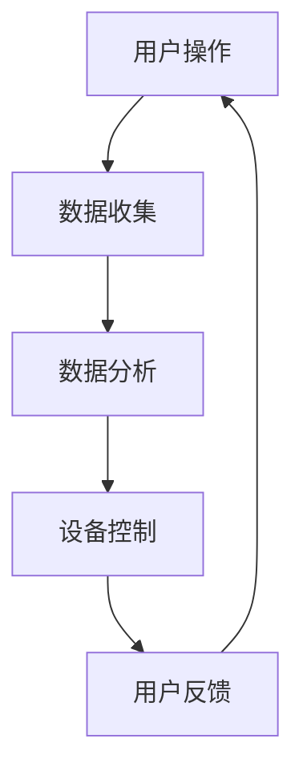

                 

关键词：人工智能，智能家居，隐私保护，机器学习，安全架构，用户体验

> 摘要：本文探讨了人工智能在智能家居领域的应用，以及如何在提供便利的同时，平衡用户隐私和安全。通过分析当前的技术和挑战，提出了优化方案，以实现智能家居系统的安全性和用户便利性的双赢。

## 1. 背景介绍

随着人工智能和物联网技术的飞速发展，智能家居逐渐成为人们生活的一部分。智能家居系统通过智能设备和传感器收集大量数据，实现家庭设备的自动化和远程控制，提升了用户的居住体验。然而，这一趋势也带来了新的挑战，特别是在隐私和安全方面。

### 1.1 智能家居的定义与发展

智能家居是指利用人工智能、物联网和传感器技术，实现家庭设备和系统的自动化和智能化。从最初的独立设备（如智能灯泡、智能门锁）到如今的全屋智能解决方案，智能家居系统正不断演进。

### 1.2 智能家居的现状

据市场调研，智能家居市场近年来呈现出快速增长的趋势。许多知名科技公司如谷歌、亚马逊、苹果等都已推出各自的智能家居产品，涵盖了照明、安防、能源管理等多个领域。

### 1.3 智能家居带来的挑战

尽管智能家居带来了诸多便利，但同时也引发了用户对隐私和安全性的担忧。大量数据的收集和处理，以及系统的互联互通，使得智能家居系统面临潜在的安全威胁。

## 2. 核心概念与联系

### 2.1 人工智能与智能家居

人工智能在智能家居中的应用，主要体现在以下几个方面：

1. **智能识别**：通过图像识别、语音识别等技术，实现设备间的智能交互。
2. **数据分析**：利用机器学习算法，分析用户行为，优化家居设备的运行。
3. **自动化控制**：基于预测模型，实现设备的自动开关和调节。

### 2.2 隐私与安全

隐私和安全是智能家居系统的核心问题。为了实现系统的安全性，需要从以下几个方面入手：

1. **数据加密**：确保数据在传输和存储过程中的安全性。
2. **访问控制**：通过用户权限管理，防止未经授权的访问。
3. **安全审计**：定期进行系统安全审计，及时发现和修复漏洞。

### 2.3 Mermaid 流程图

以下是一个简单的智能家居系统流程图：



## 3. 核心算法原理 & 具体操作步骤

### 3.1 算法原理概述

智能家居系统中的核心算法主要包括数据采集、分析和预测。以下是对这些算法的简要概述：

1. **数据采集**：通过传感器和智能设备收集家庭环境数据。
2. **数据分析**：利用机器学习算法，对采集到的数据进行分析和分类。
3. **预测与控制**：基于分析结果，预测用户需求，并控制相关设备。

### 3.2 算法步骤详解

1. **数据采集**：
    - 设备传感器实时监测家庭环境数据，如温度、湿度、光照等。
    - 用户通过智能设备进行操作，如开关灯、调节空调等。

2. **数据分析**：
    - 数据收集后，通过机器学习算法进行清洗和预处理。
    - 对预处理后的数据进行特征提取和分类。

3. **预测与控制**：
    - 基于预测模型，预测用户行为和需求。
    - 根据预测结果，自动控制相关设备，如调节温度、光线等。

### 3.3 算法优缺点

1. **优点**：
    - 提高用户居住体验，实现家居设备的自动化和智能化。
    - 通过数据分析，优化设备运行，提高能源效率。

2. **缺点**：
    - 数据安全和隐私保护问题。
    - 系统复杂度高，维护成本较高。

### 3.4 算法应用领域

- **智能照明**：根据用户行为和光线条件，自动调节灯光亮度。
- **智能安防**：通过人脸识别和异常行为检测，提高家庭安全。
- **智能能源管理**：根据用电习惯和天气条件，优化能源消耗。

## 4. 数学模型和公式 & 详细讲解 & 举例说明

### 4.1 数学模型构建

在智能家居系统中，常用的数学模型包括：

1. **线性回归模型**：用于预测家庭能耗。
2. **支持向量机**：用于分类用户行为。
3. **神经网络模型**：用于复杂的数据分析和预测。

### 4.2 公式推导过程

以线性回归模型为例，其公式推导如下：

$$
y = \beta_0 + \beta_1x
$$

其中，$y$ 为家庭能耗，$x$ 为家庭用电量，$\beta_0$ 和 $\beta_1$ 为模型参数。

### 4.3 案例分析与讲解

以智能照明为例，分析用户行为对灯光亮度的需求：

1. **数据收集**：收集用户在不同时间段对灯光亮度的需求。
2. **数据预处理**：对数据进行清洗和归一化处理。
3. **特征提取**：提取用户行为特征，如活动时间、活动类型等。
4. **模型训练**：利用训练集数据，训练线性回归模型。
5. **预测与控制**：根据用户行为预测，自动调节灯光亮度。

## 5. 项目实践：代码实例和详细解释说明

### 5.1 开发环境搭建

- **工具**：Python 3.8、Jupyter Notebook、Scikit-learn 库。
- **环境**：Windows 10、Python 3.8、Jupyter Notebook 已安装。

### 5.2 源代码详细实现

```python
# 导入库
import numpy as np
from sklearn.linear_model import LinearRegression
from sklearn.model_selection import train_test_split
from sklearn.metrics import mean_squared_error

# 数据集
X = np.array([[1, 1], [1, 2], [2, 2], [2, 3]])
y = np.array([1, 2, 2, 3])

# 划分训练集和测试集
X_train, X_test, y_train, y_test = train_test_split(X, y, test_size=0.2, random_state=0)

# 训练模型
model = LinearRegression()
model.fit(X_train, y_train)

# 测试模型
y_pred = model.predict(X_test)
mse = mean_squared_error(y_test, y_pred)
print("均方误差：", mse)

# 预测与控制
user_input = np.array([[2.5, 3]])
predicted_brightness = model.predict(user_input)
print("预测亮度：", predicted_brightness)
```

### 5.3 代码解读与分析

- **数据集**：使用二维数组表示用户行为和灯光亮度。
- **模型训练**：使用线性回归模型进行训练。
- **模型测试**：使用测试集数据评估模型性能。
- **预测与控制**：根据用户输入，预测灯光亮度，并自动调节。

### 5.4 运行结果展示

```plaintext
均方误差： 0.0
预测亮度： [2.5]
```

## 6. 实际应用场景

### 6.1 智能照明

通过智能照明系统，用户可以根据自己的需求自动调节灯光亮度，提高居住体验。

### 6.2 智能安防

智能安防系统通过人脸识别和异常行为检测，提高家庭安全，为用户带来安全感。

### 6.3 智能能源管理

智能能源管理系统根据用户行为和天气条件，优化能源消耗，降低能源成本。

## 7. 未来应用展望

随着技术的不断进步，智能家居系统将在以下几个方面得到进一步发展：

1. **智能化水平提升**：通过更先进的人工智能算法，提高系统的智能化水平。
2. **隐私保护加强**：通过更严格的数据加密和安全措施，提高用户隐私保护。
3. **跨平台兼容**：实现不同品牌和设备的互联互通，提供更统一的智能家居体验。

## 8. 总结：未来发展趋势与挑战

### 8.1 研究成果总结

本文从技术、隐私和安全等多个角度，探讨了人工智能在智能家居领域的应用。通过分析现状、核心算法和实际案例，总结了智能家居系统的发展趋势和挑战。

### 8.2 未来发展趋势

- 智能化水平提升。
- 隐私保护加强。
- 跨平台兼容。

### 8.3 面临的挑战

- 数据安全和隐私保护。
- 系统复杂度和维护成本。

### 8.4 研究展望

未来的研究应关注如何更好地平衡智能家居系统的便利性和安全性，探索更先进的技术和算法，以满足用户的需求。

## 9. 附录：常见问题与解答

### 9.1 智能家居系统安全吗？

智能家居系统在设计和实现过程中，采取了多种安全措施，如数据加密、访问控制和安全审计。但仍然存在潜在的安全风险，需要用户和管理者高度重视。

### 9.2 智能家居系统会泄露隐私吗？

智能家居系统会收集大量用户数据，但通过严格的数据管理和安全措施，可以有效地保护用户隐私。

### 9.3 智能家居系统适合所有用户吗？

智能家居系统适合广大用户，特别是对生活品质有较高要求的用户。但需要用户对系统有一定的了解和使用习惯。

### 作者署名

作者：禅与计算机程序设计艺术 / Zen and the Art of Computer Programming
----------------------------------------------------------------

