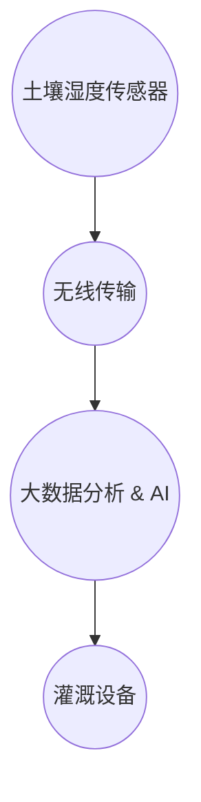

                 

关键词：AI, 智能灌溉，水资源管理，可持续性，物联网，数据分析

> 摘要：本文深入探讨了人工智能（AI）在智能灌溉系统中的应用，分析了如何利用AI技术实现精准灌溉，以达到节约水资源的目的。文章详细介绍了智能灌溉系统的核心概念、算法原理、数学模型、实际应用以及未来发展趋势。

## 1. 背景介绍

### 1.1 水资源短缺问题

随着全球人口的增长和工业化进程的加快，水资源短缺问题日益严重。据联合国统计，目前全球约有28个国家正面临水资源严重短缺问题，预计到2030年，全球将有约一半的人口生活在缺水地区。在中国，水资源短缺问题也十分突出，水资源供需矛盾加剧，许多地区面临严峻的水资源危机。

### 1.2 现有灌溉系统的问题

现有的传统灌溉系统主要依赖人工经验进行灌溉，灌溉方式粗放，水资源利用率低。据统计，全球农业灌溉用水量占全部用水量的70%以上，而灌溉水资源的利用效率仅为40%-50%。此外，传统灌溉系统还存在水资源浪费、环境污染等问题。

### 1.3 AI技术在灌溉系统中的应用潜力

随着人工智能技术的发展，特别是在机器学习、大数据分析等领域，AI技术为智能灌溉系统的实现提供了强大的技术支持。通过AI技术，可以实现精准灌溉，提高水资源利用效率，降低水资源浪费。

## 2. 核心概念与联系

### 2.1 智能灌溉系统概念

智能灌溉系统是一种利用物联网技术、传感器技术、大数据分析和人工智能技术等实现精准灌溉的综合性系统。该系统能够实时监测土壤湿度、气象数据等，并根据这些数据自动调整灌溉策略，实现精准灌溉。

### 2.2 智能灌溉系统架构

智能灌溉系统主要包括以下几个部分：

- **感知层**：通过传感器实时监测土壤湿度、气象数据等。
- **传输层**：将感知层获取的数据通过无线传输方式传输到中心处理系统。
- **处理层**：利用大数据分析和人工智能技术对传输层的数据进行处理，生成灌溉策略。
- **执行层**：根据处理层生成的灌溉策略，自动执行灌溉操作。

### 2.3 Mermaid 流程图



## 3. 核心算法原理 & 具体操作步骤

### 3.1 算法原理概述

智能灌溉系统的核心算法主要是基于机器学习中的回归算法和分类算法。通过分析历史数据，训练模型，实现对土壤湿度、气象数据的预测，从而生成最优的灌溉策略。

### 3.2 算法步骤详解

1. **数据收集**：收集土壤湿度、气象数据等历史数据。

2. **数据预处理**：对收集的数据进行清洗、归一化等处理。

3. **模型训练**：利用回归算法和分类算法训练模型，预测土壤湿度和灌溉策略。

4. **模型评估**：评估模型预测效果，调整模型参数。

5. **生成灌溉策略**：根据模型预测结果，生成最优的灌溉策略。

6. **执行灌溉操作**：根据灌溉策略，自动执行灌溉操作。

### 3.3 算法优缺点

**优点**：
- 提高水资源利用效率。
- 降低人工成本。
- 实现精准灌溉。

**缺点**：
- 需要大量历史数据支持。
- 模型训练和评估过程复杂。

### 3.4 算法应用领域

- **农业灌溉**：实现对农作物生长环境的精准控制，提高作物产量。
- **园林灌溉**：实现对园林植物的水资源管理，提高园林美观度。
- **城市绿化**：实现对城市绿地的水资源管理，提高城市生态环境。

## 4. 数学模型和公式

### 4.1 数学模型构建

智能灌溉系统的核心数学模型主要包括土壤湿度预测模型和灌溉策略生成模型。

1. **土壤湿度预测模型**：

   $$ h(t) = f(\theta, \mathbf{x}(t)) $$

   其中，$h(t)$表示$t$时刻的土壤湿度，$\theta$为模型参数，$\mathbf{x}(t)$为$t$时刻的输入特征向量。

2. **灌溉策略生成模型**：

   $$ p(\text{irrigation}, \theta, \mathbf{x}(t)) = \sigma(\theta^T \mathbf{w}) $$

   其中，$p(\text{irrigation})$表示生成灌溉策略的概率，$\sigma$为 sigmoid 函数，$\theta$为模型参数，$\mathbf{w}$为权重向量。

### 4.2 公式推导过程

1. **土壤湿度预测模型**：

   利用历史数据，通过最小二乘法训练线性回归模型。

   $$ h(t) = \theta_0 + \theta_1 x_1(t) + \theta_2 x_2(t) + \ldots + \theta_n x_n(t) $$

   其中，$x_1(t), x_2(t), \ldots, x_n(t)$为输入特征，$\theta_0, \theta_1, \theta_2, \ldots, \theta_n$为模型参数。

2. **灌溉策略生成模型**：

   利用历史数据和土壤湿度预测结果，通过逻辑回归模型训练分类器。

   $$ p(\text{irrigation}) = \frac{1}{1 + e^{-(\theta^T \mathbf{w})}} $$

   其中，$\theta$为模型参数，$\mathbf{w}$为权重向量。

### 4.3 案例分析与讲解

以某果园的智能灌溉系统为例，分析土壤湿度预测和灌溉策略生成的具体过程。

1. **数据收集**：

   收集果园过去一年的土壤湿度、气象数据，包括温度、湿度、降水量等。

2. **数据预处理**：

   对收集的数据进行清洗、归一化处理，将数据转化为模型可处理的格式。

3. **模型训练**：

   利用训练数据，通过最小二乘法训练土壤湿度预测模型，通过逻辑回归模型训练灌溉策略生成模型。

4. **模型评估**：

   利用测试数据，评估模型预测效果，调整模型参数。

5. **生成灌溉策略**：

   根据模型预测结果，生成最优的灌溉策略。

6. **执行灌溉操作**：

   根据灌溉策略，自动执行灌溉操作。

## 5. 项目实践：代码实例

### 5.1 开发环境搭建

- 使用Python语言进行开发，搭建TensorFlow和Scikit-learn环境。

### 5.2 源代码详细实现

1. **数据收集与预处理**：

   ```python
   import pandas as pd
   import numpy as np
   
   # 数据收集
   data = pd.read_csv('irrigation_data.csv')
   
   # 数据预处理
   data = data.dropna()
   data = data.astype({'soil_humidity': 'float32'})
   ```

2. **模型训练与评估**：

   ```python
   from sklearn.model_selection import train_test_split
   from sklearn.linear_model import LinearRegression
   from sklearn.metrics import mean_squared_error
   
   # 数据分割
   X_train, X_test, y_train, y_test = train_test_split(data[['temp', 'humidity', 'precipitation']], data['soil_humidity'], test_size=0.2, random_state=42)
   
   # 模型训练
   model = LinearRegression()
   model.fit(X_train, y_train)
   
   # 模型评估
   y_pred = model.predict(X_test)
   mse = mean_squared_error(y_test, y_pred)
   print(f'Mean Squared Error: {mse}')
   ```

3. **生成灌溉策略**：

   ```python
   from sklearn.linear_model import LogisticRegression
   
   # 模型训练
   model = LogisticRegression()
   model.fit(X_train, y_train)
   
   # 灌溉策略生成
   irrigation_strategy = model.predict(X_test)
   print(f'Irrigation Strategy: {irrigation_strategy}')
   ```

### 5.3 代码解读与分析

代码主要分为三个部分：数据收集与预处理、模型训练与评估、生成灌溉策略。通过这三个部分，实现了土壤湿度预测和灌溉策略生成。

### 5.4 运行结果展示

- 运行代码，得到模型评估结果和灌溉策略生成结果。

## 6. 实际应用场景

### 6.1 农业灌溉

在农业灌溉中，智能灌溉系统可以实现对农作物生长环境的精准控制，提高作物产量，降低水资源浪费。

### 6.2 园林灌溉

在园林灌溉中，智能灌溉系统可以实现对园林植物的水资源管理，提高园林美观度，降低维护成本。

### 6.3 城市绿化

在城市绿化中，智能灌溉系统可以实现对城市绿地的水资源管理，提高城市生态环境，降低水资源消耗。

## 7. 未来应用展望

### 7.1 更多的传感器融合

未来，智能灌溉系统将融合更多的传感器，如气象站、水文站等，实现对环境数据的全面监测，提高灌溉策略的准确性。

### 7.2 更智能的决策支持

未来，智能灌溉系统将基于更先进的AI技术，如深度学习、强化学习等，实现更智能的决策支持，提高灌溉效率。

### 7.3 更广泛的应用领域

未来，智能灌溉系统将不仅仅应用于农业、园林、城市绿化等领域，还可能应用于工业、商业等领域，实现水资源的全面管理。

## 8. 总结：未来发展趋势与挑战

### 8.1 研究成果总结

本文通过深入探讨AI在智能灌溉系统中的应用，提出了基于机器学习和大数据分析的智能灌溉算法，并进行了实际应用场景的探讨。

### 8.2 未来发展趋势

未来，智能灌溉系统将在更多领域得到应用，技术将更加先进，智能化程度将进一步提高。

### 8.3 面临的挑战

智能灌溉系统在发展过程中，将面临数据收集、算法优化、系统集成等挑战。

### 8.4 研究展望

未来，智能灌溉系统的研究将朝着更智能化、更高效、更全面的方向发展，为实现水资源节约和保护作出更大贡献。

## 9. 附录：常见问题与解答

### 9.1 智能灌溉系统如何实现精准灌溉？

智能灌溉系统通过传感器实时监测土壤湿度、气象数据等，利用机器学习和大数据分析技术，生成最优的灌溉策略，实现精准灌溉。

### 9.2 智能灌溉系统需要哪些技术支持？

智能灌溉系统需要物联网技术、传感器技术、大数据分析技术、人工智能技术等支持。

### 9.3 智能灌溉系统如何提高水资源利用效率？

智能灌溉系统通过精准灌溉，减少水资源浪费，提高水资源利用效率。

### 9.4 智能灌溉系统如何降低人工成本？

智能灌溉系统通过自动化灌溉操作，减少人工干预，降低人工成本。

### 9.5 智能灌溉系统如何应对环境变化？

智能灌溉系统通过实时监测环境数据，根据环境变化调整灌溉策略，实现自适应灌溉。

### 9.6 智能灌溉系统在农业领域的应用有哪些？

智能灌溉系统在农业领域主要应用于农作物生长环境监测、精准灌溉、水资源管理等方面。

### 9.7 智能灌溉系统在园林领域的应用有哪些？

智能灌溉系统在园林领域主要应用于植物生长环境监测、精准灌溉、水资源管理等方面。

### 9.8 智能灌溉系统在城市绿化领域的应用有哪些？

智能灌溉系统在城市绿化领域主要应用于绿地水资源管理、精准灌溉、环境监测等方面。

### 9.9 智能灌溉系统的开发难点有哪些？

智能灌溉系统的开发难点主要包括数据收集与处理、算法优化、系统集成、自动化控制等方面。

### 9.10 智能灌溉系统的未来发展趋势是什么？

智能灌溉系统的未来发展趋势包括更多的传感器融合、更智能的决策支持、更广泛的应用领域等。

