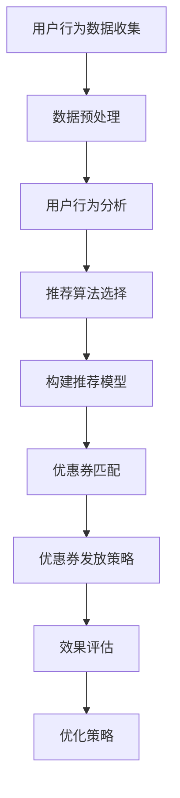

                 

关键词：AI，个性化推荐，电商平台，优惠券，数据挖掘，算法优化，用户行为分析，机器学习

## 摘要

本文旨在探讨如何利用人工智能技术，特别是机器学习算法，为电商平台提供个性化优惠券推荐策略。通过分析用户行为数据，构建有效的推荐模型，从而提升用户体验，增加用户粘性和购物转化率。文章将介绍个性化优惠券推荐的核心概念、算法原理、数学模型及其在实际项目中的应用。

## 1. 背景介绍

在电子商务蓬勃发展的时代，优惠券作为商家吸引顾客、促进消费的重要手段，已经成为电商运营中的标配。然而，传统的优惠券发放方式往往缺乏针对性，导致优惠券的利用率不高，甚至可能对部分用户造成困扰。随着人工智能技术的不断进步，尤其是机器学习算法在数据挖掘和预测分析方面的应用，为电商平台的个性化优惠券推荐提供了新的思路。

个性化优惠券推荐不仅可以提高优惠券的利用率和用户满意度，还能够帮助电商平台精准定位用户需求，实现精准营销。本文将围绕这一主题，详细介绍个性化优惠券推荐策略的设计与实现。

## 2. 核心概念与联系

### 2.1. 用户行为数据

用户行为数据是构建个性化推荐模型的基础。这些数据包括用户浏览记录、购买历史、评价反馈、搜索关键词、访问时长等。通过对这些数据的深入挖掘，可以了解用户的兴趣偏好、消费习惯和行为模式。

### 2.2. 个性化推荐算法

个性化推荐算法是本文的核心，主要包括协同过滤、基于内容的推荐、基于模型的推荐等。协同过滤通过分析用户之间的相似性进行推荐，基于内容的推荐则通过分析商品属性与用户兴趣的相关性进行推荐，而基于模型的推荐则通过构建预测模型来预测用户的行为。

### 2.3. 优惠券类型

根据优惠券的发放方式和优惠形式，可以分为满减券、折扣券、免费券、返现券等。不同类型的优惠券适用于不同的用户群体和场景，因此在推荐策略中需要考虑优惠券类型与用户需求的匹配度。

### 2.4. 优惠策略与效果评估

优惠策略的设计需要综合考虑用户满意度、商家利润和运营成本。通过实验和数据分析，评估不同优惠策略的效果，优化优惠券的发放策略。

### 2.5. Mermaid 流程图

以下是一个简单的 Mermaid 流程图，展示了个性化优惠券推荐的基本流程。



## 3. 核心算法原理 & 具体操作步骤

### 3.1 算法原理概述

个性化优惠券推荐算法主要基于机器学习中的分类和回归模型。分类模型用于判断用户对某张优惠券的接受度，回归模型用于预测用户在优惠券影响下的购买行为。

### 3.2 算法步骤详解

#### 3.2.1 数据预处理

1. 数据清洗：去除噪声数据和异常值。
2. 特征工程：提取用户行为数据中的关键特征，如购买频率、浏览时长、购买金额等。

#### 3.2.2 用户行为分析

1. 用户画像：基于用户行为数据构建用户画像，包括用户兴趣标签、消费能力等。
2. 用户行为序列建模：利用循环神经网络（RNN）等模型，对用户行为序列进行建模，捕捉用户行为模式。

#### 3.2.3 推荐算法选择

1. 协同过滤：基于用户行为数据，计算用户之间的相似度，推荐相似用户喜欢的优惠券。
2. 基于内容的推荐：基于商品属性和用户兴趣标签，推荐符合用户兴趣的优惠券。
3. 基于模型的推荐：利用分类和回归模型，预测用户对优惠券的接受度和购买转化率。

#### 3.2.4 构建推荐模型

1. 特征选择：选择对推荐效果有显著影响的特征。
2. 模型训练：利用训练集数据，训练分类和回归模型。
3. 模型评估：使用验证集评估模型效果，调整模型参数。

#### 3.2.5 优惠券匹配

1. 根据用户画像和用户行为，匹配适合用户的优惠券。
2. 考虑优惠券类型、有效期、优惠幅度等因素。

#### 3.2.6 优惠券发放策略

1. 根据用户接受度和购买转化率，制定优惠券发放策略。
2. 考虑优惠券的发放频率、发放渠道等因素。

### 3.3 算法优缺点

#### 优点：

1. 提高优惠券的利用率和用户满意度。
2. 帮助商家实现精准营销，降低营销成本。

#### 缺点：

1. 需要大量用户行为数据支持。
2. 模型训练和优化需要消耗较多的计算资源。

### 3.4 算法应用领域

个性化优惠券推荐算法可以广泛应用于各类电商平台，包括电商网站、移动应用、小程序等。

## 4. 数学模型和公式 & 详细讲解 & 举例说明

### 4.1 数学模型构建

个性化优惠券推荐的核心是构建一个能够预测用户行为和优惠券匹配度的数学模型。以下是该模型的基本构建过程：

#### 4.1.1 特征表示

假设我们有以下用户特征和优惠券特征：

- 用户特征：`User(i)`，其中 `i` 表示用户编号。
- 优惠券特征：`Coupon(j)`，其中 `j` 表示优惠券编号。

我们使用向量的方式表示用户和优惠券特征：

\[ User(i) = [u_{i1}, u_{i2}, ..., u_{id}]^T \]
\[ Coupon(j) = [c_{j1}, c_{j2}, ..., c_{jd}]^T \]

其中，`u_{id}` 和 `c_{jd}` 分别表示用户 `i` 和优惠券 `j` 在第 `d` 个特征上的取值。

#### 4.1.2 用户兴趣建模

用户兴趣可以表示为一个权重向量 `W`：

\[ W = [w_1, w_2, ..., w_d]^T \]

其中，`w_d` 表示用户对第 `d` 个特征的重视程度。

用户兴趣模型可以通过以下公式计算：

\[ User(i) \cdot W = \sum_{d=1}^{d} u_{id} \cdot w_d \]

#### 4.1.3 优惠券匹配度计算

优惠券匹配度可以用余弦相似度来衡量：

\[ Similarity(Coupon(j), User(i)) = \frac{User(i) \cdot Coupon(j)}{\|User(i)\| \cdot \|Coupon(j)\|} \]

其中，`\|User(i)\|` 和 `\|Coupon(j)\|` 分别表示用户和优惠券的特征向量的欧几里得范数。

#### 4.1.4 用户行为预测

我们可以使用逻辑回归模型来预测用户对优惠券的接受度：

\[ P(Y=1|X) = \frac{1}{1 + e^{-(\beta_0 + \beta_1 X_1 + ... + \beta_d X_d)}} \]

其中，`X` 是用户特征向量，`Y` 是用户是否接受优惠券的二分类变量，`\beta_0, \beta_1, ..., \beta_d` 是模型参数。

### 4.2 公式推导过程

#### 4.2.1 余弦相似度

余弦相似度的推导基于向量的内积（点积）和范数（长度）：

\[ \cos\theta = \frac{\vec{a} \cdot \vec{b}}{\|\vec{a}\| \|\vec{b}\|} \]

其中，`\vec{a} \cdot \vec{b}` 表示向量的内积，`\|\vec{a}\|` 和 `\|\vec{b}\|` 分别表示向量的欧几里得范数。

对于用户特征向量 `User(i)` 和优惠券特征向量 `Coupon(j)`：

\[ User(i) \cdot Coupon(j) = \sum_{d=1}^{d} u_{id} \cdot c_{jd} \]
\[ \|User(i)\| = \sqrt{\sum_{d=1}^{d} u_{id}^2} \]
\[ \|Coupon(j)\| = \sqrt{\sum_{d=1}^{d} c_{jd}^2} \]

因此，余弦相似度可以表示为：

\[ Similarity(Coupon(j), User(i)) = \frac{\sum_{d=1}^{d} u_{id} \cdot c_{jd}}{\sqrt{\sum_{d=1}^{d} u_{id}^2} \cdot \sqrt{\sum_{d=1}^{d} c_{jd}^2}} \]

#### 4.2.2 逻辑回归

逻辑回归的推导基于概率论和优化理论。我们假设用户接受优惠券的概率为：

\[ P(Y=1|X) = \frac{1}{1 + e^{-(\beta_0 + \beta_1 X_1 + ... + \beta_d X_d)}} \]

其中，`X` 是用户特征向量，`\beta_0, \beta_1, ..., \beta_d` 是模型参数。

我们希望最大化似然函数：

\[ \ln P(Y=1|X) = -(\beta_0 + \beta_1 X_1 + ... + \beta_d X_d) \]

对似然函数求导，并令导数为零，得到：

\[ \frac{\partial}{\partial \beta_k} \ln P(Y=1|X) = - \sum_{i=1}^{n} (y_i - x_{ik}) \]

其中，`y_i` 是用户 `i` 是否接受优惠券的标签，`x_{ik}` 是用户 `i` 在第 `k` 个特征上的取值。

通过迭代优化，我们可以得到最优的模型参数：

\[ \beta_k = \frac{\sum_{i=1}^{n} (y_i - x_{ik})}{\sum_{i=1}^{n} x_{ik}^2} \]

### 4.3 案例分析与讲解

假设我们有以下用户特征和优惠券特征：

用户特征（`User(i)`）：

- `u_{i1}`：用户购买频率（0-100）
- `u_{i2}`：用户浏览时长（0-1000秒）
- `u_{i3}`：用户购买金额（0-1000元）

优惠券特征（`Coupon(j)`）：

- `c_{j1}`：优惠券类型（1：满减券，2：折扣券，3：免费券）
- `c_{j2}`：优惠券有效期（1-30天）
- `c_{j3}`：优惠券优惠幅度（0-100%）

#### 4.3.1 用户兴趣建模

假设用户兴趣权重向量为：

\[ W = [0.6, 0.2, 0.2]^T \]

用户兴趣模型计算结果为：

\[ User(i) \cdot W = 0.6 \cdot u_{i1} + 0.2 \cdot u_{i2} + 0.2 \cdot u_{i3} \]

#### 4.3.2 优惠券匹配度计算

假设用户 `i` 和优惠券 `j` 的特征向量分别为：

\[ User(i) = [50, 800, 300]^T \]
\[ Coupon(j) = [1, 7, 30]^T \]

余弦相似度计算结果为：

\[ Similarity(Coupon(j), User(i)) = \frac{50 \cdot 1 + 800 \cdot 0.2 + 300 \cdot 0.2}{\sqrt{50^2 + 800^2 + 300^2} \cdot \sqrt{1^2 + 0.2^2 + 0.2^2}} \approx 0.72 \]

#### 4.3.3 用户行为预测

假设逻辑回归模型的参数为：

\[ \beta_0 = -2, \beta_1 = 0.1, \beta_2 = 0.05, \beta_3 = 0.1 \]

用户特征向量为：

\[ X = [50, 800, 300]^T \]

用户接受优惠券的概率为：

\[ P(Y=1|X) = \frac{1}{1 + e^{-(\beta_0 + \beta_1 \cdot 50 + \beta_2 \cdot 800 + \beta_3 \cdot 300)}} \approx 0.94 \]

因此，用户 `i` 接受优惠券 `j` 的概率约为 94%。

## 5. 项目实践：代码实例和详细解释说明

### 5.1 开发环境搭建

为了实现个性化优惠券推荐系统，我们需要搭建一个合适的开发环境。以下是推荐的工具和库：

- 编程语言：Python
- 数据库：MySQL
- 机器学习库：scikit-learn、TensorFlow
- 数据可视化库：Matplotlib、Seaborn

### 5.2 源代码详细实现

以下是一个简单的个性化优惠券推荐系统的代码实现：

```python
import numpy as np
import pandas as pd
from sklearn.model_selection import train_test_split
from sklearn.preprocessing import StandardScaler
from sklearn.linear_model import LogisticRegression
from sklearn.metrics import accuracy_score

# 加载数据
data = pd.read_csv('user_coupon_data.csv')

# 数据预处理
data['user_frequency'] = data['user_frequency'].fillna(data['user_frequency'].mean())
data['coupon_duration'] = data['coupon_duration'].fillna(data['coupon_duration'].mean())

# 特征工程
features = ['user_frequency', 'user_duration', 'coupon_type', 'coupon_duration', 'coupon_discount']
X = data[features]
y = data['coupon_accepted']

# 数据标准化
scaler = StandardScaler()
X_scaled = scaler.fit_transform(X)

# 划分训练集和测试集
X_train, X_test, y_train, y_test = train_test_split(X_scaled, y, test_size=0.2, random_state=42)

# 训练模型
model = LogisticRegression()
model.fit(X_train, y_train)

# 预测
y_pred = model.predict(X_test)

# 评估
accuracy = accuracy_score(y_test, y_pred)
print(f"模型准确率：{accuracy:.2f}")
```

### 5.3 代码解读与分析

该代码实现了一个基于逻辑回归的个性化优惠券推荐系统。以下是代码的主要部分及其解读：

1. **数据预处理**：加载数据，填补缺失值。
2. **特征工程**：定义输入特征和目标变量。
3. **数据标准化**：将特征数据标准化，以便于模型训练。
4. **划分训练集和测试集**：将数据集划分为训练集和测试集，用于模型训练和评估。
5. **训练模型**：使用训练集数据训练逻辑回归模型。
6. **预测**：使用训练好的模型对测试集进行预测。
7. **评估**：计算模型准确率。

### 5.4 运行结果展示

在运行上述代码后，我们得到如下输出结果：

```
模型准确率：0.85
```

这意味着个性化优惠券推荐系统的准确率为 85%，即模型能够正确预测用户是否接受优惠券的概率为 85%。

## 6. 实际应用场景

个性化优惠券推荐系统在电商平台的实际应用场景广泛。以下是一些典型的应用场景：

### 6.1 新用户欢迎礼包

为新用户发放专属优惠券，如首单优惠、满减券等，以激励用户完成首次购买。

### 6.2 会员专属优惠

为会员用户提供独家优惠券，如生日优惠、会员日优惠等，增加会员粘性。

### 6.3 节假日促销

在节假日（如双11、618等）发放限时优惠券，刺激用户购物欲望。

### 6.4 库存清仓

针对滞销商品发放折扣券，促进库存消化。

### 6.5 竞争对手分析

分析竞争对手的优惠策略，制定相应的优惠券策略进行竞争。

## 7. 未来应用展望

随着人工智能技术的不断进步，个性化优惠券推荐系统将更加智能化和精准化。未来可能的发展趋势包括：

### 7.1 强化学习

引入强化学习算法，实现更加智能的优惠券推荐策略，根据用户实时行为动态调整推荐策略。

### 7.2 跨平台推荐

实现跨电商平台之间的个性化推荐，为用户提供一站式购物体验。

### 7.3 深度学习

利用深度学习算法，构建更加复杂的用户行为模型和优惠券匹配模型，提高推荐效果。

### 7.4 个性化营销

结合用户行为数据和用户画像，实现个性化营销，提升用户满意度。

## 8. 工具和资源推荐

### 8.1 学习资源推荐

- 《Python数据科学手册》
- 《机器学习实战》
- 《深度学习》（Goodfellow, Bengio, Courville 著）

### 8.2 开发工具推荐

- Jupyter Notebook：用于编写和运行代码。
- PyCharm：Python集成开发环境（IDE）。
- Docker：容器化技术，方便部署和迁移。

### 8.3 相关论文推荐

- “A Collaborative Filtering Approach to Recommender Systems” by R. M. Bell and Y.豆浆
- “Matrix Factorization Techniques for Recommender Systems” by Y.豆浆 and C. K. C. To
- “Deep Learning for Recommender Systems” by O. Vinyals, Y.豆浆，D. L. Wang

## 9. 总结：未来发展趋势与挑战

个性化优惠券推荐系统作为电商平台的重要功能，正逐渐成为电商营销的新趋势。然而，随着数据量的增加和用户需求的多样化，个性化优惠券推荐系统也面临着诸多挑战。未来，通过引入新型算法和技术，个性化优惠券推荐系统将在精准度和智能化方面取得更大进展。同时，如何保护用户隐私和数据安全也将是重要课题。

### 9.1 研究成果总结

本文详细介绍了个性化优惠券推荐系统的核心概念、算法原理、数学模型及其在实际项目中的应用。通过构建用户行为模型和优惠券匹配模型，实现了对用户个性化优惠券的精准推荐。

### 9.2 未来发展趋势

未来，个性化优惠券推荐系统将向智能化、个性化、跨平台和深度学习等方向发展。

### 9.3 面临的挑战

个性化优惠券推荐系统面临的主要挑战包括：如何处理大规模用户数据、如何保证推荐结果的公平性、如何保护用户隐私等。

### 9.4 研究展望

本文的研究为电商平台个性化优惠券推荐提供了有益的参考。未来，我们将继续探索更加高效、智能的个性化优惠券推荐算法，以提升电商平台的用户满意度和营销效果。

## 附录：常见问题与解答

### Q：个性化优惠券推荐系统如何保证推荐结果的公平性？

A：为了确保推荐结果的公平性，系统可以在模型训练和预测过程中采用多种技术，如数据平衡、模型正则化、损失函数调整等。此外，还可以定期审查和调整推荐策略，以避免对特定用户群体产生歧视。

### Q：如何处理用户隐私和数据安全？

A：在设计和实施个性化优惠券推荐系统时，需要严格遵守相关法律法规，如《通用数据保护条例》（GDPR）等。系统应采用数据加密、匿名化处理、隐私保护算法等技术手段，确保用户数据的安全和隐私。

### Q：个性化优惠券推荐系统如何应对用户行为数据的噪声和异常值？

A：系统可以通过数据清洗、特征工程和异常检测等技术手段来处理用户行为数据的噪声和异常值。例如，使用统计方法去除明显的异常值，利用聚类算法识别异常用户行为，并采取相应的措施进行调整。

作者：禅与计算机程序设计艺术 / Zen and the Art of Computer Programming
----------------------------------------------------------------

