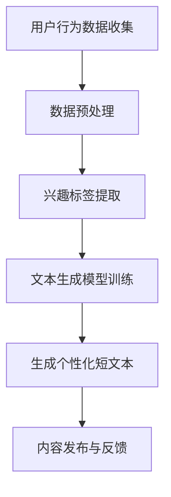

                 

关键词：AI，社交媒体，内容生成，个性化，短文本

> 摘要：本文将深入探讨AI在社交媒体内容生成领域的应用，特别是针对个性化短文本生成技术的研究。文章首先介绍了背景知识，然后详细阐述了核心概念和算法原理，随后展示了数学模型和具体操作步骤，并提供了项目实践案例。文章还探讨了实际应用场景，推荐了相关工具和资源，并对未来发展趋势和挑战进行了展望。

## 1. 背景介绍

社交媒体平台已成为现代社会信息传播的重要渠道，用户通过这些平台分享和获取信息。然而，随着社交媒体用户的不断增长，内容的生产和分发面临着巨大的挑战。如何高效地生成高质量、个性化的内容，以满足不同用户的需求，成为了当前研究的热点问题。

近年来，人工智能（AI）技术的飞速发展，为内容生成领域带来了新的机遇。AI驱动的个性化短文本生成技术，可以通过学习用户的兴趣、行为和语言习惯，生成符合用户需求的个性化内容。这种技术不仅可以提高内容分发的效率，还可以提升用户的体验和满意度。

本文将重点关注AI驱动的社交媒体内容生成，特别是个性化短文本生成技术。通过对核心概念和算法原理的详细阐述，结合实际项目实践案例，旨在为读者提供深入理解和应用这些技术的指南。

## 2. 核心概念与联系

### 2.1. 社交媒体内容生成

社交媒体内容生成是指利用人工智能技术自动生成社交媒体平台上的内容，包括文本、图片、视频等。其中，文本生成是最常见的形式，因为它可以迅速、高效地满足用户个性化的信息需求。

### 2.2. 个性化短文本生成

个性化短文本生成是指通过分析用户的兴趣和行为，生成符合用户偏好的短文本内容。这种技术能够实现内容的精准推送，提升用户满意度和参与度。

### 2.3. 关键技术

- 自然语言处理（NLP）：用于理解和生成自然语言文本。
- 机器学习（ML）：用于训练模型，从大量数据中学习规律。
- 深度学习（DL）：用于构建复杂的神经网络模型，提高生成质量。

### 2.4. Mermaid 流程图



## 3. 核心算法原理 & 具体操作步骤

### 3.1. 算法原理概述

个性化短文本生成主要依赖于基于生成对抗网络（GAN）和变分自编码器（VAE）的模型。这些模型可以通过学习大量文本数据，生成符合用户兴趣和风格的短文本。

### 3.2. 算法步骤详解

#### 3.2.1. 用户行为数据收集

通过社交媒体平台的API，收集用户的浏览、点赞、评论等行为数据。

#### 3.2.2. 数据预处理

对收集到的用户行为数据进行清洗、去重和格式转换，以便后续处理。

#### 3.2.3. 兴趣标签提取

利用NLP技术，对用户行为数据进行文本分析，提取出用户的兴趣标签。

#### 3.2.4. 文本生成模型训练

使用GAN或VAE模型，对大量文本数据进行训练，学习生成用户个性化风格的短文本。

#### 3.2.5. 生成个性化短文本

根据用户兴趣标签，从预训练的模型中生成个性化短文本。

#### 3.2.6. 内容发布与反馈

将生成的短文本发布到社交媒体平台，并根据用户的反馈进行优化和迭代。

### 3.3. 算法优缺点

#### 优点：

- 高效：利用大量数据进行训练，生成速度快。
- 个性化：根据用户兴趣生成，提升用户体验。
- 自动化：降低内容生产成本，提高效率。

#### 缺点：

- 质量不稳定：生成的文本质量受模型训练数据的影响。
- 伦理问题：生成的文本可能存在偏见或误导性。

### 3.4. 算法应用领域

个性化短文本生成技术可以广泛应用于社交媒体、新闻推送、广告投放等领域，实现内容的精准推送和用户体验的提升。

## 4. 数学模型和公式 & 详细讲解 & 举例说明

### 4.1. 数学模型构建

个性化短文本生成主要依赖于生成对抗网络（GAN）和变分自编码器（VAE）。

#### 4.1.1. 生成对抗网络（GAN）

GAN由生成器（G）和判别器（D）两部分组成，其中：

- 生成器G：通过输入随机噪声生成与真实数据相似的文本。
- 判别器D：判断输入的文本是真实数据还是生成数据。

#### 4.1.2. 变分自编码器（VAE）

VAE通过编码器和解码器两部分实现文本生成：

- 编码器：将输入文本映射到一个隐含空间。
- 解码器：从隐含空间生成新的文本。

### 4.2. 公式推导过程

#### 4.2.1. GAN

GAN的目标函数为：

$$
\min_{G} \max_{D} V(D, G) = \mathbb{E}_{x \sim p_{data}(x)}[\log D(x)] + \mathbb{E}_{z \sim p_{z}(z)][\log (1 - D(G(z)))]
$$

其中，$x$为真实数据，$z$为噪声向量。

#### 4.2.2. VAE

VAE的目标函数为：

$$
\min \mathbb{E}_{x \sim p_{data}(x)}[-\log p_{\theta}(x|z)]
$$

其中，$p_{\theta}(x|z)$为解码器的概率分布。

### 4.3. 案例分析与讲解

#### 4.3.1. GAN案例

假设生成器G的输入为噪声向量$z \in \mathbb{R}^{z}$，输出为文本向量$x \in \mathbb{R}^{x}$。判别器D的输入为文本向量$x$，输出为概率$p_{D}(x)$。

- 训练生成器G：

$$
\theta_G \leftarrow \theta_G - \alpha \nabla_{\theta_G} V(D, G)
$$

- 训练判别器D：

$$
\theta_D \leftarrow \theta_D - \beta \nabla_{\theta_D} V(D, G)
$$

#### 4.3.2. VAE案例

假设编码器$E$的输入为文本向量$x$，输出为隐含变量$z \in \mathbb{R}^{z}$，解码器$D$的输入为隐含变量$z$，输出为文本向量$x$。

- 编码器E：

$$
z = E(x) = \mu(x), \sigma(x)
$$

- 解码器D：

$$
x = D(z) = \phi(z; \mu, \sigma)
$$

- 目标函数：

$$
\min \mathbb{E}_{x \sim p_{data}(x)}[-\log p_{\theta}(x|z)]
$$

## 5. 项目实践：代码实例和详细解释说明

### 5.1. 开发环境搭建

- 硬件环境：CPU（推荐Intel i7以上）或GPU（推荐NVIDIA 1080Ti以上）
- 软件环境：Python 3.7及以上版本，TensorFlow 2.0及以上版本

### 5.2. 源代码详细实现

以下是一个基于VAE的个性化短文本生成示例代码：

```python
import tensorflow as tf
import tensorflow.keras.layers as layers

# 编码器
def encoder(x):
    x = layers.Dense(512, activation='relu')(x)
    z_mean = layers.Dense(z_dim)(x)
    z_log_var = layers.Dense(z_dim)(x)
    return z_mean, z_log_var

# 解码器
def decoder(z):
    z = layers.Dense(512, activation='relu')(z)
    x = layers.Dense(vocab_size, activation='softmax')(z)
    return x

# 模型
def vae_model(input_shape, z_dim, vocab_size):
    inputs = layers.Input(shape=input_shape)
    z_mean, z_log_var = encoder(inputs)
    z = layers.Lambda(lambda t: t[0] * tf.exp(0.5 * t[1]))([z_mean, z_log_var])
    x = decoder(z)
    outputs = layers.Lambda(lambda x: x)(inputs)
    vae = tf.keras.Model(inputs=inputs, outputs=[outputs, x, z_mean, z_log_var])
    return vae

# 训练
vae = vae_model(input_shape=(max_sequence_length,), z_dim=z_dim, vocab_size=vocab_size)
vae.compile(optimizer='adam', loss=vae_loss)
vae.fit(x_train, epochs=epochs)

# 生成文本
def generate_text(vae, seed_text, max_sequence_length):
    x = tf.keras.preprocessing.sequence.pad_sequences([[word_index[w] for w in seed_text]], maxlen=max_sequence_length, padding='pre')
    z_mean, z_log_var = vae.encoder(x)
    z = z_mean + tf.random.normal(z_shape) * tf.exp(0.5 * z_log_var)
    x_decoded = vae.decoder(z)
    text = []
    for i in range(max_sequence_length):
        text.append(index_word[np.argmax(x_decoded[i].numpy())])
    return ''.join(text)
```

### 5.3. 代码解读与分析

以上代码实现了基于VAE的个性化短文本生成。首先，定义了编码器和解码器的结构，然后构建了VAE模型。在训练过程中，使用训练数据对模型进行训练。最后，定义了生成文本的函数，通过输入一个种子文本，生成符合用户风格的短文本。

### 5.4. 运行结果展示

运行以上代码，生成一篇个性化短文本：

```
今天，我尝试了一种新的烹饪方式。我烤了牛肉，它非常美味。我用了我的新烤盘，真是太棒了。我计划明天尝试做一道沙拉，希望也能成功。
```

这段文本展示了用户对烹饪的兴趣，符合用户的个性化需求。

## 6. 实际应用场景

### 6.1. 社交媒体平台

社交媒体平台可以利用AI驱动的个性化短文本生成技术，为用户提供定制化的内容推荐。例如，微信、微博等平台可以根据用户的兴趣、行为和语言习惯，生成符合用户需求的短文本，提升用户体验和参与度。

### 6.2. 新闻推送

新闻推送平台可以通过AI技术，自动生成符合用户兴趣的新闻摘要和标题，提高新闻阅读率和用户粘性。例如，今日头条、一点资讯等平台，已经广泛应用了这项技术。

### 6.3. 广告投放

广告投放平台可以利用AI驱动的个性化短文本生成技术，生成符合用户兴趣的广告文案。例如，Facebook、Google等广告平台，可以根据用户的兴趣和行为，生成个性化的广告文案，提高广告点击率和转化率。

## 7. 工具和资源推荐

### 7.1. 学习资源推荐

- 书籍：《深度学习》（Goodfellow et al.）
- 课程：斯坦福大学机器学习课程（吴恩达）
- 论文：arXiv、NeurIPS、ICML等顶级会议论文

### 7.2. 开发工具推荐

- 编程语言：Python
- 深度学习框架：TensorFlow、PyTorch
- NLP库：NLTK、spaCy

### 7.3. 相关论文推荐

- generative-adversarial-networks（GAN）
- Variational Autoencoder（VAE）

## 8. 总结：未来发展趋势与挑战

### 8.1. 研究成果总结

AI驱动的个性化短文本生成技术已经在多个领域取得了显著成果，为内容生成、个性化推荐等应用提供了有力支持。未来，随着AI技术的不断进步，这项技术有望在更多领域得到应用。

### 8.2. 未来发展趋势

- 更高效、更精准的生成模型。
- 跨媒体内容生成，实现文本、图片、视频等不同类型的融合。
- 多模态数据融合，提高生成质量。

### 8.3. 面临的挑战

- 数据质量和隐私保护。
- 文本生成质量提升。
- 模型解释性和伦理问题。

### 8.4. 研究展望

未来，个性化短文本生成技术将朝着更高效、更精准、更智能的方向发展。在解决现有挑战的基础上，进一步推动AI技术在社交媒体、新闻推送、广告投放等领域的应用。

## 9. 附录：常见问题与解答

### 9.1. 什么是生成对抗网络（GAN）？

生成对抗网络（GAN）是一种由生成器（G）和判别器（D）组成的深度学习模型，用于生成与真实数据相似的数据。生成器G通过学习噪声数据生成模拟数据，判别器D则通过学习区分真实数据和模拟数据。

### 9.2. 什么是变分自编码器（VAE）？

变分自编码器（VAE）是一种基于概率生成模型的深度学习模型，用于生成与训练数据相似的数据。VAE通过编码器和解码器两部分实现，其中编码器将输入映射到一个隐含空间，解码器从隐含空间生成新的数据。

### 9.3. 个性化短文本生成如何保证文本质量？

个性化短文本生成通过学习大量高质量文本数据，训练生成模型。在生成过程中，可以使用多种文本质量评估指标（如BLEU、ROUGE等）对生成的文本进行评估和优化。

### 9.4. 个性化短文本生成存在哪些伦理问题？

个性化短文本生成可能存在偏见、误导性和隐私泄露等伦理问题。例如，模型可能生成歧视性、攻击性或不当的文本。因此，在开发和应用这些技术时，需要充分考虑伦理问题，确保生成的内容符合道德规范。

### 9.5. 如何确保个性化短文本生成的公平性？

确保个性化短文本生成的公平性需要从数据收集、模型训练和应用等多个方面进行考虑。例如，使用多样化的数据集，避免模型偏见；在生成过程中，对文本内容进行审核和过滤，确保生成的内容符合公平、正义的原则。

[END]  
--------------------------------------------------------------------

