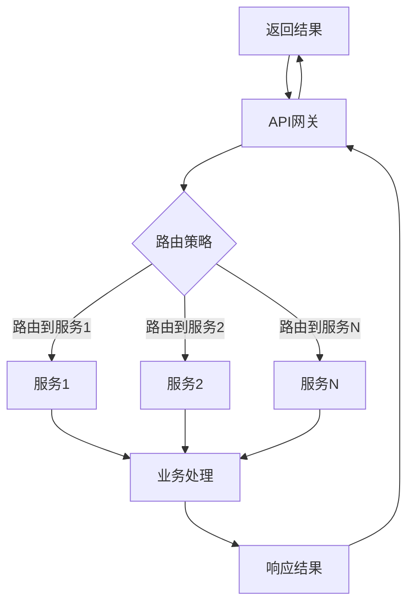

                 

关键词：API网关，微服务架构，流量管理，服务拆分，分布式系统

> 摘要：本文将深入探讨API网关在微服务架构中的重要性，以及如何设计和实现一个高效、可靠的API网关。通过分析API网关的核心概念、设计原则、算法原理、数学模型、项目实践等方面，帮助读者全面了解API网关的设计与实现。

## 1. 背景介绍

在现代软件开发中，微服务架构因其灵活、可扩展的特性而变得越来越受欢迎。微服务架构将大型单体应用拆分为多个小型、独立的服务，每个服务都负责特定的业务功能。这种拆分方式使得各个服务可以独立开发、部署和扩展，提高了系统的可靠性和可维护性。

然而，随着服务数量的增加，如何高效地管理和控制这些服务的流量成为了一个重要问题。API网关作为一种分布式系统的流量入口，它在微服务架构中起到了至关重要的作用。API网关不仅负责流量管理，还提供了安全、监控、路由等高级功能。

本文将围绕API网关的设计与实现展开，首先介绍API网关的基本概念和设计原则，然后深入探讨API网关的核心算法原理、数学模型以及项目实践。通过本文的学习，读者将能够全面了解API网关的设计与实现，从而为实际项目提供有效的解决方案。

## 2. 核心概念与联系

### 2.1 API网关的定义

API网关（API Gateway）是一个统一的入口点，它负责接收客户端的请求，然后将这些请求转发到后端的服务中。API网关不仅仅是一个路由器，它还提供了许多高级功能，如身份验证、授权、流量控制、负载均衡、缓存、监控和日志记录等。

### 2.2 微服务架构与API网关的联系

在微服务架构中，API网关作为流量入口，起到了连接客户端和后端服务的作用。它不仅可以简化客户端的调用流程，还可以提高系统的性能和可靠性。具体来说，API网关与微服务架构之间的联系体现在以下几个方面：

- **简化客户端调用**：客户端只需与API网关进行交互，无需直接调用多个后端服务。API网关可以将多个服务整合成一个统一的接口，从而简化了客户端的调用流程。
- **流量管理**：API网关可以集中管理和控制流量的方向和大小，从而提高系统的性能和稳定性。例如，通过负载均衡算法，API网关可以将请求分配到不同的后端服务中，从而避免单点故障。
- **安全与监控**：API网关可以提供身份验证和授权功能，确保只有合法的请求才能访问后端服务。同时，API网关还可以收集和分析请求日志，从而实现监控和报警功能。

### 2.3 API网关与微服务架构的Mermaid流程图

下面是一个简化的API网关与微服务架构的Mermaid流程图，展示了客户端请求从API网关到后端服务的整个过程。



在上面的流程图中，A表示客户端请求，B表示API网关，C表示路由策略，D、E、F表示后端服务，G表示业务处理，H表示响应结果。

## 3. 核心算法原理 & 具体操作步骤

### 3.1 算法原理概述

API网关的核心算法主要涉及路由策略、负载均衡和流量控制等方面。下面将分别介绍这些算法的原理。

#### 3.1.1 路由策略

路由策略是指API网关如何根据客户端请求的URL或参数，将请求路由到相应的后端服务。常用的路由策略包括基于URL的路由、基于参数的路由和基于服务名称的路由等。

- **基于URL的路由**：根据客户端请求的URL路径，直接匹配到对应的后端服务。
- **基于参数的路由**：根据客户端请求中的参数值，匹配到对应的后端服务。
- **基于服务名称的路由**：根据客户端请求中指定的服务名称，直接匹配到对应的后端服务。

#### 3.1.2 负载均衡

负载均衡是指API网关如何将请求分配到多个后端服务中，从而避免单点故障和提高系统的性能。常用的负载均衡算法包括轮询、最少连接数、源IP哈希等。

- **轮询算法**：将请求依次分配到每个后端服务中，每个服务平均承担相同的负载。
- **最少连接数算法**：将请求分配到当前连接数最少的后端服务中，从而确保每个服务的负载相对均衡。
- **源IP哈希算法**：根据客户端的IP地址进行哈希运算，将请求分配到对应的后端服务中。

#### 3.1.3 流量控制

流量控制是指API网关如何限制流量的方向和大小，从而保护后端服务的性能和稳定性。常用的流量控制方法包括限流、降级和熔断等。

- **限流**：通过设置每秒请求数或每分钟请求数的阈值，限制流量的最大值，从而避免系统过载。
- **降级**：当系统负载过高时，将部分请求拒绝，从而保证核心服务的正常运行。
- **熔断**：当后端服务发生故障或响应时间过长时，暂时断开与后端服务的连接，从而避免整个系统崩溃。

### 3.2 算法步骤详解

#### 3.2.1 路由策略

1. 解析客户端请求的URL或参数。
2. 根据请求的URL或参数，匹配到相应的路由策略。
3. 根据路由策略，确定要路由到的后端服务。
4. 将请求转发到后端服务。

#### 3.2.2 负载均衡

1. 收集后端服务的状态信息，如连接数、响应时间等。
2. 根据负载均衡算法，选择最优的后端服务。
3. 将请求转发到选定的后端服务。

#### 3.2.3 流量控制

1. 计算当前流量是否超过阈值。
2. 如果流量超过阈值，则执行限流、降级或熔断策略。
3. 如果流量未超过阈值，则将请求转发到后端服务。

### 3.3 算法优缺点

#### 路由策略

- **优点**：简化了客户端调用流程，提高了系统的可维护性。
- **缺点**：如果路由策略过于复杂，可能会导致性能下降。

#### 负载均衡

- **优点**：提高了系统的性能和可靠性，避免了单点故障。
- **缺点**：可能会引入一定的延迟，影响用户体验。

#### 流量控制

- **优点**：保证了系统的稳定性和性能，避免了系统过载。
- **缺点**：可能会影响部分用户的正常访问。

### 3.4 算法应用领域

- **电子商务**：通过路由策略和负载均衡，提高系统的性能和稳定性，确保用户在购物时的流畅体验。
- **金融支付**：通过流量控制和熔断策略，确保支付系统的安全性和可靠性，防止恶意攻击和系统崩溃。
- **在线教育**：通过限流和降级策略，保证课程播放的流畅性，避免服务器过载导致课程无法播放。

## 4. 数学模型和公式 & 详细讲解 & 举例说明

### 4.1 数学模型构建

在API网关的设计中，数学模型主要用于描述流量、负载和性能之间的关系。以下是一个简化的数学模型：

- **流量模型**：设\(Q\)为客户端请求的流量，单位为每秒请求数（RPS）。
- **负载模型**：设\(L\)为后端服务的负载，单位为每秒处理请求数（RPS）。
- **性能模型**：设\(P\)为系统的性能指标，如响应时间、吞吐量等。

### 4.2 公式推导过程

根据流量模型，流量\(Q\)可以表示为：

$$ Q = r \cdot T $$

其中，\(r\)为每秒生成请求数，\(T\)为每个请求的平均处理时间。

根据负载模型，负载\(L\)可以表示为：

$$ L = \frac{Q}{N} $$

其中，\(N\)为后端服务的数量。

根据性能模型，系统的性能\(P\)可以表示为：

$$ P = \frac{Q}{T} $$

### 4.3 案例分析与讲解

假设一个API网关系统，每秒生成100个请求，每个请求的平均处理时间为0.1秒。现有10个后端服务，每个服务每秒最多处理50个请求。

根据流量模型，流量\(Q\)为：

$$ Q = 100 \cdot 0.1 = 10 \text{ RPS} $$

根据负载模型，负载\(L\)为：

$$ L = \frac{10}{10} = 1 \text{ RPS} $$

根据性能模型，系统的性能\(P\)为：

$$ P = \frac{10}{0.1} = 100 \text{ RPS} $$

这个例子表明，在当前的流量和负载下，系统可以达到100 RPS的性能。但是，如果流量增加到200 RPS，负载将超过每个服务的最大处理能力，可能导致系统性能下降。

## 5. 项目实践：代码实例和详细解释说明

### 5.1 开发环境搭建

在本节中，我们将使用Spring Boot框架来搭建一个简单的API网关项目。首先，确保您的系统中已安装了Java SDK和Maven。然后，通过以下命令创建一个Spring Boot项目：

```bash
mvn archetype:generate \
    -DgroupId=com.example \
    -DartifactId=api-gateway \
    -DarchetypeArtifactId=jar-archetype \
    -Dpackage=com.example
```

### 5.2 源代码详细实现

以下是API网关的核心代码实现：

```java
import org.springframework.boot.SpringApplication;
import org.springframework.boot.autoconfigure.SpringBootApplication;
import org.springframework.cloud.gateway.route.RouteLocator;
import org.springframework.cloud.gateway.route.builder.RouteLocatorBuilder;
import org.springframework.context.annotation.Bean;
import org.springframework.web.bind.annotation.GetMapping;
import org.springframework.web.bind.annotation.RestController;

@SpringBootApplication
public class ApiGatewayApplication {

    public static void main(String[] args) {
        SpringApplication.run(ApiGatewayApplication.class, args);
    }

    @Bean
    public RouteLocator routes(RouteLocatorBuilder builder) {
        return builder.routes()
                .route("service1", r -> r.path("/service1/**").uri("http://service1:8080"))
                .route("service2", r -> r.path("/service2/**").uri("http://service2:8080"))
                .build();
    }
}
```

在上面的代码中，我们定义了两个路由规则，分别对应于`/service1`和`/service2`路径。当客户端请求这些路径时，API网关会将请求转发到对应的服务。

### 5.3 代码解读与分析

- **SpringBootApplication**：这是一个Spring Boot的核心组件，用于启动和配置Spring应用程序。
- **main()方法**：这是Spring Boot应用程序的入口点，通过SpringApplication.run()方法启动应用程序。
- **@Bean**：这是一个Spring Bean注解，用于定义一个Spring Bean对象。在这里，我们定义了一个`RouteLocator` Bean，用于配置路由规则。
- **routes()方法**：这是一个Spring Cloud Gateway提供的路由规则配置方法。通过该方法，我们可以定义多个路由规则，每个规则对应一个路径和一个目标服务。

### 5.4 运行结果展示

在完成代码实现后，我们可以在命令行中运行Spring Boot应用程序：

```bash
mvn spring-boot:run
```

运行成功后，我们可以通过以下命令启动两个模拟的后端服务：

```bash
java -jar service1-0.0.1-SNAPSHOT.jar
java -jar service2-0.0.1-SNAPSHOT.jar
```

然后，我们可以通过浏览器访问API网关的接口：

```http
http://localhost:8080/service1/hello
```

返回结果应该是`Hello from Service 1`。同样，访问`/service2/hello`应该返回`Hello from Service 2`。这表明API网关已经成功地将请求转发到了对应的后端服务。

## 6. 实际应用场景

### 6.1 电子商务平台

在电子商务平台中，API网关起到了至关重要的作用。它不仅负责将用户请求路由到相应的服务，如商品管理服务、订单管理服务和支付服务，还提供了流量控制、负载均衡和安全认证等功能。通过API网关，电子商务平台可以确保在高并发情况下系统的稳定性和性能。

### 6.2 金融支付系统

金融支付系统对安全性和稳定性要求极高。API网关在这里不仅负责路由和流量控制，还提供了严格的身份验证和授权机制。通过API网关，金融支付系统可以确保只有合法的请求才能访问核心服务，从而保护用户资金的安全。

### 6.3 在线教育平台

在线教育平台需要处理大量的课程播放请求和用户互动请求。API网关在这里可以帮助平台进行流量管理和负载均衡，确保课程播放的流畅性。同时，通过API网关，平台还可以对用户进行认证和权限管理，确保课程的私密性和安全性。

## 7. 工具和资源推荐

### 7.1 学习资源推荐

- **《API网关设计》**：这是一本关于API网关设计的经典书籍，详细介绍了API网关的核心概念、设计原则和实现方法。
- **《微服务设计》**：这是一本关于微服务架构设计的入门书籍，讲解了微服务架构的基本概念、优势和设计原则。

### 7.2 开发工具推荐

- **Spring Cloud Gateway**：这是一个基于Spring框架的API网关解决方案，提供了丰富的路由和流量控制功能。
- **Kong**：这是一个开源的API网关，支持多种路由策略和流量控制方法，适用于高并发场景。

### 7.3 相关论文推荐

- **"API Gateway for Microservices: Design and Implementation"**：这篇论文详细介绍了API网关在微服务架构中的应用和实践。
- **"A Survey on API Gateway in Cloud Computing"**：这篇论文对API网关在云计算环境中的应用进行了全面的综述。

## 8. 总结：未来发展趋势与挑战

### 8.1 研究成果总结

本文通过对API网关的核心概念、设计原则、算法原理和实际应用场景的深入探讨，总结了API网关在微服务架构中的重要性和作用。通过数学模型的推导和项目实践的案例分析，我们全面了解了API网关的设计与实现方法。

### 8.2 未来发展趋势

随着云计算和微服务架构的普及，API网关在未来的发展中将呈现以下趋势：

- **更高的性能和可扩展性**：随着流量的不断增加，API网关需要具备更高的性能和可扩展性，以应对高并发场景。
- **更丰富的功能**：API网关将集成更多的功能，如智能路由、自动扩缩容、实时监控和可视化等。
- **更安全的架构**：随着安全威胁的增加，API网关需要在身份验证、授权和加密等方面提供更强大的保护。

### 8.3 面临的挑战

虽然API网关在微服务架构中具有重要的作用，但在实际应用中仍面临以下挑战：

- **性能优化**：在高并发场景下，如何提高API网关的性能和响应速度是一个重要问题。
- **安全性**：如何在保证系统安全的前提下，提供灵活和安全的API访问控制。
- **可维护性**：随着功能的不断增加，如何确保API网关的可维护性和稳定性。

### 8.4 研究展望

未来，API网关的研究方向可以包括以下几个方面：

- **智能路由**：结合机器学习和大数据分析，实现智能路由策略，提高系统的性能和响应速度。
- **自动扩缩容**：通过自动化技术，实现API网关的自动扩缩容，提高系统的弹性和稳定性。
- **混合架构**：结合API网关和Service Mesh技术，实现更加灵活和高效的微服务架构。

## 9. 附录：常见问题与解答

### 9.1 什么是API网关？

API网关是一个统一的入口点，负责接收客户端请求，然后将请求路由到后端服务。它提供了路由、流量控制、安全认证、负载均衡等功能，是微服务架构中不可或缺的一部分。

### 9.2 API网关和负载均衡器有什么区别？

负载均衡器主要负责将请求分配到多个后端服务器中，以提高系统的性能和可靠性。而API网关除了具备负载均衡的功能外，还提供了路由、安全认证、流量控制等功能，是微服务架构中的流量入口。

### 9.3 如何实现API网关的路由策略？

API网关的路由策略可以通过定义路由规则来实现。这些规则可以基于URL、请求参数或服务名称等，将请求路由到不同的后端服务。常用的路由策略包括基于URL的路由、基于参数的路由和基于服务名称的路由等。

### 9.4 API网关如何进行流量控制？

API网关可以通过设置每秒请求数或每分钟请求数的阈值来实现流量控制。当流量超过阈值时，API网关可以执行限流、降级或熔断策略，从而保护后端服务的性能和稳定性。

### 9.5 API网关如何保证安全性？

API网关可以通过身份验证、授权和加密等方式来保证安全性。例如，可以使用JWT、OAuth等协议进行身份验证，通过访问控制列表（ACL）进行授权，使用TLS加密通信等。

### 9.6 API网关和Service Mesh有什么区别？

API网关主要负责流量管理和路由，而Service Mesh则负责服务发现、服务间通信和安全等。两者都是微服务架构中的重要组成部分，但侧重点不同。

### 9.7 API网关在云计算环境中的应用有哪些？

在云计算环境中，API网关可以用于实现以下应用：

- **统一API接口**：将后端服务的多个API接口整合为一个统一的API接口，简化客户端调用。
- **流量管理和监控**：通过流量管理和监控功能，提高系统的性能和可靠性。
- **安全防护**：通过身份验证、授权和加密等手段，保护系统的安全。

### 9.8 API网关在实时系统中有哪些应用场景？

在实时系统中，API网关可以用于以下应用场景：

- **实时数据处理**：通过API网关接收实时数据流，然后将数据流路由到相应的后端服务进行处理。
- **实时监控和报警**：通过API网关收集实时监控数据，实现实时监控和报警功能。
- **实时数据处理和分析**：通过API网关将实时数据流路由到大数据处理平台，进行实时数据处理和分析。

### 9.9 API网关在物联网（IoT）应用中有哪些应用场景？

在物联网（IoT）应用中，API网关可以用于以下应用场景：

- **设备接入和管理**：通过API网关实现设备的接入和管理，包括设备注册、设备状态监控等。
- **数据传输和存储**：通过API网关实现物联网数据传输和存储，包括数据采集、数据存储和数据查询等。
- **设备远程控制和监控**：通过API网关实现设备的远程控制和监控，包括设备配置、设备状态监控和故障诊断等。

### 9.10 如何测试API网关的性能？

测试API网关的性能可以通过以下方法进行：

- **负载测试**：通过模拟大量并发请求，测试API网关的响应时间和吞吐量等性能指标。
- **压力测试**：通过逐步增加请求负载，测试API网关在高负载下的性能和稳定性。
- **性能调优**：通过分析性能测试结果，找出性能瓶颈并进行调优，以提高API网关的性能。

### 9.11 如何优化API网关的性能？

优化API网关的性能可以从以下几个方面进行：

- **缓存**：通过缓存常用数据，减少对后端服务的调用，提高系统的性能。
- **异步处理**：通过异步处理请求，减少系统的响应时间，提高系统的吞吐量。
- **负载均衡**：通过负载均衡算法，合理分配请求负载，提高系统的性能和可靠性。
- **优化代码**：通过优化API网关的代码，减少资源消耗和响应时间，提高系统的性能。

### 9.12 如何确保API网关的安全性？

确保API网关的安全性可以从以下几个方面进行：

- **身份验证和授权**：通过身份验证和授权机制，确保只有合法的请求才能访问API网关。
- **加密通信**：通过TLS加密通信，保护数据在传输过程中的安全性。
- **安全防护**：通过配置防火墙、入侵检测系统和反恶意软件等安全措施，保护API网关免受攻击。
- **日志审计**：通过日志审计功能，监控API网关的访问行为，及时发现和响应安全威胁。


----------------------------------------------------------------

