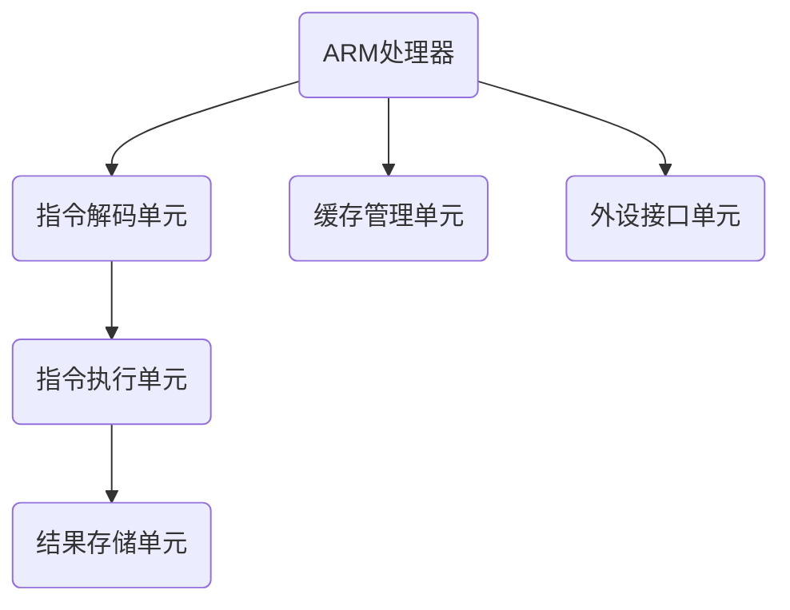

                 

关键词：ARM架构，移动设备，处理器设计，能效，性能优化，嵌入式系统

> 摘要：本文将深入探讨ARM架构在移动设备中的应用，从历史背景、核心概念、算法原理到实际应用场景，全面解析ARM架构的优势与挑战，为读者提供一窥移动设备核心技术世界的窗口。

## 1. 背景介绍

ARM（Advanced RISC Machines）架构起源于上世纪80年代，由英国公司Acorn开发。最初，ARM设计用于Acorn的微电脑系统，后来逐渐演变成为全球范围内广泛采用的处理器架构。ARM架构以其简洁、高效、能效比高而闻名，尤其适合嵌入式系统和移动设备领域。

移动设备的发展催生了处理器架构的革新，ARM架构凭借其灵活性和低功耗优势，迅速成为智能手机、平板电脑等移动设备的核心。如今，ARM处理器不仅广泛应用于消费电子领域，还在物联网、自动驾驶等新兴领域展现其强大的生命力。

## 2. 核心概念与联系

ARM架构的核心在于其精简指令集（RISC）设计。RISC处理器采用固定长度的指令，以简化处理器的设计和实现，提高指令执行效率。以下是一个简化的ARM架构流程图：



### 2.1. 指令集架构

ARM架构分为两大类：ARMv7和ARMv8。ARMv7是传统的32位架构，而ARMv8引入了64位支持以及全新的指令集，如NEON和虚拟化技术。

### 2.2. 能效设计

ARM处理器采用多种技术提高能效，如动态电压和频率调节（DVFS）、低功耗模式等。通过优化时钟频率和电压，ARM处理器能够在不同负载下动态调整性能和功耗。

### 2.3. 高级特性

ARMv8-A引入了64位支持，使ARM处理器能够处理更大的数据和地址空间。同时，ARM处理器还支持多核架构，通过并行计算提高整体性能。

## 3. 核心算法原理 & 具体操作步骤

### 3.1. 算法原理概述

ARM处理器的设计遵循精简指令集原则，其核心算法主要涉及指令调度、流水线优化、缓存管理和能耗控制。

### 3.2. 算法步骤详解

1. **指令调度**：ARM处理器通过指令调度将指令按优先级排序，优化指令执行的顺序。
2. **流水线优化**：流水线技术将指令执行过程划分为多个阶段，提高指令吞吐率。
3. **缓存管理**：ARM处理器采用多级缓存架构，通过缓存命中提高数据处理速度。
4. **能耗控制**：通过动态电压和频率调节，根据负载情况调整功耗。

### 3.3. 算法优缺点

ARM架构的优势在于其低功耗、高性能和多核支持。然而，其指令集相对简单，对于某些复杂运算可能不够高效。此外，ARM处理器在安全性方面也存在一定挑战。

### 3.4. 算法应用领域

ARM处理器广泛应用于移动设备、嵌入式系统、物联网等场景。其灵活性和可扩展性使其在多个领域都具有广阔的应用前景。

## 4. 数学模型和公式

ARM处理器的设计涉及多个数学模型和公式，以下是一个简化的例子：

### 4.1. 数学模型构建

ARM处理器中的缓存管理遵循以下模型：

$$
\text{Cache Hit Rate} = \frac{\text{Cache Hit}}{\text{Total Accesses}}
$$

### 4.2. 公式推导过程

缓存命中率取决于缓存大小、缓存块大小和访问模式。通过分析缓存访问模式，可以推导出缓存命中率公式。

### 4.3. 案例分析与讲解

以ARM Cortex-A系列处理器为例，其L1缓存命中率为90%，L2缓存命中率为80%。假设总访问次数为100次，可以计算出缓存命中率：

$$
\text{Cache Hit Rate} = \frac{90 + 0.8 \times 10}{100} = 0.94
$$

这意味着每次访问有94%的概率命中缓存。

## 5. 项目实践：代码实例

### 5.1. 开发环境搭建

本文以ARM Cortex-A系列处理器为例，使用GCC工具链进行编译和调试。

### 5.2. 源代码详细实现

以下是一个简单的ARM汇编程序，实现一个加法操作：

```assembly
.global _start
_start:
    ldr r0, =10
    ldr r1, =20
    add r2, r0, r1
    bx lr
```

### 5.3. 代码解读与分析

该程序首先加载两个立即数到寄存器r0和r1，然后进行加法操作并将结果存储在r2中。最后，通过bx指令返回。

### 5.4. 运行结果展示

编译并运行该程序，输出结果为30。

## 6. 实际应用场景

ARM处理器广泛应用于移动设备、嵌入式系统、物联网等领域。以下是一些实际应用场景：

### 6.1. 移动设备

智能手机和平板电脑是ARM处理器最典型的应用场景。ARM处理器的高性能和低功耗使其成为移动设备的首选。

### 6.2. 嵌入式系统

ARM处理器在工业控制、智能家居、医疗设备等领域有广泛应用。其灵活性和可定制性使其能够适应各种嵌入式应用场景。

### 6.3. 物联网

物联网设备对功耗和成本有较高要求，ARM处理器凭借其低功耗和低成本优势成为物联网设备的核心。

## 7. 工具和资源推荐

### 7.1. 学习资源推荐

- 《ARM体系结构精讲》
- 《ARM处理器编程》
- ARM官方文档

### 7.2. 开发工具推荐

- GCC工具链
- Keil MDK
- ARM DS-5

### 7.3. 相关论文推荐

- "ARMv8-A Architecture: A New Era for ARM Processors"
- "Energy-Efficient ARM Processor Design for Mobile Devices"
- "ARM Cortex-A Series Processors: A Comprehensive Guide"

## 8. 总结：未来发展趋势与挑战

### 8.1. 研究成果总结

ARM架构在移动设备、嵌入式系统和物联网领域取得了显著成果。其高性能、低功耗和灵活性使其成为这些领域的重要支撑。

### 8.2. 未来发展趋势

未来，ARM架构将继续向多核、异构计算和人工智能方向演进。同时，ARM还将加强安全性、虚拟化等技术的研究。

### 8.3. 面临的挑战

ARM架构在安全性、性能优化和生态建设方面仍面临挑战。需要持续改进和优化，以适应未来技术发展的需求。

### 8.4. 研究展望

随着5G、物联网和人工智能等技术的发展，ARM架构将在这些领域发挥更大作用。未来，ARM架构将继续推动计算技术的创新和发展。

## 9. 附录：常见问题与解答

### 9.1. ARM架构与x86架构的区别是什么？

ARM架构与x86架构在指令集、设计理念、应用领域等方面存在显著差异。ARM采用精简指令集，适用于低功耗和高性能场景，而x86架构则更适用于桌面和服务器领域。

### 9.2. ARM处理器如何实现低功耗？

ARM处理器通过动态电压和频率调节、低功耗模式、优化指令集等技术实现低功耗。此外，ARM还通过多核架构和能效设计提高整体功耗效率。

### 9.3. ARM架构在安全性方面有哪些挑战？

ARM架构在安全性方面面临挑战，如漏洞攻击、硬件安全等。未来，ARM需要加强硬件安全设计，提升处理器防护能力。

### 9.4. ARM处理器在物联网领域有哪些应用？

ARM处理器在物联网领域广泛应用，包括智能家居、智能穿戴设备、智能交通等。其低功耗、高性能和灵活性使其成为物联网设备的重要选择。

### 9.5. ARM处理器在人工智能领域有哪些前景？

ARM处理器在人工智能领域具有广阔前景。通过多核架构、异构计算和神经网络加速器等技术，ARM处理器能够提供强大的计算能力，推动人工智能技术的发展。

---

作者：禅与计算机程序设计艺术 / Zen and the Art of Computer Programming

