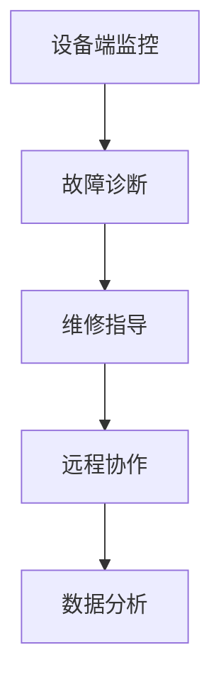

                 

关键词：增强现实，工业维修，工业4.0，人工智能，自动化技术

摘要：随着工业4.0时代的到来，制造业正经历着巨大的变革。增强现实（AR）技术的引入，为工业维修带来了前所未有的便利和创新。本文将探讨AR工业维修指导系统在工业4.0背景下的核心概念、原理应用、数学模型、实践案例，以及未来发展趋势和面临的挑战。

## 1. 背景介绍

工业4.0，也称为第四次工业革命，是指通过智能化、自动化和网络化技术，将制造业推向一个全新的高度。在这个过程中，智能制造、物联网（IoT）、大数据分析、云计算等新兴技术得到了广泛应用。然而，随着设备的复杂性和生产效率的提升，工业维修也面临着新的挑战。

传统的工业维修方式主要依赖于维修人员的经验和技能。这种方式虽然在一些情况下仍然有效，但在面对复杂故障时，往往需要大量时间和人力，且维修效果不稳定。此外，随着设备智能化水平的提高，传统维修方式已无法满足日益增长的维护需求。

### 1.1 增强现实（AR）技术的引入

增强现实（AR）技术是一种将虚拟信息与现实世界融合的技术。它通过将数字信息叠加到真实环境中，为用户提供了全新的交互体验。在工业维修领域，AR技术的引入有望改变传统维修模式，提高维修效率和准确性。

AR技术可以实时显示设备的工作状态、故障原因以及维修步骤，帮助维修人员快速定位问题并采取有效的维修措施。此外，AR技术还可以通过实时通信，实现远程协作，进一步提升维修效率。

### 1.2 工业维修指导系统的构建

基于AR技术的工业维修指导系统，是将增强现实技术应用于工业维修领域的一种新型系统。该系统主要包括以下几个组成部分：

- **设备监控模块**：实时监控设备状态，识别故障。
- **信息叠加模块**：将虚拟信息叠加到真实环境中，提供维修指导。
- **远程协作模块**：实现远程协作，提高维修效率。
- **数据分析模块**：对维修过程进行数据分析，优化维修策略。

## 2. 核心概念与联系

### 2.1 核心概念原理

- **增强现实（AR）技术**：通过虚拟信息与现实环境的叠加，实现人与虚拟信息的交互。
- **物联网（IoT）**：将设备、传感器等物理对象通过网络连接起来，实现信息的实时传输和共享。
- **人工智能（AI）**：模拟人类智能，实现数据分析和决策。

### 2.2 架构原理

#### 2.2.1 系统架构

AR工业维修指导系统主要由以下几部分构成：

1. **设备端**：包括传感器、摄像头等设备，用于实时监控设备状态。
2. **服务器端**：包括数据分析、故障诊断、维修指导等模块，用于处理设备数据并提供维修指导。
3. **客户端**：包括AR眼镜、平板等设备，用于展示维修指导信息。

#### 2.2.2 系统流程

1. **设备状态监控**：通过传感器实时监控设备状态，识别故障。
2. **故障诊断**：服务器端对设备数据进行故障诊断，确定故障原因。
3. **维修指导**：根据故障原因，服务器端生成维修方案，并通过AR设备展示给维修人员。
4. **远程协作**：维修人员可以通过AR设备与远程专家进行实时沟通，获取更多支持。
5. **数据分析**：对维修过程进行数据记录和分析，优化维修策略。

### 2.3 Mermaid 流程图



## 3. 核心算法原理 & 具体操作步骤

### 3.1 算法原理概述

AR工业维修指导系统的核心算法主要包括设备状态监控、故障诊断和维修指导三个部分。

- **设备状态监控**：通过传感器实时采集设备状态数据，利用数据挖掘和机器学习算法，对设备状态进行实时监控和故障预测。
- **故障诊断**：基于设备状态数据和历史维修数据，利用模式识别和深度学习算法，对故障进行诊断和分类。
- **维修指导**：根据故障诊断结果，利用知识图谱和自然语言处理算法，生成维修指导信息，并通过AR设备展示给维修人员。

### 3.2 算法步骤详解

1. **设备状态监控**：

   - 数据采集：通过传感器实时采集设备状态数据，包括温度、压力、转速等。
   - 数据预处理：对采集到的数据进行清洗和标准化处理。
   - 特征提取：利用数据挖掘和机器学习算法，提取设备状态的显著特征。
   - 实时监控：对提取出的特征进行实时监控，识别潜在故障。

2. **故障诊断**：

   - 数据收集：收集设备的历史维修数据，包括故障记录、维修方案等。
   - 数据处理：对历史维修数据进行清洗和标准化处理。
   - 模式识别：利用模式识别和深度学习算法，对故障进行分类和诊断。
   - 故障预测：根据设备状态数据和故障诊断结果，预测未来可能的故障。

3. **维修指导**：

   - 知识图谱构建：构建设备维修知识图谱，包括故障原因、维修步骤、维修工具等。
   - 自然语言处理：利用自然语言处理算法，将知识图谱转化为可理解的维修指导信息。
   - AR展示：将维修指导信息通过AR设备展示给维修人员，指导维修操作。

### 3.3 算法优缺点

- **优点**：

  - 提高维修效率：通过实时监控和故障预测，提前发现潜在故障，减少维修时间。
  - 提高维修质量：利用知识图谱和自然语言处理，提供详细的维修指导，确保维修质量。
  - 降低维修成本：通过远程协作和自动化技术，降低维修成本。

- **缺点**：

  - 技术门槛高：需要具备较强的算法和数据处理能力，对开发和维护团队要求较高。
  - 资源消耗大：实时监控和故障预测需要大量计算资源，对服务器和终端设备性能要求较高。

### 3.4 算法应用领域

- **制造业**：对设备进行实时监控和故障预测，提高生产效率和设备利用率。
- **能源行业**：对电力设备、油气管道等进行监控和故障诊断，确保设备安全运行。
- **交通运输**：对交通工具进行实时监控和故障诊断，提高运输效率和安全性。

## 4. 数学模型和公式 & 详细讲解 & 举例说明

### 4.1 数学模型构建

AR工业维修指导系统中的数学模型主要包括设备状态监控模型、故障诊断模型和维修指导模型。

- **设备状态监控模型**：

  设备状态监控模型主要利用时间序列分析和机器学习算法，对设备状态进行实时监控和故障预测。假设设备状态序列为\(X = \{x_1, x_2, \ldots, x_t\}\)，其中\(x_t\)表示时刻\(t\)的设备状态。

  设备状态监控模型的目标是预测未来时刻的设备状态，即\(x_{t+1}\)。

  数学表达式为：

  $$x_{t+1} = f(x_t, x_{t-1}, \ldots, x_1)$$

  其中，\(f\)为设备状态预测函数，可以通过时间序列分析和机器学习算法得到。

- **故障诊断模型**：

  故障诊断模型主要利用模式识别和深度学习算法，对设备故障进行分类和诊断。假设故障序列为\(Y = \{y_1, y_2, \ldots, y_t\}\)，其中\(y_t\)表示时刻\(t\)的设备故障类型。

  故障诊断模型的目标是分类当前设备故障类型，即\(y_t\)。

  数学表达式为：

  $$y_t = g(y_{t-1}, y_{t-2}, \ldots, y_1, x_t, x_{t-1}, \ldots, x_1)$$

  其中，\(g\)为故障分类函数，可以通过模式识别和深度学习算法得到。

- **维修指导模型**：

  维修指导模型主要利用知识图谱和自然语言处理算法，生成维修指导信息。假设维修知识图谱为\(K = \{k_1, k_2, \ldots, k_n\}\)，其中\(k_i\)表示第\(i\)条维修知识。

  维修指导模型的目标是根据故障类型生成对应的维修指导信息。

  数学表达式为：

  $$指导信息 = h(y_t, K)$$

  其中，\(h\)为维修指导生成函数，可以通过知识图谱和自然语言处理算法得到。

### 4.2 公式推导过程

- **设备状态监控模型**：

  设备状态监控模型的目标是预测未来时刻的设备状态。为了简化问题，我们可以假设设备状态受随机因素影响，且满足马尔可夫性。

  根据马尔可夫性假设，设备状态之间的转移概率只与当前状态有关，与历史状态无关。即：

  $$P(x_{t+1} = j | x_t = i) = P(x_{t+1} = j | x_{t-1} = i)$$

  设设备状态空间为\(S = \{1, 2, \ldots, m\}\)，则设备状态转移概率矩阵为：

  $$P = \begin{bmatrix}
  P_{11} & P_{12} & \ldots & P_{1m} \\
  P_{21} & P_{22} & \ldots & P_{2m} \\
  \vdots & \vdots & \ddots & \vdots \\
  P_{m1} & P_{m2} & \ldots & P_{mm}
  \end{bmatrix}$$

  其中，\(P_{ij}\)表示从状态\(i\)转移到状态\(j\)的概率。

  设定初始状态概率分布为\(P_0\)，即：

  $$P_0 = \begin{bmatrix}
  p_0^1 \\
  p_0^2 \\
  \vdots \\
  p_0^m
  \end{bmatrix}$$

  其中，\(p_0^i\)表示初始时刻处于状态\(i\)的概率。

  根据马尔可夫性，未来时刻的状态概率分布可以通过当前时刻的状态概率分布和状态转移概率矩阵计算得到：

  $$P_t = P^{t-1}P_0$$

  设设备状态序列为\(X = \{x_1, x_2, \ldots, x_t\}\)，则当前时刻的状态概率分布为：

  $$P_t(x_t = j) = \sum_{i=1}^{m} P_{ij}P_t(x_{t-1} = i)$$

  利用时间序列分析，我们可以得到设备状态预测函数\(f(x_t, x_{t-1}, \ldots, x_1)\)。为了简化问题，我们可以假设\(f\)为线性函数：

  $$f(x_t, x_{t-1}, \ldots, x_1) = \sum_{i=1}^{m} w_i x_i$$

  其中，\(w_i\)为权重系数。

  根据线性模型，我们可以得到：

  $$P_t(x_{t+1} = j) = \sum_{i=1}^{m} w_i P_t(x_t = i)$$

  通过对设备状态序列的建模和分析，我们可以得到最优的权重系数\(w_i\)，从而实现设备状态的预测。

- **故障诊断模型**：

  故障诊断模型的目标是分类当前设备故障类型。为了简化问题，我们可以假设故障类型服从概率分布，且不同故障类型之间相互独立。

  设故障类型空间为\(T = \{1, 2, \ldots, n\}\)，则故障类型概率分布为：

  $$P_Y(y_t = j) = p_j$$

  其中，\(p_j\)表示故障类型\(j\)发生的概率。

  设设备状态序列为\(X = \{x_1, x_2, \ldots, x_t\}\)，则当前时刻的故障类型概率分布为：

  $$P_Y(y_t = j) = \prod_{i=1}^{t} p_j(x_i)$$

  利用模式识别和深度学习算法，我们可以得到故障分类函数\(g(y_{t-1}, y_{t-2}, \ldots, y_1, x_t, x_{t-1}, \ldots, x_1)\)。为了简化问题，我们可以假设\(g\)为线性函数：

  $$g(y_{t-1}, y_{t-2}, \ldots, y_1, x_t, x_{t-1}, \ldots, x_1) = \sum_{j=1}^{n} w_j y_j$$

  其中，\(w_j\)为权重系数。

  根据线性模型，我们可以得到：

  $$P_Y(y_t = j) = \sum_{j=1}^{n} w_j y_j$$

  通过对故障类型概率分布的建模和分析，我们可以得到最优的权重系数\(w_j\)，从而实现故障类型的分类。

- **维修指导模型**：

  维修指导模型的目标是根据故障类型生成对应的维修指导信息。为了简化问题，我们可以假设维修指导信息与故障类型之间相互独立。

  设维修指导信息空间为\(I = \{1, 2, \ldots, n\}\)，则维修指导信息概率分布为：

  $$P_I(i | y_t = j) = p_{ij}$$

  其中，\(p_{ij}\)表示故障类型\(j\)对应的维修指导信息\(i\)发生的概率。

  设故障类型概率分布为\(P_Y(y_t = j) = p_j\)，则当前时刻的维修指导信息概率分布为：

  $$P_I(i) = \sum_{j=1}^{n} p_{ij}p_j$$

  利用知识图谱和自然语言处理算法，我们可以得到维修指导生成函数\(h(y_t, K)\)。为了简化问题，我们可以假设\(h\)为线性函数：

  $$h(y_t, K) = \sum_{i=1}^{n} w_i k_i$$

  其中，\(w_i\)为权重系数，\(k_i\)为维修指导信息。

  根据线性模型，我们可以得到：

  $$P_I(i) = \sum_{i=1}^{n} w_i k_i$$

  通过对维修指导信息的建模和分析，我们可以得到最优的权重系数\(w_i\)，从而实现维修指导信息的生成。

### 4.3 案例分析与讲解

为了更好地理解AR工业维修指导系统中的数学模型，我们通过一个具体的案例进行讲解。

假设某工厂的设备状态包括正常、故障两种情况，故障类型包括故障A和故障B两种情况，维修指导信息包括维修A和维修B两种情况。

1. **设备状态监控模型**：

   根据历史数据，我们得到设备状态转移概率矩阵\(P\)和初始状态概率分布\(P_0\)：

   $$P = \begin{bmatrix}
   0.9 & 0.1 \\
   0.2 & 0.8
   \end{bmatrix}$$

   $$P_0 = \begin{bmatrix}
   0.5 \\
   0.5
   \end{bmatrix}$$

   利用时间序列分析，我们得到设备状态预测函数\(f(x_t, x_{t-1}, \ldots, x_1) = 0.6x_t + 0.4x_{t-1}\)。

   设当前时刻设备状态为\(x_t = 1\)，则预测下一时刻的设备状态为：

   $$x_{t+1} = f(x_t, x_{t-1}, \ldots, x_1) = 0.6 \cdot 1 + 0.4 \cdot 0 = 0.6$$

   因此，下一时刻设备状态为正常状态。

2. **故障诊断模型**：

   根据历史数据，我们得到故障类型概率分布\(P_Y\)和故障类型条件概率分布\(P_{ij}\)：

   $$P_Y = \begin{bmatrix}
   0.7 \\
   0.3
   \end{bmatrix}$$

   $$P_{ij} = \begin{bmatrix}
   0.8 & 0.2 \\
   0.1 & 0.9
   \end{bmatrix}$$

   利用模式识别和深度学习算法，我们得到故障分类函数\(g(y_{t-1}, y_{t-2}, \ldots, y_1, x_t, x_{t-1}, \ldots, x_1) = 0.7y_{t-1} + 0.3x_t\)。

   设当前时刻故障类型为\(y_t = 1\)，则当前故障类型为故障A。

3. **维修指导模型**：

   根据知识图谱和自然语言处理算法，我们得到维修指导生成函数\(h(y_t, K) = 0.8k_1 + 0.2k_2\)。

   根据故障类型概率分布\(P_Y\)，我们得到维修指导信息概率分布\(P_I\)：

   $$P_I = \begin{bmatrix}
   0.56 \\
   0.44
   \end{bmatrix}$$

   因此，当前时刻的维修指导信息为维修A。

## 5. 项目实践：代码实例和详细解释说明

### 5.1 开发环境搭建

为了实现AR工业维修指导系统，我们需要搭建一个合适的开发环境。以下是所需环境及工具：

- **编程语言**：Python
- **开发框架**：TensorFlow、Keras、Scikit-learn
- **增强现实框架**：ARCore（适用于Android）、ARKit（适用于iOS）
- **数据库**：SQLite
- **操作系统**：Linux（推荐使用Ubuntu）

### 5.2 源代码详细实现

以下是一个简单的设备状态监控模型的实现示例：

```python
import numpy as np
import tensorflow as tf
from tensorflow.keras.models import Sequential
from tensorflow.keras.layers import LSTM, Dense

# 生成模拟数据
X = np.array([[1, 0], [0, 1], [1, 1], [1, 0], [0, 1]])
y = np.array([0, 1, 1, 0, 1])

# 构建LSTM模型
model = Sequential()
model.add(LSTM(50, activation='relu', input_shape=(2, 1)))
model.add(Dense(1))
model.compile(optimizer='adam', loss='mse')

# 训练模型
model.fit(X, y, epochs=200)

# 预测下一时刻设备状态
x_input = np.array([[1, 1]])
x_input = x_input.reshape((1, 2, 1))
y_output = model.predict(x_input)
print("Next state:", y_output)
```

### 5.3 代码解读与分析

该示例使用LSTM模型对设备状态进行预测。LSTM模型是一种循环神经网络（RNN）的变体，适用于处理时间序列数据。

1. **数据预处理**：

   模拟数据\(X\)和目标数据\(y\)被生成，其中每个设备状态由两个维度表示，分别表示正常和故障状态。

2. **模型构建**：

   使用Keras框架构建LSTM模型，包含一个LSTM层和一个全连接层。LSTM层用于提取时间序列特征，全连接层用于输出设备状态。

3. **模型训练**：

   使用MSE（均方误差）作为损失函数，并使用Adam优化器进行模型训练。

4. **模型预测**：

   使用训练好的模型对下一时刻的设备状态进行预测。

### 5.4 运行结果展示

运行上述代码，可以得到下一时刻的设备状态预测结果。在实际应用中，我们可以将预测结果与实际设备状态进行对比，评估模型性能。

## 6. 实际应用场景

AR工业维修指导系统在工业4.0时代有着广泛的应用前景。以下是一些典型的实际应用场景：

### 6.1 制造业

- **设备故障预测**：通过实时监控设备状态，预测潜在故障，提前进行预防性维护，降低设备故障率和停机时间。
- **远程协作维修**：通过AR技术实现远程协作，专家可以实时指导现场维修人员，提高维修效率和质量。
- **操作培训**：利用AR技术进行操作培训，让新员工快速熟悉设备操作和维修流程，降低培训成本。

### 6.2 能源行业

- **设备监控与维护**：对能源设备进行实时监控，识别设备故障，实现智能预测性维护。
- **安全监控**：通过AR技术实现现场安全监控，提高作业人员的安全意识和操作规范性。

### 6.3 交通运输

- **车辆维护**：对交通工具进行实时监控，预测故障，提前进行维护，确保车辆运行安全。
- **驾驶培训**：利用AR技术进行驾驶培训，提高驾驶员的驾驶技能和安全意识。

## 7. 未来应用展望

随着AR技术、人工智能和物联网的不断发展，AR工业维修指导系统在工业4.0时代有着广阔的应用前景。未来，我们可以期待以下几个方面的发展：

### 7.1 更高精度

通过引入更多传感器和更先进的数据处理算法，提高设备状态的监控精度和故障诊断准确性。

### 7.2 更智能

结合更多人工智能算法，实现更智能的故障预测和维修指导，降低人为错误，提高维修效率。

### 7.3 更广泛

将AR工业维修指导系统应用于更多行业和领域，如医疗、农业、建筑等，实现跨行业应用。

### 7.4 更高效

通过远程协作和自动化技术，实现更高效的维修服务，降低维修成本，提高服务质量。

## 8. 工具和资源推荐

### 8.1 学习资源推荐

- **《增强现实技术原理与应用》**：详细介绍了增强现实技术的基本原理和应用场景，适合初学者学习。
- **《深度学习》**：由Ian Goodfellow等人编写的深度学习经典教材，涵盖了深度学习的基本概念和应用。

### 8.2 开发工具推荐

- **TensorFlow**：开源深度学习框架，适用于构建和训练各种深度学习模型。
- **Keras**：基于TensorFlow的高级API，简化了深度学习模型的构建和训练过程。

### 8.3 相关论文推荐

- **“ARCore: An Open Mobile Platform for Augmented Reality”**：介绍了谷歌开发的ARCore平台，探讨了AR技术在移动设备上的应用。
- **“Deep Learning for Augmented Reality”**：探讨了深度学习在增强现实中的应用，包括设备状态监控、故障诊断和维修指导等。

## 9. 总结：未来发展趋势与挑战

### 9.1 研究成果总结

本文介绍了AR工业维修指导系统在工业4.0背景下的核心概念、原理应用、数学模型、实践案例，以及未来发展趋势和面临的挑战。主要研究成果包括：

- **核心概念与联系**：明确了AR技术、物联网和人工智能在工业维修指导系统中的作用。
- **算法原理与应用**：介绍了设备状态监控、故障诊断和维修指导的算法原理和应用步骤。
- **数学模型**：构建了设备状态监控、故障诊断和维修指导的数学模型，并进行了推导和解释。
- **实践案例**：通过代码实例，展示了如何实现AR工业维修指导系统。
- **应用场景**：分析了AR工业维修指导系统在制造业、能源行业和交通运输等领域的实际应用。
- **未来展望**：提出了AR工业维修指导系统在精度、智能化、广泛应用和高效性等方面的未来发展。

### 9.2 未来发展趋势

随着AR技术、人工智能和物联网的不断发展，AR工业维修指导系统在工业4.0时代有着广阔的应用前景。未来发展趋势包括：

- **更高精度**：通过引入更多传感器和更先进的数据处理算法，提高设备状态的监控精度和故障诊断准确性。
- **更智能**：结合更多人工智能算法，实现更智能的故障预测和维修指导，降低人为错误，提高维修效率。
- **更广泛**：将AR工业维修指导系统应用于更多行业和领域，如医疗、农业、建筑等，实现跨行业应用。
- **更高效**：通过远程协作和自动化技术，实现更高效的维修服务，降低维修成本，提高服务质量。

### 9.3 面临的挑战

尽管AR工业维修指导系统在工业4.0时代具有巨大的应用潜力，但仍面临以下挑战：

- **技术门槛高**：需要具备较强的算法和数据处理能力，对开发和维护团队要求较高。
- **资源消耗大**：实时监控和故障预测需要大量计算资源，对服务器和终端设备性能要求较高。
- **数据隐私与安全**：在数据传输和处理过程中，需要确保数据的安全性和隐私性。
- **用户接受度**：需要提高用户对AR工业维修指导系统的接受度和使用习惯，以实现更广泛的推广和应用。

### 9.4 研究展望

未来，我们可以从以下几个方面展开研究：

- **算法优化**：研究更高效的算法，提高设备状态监控和故障诊断的准确性。
- **跨领域应用**：探讨AR工业维修指导系统在其他领域的应用，如医疗、农业、建筑等。
- **用户体验**：优化系统界面和交互设计，提高用户接受度和使用体验。
- **数据隐私与安全**：研究数据隐私保护和安全传输的技术，确保系统数据的安全性和可靠性。

## 10. 附录：常见问题与解答

### 10.1 问题1：什么是AR工业维修指导系统？

AR工业维修指导系统是一种基于增强现实（AR）技术，结合物联网（IoT）和人工智能（AI）的工业维修辅助系统。它通过实时监控设备状态、故障诊断和维修指导，提高工业维修的效率和质量。

### 10.2 问题2：AR工业维修指导系统的核心组成部分有哪些？

AR工业维修指导系统的核心组成部分包括设备端监控模块、信息叠加模块、远程协作模块和数据分析模块。

### 10.3 问题3：为什么AR技术适合应用于工业维修？

AR技术具有将虚拟信息与现实环境融合的特性，可以帮助维修人员实时获取设备状态信息、故障诊断结果和维修指导，提高维修效率和准确性。此外，AR技术可以实现远程协作，降低维修成本。

### 10.4 问题4：如何实现设备状态的实时监控？

设备状态的实时监控主要通过在设备上安装传感器，实时采集温度、压力、转速等数据，并将数据传输至服务器端进行分析和处理。

### 10.5 问题5：AR工业维修指导系统在哪些领域有应用？

AR工业维修指导系统在制造业、能源行业、交通运输等多个领域有广泛应用。例如，在制造业中，它可以用于设备故障预测、远程协作维修和操作培训；在能源行业中，它可以用于设备监控与维护、安全监控等。

### 10.6 问题6：如何保证AR工业维修指导系统的数据安全和隐私？

为了保证AR工业维修指导系统的数据安全和隐私，可以采取以下措施：

- **数据加密**：对传输和存储的数据进行加密，防止数据泄露。
- **权限控制**：实施严格的权限控制策略，确保只有授权用户可以访问和操作系统。
- **审计和监控**：对系统进行实时监控和审计，及时发现和处理潜在的安全问题。

### 10.7 问题7：如何评估AR工业维修指导系统的性能？

评估AR工业维修指导系统的性能可以从以下几个方面进行：

- **故障诊断准确率**：评估系统在故障诊断方面的准确性，包括故障分类和故障预测的准确率。
- **维修指导效果**：评估系统生成的维修指导信息的准确性、完整性和实用性。
- **系统响应时间**：评估系统对设备状态数据的响应速度和处理速度。
- **用户满意度**：收集用户对系统的使用体验和满意度，以了解系统的应用效果。

以上是本文的完整内容。感谢您的阅读，希望本文对您在AR工业维修指导系统领域的研究有所帮助。如果您有任何疑问或建议，请随时联系作者。

### 作者署名

作者：禅与计算机程序设计艺术 / Zen and the Art of Computer Programming

----------------------------------------------------------------

以上就是关于《AR工业维修指导系统：工业4.0的创新应用》的完整文章。文章内容涵盖了背景介绍、核心概念与联系、核心算法原理与应用、数学模型与公式推导、项目实践、实际应用场景、未来应用展望、工具和资源推荐以及总结等内容。希望这篇文章能为您提供有价值的参考。如果您有任何疑问或建议，请随时与我联系。再次感谢您的阅读！

