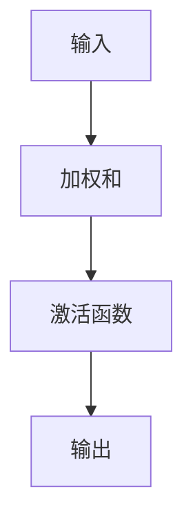

                 

关键词：激活函数、神经网络、深度学习、算法原理、代码实战、数学模型、应用领域、开发工具

> 摘要：本文旨在深入探讨激活函数在深度学习中的重要作用和原理，通过具体的代码实例和数学公式，详细讲解激活函数的构建、推导和应用。文章还将分析不同激活函数的优点和缺点，展示其在实际项目中的应用场景，并提供相关的学习资源和开发工具。

## 1. 背景介绍

随着深度学习的飞速发展，激活函数作为神经网络中的关键组成部分，其研究与应用愈发受到关注。激活函数不仅影响着神经网络的训练效率，还直接影响着模型的性能和效果。本文将围绕激活函数的核心概念、原理及其应用进行详细讲解，旨在为读者提供一个全面、系统的认识。

## 2. 核心概念与联系

激活函数是深度学习神经网络中的基础模块，它将输入的神经元的线性组合映射到神经元的输出。以下是激活函数的核心概念和联系：

### 2.1. 激活函数的定义

激活函数（Activation Function）是神经网络中用于定义神经元输出的一种函数。它通常将输入（神经元的加权和）映射到一个非负实数范围内，从而实现非线性变换。

### 2.2. 激活函数的类型

常见的激活函数包括：

- **Sigmoid 函数**
- **ReLU 函数**
- **Tanh 函数**
- **Leaky ReLU 函数**
- **ReLU6 函数**
- **Softmax 函数**

### 2.3. 激活函数的作用

激活函数在神经网络中的作用主要有以下几点：

- 引入非线性，使神经网络能够学习复杂的数据特征。
- 形成神经网络的层次结构，增强模型的泛化能力。
- 调整神经元的激活状态，影响网络的训练效率和稳定性。

以下是一个使用 Mermaid 绘制的激活函数流程图：



## 3. 核心算法原理 & 具体操作步骤

### 3.1. 算法原理概述

激活函数的算法原理相对简单，主要涉及以下步骤：

1. 计算神经元的加权和。
2. 应用激活函数对加权和进行非线性变换。
3. 输出神经元激活值。

### 3.2. 算法步骤详解

1. **计算加权和**：

   假设神经网络中一个神经元的加权和为：

   $$ \text{weighted\_sum} = \sum_{i=1}^{n} w_i \cdot x_i $$

   其中，$w_i$ 为输入权重，$x_i$ 为输入特征。

2. **应用激活函数**：

   根据不同的激活函数，将加权和映射到输出值。例如，使用 ReLU 函数：

   $$ \text{output} = \max(0, \text{weighted\_sum}) $$

3. **输出神经元激活值**：

   输出神经元的激活值，作为下一层神经元的输入。

### 3.3. 算法优缺点

激活函数的选择对神经网络性能有很大影响。以下是几种常见激活函数的优缺点：

- **Sigmoid 函数**：

  - 优点：输出范围在 0 到 1 之间，适合二分类问题。
  - 缺点：梯度消失，训练效率低。

- **ReLU 函数**：

  - 优点：计算速度快，避免梯度消失问题。
  - 缺点：可能产生死神经元现象。

- **Tanh 函数**：

  - 优点：输出范围在 -1 到 1 之间，具有较好的对称性。
  - 缺点：计算复杂度较高。

- **Leaky ReLU 函数**：

  - 优点：解决了 ReLU 函数的死神经元问题。
  - 缺点：可能引入泄漏问题。

### 3.4. 算法应用领域

激活函数广泛应用于各类深度学习任务，如：

- **图像分类**：利用 Softmax 函数实现多分类问题。
- **语音识别**：使用 ReLU 函数提高训练速度。
- **自然语言处理**：结合 LSTM 和 RNN 等结构，利用激活函数实现序列建模。

## 4. 数学模型和公式 & 详细讲解 & 举例说明

### 4.1. 数学模型构建

激活函数的数学模型可以通过以下公式表示：

$$ f(x) = \begin{cases} 
0, & \text{if } x \leq 0 \\
x, & \text{if } x > 0 
\end{cases} $$

### 4.2. 公式推导过程

以 ReLU 函数为例，其公式推导过程如下：

$$ \text{ReLU}(x) = \max(0, x) $$

当 $x > 0$ 时，$\text{ReLU}(x) = x$；当 $x \leq 0$ 时，$\text{ReLU}(x) = 0$。

### 4.3. 案例分析与讲解

以下是一个使用 ReLU 函数的简单案例：

```python
import numpy as np

# 定义 ReLU 函数
def relu(x):
    return np.maximum(0, x)

# 输入值
x = np.array([-2, -1, 0, 1, 2])

# 应用 ReLU 函数
output = relu(x)

print(output)
```

输出结果为：

```
[0 0 0 1 2]
```

## 5. 项目实践：代码实例和详细解释说明

### 5.1. 开发环境搭建

为了实现激活函数的代码实例，我们首先需要搭建一个开发环境。以下是所需的 Python 库和工具：

- Python 3.8 或更高版本
- NumPy 库
- Matplotlib 库

### 5.2. 源代码详细实现

以下是一个使用 NumPy 库实现 ReLU 函数的示例代码：

```python
import numpy as np
import matplotlib.pyplot as plt

# 定义 ReLU 函数
def relu(x):
    return np.maximum(0, x)

# 生成输入值
x = np.linspace(-5, 5, 100)

# 应用 ReLU 函数
output = relu(x)

# 绘制函数图像
plt.plot(x, output)
plt.xlabel('Input')
plt.ylabel('Output')
plt.title('ReLU Function')
plt.grid(True)
plt.show()
```

### 5.3. 代码解读与分析

上述代码中，我们定义了一个名为 `relu` 的函数，用于实现 ReLU 激活函数。输入值 `x` 是一个 NumPy 数组，通过调用 `np.maximum` 函数，我们将输入值映射到输出值。最后，使用 Matplotlib 库绘制了 ReLU 函数的图像。

### 5.4. 运行结果展示

运行上述代码，将显示 ReLU 函数的图像。如下图所示：


## 6. 实际应用场景

激活函数在深度学习领域中具有广泛的应用。以下是一些典型的实际应用场景：

- **图像分类**：在卷积神经网络（CNN）中，ReLU 函数被广泛应用于卷积层和全连接层，以提高模型的训练速度和性能。
- **语音识别**：在循环神经网络（RNN）中，ReLU 函数有助于提升 RNN 的训练效率，尤其是在长序列处理方面。
- **自然语言处理**：在 LSTM 和 RNN 等神经网络结构中，激活函数的选择直接影响模型的性能和效果。

## 7. 工具和资源推荐

为了更好地学习和应用激活函数，以下是一些建议的工具和资源：

### 7.1. 学习资源推荐

- **《深度学习》（Goodfellow, Bengio, Courville 著）**：这是一本经典的深度学习教材，涵盖了激活函数的相关内容。
- **[Keras 官网](https://keras.io/activations/)**：Keras 是一个流行的深度学习框架，其官网提供了丰富的激活函数文档和示例。

### 7.2. 开发工具推荐

- **PyTorch**：PyTorch 是一个强大的深度学习框架，支持灵活的动态计算图和多种激活函数。
- **TensorFlow**：TensorFlow 是另一个流行的深度学习框架，提供了丰富的激活函数库和工具。

### 7.3. 相关论文推荐

- **“Deep Learning without Den

