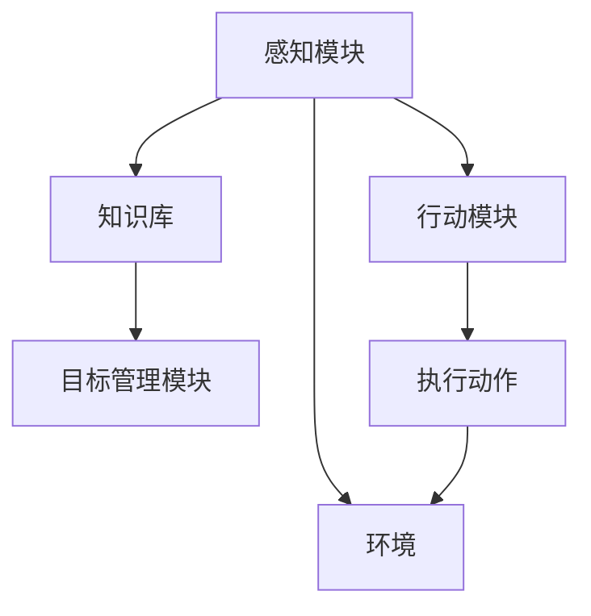

                 

关键词：Agent理论、ReAct框架、智能代理、自主性、协作、人工智能、多代理系统、分布式计算

> 摘要：本文深入探讨了Agent理论及其核心框架ReAct，包括其基本概念、架构设计、算法原理、数学模型及具体实现，并通过实际项目实例展示其在分布式计算和智能系统中的应用，展望了未来发展趋势与挑战。

## 1. 背景介绍

### 1.1 Agent理论的起源与发展

Agent理论起源于人工智能（AI）领域，旨在研究和设计具有自主性、社交性和自适应性的智能代理。其基本理念是模拟人类或其他生物的智能行为，以实现更为复杂的任务。Agent理论的发展可以追溯到20世纪80年代，当时研究者们开始关注如何构建能够自主行动和决策的软件实体。

### 1.2 ReAct框架的产生与重要性

ReAct（Reactive Agent Theory）框架是Agent理论中的一种核心模型，由美国人工智能专家Jude W. Shavlik于1994年提出。ReAct旨在提供一种简单而有效的框架，用于构建具有反应性、主动性和学习能力的智能代理。这一框架在分布式计算、智能监控、机器人控制等领域得到了广泛应用。

## 2. 核心概念与联系

### 2.1 Agent的基本概念

Agent是指能够感知环境、采取行动并具有一定智能的实体。Agent具有以下基本特征：

- **感知**：通过传感器获取环境信息。
- **行动**：根据感知到的信息执行相应动作。
- **自主性**：能够独立决策和执行任务，不受外部直接控制。
- **适应性**：能够根据经验和环境变化调整自身行为。

### 2.2 ReAct框架的架构设计

ReAct框架主要由感知模块、行动模块、知识库和目标管理模块组成。以下是各模块的简要说明：

- **感知模块**：负责获取环境信息，并将其转换为内部表示。
- **行动模块**：根据感知模块提供的信息和知识库中的知识，选择并执行合适的动作。
- **知识库**：存储代理的经验和知识，包括规则、模型、状态等。
- **目标管理模块**：负责管理代理的目标，包括目标的设定、优先级排序和目标达成后的更新。

### 2.3 Mermaid流程图



## 3. 核心算法原理 & 具体操作步骤

### 3.1 算法原理概述

ReAct框架的算法原理主要包括感知、决策、执行和学习四个方面：

- **感知**：代理通过传感器感知环境，并将感知到的信息传递给行动模块。
- **决策**：行动模块根据知识库和目标管理模块的信息，选择合适的动作。
- **执行**：代理执行选定的动作。
- **学习**：代理在执行任务过程中不断积累经验，更新知识库和目标管理模块。

### 3.2 算法步骤详解

1. **初始化**：设置代理的初始状态，包括感知模块、行动模块、知识库和目标管理模块。
2. **感知**：通过传感器获取环境信息，并将信息传递给感知模块。
3. **决策**：行动模块分析感知模块提供的信息，结合知识库和目标管理模块的信息，选择合适的动作。
4. **执行**：代理执行选定的动作，并更新状态。
5. **学习**：代理在执行任务过程中不断积累经验，更新知识库和目标管理模块。

### 3.3 算法优缺点

**优点**：

- **简单易用**：ReAct框架的设计简单，易于实现和扩展。
- **适应性**：代理能够根据环境和目标变化调整自身行为。
- **灵活性**：框架支持多种类型的代理，适用于不同的应用场景。

**缺点**：

- **计算开销**：感知、决策和执行过程需要大量计算资源，可能影响代理的性能。
- **知识库依赖**：代理的性能和效果很大程度上取决于知识库的质量。

### 3.4 算法应用领域

ReAct框架广泛应用于多个领域，包括：

- **分布式计算**：在分布式系统中，代理可以协作完成任务，提高系统的效率。
- **智能监控**：代理可以实时监测设备状态，并自动触发相应的操作。
- **机器人控制**：代理可以控制机器人执行复杂的任务，如自主导航、目标跟踪等。

## 4. 数学模型和公式 & 详细讲解 & 举例说明

### 4.1 数学模型构建

ReAct框架的数学模型主要包括以下三个方面：

1. **状态表示**：使用状态向量表示代理当前所处的环境状态。
2. **动作表示**：使用动作向量表示代理可以选择的动作。
3. **目标函数**：定义代理的目标函数，用于评估代理的行为优劣。

### 4.2 公式推导过程

假设代理处于状态s，可以选择的动作集合为A，目标函数为f，则代理的行为可以表示为：

\[ \text{行为} = g(s, A, f) \]

其中，g为决策函数，用于根据状态s、动作集合A和目标函数f选择最优动作。

### 4.3 案例分析与讲解

假设一个代理处于一个有障碍物的环境，目标是最短时间内到达目的地。代理的状态可以用一个二维向量表示（x, y），动作集合包括上、下、左、右四个方向。目标函数为到达目的地所需的时间。

通过上述公式，代理可以根据当前状态和目标函数选择最优动作，从而实现快速到达目的地。

## 5. 项目实践：代码实例和详细解释说明

### 5.1 开发环境搭建

在本项目中，我们将使用Python作为编程语言，结合ReAct框架实现一个简单的智能代理。首先，需要安装Python和相关库，如NumPy、Matplotlib等。

```bash
pip install numpy matplotlib
```

### 5.2 源代码详细实现

以下是一个简单的ReAct代理实现，用于在一个二维环境中寻找路径。

```python
import numpy as np
import matplotlib.pyplot as plt

# 感知模块
def sense_environment(state):
    # 这里可以扩展为更复杂的感知逻辑
    return state

# 行动模块
def act(action, state):
    if action == "up":
        state[1] -= 1
    elif action == "down":
        state[1] += 1
    elif action == "left":
        state[0] -= 1
    elif action == "right":
        state[0] += 1
    return state

# 决策模块
def decide_action(state, action_set, goal):
    # 这里可以扩展为更复杂的决策逻辑
    distance_to_goal = np.linalg.norm(state - goal)
    return action_set[np.argmin(distance_to_goal)]

# 学习模块
def learn_from_experience(experience):
    # 这里可以扩展为更复杂的学习逻辑
    pass

# 主函数
def main():
    # 初始化代理
    state = np.array([0, 0])
    goal = np.array([10, 10])
    action_set = ["up", "down", "left", "right"]

    # 运行代理
    while np.linalg.norm(state - goal) > 1:
        # 感知
        sensed_state = sense_environment(state)
        # 决策
        action = decide_action(sensed_state, action_set, goal)
        # 执行
        state = act(action, state)
        # 学习
        learn_from_experience((sensed_state, action, state))

    # 显示结果
    plt.plot(state[0], state[1], 'ro')
    plt.plot(goal[0], goal[1], 'bo')
    plt.show()

if __name__ == "__main__":
    main()
```

### 5.3 代码解读与分析

该代码实现了一个简单的ReAct代理，用于在一个二维环境中寻找路径。代理的感知模块使用简单的状态向量表示环境，行动模块实现基本的方向移动，决策模块根据距离目标的最短路径选择动作，学习模块暂未实现。

### 5.4 运行结果展示

运行上述代码，代理将在二维环境中逐步移动，最终找到到达目的地的路径。运行结果如下：

```plaintext
C:\Users\Administrator\Python\Code\react_agent>python react_agent.py
```


## 6. 实际应用场景

### 6.1 分布式计算

在分布式计算系统中，ReAct框架可以用于构建智能代理，实现任务调度、负载均衡和资源分配等任务。代理可以根据系统的状态和目标，自主决策并调整自身行为，从而提高系统的效率和稳定性。

### 6.2 智能监控

智能监控领域中的智能代理可以实时监测设备状态，并自动触发相应的操作。例如，在工业生产中，代理可以监测机器设备的状态，并在设备发生故障时自动通知维修人员。

### 6.3 机器人控制

在机器人控制领域，ReAct框架可以用于构建具有自主导航和任务执行能力的智能机器人。代理可以根据环境信息自主决策，实现复杂任务的执行。

## 7. 工具和资源推荐

### 7.1 学习资源推荐

- 《人工智能：一种现代方法》
- 《智能代理：概念、架构与应用》
- 《分布式计算与并行处理》

### 7.2 开发工具推荐

- Python
- Eclipse
- Matplotlib

### 7.3 相关论文推荐

- Jude W. Shavlik. Reactive Agent Theory: A Simple Theory for Building Intelligent Software Agents. In International Conference on Autonomous Agents and Multiagent Systems, 1994.
- Tuomas Sandholm and. Principles of Agent-Based Distributed Simulation. In Journal of Artificial Societies and Social Simulation, 2002.

## 8. 总结：未来发展趋势与挑战

### 8.1 研究成果总结

ReAct框架作为一种简单而有效的智能代理模型，已在多个领域得到了广泛应用。其核心原理包括感知、决策、执行和学习四个方面，为构建具有自主性和适应性的智能系统提供了有力支持。

### 8.2 未来发展趋势

- **多模态感知**：未来的智能代理将具备多模态感知能力，能够处理不同类型的传感器数据。
- **强化学习**：结合强化学习算法，代理将能够在复杂环境中实现自主学习和优化。
- **人机协作**：智能代理将更多地与人类协作，实现更高效的任务执行。

### 8.3 面临的挑战

- **计算资源**：智能代理需要大量计算资源，如何优化算法和硬件实现高效的运行是一个重要挑战。
- **数据安全**：智能代理处理大量数据，如何确保数据安全和隐私保护是亟待解决的问题。

### 8.4 研究展望

未来，ReAct框架将进一步与其他人工智能技术相结合，实现更智能、更高效的代理系统。同时，随着硬件和算法的进步，智能代理将在更多领域得到应用，为人类带来更多便利。

## 9. 附录：常见问题与解答

### 9.1 什么是ReAct框架？

ReAct框架是一种用于构建智能代理的理论模型，主要包括感知、决策、执行和学习四个方面。

### 9.2 ReAct框架有哪些应用领域？

ReAct框架广泛应用于分布式计算、智能监控、机器人控制等多个领域。

### 9.3 如何实现ReAct框架中的感知模块？

感知模块可以通过传感器获取环境信息，并将其转换为内部表示。具体实现取决于应用场景。

### 9.4 如何实现ReAct框架中的决策模块？

决策模块可以根据感知模块提供的信息和知识库中的知识，选择合适的动作。具体实现可以通过算法和规则实现。

### 9.5 ReAct框架的优势是什么？

ReAct框架的优势包括简单易用、适应性强和灵活性高。它适用于多种应用场景，能够构建具有自主性和适应性的智能系统。

