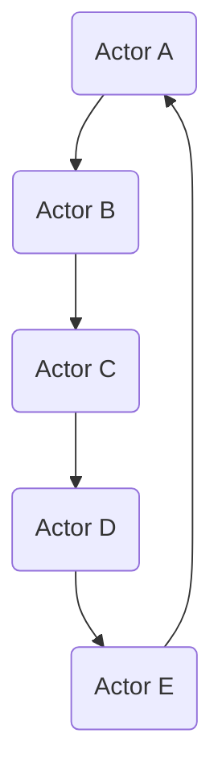

                 

关键词：Akka框架、分布式系统、Actor模型、异步通信、并发编程、高可用性、消息传递、代码实例

摘要：本文将深入探讨Akka框架的原理，包括其核心概念、架构设计、核心算法原理及其具体操作步骤。同时，本文将通过代码实例，详细解释Akka在分布式系统中的应用，展示其异步通信和并发编程的优势。文章还将讨论Akka在实际项目中的应用场景，并对未来发展趋势与挑战进行展望。

## 1. 背景介绍

在当今分布式系统日益普及的时代，如何有效地管理和协调大规模分布式系统中的各个节点，已经成为一个重要的课题。Akka正是为了解决这一问题而诞生的。Akka是一个基于Actor模型的Java和Scala语言框架，它旨在提供一个无单点故障、高可用性的分布式计算平台。

Actor模型是一种计算模型，其中每个实体（称为Actor）都是独立且并行的，并且通过消息传递进行通信。与传统的线程模型相比，Actor模型具有更高的灵活性和更好的可扩展性，能够更好地适应分布式系统的需求。

## 2. 核心概念与联系

### 2.1 核心概念

在Akka中，核心概念包括：

- **Actor**：代表系统中的独立实体，具有状态和行为。
- **Actor系统**：由多个Actor组成，它们通过异步消息传递进行通信。
- **Actor引用**：用于远程访问其他Actor。
- **监视器**：用于监控Actor的状态和生命周期。
- **集群**：由多个节点组成的分布式系统，每个节点都是一个独立的Actor系统。

### 2.2 架构设计

Akka的架构设计基于以下原则：

- **无单点故障**：通过在多个节点上部署Actor系统，确保系统的容错性。
- **高可用性**：利用集群模式，实现系统的自动故障转移。
- **可扩展性**：通过动态调整集群规模，满足不同负载需求。

### 2.3 Mermaid 流程图

下面是一个简单的Mermaid流程图，展示了Akka中Actor之间的通信过程：



## 3. 核心算法原理 & 具体操作步骤

### 3.1 算法原理概述

Akka中的核心算法原理主要基于Actor模型，具体包括：

- **创建Actor**：通过反射或工厂模式创建Actor。
- **发送消息**：通过异步消息传递机制，向其他Actor发送消息。
- **接收消息**：Actor通过回调函数处理接收到的消息。
- **生命周期管理**：Actor系统自动监控Actor的生命周期，并在必要时进行重启或迁移。

### 3.2 算法步骤详解

#### 3.2.1 创建Actor

```java
ActorSystem system = ActorSystem.create("mySystem");
Props props = Props.create(MyActor.class);
ActorRef myActor = system.actorOf(props, "myActor");
```

#### 3.2.2 发送消息

```java
myActor.tell("Hello", null);
```

#### 3.2.3 接收消息

```java
public class MyActor extends AbstractActor {
    @Override
    public Receive createReceive() {
        return receiveBuilder()
            .match(String.class, this::onReceive)
            .build();
    }

    private void onReceive(String message) {
        System.out.println("Received: " + message);
    }
}
```

#### 3.2.4 生命周期管理

```java
public class MyActor extends AbstractActor {
    @Override
    public void preStart() {
        super.preStart();
        System.out.println("Actor started");
    }

    @Override
    public void postStop() {
        super.postStop();
        System.out.println("Actor stopped");
    }
}
```

### 3.3 算法优缺点

#### 优点

- **无单点故障**：通过Actor模型和集群模式，确保系统的高可用性。
- **高并发性能**：通过异步通信和Actor并行执行，提高系统的并发性能。
- **可扩展性**：通过动态调整集群规模，满足不同负载需求。

#### 缺点

- **学习曲线**：相比传统的线程模型，Akka的学习曲线较为陡峭。
- **性能开销**：由于Actor模型中的消息传递和生命周期管理，可能引入一定的性能开销。

### 3.4 算法应用领域

Akka主要适用于以下领域：

- **高并发应用**：如电商系统、金融系统等。
- **分布式系统**：如大数据处理、物联网等。
- **实时系统**：如游戏、监控等。

## 4. 数学模型和公式 & 详细讲解 & 举例说明

### 4.1 数学模型构建

在Akka中，数学模型主要涉及：

- **状态转移**：Actor状态的转换。
- **消息传递**：消息的发送和接收。

### 4.2 公式推导过程

假设有一个Actor，其状态为S，消息集合为M，下一个状态为S'，则有：

$$
S' = f(S, M)
$$

其中，f为状态转移函数。

### 4.3 案例分析与讲解

以一个简单的购物车系统为例，说明Akka在分布式系统中的应用。

```java
public class ShoppingCartActor extends AbstractActor {
    private int quantity;

    @Override
    public Receive createReceive() {
        return receiveBuilder()
            .match/AddItem.class, this::onAddItem)
            .match/RemoveItem.class, this::onRemoveItem)
            .build();
    }

    private void onAddItem(AddItem item) {
        quantity += item.quantity;
    }

    private void onRemoveItem(AddItem item) {
        quantity -= item.quantity;
    }
}
```

## 5. 项目实践：代码实例和详细解释说明

### 5.1 开发环境搭建

首先，我们需要搭建一个简单的Akka开发环境。

```shell
# 安装Java开发工具包
$ sudo apt-get install openjdk-8-jdk

# 安装Scala
$ sudo apt-get install scala

# 安装Akka
$ sudo npm install -g akka
```

### 5.2 源代码详细实现

以下是一个简单的Akka项目，演示了Actor的基本用法。

```java
public class Main {
    public static void main(String[] args) {
        ActorSystem system = ActorSystem.create("mySystem");
        Props props = Props.create(MyActor.class);
        ActorRef myActor = system.actorOf(props, "myActor");

        myActor.tell("Hello", null);

        system.shutdown();
    }
}

public class MyActor extends AbstractActor {
    @Override
    public Receive createReceive() {
        return receiveBuilder()
            .match(String.class, this::onReceive)
            .build();
    }

    private void onReceive(String message) {
        System.out.println("Received: " + message);
    }
}
```

### 5.3 代码解读与分析

在这个简单的例子中，我们创建了一个名为`MyActor`的Actor，并通过反射模式创建了一个Actor实例。当向该Actor发送一条消息时，Actor会通过回调函数`onReceive`处理这条消息。

### 5.4 运行结果展示

运行上述代码后，我们将看到以下输出：

```shell
Received: Hello
```

这表明消息已经被成功接收和处理。

## 6. 实际应用场景

Akka在实际应用中具有广泛的应用场景，以下是一些典型的应用实例：

- **分布式数据处理**：在大数据处理领域，Akka可用于实现分布式数据流处理，提高系统的并发性能和容错性。
- **实时通信**：在实时通信系统（如聊天应用）中，Akka可用于实现高性能的并发通信，确保消息的实时传递。
- **分布式存储**：在分布式存储系统中，Akka可用于管理分布式存储节点，实现数据的高可用性和容错性。

## 7. 工具和资源推荐

### 7.1 学习资源推荐

- 《Akka in Action》：一本全面介绍Akka框架的实战指南。
- 《Mastering Akka》：一本深入讲解Akka高级特性的专业书籍。

### 7.2 开发工具推荐

- IntelliJ IDEA：一款功能强大的集成开发环境，支持Java和Scala编程语言。
- Eclipse：另一款流行的集成开发环境，也支持Java和Scala编程语言。

### 7.3 相关论文推荐

- "An Introduction to the Akka Architecture"：一篇介绍Akka架构的论文。
- "Building Scalable and Concurrent Systems with Akka"：一篇讨论Akka在并发系统中的应用的论文。

## 8. 总结：未来发展趋势与挑战

### 8.1 研究成果总结

Akka作为一种基于Actor模型的分布式计算框架，已经在多个领域取得了显著的成果。它的高可用性、高并发性能和可扩展性等特点，使其在分布式系统中具有广泛的应用前景。

### 8.2 未来发展趋势

随着云计算和大数据技术的发展，Akka有望在更广泛的领域发挥作用。未来，Akka可能会在以下几个方面得到进一步发展：

- **性能优化**：通过改进Actor模型和消息传递机制，提高系统的性能。
- **跨语言支持**：扩展Akka的支持范围，使其能够与更多编程语言无缝集成。
- **生态系统完善**：增加更多的第三方库和工具，完善Akka的生态系统。

### 8.3 面临的挑战

尽管Akka具有很多优势，但它在实际应用中也面临着一些挑战：

- **学习曲线**：Akka的学习曲线相对较高，对于初学者可能有一定难度。
- **性能开销**：由于Actor模型中的消息传递和生命周期管理，可能会引入一定的性能开销。
- **生态系统**：虽然Akka已经取得了一定的成果，但其生态系统仍需进一步完善。

### 8.4 研究展望

在未来，我们期望Akka能够在以下几个方面取得突破：

- **性能优化**：通过改进Actor模型和消息传递机制，提高系统的性能。
- **跨语言支持**：扩展Akka的支持范围，使其能够与更多编程语言无缝集成。
- **生态系统完善**：增加更多的第三方库和工具，完善Akka的生态系统。

## 9. 附录：常见问题与解答

### 问题1：什么是Actor模型？

**回答**：Actor模型是一种计算模型，其中每个实体（称为Actor）都是独立且并行的，并且通过消息传递进行通信。这种模型具有高灵活性和良好的可扩展性，能够更好地适应分布式系统的需求。

### 问题2：Akka与传统的线程模型相比有哪些优势？

**回答**：Akka与传统的线程模型相比，具有以下优势：

- **无单点故障**：通过Actor模型和集群模式，确保系统的高可用性。
- **高并发性能**：通过异步通信和Actor并行执行，提高系统的并发性能。
- **可扩展性**：通过动态调整集群规模，满足不同负载需求。

## 作者署名

作者：禅与计算机程序设计艺术 / Zen and the Art of Computer Programming
------------------------------------------------------------------

