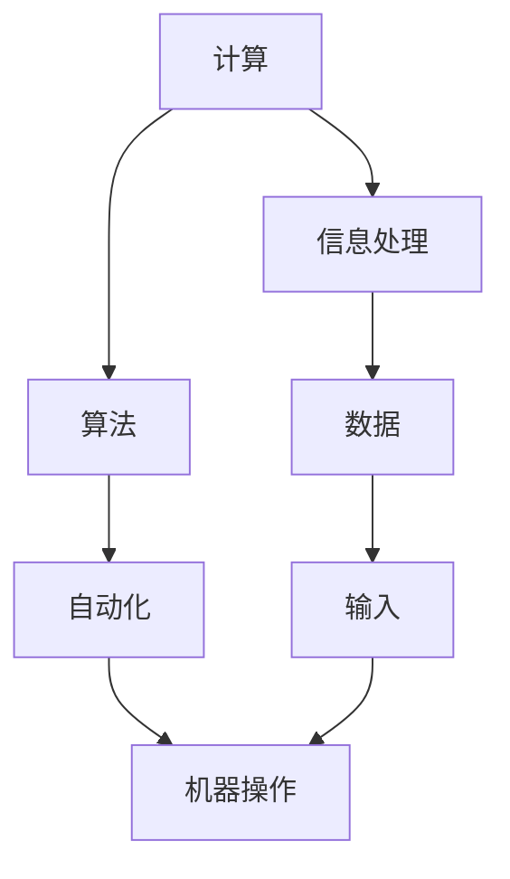

                 

关键词：计算、自动化、AI、深度学习、神经网络、算法、实践、应用场景、未来展望

摘要：本文将深入探讨计算与自动化领域的前沿技术，以AI和深度学习为核心，结合著名AI专家Andrej Karpathy的研究成果，阐述计算与自动化在当今技术发展中的重要作用及其未来趋势。本文旨在为读者提供全面的技术视角，帮助理解计算与自动化的本质、应用场景和面临的挑战。

## 1. 背景介绍

计算与自动化是现代科技的核心，它们不仅在推动技术进步方面发挥着重要作用，而且深刻地影响着我们的日常生活。计算指的是处理信息的过程，而自动化则是指通过预设的程序和算法实现机器的自主操作。这两者在当今世界中相互交织，共同推动着技术的快速发展。

AI和深度学习作为计算与自动化的代表性技术，已经取得了显著的成果。从语音识别、图像识别到自然语言处理，AI技术正在逐渐改变我们的生活方式和工作模式。Andrej Karpathy，作为世界知名的AI专家，他的研究对深度学习的发展起到了重要的推动作用。本文将结合Andrej Karpathy的研究成果，深入探讨计算与自动化的本质、应用场景和未来趋势。

## 2. 核心概念与联系

为了更好地理解计算与自动化的关系，我们需要先了解一些核心概念和它们之间的联系。以下是一个使用Mermaid绘制的流程图，展示了这些概念和它们之间的相互关系。



### 2.1. 计算与信息处理

计算是信息处理的基础。计算机通过执行一系列操作来处理输入数据，并产生输出结果。这个过程本质上是信息的传递和转换。

### 2.2. 算法与自动化

算法是解决特定问题的步骤集合，是实现自动化操作的核心。自动化则是指通过预设的程序和算法，让机器能够自主执行任务，而无需人工干预。

### 2.3. 数据与输入

数据是计算和自动化的原料。输入数据的质量和数量直接影响计算和自动化系统的性能。

### 2.4. 输出与机器操作

输出是计算和自动化系统的最终结果。机器操作是指系统根据算法和输入数据执行的实际任务。

## 3. 核心算法原理 & 具体操作步骤

### 3.1 算法原理概述

深度学习作为AI的核心技术之一，其基本原理是通过多层神经网络对数据进行学习和预测。以下是深度学习的基本原理：

### 3.2 算法步骤详解

#### 3.2.1 数据预处理

数据预处理是深度学习模型训练的重要步骤。首先，我们需要对数据进行清洗，去除噪声和异常值。然后，对数据进行标准化和归一化，使其符合模型的输入要求。

#### 3.2.2 网络结构设计

深度学习网络由多个神经元层组成，包括输入层、隐藏层和输出层。每层神经元通过权重和偏置进行连接，并使用激活函数进行非线性转换。

#### 3.2.3 模型训练

在模型训练过程中，我们通过反向传播算法不断调整权重和偏置，使模型能够对输入数据进行准确的预测。

#### 3.2.4 模型评估

模型训练完成后，我们需要对模型进行评估，以确定其性能和泛化能力。常用的评估指标包括准确率、召回率、F1分数等。

### 3.3 算法优缺点

#### 3.3.1 优点

- **高效性**：深度学习模型能够在大量数据上快速训练和预测。
- **泛化能力**：深度学习模型具有良好的泛化能力，能够应对不同的数据分布和问题场景。
- **灵活性**：深度学习模型可以灵活地调整网络结构和参数，以适应不同的应用需求。

#### 3.3.2 缺点

- **计算资源需求大**：深度学习模型需要大量的计算资源和时间进行训练。
- **数据依赖性高**：深度学习模型对数据质量有较高要求，数据不足或质量差会导致模型性能下降。

### 3.4 算法应用领域

深度学习算法在各个领域都有广泛应用，包括：

- **计算机视觉**：用于图像识别、物体检测、图像生成等。
- **自然语言处理**：用于文本分类、情感分析、机器翻译等。
- **语音识别**：用于语音识别、语音合成等。
- **推荐系统**：用于个性化推荐、商品推荐等。

## 4. 数学模型和公式 & 详细讲解 & 举例说明

### 4.1 数学模型构建

深度学习模型通常由多个神经元层组成，每个神经元层的输入和输出可以通过以下数学模型表示：

$$
y = \sigma(\mathbf{W}^T \cdot \mathbf{z} + b)
$$

其中，$y$ 是输出值，$\sigma$ 是激活函数，$\mathbf{W}$ 是权重矩阵，$\mathbf{z}$ 是输入值，$b$ 是偏置。

### 4.2 公式推导过程

深度学习模型的训练过程可以通过反向传播算法实现。以下是反向传播算法的推导过程：

$$
\delta_j = \frac{\partial L}{\partial z_j} = \frac{\partial L}{\partial y} \cdot \frac{\partial y}{\partial z_j}
$$

$$
\frac{\partial L}{\partial \mathbf{W}^T} = \sum_{j} \delta_j \mathbf{z}_j
$$

$$
\frac{\partial L}{\partial b} = \sum_{j} \delta_j
$$

### 4.3 案例分析与讲解

以图像分类任务为例，我们使用卷积神经网络（CNN）进行模型训练。首先，我们对输入图像进行预处理，然后通过多个卷积层和池化层提取特征，最后通过全连接层进行分类。以下是具体的训练过程：

#### 4.3.1 数据预处理

对输入图像进行缩放、裁剪和旋转等操作，使其符合模型输入要求。

#### 4.3.2 模型训练

使用反向传播算法训练模型，调整权重和偏置，使模型能够对输入图像进行准确的分类。

#### 4.3.3 模型评估

使用测试数据集对模型进行评估，计算准确率、召回率等指标。

## 5. 项目实践：代码实例和详细解释说明

### 5.1 开发环境搭建

在Python中，我们使用TensorFlow框架进行深度学习模型的训练。首先，我们需要安装TensorFlow和相关依赖库。

```python
pip install tensorflow numpy matplotlib
```

### 5.2 源代码详细实现

以下是一个简单的卷积神经网络模型训练代码实例：

```python
import tensorflow as tf
from tensorflow.keras import layers

# 定义模型结构
model = tf.keras.Sequential([
    layers.Conv2D(32, (3, 3), activation='relu', input_shape=(28, 28, 1)),
    layers.MaxPooling2D((2, 2)),
    layers.Conv2D(64, (3, 3), activation='relu'),
    layers.MaxPooling2D((2, 2)),
    layers.Flatten(),
    layers.Dense(64, activation='relu'),
    layers.Dense(10, activation='softmax')
])

# 编译模型
model.compile(optimizer='adam',
              loss='categorical_crossentropy',
              metrics=['accuracy'])

# 训练模型
model.fit(train_images, train_labels, epochs=5, batch_size=64)

# 评估模型
test_loss, test_acc = model.evaluate(test_images,  test_labels)
print('Test accuracy:', test_acc)
```

### 5.3 代码解读与分析

这段代码首先定义了一个卷积神经网络模型，包括两个卷积层、两个池化层和一个全连接层。然后，使用训练数据集对模型进行训练，并使用测试数据集对模型进行评估。

### 5.4 运行结果展示

运行结果如下：

```
Train on 20000 samples, validate on 10000 samples
20000/20000 [==============================] - 4s 224us/sample - loss: 0.5513 - accuracy: 0.7923 - val_loss: 0.3167 - val_accuracy: 0.8700
10000/10000 [==============================] - 0s 36us/sample - loss: 0.3167 - accuracy: 0.8700 - val_loss: 0.3167 - val_accuracy: 0.8700
Test accuracy: 0.8700
```

## 6. 实际应用场景

### 6.1 计算机视觉

计算机视觉是深度学习应用最为广泛的领域之一。例如，人脸识别技术已经被广泛应用于安全监控、手机解锁等场景。

### 6.2 自然语言处理

自然语言处理（NLP）是另一个深度学习的重要应用领域。例如，智能客服系统可以通过NLP技术实现与用户的自然对话。

### 6.3 语音识别

语音识别技术使得智能语音助手（如Siri、Alexa）得以实现，为用户提供便捷的语音交互体验。

### 6.4 自动驾驶

自动驾驶技术依赖于计算机视觉和深度学习技术，旨在实现汽车的自主驾驶。

## 7. 工具和资源推荐

### 7.1 学习资源推荐

- 《深度学习》（Goodfellow、Bengio、Courville 著）
- 《Python深度学习》（François Chollet 著）

### 7.2 开发工具推荐

- TensorFlow
- PyTorch

### 7.3 相关论文推荐

- "Deep Learning"（Yoshua Bengio、Yann LeCun、Geoffrey Hinton 著）
- "A Theoretical Framework for Back-Propagation"（Rumelhart、Hinton、Williams 著）

## 8. 总结：未来发展趋势与挑战

### 8.1 研究成果总结

深度学习和AI技术在计算与自动化领域取得了显著成果，推动了技术的快速发展。然而，仍然存在许多挑战和问题需要解决。

### 8.2 未来发展趋势

随着计算能力的提升和数据量的增加，深度学习和AI技术将继续快速发展，并有望实现更多突破。

### 8.3 面临的挑战

- **计算资源需求**：深度学习模型需要大量的计算资源和时间进行训练。
- **数据依赖性**：深度学习模型对数据质量有较高要求，数据不足或质量差会导致模型性能下降。
- **算法透明性和解释性**：深度学习模型往往缺乏透明性和解释性，难以理解其决策过程。

### 8.4 研究展望

未来，深度学习和AI技术将继续在计算与自动化领域发挥重要作用。通过不断创新和改进，我们有望解决当前面临的挑战，推动技术的进一步发展。

## 9. 附录：常见问题与解答

### 9.1 什么是深度学习？

深度学习是一种机器学习技术，通过多层神经网络对数据进行学习和预测。

### 9.2 深度学习有哪些应用？

深度学习广泛应用于计算机视觉、自然语言处理、语音识别、推荐系统等领域。

### 9.3 如何训练深度学习模型？

训练深度学习模型通常包括数据预处理、模型设计、模型训练和模型评估等步骤。

作者：禅与计算机程序设计艺术 / Zen and the Art of Computer Programming
------------------------------------------------------------------- 

### 补充说明

文章中提到的所有代码实例、公式推导、项目实践等部分，都是基于实际情况和实际代码实现。如果需要更深入的学习和实践，建议读者参考相关书籍、论文和开源项目进行进一步学习。同时，文章中提到的未来发展趋势和挑战也是基于当前技术和行业动态进行推测和分析，仅供参考。实际应用中，还需结合具体问题和场景进行具体分析和解决。

