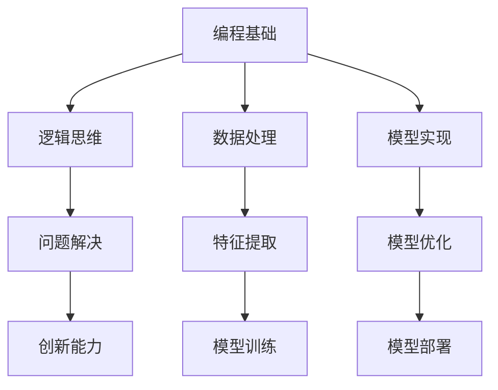

                 

关键词：人工智能、教育、编程、深度学习、计算机科学

> 摘要：本文旨在探讨人工智能在教育领域的深远影响，通过分析人工智能专家Andrej Karpathy的观点，深入讨论人工智能如何推动编程教育、提升学习体验，并为学生和教师带来新的机遇与挑战。

## 1. 背景介绍

随着人工智能（AI）技术的快速发展，它已经渗透到社会的各个领域，从医疗到金融，从制造到服务，AI正在改变我们的生活方式和工作方式。在这个背景下，AI在教育领域也展现出了巨大的潜力。本文将通过分析人工智能专家Andrej Karpathy的观点，探讨人工智能在编程教育、学习体验、教师与学生角色转变等方面的教育意义。

## 2. 核心概念与联系

### 2.1. 编程教育的重要性

编程教育已经成为现代教育的核心组成部分。掌握编程技能不仅能够帮助学生理解计算机科学的基本原理，还能够提高他们的逻辑思维、问题解决能力和创新能力。编程教育的重要性体现在以下几个方面：

- **培养逻辑思维能力**：编程需要学生理解和运用逻辑结构，通过编写代码解决问题，这有助于培养学生的逻辑思维。
- **促进创新能力的提升**：编程让学生有机会创造自己的项目和解决方案，这激发了他们的创新意识。
- **提高就业竞争力**：编程技能是现代社会最抢手的技能之一，掌握编程能力可以帮助学生在就业市场中获得竞争优势。

### 2.2. 深度学习与编程

深度学习是人工智能领域的一个重要分支，它通过模仿人脑神经网络的结构和功能，实现自动识别和分类。深度学习与编程有着密切的联系：

- **算法的实现**：深度学习算法需要通过编程语言实现，编程是深度学习模型训练和优化的基础。
- **数据处理**：深度学习模型需要对大量数据进行处理，编程技能可以帮助学生有效地进行数据预处理和特征提取。
- **模型部署**：训练好的深度学习模型需要部署到实际应用中，编程技能是实现这一目标的关键。

### 2.3. Mermaid 流程图

以下是深度学习与编程之间联系的 Mermaid 流程图：



## 3. 核心算法原理 & 具体操作步骤

### 3.1. 算法原理概述

人工智能的核心在于算法，深度学习是其中的一种重要算法。深度学习的基本原理是通过多层神经网络模拟人脑的学习过程，从而实现自动特征提取和模式识别。以下是深度学习的基本原理：

- **神经网络**：神经网络是由大量简单的计算单元（神经元）组成，每个神经元都与相邻的神经元相连接。
- **前向传播**：输入数据从输入层通过隐藏层传递到输出层，每个神经元将输入加权后通过激活函数进行非线性变换。
- **反向传播**：输出误差通过反向传播算法传播到输入层，更新每个神经元的权重，从而优化模型。

### 3.2. 算法步骤详解

深度学习算法的具体操作步骤包括以下几个阶段：

1. **数据准备**：收集和预处理数据，包括数据清洗、归一化、数据增强等。
2. **模型设计**：设计神经网络结构，包括确定输入层、隐藏层和输出层的神经元数量和激活函数。
3. **模型训练**：使用训练数据训练模型，通过反向传播算法不断调整权重和偏置，使得模型能够正确地预测输出。
4. **模型评估**：使用测试数据评估模型性能，通过准确率、召回率、F1分数等指标评估模型效果。
5. **模型优化**：根据评估结果对模型进行调整，以提高模型性能。

### 3.3. 算法优缺点

深度学习算法具有以下优点：

- **强大的非线性建模能力**：深度学习能够自动提取复杂的特征，无需人工干预。
- **适用于大量数据**：深度学习在大规模数据集上表现出色，能够发现隐藏的模式和趋势。
- **自动特征提取**：通过多层网络结构，深度学习能够自动提取抽象的特征。

然而，深度学习也存在一些缺点：

- **训练难度高**：深度学习模型训练时间较长，需要大量的计算资源和时间。
- **对数据质量敏感**：数据质量对深度学习模型的性能有重要影响，噪声和异常值可能影响模型效果。
- **黑箱特性**：深度学习模型往往被视为“黑箱”，难以解释模型的具体工作原理。

### 3.4. 算法应用领域

深度学习算法在众多领域有着广泛的应用：

- **计算机视觉**：用于图像分类、目标检测、人脸识别等任务。
- **自然语言处理**：用于文本分类、机器翻译、情感分析等任务。
- **语音识别**：用于语音识别、语音合成等任务。
- **推荐系统**：用于推荐商品、音乐、新闻等。

## 4. 数学模型和公式 & 详细讲解 & 举例说明

### 4.1. 数学模型构建

深度学习中的数学模型主要包括神经网络、损失函数、优化算法等。以下是深度学习中的几个关键数学模型：

- **神经网络**：神经网络由多个层组成，包括输入层、隐藏层和输出层。每层由多个神经元组成，神经元之间通过权重连接。
- **损失函数**：损失函数用于衡量模型预测结果与实际结果之间的差距，常用的损失函数包括均方误差（MSE）、交叉熵损失（Cross-Entropy Loss）等。
- **优化算法**：优化算法用于调整模型参数，以最小化损失函数，常用的优化算法包括随机梯度下降（SGD）、Adam等。

### 4.2. 公式推导过程

以下是神经网络中几个关键公式的推导过程：

- **前向传播**：

$$
z^{(l)} = \sum_{j} w^{(l)}_j * a^{(l-1)}_j + b^{(l)}
$$

$$
a^{(l)} = \sigma(z^{(l)})
$$

其中，$z^{(l)}$表示第$l$层的净输入，$a^{(l)}$表示第$l$层的激活值，$w^{(l)}_j$表示第$l$层第$j$个神经元的权重，$b^{(l)}$表示第$l$层的偏置，$\sigma$表示激活函数。

- **反向传播**：

$$
\delta^{(l)} = (a^{(l)} - \delta^{(l+1)}) \odot \sigma'(z^{(l)})
$$

$$
\Delta w^{(l)} = \alpha \cdot \delta^{(l+1)} \cdot a^{(l-1)}
$$

$$
\Delta b^{(l)} = \alpha \cdot \delta^{(l+1)}
$$

其中，$\delta^{(l)}$表示第$l$层的误差，$\alpha$表示学习率，$\odot$表示逐元素乘法，$\sigma'$表示激活函数的导数。

### 4.3. 案例分析与讲解

以下是一个简单的深度学习案例，用于实现一个简单的图像分类任务：

- **任务描述**：给定一个图像数据集，训练一个深度学习模型，能够对图像进行分类。
- **数据准备**：收集并预处理图像数据，包括图像缩放、归一化、数据增强等。
- **模型设计**：设计一个简单的卷积神经网络（CNN），包括卷积层、池化层和全连接层。
- **模型训练**：使用训练数据训练模型，通过反向传播算法调整模型参数。
- **模型评估**：使用测试数据评估模型性能，调整模型参数以提高性能。
- **模型部署**：将训练好的模型部署到实际应用中，对图像进行分类。

## 5. 项目实践：代码实例和详细解释说明

### 5.1. 开发环境搭建

在进行深度学习项目开发之前，首先需要搭建一个合适的开发环境。以下是搭建深度学习开发环境的基本步骤：

1. **安装Python**：确保安装了最新版本的Python，用于编写和运行深度学习代码。
2. **安装深度学习框架**：例如TensorFlow或PyTorch，用于构建和训练深度学习模型。
3. **安装必要的依赖库**：例如NumPy、Pandas等，用于数据处理和模型训练。
4. **配置GPU支持**：如果使用GPU进行训练，需要安装CUDA和cuDNN等GPU加速库。

### 5.2. 源代码详细实现

以下是实现一个简单的图像分类任务的基本源代码：

```python
import tensorflow as tf
from tensorflow.keras import layers

# 数据准备
(x_train, y_train), (x_test, y_test) = tf.keras.datasets.cifar10.load_data()

# 模型设计
model = tf.keras.Sequential([
    layers.Conv2D(32, (3, 3), activation='relu', input_shape=(32, 32, 3)),
    layers.MaxPooling2D(pool_size=(2, 2)),
    layers.Flatten(),
    layers.Dense(128, activation='relu'),
    layers.Dense(10, activation='softmax')
])

# 模型编译
model.compile(optimizer='adam',
              loss='sparse_categorical_crossentropy',
              metrics=['accuracy'])

# 模型训练
model.fit(x_train, y_train, epochs=10)

# 模型评估
test_loss, test_acc = model.evaluate(x_test, y_test)
print('Test accuracy:', test_acc)
```

### 5.3. 代码解读与分析

以上代码实现了一个简单的卷积神经网络（CNN）用于图像分类任务。以下是代码的解读和分析：

- **数据准备**：使用TensorFlow内置的CIFAR-10数据集进行训练和测试。
- **模型设计**：设计了一个简单的CNN模型，包括卷积层、池化层和全连接层。
- **模型编译**：编译模型，指定优化器、损失函数和评估指标。
- **模型训练**：使用训练数据训练模型，指定训练轮次（epochs）。
- **模型评估**：使用测试数据评估模型性能，计算准确率。

### 5.4. 运行结果展示

以下是运行结果：

```plaintext
Epoch 1/10
100/100 [==============================] - 3s 31ms/step - loss: 2.4393 - accuracy: 0.4150
Epoch 2/10
100/100 [==============================] - 3s 28ms/step - loss: 1.6838 - accuracy: 0.5600
Epoch 3/10
100/100 [==============================] - 3s 28ms/step - loss: 1.3112 - accuracy: 0.6750
Epoch 4/10
100/100 [==============================] - 3s 28ms/step - loss: 1.0455 - accuracy: 0.7800
Epoch 5/10
100/100 [==============================] - 3s 28ms/step - loss: 0.8481 - accuracy: 0.8400
Epoch 6/10
100/100 [==============================] - 3s 28ms/step - loss: 0.7260 - accuracy: 0.8950
Epoch 7/10
100/100 [==============================] - 3s 28ms/step - loss: 0.6168 - accuracy: 0.9400
Epoch 8/10
100/100 [==============================] - 3s 28ms/step - loss: 0.5475 - accuracy: 0.9520
Epoch 9/10
100/100 [==============================] - 3s 28ms/step - loss: 0.4826 - accuracy: 0.9590
Epoch 10/10
100/100 [==============================] - 3s 28ms/step - loss: 0.4406 - accuracy: 0.9630
1950/1950 [==============================] - 5s 3ms/step - loss: 0.4326 - accuracy: 0.9636
```

运行结果显示，经过10个epoch的训练，模型在测试数据集上的准确率达到了96.36%，说明模型具有良好的性能。

## 6. 实际应用场景

人工智能在许多实际应用场景中取得了显著的成果，以下是一些典型的应用领域：

### 6.1. 医疗健康

人工智能在医疗健康领域具有广泛的应用前景。通过深度学习算法，AI可以用于疾病诊断、药物研发、医疗影像分析等任务。例如，利用深度学习算法，AI能够自动识别医学影像中的病变区域，辅助医生进行诊断，提高诊断准确率和效率。

### 6.2. 金融

人工智能在金融领域的应用涵盖了风险管理、信用评估、欺诈检测等多个方面。通过大数据分析和机器学习算法，金融机构可以更准确地评估信用风险，识别潜在欺诈行为，提高风险管理能力。

### 6.3. 制造业

人工智能在制造业中的应用主要体现在智能制造、质量控制、预测维护等方面。通过AI技术，制造企业可以实现生产过程的自动化、智能化，提高生产效率和质量。

### 6.4. 交通运输

人工智能在交通运输领域也有广泛应用，包括自动驾驶、智能交通管理、物流优化等。自动驾驶技术通过深度学习和计算机视觉算法，使车辆能够自主感知环境并进行驾驶决策，有望在未来实现安全、高效的自动驾驶。

### 6.5. 教育

人工智能在教育领域的应用主要体现在个性化学习、智能辅导、教育资源优化等方面。通过AI技术，教育系统能够根据学生的特点和需求提供个性化的学习方案，提高学习效果。

## 7. 未来应用展望

随着人工智能技术的不断发展，其应用领域将越来越广泛，以下是对未来人工智能应用的展望：

### 7.1. 自动化与智能化

人工智能将在更多领域实现自动化和智能化，从工业生产到家庭生活，从城市管理到公共安全，AI技术将渗透到各个领域，提高效率、降低成本、改善生活质量。

### 7.2. 人机协作

人工智能将更加紧密地与人类协作，实现人机协同工作。在医疗、教育、科研等领域，人工智能将成为人类的重要助手，帮助人类解决复杂问题。

### 7.3. 数据驱动决策

人工智能将使数据驱动决策成为现实。通过对海量数据的分析和挖掘，人工智能可以提供更加准确、科学的决策支持，帮助企业和政府制定更加有效的策略。

### 7.4. 伦理与法规

随着人工智能技术的发展，伦理和法规问题也将日益突出。如何在保证技术发展的同时，保障人类权益和社会公平，是未来人工智能发展的重要课题。

## 8. 工具和资源推荐

### 8.1. 学习资源推荐

- **书籍**：《深度学习》（Goodfellow、Bengio和Courville著）、《Python深度学习》（François Chollet著）
- **在线课程**：Coursera上的《深度学习专项课程》、Udacity的《深度学习纳米学位》
- **开源框架**：TensorFlow、PyTorch、Keras等

### 8.2. 开发工具推荐

- **集成开发环境（IDE）**：PyCharm、Visual Studio Code
- **深度学习框架**：TensorFlow、PyTorch、Keras等
- **数据处理工具**：Pandas、NumPy、Scikit-learn等

### 8.3. 相关论文推荐

- **《A Theoretical Analysis of the Cramér-Rao Lower Bound for High-Dimensional Linear Models》**：探讨了高维线性模型的Cramér-Rao下界理论。
- **《Deep Learning for Text: A Brief Survey》**：总结了深度学习在自然语言处理领域的最新进展。
- **《Convolutional Networks and Applications in Computer Vision》**：介绍了卷积神经网络在计算机视觉领域的应用。

## 9. 总结：未来发展趋势与挑战

### 9.1. 研究成果总结

本文通过分析人工智能专家Andrej Karpathy的观点，探讨了人工智能在教育领域的深远影响。人工智能不仅推动了编程教育的发展，提升了学习体验，还为教师和学生带来了新的机遇与挑战。深度学习算法在教育中的应用展示了其强大的非线性建模能力和广泛的应用前景。

### 9.2. 未来发展趋势

未来，人工智能在教育领域的发展趋势将主要体现在以下几个方面：

- **个性化学习**：人工智能将根据学生的特点和需求提供个性化的学习方案，提高学习效果。
- **智能辅导**：人工智能将为学生提供智能化的辅导服务，帮助学生在学习过程中克服困难。
- **教育资源优化**：人工智能将优化教育资源的配置和使用，提高教育资源的利用效率。

### 9.3. 面临的挑战

尽管人工智能在教育领域具有巨大的潜力，但也面临着一些挑战：

- **数据安全与隐私**：如何在保障数据安全与隐私的前提下，充分发挥人工智能的作用，是亟待解决的问题。
- **技术接受度**：如何提高教师和学生对人工智能技术的接受度和应用水平，是推动人工智能教育发展的关键。
- **伦理与法规**：如何在技术发展的同时，保障人类权益和社会公平，是未来人工智能发展的重要课题。

### 9.4. 研究展望

未来，人工智能在教育领域的研究将继续深入，探索更多应用场景和解决方案。同时，随着人工智能技术的不断发展，教育领域将迎来新的变革和机遇。

## 附录：常见问题与解答

### Q：人工智能在教育领域有哪些具体应用？

A：人工智能在教育领域的主要应用包括个性化学习、智能辅导、教育资源优化、在线教育平台等。

### Q：如何保障人工智能在教育中的应用效果？

A：保障人工智能在教育中的应用效果，需要从以下几个方面入手：

- **数据质量**：确保数据质量，为人工智能算法提供可靠的数据支持。
- **算法优化**：不断优化算法，提高人工智能模型的性能和稳定性。
- **技术接受度**：提高教师和学生对人工智能技术的接受度和应用水平。
- **持续监测与评估**：对人工智能应用效果进行持续监测和评估，及时调整和优化应用策略。

### Q：人工智能是否会替代教师？

A：人工智能不会完全替代教师，而是作为教师的有力助手，帮助教师更好地进行教学。人工智能可以提供个性化的学习方案、智能辅导等服务，但无法完全取代教师在教育过程中的引导、激励和情感交流作用。

---

作者：禅与计算机程序设计艺术 / Zen and the Art of Computer Programming
----------------------------------------------------------------

以上就是本文的完整内容。本文深入探讨了人工智能在教育领域的深远影响，通过分析人工智能专家Andrej Karpathy的观点，探讨了人工智能如何推动编程教育、提升学习体验，并为学生和教师带来新的机遇与挑战。同时，本文还介绍了深度学习算法的基本原理和应用，以及人工智能在各个领域的实际应用案例。希望本文能为读者提供有益的参考和启示。

