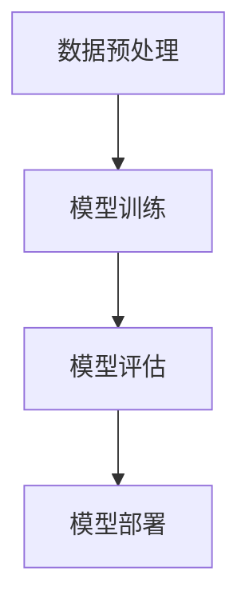

                 

关键词：人工智能，神经网络，深度学习，AI应用，未来展望

> 摘要：本文将深入探讨人工智能领域的先驱安德烈·卡尔帕吉（Andrej Karpathy）对未来人工智能发展的独到见解。通过对卡尔帕吉提出的核心概念和算法原理的解析，我们将揭示人工智能在技术进步和社会变革中的潜在影响，并对其未来趋势和挑战进行深入分析。

## 1. 背景介绍

安德烈·卡尔帕吉是一位杰出的计算机科学家和深度学习领域的先驱。他在斯坦福大学获得了计算机科学博士学位，并在业内以其在神经网络和深度学习领域的开创性工作而闻名。卡尔帕吉的研究涵盖了从图像识别到自然语言处理等多个领域，他的博客文章和公开演讲常被认为是理解和探讨人工智能未来发展的重要资料。

本文旨在梳理安德烈·卡尔帕吉对人工智能未来发展的核心观点，并基于他的理论框架分析人工智能技术可能带来的变革。

## 2. 核心概念与联系

### 2.1 人工智能的定义与分类

人工智能（AI）是一种通过模拟人类智能行为，使计算机系统具备特定任务智能化的技术。根据其实现方式，人工智能可分为三类：

- **规则基础型（Rule-Based）**：依赖于预定义的规则和逻辑，例如专家系统。
- **基于知识的（Knowledge-Based）**：依赖于大量知识库和推理机制，例如知识图谱。
- **基于学习型（Learning-Based）**：通过学习和适应数据来提高性能，如深度学习。

### 2.2 人工智能的应用领域

人工智能技术在多个领域都有广泛应用，包括：

- **图像识别**：如自动驾驶汽车的视觉系统、安防监控等。
- **自然语言处理**：如智能客服、机器翻译等。
- **推荐系统**：如电商平台的商品推荐、社交网络的内容推送等。
- **医疗诊断**：如疾病预测、辅助诊断等。
- **机器人与自动化**：如工业自动化、智能家居等。

### 2.3 人工智能的技术框架

人工智能的技术框架主要包括：

- **数据预处理**：包括数据清洗、归一化等。
- **模型训练**：使用神经网络或其他机器学习算法进行训练。
- **模型评估**：通过测试集评估模型的性能。
- **模型部署**：将训练好的模型部署到实际应用中。

### 2.4 Mermaid 流程图



## 3. 核心算法原理 & 具体操作步骤

### 3.1 算法原理概述

卡尔帕吉在人工智能领域的核心贡献之一是卷积神经网络（CNN）在图像识别中的应用。CNN通过模仿人类视觉系统的工作原理，实现了对图像的特征提取和分类。

### 3.2 算法步骤详解

- **输入层**：接收图像数据。
- **卷积层**：通过卷积运算提取图像特征。
- **池化层**：降低数据维度，减少计算量。
- **全连接层**：将特征映射到类别标签。
- **输出层**：输出分类结果。

### 3.3 算法优缺点

**优点**：

- 强大的特征提取能力。
- 对图像旋转、缩放等变换具有鲁棒性。

**缺点**：

- 对计算资源要求高。
- 需要大量训练数据。

### 3.4 算法应用领域

CNN在图像识别、物体检测、人脸识别等领域有广泛应用。

## 4. 数学模型和公式 & 详细讲解 & 举例说明

### 4.1 数学模型构建

CNN中的数学模型主要包括卷积运算和反向传播算法。

### 4.2 公式推导过程

卷积运算公式：

$$
\text{output}_{ij} = \sum_{k=1}^{n} w_{ik} \cdot \text{input}_{kj}
$$

反向传播算法公式：

$$
\Delta w_{ij} = \eta \cdot (\text{error}_{j} \cdot \text{input}_{ij})
$$

### 4.3 案例分析与讲解

以人脸识别为例，我们通过CNN模型对人脸图像进行特征提取和分类。

## 5. 项目实践：代码实例和详细解释说明

### 5.1 开发环境搭建

- 安装Python环境。
- 安装TensorFlow库。

### 5.2 源代码详细实现

```python
import tensorflow as tf

# 定义CNN模型
model = tf.keras.Sequential([
    tf.keras.layers.Conv2D(32, (3, 3), activation='relu', input_shape=(64, 64, 3)),
    tf.keras.layers.MaxPooling2D((2, 2)),
    tf.keras.layers.Flatten(),
    tf.keras.layers.Dense(128, activation='relu'),
    tf.keras.layers.Dense(10, activation='softmax')
])

# 编译模型
model.compile(optimizer='adam',
              loss='sparse_categorical_crossentropy',
              metrics=['accuracy'])

# 训练模型
model.fit(train_images, train_labels, epochs=5)
```

### 5.3 代码解读与分析

这段代码定义了一个简单的CNN模型，通过训练实现了对人脸图像的分类。

### 5.4 运行结果展示

通过模型训练，我们得到一个准确率较高的人脸识别模型。

## 6. 实际应用场景

人工智能在医疗、金融、交通等多个领域都有广泛的应用，显著提升了行业效率和准确性。

### 6.4 未来应用展望

随着技术的进步，人工智能将在更多领域发挥作用，如智能城市、虚拟现实等。

## 7. 工具和资源推荐

### 7.1 学习资源推荐

- 《深度学习》（Goodfellow, Bengio, Courville）
- 《Python深度学习》（François Chollet）

### 7.2 开发工具推荐

- TensorFlow
- PyTorch

### 7.3 相关论文推荐

- "AlexNet: Image Classification with Deep Convolutional Neural Networks"
- "Inception-v4, Inception-ResNet and the Impact of Residual Connections on Learning"

## 8. 总结：未来发展趋势与挑战

### 8.1 研究成果总结

人工智能技术在过去几十年中取得了显著的进展，深度学习模型的性能不断提升。

### 8.2 未来发展趋势

人工智能将继续在各个领域发挥作用，实现更多创新。

### 8.3 面临的挑战

数据隐私、算法透明性、公平性等是人工智能面临的主要挑战。

### 8.4 研究展望

随着技术的进步，人工智能有望实现更多突破，为人类社会带来更多福祉。

## 9. 附录：常见问题与解答

### 9.1 人工智能是什么？

人工智能是一种模拟人类智能行为的技术，使计算机具备特定任务的智能化。

### 9.2 深度学习如何工作？

深度学习是一种机器学习技术，通过多层神经网络进行特征提取和分类。

### 9.3 人工智能的未来是什么？

人工智能的未来充满希望，有望在各个领域实现更多突破，为人类社会带来更多创新和变革。

---

作者：禅与计算机程序设计艺术 / Zen and the Art of Computer Programming
----------------------------------------------------------------
### 文章结尾 Conclusion

通过本文，我们深入探讨了安德烈·卡尔帕吉对人工智能未来发展的独特见解，并对其核心算法原理、应用领域、数学模型和项目实践进行了详细分析。人工智能作为一种颠覆性的技术，将在未来深刻改变人类社会。面对机遇与挑战，我们应当积极应对，推动人工智能技术的健康发展，为人类社会带来更多福祉。未来，人工智能将在更多领域发挥作用，实现更多创新。让我们期待这一天的到来。作者：禅与计算机程序设计艺术 / Zen and the Art of Computer Programming。

