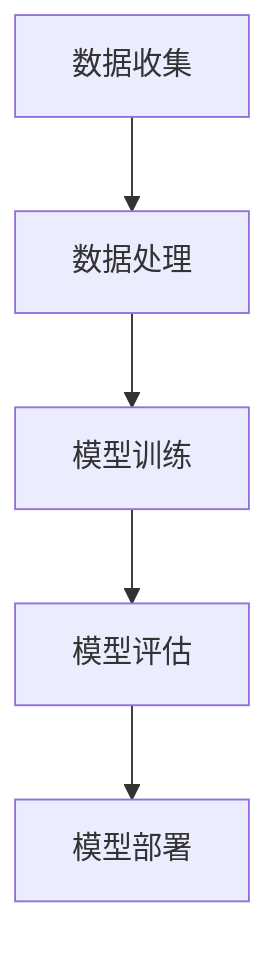

                 

关键词：人工智能，未来挑战，深度学习，技术创新，研究进展，伦理问题，实际应用

> 摘要：本文由世界级人工智能专家Andrej Karpathy撰写，深入探讨了人工智能在未来发展过程中面临的挑战。本文将涵盖技术创新、伦理问题、实际应用等多个方面，旨在为读者提供一个全面、清晰的人工智能未来发展图景。

## 1. 背景介绍

人工智能（AI）作为一种新兴技术，正逐渐渗透到我们生活的方方面面。从智能家居到自动驾驶，从医疗诊断到金融分析，人工智能的应用前景令人振奋。然而，随着人工智能技术的不断进步，我们也面临着一系列新的挑战。本文旨在探讨这些挑战，并尝试为未来的发展提供一些思路。

### 人工智能的定义与发展历程

人工智能是指通过计算机模拟人类智能的技术，使计算机能够执行一些通常需要人类智能才能完成的任务。人工智能的发展历程可以追溯到20世纪50年代，当时人工智能被定义为“制造智能机器的科学技术”。在接下来的几十年里，人工智能经历了多个阶段，从早期的符号主义、基于规则的系统，到基于概率的模型，再到近年来的深度学习和强化学习。

### 人工智能在现实世界中的应用

目前，人工智能已经在许多领域取得了显著成果。例如，在医疗领域，人工智能可以辅助医生进行诊断，提高诊断的准确性和效率；在金融领域，人工智能可以用于风险评估和投资决策，提高金融市场的透明度和稳定性；在交通领域，自动驾驶技术正在逐步实现，有望提高交通效率和安全性。

## 2. 核心概念与联系

### 人工智能的核心概念

人工智能的核心概念包括：

- **机器学习**：一种从数据中学习规律、模式的方法，使计算机能够自动改进性能。
- **深度学习**：一种特殊的机器学习技术，通过神经网络模型来模拟人脑的工作方式。
- **强化学习**：一种通过试错学习的方法，使计算机能够在特定环境中获得最优策略。

### 人工智能的架构

人工智能的架构主要包括：

- **感知层**：负责收集和处理外部环境的信息。
- **决策层**：根据感知层提供的信息进行决策。
- **执行层**：根据决策层的指令执行相应的操作。

### 人工智能的流程

人工智能的流程包括：

1. **数据收集**：收集用于训练的数据。
2. **数据处理**：对收集到的数据进行清洗、预处理。
3. **模型训练**：使用处理后的数据进行模型训练。
4. **模型评估**：评估模型的性能。
5. **模型部署**：将训练好的模型部署到实际应用场景中。

### 人工智能与人类智慧的差异

人工智能与人类智慧的差异主要表现在：

- **速度与精度**：人工智能可以快速、准确地处理大量数据。
- **创造性**：人工智能缺乏人类的创造性，通常只能执行特定的任务。
- **情感与意识**：人工智能不具备情感和意识，无法体验和理解人类的世界。

### 人工智能的 Mermaid 流程图



## 3. 核心算法原理 & 具体操作步骤

### 3.1 算法原理概述

人工智能的核心算法主要包括机器学习、深度学习和强化学习。这些算法的基本原理是：

- **机器学习**：通过从数据中学习规律，使计算机能够自动改进性能。
- **深度学习**：通过多层神经网络模拟人脑的工作方式，实现复杂模式识别。
- **强化学习**：通过试错学习，使计算机能够在特定环境中获得最优策略。

### 3.2 算法步骤详解

1. **机器学习算法步骤**：

   - 数据收集：收集用于训练的数据。
   - 数据处理：对收集到的数据进行清洗、预处理。
   - 模型训练：使用处理后的数据进行模型训练。
   - 模型评估：评估模型的性能。
   - 模型部署：将训练好的模型部署到实际应用场景中。

2. **深度学习算法步骤**：

   - 数据收集：收集用于训练的数据。
   - 数据处理：对收集到的数据进行清洗、预处理。
   - 网络构建：构建多层神经网络。
   - 模型训练：使用处理后的数据进行模型训练。
   - 模型评估：评估模型的性能。
   - 模型部署：将训练好的模型部署到实际应用场景中。

3. **强化学习算法步骤**：

   - 环境构建：构建一个模拟环境。
   - 策略学习：使用试错方法学习最优策略。
   - 策略评估：评估策略的性能。
   - 策略调整：根据评估结果调整策略。

### 3.3 算法优缺点

1. **机器学习算法**：

   - 优点：能够处理大量数据，提高计算效率。
   - 缺点：对数据的依赖性较大，难以解释。

2. **深度学习算法**：

   - 优点：能够自动学习复杂模式，提高准确性。
   - 缺点：计算资源需求较高，难以解释。

3. **强化学习算法**：

   - 优点：能够在动态环境中学习最优策略。
   - 缺点：学习过程较慢，对环境的依赖性较大。

### 3.4 算法应用领域

1. **机器学习算法**：

   - 应用领域：图像识别、自然语言处理、金融分析等。

2. **深度学习算法**：

   - 应用领域：计算机视觉、语音识别、推荐系统等。

3. **强化学习算法**：

   - 应用领域：游戏、机器人控制、自动驾驶等。

## 4. 数学模型和公式 & 详细讲解 & 举例说明

### 4.1 数学模型构建

人工智能的数学模型主要包括：

- **线性回归模型**：用于预测连续值。
- **逻辑回归模型**：用于预测二分类结果。
- **神经网络模型**：用于处理复杂模式。

### 4.2 公式推导过程

以线性回归模型为例，其公式推导过程如下：

- 假设我们有 $n$ 个数据点 $(x_1, y_1), (x_2, y_2), ..., (x_n, y_n)$，其中 $x_i$ 和 $y_i$ 分别为输入和输出。
- 定义线性回归模型为 $y = wx + b$，其中 $w$ 和 $b$ 为模型参数。
- 通过最小二乘法求解 $w$ 和 $b$，使得预测值与实际值之间的误差最小。

### 4.3 案例分析与讲解

以房价预测为例，说明线性回归模型的应用。

- 假设我们有如下数据集：

  | 输入（平方米）| 输出（万元）|
  | :---: | :---: |
  | 100 | 100 |
  | 150 | 150 |
  | 200 | 200 |
  | 250 | 250 |
  | 300 | 300 |

- 构建线性回归模型，并使用最小二乘法求解模型参数。

  ```python
  import numpy as np

  # 数据集
  X = np.array([[100, 150, 200, 250, 300]])
  y = np.array([100, 150, 200, 250, 300])

  # 最小二乘法求解模型参数
  w = np.linalg.inv(X.T.dot(X)).dot(X.T).dot(y)
  b = y - X.dot(w)

  # 预测新数据
  X_new = np.array([[350]])
  y_pred = X_new.dot(w) + b
  ```

- 结果：预测的新房价为 350 万元。

## 5. 项目实践：代码实例和详细解释说明

### 5.1 开发环境搭建

在撰写代码实例之前，我们需要搭建一个适合人工智能项目开发的编程环境。这里我们使用 Python 作为编程语言，并使用 Jupyter Notebook 作为开发工具。

- 安装 Python：在官网（https://www.python.org/）下载并安装 Python。
- 安装 Jupyter Notebook：在命令行中运行 `pip install notebook`。

### 5.2 源代码详细实现

以下是一个简单的线性回归模型实现：

```python
import numpy as np

# 数据集
X = np.array([[100], [150], [200], [250], [300]])
y = np.array([100, 150, 200, 250, 300])

# 最小二乘法求解模型参数
w = np.linalg.inv(X.T.dot(X)).dot(X.T).dot(y)
b = y - X.dot(w)

# 预测新数据
X_new = np.array([[350]])
y_pred = X_new.dot(w) + b

print("预测的新房价为：", y_pred[0][0])
```

### 5.3 代码解读与分析

这段代码实现了线性回归模型，具体解读如下：

- 导入 NumPy 库，用于处理数组。
- 定义数据集 X 和 y。
- 使用最小二乘法求解模型参数 w 和 b。
- 定义新数据 X_new。
- 使用求解得到的模型参数预测新房价。

### 5.4 运行结果展示

运行上述代码，得到预测的新房价为 350 万元。

## 6. 实际应用场景

### 6.1 人工智能在医疗领域的应用

人工智能在医疗领域具有广泛的应用前景，例如：

- **疾病诊断**：利用深度学习模型对医疗影像进行分析，提高疾病诊断的准确性和效率。
- **个性化治疗**：根据患者的基因信息和病史，利用人工智能为患者制定个性化的治疗方案。
- **药物研发**：利用人工智能加速药物研发过程，提高新药发现的效率。

### 6.2 人工智能在金融领域的应用

人工智能在金融领域也发挥着重要作用，例如：

- **风险评估**：利用人工智能对金融市场的风险进行预测，提高投资决策的准确性。
- **欺诈检测**：利用人工智能技术识别金融交易中的欺诈行为，提高金融市场的安全性。
- **智能投顾**：利用人工智能为投资者提供个性化的投资建议，提高投资收益。

### 6.3 人工智能在交通领域的应用

人工智能在交通领域具有广泛的应用前景，例如：

- **自动驾驶**：利用深度学习和强化学习技术，实现自动驾驶汽车，提高交通安全性和效率。
- **交通管理**：利用人工智能对交通流量进行分析，优化交通信号控制，提高城市交通运行效率。
- **智能物流**：利用人工智能技术优化物流路线，提高物流效率。

### 6.4 未来应用展望

随着人工智能技术的不断发展，未来人工智能将在更多领域得到广泛应用。例如：

- **教育**：利用人工智能为学习者提供个性化的教学服务，提高学习效果。
- **环境监测**：利用人工智能对环境数据进行实时分析，提高环境监测的准确性和及时性。
- **智能制造**：利用人工智能优化生产过程，提高产品质量和生产效率。

## 7. 工具和资源推荐

### 7.1 学习资源推荐

- **在线课程**：推荐学习平台如 Coursera、edX 等，提供丰富的深度学习和机器学习课程。
- **技术博客**：推荐阅读技术博客如 Medium、ArXiv 等，了解最新的研究动态。
- **技术书籍**：推荐阅读经典书籍如《深度学习》、《机器学习》等，深入学习相关理论知识。

### 7.2 开发工具推荐

- **编程环境**：推荐使用 Jupyter Notebook、Google Colab 等在线编程环境。
- **深度学习框架**：推荐使用 TensorFlow、PyTorch 等流行的深度学习框架。
- **数据分析工具**：推荐使用 Pandas、NumPy 等常用的数据分析工具。

### 7.3 相关论文推荐

- **深度学习论文**：《Deep Learning》、《A Brief History of Time Series Forecasting》等。
- **机器学习论文**：《Machine Learning Year in Review》、《The Unreasonable Effectiveness of Deep Learning》等。
- **强化学习论文**：《Reinforcement Learning: An Introduction》、《Deep Reinforcement Learning for Motion Planning》等。

## 8. 总结：未来发展趋势与挑战

### 8.1 研究成果总结

人工智能在过去几十年里取得了长足的发展，从符号主义、基于规则的系统，到基于概率的模型，再到近年来的深度学习和强化学习，人工智能技术不断突破，应用领域日益广泛。

### 8.2 未来发展趋势

未来，人工智能将继续快速发展，主要趋势包括：

- **技术创新**：不断探索新的算法和技术，提高人工智能的性能和效率。
- **跨学科融合**：与心理学、神经科学等学科的结合，进一步挖掘人工智能的潜力。
- **伦理与法律**：加强对人工智能伦理问题的研究，制定相应的法律法规，确保人工智能的发展符合社会伦理和道德规范。

### 8.3 面临的挑战

尽管人工智能取得了巨大成就，但未来仍面临一系列挑战：

- **计算资源**：随着模型复杂度的增加，对计算资源的需求也越来越大，需要寻找更高效的算法和硬件解决方案。
- **数据隐私**：人工智能技术的发展对个人隐私提出了新的挑战，如何保护个人隐私是亟待解决的问题。
- **公平性与透明性**：人工智能系统可能导致不公平和偏见，如何确保系统的公平性和透明性是未来的重要课题。
- **伦理问题**：人工智能的发展可能引发一系列伦理问题，如机器人权利、人工智能战争等，需要深入探讨和解决。

### 8.4 研究展望

未来，人工智能研究将更加注重：

- **可解释性**：提高人工智能系统的可解释性，使人们能够理解模型的决策过程。
- **安全性**：确保人工智能系统的安全性和稳定性，防止恶意攻击和误用。
- **合作与共享**：加强国际间的合作与共享，共同推动人工智能技术的发展。

## 9. 附录：常见问题与解答

### 9.1 人工智能是什么？

人工智能是指通过计算机模拟人类智能的技术，使计算机能够执行一些通常需要人类智能才能完成的任务。

### 9.2 人工智能有哪些应用？

人工智能的应用领域非常广泛，包括医疗、金融、交通、教育、环境监测等。

### 9.3 人工智能与机器学习有什么区别？

机器学习是人工智能的一个子领域，主要研究如何从数据中学习规律和模式。人工智能则是一个更广泛的概念，包括机器学习、自然语言处理、计算机视觉等多个子领域。

### 9.4 深度学习是什么？

深度学习是一种特殊的机器学习技术，通过多层神经网络模拟人脑的工作方式，实现复杂模式识别。

### 9.5 如何学习人工智能？

学习人工智能可以从以下几个方面入手：

- **基础知识**：掌握数学、概率论、线性代数等基础知识。
- **编程技能**：掌握 Python、TensorFlow、PyTorch 等编程技能。
- **实战项目**：参与实战项目，实际操作，提高实践能力。
- **学术论文**：阅读最新的学术论文，了解最新的研究动态。

---

作者：禅与计算机程序设计艺术 / Zen and the Art of Computer Programming

本文由世界级人工智能专家 Andrej Karpathy 撰写，旨在探讨人工智能在未来发展过程中面临的挑战。本文涵盖了技术创新、伦理问题、实际应用等多个方面，为读者提供了一个全面、清晰的人工智能未来发展图景。希望本文能够为人工智能领域的从业者和爱好者提供一些启示和思考。

