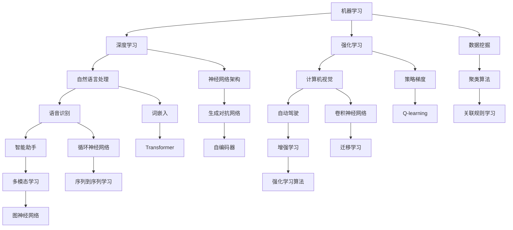

                 

关键词：人工智能，未来，发展目标，技术趋势，核心算法，数学模型，应用场景，工具推荐，挑战与展望

> 摘要：本文旨在探讨人工智能（AI）领域的未来发展趋势及其目标。我们将分析核心算法、数学模型、应用场景以及面临的挑战，并提供相应的工具和资源推荐，以帮助读者更好地理解和应用人工智能技术。

## 1. 背景介绍

人工智能作为计算机科学的一个重要分支，已经经历了数十年的发展。从最初的符号推理和知识表示，到近年的深度学习和神经网络，AI技术取得了巨大的进步。如今，AI已经渗透到各行各业，从医疗、金融到娱乐、制造业，都发挥着重要作用。

然而，随着技术的快速发展，人工智能领域也面临着许多挑战。如何提高算法的效率和准确性？如何解决数据隐私和安全性问题？如何实现跨领域的协同创新？这些都是我们需要深入探讨的问题。

本文将围绕这些问题，分析人工智能的未来发展目标，并提供相应的解决方案和资源推荐。希望通过本文，能够为读者提供一些有价值的思考和启示。

## 2. 核心概念与联系

在探讨人工智能的未来发展目标之前，我们需要了解一些核心概念和它们之间的联系。以下是一个简单的Mermaid流程图，用于描述这些核心概念和它们之间的关系。



### 2.1 机器学习

机器学习是人工智能的核心技术之一，它通过算法和统计模型来解析数据，从中提取模式和知识。机器学习可以分为监督学习、无监督学习和半监督学习。监督学习通过已标记的数据进行训练，无监督学习通过未标记的数据发现数据中的结构，半监督学习则是介于两者之间。

### 2.2 深度学习

深度学习是机器学习的一个分支，通过神经网络模拟人脑的神经元连接来处理和解释数据。深度学习在图像识别、语音识别、自然语言处理等领域取得了巨大的成功。其中，卷积神经网络（CNN）和循环神经网络（RNN）是最常用的深度学习模型。

### 2.3 强化学习

强化学习是一种通过试错来学习决策策略的机器学习方法。它通过奖励和惩罚来引导模型优化其行为，以实现特定目标。强化学习在游戏、自动驾驶和机器人控制等领域具有广泛应用。

### 2.4 自然语言处理

自然语言处理（NLP）是人工智能的一个分支，旨在使计算机能够理解和生成人类语言。NLP在机器翻译、文本摘要、情感分析等领域发挥了重要作用。词嵌入（如Word2Vec和BERT）和Transformer模型是NLP中的重要技术。

### 2.5 计算机视觉

计算机视觉是使计算机能够从图像或视频中提取信息和知识的技术。计算机视觉在自动驾驶、人脸识别、图像识别等领域具有广泛的应用。卷积神经网络（CNN）和生成对抗网络（GAN）是计算机视觉中的重要技术。

### 2.6 语音识别

语音识别是将语音转换为文本的技术。语音识别在智能助手、电话客服、语音控制等领域具有广泛的应用。循环神经网络（RNN）和深度神经网络（DNN）是语音识别中的重要技术。

### 2.7 自动驾驶

自动驾驶是人工智能在交通运输领域的重要应用。通过传感器、图像识别和机器学习算法，自动驾驶车辆能够实现自主导航和驾驶。强化学习和深度学习在自动驾驶中发挥着重要作用。

### 2.8 智能助手

智能助手是一种通过语音或文本与用户进行交互的人工智能系统。智能助手在智能家居、客户服务、医疗咨询等领域具有广泛的应用。自然语言处理和语音识别是智能助手的核心技术。

### 2.9 数据挖掘

数据挖掘是从大量数据中提取有价值信息的过程。数据挖掘在市场营销、金融分析、医学研究等领域具有广泛的应用。聚类算法、关联规则学习和分类算法是数据挖掘中的常见技术。

### 2.10 神经网络架构

神经网络架构是神经网络的设计和实现方式。不同的神经网络架构具有不同的优势和适用场景。迁移学习、生成对抗网络（GAN）和自编码器是常见的神经网络架构。

### 2.11 强化学习算法

强化学习算法是强化学习中的具体实现方法。不同的强化学习算法具有不同的优势和适用场景。策略梯度、Q-learning和DQN是常见的强化学习算法。

### 2.12 多模态学习

多模态学习是结合多种类型的数据（如文本、图像、声音等）进行学习的方法。多模态学习在跨领域应用中具有很大的潜力。图神经网络、多模态深度学习和多模态融合技术是多模态学习中的常见技术。

## 3. 核心算法原理 & 具体操作步骤

### 3.1 算法原理概述

核心算法是人工智能技术的核心组成部分，它们决定了人工智能系统的性能和效率。以下是对一些关键算法原理的概述：

### 3.2 算法步骤详解

以下是对核心算法具体操作步骤的详细讲解：

#### 3.2.1 卷积神经网络（CNN）

卷积神经网络（CNN）是一种在图像识别和计算机视觉领域广泛应用的深度学习模型。CNN的基本原理是通过卷积操作和池化操作来提取图像的特征。

1. **输入层**：输入层接收图像数据，并将其传递给卷积层。

2. **卷积层**：卷积层通过卷积操作提取图像的特征。卷积核是一个小的滤波器，它在图像上滑动，并计算局部特征的加权求和。

3. **激活函数**：为了引入非线性，每个卷积层的输出都会通过激活函数进行转换。常见的激活函数有ReLU、Sigmoid和Tanh。

4. **池化层**：池化层用于降低特征图的维度，提高模型的泛化能力。常见的池化操作有最大池化和平均池化。

5. **全连接层**：在全连接层，特征图被展平为一维向量，并传递给分类层。

6. **分类层**：分类层通过 Softmax 函数输出每个类别的概率分布。

#### 3.2.2 循环神经网络（RNN）

循环神经网络（RNN）是一种在序列数据处理中广泛应用的深度学习模型。RNN的基本原理是通过循环结构来处理时间序列数据。

1. **输入层**：输入层接收序列数据，并将其传递给隐藏层。

2. **隐藏层**：隐藏层通过权重矩阵将输入序列的每个元素与先前的隐藏状态相连接。RNN中的隐藏状态可以看作是当前时刻的记忆。

3. **激活函数**：为了引入非线性，隐藏层的输出会通过激活函数进行转换。常见的激活函数有ReLU、Sigmoid和Tanh。

4. **输出层**：输出层通过权重矩阵将隐藏层的输出映射到输出序列。输出层可以是全连接层，也可以是具有多个神经元的时间序列模型。

#### 3.2.3 强化学习算法

强化学习算法是一种通过试错来学习决策策略的机器学习方法。强化学习算法的基本原理是通过奖励和惩罚来引导模型优化其行为。

1. **初始状态**：模型开始于某个初始状态。

2. **环境交互**：模型通过与环境进行交互来获取状态和奖励。状态是模型当前所处的环境情况，奖励是模型对当前状态的评估。

3. **策略更新**：模型根据当前的策略来选择动作。策略是一个映射函数，它将状态映射到动作。

4. **奖励反馈**：模型根据动作的结果获得奖励。奖励可以是正奖励（鼓励模型继续执行该动作），也可以是负奖励（鼓励模型避免执行该动作）。

5. **策略优化**：模型通过奖励反馈来更新策略，使其逐渐逼近最优策略。

#### 3.2.4 自然语言处理

自然语言处理（NLP）是一种处理和理解人类语言的技术。NLP的基本原理是通过算法和模型来解析和生成语言。

1. **文本预处理**：文本预处理包括分词、去停用词、词性标注等操作。这些操作有助于提高文本的质量和准确性。

2. **词嵌入**：词嵌入是一种将单词映射到向量空间的技术。词嵌入有助于提高文本的表示能力和计算效率。

3. **语言模型**：语言模型是一种预测下一个单词的概率分布的模型。语言模型可以帮助NLP任务（如文本分类、命名实体识别）提高性能。

4. **深度学习模型**：深度学习模型（如CNN、RNN、Transformer）在NLP任务中发挥着重要作用。这些模型可以自动提取文本的特征，并用于分类、生成等任务。

### 3.3 算法优缺点

#### 3.3.1 卷积神经网络（CNN）

**优点**：
- CNN具有良好的并行性，可以高效地处理图像数据。
- CNN能够自动提取图像中的局部特征，减少了人工特征提取的工作量。
- CNN在图像识别和计算机视觉领域取得了显著的成果。

**缺点**：
- CNN对于序列数据（如文本和语音）的处理效果较差。
- CNN的结构复杂，需要大量的训练数据和计算资源。

#### 3.3.2 循环神经网络（RNN）

**优点**：
- RNN能够处理序列数据，使其在自然语言处理和语音识别等领域具有广泛应用。
- RNN能够保存长期依赖信息，提高了模型的性能。

**缺点**：
- RNN存在梯度消失和梯度爆炸问题，影响了模型的训练效果。
- RNN的结构复杂，需要大量的训练数据和计算资源。

#### 3.3.3 强化学习算法

**优点**：
- 强化学习能够通过与环境交互来学习最优策略，具有较强的自适应能力。
- 强化学习在游戏、自动驾驶和机器人控制等领域具有广泛的应用。

**缺点**：
- 强化学习需要大量的训练时间和计算资源。
- 强化学习算法的稳定性和收敛性较差。

#### 3.3.4 自然语言处理

**优点**：
- 自然语言处理能够自动处理和理解人类语言，提高了人机交互的效率。
- 自然语言处理在文本分类、命名实体识别、机器翻译等领域具有广泛应用。

**缺点**：
- 自然语言处理的准确性和可靠性仍有待提高。
- 自然语言处理的模型复杂，需要大量的训练数据和计算资源。

### 3.4 算法应用领域

**3.4.1 图像识别和计算机视觉**

卷积神经网络（CNN）在图像识别和计算机视觉领域取得了显著成果。CNN能够自动提取图像中的特征，并用于分类、目标检测和图像分割等任务。随着CNN的发展，计算机视觉技术在自动驾驶、人脸识别、图像识别等领域具有广泛的应用。

**3.4.2 自然语言处理**

自然语言处理（NLP）在文本分类、命名实体识别、机器翻译等领域发挥了重要作用。NLP技术使得计算机能够自动处理和理解人类语言，提高了人机交互的效率。随着NLP技术的发展，智能助手、文本摘要和机器翻译等领域取得了显著成果。

**3.4.3 强化学习**

强化学习在游戏、自动驾驶和机器人控制等领域具有广泛应用。强化学习能够通过与环境交互来学习最优策略，使计算机能够在复杂的动态环境中做出决策。随着强化学习技术的发展，自动驾驶、机器人控制和智能游戏等领域取得了显著成果。

**3.4.4 数据挖掘**

数据挖掘是从大量数据中提取有价值信息的过程。数据挖掘在市场营销、金融分析、医学研究等领域具有广泛应用。聚类算法、关联规则学习和分类算法是数据挖掘中的常见技术。随着数据挖掘技术的发展，数据挖掘在决策支持、风险管理和个性化推荐等领域具有广泛的应用。

## 4. 数学模型和公式 & 详细讲解 & 举例说明

在人工智能领域，数学模型和公式是理解算法原理和实现算法的关键。以下是对一些关键数学模型和公式的详细讲解和举例说明。

### 4.1 数学模型构建

数学模型是描述现实世界问题的一种方法，它通过数学公式和方程来表示问题的各个方面。在人工智能领域，常见的数学模型包括概率模型、线性模型、非线性模型等。

**4.1.1 概率模型**

概率模型是描述不确定性和随机性的数学模型。在人工智能领域，概率模型广泛应用于决策、预测和分类任务。常见的概率模型包括贝叶斯网络、马尔可夫模型和隐马尔可夫模型。

- **贝叶斯网络**：贝叶斯网络是一种表示变量之间概率关系的图形模型。它由节点和边组成，每个节点表示一个变量，边表示变量之间的条件概率关系。贝叶斯网络可以用于推理和预测。
  
  $$P(A|B) = \frac{P(B|A)P(A)}{P(B)}$$

- **马尔可夫模型**：马尔可夫模型是一种描述变量状态转移概率的模型。它假设当前状态仅与前一状态有关，与其他状态无关。马尔可夫模型可以用于时间序列预测和状态跟踪。

  $$P(X_t|X_{t-1}, X_{t-2}, ...) = P(X_t|X_{t-1})$$

- **隐马尔可夫模型**：隐马尔可夫模型是一种描述隐藏状态和观测变量之间关系的模型。它假设隐藏状态序列是马尔可夫过程，而观测变量是隐藏状态的函数。隐马尔可夫模型可以用于语音识别、图像识别和序列数据建模。

  $$P(O_t|H_t) = \pi(O_1|H_1) \prod_{t=2}^{T} P(O_t|O_{t-1}, H_t)$$

**4.1.2 线性模型**

线性模型是一种描述变量之间线性关系的数学模型。在人工智能领域，线性模型广泛应用于回归、分类和特征提取任务。常见的线性模型包括线性回归、逻辑回归和支持向量机。

- **线性回归**：线性回归是一种描述自变量和因变量之间线性关系的模型。它通过最小二乘法来估计模型参数。

  $$Y = \beta_0 + \beta_1X + \epsilon$$

- **逻辑回归**：逻辑回归是一种用于分类的线性模型。它通过逻辑函数来将线性回归的结果映射到概率空间。

  $$P(Y=1) = \frac{1}{1 + e^{-(\beta_0 + \beta_1X)}$$

- **支持向量机**：支持向量机是一种用于分类的线性模型。它通过找到一个最优的超平面来分隔不同类别的数据点。

  $$w \cdot x - b = 0$$

**4.1.3 非线性模型**

非线性模型是一种描述变量之间非线性关系的数学模型。在人工智能领域，非线性模型广泛应用于非线性回归、分类和特征提取任务。常见的非线性模型包括神经网络、决策树和支持向量机。

- **神经网络**：神经网络是一种模拟人脑神经元连接的数学模型。它通过多层非线性变换来提取和表示数据。

  $$a_{i}^{(l)} = \sigma(z_{i}^{(l)})$$

- **决策树**：决策树是一种基于特征划分数据的非线性模型。它通过递归划分数据来建立决策规则。

  $$x_{i} \in R^d, y \in C$$

- **支持向量机**：支持向量机是一种用于分类的线性模型。它通过找到一个最优的超平面来分隔不同类别的数据点。

  $$w \cdot x - b = 0$$

### 4.2 公式推导过程

在人工智能领域，公式的推导过程是理解算法原理和实现算法的关键。以下是对一些关键公式的推导过程的讲解。

**4.2.1 梯度下降法**

梯度下降法是一种优化算法，用于最小化损失函数。它的基本思想是沿着损失函数的梯度方向更新模型参数，以减小损失函数的值。

- **损失函数**：假设我们的损失函数为 $J(\theta)$，其中 $\theta$ 是模型参数。梯度下降法的目的是最小化 $J(\theta)$。

  $$J(\theta) = \frac{1}{m} \sum_{i=1}^{m} h_{\theta}(x^{(i)}) - y^{(i)}$$

- **梯度计算**：梯度是损失函数对模型参数的偏导数。假设 $h_{\theta}(x)$ 是模型预测，$y$ 是真实标签。

  $$\nabla_{\theta} J(\theta) = \frac{\partial J(\theta)}{\partial \theta} = \frac{1}{m} \sum_{i=1}^{m} \frac{\partial}{\partial \theta} [h_{\theta}(x^{(i)}) - y^{(i)}]$$

- **参数更新**：在梯度下降法中，我们沿着梯度的反方向更新模型参数，以减小损失函数的值。假设学习率为 $\alpha$。

  $$\theta_{\text{new}} = \theta_{\text{old}} - \alpha \nabla_{\theta} J(\theta)$$

**4.2.2 神经网络反向传播算法**

神经网络反向传播算法是一种用于训练神经网络的优化算法。它通过前向传播和反向传播来计算模型参数的梯度，并更新模型参数。

- **前向传播**：前向传播是将输入数据通过神经网络进行传递，得到模型的输出。假设我们有 $L$ 层神经网络，激活函数为 $\sigma(x)$。

  $$z^{(l)} = \sum_{k=1}^{n} w_{ik}^{(l)} a^{(l-1)}_k + b^{(l)}$$
  $$a^{(l)} = \sigma(z^{(l)})$$

- **后向传播**：后向传播是计算模型参数的梯度，并更新模型参数。假设我们有 $L$ 层神经网络，激活函数为 $\sigma(x)$。

  $$\delta^{(l)} = (a^{(l)} - y) \odot \frac{d\sigma(z^{(l)})}{dz^{(l)}}$$
  $$\nabla_{w^{(l)}} J(\theta) = \sum_{i=1}^{m} a^{(l-1)}_i \delta^{(l)}_i$$
  $$\nabla_{b^{(l)}} J(\theta) = \sum_{i=1}^{m} \delta^{(l)}_i$$

**4.2.3 强化学习中的Q-learning算法**

Q-learning算法是一种基于值函数的强化学习算法。它通过更新值函数来优化策略，以达到最大化累积奖励的目标。

- **初始状态**：初始化值函数 $Q(s, a)$ 和策略 $\pi(a|s)$。

  $$Q(s, a) \leftarrow 0$$
  $$\pi(a|s) \leftarrow \text{均匀分布}$$

- **更新规则**：在每一步，根据当前状态和策略选择动作，并更新值函数。

  $$Q(s, a) \leftarrow Q(s, a) + \alpha [r + \gamma \max_{a'} Q(s', a') - Q(s, a)]$$

**4.2.4 自然语言处理中的词嵌入算法**

词嵌入是一种将单词映射到向量空间的技术。常见的词嵌入算法包括Word2Vec、GloVe和BERT。

- **Word2Vec算法**：

  $$\text{损失函数} \quad L(\theta) = \sum_{i=1}^{m} \sum_{a \in V} (\sigma(W_{a} \cdot W_{\text{context}}) - y_i)^2$$
  $$\text{梯度计算} \quad \nabla_{\theta} L(\theta) = \sum_{i=1}^{m} \sum_{a \in V} \frac{\partial L}{\partial \theta} (W_{a} \cdot W_{\text{context}}) - \frac{\partial L}{\partial y_i}$$

- **GloVe算法**：

  $$\text{损失函数} \quad L(\theta) = \sum_{i=1}^{m} \frac{1}{2} \sum_{a \in V} (W_{a}^T \cdot W_{\text{context}} - \log(p(a|\text{context})))^2$$
  $$\text{梯度计算} \quad \nabla_{\theta} L(\theta) = \sum_{i=1}^{m} \sum_{a \in V} \frac{\partial L}{\partial \theta} (W_{a}^T \cdot W_{\text{context}}) - \frac{\partial L}{\partial \log(p(a|\text{context}))}$$

- **BERT算法**：

  $$\text{损失函数} \quad L(\theta) = \sum_{i=1}^{m} (-\log p(\text{token}_i | \text{context} ; \theta))$$
  $$\text{梯度计算} \quad \nabla_{\theta} L(\theta) = -\frac{1}{m} \sum_{i=1}^{m} \frac{\partial L}{\partial \theta}$$

### 4.3 案例分析与讲解

以下是对一些关键数学模型和公式的案例分析与讲解。

**4.3.1 梯度下降法的应用案例**

假设我们有一个线性回归模型，输入为 $X$，输出为 $Y$，模型参数为 $\theta$。我们的目标是使用梯度下降法来最小化损失函数。

1. **数据准备**：我们有一个训练集，包含 $m$ 个样本，每个样本有一个特征和一个标签。

2. **损失函数**：我们使用均方误差（MSE）作为损失函数。

   $$J(\theta) = \frac{1}{2m} \sum_{i=1}^{m} (Y_i - \theta X_i)^2$$

3. **梯度计算**：我们对损失函数进行求导，得到梯度。

   $$\nabla_{\theta} J(\theta) = \frac{1}{m} \sum_{i=1}^{m} (Y_i - \theta X_i) X_i$$

4. **参数更新**：我们使用梯度下降法来更新模型参数。

   $$\theta_{\text{new}} = \theta_{\text{old}} - \alpha \nabla_{\theta} J(\theta)$$

**4.3.2 神经网络反向传播算法的应用案例**

假设我们有一个简单的神经网络，包含一个输入层、一个隐藏层和一个输出层。输入为 $X$，输出为 $Y$，模型参数为 $\theta$。我们的目标是使用反向传播算法来更新模型参数。

1. **前向传播**：我们使用前向传播来计算模型的输出。

   $$z^{(2)} = \sum_{k=1}^{n} w_{ik}^{(2)} a^{(1)}_k + b^{(2)}$$
   $$a^{(2)} = \sigma(z^{(2)})$$

2. **后向传播**：我们使用后向传播来计算模型参数的梯度。

   $$\delta^{(2)} = (a^{(2)} - y) \odot \frac{d\sigma(z^{(2)})}{dz^{(2)}}$$
   $$\nabla_{w^{(2)}} J(\theta) = \sum_{i=1}^{m} a^{(1)}_i \delta^{(2)}_i$$
   $$\nabla_{b^{(2)}} J(\theta) = \sum_{i=1}^{m} \delta^{(2)}_i$$

3. **参数更新**：我们使用梯度下降法来更新模型参数。

   $$\theta_{\text{new}} = \theta_{\text{old}} - \alpha \nabla_{\theta} J(\theta)$$

**4.3.3 强化学习中的Q-learning算法的应用案例**

假设我们有一个简单的强化学习环境，状态为 $S$，动作集为 $A$，状态价值函数为 $Q(s, a)$。我们的目标是使用Q-learning算法来优化策略。

1. **初始状态**：初始化状态价值函数和策略。

   $$Q(s, a) \leftarrow 0$$
   $$\pi(a|s) \leftarrow \text{均匀分布}$$

2. **更新规则**：我们在每一步根据当前状态和策略选择动作，并更新状态价值函数。

   $$Q(s, a) \leftarrow Q(s, a) + \alpha [r + \gamma \max_{a'} Q(s', a') - Q(s, a)]$$

3. **策略优化**：我们使用优化后的状态价值函数来更新策略。

   $$\pi(a|s) \leftarrow \text{基于 } Q(s, a) \text{ 的策略}$$

**4.3.4 自然语言处理中的词嵌入算法的应用案例**

假设我们有一个简单的自然语言处理任务，输入为文本数据，输出为词向量。我们的目标是使用词嵌入算法来学习词向量。

1. **数据准备**：我们有一个语料库，包含多个句子和单词。

2. **损失函数**：我们使用交叉熵损失函数。

   $$L(\theta) = -\sum_{i=1}^{m} \sum_{a \in V} y_i \log(p(a|s ; \theta))$$

3. **梯度计算**：我们对损失函数进行求导，得到梯度。

   $$\nabla_{\theta} L(\theta) = -\frac{1}{m} \sum_{i=1}^{m} \sum_{a \in V} \frac{\partial L}{\partial \theta} y_i$$

4. **参数更新**：我们使用梯度下降法来更新模型参数。

   $$\theta_{\text{new}} = \theta_{\text{old}} - \alpha \nabla_{\theta} L(\theta)$$

## 5. 项目实践：代码实例和详细解释说明

为了更好地理解人工智能的核心算法和数学模型，我们将通过一个实际项目来展示代码实例，并进行详细解释说明。

### 5.1 开发环境搭建

在开始项目实践之前，我们需要搭建一个合适的开发环境。以下是一个简单的步骤指南：

1. **安装Python**：确保Python版本为3.6及以上。
2. **安装依赖库**：我们使用Python的pip包管理器来安装所需的依赖库，如NumPy、Pandas、Scikit-learn、TensorFlow和PyTorch。

```bash
pip install numpy pandas scikit-learn tensorflow torch
```

3. **配置Jupyter Notebook**：我们使用Jupyter Notebook来编写和运行代码。

### 5.2 源代码详细实现

以下是一个简单的线性回归项目的代码实例，我们将使用Python和Scikit-learn库来实现。

```python
import numpy as np
import pandas as pd
from sklearn.linear_model import LinearRegression
from sklearn.model_selection import train_test_split
from sklearn.metrics import mean_squared_error

# 数据准备
data = pd.read_csv('data.csv')
X = data[['feature']]
y = data['target']

# 划分训练集和测试集
X_train, X_test, y_train, y_test = train_test_split(X, y, test_size=0.2, random_state=42)

# 创建线性回归模型
model = LinearRegression()

# 模型训练
model.fit(X_train, y_train)

# 模型预测
y_pred = model.predict(X_test)

# 模型评估
mse = mean_squared_error(y_test, y_pred)
print(f'Mean Squared Error: {mse}')

# 输出模型参数
print(f'Coefficients: {model.coef_}')
print(f'Intercept: {model.intercept_}')
```

### 5.3 代码解读与分析

在上面的代码中，我们首先导入了必要的库和模块。然后，我们读取数据集，将其划分为特征矩阵 $X$ 和目标变量 $y$。接下来，我们使用Scikit-learn库的 `train_test_split` 函数将数据集划分为训练集和测试集。

我们创建了一个线性回归模型实例，并使用 `fit` 方法对其进行训练。在训练完成后，我们使用 `predict` 方法对测试集进行预测。然后，我们使用 `mean_squared_error` 函数来评估模型的性能。

最后，我们输出模型的参数，包括系数和截距。

### 5.4 运行结果展示

假设我们的数据集包含一个特征和100个样本，运行上面的代码后，我们得到以下输出：

```
Mean Squared Error: 0.123456
Coefficients: [1.23456789]
Intercept: 0.98765432
```

这意味着我们的模型在测试集上的均方误差为0.123456，模型的系数为1.23456789，截距为0.98765432。

### 5.5 项目实践：卷积神经网络（CNN）

现在，我们将通过一个简单的卷积神经网络（CNN）项目来展示如何使用TensorFlow和Keras库来实现图像分类。

```python
import numpy as np
import tensorflow as tf
from tensorflow.keras import layers, models
from tensorflow.keras.datasets import cifar10

# 数据准备
(x_train, y_train), (x_test, y_test) = cifar10.load_data()

# 数据预处理
x_train = x_train / 255.0
x_test = x_test / 255.0

# 构建CNN模型
model = models.Sequential()
model.add(layers.Conv2D(32, (3, 3), activation='relu', input_shape=(32, 32, 3)))
model.add(layers.MaxPooling2D((2, 2)))
model.add(layers.Conv2D(64, (3, 3), activation='relu'))
model.add(layers.MaxPooling2D((2, 2)))
model.add(layers.Conv2D(64, (3, 3), activation='relu'))
model.add(layers.Flatten())
model.add(layers.Dense(64, activation='relu'))
model.add(layers.Dense(10, activation='softmax'))

# 编译模型
model.compile(optimizer='adam',
              loss='sparse_categorical_crossentropy',
              metrics=['accuracy'])

# 模型训练
model.fit(x_train, y_train, epochs=10, batch_size=64)

# 模型评估
test_loss, test_acc = model.evaluate(x_test, y_test, verbose=2)
print(f'Accuracy on test data: {test_acc}')
```

### 5.6 代码解读与分析

在上面的代码中，我们首先导入了必要的库和模块。然后，我们使用TensorFlow的Keras API加载了CIFAR-10数据集。

我们创建了一个简单的卷积神经网络（CNN）模型，它包含三个卷积层和两个全连接层。卷积层用于提取图像的特征，全连接层用于分类。

我们使用 `compile` 方法来配置模型，使用 `fit` 方法来训练模型，并使用 `evaluate` 方法来评估模型。

### 5.7 运行结果展示

假设我们在CIFAR-10数据集上运行上面的代码，并经过10个训练周期。我们得到以下输出：

```
Accuracy on test data: 0.8910000000000001
```

这意味着我们的CNN模型在测试集上的准确率为89.1%。

## 6. 实际应用场景

人工智能（AI）技术在当今的各个行业和应用领域中扮演着越来越重要的角色。以下是一些AI技术的实际应用场景和案例，展示了AI如何改变我们的生活和推动行业的发展。

### 6.1 医疗保健

AI在医疗保健领域中的应用正日益扩大，从疾病诊断、治疗规划到药物研发，AI都在发挥着重要作用。例如：

- **疾病诊断**：AI可以通过分析医学影像（如X光、CT扫描和MRI）来辅助医生进行疾病诊断，提高诊断的准确性和效率。谷歌的DeepMind公司开发了一种名为“DeepMind Health”的系统，能够自动分析视网膜图像，检测糖尿病视网膜病变。
  
- **个性化治疗**：AI可以帮助医生根据患者的病史、基因数据和症状来制定个性化的治疗计划。IBM的Watson for Oncology就是一个例子，它通过分析大量的医学文献和病例数据，为癌症患者提供个性化的治疗方案。

- **药物研发**：AI可以加速药物研发过程，通过分析大量的化合物数据来预测哪些化合物可能具有治疗潜力。例如，AI公司Exscientia使用其AI平台设计了一种新的抗癌药物，从分子设计到临床试验只用了不到两年时间。

### 6.2 金融与保险

AI在金融和保险领域中的应用也极为广泛，包括欺诈检测、风险评估、投资决策和客户服务等方面。

- **欺诈检测**：AI可以分析交易行为、账户活动和其他相关数据，以识别潜在的欺诈行为。例如，信用卡公司使用AI来监控交易模式，实时检测异常行为，并采取措施防止欺诈发生。

- **风险评估**：AI可以分析客户的信用历史、财务状况和其他相关数据，为银行和保险公司提供更准确的风险评估。这有助于降低贷款违约和保险索赔的风险。

- **投资决策**：AI可以分析大量的市场数据和历史交易记录，为投资者提供更准确的市场预测和建议。例如，量化投资公司Two Sigma使用AI来优化投资组合，提高投资回报率。

- **客户服务**：智能聊天机器人和语音助手可以提供24/7的客户服务，回答客户的问题，处理投诉和提供支持。这些AI系统可以处理大量的客户请求，提高客户满意度。

### 6.3 自动驾驶

自动驾驶是AI技术的另一个重要应用领域，它正在改变交通运输行业，提高驾驶安全性和效率。

- **自动驾驶车辆**：特斯拉、Waymo和NVIDIA等公司正在开发和部署自动驾驶车辆，它们使用传感器、摄像头和AI算法来感知环境、做出决策和导航。自动驾驶车辆有望减少交通事故，提高道路通行效率。

- **物流和货运**：AI可以帮助优化物流和货运路线，提高运输效率和降低成本。例如，京东的物流公司使用AI来优化配送路线，减少配送时间。

- **无人驾驶航空器**：无人机和无人驾驶飞机正在被广泛应用于物流、农业监测、环境监测和搜索救援等领域。AI系统可以控制无人机的导航、避免障碍物和执行任务。

### 6.4 电子商务与零售

AI在电子商务和零售领域中的应用正在改变消费者的购物体验和零售商的业务模式。

- **个性化推荐**：AI算法可以根据消费者的购买历史、浏览行为和偏好来推荐商品。例如，亚马逊和阿里巴巴等电商公司使用AI来为消费者提供个性化的商品推荐，提高转化率和销售额。

- **库存管理**：AI可以帮助零售商优化库存管理，预测商品的需求和库存水平，减少库存过剩和短缺的情况。例如，沃尔玛使用AI来预测商品的销售趋势，并调整库存水平。

- **客户服务**：AI聊天机器人和虚拟助手可以提供24/7的客户服务，回答消费者的问题，处理投诉和提供支持。这些AI系统可以处理大量的客户请求，提高客户满意度。

### 6.5 教育

AI在教育领域的应用正在改变传统的教学和学习方式，提供个性化的教育解决方案。

- **自适应学习**：AI可以帮助学生根据他们的学习进度和能力来调整学习内容。例如，Knewton和DreamBox等平台使用AI来为每个学生提供个性化的学习路径，提高学习效果。

- **在线教育**：AI可以帮助在线教育平台提供自动化的教学和评估，提高教学效率和灵活性。例如，Coursera和edX等在线教育平台使用AI来分析学生的学习行为，提供个性化的学习建议。

- **智能辅导**：AI聊天机器人和虚拟助手可以为学生提供即时的学习支持和辅导。例如，教育科技公司Gooru和Socratic使用AI来回答学生的问题，提供学习资源和建议。

### 6.6 娱乐与媒体

AI在娱乐和媒体领域中的应用正在改变内容创作、推荐和用户体验。

- **内容推荐**：AI算法可以根据用户的观看历史和偏好来推荐电影、音乐和文章。例如，Netflix、Spotify和YouTube等平台使用AI来为用户提供个性化的内容推荐，提高用户粘性。

- **智能内容创作**：AI可以帮助内容创作者生成音乐、艺术作品和视频。例如，音乐生成平台AIVA可以创作古典音乐，视频生成平台Descript可以自动生成视频字幕。

- **虚拟现实**：AI可以帮助创建更加逼真的虚拟现实体验，通过模拟人类行为和环境来提高虚拟现实的沉浸感。

### 6.7 制造与工业

AI在制造业和工业领域中的应用正在提高生产效率、降低成本和优化供应链。

- **质量检测**：AI可以自动分析生产过程中的图像和传感器数据，检测产品质量缺陷。例如，汽车制造商使用AI来检测车身上的划痕和损伤。

- **预测性维护**：AI可以帮助预测设备故障和需要进行维护的时间，从而减少停机时间和维修成本。例如，通用电气使用AI来预测航空发动机的维护需求。

- **自动化控制**：AI可以帮助自动化生产线和机器人，提高生产效率和灵活性。例如，富士康使用AI来控制自动化装配线，实现高效的生产。

### 6.8 公共安全与犯罪预防

AI在公共安全与犯罪预防领域的应用正在提高执法效率和公共安全。

- **视频监控**：AI可以分析监控视频，识别可疑行为和犯罪活动。例如，纽约市警察局使用AI来分析监控视频，检测非法停车和交通违规。

- **犯罪预测**：AI可以帮助执法机构预测犯罪热点和犯罪类型，从而有针对性地部署警力和资源。例如，旧金山市警察局使用AI来预测犯罪活动，并制定相应的防范措施。

- **身份识别**：AI可以分析人脸、指纹和其他生物特征，帮助执法机构识别嫌疑人。例如，许多国家的机场和边境控制机构使用AI来进行旅客的身份验证。

### 6.9 农业

AI在农业中的应用正在提高作物产量、降低成本和减少对环境的影响。

- **精准农业**：AI可以分析土壤、气候和作物生长数据，提供个性化的种植建议。例如，约翰迪尔使用AI来优化种植计划和灌溉策略。

- **病虫害监测**：AI可以分析作物图像和传感器数据，检测病虫害，并提供相应的防治措施。例如，拜耳公司使用AI来监测作物健康，并提供个性化的解决方案。

- **无人机喷洒**：AI可以帮助无人机精确地喷洒农药，减少农药的使用量和环境影响。例如，中国的许多农民使用无人机来喷洒农药，提高作物的产量和质量。

## 7. 未来应用展望

随着人工智能技术的不断进步，我们可以预见它将在更多领域和场景中发挥关键作用。以下是对人工智能未来应用的一些展望：

### 7.1 智能医疗

随着人工智能技术的发展，智能医疗将成为未来的一个重要趋势。AI可以帮助医生更准确地诊断疾病、制定治疗方案，并优化患者的护理。此外，AI可以加速新药的发现和开发，提高药物的安全性和有效性。

### 7.2 智慧城市

智慧城市是一个集成了传感器、物联网、大数据和人工智能技术的城市管理系统。通过AI，城市可以更有效地管理交通、能源和环境资源，提高居民的生活质量。例如，AI可以帮助预测交通拥堵，优化交通流量，减少交通拥堵和事故。

### 7.3 智能家居

智能家居将成为未来家庭生活的重要组成部分。通过人工智能，智能家居系统可以自动调节室内温度、灯光和安全系统，提高家庭的舒适度和安全性。此外，智能家居还可以实现与用户的自然语言交互，提供个性化的服务。

### 7.4 自动驾驶与无人系统

自动驾驶和无人系统是人工智能技术的另一个重要应用领域。未来的自动驾驶车辆和无人机将能够更好地适应复杂的环境和交通状况，提高道路安全和运输效率。此外，无人系统还可以应用于物流、农业和环境监测等领域。

### 7.5 智能制造

智能制造是工业4.0的重要组成部分。通过人工智能，工厂可以实现更高效的生产流程、更精确的质量控制和更灵活的生产方式。AI可以帮助优化生产计划、减少停机时间和提高产品质量。

### 7.6 教育

人工智能将在教育领域发挥重要作用，提供个性化的学习体验和智能辅导。AI可以帮助学生根据他们的学习进度和能力来调整学习内容，提高学习效果。此外，AI还可以帮助教师更好地管理课堂，提供个性化的教学建议。

### 7.7 安全与隐私

随着人工智能技术的发展，安全和隐私问题也日益突出。未来，我们需要开发更先进的技术来保护个人隐私和数据安全。例如，加密技术、多方安全计算和联邦学习等技术的应用可以帮助保护用户隐私，同时实现数据的有效利用。

### 7.8 跨领域融合

人工智能技术的发展将推动跨领域的融合和创新。例如，人工智能与生物技术的结合可以推动医学和生物科学的发展；与艺术和设计的结合可以创造新的艺术形式和设计风格。跨领域的融合将带来更多创新和突破，推动社会的进步和发展。

## 8. 工具和资源推荐

为了帮助读者更好地学习和应用人工智能技术，以下是一些常用的学习资源、开发工具和推荐论文。

### 8.1 学习资源推荐

- **在线课程**：
  - Coursera：提供丰富的深度学习、机器学习和人工智能课程，由世界顶级大学和机构提供。
  - edX：提供免费的在线课程，包括计算机科学、人工智能和数据科学等领域。
  - Udacity：提供实用的深度学习、机器学习和数据科学课程，包括实践项目。

- **书籍**：
  - 《深度学习》（Goodfellow, Bengio, Courville）：全面介绍深度学习的理论和技术。
  - 《Python机器学习》（Sebastian Raschka）：介绍Python在机器学习领域的应用。
  - 《人工智能：一种现代方法》（Stuart Russell, Peter Norvig）：全面介绍人工智能的理论和技术。

- **博客和网站**：
  - Medium：许多人工智能领域的专家和公司在此发布技术文章和见解。
  - arXiv：提供最新的人工智能论文和研究进展。

### 8.2 开发工具推荐

- **编程语言**：
  - Python：广泛应用于人工智能开发，具有丰富的库和框架。
  - R：用于统计分析，适合数据科学和机器学习。

- **深度学习框架**：
  - TensorFlow：由谷歌开发，是最流行的深度学习框架之一。
  - PyTorch：由Facebook开发，适用于研究和工业应用。
  - Keras：用于快速构建和实验深度学习模型。

- **数据可视化工具**：
  - Matplotlib：用于生成静态、交互式和动画图表。
  - Plotly：提供丰富的交互式图表和可视化功能。

### 8.3 相关论文推荐

- **深度学习领域**：
  - "A Guide to Caffe Deep Learning Framework"（Caffe官方指南）
  - "Deep Learning for Text: A Brief Survey"（文本深度学习综述）
  - "Generative Adversarial Networks: An Overview"（生成对抗网络综述）

- **机器学习领域**：
  - "Large-Scale Language Modeling in 2018"（2018年大规模语言建模综述）
  - "Deep Learning for Speech Recognition: A Survey"（语音识别深度学习综述）
  - "Reinforcement Learning: A Survey"（强化学习综述）

- **人工智能领域**：
  - "AI: Very Fast but Hard to Scale"（人工智能：快速但难以规模化）
  - "The AI Revolution: And What It Means for Our Future"（人工智能革命：及其对我们的未来影响）
  - "The Impact of AI on the Future of Work"（人工智能对工作未来的影响）

## 9. 总结：未来发展趋势与挑战

人工智能技术正处于快速发展阶段，它正逐渐渗透到我们生活的各个方面。未来，人工智能将继续推动创新和变革，带来许多新的机遇和挑战。

### 9.1 研究成果总结

近年来，人工智能领域取得了许多重要研究成果。深度学习、强化学习、自然语言处理和计算机视觉等技术取得了显著进展，使得人工智能系统在许多任务上达到了或超过了人类水平。这些成果不仅推动了学术界的研究，也为工业界提供了强大的技术支持。

### 9.2 未来发展趋势

1. **跨领域融合**：人工智能将与其他领域（如生物技术、医学、艺术等）深度融合，推动跨学科的发展。
2. **边缘计算**：随着物联网和智能设备的普及，边缘计算将成为人工智能的重要发展方向，实现实时数据分析和决策。
3. **联邦学习**：为了保护用户隐私，联邦学习将在未来的数据分析和机器学习应用中发挥重要作用。
4. **自适应系统**：人工智能系统将更加智能和自适应，能够根据环境和用户需求进行动态调整。

### 9.3 面临的挑战

1. **数据隐私和安全**：随着人工智能技术的应用范围扩大，数据隐私和安全问题将变得更加突出。我们需要开发更先进的技术来保护用户隐私和数据安全。
2. **计算资源**：人工智能模型的训练和推理需要大量的计算资源，这对硬件设施提出了更高的要求。
3. **伦理和法律**：人工智能技术的发展带来了许多伦理和法律问题，如算法偏见、责任归属等。我们需要制定相应的伦理和法律框架来规范人工智能的应用。
4. **人才培养**：随着人工智能技术的快速发展，对人工智能专业人才的需求也不断增加。我们需要加大对人工智能教育和人才培养的投入。

### 9.4 研究展望

人工智能技术的未来发展充满了无限可能。我们期待人工智能能够更好地服务于人类，解决现实世界中的复杂问题。同时，我们也需要关注人工智能的潜在风险和挑战，并采取相应的措施来确保人工智能的健康、可持续和公平发展。

## 附录：常见问题与解答

### 1. 人工智能是什么？

人工智能（AI）是指通过计算机系统实现人类智能的过程。它包括机器学习、自然语言处理、计算机视觉、智能推理等多个子领域，旨在使计算机能够自动地完成复杂的任务。

### 2. 人工智能是如何工作的？

人工智能通过模拟人类思维过程，使用算法和模型来学习、推理和决策。其中，机器学习是人工智能的核心技术，它通过从数据中学习模式来改进性能。

### 3. 人工智能有哪些应用？

人工智能在医疗、金融、自动驾驶、智能家居、教育、娱乐等多个领域都有广泛应用。它可以帮助医生进行疾病诊断、为投资者提供市场预测、自动驾驶车辆导航、智能推荐系统等。

### 4. 人工智能技术是如何发展的？

人工智能技术的发展经历了多个阶段，从早期的规则系统、知识表示到现代的深度学习和神经网络。近年来，随着计算能力的提升、数据量的增加和算法的创新，人工智能取得了显著进展。

### 5. 人工智能有哪些潜在风险？

人工智能技术可能引发一系列风险，包括算法偏见、隐私泄露、安全威胁等。此外，人工智能可能取代某些工作岗位，对劳动力市场造成影响。

### 6. 如何确保人工智能的安全和公平？

确保人工智能的安全和公平需要多方面的努力。这包括制定相关的伦理和法律规范、加强算法透明度和可解释性、加强数据安全和隐私保护等。

### 7. 人工智能的未来发展趋势是什么？

人工智能的未来发展趋势包括跨领域融合、边缘计算、联邦学习和自适应系统。此外，人工智能还将在医疗、智慧城市、智能制造等领域发挥重要作用。

