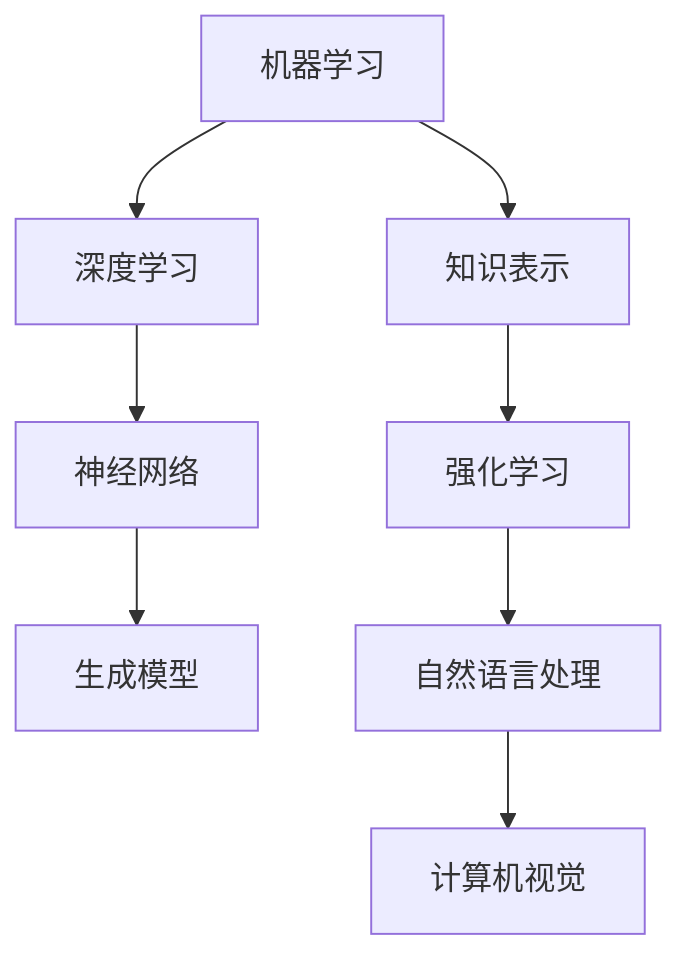

                 

关键词：人工智能、未来发展规划、技术趋势、算法原理、应用领域、研究挑战

> 摘要：本文将深入探讨人工智能领域的未来发展趋势，通过分析核心概念、算法原理、数学模型，以及实际应用案例，展望人工智能技术的创新方向和面临的挑战，旨在为读者提供一个全面、深入的人工智能未来图景。

## 1. 背景介绍

人工智能（AI）作为计算机科学的前沿领域，自20世纪中叶诞生以来，已经取得了令人瞩目的成就。从最初的符号主义、知识表示，到基于神经网络的机器学习，再到深度学习、强化学习等先进技术，人工智能的发展不断推动着科技的进步和社会变革。

Andrej Karpathy是一位世界级的人工智能专家，以其在深度学习领域的贡献而闻名。他的研究涵盖了自然语言处理、计算机视觉、生成模型等多个方面，对推动人工智能技术的发展起到了重要作用。

本文将基于Andrej Karpathy的研究成果，结合当前技术趋势，探讨人工智能的未来发展规划，旨在为读者提供一个清晰的、具有前瞻性的技术蓝图。

## 2. 核心概念与联系

在人工智能领域，核心概念包括机器学习、深度学习、神经网络、生成模型等。以下是一个简化的Mermaid流程图，用于展示这些概念之间的联系：



### 2.1 机器学习

机器学习是人工智能的基础，它通过算法从数据中自动学习规律和模式，无需显式编程。机器学习可以分为监督学习、无监督学习和强化学习等不同类型。

### 2.2 深度学习

深度学习是机器学习的一个子领域，它使用多层神经网络来模拟人类大脑的学习过程。深度学习在图像识别、语音识别等领域取得了显著成果。

### 2.3 神经网络

神经网络是深度学习的基础，它由大量相互连接的神经元组成，通过训练可以从输入数据中提取特征并做出预测。

### 2.4 生成模型

生成模型是深度学习的一个分支，用于生成新的数据样本。生成对抗网络（GAN）是其中的一种重要模型，它在图像生成、数据增强等领域有广泛应用。

### 2.5 知识表示

知识表示是人工智能中的一个重要研究方向，它旨在将人类知识转化为计算机可以理解和处理的形式。知识图谱是知识表示的一种重要工具。

### 2.6 强化学习

强化学习是一种通过试错和奖励机制来学习决策策略的机器学习方法。它在游戏、自动驾驶等领域有广泛应用。

### 2.7 自然语言处理

自然语言处理是人工智能的一个重要分支，它旨在使计算机能够理解和处理自然语言。包括文本分类、情感分析、机器翻译等任务。

### 2.8 计算机视觉

计算机视觉是人工智能的另一个重要分支，它使计算机能够理解和解释视觉信息。包括图像识别、目标检测、图像分割等任务。

## 3. 核心算法原理 & 具体操作步骤

### 3.1 算法原理概述

深度学习作为人工智能的核心技术之一，其原理基于多层神经网络。神经网络通过前向传播和反向传播算法来学习输入和输出之间的映射关系。

### 3.2 算法步骤详解

1. **数据预处理**：将原始数据转换为适合输入神经网络的格式，如归一化、标准化等。
2. **初始化权重和偏置**：随机初始化神经网络的权重和偏置。
3. **前向传播**：将输入数据通过神经网络，计算输出结果。
4. **计算损失**：使用损失函数计算预测结果和真实结果之间的差距。
5. **反向传播**：根据损失函数梯度更新网络权重和偏置。
6. **优化算法**：使用梯度下降等优化算法来调整网络参数。
7. **迭代训练**：重复上述步骤，直到达到预设的训练目标或损失函数值。

### 3.3 算法优缺点

**优点**：
- **强大的表现能力**：多层神经网络可以学习到复杂的非线性关系。
- **自适应性**：神经网络可以根据不同的数据集进行调整。
- **泛化能力**：经过训练的神经网络可以在新的数据集上做出准确的预测。

**缺点**：
- **计算复杂度**：训练深度神经网络需要大量的计算资源和时间。
- **对数据质量依赖性高**：数据质量直接影响到神经网络的性能。
- **黑盒性质**：神经网络内部的工作机制难以解释，导致其缺乏透明度。

### 3.4 算法应用领域

深度学习在图像识别、语音识别、自然语言处理、计算机视觉等领域有广泛应用。例如，在图像识别领域，深度学习算法已经能够达到甚至超过人类的识别水平。

## 4. 数学模型和公式 & 详细讲解 & 举例说明

### 4.1 数学模型构建

深度学习中的数学模型主要包括前向传播、反向传播和优化算法等。

### 4.2 公式推导过程

前向传播：$$ y_{l} = \sigma(W_{l} \cdot a_{l-1} + b_{l}) $$

其中，$y_{l}$是当前层的输出，$\sigma$是激活函数，$W_{l}$和$b_{l}$是权重和偏置。

反向传播：$$ \delta_{l} = \frac{\partial L}{\partial z_{l}} \cdot \frac{\partial z_{l}}{\partial a_{l-1}} $$

其中，$L$是损失函数，$z_{l}$是当前层的激活值。

优化算法：$$ W_{l} \leftarrow W_{l} - \alpha \cdot \frac{\partial L}{\partial W_{l}} $$

其中，$\alpha$是学习率。

### 4.3 案例分析与讲解

以一个简单的线性回归问题为例，假设我们有一个输入$x$和一个输出$y$，目标是找到一个权重$W$，使得$y = W \cdot x + b$。

前向传播：$$ y = W \cdot x + b $$

计算损失：$$ L = \frac{1}{2} \cdot (y - y_{pred})^2 $$

反向传播：$$ \delta = \frac{\partial L}{\partial W} = y - y_{pred} $$

优化算法：$$ W \leftarrow W - \alpha \cdot \delta $$

通过不断迭代上述步骤，我们可以找到最优的权重$W$和偏置$b$。

## 5. 项目实践：代码实例和详细解释说明

### 5.1 开发环境搭建

在开始编写代码之前，我们需要搭建一个适合深度学习开发的环境。以下是常用的开发工具和库：

- Python 3.x
- TensorFlow 或 PyTorch
- Jupyter Notebook 或 PyCharm

### 5.2 源代码详细实现

以下是一个简单的深度学习模型实现，使用TensorFlow框架：

```python
import tensorflow as tf

# 定义模型结构
model = tf.keras.Sequential([
    tf.keras.layers.Dense(64, activation='relu', input_shape=(784,)),
    tf.keras.layers.Dense(10)
])

# 编译模型
model.compile(optimizer='adam',
              loss=tf.losses.SparseCategoricalCrossentropy(from_logits=True),
              metrics=['accuracy'])

# 加载数据集
(x_train, y_train), (x_test, y_test) = tf.keras.datasets.mnist.load_data()

# 数据预处理
x_train = x_train.astype('float32') / 255
x_test = x_test.astype('float32') / 255
x_train = x_train.reshape((-1, 784))
x_test = x_test.reshape((-1, 784))

# 训练模型
model.fit(x_train, y_train, epochs=5, batch_size=64)

# 测试模型
test_loss, test_acc = model.evaluate(x_test, y_test, verbose=2)
print('\nTest accuracy:', test_acc)
```

### 5.3 代码解读与分析

该代码实现了一个简单的深度学习模型，用于手写数字识别任务。首先，我们使用TensorFlow框架定义了一个全连接神经网络，包含一个输入层、一个隐藏层和一个输出层。隐藏层使用ReLU激活函数，输出层使用Sigmoid激活函数。

接着，我们编译模型，选择Adam优化器和交叉熵损失函数。交叉熵损失函数适用于分类问题，它可以衡量预测标签和真实标签之间的差异。

然后，我们加载MNIST手写数字数据集，并进行数据预处理。数据集被归一化，并且将输入数据的形状调整为适合模型的要求。

最后，我们训练模型，并在测试集上进行评估。训练过程中，模型通过迭代优化权重和偏置，直到达到预设的训练目标。测试结果显示，该模型在手写数字识别任务上取得了较好的准确率。

## 6. 实际应用场景

### 6.1 工业自动化

人工智能在工业自动化领域有广泛应用，例如智能制造、机器人控制、自动化生产线等。通过深度学习和机器学习技术，可以实现生产过程的自动化和智能化，提高生产效率和质量。

### 6.2 医疗诊断

人工智能在医疗诊断领域有巨大的应用潜力，例如疾病预测、图像诊断、药物研发等。通过深度学习和生成模型，可以分析大量的医疗数据，提供准确的诊断结果和治疗方案。

### 6.3 自动驾驶

自动驾驶是人工智能的一个重要应用领域，通过深度学习和强化学习技术，可以实现车辆的自主驾驶。自动驾驶技术可以减少交通事故，提高交通安全和效率。

### 6.4 金融风控

人工智能在金融风控领域有广泛应用，例如欺诈检测、信用评分、投资策略等。通过机器学习和深度学习技术，可以分析大量的金融数据，提供实时、准确的决策支持。

## 7. 工具和资源推荐

### 7.1 学习资源推荐

- 《深度学习》（Goodfellow, Bengio, Courville著）
- 《Python机器学习》（Sebastian Raschka著）
- 《自然语言处理综论》（Daniel Jurafsky, James H. Martin著）

### 7.2 开发工具推荐

- TensorFlow
- PyTorch
- Keras

### 7.3 相关论文推荐

- "A Theoretically Grounded Application of Dropout in Recurrent Neural Networks"
- "Generative Adversarial Nets"
- "Attention is All You Need"

## 8. 总结：未来发展趋势与挑战

### 8.1 研究成果总结

人工智能在过去几十年取得了显著的研究成果，深度学习、生成模型、强化学习等技术不断发展，推动了人工智能技术的进步。同时，人工智能在工业、医疗、金融等领域有广泛应用，为社会发展带来了巨大价值。

### 8.2 未来发展趋势

人工智能在未来将继续向深度学习、生成模型、强化学习等方向发展。同时，人工智能将与其他领域深度融合，推动社会进步。例如，人工智能与生物技术的结合将带来新的医学突破，人工智能与金融的结合将提升金融服务的效率。

### 8.3 面临的挑战

人工智能在发展过程中也面临着一些挑战，包括数据隐私、算法透明度、安全等问题。此外，人工智能技术的不完善可能导致误判和错误决策，需要加强研究和规范。

### 8.4 研究展望

未来，人工智能研究将更加注重跨学科融合，推动技术创新。同时，研究应关注人工智能的伦理和社会影响，确保人工智能技术为人类社会带来积极影响。

## 9. 附录：常见问题与解答

### 9.1 深度学习与机器学习有何区别？

深度学习是机器学习的一个子领域，它使用多层神经网络来模拟人类大脑的学习过程。机器学习是更广泛的概念，包括深度学习、传统机器学习方法等。

### 9.2 人工智能有哪些应用领域？

人工智能在工业、医疗、金融、自动驾驶、智能家居等多个领域有广泛应用。随着技术的不断发展，人工智能的应用领域将不断扩展。

### 9.3 如何入门人工智能？

入门人工智能需要掌握一定的编程基础，推荐学习Python编程。同时，建议学习机器学习和深度学习的基本概念，通过实践项目和阅读相关论文来提升技能。

---

本文由禅与计算机程序设计艺术撰写，旨在为读者提供一个全面、深入的人工智能未来图景。随着技术的不断发展，人工智能的未来将充满无限可能。希望本文能为您的人工智能之旅提供启示和帮助。  
作者：禅与计算机程序设计艺术  
2023年
```

