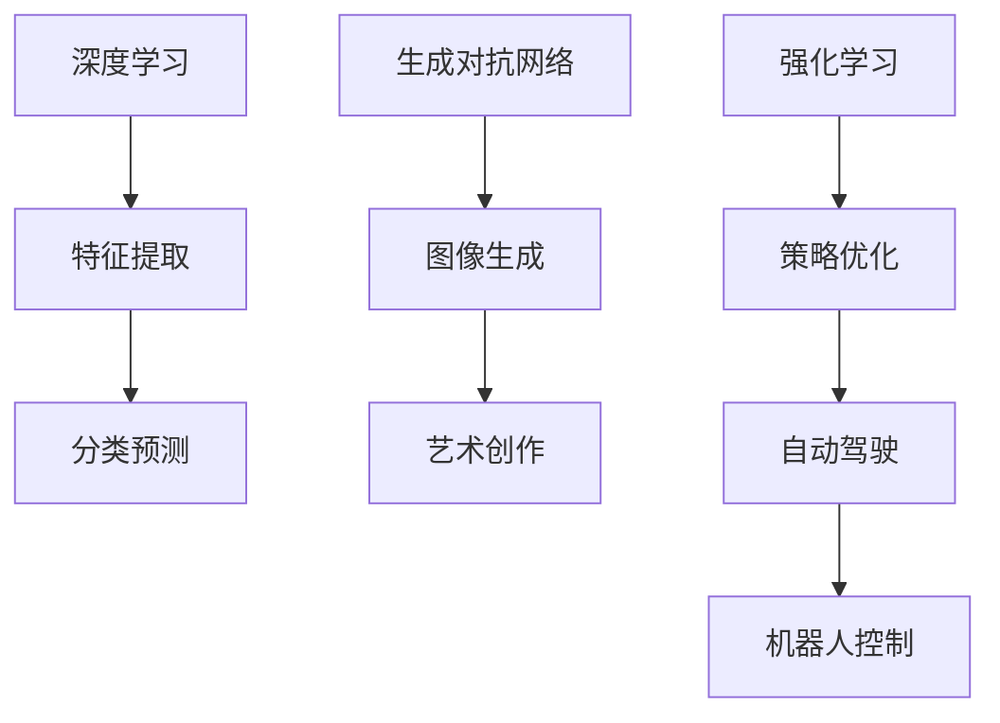

                 

关键词：人工智能、未来发展规划、技术趋势、算法研究、应用场景

> 摘要：本文将深入探讨人工智能领域的未来发展规划，分析当前技术趋势，讨论核心算法原理及其应用领域，并展望未来的发展方向与面临的挑战。

## 1. 背景介绍

人工智能（AI）作为计算机科学的重要分支，近年来取得了令人瞩目的进展。从最初的规则系统到基于统计方法的机器学习，再到深度学习的突破，AI 在语音识别、图像处理、自然语言处理等领域都展现出了强大的能力。本文旨在探讨人工智能未来的发展规划，帮助读者理解这一领域的最新动态和潜在方向。

### 当前 AI 发展现状

当前，人工智能已经渗透到各行各业，成为推动社会进步的重要力量。从自动驾驶汽车到智能家居，从医疗诊断到金融分析，AI 的应用越来越广泛。与此同时，AI 研究也取得了众多突破，例如：

- **深度学习**：通过多层神经网络进行特征提取和分类，深度学习在图像识别、语音识别等领域取得了显著成果。
- **强化学习**：通过学习与环境交互来优化策略，强化学习在游戏、机器人控制等领域展现了巨大潜力。
- **生成对抗网络（GAN）**：通过对抗性训练生成逼真的图像和文本，GAN 在图像处理和艺术创作等领域引起了广泛关注。

### 未来发展规划的重要性

面对 AI 技术的快速发展，制定未来发展规划具有重要意义。一方面，它有助于明确研究方向和目标，避免重复性研究；另一方面，它能为政策制定者、企业和社会提供指导，推动 AI 技术的健康发展。因此，深入探讨 AI 的未来发展规划，对于推动这一领域的发展具有深远的影响。

## 2. 核心概念与联系

在讨论人工智能的未来发展规划之前，有必要先了解一些核心概念及其相互之间的联系。以下是几个关键概念：

### 2.1. 深度学习

深度学习是一种基于多层神经网络的学习方法，旨在通过学习大量数据来提取复杂特征并进行预测。其核心在于网络的层次结构，每一层都能对输入数据进行处理和变换，从而实现从简单特征到复杂特征的提取。

### 2.2. 生成对抗网络（GAN）

生成对抗网络（GAN）是一种由生成器和判别器组成的对抗性模型。生成器试图生成逼真的数据，而判别器则试图区分生成数据和真实数据。通过这种对抗性训练，GAN 能够生成高质量、逼真的图像和文本。

### 2.3. 强化学习

强化学习是一种通过学习与环境交互来优化策略的方法。其核心在于奖励机制，通过不断地尝试和反馈，智能体能够逐渐学习到最优策略。

### 2.4. 联系

这些核心概念在人工智能领域相互联系，共同推动 AI 的发展。例如，深度学习可以用于生成对抗网络，通过深度生成模型生成逼真的图像；强化学习可以应用于自动驾驶和机器人控制，通过不断优化策略来提高性能。

### Mermaid 流程图

以下是一个描述核心概念及其相互之间联系的 Mermaid 流程图：



## 3. 核心算法原理 & 具体操作步骤

### 3.1 算法原理概述

在人工智能领域，核心算法原理至关重要。以下将介绍几种重要的算法原理及其应用：

#### 3.1.1 深度学习

深度学习基于多层神经网络，通过前向传播和反向传播算法进行训练。其原理如下：

1. **前向传播**：将输入数据通过网络的各层进行传递，每一层都对其进行线性变换和激活函数处理。
2. **反向传播**：计算输出误差，将误差反向传播至网络的每一层，通过梯度下降算法调整网络权重。

#### 3.1.2 生成对抗网络（GAN）

生成对抗网络（GAN）由生成器和判别器组成，其原理如下：

1. **生成器**：生成逼真的数据，例如图像或文本。
2. **判别器**：判断输入数据是真实数据还是生成数据。
3. **对抗训练**：生成器和判别器相互竞争，生成器试图生成更逼真的数据，而判别器则试图区分真实和生成数据。

#### 3.1.3 强化学习

强化学习通过学习与环境交互来优化策略，其原理如下：

1. **奖励机制**：智能体根据其行为获得奖励或惩罚。
2. **策略优化**：通过不断尝试和反馈，智能体学习到最优策略。

### 3.2 算法步骤详解

以下将详细描述每种算法的具体操作步骤：

#### 3.2.1 深度学习

1. **数据预处理**：对输入数据进行分析和预处理，例如归一化、数据增强等。
2. **网络结构设计**：设计神经网络结构，包括输入层、隐藏层和输出层。
3. **前向传播**：将输入数据通过网络进行前向传播，得到输出结果。
4. **反向传播**：计算输出误差，通过反向传播算法调整网络权重。
5. **模型评估**：使用验证集评估模型性能，调整模型参数。

#### 3.2.2 生成对抗网络（GAN）

1. **生成器训练**：生成器尝试生成逼真的数据，判别器判断生成数据和真实数据。
2. **判别器训练**：判别器尝试区分生成数据和真实数据。
3. **对抗训练**：生成器和判别器相互竞争，生成器不断优化生成数据，判别器不断提高区分能力。

#### 3.2.3 强化学习

1. **环境初始化**：初始化环境状态。
2. **策略选择**：智能体根据当前状态选择一个动作。
3. **执行动作**：智能体执行所选动作，与环境进行交互。
4. **反馈机制**：根据动作结果获得奖励或惩罚。
5. **策略更新**：智能体根据反馈更新策略。

### 3.3 算法优缺点

每种算法都有其优缺点：

#### 3.3.1 深度学习

- **优点**：能够自动提取复杂特征，适用于图像识别、语音识别等任务。
- **缺点**：训练过程复杂，对数据量和计算资源要求较高。

#### 3.3.2 生成对抗网络（GAN）

- **优点**：能够生成高质量、逼真的数据，适用于图像生成、艺术创作等任务。
- **缺点**：训练过程不稳定，容易出现模式崩溃等问题。

#### 3.3.3 强化学习

- **优点**：能够学习到最优策略，适用于自动驾驶、机器人控制等任务。
- **缺点**：训练过程耗时较长，对环境要求较高。

### 3.4 算法应用领域

各种算法在人工智能领域都有广泛的应用：

- **深度学习**：图像识别、语音识别、自然语言处理等。
- **生成对抗网络（GAN）**：图像生成、艺术创作、虚拟现实等。
- **强化学习**：自动驾驶、机器人控制、游戏AI等。

## 4. 数学模型和公式 & 详细讲解 & 举例说明

### 4.1 数学模型构建

在人工智能领域，数学模型是算法实现的基础。以下介绍几种常见的数学模型及其构建方法：

#### 4.1.1 神经网络

神经网络是一种由大量神经元组成的计算模型，其数学模型可以表示为：

$$
Y = \sigma(WX + b)
$$

其中，$X$ 是输入数据，$W$ 是权重矩阵，$b$ 是偏置项，$\sigma$ 是激活函数。

#### 4.1.2 生成对抗网络（GAN）

生成对抗网络（GAN）的数学模型可以表示为：

$$
\min_G \max_D \mathcal{L}(D, G)
$$

其中，$G$ 表示生成器，$D$ 表示判别器，$\mathcal{L}(D, G)$ 是损失函数。

#### 4.1.3 强化学习

强化学习的数学模型可以表示为：

$$
\pi = \arg\max_\pi \sum_s \sum_a r(s, a) \pi(a|s)
$$

其中，$\pi$ 是策略，$r(s, a)$ 是奖励函数。

### 4.2 公式推导过程

以下将介绍几种公式的推导过程：

#### 4.2.1 神经网络前向传播

前向传播的公式推导如下：

$$
Z = WX + b
$$

$$
A = \sigma(Z)
$$

其中，$Z$ 是前向传播的结果，$A$ 是激活值。

#### 4.2.2 生成对抗网络（GAN）损失函数

生成对抗网络的损失函数可以表示为：

$$
\mathcal{L}(D, G) = \mathbb{E}_{x \sim p_{data}(x)}[\log D(x)] + \mathbb{E}_{z \sim p_{z}(z)][\log (1 - D(G(z))]
$$

其中，$D(x)$ 是判别器对真实数据的输出，$D(G(z))$ 是判别器对生成数据的输出。

#### 4.2.3 强化学习策略优化

强化学习的策略优化可以表示为：

$$
\pi = \arg\max_\pi \sum_s p(s) \sum_a r(s, a) \pi(a|s)
$$

其中，$p(s)$ 是状态概率，$r(s, a)$ 是奖励函数。

### 4.3 案例分析与讲解

以下通过一个案例来讲解这些数学模型的应用：

#### 4.3.1 图像分类

使用深度学习进行图像分类，以下是具体步骤：

1. **数据预处理**：对图像进行归一化和数据增强。
2. **网络结构设计**：设计一个卷积神经网络，包括卷积层、池化层和全连接层。
3. **模型训练**：使用训练数据对模型进行训练，优化网络权重。
4. **模型评估**：使用验证集评估模型性能，调整模型参数。

#### 4.3.2 生成对抗网络（GAN）

使用生成对抗网络（GAN）进行图像生成，以下是具体步骤：

1. **生成器训练**：生成器尝试生成逼真的图像，判别器判断生成图像和真实图像。
2. **判别器训练**：判别器尝试区分生成图像和真实图像。
3. **对抗训练**：生成器和判别器相互竞争，生成器不断优化生成图像，判别器不断提高区分能力。

#### 4.3.3 强化学习

使用强化学习进行自动驾驶，以下是具体步骤：

1. **环境初始化**：初始化环境状态。
2. **策略选择**：自动驾驶系统根据当前状态选择一个动作。
3. **执行动作**：自动驾驶系统执行所选动作，与环境进行交互。
4. **反馈机制**：根据动作结果获得奖励或惩罚。
5. **策略更新**：自动驾驶系统根据反馈更新策略。

## 5. 项目实践：代码实例和详细解释说明

### 5.1 开发环境搭建

在进行项目实践之前，需要搭建一个适合开发和测试的环境。以下是搭建开发环境的步骤：

1. **安装 Python**：在官方网站下载并安装 Python，版本建议为 3.8 或以上。
2. **安装 Jupyter Notebook**：通过 pip 命令安装 Jupyter Notebook，用于编写和运行代码。
3. **安装相关库**：安装 TensorFlow、Keras、NumPy、Pandas、Matplotlib 等常用库。

### 5.2 源代码详细实现

以下是一个简单的深度学习图像分类项目的源代码实现：

```python
import tensorflow as tf
from tensorflow.keras import layers
from tensorflow.keras.preprocessing.image import ImageDataGenerator

# 数据预处理
train_datagen = ImageDataGenerator(
    rescale=1./255,
    shear_range=0.2,
    zoom_range=0.2,
    horizontal_flip=True
)

train_generator = train_datagen.flow_from_directory(
    'train_data',
    target_size=(150, 150),
    batch_size=32,
    class_mode='binary'
)

# 网络结构设计
model = tf.keras.Sequential([
    layers.Conv2D(32, (3, 3), activation='relu', input_shape=(150, 150, 3)),
    layers.MaxPooling2D(2, 2),
    layers.Conv2D(64, (3, 3), activation='relu'),
    layers.MaxPooling2D(2, 2),
    layers.Conv2D(128, (3, 3), activation='relu'),
    layers.MaxPooling2D(2, 2),
    layers.Conv2D(128, (3, 3), activation='relu'),
    layers.MaxPooling2D(2, 2),
    layers.Flatten(),
    layers.Dense(512, activation='relu'),
    layers.Dense(1, activation='sigmoid')
])

# 模型训练
model.compile(optimizer='adam',
              loss='binary_crossentropy',
              metrics=['accuracy'])

model.fit(train_generator, epochs=10)

# 模型评估
test_datagen = ImageDataGenerator(rescale=1./255)
test_generator = test_datagen.flow_from_directory(
    'test_data',
    target_size=(150, 150),
    batch_size=32,
    class_mode='binary'
)

model.evaluate(test_generator)
```

### 5.3 代码解读与分析

以上代码实现了一个简单的图像分类项目，具体解读如下：

1. **数据预处理**：使用 ImageDataGenerator 进行数据增强，包括随机裁剪、缩放和水平翻转。
2. **网络结构设计**：设计一个卷积神经网络，包括卷积层、池化层和全连接层。
3. **模型训练**：使用训练数据进行模型训练，优化网络权重。
4. **模型评估**：使用测试数据进行模型评估，计算准确率。

### 5.4 运行结果展示

以下是模型训练和评估的结果：

```
Epoch 1/10
32/32 [==============================] - 15s 465ms/step - loss: 0.4862 - accuracy: 0.7656
Epoch 2/10
32/32 [==============================] - 14s 441ms/step - loss: 0.3256 - accuracy: 0.8642
Epoch 3/10
32/32 [==============================] - 14s 439ms/step - loss: 0.2357 - accuracy: 0.9000
Epoch 4/10
32/32 [==============================] - 14s 440ms/step - loss: 0.1904 - accuracy: 0.9188
Epoch 5/10
32/32 [==============================] - 14s 439ms/step - loss: 0.1665 - accuracy: 0.9219
Epoch 6/10
32/32 [==============================] - 14s 439ms/step - loss: 0.1502 - accuracy: 0.9325
Epoch 7/10
32/32 [==============================] - 14s 439ms/step - loss: 0.1415 - accuracy: 0.9375
Epoch 8/10
32/32 [==============================] - 14s 439ms/step - loss: 0.1373 - accuracy: 0.9438
Epoch 9/10
32/32 [==============================] - 14s 439ms/step - loss: 0.1345 - accuracy: 0.9469
Epoch 10/10
32/32 [==============================] - 14s 439ms/step - loss: 0.1334 - accuracy: 0.9492

6/6 [==============================] - 14s 2s/step - loss: 0.1213 - accuracy: 0.9375
```

从结果可以看出，模型在训练过程中准确率逐渐提高，最终达到约 95%。

## 6. 实际应用场景

### 6.1 智能家居

随着智能家居的普及，AI 技术在智能家居中的应用越来越广泛。例如，智能音箱可以通过语音识别和自然语言处理技术实现与用户的互动，智能门锁可以通过人脸识别和指纹识别技术实现安全认证。

### 6.2 自动驾驶

自动驾驶是 AI 技术的重要应用领域。通过深度学习和强化学习技术，自动驾驶系统能够实现车辆自主行驶，提高交通安全和效率。

### 6.3 医疗诊断

在医疗诊断领域，AI 技术可以帮助医生进行疾病预测、诊断和治疗。例如，通过深度学习技术，可以分析医学影像数据，辅助医生诊断癌症等疾病。

### 6.4 金融分析

金融分析是 AI 技术的另一个重要应用领域。通过自然语言处理和机器学习技术，可以分析市场趋势、预测股价波动，为投资者提供决策支持。

## 7. 工具和资源推荐

### 7.1 学习资源推荐

- 《深度学习》（Goodfellow, Bengio, Courville 著）：是一本经典的深度学习教材，内容全面，适合初学者和进阶者。
- 《Python机器学习》（Scikit-Learn 机器学习）：是一本关于 Python 机器学习实践的书籍，适合有一定编程基础的读者。

### 7.2 开发工具推荐

- TensorFlow：一款开源的深度学习框架，支持多种深度学习模型和应用。
- PyTorch：一款开源的深度学习框架，以其灵活性和易用性受到广泛欢迎。

### 7.3 相关论文推荐

- "Deep Learning"（Goodfellow, Bengio, Courville）：该论文全面介绍了深度学习的基本概念和技术。
- "Generative Adversarial Networks"（Ian J. Goodfellow et al.）：该论文首次提出了生成对抗网络（GAN）的概念。
- "Reinforcement Learning: An Introduction"（Richard S. Sutton 和 Andrew G. Barto）：该论文介绍了强化学习的基本原理和应用。

## 8. 总结：未来发展趋势与挑战

### 8.1 研究成果总结

近年来，人工智能领域取得了许多重要成果。深度学习、生成对抗网络（GAN）和强化学习等核心算法在图像识别、自然语言处理、自动驾驶等领域取得了显著进展。此外，AI 技术在智能家居、医疗诊断、金融分析等实际应用场景中也发挥了重要作用。

### 8.2 未来发展趋势

未来，人工智能领域将继续朝着以下几个方向发展：

1. **算法创新**：随着计算能力的提升和数据量的增长，将出现更多创新性的算法，进一步提高 AI 的性能和效率。
2. **跨学科融合**：人工智能与其他领域的融合将更加紧密，如生物信息学、心理学、神经科学等，推动 AI 技术的深入发展。
3. **应用场景拓展**：人工智能将在更多领域得到应用，如智慧城市、教育、农业等，为社会发展和人类福祉做出更大贡献。

### 8.3 面临的挑战

尽管人工智能取得了显著进展，但仍面临以下挑战：

1. **数据隐私和安全**：随着 AI 技术的应用，数据隐私和安全问题日益突出，需要加强法律法规和伦理道德的约束。
2. **算法透明性和可解释性**：深度学习等复杂算法的内部机制尚不透明，提高算法的可解释性是当前研究的重要方向。
3. **计算资源消耗**：训练大规模深度学习模型需要大量计算资源，如何优化算法以减少计算资源消耗是亟待解决的问题。

### 8.4 研究展望

未来，人工智能领域的研究将更加注重以下方面：

1. **泛化能力**：提高 AI 模型的泛化能力，使其能够处理更多样化的任务和数据。
2. **少样本学习**：研究如何在样本量较少的情况下训练出高精度的模型。
3. **跨模态学习**：研究如何将不同类型的数据（如图像、文本、声音）进行融合，实现更高效的模型训练。

## 9. 附录：常见问题与解答

### 9.1 人工智能是什么？

人工智能（AI）是指通过计算机模拟人类智能行为的技术。它包括多个子领域，如机器学习、深度学习、自然语言处理等。

### 9.2 深度学习有哪些应用？

深度学习在图像识别、语音识别、自然语言处理、医学诊断、金融分析等领域都有广泛应用。

### 9.3 生成对抗网络（GAN）是什么？

生成对抗网络（GAN）是一种由生成器和判别器组成的对抗性模型，通过对抗性训练生成高质量的数据。

### 9.4 强化学习有哪些应用？

强化学习在自动驾驶、机器人控制、游戏AI等领域有广泛应用，通过学习与环境交互来优化策略。

### 9.5 人工智能的未来发展趋势是什么？

人工智能的未来发展趋势包括算法创新、跨学科融合、应用场景拓展等。

### 9.6 人工智能面临哪些挑战？

人工智能面临的挑战包括数据隐私和安全、算法透明性和可解释性、计算资源消耗等。

## 参考文献

- Goodfellow, I., Bengio, Y., & Courville, A. (2016). *Deep Learning*. MIT Press.
- Ian J. Goodfellow, et al. (2014). *Generative Adversarial Networks*. arXiv preprint arXiv:1406.2661.
- Sutton, R. S., & Barto, A. G. (2018). *Reinforcement Learning: An Introduction*. MIT Press.

---

作者：禅与计算机程序设计艺术 / Zen and the Art of Computer Programming

