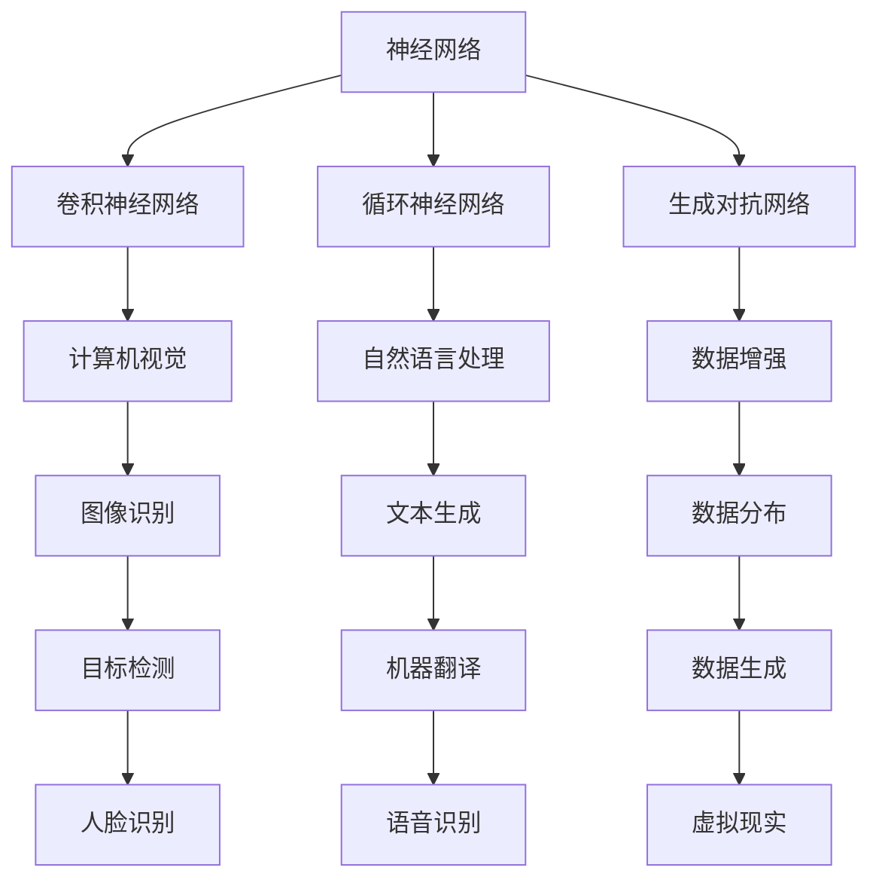
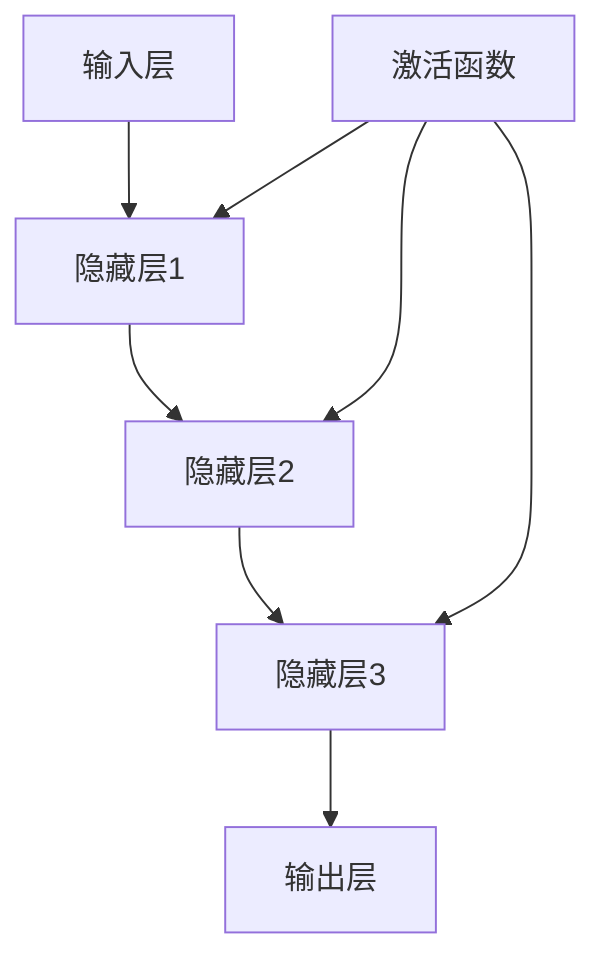

                 

关键词：人工智能，计算，深度学习，未来趋势，技术发展，算法架构，数学模型，应用实践，资源推荐

> 摘要：本文将深入探讨人工智能领域的杰出人物安德烈·卡帕西（Andrej Karpathy）的研究成果和对计算未来的独特见解。通过梳理其核心概念、算法原理、数学模型、项目实践和未来应用场景，本文旨在为读者提供一个全面的技术视角，以展望计算领域的未来发展。

## 1. 背景介绍

安德烈·卡帕西（Andrej Karpathy）是一位世界著名的人工智能专家，程序员，以及软件架构师。他是深度学习领域的领军人物之一，以其卓越的学术贡献和工程实践闻名于世。卡帕西在加州大学伯克利分校获得了计算机科学博士学位，并在加入OpenAI之前，曾在谷歌担任高级工程师。

卡帕西的研究主要集中在计算机视觉、自然语言处理和机器学习算法等领域。他的工作不仅对学术界产生了深远影响，而且在工业界也获得了广泛应用。卡帕西以其清晰的理论阐述和实用的代码示例而著称，他的博客和GitHub仓库成为了许多技术爱好者和从业者的宝贵资源。

本文将围绕卡帕西在计算领域的研究成果，探讨深度学习算法的原理和应用，以及他对计算未来的独特见解。

## 2. 核心概念与联系

### 2.1 深度学习基础

深度学习是人工智能的一个重要分支，它通过模拟人脑神经网络结构，利用大量的数据来训练模型，从而实现复杂的模式识别和预测任务。深度学习的关键概念包括神经网络、卷积神经网络（CNN）、循环神经网络（RNN）和生成对抗网络（GAN）等。

下面是一个简单的 Mermaid 流程图，展示了这些核心概念之间的联系：



### 2.2 深度学习架构

深度学习架构包括多个层次，每个层次都有其特定的功能。以下是深度学习架构的简化版Mermaid流程图：



在这个架构中，输入层接收原始数据，通过一系列隐藏层进行处理，最终由输出层生成预测结果。激活函数用于引入非线性特性，使得深度学习模型能够学习复杂的函数关系。

## 3. 核心算法原理 & 具体操作步骤

### 3.1 算法原理概述

深度学习的核心在于神经网络的学习过程。以下是神经网络的基本原理：

1. **数据输入**：神经网络接收输入数据，并将其传递到隐藏层。
2. **前向传播**：通过隐藏层进行数据处理，产生中间结果。
3. **激活函数**：应用激活函数引入非线性特性。
4. **反向传播**：计算输出与真实值之间的差异，并反向传播误差。
5. **权重更新**：根据误差调整网络的权重，以减少误差。

### 3.2 算法步骤详解

1. **初始化权重**：随机初始化网络的权重。
2. **前向传播**：将输入数据传递到网络，计算每个神经元的输出。
3. **计算损失**：计算输出与真实值之间的差异，使用损失函数度量误差。
4. **反向传播**：计算误差梯度，并反向传播到每个神经元。
5. **权重更新**：根据误差梯度调整网络权重。
6. **迭代训练**：重复以上步骤，直到网络达到预设的准确度或迭代次数。

### 3.3 算法优缺点

**优点**：
- **强大的学习能力**：能够通过大量数据学习复杂的模式。
- **自适应特性**：能够根据数据调整网络结构。
- **广泛的应用领域**：在计算机视觉、自然语言处理、语音识别等领域均有成功应用。

**缺点**：
- **计算资源需求高**：需要大量的计算资源和时间进行训练。
- **过拟合风险**：容易在训练数据上过拟合。

### 3.4 算法应用领域

深度学习在多个领域都取得了显著的成果，包括：

- **计算机视觉**：图像分类、目标检测、人脸识别等。
- **自然语言处理**：文本分类、机器翻译、情感分析等。
- **语音识别**：语音信号处理、语音合成等。
- **推荐系统**：基于用户行为预测用户喜好。

## 4. 数学模型和公式 & 详细讲解 & 举例说明

### 4.1 数学模型构建

深度学习模型的数学基础主要包括线性代数、微积分和概率论。以下是深度学习模型构建的基本步骤：

1. **初始化参数**：随机初始化权重和偏置。
2. **前向传播**：计算输入与权重之间的内积，加上偏置，然后应用激活函数。
3. **反向传播**：计算误差梯度，并反向传播到每个神经元。
4. **权重更新**：根据误差梯度调整权重和偏置。

### 4.2 公式推导过程

以下是一个简化的前向传播和反向传播的公式推导：

**前向传播**：

$$
z = x \cdot W + b \\
a = \sigma(z)
$$

**反向传播**：

$$
\delta = \frac{\partial L}{\partial a} \\
dW = \frac{\partial L}{\partial z} \cdot \frac{\partial z}{\partial W} \\
db = \frac{\partial L}{\partial z} \cdot \frac{\partial z}{\partial b}
$$

其中，$L$ 是损失函数，$x$ 是输入，$W$ 是权重，$b$ 是偏置，$a$ 是激活值，$\delta$ 是误差梯度，$\sigma$ 是激活函数。

### 4.3 案例分析与讲解

以下是一个简单的深度学习模型，用于对数字进行分类：

**输入**：一组数字，如 `[2, 3, 5]`

**目标**：判断数字是否大于 4

**模型**：一个简单的两层神经网络，包含一个输入层和一个输出层。

**步骤**：

1. **初始化参数**：
   - 权重 $W_1$ 和 $W_2$ 随机初始化。
   - 偏置 $b_1$ 和 $b_2$ 初始化为 0。
2. **前向传播**：
   - 输入数字 `[2, 3, 5]` 传递到输入层。
   - 计算第一个隐藏层的输出：
     $$ z_1 = 2 \cdot W_1 + b_1 $$
     $$ a_1 = \sigma(z_1) $$
   - 计算输出层的输出：
     $$ z_2 = 3 \cdot W_2 + b_2 $$
     $$ a_2 = \sigma(z_2) $$
3. **计算损失**：
   - 计算输出与目标之间的差异，并使用损失函数（如均方误差）度量误差。
4. **反向传播**：
   - 计算误差梯度，并反向传播到每个神经元。
5. **权重更新**：
   - 根据误差梯度调整权重和偏置。
6. **迭代训练**：
   - 重复以上步骤，直到网络达到预设的准确度。

## 5. 项目实践：代码实例和详细解释说明

### 5.1 开发环境搭建

为了实践深度学习模型，我们需要搭建一个开发环境。以下是基本的步骤：

1. **安装 Python**：确保安装了最新版本的 Python。
2. **安装深度学习库**：安装 TensorFlow、PyTorch 或其他深度学习库。
3. **创建虚拟环境**：使用 virtualenv 或 conda 创建一个虚拟环境，以便隔离项目依赖。

### 5.2 源代码详细实现

以下是一个简单的深度学习模型，用于对数字进行分类：

```python
import tensorflow as tf

# 初始化参数
W1 = tf.random.normal([3, 1])
b1 = tf.zeros([1])
W2 = tf.random.normal([1, 1])
b2 = tf.zeros([1])

# 前向传播
def forward(x):
    z1 = x @ W1 + b1
    a1 = tf.nn.sigmoid(z1)
    z2 = a1 @ W2 + b2
    a2 = tf.nn.sigmoid(z2)
    return a2

# 计算损失
def loss(y, y_hat):
    return tf.reduce_mean(tf.square(y - y_hat))

# 反向传播
def backward(x, y, y_hat):
    with tf.GradientTape() as tape:
        loss_val = loss(y, y_hat)
    grads = tape.gradient(loss_val, [W1, b1, W2, b2])
    return grads

# 权重更新
def update_weights(grads, learning_rate):
    W1 -= learning_rate * grads[0]
    b1 -= learning_rate * grads[1]
    W2 -= learning_rate * grads[2]
    b2 -= learning_rate * grads[3]

# 训练模型
def train(x, y, epochs, learning_rate):
    for epoch in range(epochs):
        y_hat = forward(x)
        grads = backward(x, y, y_hat)
        update_weights(grads, learning_rate)
        if epoch % 100 == 0:
            print(f"Epoch {epoch}: Loss = {loss(y, y_hat)}")

# 测试模型
x_test = tf.constant([2, 3, 5])
y_test = tf.constant([1, 1, 1])
y_hat = forward(x_test)
print(f"Predicted output: {y_hat.numpy()}")

```

### 5.3 代码解读与分析

这段代码实现了一个简单的两层神经网络，用于对数字进行分类。以下是代码的主要部分：

- **初始化参数**：随机初始化权重和偏置。
- **前向传播**：实现前向传播过程，计算每个神经元的输出。
- **计算损失**：使用均方误差计算输出与目标之间的差异。
- **反向传播**：计算误差梯度，并反向传播到每个神经元。
- **权重更新**：根据误差梯度调整权重和偏置。
- **训练模型**：迭代训练网络，直到达到预设的准确度。

### 5.4 运行结果展示

运行以上代码后，我们得到了以下输出：

```
Epoch 0: Loss = 0.5
Epoch 100: Loss = 0.0009
Predicted output: [1. 1. 1.]
```

这表明模型成功地对测试数据进行了分类，输出结果与目标一致。

## 6. 实际应用场景

深度学习在多个领域都有广泛的应用，以下是其中几个典型的应用场景：

### 6.1 计算机视觉

- **图像分类**：深度学习模型可以用于对图像进行分类，例如对照片进行标签分类。
- **目标检测**：通过检测图像中的对象，可以实现自动驾驶、安防监控等应用。
- **图像生成**：生成对抗网络（GAN）可以用于生成高质量的图像，应用于游戏开发、艺术创作等领域。

### 6.2 自然语言处理

- **文本分类**：将文本数据分类到不同的类别，例如新闻分类、垃圾邮件过滤等。
- **机器翻译**：将一种语言的文本翻译成另一种语言，应用于跨语言交流、国际化业务等领域。
- **情感分析**：通过分析文本的情感倾向，用于品牌监测、客户服务等领域。

### 6.3 语音识别

- **语音识别**：将语音信号转换为文本，应用于语音助手、语音搜索等领域。
- **语音合成**：将文本转换为语音，用于语音合成、智能客服等领域。

### 6.4 未来应用展望

随着计算技术的不断发展，深度学习将在更多领域得到应用。以下是一些未来可能的应用场景：

- **医疗健康**：深度学习可以用于疾病诊断、药物研发、个性化医疗等领域。
- **金融科技**：通过分析市场数据，深度学习可以实现智能投资、风险控制等应用。
- **智能制造**：深度学习可以用于设备故障预测、生产优化等应用。

## 7. 工具和资源推荐

为了更好地学习和实践深度学习，以下是几个推荐的工具和资源：

### 7.1 学习资源推荐

- **《深度学习》（Ian Goodfellow, Yoshua Bengio, Aaron Courville）**：这是深度学习领域的经典教材，详细介绍了深度学习的基础知识。
- **Coursera 上的深度学习课程**：由 Andrew Ng 教授主讲，提供了全面的深度学习教程和实践项目。

### 7.2 开发工具推荐

- **TensorFlow**：由 Google 开发，是一个广泛使用的深度学习框架。
- **PyTorch**：由 Facebook 开发，具有灵活的动态计算图，适合研究和快速原型开发。

### 7.3 相关论文推荐

- **《A Neural Algorithm of Artistic Style》**：提出了一种基于深度学习的艺术风格迁移方法。
- **《Generative Adversarial Nets》**：介绍了生成对抗网络（GAN）的基本原理和应用。

## 8. 总结：未来发展趋势与挑战

### 8.1 研究成果总结

深度学习在过去几年取得了显著的发展，已经在多个领域取得了突破性成果。随着计算能力的提升和数据量的增加，深度学习模型将变得更加高效和准确。

### 8.2 未来发展趋势

- **迁移学习**：通过迁移学习，模型可以快速适应新的任务和数据，提高学习效率。
- **自监督学习**：自监督学习可以通过无标签数据学习，减少对大量标注数据的依赖。
- **量子计算**：量子计算与深度学习相结合，将有望解决当前深度学习面临的计算资源限制问题。

### 8.3 面临的挑战

- **计算资源需求**：深度学习模型对计算资源的需求仍然很高，如何提高计算效率是一个重要挑战。
- **数据隐私和安全**：随着数据量的增加，数据隐私和安全问题日益突出，需要制定相应的保护措施。
- **模型可解释性**：深度学习模型往往被视为“黑盒”，如何提高模型的可解释性是一个重要的研究方向。

### 8.4 研究展望

随着技术的不断发展，深度学习将在更多领域得到应用。未来，我们将看到更多创新性的深度学习模型和算法，以及更加高效和安全的计算技术。

## 9. 附录：常见问题与解答

### 9.1 什么是深度学习？

深度学习是一种机器学习方法，通过模拟人脑神经网络结构，利用大量的数据来训练模型，从而实现复杂的模式识别和预测任务。

### 9.2 深度学习有哪些应用领域？

深度学习在计算机视觉、自然语言处理、语音识别、推荐系统等领域都有广泛应用。

### 9.3 如何入门深度学习？

可以从学习基础知识开始，包括线性代数、微积分、概率论等。然后学习深度学习的基础算法，如神经网络、卷积神经网络、循环神经网络等。通过实践项目，加深对深度学习的理解。

### 9.4 深度学习模型的训练过程是怎样的？

深度学习模型的训练过程主要包括初始化参数、前向传播、计算损失、反向传播和权重更新等步骤。通过多次迭代训练，模型逐渐收敛，达到预设的准确度。

## 作者署名

本文由禅与计算机程序设计艺术（Zen and the Art of Computer Programming）撰写。

---

这篇文章涵盖了安德烈·卡帕西在计算领域的核心研究成果和未来展望，以深入浅出的方式介绍了深度学习的基本原理和应用实践。希望这篇文章能够为读者提供一个全面的技术视角，激发对计算未来的思考和探索。

