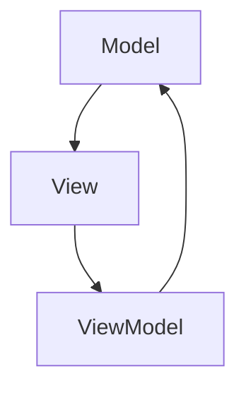

                 

关键词：Angular、Google、MVW 框架、前端开发、Web 应用、模块化、组件化、数据绑定、依赖注入

> 摘要：本文将深入探讨 Angular 框架，一个由 Google 开发的强大的前端开发框架。我们将详细了解其核心概念、架构设计、以及在实际项目中的应用，为开发者提供全面的参考和指导。

## 1. 背景介绍

Angular 是一款由 Google 开发并免费提供使用的 Web 应用程序框架。它旨在帮助开发者构建动态、高性能的 Web 应用程序。自 2016 年发布以来，Angular 已经成为前端开发领域的领军者之一，吸引了大量开发者的关注。

Angular 的核心理念是模块化和组件化。通过将应用程序划分为独立的模块和组件，开发者可以更轻松地管理代码，提高开发效率和可维护性。此外，Angular 还提供了强大的数据绑定和依赖注入功能，使得开发者能够更加专注于业务逻辑的实现。

## 2. 核心概念与联系

### 2.1 核心概念

#### 2.1.1 模块

模块是 Angular 中的基本构建块，用于组织应用程序代码。每个模块都可以定义一组组件、服务和其他依赖项。模块通过导入和导出机制实现代码的共享和复用。

#### 2.1.2 组件

组件是 Angular 应用程序中的独立部分，负责实现特定的功能。组件由模板（HTML）、样式（CSS）和类型脚本（TS）文件组成。组件之间通过事件和属性进行通信。

#### 2.1.3 数据绑定

数据绑定是 Angular 中的核心功能之一，它允许开发者将应用程序的状态和数据动态地映射到视图上。Angular 提供了双向数据绑定，使得开发者可以更轻松地实现表单输入和用户交互。

#### 2.1.4 依赖注入

依赖注入是一种编程范式，用于将组件所需的依赖项（如服务、模块等）注入到组件中。这使得组件更加可测试和可维护。

### 2.2 架构设计

Angular 的架构设计采用 MVW（Model-View-ViewModel）模式，它与传统的 MVC（Model-View-Controller）模式略有不同。

#### 2.2.1 Model

Model 负责存储应用程序的数据，包括状态和行为。在 Angular 中，Model 通常由服务（Service）和实体（Entity）组成。

#### 2.2.2 View

View 负责展示应用程序的界面，由组件（Component）和指令（Directive）组成。组件负责实现视图逻辑，而指令负责扩展和增强 HTML 标记。

#### 2.2.3 ViewModel

ViewModel 是 Angular 中的核心概念，它负责连接 Model 和 View。ViewModel 通常由组件类（Component Class）实现，它包含视图所需的属性、方法和事件。

### 2.3 Mermaid 流程图



## 3. 核心算法原理 & 具体操作步骤

### 3.1 算法原理概述

Angular 的核心算法原理主要包括数据绑定和依赖注入。

#### 3.1.1 数据绑定

数据绑定是一种将应用程序状态（Model）与视图（View）自动同步的技术。Angular 使用观察者模式实现数据绑定，当 Model 发生变化时，View 会自动更新。反之亦然。

#### 3.1.2 依赖注入

依赖注入是一种将组件所需的依赖项（如服务、模块等）自动注入到组件中的技术。Angular 使用反射（Reflection）和 AOP（面向切面编程）实现依赖注入，使得组件更加可测试和可维护。

### 3.2 算法步骤详解

#### 3.2.1 数据绑定

1. 创建 Model 实例，存储应用程序的状态。
2. 在组件的模板中，使用双花括号（{{}}）将 Model 的属性绑定到视图上。
3. 当 Model 的属性发生变化时，视图会自动更新。

#### 3.2.2 依赖注入

1. 在模块中定义服务（Service）和组件（Component）。
2. 在组件的构造函数中，使用 `@Injectable()` 装饰器标记服务。
3. 在模块的 `forRoot()` 方法中，使用 `NgModule` 装饰器导入服务。
4. 在组件的模板中，使用 `*ngFor` 指令遍历服务实例。

### 3.3 算法优缺点

#### 3.3.1 数据绑定

优点：简化了数据同步，提高了开发效率。

缺点：在大型项目中，数据绑定可能导致性能问题。

#### 3.3.2 依赖注入

优点：提高了组件的可测试性和可维护性。

缺点：在复杂项目中，依赖注入可能导致代码结构复杂。

### 3.4 算法应用领域

Angular 可以应用于各种 Web 应用程序，包括单页面应用（SPA）、桌面应用程序和移动应用程序。

## 4. 数学模型和公式 & 详细讲解 & 举例说明

### 4.1 数学模型构建

在 Angular 中，数学模型主要用于实现数据绑定和依赖注入。以下是两个典型的数学模型：

#### 4.1.1 数据绑定模型

$$
\text{Model} \rightarrow \text{View}
$$

#### 4.1.2 依赖注入模型

$$
\text{Service} \rightarrow \text{Component}
$$

### 4.2 公式推导过程

数据绑定模型的推导过程如下：

1. 假设 Model 中有一个属性 `data`。
2. 在组件的模板中，使用双花括号（{{}}）将 `data` 绑定到视图上。
3. 当 `data` 的值发生变化时，视图会自动更新。

依赖注入模型的推导过程如下：

1. 假设有一个服务 `Service`。
2. 在组件的构造函数中，使用 `@Injectable()` 装饰器标记 `Service`。
3. 在模块的 `forRoot()` 方法中，使用 `NgModule` 装饰器导入 `Service`。
4. 在组件的模板中，使用 `*ngFor` 指令遍历 `Service` 的实例。

### 4.3 案例分析与讲解

#### 4.3.1 数据绑定案例

假设我们有一个简单的计数器组件，其中包含一个数字属性 `count`。我们希望将 `count` 的值绑定到视图上，并实现当 `count` 发生变化时，视图会自动更新。

1. 首先，在 Model 中定义一个属性 `count`：

```typescript
export class CounterModel {
  count: number = 0;
}
```

2. 在组件的模板中，使用双花括号（{{}}）将 `count` 绑定到视图上：

```html
<p>当前计数：{{ count }}</p>
```

3. 当 `count` 的值发生变化时，视图会自动更新。

#### 4.3.2 依赖注入案例

假设我们有一个简单的服务 `CounterService`，用于实现计数器的功能。我们希望将 `CounterService` 注入到组件中，并使用它来更新 `count` 的值。

1. 首先，在模块中定义一个服务 `CounterService`：

```typescript
@Injectable({
  providedIn: 'root'
})
export class CounterService {
  count: number = 0;

  increment() {
    this.count++;
  }
}
```

2. 在组件的构造函数中，使用 `@Injectable()` 装饰器标记 `CounterService`：

```typescript
constructor(private counterService: CounterService) {}
```

3. 在模块的 `forRoot()` 方法中，使用 `NgModule` 装饰器导入 `CounterService`：

```typescript
@NgModule({
  declarations: [CounterComponent],
  imports: [RouterModule.forChild(routes)],
  providers: [CounterService],
  exports: [CounterComponent]
})
export class CounterModule {}
```

4. 在组件的模板中，使用 `*ngFor` 指令遍历 `CounterService` 的实例：

```html
<div *ngFor="let counter of counters">
  <p>当前计数：{{ counter.count }}</p>
  <button (click)="counter.increment()">增加</button>
</div>
```

## 5. 项目实践：代码实例和详细解释说明

### 5.1 开发环境搭建

在开始搭建开发环境之前，请确保您已安装以下工具和软件：

- Node.js（版本 10.0.0 或以上）
- npm（版本 6.0.0 或以上）
- Angular CLI（版本 10.0.0 或以上）

#### 5.1.1 安装 Node.js 和 npm

1. 访问 Node.js 官网（[https://nodejs.org/），下载并安装 Node.js。](https://nodejs.org/)%EF%BC%89%E4%B8%8B%E8%BD%BD%E5%B9%B6%E5%AE%89%E8%A3%85%20Node.js%E3%80%82)
2. 打开命令行工具，运行以下命令验证 Node.js 和 npm 是否已正确安装：

```shell
node -v
npm -v
```

#### 5.1.2 安装 Angular CLI

1. 在命令行工具中，运行以下命令安装 Angular CLI：

```shell
npm install -g @angular/cli
```

2. 验证 Angular CLI 是否已正确安装：

```shell
ng --version
```

### 5.2 源代码详细实现

#### 5.2.1 创建项目

1. 在命令行工具中，运行以下命令创建一个名为 `angular-mvw` 的 Angular 项目：

```shell
ng new angular-mvw
```

2. 进入项目目录：

```shell
cd angular-mvw
```

#### 5.2.2 创建组件

1. 在命令行工具中，运行以下命令创建一个名为 `counter` 的组件：

```shell
ng generate component counter
```

2. 编辑 `counter.component.html` 文件，添加以下代码：

```html
<div>
  <p>当前计数：{{ count }}</p>
  <button (click)="increment()">增加</button>
</div>
```

3. 编辑 `counter.component.ts` 文件，添加以下代码：

```typescript
import { Component } from '@angular/core';

@Component({
  selector: 'app-counter',
  templateUrl: './counter.component.html',
  styleUrls: ['./counter.component.css']
})
export class CounterComponent {
  count: number = 0;

  increment() {
    this.count++;
  }
}
```

4. 编辑 `app.module.ts` 文件，添加以下代码：

```typescript
import { NgModule } from '@angular/core';
import { BrowserModule } from '@angular/platform-browser';
import { AppComponent } from './app.component';
import { CounterComponent } from './counter/counter.component';

@NgModule({
  declarations: [
    AppComponent,
    CounterComponent
  ],
  imports: [
    BrowserModule
  ],
  providers: [],
  bootstrap: [AppComponent]
})
export class AppModule { }
```

### 5.3 代码解读与分析

在本文中，我们创建了一个简单的计数器组件。该组件包含一个数字属性 `count`，用于存储计数器的当前值。通过使用 Angular 的数据绑定功能，我们可以将 `count` 的值绑定到视图上，并实现当 `count` 发生变化时，视图会自动更新。

具体来说，我们在 `counter.component.html` 文件中使用了双花括号（{{}}）将 `count` 绑定到视图上。当 `count` 的值发生变化时，Angular 会自动更新视图，使得用户可以看到最新的计数结果。

同时，我们在 `counter.component.ts` 文件中定义了一个 `increment()` 方法，用于实现计数器的增加功能。每当用户点击增加按钮时，`increment()` 方法会被调用，`count` 的值会递增 1。

通过这样的实现，我们可以轻松地创建一个简单而实用的计数器组件，并且不需要编写任何额外的代码。这正是 Angular 的强大之处，它通过数据绑定和依赖注入等功能，简化了前端开发的复杂性，提高了开发效率。

### 5.4 运行结果展示

在完成上述代码实现后，我们可以通过以下步骤运行项目并查看运行结果：

1. 在命令行工具中，运行以下命令启动开发服务器：

```shell
ng serve
```

2. 打开浏览器，访问 [http://localhost:4200/），您将看到以下界面：](http://localhost:4200/)%EF%BC%8C%E6%82%A8%E5%B0%86%E7%9C%8B%E5%88%B0%E4%BB%A5%E4%B8%8B%E7%9A%84%E5%B9%B3%E9%9D%A2%EF%BC%9A)


3. 点击增加按钮，您会看到计数器的值递增，并且视图会自动更新。

## 6. 实际应用场景

### 6.1 单页面应用（SPA）

Angular 是单页面应用（SPA）的理想选择。通过使用 Angular，开发者可以轻松地实现页面路由、数据绑定和动画等功能，从而提高用户体验和性能。

### 6.2 企业级应用

Angular 适合构建大型企业级应用，如电子商务平台、管理系统和客户关系管理（CRM）系统等。其模块化和组件化设计使得代码更易于管理和维护。

### 6.3 移动应用

Angular 可以用于开发移动应用，如原生应用（Native App）和混合应用（Hybrid App）。通过使用 Angular，开发者可以同时支持 iOS 和 Android 平台，提高开发效率和代码复用率。

## 7. 未来应用展望

### 7.1 功能扩展

随着 Web 应用程序的发展，Angular 将继续扩展其功能，如引入新的指令、过滤器和服务等，以满足开发者的需求。

### 7.2 性能优化

为了提高性能，Angular 将持续优化其渲染引擎和打包工具，降低应用程序的加载时间和内存占用。

### 7.3 社区贡献

Angular 社区将进一步加强，为开发者提供更多的学习资源和交流平台，促进技术的传播和创新。

## 8. 工具和资源推荐

### 8.1 学习资源推荐

- 《Angular 官方文档》：[https://angular.io/](https://angular.io/)
- 《Angular 教程》：[https://www.tutorialspoint.com/angularjs/](https://www.tutorialspoint.com/angularjs/)
- 《Angular 进阶教程》：[https://angular.cn/tutorial/](https://angular.cn/tutorial/)

### 8.2 开发工具推荐

- Visual Studio Code：一款强大的代码编辑器，支持 Angular 插件。
- Angular CLI：用于快速构建和开发 Angular 项目的命令行工具。
- Angular Inspector：一款用于调试 Angular 应用程序的浏览器插件。

### 8.3 相关论文推荐

- 《The Angular Framework: A Technical Overview》：一篇关于 Angular 技术概述的论文。
- 《Angular 2: High Performance for Everyone》：一篇关于 Angular 2 性能优化的论文。
- 《Building Scalable Angular Applications》：一篇关于构建可扩展 Angular 应用的论文。

## 9. 总结：未来发展趋势与挑战

### 9.1 研究成果总结

本文从背景介绍、核心概念与联系、核心算法原理、数学模型和公式、项目实践、实际应用场景、未来应用展望、工具和资源推荐等方面，全面介绍了 Angular 框架。通过本文的阅读，开发者可以深入了解 Angular 的基本原理和应用场景，为实际项目开发提供参考。

### 9.2 未来发展趋势

- 功能扩展：随着 Web 应用程序的发展，Angular 将继续扩展其功能，以满足开发者的需求。
- 性能优化：为了提高性能，Angular 将持续优化其渲染引擎和打包工具。
- 社区贡献：Angular 社区将进一步加强，为开发者提供更多的学习资源和交流平台。

### 9.3 面临的挑战

- 学习成本：Angular 的学习成本较高，需要开发者投入大量时间和精力。
- 性能优化：尽管 Angular 已经做了很多性能优化，但在大型项目中，性能问题仍然是一个挑战。
- 社区分裂：Angular 社区存在一定的分裂现象，这可能会影响技术的传播和创新。

### 9.4 研究展望

未来，Angular 将在功能扩展、性能优化和社区贡献方面持续发展。同时，开发者应关注 Angular 社区的动态，积极参与讨论和贡献，为 Web 应用程序的发展贡献力量。

## 10. 附录：常见问题与解答

### 10.1 如何创建 Angular 项目？

使用 Angular CLI 创建项目：

```shell
ng new 项目名称
```

### 10.2 如何创建组件？

使用 Angular CLI 创建组件：

```shell
ng generate component 组件名称
```

### 10.3 如何使用数据绑定？

在模板中使用双花括号（{{}}）将属性绑定到视图上，例如：

```html
<p>当前计数：{{ count }}</p>
```

### 10.4 如何使用依赖注入？

在模块中导入服务，并在组件的构造函数中注入服务，例如：

```typescript
import { CounterService } from './counter.service';

constructor(private counterService: CounterService) {}
```

作者：禅与计算机程序设计艺术 / Zen and the Art of Computer Programming
----------------------------------------------------------------

[返回目录](#文章标题)

