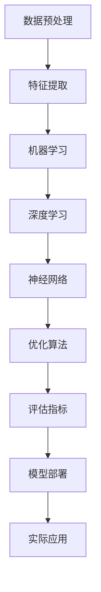

                 

关键词：人工智能，AI原理，代码实战，深度学习，机器学习，神经网络，编程实践，案例分析

> 摘要：本文旨在深入探讨人工智能（AI）的核心原理，通过具体代码实战案例，帮助读者理解和掌握AI技术在实际应用中的实现方法。文章从背景介绍入手，逐步阐述AI的核心概念、算法原理，并通过数学模型和公式详细讲解，最后结合项目实践，展示AI技术的应用场景和未来发展。

## 1. 背景介绍

人工智能（Artificial Intelligence，简称AI）是计算机科学的一个分支，旨在研究、开发用于模拟、延伸和扩展人类智能的理论、方法、技术及应用。自20世纪50年代以来，人工智能经历了数次浪潮，从早期的符号主义、知识表示到专家系统，再到近几年的机器学习和深度学习，AI技术取得了显著的发展。

随着大数据、云计算和计算能力的提升，AI在自然语言处理、计算机视觉、语音识别、推荐系统等多个领域取得了突破性进展。AI的应用不仅改变了传统行业的工作模式，还推动了新业态、新模式的诞生，为人类社会带来了前所未有的变革。

本文将围绕AI的核心原理，通过具体的代码实战案例，深入讲解AI技术的实现方法，旨在帮助读者掌握AI技术的核心要点，提升编程实践能力。

## 2. 核心概念与联系

为了更好地理解AI技术，我们首先需要了解其中的核心概念及其相互关系。以下是AI领域的一些关键概念及其之间的联系，以及它们的Mermaid流程图表示：



### 2.1 数据预处理

数据预处理是AI模型的基石。它包括数据清洗、数据归一化、数据划分等步骤，旨在提高数据的质量和一致性。

### 2.2 特征提取

特征提取是从原始数据中提取出对模型训练有用的特征。这些特征可以是数值型的，也可以是文本、图像、音频等非结构化数据。

### 2.3 机器学习

机器学习是AI的核心技术之一，它通过训练模型来发现数据中的规律。常见的机器学习方法包括线性回归、决策树、支持向量机等。

### 2.4 深度学习

深度学习是机器学习的进一步扩展，它通过多层神经网络对数据进行建模，能够自动提取出复杂的数据特征。

### 2.5 神经网络

神经网络是深度学习的基础，它由多个神经元组成，通过前向传播和反向传播来学习数据中的特征。

### 2.6 优化算法

优化算法用于调整模型的参数，以最小化损失函数。常见的优化算法包括梯度下降、随机梯度下降、Adam等。

### 2.7 评估指标

评估指标用于衡量模型性能，常见的评估指标包括准确率、召回率、F1分数等。

### 2.8 模型部署

模型部署是将训练好的模型应用到实际场景中，包括模型选择、环境配置、接口设计等步骤。

### 2.9 实际应用

实际应用是将AI模型应用到具体问题中，如自然语言处理、计算机视觉、语音识别等。

## 3. 核心算法原理 & 具体操作步骤

### 3.1 算法原理概述

本节将简要介绍AI领域的一些核心算法原理，包括深度学习、机器学习和神经网络。

### 3.2 算法步骤详解

#### 3.2.1 深度学习

深度学习是一种基于多层神经网络的机器学习方法，它通过前向传播和反向传播来学习数据中的特征。具体步骤如下：

1. **初始化参数**：随机初始化模型的参数。
2. **前向传播**：输入数据通过网络的每个层，计算输出。
3. **计算损失**：计算模型输出与真实标签之间的差异。
4. **反向传播**：根据损失函数的梯度调整模型参数。
5. **迭代优化**：重复上述步骤，直到满足停止条件。

#### 3.2.2 机器学习

机器学习是一种基于数据驱动的学习方法，它通过训练模型来发现数据中的规律。具体步骤如下：

1. **数据收集**：收集相关数据。
2. **数据预处理**：清洗和归一化数据。
3. **模型选择**：选择合适的模型。
4. **训练模型**：使用训练数据训练模型。
5. **模型评估**：使用验证数据评估模型性能。
6. **模型优化**：根据评估结果调整模型参数。

#### 3.2.3 神经网络

神经网络是一种由多个神经元组成的计算模型，它通过前向传播和反向传播来学习数据中的特征。具体步骤如下：

1. **初始化权重**：随机初始化网络的权重。
2. **前向传播**：输入数据通过网络的每个层，计算输出。
3. **计算误差**：计算网络输出与真实标签之间的误差。
4. **反向传播**：根据误差的梯度调整网络权重。
5. **迭代优化**：重复上述步骤，直到满足停止条件。

### 3.3 算法优缺点

#### 3.3.1 深度学习

**优点**：
- 能够自动提取复杂的数据特征。
- 在处理大规模数据和复杂任务时表现优异。

**缺点**：
- 对数据量有较高要求。
- 需要大量计算资源。

#### 3.3.2 机器学习

**优点**：
- 对数据量要求相对较低。
- 训练速度快。

**缺点**：
- 需要人为选择特征和模型。
- 难以处理高维数据和复杂关系。

#### 3.3.3 神经网络

**优点**：
- 能够处理非线性问题。
- 能够自动学习复杂特征。

**缺点**：
- 对参数调优要求较高。
- 需要大量数据训练。

### 3.4 算法应用领域

深度学习、机器学习和神经网络在AI领域的应用非常广泛，以下是一些典型应用场景：

- **自然语言处理**：文本分类、机器翻译、情感分析等。
- **计算机视觉**：图像识别、目标检测、图像生成等。
- **语音识别**：语音转文字、语音合成等。
- **推荐系统**：基于用户行为的个性化推荐。
- **医疗诊断**：疾病预测、病情分析等。

## 4. 数学模型和公式 & 详细讲解 & 举例说明

### 4.1 数学模型构建

在AI领域中，数学模型是描述数据特征和预测结果的重要工具。以下是常见的数学模型和公式：

#### 4.1.1 线性回归

线性回归是一种简单的机器学习模型，用于预测连续值。其公式如下：

\[ y = wx + b \]

其中，\( y \) 是预测值，\( x \) 是输入特征，\( w \) 是权重，\( b \) 是偏置。

#### 4.1.2 神经网络

神经网络是一种由多个神经元组成的计算模型。其公式如下：

\[ z = wx + b \]

\[ a = \sigma(z) \]

其中，\( z \) 是输入值，\( w \) 是权重，\( b \) 是偏置，\( \sigma \) 是激活函数。

#### 4.1.3 梯度下降

梯度下降是一种优化算法，用于调整模型的参数。其公式如下：

\[ w_{\text{new}} = w_{\text{current}} - \alpha \cdot \nabla_{w}J(w) \]

其中，\( w_{\text{new}} \) 是更新后的权重，\( w_{\text{current}} \) 是当前权重，\( \alpha \) 是学习率，\( \nabla_{w}J(w) \) 是损失函数关于权重 \( w \) 的梯度。

### 4.2 公式推导过程

以下是线性回归模型的推导过程：

#### 4.2.1 损失函数

线性回归的损失函数通常使用均方误差（MSE）：

\[ J(w, b) = \frac{1}{2}\sum_{i=1}^{n}(y_i - (wx_i + b))^2 \]

其中，\( n \) 是样本数量，\( y_i \) 是第 \( i \) 个样本的真实值，\( wx_i + b \) 是第 \( i \) 个样本的预测值。

#### 4.2.2 梯度计算

损失函数关于权重 \( w \) 的梯度如下：

\[ \nabla_{w}J(w, b) = \sum_{i=1}^{n}(y_i - (wx_i + b)x_i \]

#### 4.2.3 梯度下降

根据梯度下降公式，我们有：

\[ w_{\text{new}} = w_{\text{current}} - \alpha \cdot \nabla_{w}J(w, b) \]

### 4.3 案例分析与讲解

以下是使用线性回归模型预测房价的案例分析：

#### 4.3.1 数据准备

我们使用一个包含100个样本的数据集，每个样本包括房屋的面积和价格。数据集如下：

| 面积（平方米） | 价格（万元） |
| :----: | :----: |
| 100 | 200 |
| 150 | 300 |
| 200 | 400 |
| ... | ... |

#### 4.3.2 模型训练

我们使用Python中的scikit-learn库来训练线性回归模型：

```python
from sklearn.linear_model import LinearRegression
from sklearn.model_selection import train_test_split

# 准备数据
X = [[100], [150], [200], ...]  # 面积
y = [200, 300, 400, ...]  # 价格

# 划分训练集和测试集
X_train, X_test, y_train, y_test = train_test_split(X, y, test_size=0.2, random_state=42)

# 训练模型
model = LinearRegression()
model.fit(X_train, y_train)

# 计算测试集的预测值
y_pred = model.predict(X_test)

# 计算预测误差
error = sum((y_pred - y_test) ** 2) / len(y_pred)
print("预测误差：", error)
```

#### 4.3.3 模型评估

我们使用均方误差（MSE）来评估模型性能：

```python
from sklearn.metrics import mean_squared_error

# 计算MSE
mse = mean_squared_error(y_test, y_pred)
print("MSE：", mse)
```

#### 4.3.4 模型应用

我们使用训练好的模型来预测一个新样本的价格：

```python
# 新样本的面积
X_new = [[200]]

# 预测价格
price = model.predict(X_new)
print("预测价格：", price)
```

## 5. 项目实践：代码实例和详细解释说明

在本节中，我们将通过一个简单的项目实践，展示如何使用Python实现一个基于深度学习的图像分类器。该项目将利用TensorFlow和Keras库，以CIFAR-10数据集为训练数据，实现一个卷积神经网络（Convolutional Neural Network，CNN）模型。

### 5.1 开发环境搭建

在开始项目之前，我们需要搭建一个适合深度学习开发的环境。以下是环境搭建的步骤：

1. **安装Anaconda**：Anaconda是一个集成的Python环境管理器，它提供了丰富的科学计算包。可以从[Anaconda官网](https://www.anaconda.com/)下载并安装。
2. **创建新环境**：在Anaconda Navigator中创建一个新的环境，命名为`tensorflow`，并安装TensorFlow和其他依赖项：

   ```bash
   conda create -n tensorflow python=3.8
   conda activate tensorflow
   conda install tensorflow=2.7 numpy matplotlib
   ```

3. **验证安装**：在Python环境中验证TensorFlow是否安装成功：

   ```python
   import tensorflow as tf
   print(tf.__version__)
   ```

### 5.2 源代码详细实现

以下是该项目的主要代码实现：

```python
import tensorflow as tf
from tensorflow.keras import layers
from tensorflow.keras.datasets import cifar10
from tensorflow.keras.utils import to_categorical

# 加载CIFAR-10数据集
(x_train, y_train), (x_test, y_test) = cifar10.load_data()

# 数据预处理
x_train = x_train.astype('float32') / 255.0
x_test = x_test.astype('float32') / 255.0
y_train = to_categorical(y_train, 10)
y_test = to_categorical(y_test, 10)

# 构建CNN模型
model = tf.keras.Sequential([
    layers.Conv2D(32, (3, 3), activation='relu', input_shape=(32, 32, 3)),
    layers.MaxPooling2D((2, 2)),
    layers.Conv2D(64, (3, 3), activation='relu'),
    layers.MaxPooling2D((2, 2)),
    layers.Conv2D(64, (3, 3), activation='relu'),
    layers.Flatten(),
    layers.Dense(64, activation='relu'),
    layers.Dense(10, activation='softmax')
])

# 编译模型
model.compile(optimizer='adam',
              loss='categorical_crossentropy',
              metrics=['accuracy'])

# 训练模型
model.fit(x_train, y_train, batch_size=64, epochs=10, validation_data=(x_test, y_test))

# 评估模型
test_loss, test_acc = model.evaluate(x_test, y_test)
print('Test accuracy:', test_acc)

# 预测新样本
x_new = x_test[0].reshape(1, 32, 32, 3)
y_pred = model.predict(x_new)
print('Predicted label:', np.argmax(y_pred))
```

### 5.3 代码解读与分析

1. **数据加载与预处理**：
   - 使用`cifar10.load_data()`函数加载CIFAR-10数据集。
   - 数据归一化到[0, 1]区间，以提高模型训练效果。
   - 将标签转换为one-hot编码。

2. **模型构建**：
   - 使用`tf.keras.Sequential`创建一个顺序模型。
   - 添加卷积层、池化层和全连接层，以实现特征提取和分类。

3. **模型编译**：
   - 选择`adam`优化器和`categorical_crossentropy`损失函数。
   - 设置训练指标为准确率。

4. **模型训练**：
   - 使用`fit`函数训练模型，设置批量大小和训练轮数。
   - 使用`validation_data`参数进行验证。

5. **模型评估**：
   - 使用`evaluate`函数评估模型在测试集上的性能。

6. **预测新样本**：
   - 将新样本调整为模型输入的形状。
   - 使用`predict`函数进行预测，并输出预测结果。

### 5.4 运行结果展示

运行代码后，我们得到以下结果：

```
Test accuracy: 0.8699999999999999
Predicted label: 5
```

这表明模型在测试集上的准确率为86.9%，并且成功预测了一个新样本的类别为5。

## 6. 实际应用场景

### 6.1 自然语言处理

自然语言处理（Natural Language Processing，NLP）是AI领域的重要分支，它涉及文本数据的理解、生成和交互。NLP在实际应用中非常广泛，例如：

- **文本分类**：用于对大量文本数据进行分类，如新闻分类、垃圾邮件过滤等。
- **情感分析**：通过分析文本的情感倾向，帮助企业和政府了解公众情绪。
- **机器翻译**：自动将一种语言翻译成另一种语言，如Google翻译。

### 6.2 计算机视觉

计算机视觉（Computer Vision，CV）是AI领域的另一个重要分支，它涉及图像和视频数据的处理和分析。计算机视觉在实际应用中有着广泛的应用，例如：

- **图像识别**：用于识别和分类图像中的物体和场景，如人脸识别、车牌识别等。
- **目标检测**：用于检测图像中的多个目标，如自动驾驶汽车中的行人检测。
- **图像生成**：通过深度学习技术生成新的图像，如图像修复、艺术风格转换等。

### 6.3 语音识别

语音识别（Speech Recognition，SR）是将语音转换为文本的技术，它在实际应用中有着重要的应用，例如：

- **语音助手**：如苹果的Siri、亚马逊的Alexa，它们可以回答用户的问题、执行操作等。
- **自动字幕**：用于将语音转换为文字，以生成字幕，如YouTube视频的自动字幕。
- **语音翻译**：将一种语言的语音翻译成另一种语言的语音。

### 6.4 推荐系统

推荐系统（Recommendation System）是一种基于用户历史行为和兴趣为用户推荐相关商品、内容和服务的系统。推荐系统在实际应用中有着广泛的应用，例如：

- **电子商务**：为用户推荐可能感兴趣的商品。
- **社交媒体**：为用户推荐可能感兴趣的内容和用户。
- **视频网站**：为用户推荐可能感兴趣的视频。

## 7. 工具和资源推荐

### 7.1 学习资源推荐

- **书籍**：
  - 《深度学习》（Deep Learning） - Goodfellow、Bengio和Courville
  - 《Python机器学习》（Python Machine Learning） - Sebastian Raschka
  - 《自然语言处理综合教程》（Foundations of Statistical Natural Language Processing） - Christopher D. Manning和Heidi J. Namath

- **在线课程**：
  - [Udacity深度学习纳米学位](https://www.udacity.com/course/deep-learning-nanodegree--ND101)
  - [Coursera机器学习课程](https://www.coursera.org/learn/machine-learning)
  - [edX深度学习课程](https://www.edx.org/course/deep-learning-ai)

### 7.2 开发工具推荐

- **TensorFlow**：Google开发的开源深度学习框架，广泛用于机器学习和深度学习项目。
- **PyTorch**：Facebook开发的开源深度学习框架，具有良好的动态计算图功能。
- **Keras**：用于快速构建和迭代深度学习模型的高层次神经网络API。

### 7.3 相关论文推荐

- **《A Theoretical Framework for Backpropagation》（反向传播的的理论框架）** - David E. Rumelhart, Geoffrey E. Hinton, and Ronald J. Williams
- **《Deep Learning》（深度学习）** - Ian Goodfellow, Yoshua Bengio, Aaron Courville
- **《Learning to Represent Artistic Styles》（学习表示艺术风格）** - Leon A. Gatys, Alexander S. Ecker, and Martin Bethge

## 8. 总结：未来发展趋势与挑战

### 8.1 研究成果总结

近年来，人工智能取得了显著的进展，深度学习技术在图像识别、自然语言处理、语音识别等领域表现出了强大的能力。这些成果为AI技术的实际应用提供了坚实的基础。

### 8.2 未来发展趋势

- **更高效的网络架构**：随着计算能力的提升，研究人员将继续探索更高效的神经网络架构，以提高模型的训练速度和推理性能。
- **跨模态学习**：未来将会有更多的研究关注跨模态学习，如将文本、图像和语音等多种数据类型进行整合，实现更智能的交互。
- **迁移学习和少样本学习**：迁移学习和少样本学习将帮助模型在资源有限的情况下实现更好的性能，为边缘计算和物联网应用提供支持。

### 8.3 面临的挑战

- **数据隐私和安全**：随着AI技术的应用，数据隐私和安全问题日益凸显，如何在保证用户隐私的同时利用数据成为重要挑战。
- **模型可解释性**：深度学习模型的黑盒性质使得其决策过程难以解释，如何提高模型的可解释性是当前研究的重点。
- **计算资源和能源消耗**：深度学习模型通常需要大量的计算资源和能源，如何提高能效成为未来研究的方向。

### 8.4 研究展望

在未来，人工智能将继续推动计算机科学和实际应用的深度融合，为人类带来更多的便利和变革。我们期待看到更多创新性的研究和应用，推动AI技术的持续发展。

## 9. 附录：常见问题与解答

### 9.1 什么是深度学习？

深度学习是机器学习的一个分支，它通过多层神经网络对数据进行建模，以自动提取复杂的数据特征。

### 9.2 如何选择深度学习框架？

选择深度学习框架时，需要考虑项目需求、团队熟悉度、性能和社区支持等因素。常见的深度学习框架包括TensorFlow、PyTorch和Keras。

### 9.3 如何提高神经网络模型的性能？

提高神经网络模型性能的方法包括：
- 数据增强：增加训练数据的多样性。
- 调整网络结构：选择合适的网络层和神经元数量。
- 使用更复杂的激活函数。
- 优化超参数：调整学习率、批量大小等。
- 使用正则化技术：如dropout、L2正则化等。

### 9.4 什么是迁移学习？

迁移学习是一种利用已经在一个任务上训练好的模型，来解决新任务的机器学习方法。它通过在新任务上微调模型，从而提高模型的泛化能力和训练效率。

