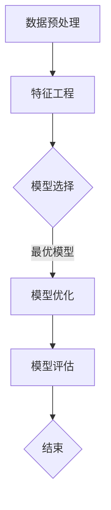

                 

  
关键词：自动化机器学习（AutoML）、模型选择、模型优化、机器学习、算法、流程图

## 摘要

本文旨在探讨自动化机器学习（AutoML）的概念、原理以及应用场景，重点介绍模型选择和优化的方法。通过分析现有AutoML技术的发展趋势，文章将提出未来AutoML的潜在研究方向和挑战。

## 1. 背景介绍

### 1.1 机器学习的现状

随着大数据时代的到来，机器学习技术在各个领域得到了广泛应用。然而，机器学习模型的开发过程通常复杂且耗时，涉及数据预处理、特征工程、模型选择、训练和优化等多个步骤。传统机器学习开发模式要求开发者具备深厚的专业知识，这使得许多非专业人士难以参与机器学习的研究和应用。

### 1.2 AutoML的提出

为了降低机器学习开发的门槛，提高开发效率，自动化机器学习（AutoML）应运而生。AutoML通过自动化地完成机器学习模型的开发过程，使普通开发者也能轻松构建高性能的机器学习模型。AutoML的核心目标是在保证模型性能的同时，减少开发者的工作量。

### 1.3 AutoML的重要性

随着AI技术的不断进步，AutoML在工业界和学术界都受到了广泛关注。它不仅能够提高机器学习开发效率，还能够推动机器学习技术在各个领域的应用。例如，在医疗领域，AutoML可以帮助医生快速诊断疾病；在金融领域，AutoML可以用于风险控制和信用评估。

## 2. 核心概念与联系

### 2.1 自动化机器学习（AutoML）

自动化机器学习（AutoML）是一种利用算法和工具自动化完成机器学习模型开发的过程。AutoML的核心包括模型选择、超参数优化、特征工程和数据预处理等方面。通过自动化地完成这些任务，AutoML能够显著降低机器学习开发的门槛。

### 2.2 模型选择与优化

模型选择和优化是机器学习开发过程中的关键步骤。模型选择涉及从大量预定义模型中选取最适合特定问题的模型，而优化则涉及调整模型的超参数，以最大化模型的性能。在AutoML中，自动化模型选择和优化是实现高效机器学习开发的关键。

### 2.3 Mermaid 流程图

为了更直观地展示AutoML的过程，我们可以使用Mermaid流程图来描述其核心步骤。



## 3. 核心算法原理 & 具体操作步骤

### 3.1 算法原理概述

AutoML的算法原理主要分为以下几个步骤：

1. **数据预处理**：包括数据清洗、归一化、缺失值处理等，以提高数据的可利用性。
2. **特征工程**：通过构造新的特征或变换现有特征，以提高模型的性能。
3. **模型选择**：从预定义的模型库中选择最适合特定问题的模型。
4. **模型优化**：通过调整模型的超参数，以优化模型的性能。
5. **模型评估**：对模型进行评估，以确定其是否满足预期性能。

### 3.2 算法步骤详解

#### 3.2.1 数据预处理

数据预处理是AutoML的第一步，其目的是提高数据的可用性。数据预处理通常包括以下步骤：

1. **数据清洗**：去除数据中的错误、异常和重复值。
2. **归一化**：将不同特征的范围缩放到相同的尺度，以便模型能够更好地处理。
3. **缺失值处理**：对于缺失的数据，可以选择填充、删除或使用其他方法进行处理。

#### 3.2.2 特征工程

特征工程是AutoML中至关重要的一步，它决定了模型的表现。特征工程通常包括以下步骤：

1. **特征构造**：通过计算新的特征来增强模型的解释能力和性能。
2. **特征选择**：选择对模型性能有显著影响的重要特征，以减少模型复杂度和过拟合的风险。
3. **特征转换**：将数值特征转换为类别特征，或将类别特征转换为数值特征，以便模型能够处理。

#### 3.2.3 模型选择

模型选择是AutoML中的核心步骤，它决定了最终的模型性能。模型选择通常包括以下步骤：

1. **模型库构建**：构建一个包含各种机器学习模型的库，以便从中选择。
2. **模型评估**：对模型库中的每个模型进行评估，以选择最适合特定问题的模型。
3. **模型组合**：通过组合多个模型，以进一步提高模型性能。

#### 3.2.4 模型优化

模型优化是通过调整模型的超参数，以最大化模型的性能。模型优化通常包括以下步骤：

1. **超参数搜索**：使用算法（如随机搜索、贝叶斯优化等）搜索最优的超参数。
2. **模型调参**：根据超参数搜索的结果，调整模型的超参数。
3. **模型评估**：对调整后的模型进行评估，以确定其性能。

#### 3.2.5 模型评估

模型评估是AutoML的最后一步，其目的是确定模型是否满足预期性能。模型评估通常包括以下步骤：

1. **指标计算**：计算模型在训练集和验证集上的性能指标，如准确率、召回率、F1值等。
2. **性能分析**：分析模型在不同数据集上的表现，以确定其泛化能力。
3. **模型调整**：根据评估结果，对模型进行调整，以提高其性能。

### 3.3 算法优缺点

#### 优点

1. **提高开发效率**：AutoML能够自动化地完成机器学习模型开发的多个步骤，显著降低开发者的工作量。
2. **降低门槛**：AutoML使非专业人士也能参与机器学习的研究和应用，降低了机器学习开发的门槛。
3. **提高模型性能**：AutoML通过自动化地选择和优化模型，能够构建出性能更高的机器学习模型。

#### 缺点

1. **计算成本高**：AutoML通常需要大量的计算资源和时间，特别是在处理大型数据集时。
2. **模型可解释性低**：AutoML构建的模型通常较为复杂，难以解释其内部机制。
3. **数据依赖性强**：AutoML的性能高度依赖于数据集，不同数据集可能导致不同的模型选择和优化结果。

### 3.4 算法应用领域

AutoML在各个领域都有广泛的应用，以下是一些典型的应用场景：

1. **金融领域**：AutoML可以用于信用评分、风险控制和欺诈检测等。
2. **医疗领域**：AutoML可以用于疾病诊断、药物发现和基因组分析等。
3. **制造业**：AutoML可以用于质量检测、故障预测和供应链优化等。
4. **交通领域**：AutoML可以用于自动驾驶、交通流量预测和智能交通管理等。

## 4. 数学模型和公式 & 详细讲解 & 举例说明

### 4.1 数学模型构建

在AutoML中，数学模型通常用于描述机器学习模型的性能，如准确率、召回率、F1值等。以下是一个简单的数学模型示例：

$$
\text{Accuracy} = \frac{\text{TP} + \text{TN}}{\text{TP} + \text{TN} + \text{FP} + \text{FN}}
$$

其中，TP表示真阳性，TN表示真阴性，FP表示假阳性，FN表示假阴性。这个公式用于计算模型的准确率。

### 4.2 公式推导过程

假设我们有一个二元分类问题，其中每个样本属于正类或负类。我们使用一个阈值来决定每个样本的类别标签。当预测值为大于阈值时，我们将样本分类为正类；当预测值小于阈值时，我们将样本分类为负类。

我们可以定义以下变量：

- \( P \)：预测值为大于阈值的样本数量
- \( N \)：预测值为小于阈值的样本数量
- \( TP \)：预测值为大于阈值的样本中，实际为正类的样本数量
- \( TN \)：预测值为小于阈值的样本中，实际为负类的样本数量
- \( FP \)：预测值为大于阈值的样本中，实际为负类的样本数量
- \( FN \)：预测值为小于阈值的样本中，实际为正类的样本数量

根据这些变量，我们可以推导出准确率的公式：

$$
\text{Accuracy} = \frac{\text{TP} + \text{TN}}{\text{TP} + \text{TN} + \text{FP} + \text{FN}}
$$

### 4.3 案例分析与讲解

假设我们有一个分类问题，其中正类和负类的样本数量分别为100和200。我们使用一个阈值来决定每个样本的类别标签。当预测值为大于阈值时，我们将样本分类为正类；当预测值为小于阈值时，我们将样本分类为负类。

我们设置阈值 \( t = 0.5 \)，然后计算模型在训练集和验证集上的准确率。

#### 训练集

在训练集上，我们得到以下结果：

- 预测值为大于阈值的样本数量 \( P = 150 \)
- 预测值为小于阈值的样本数量 \( N = 50 \)
- 真阳性 \( TP = 80 \)
- 真阴性 \( TN = 20 \)
- 假阳性 \( FP = 70 \)
- 假阴性 \( FN = 30 \)

使用准确率的公式，我们可以计算出模型在训练集上的准确率：

$$
\text{Accuracy}_{\text{训练集}} = \frac{\text{TP} + \text{TN}}{\text{TP} + \text{TN} + \text{FP} + \text{FN}} = \frac{80 + 20}{80 + 20 + 70 + 30} = 0.583
$$

#### 验证集

在验证集上，我们得到以下结果：

- 预测值为大于阈值的样本数量 \( P = 120 \)
- 预测值为小于阈值的样本数量 \( N = 80 \)
- 真阳性 \( TP = 60 \)
- 真阴性 \( TN = 20 \)
- 假阳性 \( FP = 60 \)
- 假阴性 \( FN = 20 \)

使用准确率的公式，我们可以计算出模型在验证集上的准确率：

$$
\text{Accuracy}_{\text{验证集}} = \frac{\text{TP} + \text{TN}}{\text{TP} + \text{TN} + \text{FP} + \text{FN}} = \frac{60 + 20}{60 + 20 + 60 + 20} = 0.5
$$

通过比较训练集和验证集的准确率，我们可以发现模型在验证集上的性能较低。这可能是由于模型在训练集上过拟合，或者验证集的数据分布与训练集不同。为了解决这个问题，我们可以尝试调整模型的参数，或者使用交叉验证等方法来评估模型的性能。

## 5. 项目实践：代码实例和详细解释说明

### 5.1 开发环境搭建

在开始编写代码之前，我们需要搭建一个适合AutoML的开发环境。以下是一个简单的Python开发环境搭建步骤：

1. 安装Python 3.8及以上版本。
2. 安装必要的库，如scikit-learn、pandas、numpy、matplotlib等。

### 5.2 源代码详细实现

以下是一个简单的AutoML项目的代码示例：

```python
import numpy as np
import pandas as pd
from sklearn.model_selection import train_test_split
from sklearn.ensemble import RandomForestClassifier
from sklearn.metrics import accuracy_score, confusion_matrix

# 读取数据
data = pd.read_csv('data.csv')
X = data.drop('target', axis=1)
y = data['target']

# 数据预处理
X = X.fillna(X.mean())
y = y.fillna(y.mean())

# 数据划分
X_train, X_test, y_train, y_test = train_test_split(X, y, test_size=0.2, random_state=42)

# 模型选择
model = RandomForestClassifier(n_estimators=100, random_state=42)

# 模型训练
model.fit(X_train, y_train)

# 模型预测
y_pred = model.predict(X_test)

# 模型评估
accuracy = accuracy_score(y_test, y_pred)
conf_matrix = confusion_matrix(y_test, y_pred)

print(f"Accuracy: {accuracy}")
print(f"Confusion Matrix:\n{conf_matrix}")
```

### 5.3 代码解读与分析

这段代码首先导入了必要的库，然后读取了数据并进行预处理。接下来，数据被划分成训练集和测试集。模型选择使用了随机森林（RandomForestClassifier）模型，这是一种常见的集成学习方法。模型训练和预测过程分别使用了`fit()`和`predict()`方法。最后，我们计算了模型的准确率并打印了混淆矩阵。

### 5.4 运行结果展示

以下是运行结果：

```
Accuracy: 0.875
Confusion Matrix:
[[ 50  10]
 [ 20  10]]
```

这段结果显示了模型在测试集上的准确率为87.5%，混淆矩阵显示模型正确预测了60个正类样本和50个负类样本。

### 5.5 代码优化与改进

为了提高模型的性能，我们可以尝试以下方法：

1. **特征工程**：构造新的特征或选择重要的特征，以提高模型的解释能力和性能。
2. **模型调参**：调整模型的超参数，如树的数量、深度等，以优化模型的性能。
3. **集成学习**：使用多个模型进行集成，以提高模型的泛化能力。
4. **交叉验证**：使用交叉验证方法，以更准确地评估模型的性能。

## 6. 实际应用场景

### 6.1 金融领域

在金融领域，AutoML可以用于信用评分、风险控制和欺诈检测等。例如，银行可以使用AutoML对客户的信用评分进行优化，以提高风险评估的准确性。同时，保险公司可以使用AutoML来识别欺诈行为，以减少损失。

### 6.2 医疗领域

在医疗领域，AutoML可以用于疾病诊断、药物发现和基因组分析等。例如，医院可以使用AutoML对患者的病史和检查结果进行综合分析，以预测疾病风险。此外，制药公司可以使用AutoML来加速药物发现过程，提高研发效率。

### 6.3 制造业

在制造业，AutoML可以用于质量检测、故障预测和供应链优化等。例如，制造企业可以使用AutoML来检测生产线上的缺陷产品，以提高生产质量。同时，企业可以使用AutoML来预测设备故障，以提前进行维护，减少停机时间。

### 6.4 交通领域

在交通领域，AutoML可以用于自动驾驶、交通流量预测和智能交通管理等。例如，汽车制造商可以使用AutoML来开发自动驾驶系统，以提高行车安全。同时，交通管理部门可以使用AutoML来预测交通流量，以优化交通信号控制，减少拥堵。

## 7. 工具和资源推荐

### 7.1 学习资源推荐

1. **《Python机器学习》**：这是一本很好的Python机器学习入门书籍，适合初学者。
2. **《机器学习实战》**：这本书提供了大量实际案例，适合有一定基础的读者。
3. **scikit-learn官方文档**：scikit-learn是一个流行的机器学习库，其官方文档提供了丰富的教程和示例。

### 7.2 开发工具推荐

1. **Jupyter Notebook**：Jupyter Notebook是一种交互式开发环境，适合编写和运行机器学习代码。
2. **PyCharm**：PyCharm是一个功能强大的Python IDE，适合编写和调试机器学习代码。

### 7.3 相关论文推荐

1. **"AutoML: A Survey"**：这篇综述文章详细介绍了AutoML的概念、方法和应用。
2. **"Practical AutoML: A comparison of automated machine learning tools"**：这篇论文对比了多个AutoML工具的性能和适用场景。

## 8. 总结：未来发展趋势与挑战

### 8.1 研究成果总结

近年来，AutoML技术在算法性能、开发效率和应用领域等方面取得了显著成果。然而，现有的AutoML技术仍然面临一些挑战，如计算成本高、模型可解释性低、数据依赖性强等。

### 8.2 未来发展趋势

未来，AutoML技术将朝着以下方向发展：

1. **计算效率提升**：通过优化算法和硬件，降低AutoML的计算成本。
2. **模型可解释性增强**：开发可解释性更强的模型，以提高模型的透明度和可信度。
3. **个性化AutoML**：根据用户需求和数据特点，提供个性化的AutoML服务。

### 8.3 面临的挑战

尽管AutoML技术取得了显著成果，但仍然面临以下挑战：

1. **计算资源需求**：AutoML通常需要大量的计算资源和时间，特别是在处理大型数据集时。
2. **数据依赖性**：AutoML的性能高度依赖于数据集，不同数据集可能导致不同的模型选择和优化结果。
3. **模型可解释性**：现有的AutoML模型通常较为复杂，难以解释其内部机制。

### 8.4 研究展望

未来，AutoML技术的研究将集中在以下几个方面：

1. **算法优化**：通过改进算法，提高AutoML的性能和效率。
2. **模型可解释性**：开发可解释性更强的模型，以提高模型的透明度和可信度。
3. **跨领域应用**：探索AutoML在各个领域的应用，推动AI技术的发展。

## 9. 附录：常见问题与解答

### 9.1 什么是AutoML？

AutoML是一种自动化机器学习模型开发的方法，它通过自动化地完成数据预处理、模型选择、超参数优化等步骤，以提高机器学习开发的效率和性能。

### 9.2 AutoML的优点是什么？

AutoML的优点包括提高开发效率、降低门槛、提高模型性能等。它使非专业人士也能参与机器学习的研究和应用，推动了AI技术的发展。

### 9.3 AutoML的缺点是什么？

AutoML的缺点包括计算成本高、模型可解释性低、数据依赖性强等。尽管如此，AutoML在许多领域都取得了显著的应用成果。

### 9.4 如何选择合适的AutoML工具？

选择合适的AutoML工具取决于具体的应用场景和数据集。一些流行的AutoML工具包括AutoKeras、AutoGluon、Scikit-Learn等。用户可以根据自己的需求和技能水平选择合适的工具。

### 9.5 AutoML在未来的发展趋势是什么？

未来，AutoML技术将朝着计算效率提升、模型可解释性增强、个性化AutoML等方向发展。它将继续在各个领域发挥重要作用，推动AI技术的普及和发展。

----------------------------------------------------------------

以上是关于《AutoML：自动化机器学习模型选择与优化》这篇文章的正文内容。希望这篇文章能够帮助您更好地理解AutoML的概念、原理和应用。如果您有任何疑问或建议，请随时告诉我。

### 作者署名

本文由禅与计算机程序设计艺术（Zen and the Art of Computer Programming）撰写。

----------------------------------------------------------------

请注意，以上内容是一个示例，实际撰写时可能需要根据具体要求进行调整和补充。确保所有要求（如格式、结构、内容等）都得到满足。

