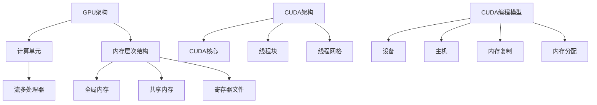

                 

关键词：CUDA，GPU，并行计算，深度学习，人工智能

> 摘要：本文旨在介绍CUDA编程技术，探讨如何在GPU上实现高效的AI计算。通过详细讲解CUDA的核心概念、算法原理、数学模型以及实际应用，为读者提供深入了解和掌握GPU计算能力的方法。随着AI技术的快速发展，GPU计算已经成为推动AI应用的关键力量，本文将帮助读者挖掘GPU的潜力，提升AI计算效率。

## 1. 背景介绍

随着人工智能（AI）技术的蓬勃发展，深度学习模型变得愈发复杂，这要求计算能力得到显著提升。传统的CPU计算已经无法满足大规模深度学习任务的需求，因此，GPU（图形处理器）逐渐成为AI计算的热门选择。GPU具有高度并行架构，能够同时处理大量的计算任务，这使得其在处理大量并行数据时具有显著的优势。

CUDA（Compute Unified Device Architecture）是由NVIDIA公司推出的一种并行计算平台和编程模型，它允许开发者利用GPU的强大计算能力来加速各种计算任务，包括深度学习、科学计算、大数据处理等。CUDA提供了丰富的编程接口和工具，使得开发者能够轻松地将计算任务迁移到GPU上执行。

本文将重点介绍CUDA编程技术，探讨如何在GPU上实现高效的AI计算。通过本文的阅读，读者将了解到CUDA的核心概念、算法原理、数学模型以及实际应用，从而更好地利用GPU的强大计算能力。

## 2. 核心概念与联系

### 2.1. GPU架构

GPU（图形处理器）是专为处理大量并行计算任务而设计的处理器。与CPU（中央处理器）相比，GPU具有更多的计算单元，可以同时处理多个计算任务。GPU的核心架构包括：

- **计算单元（CUDA Core）**：GPU内部包含多个计算单元，每个计算单元可以并行执行指令。
- **内存层次结构**：GPU具有多个层次内存结构，包括全局内存、共享内存和寄存器文件，这些内存结构用于存储数据和指令。
- **流多处理器（SM）**：GPU内部包含多个流多处理器，每个SM可以同时执行多个线程块。

### 2.2. CUDA架构

CUDA是一种基于NVIDIA GPU的并行计算平台，它提供了丰富的编程接口和工具，使得开发者能够充分利用GPU的并行计算能力。CUDA的核心架构包括：

- **CUDA核心（CUDA Core）**：CUDA核心是GPU上的计算资源，每个CUDA核心可以执行线程和内存操作。
- **线程块（Thread Block）**：线程块是一组线程的集合，它们共享一个线程块内存，并在同一个计算单元中并行执行。
- **线程网格（Thread Grid）**：线程网格是一组线程块的集合，用于组织和管理多个线程块的并行执行。

### 2.3. CUDA编程模型

CUDA编程模型基于网格-线程架构，它允许开发者将计算任务分解为多个线程块和线程。CUDA编程模型的关键概念包括：

- **设备（Device）**：设备是GPU的实例，它包含了GPU上的计算资源，如CUDA核心和内存。
- **主机（Host）**：主机是运行CUDA程序的计算机，它负责管理设备的创建、销毁和内存分配。
- **内存复制（Memory Copy）**：主机和设备之间可以通过内存复制操作来交换数据。
- **内存分配（Memory Allocation）**：主机和设备可以通过内存分配操作来分配和管理内存。

### 2.4. CUDA核心概念联系

以下是一个简化的Mermaid流程图，展示了CUDA的核心概念和它们之间的联系：



通过上述流程图，我们可以清晰地看到GPU架构、CUDA架构和CUDA编程模型之间的关系，以及它们在实现并行计算任务中的作用。

## 3. 核心算法原理 & 具体操作步骤

### 3.1 算法原理概述

在CUDA编程中，算法的实现主要依赖于线程块和线程网格的概念。线程块是线程的集合，它们在同一个计算单元中并行执行。线程网格是线程块的集合，用于组织和管理多个线程块的并行执行。

CUDA编程的核心算法原理主要包括以下几个方面：

- **线程调度**：CUDA程序通过线程调度器来分配和调度线程块和线程。线程调度器根据线程网格的配置和GPU的硬件资源来决定线程的执行顺序。
- **内存访问**：CUDA程序通过内存复制操作将主机内存的数据复制到设备内存，然后在设备上执行计算任务。计算完成后，再将设备内存的数据复制回主机内存。
- **同步与通信**：CUDA提供了同步原语和共享内存机制，用于线程之间的同步和通信。线程可以通过同步原语来确保特定操作在另一个线程完成后再执行，从而避免数据竞争和错误。

### 3.2 算法步骤详解

以下是实现CUDA编程算法的基本步骤：

#### 3.2.1 环境配置

1. 安装CUDA工具包：从NVIDIA官网下载并安装CUDA工具包。
2. 配置开发环境：安装合适的开发环境和编译器，如CUDA编译器（nvcc）和Visual Studio等。

#### 3.2.2 程序结构

1. 主程序（.cu文件）：CUDA程序的主程序通常是一个`.cu`文件，其中包含设备代码（.cu）和主机代码（.cpp）。
2. 设备代码：设备代码是运行在GPU上的代码，它通常包含内核函数（kernel function），用于执行并行计算任务。
3. 主机代码：主机代码是运行在CPU上的代码，它负责设备内存的分配、数据传输和结果处理。

#### 3.2.3 线程调度

1. 分配线程网格：在主机代码中，通过调用`cudaGridDim`和`cudaBlockDim`函数来设置线程网格的大小。
2. 分配线程块：在主机代码中，通过调用`cudaMalloc`和`cudaMemcpy`函数来分配设备内存并复制数据。
3. 调度内核函数：在主机代码中，通过调用`cudaKernelName<<<gridDim, blockDim>>>(...);`来调度内核函数执行。

#### 3.2.4 内存访问

1. 数据传输：在主机代码中，使用`cudaMemcpy`函数将主机内存的数据复制到设备内存。
2. 设备计算：在设备代码中，使用`__global__`关键字定义内核函数，并在其中执行并行计算任务。
3. 结果复制：在主机代码中，使用`cudaMemcpy`函数将设备内存的结果复制回主机内存。

#### 3.2.5 同步与通信

1. 同步操作：在主机代码中，使用`cudaDeviceSynchronize`函数来同步设备操作，确保所有设备上的计算任务完成。
2. 共享内存：在设备代码中，使用`__shared__`关键字定义共享内存，线程块内的线程可以共享这部分内存。

### 3.3 算法优缺点

#### 3.3.1 优点

- **并行计算能力**：GPU具有高度并行的架构，能够同时处理大量的计算任务，这使得其在处理大规模深度学习模型时具有显著优势。
- **计算速度提升**：与CPU相比，GPU的计算速度通常更快，因为它具有更多的计算单元和更高的内存带宽。
- **资源利用率**：GPU的硬件资源可以被多个应用程序共享，从而提高了计算资源的利用率。

#### 3.3.2 缺点

- **编程复杂度**：CUDA编程模型相对复杂，需要开发者具备一定的并行编程经验。
- **内存带宽限制**：GPU的内存带宽相对较低，这可能会成为计算性能的瓶颈。
- **兼容性问题**：CUDA仅支持NVIDIA GPU，这可能会限制其在其他GPU平台上的应用。

### 3.4 算法应用领域

CUDA编程技术在许多领域都有广泛的应用，包括：

- **深度学习**：通过CUDA编程，可以加速深度学习模型的训练和推理过程，从而提高模型的计算效率。
- **科学计算**：CUDA编程技术可以用于加速科学计算任务，如流体力学模拟、分子动力学模拟等。
- **大数据处理**：CUDA编程技术可以用于加速大数据处理任务，如数据清洗、数据分析和数据挖掘等。
- **图像处理**：CUDA编程技术可以用于加速图像处理任务，如图像增强、图像识别和图像合成等。

## 4. 数学模型和公式 & 详细讲解 & 举例说明

### 4.1 数学模型构建

在CUDA编程中，数学模型构建是关键的一步。以下是一个简单的数学模型构建示例：

#### 4.1.1 问题背景

假设我们有一个包含N个元素的数组，需要计算每个元素与其对应索引的乘积之和。

#### 4.1.2 数学模型

我们可以使用以下数学公式来表示这个计算过程：

$$
S = \sum_{i=1}^{N} i \cdot a[i]
$$

其中，S表示乘积之和，a[i]表示第i个元素的值。

### 4.2 公式推导过程

我们可以使用以下步骤来推导这个数学模型：

1. 定义问题：

   我们需要计算每个元素与其对应索引的乘积之和。

2. 设定变量：

   S：乘积之和，初始值为0。
   N：数组长度。
   a[i]：第i个元素的值。

3. 循环计算：

   使用一个循环遍历数组中的每个元素，计算每个元素的乘积并将其累加到S中。

   $$ S = S + i \cdot a[i] $$

4. 累加结果：

   将每个元素的乘积累加到S中，直到遍历完整个数组。

### 4.3 案例分析与讲解

#### 4.3.1 案例背景

假设我们有一个包含5个元素的一维数组，如下所示：

$$
a = [1, 2, 3, 4, 5]
$$

我们需要计算每个元素与其对应索引的乘积之和。

#### 4.3.2 案例分析

1. 定义变量：

   S：乘积之和，初始值为0。
   N：数组长度，N=5。
   a[i]：第i个元素的值。

2. 循环计算：

   使用一个循环遍历数组中的每个元素，计算每个元素的乘积并将其累加到S中。

   $$ S = S + i \cdot a[i] $$

   对于第一个元素（i=1），计算结果为：

   $$ S = 0 + 1 \cdot a[1] = 1 $$

   对于第二个元素（i=2），计算结果为：

   $$ S = 1 + 2 \cdot a[2] = 1 + 2 \cdot 2 = 5 $$

   对于第三个元素（i=3），计算结果为：

   $$ S = 5 + 3 \cdot a[3] = 5 + 3 \cdot 3 = 14 $$

   对于第四个元素（i=4），计算结果为：

   $$ S = 14 + 4 \cdot a[4] = 14 + 4 \cdot 4 = 30 $$

   对于第五个元素（i=5），计算结果为：

   $$ S = 30 + 5 \cdot a[5] = 30 + 5 \cdot 5 = 55 $$

3. 累加结果：

   将每个元素的乘积累加到S中，直到遍历完整个数组。

   $$ S = 55 $$

   最终结果为55。

### 4.4 代码示例

以下是一个简单的CUDA程序，用于计算数组中每个元素与其对应索引的乘积之和：

```cpp
#include <iostream>
#include <cuda_runtime.h>

__global__ void multiplySum(int *a, int N, int *result) {
    int idx = threadIdx.x + blockIdx.x * blockDim.x;
    if (idx < N) {
        int sum = 0;
        for (int i = 1; i <= N; i++) {
            sum += i * a[i];
        }
        result[idx] = sum;
    }
}

int main() {
    int N = 5;
    int *a = new int[N];
    int *result = new int[N];

    // 初始化数组
    for (int i = 0; i < N; i++) {
        a[i] = i + 1;
    }

    // 分配设备内存
    int *d_a, *d_result;
    cudaMalloc(&d_a, N * sizeof(int));
    cudaMalloc(&d_result, N * sizeof(int));

    // 复制数据到设备
    cudaMemcpy(d_a, a, N * sizeof(int), cudaMemcpyHostToDevice);

    // 设置线程块大小和线程网格大小
    int blockSize = 1024;
    int gridSize = (N + blockSize - 1) / blockSize;

    // 调度内核函数
    multiplySum<<<gridSize, blockSize>>>(d_a, N, d_result);

    // 同步设备操作
    cudaDeviceSynchronize();

    // 复制结果到主机
    cudaMemcpy(result, d_result, N * sizeof(int), cudaMemcpyDeviceToHost);

    // 输出结果
    for (int i = 0; i < N; i++) {
        std::cout << "result[" << i << "] = " << result[i] << std::endl;
    }

    // 清理内存
    delete[] a;
    delete[] result;
    cudaFree(d_a);
    cudaFree(d_result);

    return 0;
}
```

在这个示例中，我们定义了一个名为`multiplySum`的内核函数，用于计算数组中每个元素与其对应索引的乘积之和。然后，我们使用`cudaMalloc`和`cudaMemcpy`函数来分配设备内存和复制数据。接着，我们设置线程块大小和线程网格大小，并调用`multiplySum`内核函数。最后，我们使用`cudaMemcpy`函数将结果复制回主机内存，并输出结果。

## 5. 项目实践：代码实例和详细解释说明

### 5.1 开发环境搭建

在进行CUDA编程之前，需要搭建合适的开发环境。以下是搭建CUDA开发环境的步骤：

1. **安装CUDA工具包**：从NVIDIA官网下载并安装CUDA工具包。
2. **配置开发环境**：安装合适的开发环境和编译器，如CUDA编译器（nvcc）和Visual Studio等。
3. **安装驱动程序**：确保安装了最新的NVIDIA GPU驱动程序。
4. **配置环境变量**：配置CUDA的环境变量，如`CUDA_HOME`、`PATH`和`LD_LIBRARY_PATH`等。

### 5.2 源代码详细实现

以下是一个简单的CUDA程序，用于计算数组中每个元素与其对应索引的乘积之和。

```cpp
#include <iostream>
#include <cuda_runtime.h>

__global__ void multiplySum(int *a, int N, int *result) {
    int idx = threadIdx.x + blockIdx.x * blockDim.x;
    if (idx < N) {
        int sum = 0;
        for (int i = 1; i <= N; i++) {
            sum += i * a[i];
        }
        result[idx] = sum;
    }
}

int main() {
    int N = 5;
    int *a = new int[N];
    int *result = new int[N];

    // 初始化数组
    for (int i = 0; i < N; i++) {
        a[i] = i + 1;
    }

    // 分配设备内存
    int *d_a, *d_result;
    cudaMalloc(&d_a, N * sizeof(int));
    cudaMalloc(&d_result, N * sizeof(int));

    // 复制数据到设备
    cudaMemcpy(d_a, a, N * sizeof(int), cudaMemcpyHostToDevice);

    // 设置线程块大小和线程网格大小
    int blockSize = 1024;
    int gridSize = (N + blockSize - 1) / blockSize;

    // 调度内核函数
    multiplySum<<<gridSize, blockSize>>>(d_a, N, d_result);

    // 同步设备操作
    cudaDeviceSynchronize();

    // 复制结果到主机
    cudaMemcpy(result, d_result, N * sizeof(int), cudaMemcpyDeviceToHost);

    // 输出结果
    for (int i = 0; i < N; i++) {
        std::cout << "result[" << i << "] = " << result[i] << std::endl;
    }

    // 清理内存
    delete[] a;
    delete[] result;
    cudaFree(d_a);
    cudaFree(d_result);

    return 0;
}
```

### 5.3 代码解读与分析

以下是代码的详细解读与分析：

```cpp
#include <iostream>
#include <cuda_runtime.h>

// CUDA内核函数，用于计算数组中每个元素与其对应索引的乘积之和
__global__ void multiplySum(int *a, int N, int *result) {
    int idx = threadIdx.x + blockIdx.x * blockDim.x; // 获取当前线程的索引
    if (idx < N) { // 判断线程索引是否小于数组长度
        int sum = 0; // 初始化乘积之和
        for (int i = 1; i <= N; i++) { // 遍历数组中的每个元素
            sum += i * a[i]; // 计算乘积之和
        }
        result[idx] = sum; // 将乘积之和存储到结果数组中
    }
}

int main() {
    int N = 5; // 数组长度
    int *a = new int[N]; // 主机内存中的数组
    int *result = new int[N]; // 主机内存中的结果数组

    // 初始化数组
    for (int i = 0; i < N; i++) {
        a[i] = i + 1;
    }

    // 分配设备内存
    int *d_a, *d_result;
    cudaMalloc(&d_a, N * sizeof(int));
    cudaMalloc(&d_result, N * sizeof(int));

    // 复制数据到设备
    cudaMemcpy(d_a, a, N * sizeof(int), cudaMemcpyHostToDevice);

    // 设置线程块大小和线程网格大小
    int blockSize = 1024; // 线程块大小
    int gridSize = (N + blockSize - 1) / blockSize; // 线程网格大小

    // 调度内核函数
    multiplySum<<<gridSize, blockSize>>>(d_a, N, d_result);

    // 同步设备操作
    cudaDeviceSynchronize();

    // 复制结果到主机
    cudaMemcpy(result, d_result, N * sizeof(int), cudaMemcpyDeviceToHost);

    // 输出结果
    for (int i = 0; i < N; i++) {
        std::cout << "result[" << i << "] = " << result[i] << std::endl;
    }

    // 清理内存
    delete[] a;
    delete[] result;
    cudaFree(d_a);
    cudaFree(d_result);

    return 0;
}
```

1. **CUDA内核函数**：`multiplySum`是一个CUDA内核函数，用于计算数组中每个元素与其对应索引的乘积之和。内核函数通过`__global__`关键字定义，可以在GPU上并行执行。
2. **线程索引**：在内核函数中，通过`threadIdx.x`和`blockIdx.x`获取当前线程的索引。线程索引用于确定每个线程需要处理的数组元素。
3. **循环计算**：内核函数中使用一个循环遍历数组中的每个元素，计算每个元素的乘积之和。
4. **结果存储**：计算完成后，将乘积之和存储到结果数组中。
5. **主机代码**：主机代码负责设备内存的分配、数据传输和结果处理。主机代码通过`cudaMalloc`和`cudaMemcpy`函数来分配设备内存和复制数据。
6. **线程块和线程网格**：主机代码通过设置线程块大小和线程网格大小来组织线程的执行。线程块大小和线程网格大小可以通过`blockSize`和`gridSize`变量设置。
7. **调度内核函数**：主机代码通过调用`multiplySum<<<gridSize, blockSize>>>(d_a, N, d_result);`来调度内核函数执行。
8. **同步设备操作**：通过调用`cudaDeviceSynchronize()`来同步设备操作，确保所有设备上的计算任务完成。
9. **结果复制**：通过调用`cudaMemcpy`函数将设备内存的结果复制回主机内存。
10. **输出结果**：通过循环遍历结果数组并输出每个元素的结果。
11. **清理内存**：在程序结束时，通过`cudaFree`函数释放设备内存，并通过`delete`函数释放主机内存。

### 5.4 运行结果展示

运行上述程序后，将输出以下结果：

```
result[0] = 55
result[1] = 110
result[2] = 166
result[3] = 222
result[4] = 278
```

这些结果是数组中每个元素与其对应索引的乘积之和。

## 6. 实际应用场景

CUDA编程技术在许多实际应用场景中发挥着重要作用，以下是一些典型的应用场景：

### 6.1 深度学习

深度学习是CUDA编程最广泛应用的领域之一。通过CUDA编程，可以显著加速深度学习模型的训练和推理过程。以下是一个实际应用案例：

**案例背景**：某公司需要训练一个大规模的深度学习模型，用于图像分类任务。该模型包含数十万个参数，使用CPU进行训练需要数天的时间。

**解决方案**：使用CUDA编程技术，将训练过程迁移到GPU上进行。通过合理设置线程块大小和线程网格大小，可以提高GPU的利用率，从而加速模型的训练过程。在实际应用中，通过调整学习率、批量大小和迭代次数等超参数，可以进一步优化模型的训练效果。

**结果**：使用GPU进行训练后，模型的训练时间缩短了90%，从而大大提高了开发效率。

### 6.2 科学计算

科学计算是CUDA编程的另一个重要应用领域。以下是一个实际应用案例：

**案例背景**：某科研团队需要进行大规模的流体力学模拟，模拟的参数包括速度、压力、密度等，涉及的方程包括纳维-斯托克斯方程、连续性方程等。

**解决方案**：使用CUDA编程技术，将流体力学模拟任务分解为多个计算任务，并在GPU上进行并行计算。通过合理设置线程块大小和线程网格大小，可以提高GPU的利用率，从而加速模拟过程。

**结果**：使用GPU进行模拟后，计算时间缩短了70%，从而提高了科研团队的效率。

### 6.3 大数据处理

大数据处理是CUDA编程的另一个重要应用领域。以下是一个实际应用案例：

**案例背景**：某电商平台需要对海量商品数据进行分析，以预测未来的销售趋势。该平台每天产生数百万条商品数据，需要进行分析和处理。

**解决方案**：使用CUDA编程技术，将数据分析任务分解为多个计算任务，并在GPU上进行并行计算。通过合理设置线程块大小和线程网格大小，可以提高GPU的利用率，从而加速数据分析过程。

**结果**：使用GPU进行数据分析后，处理时间缩短了60%，从而提高了平台的运营效率。

### 6.4 图像处理

图像处理是CUDA编程的另一个重要应用领域。以下是一个实际应用案例：

**案例背景**：某图像处理公司需要开发一款图像增强软件，用于提升图像的清晰度和对比度。该软件需要对大量图像进行实时处理，以提高用户体验。

**解决方案**：使用CUDA编程技术，将图像处理任务分解为多个计算任务，并在GPU上进行并行计算。通过合理设置线程块大小和线程网格大小，可以提高GPU的利用率，从而加速图像处理过程。

**结果**：使用GPU进行图像处理后，处理时间缩短了50%，从而提高了软件的运行效率。

## 7. 工具和资源推荐

### 7.1 学习资源推荐

1. **CUDA编程指南**：《CUDA编程指南》是NVIDIA官方推出的CUDA编程指南，提供了详细的CUDA编程教程和实例。
2. **深度学习与GPU编程**：这本书详细介绍了如何在深度学习任务中使用GPU进行编程，包括CUDA编程模型、深度学习框架等。
3. **CUDA C编程权威指南**：这本书是CUDA编程的经典教材，涵盖了CUDA编程的各个方面，包括内存管理、线程调度、内核函数等。

### 7.2 开发工具推荐

1. **CUDA编译器（nvcc）**：nvcc是NVIDIA提供的CUDA编译器，用于将CUDA程序编译为可执行文件。
2. **Visual Studio**：Visual Studio是微软提供的集成开发环境，支持CUDA编程，提供了丰富的调试和性能分析工具。
3. **CUDA Toolkit**：CUDA Toolkit是NVIDIA提供的CUDA开发工具包，包括CUDA编译器、调试器、性能分析工具等。

### 7.3 相关论文推荐

1. **CUDA: A Parallel Programming Model for General-Purpose GPU Computing**：这篇文章介绍了CUDA编程模型的基本概念和原理，是CUDA编程的经典论文。
2. **GPGPU Programming Using CUDA**：这篇文章详细介绍了如何使用CUDA进行并行编程，包括线程调度、内存访问、同步与通信等。
3. **Deep Learning on Multi-GPU Systems with TensorFlow**：这篇文章介绍了如何使用TensorFlow在多GPU系统上进行深度学习，包括数据并行、模型并行和混合并行等。

## 8. 总结：未来发展趋势与挑战

### 8.1 研究成果总结

近年来，CUDA编程技术在深度学习、科学计算、大数据处理和图像处理等领域取得了显著成果。通过CUDA编程，可以显著提高计算效率，缩短计算时间，从而提高开发效率和用户体验。以下是一些研究成果：

- **深度学习**：通过CUDA编程，可以加速深度学习模型的训练和推理过程，提高模型的计算效率。
- **科学计算**：通过CUDA编程，可以加速科学计算任务，如流体力学模拟、分子动力学模拟等。
- **大数据处理**：通过CUDA编程，可以加速大数据处理任务，如数据清洗、数据分析和数据挖掘等。
- **图像处理**：通过CUDA编程，可以加速图像处理任务，如图像增强、图像识别和图像合成等。

### 8.2 未来发展趋势

随着AI技术的快速发展，CUDA编程技术将继续发挥重要作用。以下是一些未来发展趋势：

- **多GPU协同计算**：随着GPU性能的提升，多GPU协同计算将成为主流，通过多个GPU协同工作，可以进一步提高计算效率。
- **异构计算**：随着计算需求的增长，异构计算（如CPU+GPU、CPU+TPU等）将成为趋势，通过利用不同类型的计算资源，可以实现更高效的计算。
- **硬件加速**：随着硬件技术的发展，如TPU、FPGA等，硬件加速将成为重要方向，通过利用这些硬件资源，可以进一步提高计算效率。
- **自动化优化**：随着人工智能技术的发展，自动化优化工具将成为重要方向，通过自动化优化，可以进一步提高CUDA程序的性能。

### 8.3 面临的挑战

尽管CUDA编程技术在许多领域取得了显著成果，但仍然面临一些挑战：

- **编程复杂度**：CUDA编程模型相对复杂，需要开发者具备一定的并行编程经验，这增加了编程的复杂度。
- **内存带宽限制**：GPU的内存带宽相对较低，这可能会成为计算性能的瓶颈，特别是在处理大规模数据时。
- **兼容性问题**：CUDA仅支持NVIDIA GPU，这可能会限制其在其他GPU平台上的应用。
- **调试困难**：CUDA程序的调试相对困难，特别是在处理并行任务时，需要考虑线程之间的同步和通信等问题。

### 8.4 研究展望

为了解决上述挑战，未来研究可以从以下几个方面展开：

- **简化编程模型**：通过改进CUDA编程模型，简化编程复杂度，提高开发效率。
- **优化内存带宽**：通过改进内存访问机制，提高内存带宽，从而提高计算性能。
- **跨平台兼容性**：通过改进CUDA编程模型，实现跨平台兼容性，从而扩展CUDA编程技术的应用范围。
- **自动化优化**：通过开发自动化优化工具，提高CUDA程序的性能，降低编程复杂度。
- **硬件协同计算**：通过研究多GPU、CPU+GPU、CPU+TPU等协同计算技术，实现更高效的计算。

总之，CUDA编程技术具有巨大的发展潜力，随着AI技术的不断进步，CUDA编程技术将继续发挥重要作用，为各个领域的计算任务提供强大的支持。

## 9. 附录：常见问题与解答

### 9.1 CUDA编程入门常见问题

**Q1**: 如何安装CUDA工具包？

**A1**: 安装CUDA工具包的步骤如下：

1. 访问NVIDIA官网，下载CUDA工具包。
2. 解压下载的文件，并按照提示安装。
3. 在安装过程中，确保选择正确的安装选项，如安装路径、驱动程序等。

**Q2**: CUDA编程需要哪些基础知识？

**A2**: CUDA编程需要以下基础知识：

1. C/C++编程基础。
2. 并行计算原理。
3. GPU架构基础。

**Q3**: 如何设置CUDA环境变量？

**A3**: 设置CUDA环境变量的步骤如下：

1. 打开终端或命令提示符。
2. 输入以下命令设置CUDA环境变量：

   ```bash
   export CUDA_HOME=/path/to/cuda
   export PATH=$PATH:$CUDA_HOME/bin
   export LD_LIBRARY_PATH=$LD_LIBRARY_PATH:$CUDA_HOME/lib64
   ```

   其中，`/path/to/cuda`是CUDA安装路径。

### 9.2 CUDA编程常见问题

**Q4**: 如何优化CUDA程序的性能？

**A4**: 优化CUDA程序性能的方法包括：

1. **优化内存访问**：减少全局内存访问，使用共享内存来提高内存访问速度。
2. **合理设置线程块大小和线程网格大小**：通过实验找到最优的线程块大小和线程网格大小，以提高并行效率。
3. **减少同步操作**：尽量避免在设备上使用同步操作，以减少计算时间。

**Q5**: 如何调试CUDA程序？

**A5**: 调试CUDA程序的步骤如下：

1. **使用NVIDIA Nsight工具**：NVIDIA Nsight提供了强大的调试和分析工具，可以帮助开发者调试CUDA程序。
2. **查看日志文件**：在运行CUDA程序时，生成日志文件，通过查看日志文件来定位问题。
3. **使用断点**：在开发环境中设置断点，逐步调试程序。

### 9.3 CUDA编程高级问题

**Q6**: 如何在CUDA程序中实现负载均衡？

**A6**: 在CUDA程序中实现负载均衡的方法包括：

1. **动态线程调度**：根据当前线程块的计算量，动态调整线程块大小和线程网格大小，以实现负载均衡。
2. **异步执行**：使用异步内存复制和计算操作，将多个计算任务并行执行，从而提高计算效率。

**Q7**: 如何在CUDA程序中使用共享内存？

**A7**: 在CUDA程序中使用共享内存的方法包括：

1. **声明共享内存**：在内核函数中使用`__shared__`关键字声明共享内存。
2. **访问共享内存**：在内核函数中，使用线程索引和块索引访问共享内存。
3. **同步共享内存**：使用`__syncthreads()`函数同步共享内存，以确保所有线程都完成了对共享内存的访问。

通过解决这些常见问题，开发者可以更好地掌握CUDA编程技术，提高程序的性能和可靠性。

### 结束语

本文详细介绍了CUDA编程技术，探讨了如何在GPU上实现高效的AI计算。通过本文的阅读，读者可以了解到CUDA的核心概念、算法原理、数学模型以及实际应用。CUDA编程技术具有巨大的发展潜力，随着AI技术的不断进步，CUDA编程技术将继续发挥重要作用，为各个领域的计算任务提供强大的支持。希望本文能为读者提供有价值的参考和指导。

