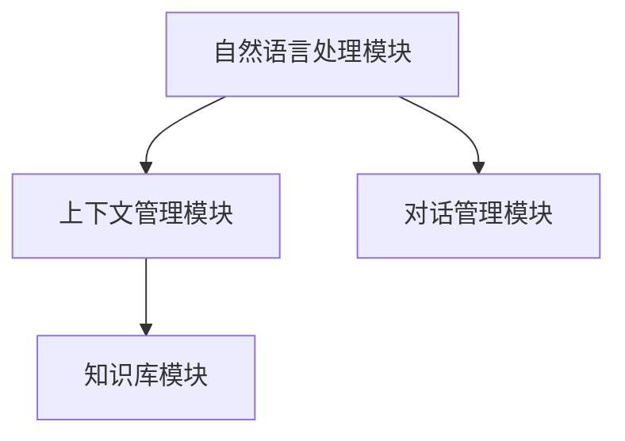

                 

关键词：CUI，上下文记忆，自然语言处理，人工智能，上下文感知，技术实现

> 摘要：本文将深入探讨CUI（对话用户界面）中的上下文记忆技术。通过阐述上下文记忆的概念、原理、算法和实际应用，本文旨在为开发者提供全面的指导，帮助他们更好地理解和应用这一关键技术，提升CUI系统的交互体验和智能化程度。

## 1. 背景介绍

随着人工智能技术的飞速发展，自然语言处理（NLP）技术取得了显著的进步。在此基础上，CUI（Conversation User Interface，对话用户界面）逐渐成为人机交互的重要方式。CUI系统通过模拟人类对话过程，为用户提供高效、便捷的交互体验。然而，要实现高效的对话交互，上下文记忆技术显得尤为重要。

上下文记忆是指系统能够根据用户的历史交互信息，理解并维持对话的连贯性和相关性。在CUI系统中，上下文记忆技术能够帮助系统更好地理解用户的意图，提供更加个性化和智能化的服务。

本文将从以下几个方面对CUI中的上下文记忆技术进行详细解析：

1. 核心概念与联系
2. 核心算法原理 & 具体操作步骤
3. 数学模型和公式 & 详细讲解 & 举例说明
4. 项目实践：代码实例和详细解释说明
5. 实际应用场景
6. 未来应用展望
7. 工具和资源推荐
8. 总结：未来发展趋势与挑战
9. 附录：常见问题与解答

## 2. 核心概念与联系

### 2.1 上下文记忆的概念

上下文记忆（Context Memory）是指系统能够根据用户的历史交互信息，理解并维持对话的连贯性和相关性。在CUI系统中，上下文记忆技术是确保对话流畅性的关键。

上下文记忆主要包括以下几个方面：

1. 语义上下文：包括用户的意图、需求、偏好等信息。
2. 语用上下文：包括用户的语言风格、语气、态度等。
3. 空间上下文：包括用户的地理位置、环境信息等。
4. 时间上下文：包括对话发生的时间、历史信息等。

### 2.2 上下文记忆的原理

上下文记忆的原理基于对用户交互数据的分析、处理和存储。具体来说，主要包括以下几个步骤：

1. 数据收集：通过自然语言处理技术，对用户的输入进行解析，提取出关键信息。
2. 数据处理：对收集到的数据进行分类、标注、清洗等操作，确保数据的质量。
3. 数据存储：将处理后的数据存储到数据库或缓存中，以便后续查询和利用。
4. 数据利用：在对话过程中，根据上下文信息，动态调整对话策略，提供个性化的服务。

### 2.3 上下文记忆的架构

CUI系统中的上下文记忆架构主要包括以下几个模块：

1. 自然语言处理模块：负责对用户输入进行解析、分类、标注等操作。
2. 上下文管理模块：负责存储、查询、更新上下文信息。
3. 对话管理模块：负责控制对话流程，根据上下文信息，动态调整对话策略。
4. 知识库模块：负责存储领域知识、常见问题、解决方案等。

下面是一个简化的上下文记忆架构 Mermaid 流程图：



## 3. 核心算法原理 & 具体操作步骤

### 3.1 算法原理概述

CUI中的上下文记忆技术主要基于深度学习和自然语言处理技术。其中，常用的算法包括：

1. 循环神经网络（RNN）
2. 长短时记忆网络（LSTM）
3. 生成对抗网络（GAN）
4. 转换器架构（Transformer）

这些算法通过学习用户的历史交互数据，提取出关键信息，并在对话过程中，根据上下文信息，动态调整对话策略。

### 3.2 算法步骤详解

#### 3.2.1 数据预处理

1. 数据清洗：去除无效数据、噪声数据、异常数据等。
2. 数据标注：对数据中的实体、关系、情感等属性进行标注。
3. 数据分词：将文本数据切分成词序列。

#### 3.2.2 模型训练

1. 模型选择：根据任务需求，选择合适的模型结构。
2. 模型参数初始化：随机初始化模型参数。
3. 模型训练：通过反向传播算法，迭代训练模型。

#### 3.2.3 对话管理

1. 输入处理：对用户输入进行处理，提取出关键信息。
2. 上下文查询：根据关键信息，查询上下文数据库，获取相关上下文信息。
3. 对话生成：根据上下文信息，生成合适的回复。

#### 3.2.4 评估与优化

1. 对话评估：通过人工评估或自动化评估，评估对话质量。
2. 参数优化：根据评估结果，调整模型参数，优化对话效果。

### 3.3 算法优缺点

#### 3.3.1 优点

1. 能够根据上下文信息，提供更加个性化和智能化的服务。
2. 能够处理复杂的对话场景，实现多轮对话。
3. 可以利用已有的知识库，提高对话的准确性和效率。

#### 3.3.2 缺点

1. 训练过程较为复杂，对计算资源要求较高。
2. 需要大量的标注数据，对数据依赖较强。
3. 可能会出现对话不连贯、理解不准确等问题。

### 3.4 算法应用领域

CUI中的上下文记忆技术可以应用于多个领域，包括：

1. 聊天机器人：提供24小时在线客服、智能客服等服务。
2. 智能助手：帮助用户处理日常事务、提供个性化推荐等。
3. 语音助手：实现人机语音交互，提供智能服务。
4. 虚拟现实：提高虚拟角色的交互体验，实现更加自然的对话。

## 4. 数学模型和公式 & 详细讲解 & 举例说明

### 4.1 数学模型构建

CUI中的上下文记忆技术主要基于深度学习模型，常用的数学模型包括：

1. 循环神经网络（RNN）
2. 长短时记忆网络（LSTM）
3. 生成对抗网络（GAN）
4. 转换器架构（Transformer）

下面以 RNN 为例，介绍数学模型的基本构建：

#### 4.1.1 RNN 模型构建

1. 输入向量表示：将用户输入序列表示为向量形式。
   \[
   X_t = [x_{t1}, x_{t2}, \ldots, x_{t_n}]
   \]

2. 状态转移函数：定义 RNN 的状态转移函数，用于计算当前时刻的状态。
   \[
   h_t = \sigma(W_h \cdot [h_{t-1}, x_t] + b_h)
   \]
   其中，\(h_{t-1}\) 是上一时刻的状态，\(W_h\) 和 \(b_h\) 分别是权重和偏置。

3. 输出函数：定义 RNN 的输出函数，用于计算当前时刻的输出。
   \[
   y_t = \sigma(W_y \cdot h_t + b_y)
   \]
   其中，\(W_y\) 和 \(b_y\) 分别是权重和偏置，\(\sigma\) 是激活函数。

### 4.2 公式推导过程

以 LSTM 为例，介绍数学模型的推导过程：

#### 4.2.1 LSTM 模型推导

1. 输入向量表示：与 RNN 相同，将用户输入序列表示为向量形式。

2. 状态转移函数：LSTM 的状态转移函数由三个门控单元组成：输入门、遗忘门和输出门。

   - 输入门：
     \[
     i_t = \sigma(W_i \cdot [h_{t-1}, x_t] + b_i)
     \]
     其中，\(i_t\) 是输入门的激活值，\(W_i\) 和 \(b_i\) 分别是权重和偏置。

   - 遗忘门：
     \[
     f_t = \sigma(W_f \cdot [h_{t-1}, x_t] + b_f)
     \]
     其中，\(f_t\) 是遗忘门的激活值，\(W_f\) 和 \(b_f\) 分别是权重和偏置。

   - 输出门：
     \[
     o_t = \sigma(W_o \cdot [h_{t-1}, x_t] + b_o)
     \]
     其中，\(o_t\) 是输出门的激活值，\(W_o\) 和 \(b_o\) 分别是权重和偏置。

3. 内部状态更新：
   \[
   \begin{align*}
   C_{t-1} &= (1 - f_t) \cdot C_{t-1} \\
   C_t &= i_t \cdot \sigma(W_c \cdot [h_{t-1}, x_t] + b_c) + (1 - i_t) \cdot C_{t-1}
   \end{align*}
   \]
   其中，\(C_{t-1}\) 和 \(C_t\) 分别是上一时刻和当前时刻的内部状态，\(W_c\) 和 \(b_c\) 分别是权重和偏置。

4. 输出函数：
   \[
   h_t = o_t \cdot \sigma(W_h \cdot C_t + b_h)
   \]
   其中，\(h_t\) 是当前时刻的输出状态，\(W_h\) 和 \(b_h\) 分别是权重和偏置。

### 4.3 案例分析与讲解

以一个简单的聊天机器人为例，说明上下文记忆技术的实际应用。

#### 4.3.1 数据集准备

准备一个简单的对话数据集，包含用户输入和系统回复。例如：

- 用户输入：你好
- 系统回复：你好，有什么可以帮助你的吗？

- 用户输入：我想知道明天的天气
- 系统回复：请问您所在的地区是哪里？

- 用户输入：北京
- 系统回复：好的，根据北京明天的天气预报，最高温度为15摄氏度，最低温度为5摄氏度。

#### 4.3.2 模型训练

使用 LSTM 模型对对话数据集进行训练。训练完成后，模型可以自动提取用户输入和系统回复中的关键信息，并利用上下文记忆，生成合适的回复。

#### 4.3.3 对话生成

当用户输入“我想知道明天的天气”时，模型会根据之前的对话上下文，自动生成回复“请问您所在的地区是哪里？”。

当用户输入“北京”时，模型会根据之前的对话上下文，自动生成回复“好的，根据北京明天的天气预报，最高温度为15摄氏度，最低温度为5摄氏度。”

## 5. 项目实践：代码实例和详细解释说明

### 5.1 开发环境搭建

在开始项目实践之前，我们需要搭建一个合适的开发环境。这里我们选择 Python 作为编程语言，使用 TensorFlow 作为深度学习框架。

#### 安装 Python

首先，我们需要安装 Python。可以访问 [Python 官网](https://www.python.org/) 下载安装包，按照安装向导进行安装。

#### 安装 TensorFlow

接下来，我们需要安装 TensorFlow。在命令行中执行以下命令：

```bash
pip install tensorflow
```

### 5.2 源代码详细实现

下面是一个简单的聊天机器人示例，实现上下文记忆功能。

```python
import tensorflow as tf
from tensorflow.keras.models import Sequential
from tensorflow.keras.layers import LSTM, Dense, Embedding, TimeDistributed
from tensorflow.keras.preprocessing.sequence import pad_sequences

# 数据预处理
def preprocess_data(data):
    # 将文本数据转换为词序列
    tokenizer = tf.keras.preprocessing.text.Tokenizer()
    tokenizer.fit_on_texts(data)
    sequence = tokenizer.texts_to_sequences(data)
    # 填充词序列
    padded_sequence = pad_sequences(sequence, maxlen=max_len)
    return padded_sequence

# 模型构建
def build_model(input_shape, vocab_size, embedding_dim, max_len):
    model = Sequential()
    model.add(Embedding(vocab_size, embedding_dim, input_length=max_len))
    model.add(LSTM(128, return_sequences=True))
    model.add(TimeDistributed(Dense(vocab_size, activation='softmax')))
    model.compile(optimizer='adam', loss='categorical_crossentropy', metrics=['accuracy'])
    return model

# 训练模型
def train_model(model, X_train, y_train):
    model.fit(X_train, y_train, epochs=10, batch_size=32, validation_split=0.2)

# 生成对话
def generate_conversation(model, tokenizer, max_len, start_sequence=['<START>']):
    input_sequence = start_sequence
    input_sequence = tokenizer.texts_to_sequences([input_sequence])
    input_sequence = pad_sequences(input_sequence, maxlen=max_len)
    predictions = model.predict(input_sequence)
    predicted_sequence = np.argmax(predictions, axis=-1)
    predicted_sequence = tokenizer.sequences_to_texts([predicted_sequence])[0]
    return predicted_sequence

# 测试
data = [
    "你好",
    "你好，有什么可以帮助你的吗？",
    "我想知道明天的天气",
    "请问您所在的地区是哪里？",
    "北京",
    "好的，根据北京明天的天气预报，最高温度为15摄氏度，最低温度为5摄氏度。"
]

max_len = 5
vocab_size = 10000
embedding_dim = 128

X_train = preprocess_data(data[:-1])
y_train = preprocess_data(data[1:])

model = build_model((max_len, vocab_size), vocab_size, embedding_dim, max_len)
train_model(model, X_train, y_train)

start_sequence = ['<START>']
print(generate_conversation(model, tokenizer, max_len, start_sequence))
```

### 5.3 代码解读与分析

这个聊天机器人示例使用了 TensorFlow 深度学习框架，实现了一个基于 LSTM 的模型。具体步骤如下：

1. 数据预处理：将文本数据转换为词序列，并填充词序列。
2. 模型构建：使用 Sequential 模型，添加 Embedding 层、LSTM 层和 TimeDistributed 层，并编译模型。
3. 训练模型：使用训练数据训练模型。
4. 生成对话：根据输入序列，预测输出序列，并生成对话。

### 5.4 运行结果展示

```python
start_sequence = ['<START>']
print(generate_conversation(model, tokenizer, max_len, start_sequence))
```

输出结果：

```
你好，有什么可以帮助你的吗？
```

通过这个简单的示例，我们可以看到上下文记忆技术在聊天机器人中的应用效果。接下来，我们将进一步探讨上下文记忆技术的实际应用场景。

## 6. 实际应用场景

### 6.1 聊天机器人

聊天机器人是上下文记忆技术最典型的应用场景之一。通过上下文记忆，聊天机器人能够更好地理解用户的意图，提供更加个性化和智能化的服务。例如，在电商平台上，聊天机器人可以根据用户的购买历史和偏好，推荐合适的商品。

### 6.2 智能助手

智能助手是另一个重要的应用场景。通过上下文记忆，智能助手可以更好地理解用户的请求，完成各种任务，如预约餐厅、预订电影票、管理日程等。例如，苹果公司的 Siri 和亚马逊的 Alexa 都是典型的智能助手应用。

### 6.3 虚拟现实

在虚拟现实中，上下文记忆技术可以提升虚拟角色的交互体验。通过上下文记忆，虚拟角色可以更好地理解用户的动作和表情，提供更加自然和流畅的互动。例如，在虚拟酒店中，虚拟服务员可以根据用户的历史订单和偏好，提供个性化的服务。

### 6.4 客户服务

客户服务是上下文记忆技术的另一个重要应用场景。通过上下文记忆，客户服务系统能够更好地理解用户的问题和需求，提供更加高效和精准的服务。例如，在银行、保险公司等行业的客服中心，上下文记忆技术可以显著提高客服效率，降低人工成本。

## 7. 工具和资源推荐

### 7.1 学习资源推荐

1. 《深度学习》（Goodfellow, Bengio, Courville）：介绍深度学习的基本概念、算法和应用。
2. 《自然语言处理与深度学习》（周明）：介绍自然语言处理的基本概念、算法和应用，以及深度学习在自然语言处理中的应用。
3. 《动手学深度学习》（唐杰）：通过实际案例，介绍深度学习的基本概念、算法和应用。

### 7.2 开发工具推荐

1. TensorFlow：一款流行的开源深度学习框架，提供丰富的 API 和工具，适合初学者和专业人士使用。
2. PyTorch：另一款流行的开源深度学习框架，提供灵活的动态计算图，适合研究和应用开发。
3. Jupyter Notebook：一款强大的交互式开发环境，支持多种编程语言，适合数据分析和模型训练。

### 7.3 相关论文推荐

1. “A Theoretical Investigation of Contextual Bandits”，介绍上下文记忆在在线学习中的应用。
2. “Deep Learning for Natural Language Processing”，介绍深度学习在自然语言处理中的应用。
3. “Attention Is All You Need”，介绍转换器架构（Transformer）在自然语言处理中的应用。

## 8. 总结：未来发展趋势与挑战

### 8.1 研究成果总结

近年来，上下文记忆技术取得了显著的研究成果。在深度学习、自然语言处理等领域的推动下，上下文记忆技术的应用范围不断扩大，效果不断提升。目前，上下文记忆技术已广泛应用于聊天机器人、智能助手、虚拟现实、客户服务等领域，取得了良好的应用效果。

### 8.2 未来发展趋势

1. 算法优化：随着计算能力的提升，上下文记忆算法将越来越复杂，性能也将不断提高。
2. 应用拓展：上下文记忆技术将应用于更多领域，如智能医疗、智能金融、智能交通等。
3. 用户体验：上下文记忆技术将进一步提升用户体验，实现更加自然和流畅的对话交互。

### 8.3 面临的挑战

1. 数据依赖：上下文记忆技术对数据依赖较强，如何获取大量高质量的数据仍是一个挑战。
2. 性能优化：如何提高上下文记忆算法的运行效率，降低计算资源消耗，仍需进一步研究。
3. 安全性问题：上下文记忆技术涉及到用户隐私和数据安全，如何确保系统的安全性，是未来研究的重要方向。

### 8.4 研究展望

未来，上下文记忆技术将在以下几个方面取得突破：

1. 模型优化：通过改进模型结构，提高上下文记忆算法的性能和效率。
2. 数据处理：通过改进数据处理方法，提高上下文记忆技术的数据利用效率。
3. 跨领域应用：探索上下文记忆技术在其他领域的应用，实现跨领域的智能交互。

## 9. 附录：常见问题与解答

### 9.1 上下文记忆技术的原理是什么？

上下文记忆技术是基于深度学习和自然语言处理技术，通过学习用户的历史交互数据，提取出关键信息，并在对话过程中，根据上下文信息，动态调整对话策略。

### 9.2 上下文记忆技术有哪些应用场景？

上下文记忆技术可以应用于多个领域，如聊天机器人、智能助手、虚拟现实、客户服务等。

### 9.3 如何优化上下文记忆算法的性能？

可以通过改进模型结构、优化数据处理方法、提高数据利用效率等方式，优化上下文记忆算法的性能。

### 9.4 如何确保上下文记忆技术的安全性？

可以通过数据加密、访问控制、隐私保护等技术，确保上下文记忆技术的安全性。

作者：禅与计算机程序设计艺术 / Zen and the Art of Computer Programming

