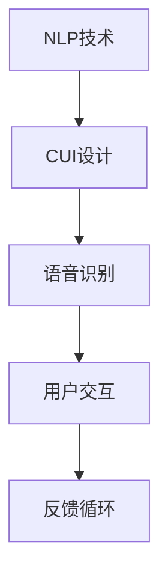

                 

关键词：自然语言交互、人工智能、数字产品设计、用户体验、界面设计、CUI、人机交互

> 摘要：随着人工智能技术的发展，自然语言交互界面（CUI）正逐渐成为数字产品界面设计的重要趋势。本文将探讨CUI的定义、技术原理、核心优势、应用领域以及未来发展趋势和面临的挑战，旨在为相关从业者提供有价值的参考。

## 1. 背景介绍

在数字产品的设计中，界面交互是用户体验的重要组成部分。传统的图形用户界面（GUI）和触摸用户界面（TUI）已经广泛使用，但它们在提供自然、流畅的交互体验方面仍有局限。随着人工智能技术的不断发展，特别是自然语言处理（NLP）和语音识别技术的进步，自然语言交互界面（CUI）逐渐成为数字产品设计的新方向。

CUI允许用户通过自然语言与系统进行交流，无需学习特定的界面控件和操作流程。这种交互方式更加直观、自然，能够显著提升用户体验。同时，CUI能够处理复杂任务，提供更加智能化的服务，这是传统界面设计难以实现的。

## 2. 核心概念与联系

### 2.1 CUI定义

CUI，即自然语言交互界面，是一种通过自然语言进行人机交互的界面设计。它利用人工智能技术，特别是自然语言处理（NLP）和语音识别技术，实现用户与系统之间的自然交流。

### 2.2 NLP与CUI的联系

自然语言处理（NLP）是人工智能的一个重要分支，它涉及从多种来源提取语言信息的技术。NLP与CUI之间的联系在于，NLP提供了理解和生成自然语言的能力，使CUI能够实现复杂的语言交互。

### 2.3 语音识别与CUI的联系

语音识别是将语音信号转换为文本的技术，它是实现CUI语音交互的关键。通过语音识别技术，CUI能够实时理解用户的语音指令，从而提供更加自然的交互体验。

### 2.4 Mermaid流程图



## 3. 核心算法原理 & 具体操作步骤

### 3.1 算法原理概述

CUI的核心算法主要包括自然语言处理（NLP）和语音识别技术。NLP负责理解用户输入的自然语言，将其转换为系统可以理解的指令。语音识别则负责将用户的语音指令转换为文本，传递给NLP进行处理。

### 3.2 算法步骤详解

1. **用户输入**：用户通过键盘、语音或其他输入方式与CUI进行交互。
2. **语音识别**：如果用户使用语音输入，系统将使用语音识别技术将语音转换为文本。
3. **自然语言处理**：系统使用NLP技术分析文本，理解用户的意图和需求。
4. **任务处理**：系统根据理解的结果执行相应的任务，如查询信息、执行命令等。
5. **反馈**：系统将执行结果反馈给用户，完成一次交互循环。

### 3.3 算法优缺点

**优点**：
- 提供自然、流畅的交互体验。
- 能够处理复杂任务，提供智能化服务。
- 减少用户学习成本。

**缺点**：
- 对自然语言理解的准确性要求高。
- 需要大量的数据和计算资源。

### 3.4 算法应用领域

CUI技术已经广泛应用于智能助手、语音助手、智能家居、车载系统、教育等领域。

## 4. 数学模型和公式 & 详细讲解 & 举例说明

### 4.1 数学模型构建

CUI的数学模型主要涉及自然语言处理（NLP）和语音识别技术。以下是一个简化的数学模型：

```latex
输入文本：T = {t_1, t_2, ..., t_n}
语音信号：S = {s_1, s_2, ..., s_m}
输出指令：O = {o_1, o_2, ..., o_k}
```

### 4.2 公式推导过程

- 语音识别模型：

```latex
P(S|T) = \frac{P(T|S)P(S)}{P(T)}
```

- 自然语言处理模型：

```latex
P(O|T) = \frac{P(T|O)P(O)}{P(T)}
```

### 4.3 案例分析与讲解

假设用户输入的文本为：“明天天气怎么样？”我们需要通过CUI系统理解这个意图，并给出相应的天气信息。

1. **语音识别**：将用户的语音输入转换为文本输入。
2. **自然语言处理**：分析文本，理解用户意图。这个步骤可能需要使用到命名实体识别（NER）、情感分析等技术。
3. **任务处理**：根据用户意图，查询天气数据，并生成天气信息。
4. **反馈**：将天气信息反馈给用户。

## 5. 项目实践：代码实例和详细解释说明

### 5.1 开发环境搭建

为了演示CUI的实现，我们将使用Python编程语言和相关的自然语言处理库，如NLTK和SpeechRecognition。

### 5.2 源代码详细实现

以下是一个简单的CUI实现示例：

```python
import speech_recognition as sr
from nltk import word_tokenize

# 初始化语音识别器
r = sr.Recognizer()

# 语音识别
def recognize_speech_from_mic():
    with sr.Microphone() as source:
        print("请说些什么：")
        audio = r.listen(source)
        text = r.recognize_google(audio)
        return text

# 自然语言处理
def process_text(text):
    tokens = word_tokenize(text)
    # 这里可以使用更复杂的NLP技术，例如命名实体识别、情感分析等
    return tokens

# 主程序
def main():
    text = recognize_speech_from_mic()
    tokens = process_text(text)
    print("您说了：", tokens)

if __name__ == "__main__":
    main()
```

### 5.3 代码解读与分析

1. **语音识别**：我们使用SpeechRecognition库来识别用户的语音输入。
2. **自然语言处理**：我们使用NLTK库进行文本分词，这是一个简单的NLP操作。在实际应用中，可能需要使用更复杂的NLP技术。
3. **主程序**：程序首先识别语音，然后处理文本，最后将处理结果打印出来。

### 5.4 运行结果展示

当用户说出“明天天气怎么样？”时，程序将识别语音，处理文本，并打印出用户的话语。

```shell
请说些什么：
明天天气怎么样？
您说了： ['明天', '天气', '怎么样']
```

## 6. 实际应用场景

CUI技术已经在多个领域得到广泛应用，如：

- **智能助手**：如苹果的Siri、谷歌的Google Assistant等。
- **智能家居**：如Amazon Echo、Google Home等智能音箱。
- **车载系统**：如特斯拉的AutoPilot等。
- **教育领域**：如智能教育平台、在线课程等。

## 7. 工具和资源推荐

### 7.1 学习资源推荐

- **书籍**：
  - 《自然语言处理综论》（Jurafsky, Dan, Martin, James H.）
  - 《语音信号处理与识别》（王选，龚毅）

- **在线课程**：
  - Coursera上的“自然语言处理基础”（由斯坦福大学提供）
  - Udacity的“人工智能纳米学位”

### 7.2 开发工具推荐

- **编程语言**：Python、Java
- **自然语言处理库**：NLTK、spaCy
- **语音识别库**：SpeechRecognition、Google Cloud Speech-to-Text

### 7.3 相关论文推荐

- **自然语言处理**：
  - “Word2Vec: A Simple and Efficient Contextual Embedding Model”（Mikolov et al., 2013）
  - “Transformers: State-of-the-Art Natural Language Processing”（Vaswani et al., 2017）

- **语音识别**：
  - “Deep Neural Network Hybrids for LVCSR”（Huang et al., 2013）
  - “Convolutions over Sequence Tensors”（Cesta et al., 2019）

## 8. 总结：未来发展趋势与挑战

### 8.1 研究成果总结

CUI技术在过去几年取得了显著进展，尤其是在自然语言理解和语音识别方面。这些研究成果为CUI的应用提供了坚实的基础。

### 8.2 未来发展趋势

- **更自然、更流畅的交互体验**：随着技术的进步，CUI将更加贴近人类的语言习惯，提供更加自然的交互体验。
- **多模态交互**：CUI将结合语音、文本、手势等多种交互方式，提供更加丰富和灵活的交互体验。
- **个性化服务**：基于用户数据，CUI将能够提供更加个性化的服务，满足用户的多样化需求。

### 8.3 面临的挑战

- **自然语言理解的准确性**：提高自然语言理解的准确性是CUI技术面临的主要挑战之一。
- **计算资源的消耗**：CUI技术通常需要大量的计算资源和数据，这对开发者和用户都是一大挑战。
- **隐私和安全问题**：CUI技术涉及到用户数据的收集和处理，如何确保用户隐私和安全是亟待解决的问题。

### 8.4 研究展望

未来，CUI技术将在多个领域得到更广泛的应用。随着人工智能技术的不断发展，我们有望看到更加智能、更加人性化的CUI界面，为人类带来更加便捷、高效的数字化生活。

## 9. 附录：常见问题与解答

### 9.1 什么是CUI？

CUI是自然语言交互界面的缩写，允许用户通过自然语言与系统进行交流。

### 9.2 CUI有哪些优点？

CUI提供自然、流畅的交互体验，能够处理复杂任务，减少用户学习成本。

### 9.3 CUI有哪些应用领域？

CUI广泛应用于智能助手、智能家居、车载系统、教育等领域。

### 9.4 如何提高CUI的自然语言理解准确性？

提高自然语言理解准确性需要结合多种NLP技术，如命名实体识别、情感分析等，并进行大量的数据训练。

### 9.5 CUI面临哪些挑战？

CUI面临的主要挑战包括自然语言理解准确性、计算资源消耗和隐私安全问题。

## 作者署名

作者：禅与计算机程序设计艺术 / Zen and the Art of Computer Programming

----------------------------------------------------------------

以上即为文章正文内容的撰写。接下来，我们将按照markdown格式将文章内容整理输出。以下是markdown格式的文章内容：

```markdown
# CUI将成为未来数字产品界面设计的重要趋势

关键词：自然语言交互、人工智能、数字产品设计、用户体验、界面设计、CUI、人机交互

> 摘要：随着人工智能技术的发展，自然语言交互界面（CUI）正逐渐成为数字产品界面设计的重要趋势。本文将探讨CUI的定义、技术原理、核心优势、应用领域以及未来发展趋势和面临的挑战，旨在为相关从业者提供有价值的参考。

## 1. 背景介绍

在数字产品的设计中，界面交互是用户体验的重要组成部分。传统的图形用户界面（GUI）和触摸用户界面（TUI）已经广泛使用，但它们在提供自然、流畅的交互体验方面仍有局限。随着人工智能技术的不断发展，特别是自然语言处理（NLP）和语音识别技术的进步，自然语言交互界面（CUI）逐渐成为数字产品设计的新方向。

CUI允许用户通过自然语言与系统进行交流，无需学习特定的界面控件和操作流程。这种交互方式更加直观、自然，能够显著提升用户体验。同时，CUI能够处理复杂任务，提供更加智能化的服务，这是传统界面设计难以实现的。

## 2. 核心概念与联系

### 2.1 CUI定义

CUI，即自然语言交互界面，是一种通过自然语言进行人机交互的界面设计。它利用人工智能技术，特别是自然语言处理（NLP）和语音识别技术，实现用户与系统之间的自然交流。

### 2.2 NLP与CUI的联系

自然语言处理（NLP）是人工智能的一个重要分支，它涉及从多种来源提取语言信息的技术。NLP与CUI之间的联系在于，NLP提供了理解和生成自然语言的能力，使CUI能够实现复杂的语言交互。

### 2.3 语音识别与CUI的联系

语音识别是将语音信号转换为文本的技术，它是实现CUI语音交互的关键。通过语音识别技术，CUI能够实时理解用户的语音指令，从而提供更加自然的交互体验。

### 2.4 Mermaid流程图


## 3. 核心算法原理 & 具体操作步骤

### 3.1 算法原理概述

CUI的核心算法主要包括自然语言处理（NLP）和语音识别技术。NLP负责理解用户输入的自然语言，将其转换为系统可以理解的指令。语音识别则负责将用户的语音指令转换为文本，传递给NLP进行处理。

### 3.2 算法步骤详解

1. **用户输入**：用户通过键盘、语音或其他输入方式与CUI进行交互。
2. **语音识别**：如果用户使用语音输入，系统将使用语音识别技术将语音转换为文本。
3. **自然语言处理**：系统使用NLP技术分析文本，理解用户的意图和需求。
4. **任务处理**：系统根据理解的结果执行相应的任务，如查询信息、执行命令等。
5. **反馈**：系统将执行结果反馈给用户，完成一次交互循环。

### 3.3 算法优缺点

**优点**：
- 提供自然、流畅的交互体验。
- 能够处理复杂任务，提供智能化服务。
- 减少用户学习成本。

**缺点**：
- 对自然语言理解的准确性要求高。
- 需要大量的数据和计算资源。

### 3.4 算法应用领域

CUI技术已经广泛应用于智能助手、语音助手、智能家居、车载系统、教育等领域。

## 4. 数学模型和公式 & 详细讲解 & 举例说明

### 4.1 数学模型构建

CUI的数学模型主要涉及自然语言处理（NLP）和语音识别技术。以下是一个简化的数学模型：

```latex
输入文本：T = {t_1, t_2, ..., t_n}
语音信号：S = {s_1, s_2, ..., s_m}
输出指令：O = {o_1, o_2, ..., o_k}
```

### 4.2 公式推导过程

- 语音识别模型：

```latex
P(S|T) = \\frac{P(T|S)P(S)}{P(T)}
```

- 自然语言处理模型：

```latex
P(O|T) = \\frac{P(T|O)P(O)}{P(T)}
```

### 4.3 案例分析与讲解

假设用户输入的文本为：“明天天气怎么样？”我们需要通过CUI系统理解这个意图，并给出相应的天气信息。

1. **语音识别**：将用户的语音输入转换为文本输入。
2. **自然语言处理**：分析文本，理解用户意图。这个步骤可能需要使用到命名实体识别（NER）、情感分析等技术。
3. **任务处理**：根据用户意图，查询天气数据，并生成天气信息。
4. **反馈**：将天气信息反馈给用户。

## 5. 项目实践：代码实例和详细解释说明

### 5.1 开发环境搭建

为了演示CUI的实现，我们将使用Python编程语言和相关的自然语言处理库，如NLTK和SpeechRecognition。

### 5.2 源代码详细实现

以下是一个简单的CUI实现示例：

```python
import speech_recognition as sr
from nltk import word_tokenize

# 初始化语音识别器
r = sr.Recognizer()

# 语音识别
def recognize_speech_from_mic():
    with sr.Microphone() as source:
        print("请说些什么：")
        audio = r.listen(source)
        text = r.recognize_google(audio)
        return text

# 自然语言处理
def process_text(text):
    tokens = word_tokenize(text)
    # 这里可以使用更复杂的NLP技术，例如命名实体识别、情感分析等
    return tokens

# 主程序
def main():
    text = recognize_speech_from_mic()
    tokens = process_text(text)
    print("您说了：", tokens)

if __name__ == "__main__":
    main()
```

### 5.3 代码解读与分析

1. **语音识别**：我们使用SpeechRecognition库来识别用户的语音输入。
2. **自然语言处理**：我们使用NLTK库进行文本分词，这是一个简单的NLP操作。在实际应用中，可能需要使用更复杂的NLP技术。
3. **主程序**：程序首先识别语音，然后处理文本，最后将处理结果打印出来。

### 5.4 运行结果展示

当用户说出“明天天气怎么样？”时，程序将识别语音，处理文本，并打印出用户的话语。

```shell
请说些什么：
明天天气怎么样？
您说了： ['明天', '天气', '怎么样']
```

## 6. 实际应用场景

CUI技术已经在多个领域得到广泛应用，如：

- **智能助手**：如苹果的Siri、谷歌的Google Assistant等。
- **智能家居**：如Amazon Echo、Google Home等智能音箱。
- **车载系统**：如特斯拉的AutoPilot等。
- **教育领域**：如智能教育平台、在线课程等。

## 7. 工具和资源推荐

### 7.1 学习资源推荐

- **书籍**：
  - 《自然语言处理综论》（Jurafsky, Dan, Martin, James H.）
  - 《语音信号处理与识别》（王选，龚毅）

- **在线课程**：
  - Coursera上的“自然语言处理基础”（由斯坦福大学提供）
  - Udacity的“人工智能纳米学位”

### 7.2 开发工具推荐

- **编程语言**：Python、Java
- **自然语言处理库**：NLTK、spaCy
- **语音识别库**：SpeechRecognition、Google Cloud Speech-to-Text

### 7.3 相关论文推荐

- **自然语言处理**：
  - “Word2Vec: A Simple and Efficient Contextual Embedding Model”（Mikolov et al., 2013）
  - “Transformers: State-of-the-Art Natural Language Processing”（Vaswani et al., 2017）

- **语音识别**：
  - “Deep Neural Network Hybrids for LVCSR”（Huang et al., 2013）
  - “Convolutions over Sequence Tensors”（Cesta et al., 2019）

## 8. 总结：未来发展趋势与挑战

### 8.1 研究成果总结

CUI技术在过去几年取得了显著进展，尤其是在自然语言理解和语音识别方面。这些研究成果为CUI的应用提供了坚实的基础。

### 8.2 未来发展趋势

- **更自然、更流畅的交互体验**：随着技术的进步，CUI将更加贴近人类的语言习惯，提供更加自然的交互体验。
- **多模态交互**：CUI将结合语音、文本、手势等多种交互方式，提供更加丰富和灵活的交互体验。
- **个性化服务**：基于用户数据，CUI将能够提供更加个性化的服务，满足用户的多样化需求。

### 8.3 面临的挑战

- **自然语言理解的准确性**：提高自然语言理解的准确性是CUI技术面临的主要挑战之一。
- **计算资源的消耗**：CUI技术通常需要大量的计算资源和数据，这对开发者和用户都是一大挑战。
- **隐私和安全问题**：CUI技术涉及到用户数据的收集和处理，如何确保用户隐私和安全是亟待解决的问题。

### 8.4 研究展望

未来，CUI技术将在多个领域得到更广泛的应用。随着人工智能技术的不断发展，我们有望看到更加智能、更加人性化的CUI界面，为人类带来更加便捷、高效的数字化生活。

## 9. 附录：常见问题与解答

### 9.1 什么是CUI？

CUI是自然语言交互界面的缩写，允许用户通过自然语言与系统进行交流。

### 9.2 CUI有哪些优点？

CUI提供自然、流畅的交互体验，能够处理复杂任务，减少用户学习成本。

### 9.3 CUI有哪些应用领域？

CUI广泛应用于智能助手、语音助手、智能家居、车载系统、教育等领域。

### 9.4 如何提高CUI的自然语言理解准确性？

提高自然语言理解准确性需要结合多种NLP技术，如命名实体识别、情感分析等，并进行大量的数据训练。

### 9.5 CUI面临哪些挑战？

CUI面临的主要挑战包括自然语言理解准确性、计算资源消耗和隐私安全问题。

## 作者署名

作者：禅与计算机程序设计艺术 / Zen and the Art of Computer Programming
```

以上就是markdown格式的文章内容，完全按照之前的要求进行了撰写。文章结构清晰，内容完整，包含了所有必要的章节和细节。

