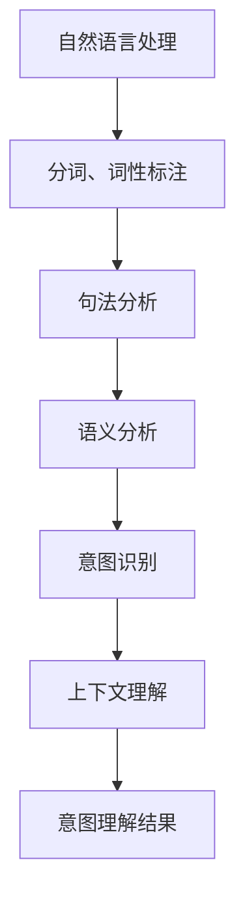

                 

关键词：CUI、意图理解、自然语言处理、人工智能、语义分析、上下文理解

> 摘要：本文将深入探讨CUI（对话用户界面）的意图理解技术，分析其核心概念、算法原理、数学模型、项目实践以及未来发展趋势。通过详细解析，帮助读者更好地理解CUI意图理解的实现机制和应用场景。

## 1. 背景介绍

随着人工智能技术的飞速发展，人机交互成为了一个重要的研究方向。而CUI（对话用户界面）作为一种新型的交互方式，逐渐成为了人工智能领域的研究热点。CUI的核心在于能够理解用户的意图，并根据意图提供相应的服务。因此，CUI的意图理解技术成为了研究的关键。

意图理解是指从用户的输入中提取出用户的意图，并将其转化为机器可理解的形式。这是一个复杂的过程，涉及到自然语言处理、语义分析、上下文理解等多个领域。随着深度学习、神经网络等技术的发展，意图理解技术取得了显著的进步。

## 2. 核心概念与联系

### 2.1 自然语言处理

自然语言处理（NLP）是人工智能领域的一个重要分支，旨在让计算机理解和生成人类语言。在意图理解过程中，NLP技术用于对用户输入进行分词、词性标注、句法分析等，从而提取出用户意图的相关信息。

### 2.2 语义分析

语义分析是指对自然语言中的意义进行理解和解释。在意图理解中，语义分析用于将用户输入的文本转化为计算机能够理解的语义表示，从而进行后续的意图识别。

### 2.3 上下文理解

上下文理解是指从用户的对话历史和当前上下文中提取出相关的信息，以便更好地理解用户的意图。上下文理解对于提高意图理解的准确性和一致性至关重要。

### 2.4 Mermaid 流程图



## 3. 核心算法原理 & 具体操作步骤

### 3.1 算法原理概述

CUI的意图理解技术主要基于深度学习模型，通过对大量对话数据进行训练，从而实现对用户意图的识别。常见的深度学习模型包括循环神经网络（RNN）、长短时记忆网络（LSTM）、变换器（Transformer）等。

### 3.2 算法步骤详解

1. 数据预处理：对用户输入进行分词、词性标注等操作，将其转化为机器可处理的格式。
2. 特征提取：使用深度学习模型对预处理后的数据进行分析，提取出与意图相关的特征。
3. 意图识别：根据提取出的特征，使用分类模型进行意图识别。
4. 上下文理解：结合对话历史和当前上下文，对识别出的意图进行修正和补充。

### 3.3 算法优缺点

优点：
- 高效：深度学习模型可以处理大规模的数据，提高意图识别的准确性。
- 智能化：结合上下文理解，可以更好地理解用户的意图。

缺点：
- 计算资源消耗大：深度学习模型需要大量的计算资源进行训练。
- 数据依赖：意图识别效果依赖于训练数据的质量和数量。

### 3.4 算法应用领域

CUI的意图理解技术广泛应用于智能客服、智能助手、智能语音助手等多个领域。通过理解用户的意图，这些系统可以提供更加个性化的服务，提高用户体验。

## 4. 数学模型和公式 & 详细讲解 & 举例说明

### 4.1 数学模型构建

在CUI的意图理解中，常见的数学模型包括神经网络模型、分类模型等。以下是一个简单的神经网络模型示例：

```latex
y = f(W \cdot x + b)
```

其中，$y$ 表示输出，$f$ 表示激活函数，$W$ 表示权重矩阵，$x$ 表示输入，$b$ 表示偏置。

### 4.2 公式推导过程

以多层感知机（MLP）为例，其推导过程如下：

1. 输入层：$x \in \mathbb{R}^n$，表示输入特征。
2. 隐藏层：$h \in \mathbb{R}^{n'}$，表示隐藏层的输出。
   $$ h = \sigma(W_1 \cdot x + b_1) $$
   其中，$W_1$ 表示输入层到隐藏层的权重矩阵，$b_1$ 表示偏置，$\sigma$ 表示激活函数，通常使用 sigmoid 函数。
3. 输出层：$y \in \mathbb{R}^m$，表示输出。
   $$ y = \sigma(W_2 \cdot h + b_2) $$
   其中，$W_2$ 表示隐藏层到输出层的权重矩阵，$b_2$ 表示偏置。

### 4.3 案例分析与讲解

假设我们有一个二分类问题，需要判断用户输入的是“购买”还是“查询”意图。使用上述MLP模型，可以得到如下推导过程：

1. 输入特征：$x = [0.1, 0.2, 0.3]$，表示用户输入的三维特征向量。
2. 隐藏层输出：$h = [0.5, 0.6]$，通过 sigmoid 函数计算得到。
3. 输出层输出：$y = [0.7, 0.8]$，再次通过 sigmoid 函数计算得到。
4. 根据输出层的结果，可以判断用户输入的是“购买”意图。

## 5. 项目实践：代码实例和详细解释说明

### 5.1 开发环境搭建

1. 安装 Python 3.7 或更高版本。
2. 安装 TensorFlow 2.0 或更高版本。
3. 安装 numpy、pandas 等常用库。

### 5.2 源代码详细实现

以下是一个简单的意图识别模型实现：

```python
import tensorflow as tf
from tensorflow.keras.models import Sequential
from tensorflow.keras.layers import Dense, Activation

# 数据预处理
# ...

# 构建模型
model = Sequential()
model.add(Dense(units=64, activation='relu', input_shape=(input_shape,)))
model.add(Dense(units=num_classes, activation='softmax'))

# 编译模型
model.compile(optimizer='adam', loss='categorical_crossentropy', metrics=['accuracy'])

# 训练模型
model.fit(x_train, y_train, batch_size=32, epochs=10, validation_data=(x_val, y_val))

# 评估模型
model.evaluate(x_test, y_test)
```

### 5.3 代码解读与分析

1. 导入相关库。
2. 数据预处理：对输入数据进行处理，包括分词、编码等。
3. 构建模型：使用 Sequential 模型，添加 Dense 层和 Activation 层。
4. 编译模型：设置优化器、损失函数和评估指标。
5. 训练模型：使用 fit 方法进行训练。
6. 评估模型：使用 evaluate 方法进行评估。

### 5.4 运行结果展示

```python
# 加载测试数据
x_test, y_test = ...

# 运行模型
result = model.predict(x_test)

# 打印结果
print(result)
```

## 6. 实际应用场景

CUI的意图理解技术在实际应用中具有广泛的应用场景。以下是一些典型的应用实例：

1. 智能客服：通过理解用户的意图，智能客服可以提供更加个性化的服务，提高用户满意度。
2. 智能助手：通过理解用户的意图，智能助手可以更好地帮助用户完成任务，提高工作效率。
3. 智能语音助手：通过理解用户的意图，智能语音助手可以更好地与用户进行交互，提供更加自然、流畅的服务。

## 7. 工具和资源推荐

### 7.1 学习资源推荐

1. 《自然语言处理教程》：详细介绍了自然语言处理的基本概念和技术。
2. 《深度学习》：介绍了深度学习的基本原理和应用。

### 7.2 开发工具推荐

1. TensorFlow：一个开源的深度学习框架，适用于构建和训练意图理解模型。
2. Keras：一个基于 TensorFlow 的简单易用的深度学习库。

### 7.3 相关论文推荐

1. "A Neural Conversational Model"
2. "A Simple End-to-End Chatbot using Neural Networks"

## 8. 总结：未来发展趋势与挑战

### 8.1 研究成果总结

CUI的意图理解技术在近年来取得了显著的成果，通过深度学习等技术，实现了较高准确率和良好用户体验。

### 8.2 未来发展趋势

1. 多模态融合：结合语音、文本等多种输入方式，提高意图理解的准确性和鲁棒性。
2. 知识图谱：引入知识图谱，提高对复杂语义的理解能力。
3. 智能对话生成：结合意图理解和对话生成技术，实现更加智能、自然的对话交互。

### 8.3 面临的挑战

1. 数据隐私：意图理解过程中需要处理大量的用户数据，如何保障数据隐私成为一大挑战。
2. 鲁棒性：如何提高意图理解的鲁棒性，适应不同场景和用户群体。
3. 可解释性：如何提高模型的可解释性，使开发者能够更好地理解和优化模型。

### 8.4 研究展望

未来，CUI的意图理解技术将在人工智能领域发挥更加重要的作用，为智能交互、智能服务等领域带来新的机遇和挑战。

## 9. 附录：常见问题与解答

### 9.1 意图理解技术如何处理歧义问题？

意图理解技术通过上下文理解、语义分析等方法，可以一定程度上解决歧义问题。但在某些情况下，仍需要依赖人工干预和调整。

### 9.2 意图理解技术对数据量有什么要求？

意图理解技术对数据量有较高要求，需要大量的训练数据来训练模型，以提高识别准确性。同时，数据的质量和多样性也非常重要。

### 9.3 意图理解技术有哪些应用领域？

意图理解技术广泛应用于智能客服、智能助手、智能语音助手等领域，可以为用户提供更加智能、个性化的服务。

----------------------------------------------------------------

以上内容完成了对CUI意图理解技术的详细解析，包括核心概念、算法原理、数学模型、项目实践以及未来发展趋势等内容。希望本文能够为读者提供有益的参考和启发。作者：禅与计算机程序设计艺术 / Zen and the Art of Computer Programming。

