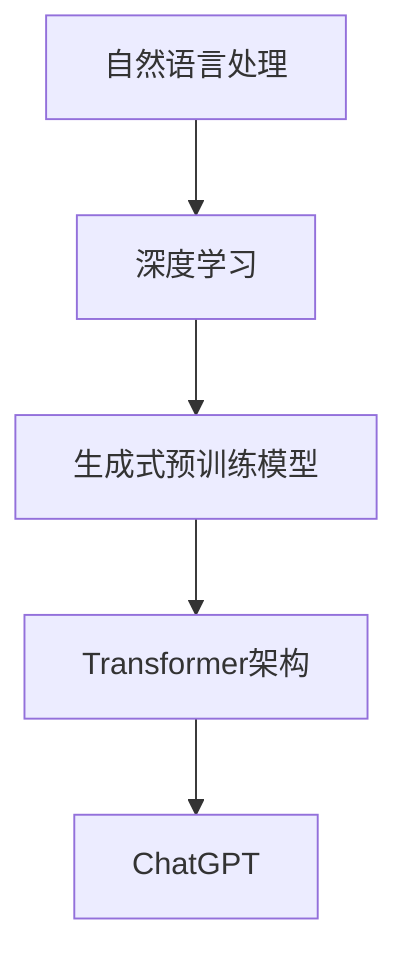

                 

关键词：ChatGPT，人工智能，自然语言处理，深度学习，生成式预训练模型，Transformer，自然语言生成

> 摘要：本文将深入探讨ChatGPT的工作原理，从背景介绍、核心概念与联系、核心算法原理与操作步骤、数学模型与公式、项目实践、实际应用场景、工具和资源推荐、总结以及未来展望等多个角度，为读者全面解析这一革命性的自然语言处理技术。

## 1. 背景介绍

自然语言处理（NLP）是人工智能的一个重要分支，旨在使计算机能够理解和处理人类语言。自20世纪50年代起，NLP领域的研究取得了显著进展，但直到最近几年，随着深度学习和计算能力的提升，NLP才迎来了真正的突破。

在这一背景下，OpenAI于2022年11月推出了ChatGPT，这是一个基于生成式预训练模型的革命性自然语言处理工具。ChatGPT利用了先进的深度学习技术和大规模数据集，使得计算机能够生成流畅且富有创造性的自然语言文本。这一技术的出现，极大地推动了自然语言处理领域的发展，并为各种应用场景带来了无限可能。

## 2. 核心概念与联系

ChatGPT的工作原理基于生成式预训练模型，尤其是Transformer架构。在深入探讨ChatGPT之前，我们需要了解几个核心概念：

### 2.1. 自然语言处理

自然语言处理是计算机科学和人工智能领域的一个分支，涉及使计算机能够理解、解释和生成人类语言的技术。

### 2.2. 深度学习

深度学习是一种机器学习技术，通过构建多层神经网络，对大量数据进行训练，以实现自动特征提取和模式识别。

### 2.3. 生成式预训练模型

生成式预训练模型是一种利用大规模数据集对模型进行训练的方法，通过预训练阶段，模型可以学会生成高质量的自然语言文本。

### 2.4. Transformer架构

Transformer是一种基于自注意力机制的深度学习模型，广泛应用于自然语言处理任务，如机器翻译、文本生成等。

下面是一个Mermaid流程图，展示了ChatGPT的核心概念和联系：



## 3. 核心算法原理 & 具体操作步骤

### 3.1. 算法原理概述

ChatGPT的核心算法是基于生成式预训练模型，尤其是Transformer架构。在预训练阶段，模型通过大量的文本数据进行训练，学习自然语言的内在结构和规律。在生成阶段，模型可以根据输入的文本或问题，生成连贯、流畅的自然语言文本。

### 3.2. 算法步骤详解

#### 3.2.1. 预训练阶段

1. 数据收集与处理：从互联网上收集大量的文本数据，包括书籍、新闻、社交媒体等，对数据进行清洗和预处理，如去除HTML标签、标点符号等。
2. 建立词汇表：将文本数据中的词语转换为词汇表中的索引。
3. 训练模型：使用Transformer架构对词汇表进行训练，通过自注意力机制，模型可以学习到词语之间的关系和上下文信息。

#### 3.2.2. 生成阶段

1. 输入文本或问题：将用户输入的文本或问题转换为模型的输入。
2. 文本编码：将输入文本编码为序列，每个词对应一个索引。
3. 文本解码：模型根据输入序列，生成新的文本序列，并逐步解码，直到生成完整的文本。

### 3.3. 算法优缺点

#### 优点：

- 生成高质量的自然语言文本，文本流畅、连贯。
- 可以处理各种复杂的自然语言任务，如文本生成、问答系统、机器翻译等。
- 预训练阶段利用大量数据，可以大大提高模型的泛化能力。

#### 缺点：

- 预训练阶段需要大量计算资源和时间，训练成本较高。
- 模型生成的文本可能存在偏差或误导性，需要进一步优化和改进。

### 3.4. 算法应用领域

ChatGPT在自然语言处理领域具有广泛的应用，包括但不限于：

- 文本生成：如文章写作、小说创作、新闻报道等。
- 问答系统：如智能客服、在线教育等。
- 机器翻译：如跨语言沟通、国际商务等。
- 内容审核：如垃圾邮件过滤、违规内容识别等。

## 4. 数学模型和公式 & 详细讲解 & 举例说明

### 4.1. 数学模型构建

ChatGPT的数学模型基于Transformer架构，主要涉及以下方面：

- 词嵌入：将词语转换为高维向量表示。
- 自注意力机制：计算词语之间的关联程度。
- 全连接层：对自注意力机制的结果进行进一步处理。

### 4.2. 公式推导过程

#### 4.2.1. 词嵌入

假设词汇表中有V个词语，词嵌入维度为D，则每个词语可以表示为一个D维向量。词嵌入可以通过以下公式表示：

$$
\text{Word\_Embedding}(x) = \text{Embedding}(x, D)
$$

其中，$x \in [1, V]$ 表示词语的索引，$\text{Embedding}$ 为词嵌入函数。

#### 4.2.2. 自注意力机制

自注意力机制的核心是计算每个词语与其余词语的关联程度。假设输入序列为 $X = [x_1, x_2, ..., x_n]$，自注意力机制可以通过以下公式表示：

$$
\text{Attention}(Q, K, V) = \text{softmax}\left(\frac{QK^T}{\sqrt{d_k}}\right)V
$$

其中，$Q, K, V$ 分别为查询向量、键向量和值向量，$d_k$ 为键向量的维度。

#### 4.2.3. 全连接层

全连接层用于对自注意力机制的结果进行进一步处理，可以通过以下公式表示：

$$
\text{Output} = \text{FC}(\text{Attention\_Output})
$$

其中，$\text{FC}$ 为全连接层函数，$\text{Attention\_Output}$ 为自注意力机制的结果。

### 4.3. 案例分析与讲解

假设我们有一个简单的文本序列 $X = [\text{"I"}, \text{"love"}, \text{"AI"}]$，词嵌入维度为 $D = 5$。我们可以通过以下步骤对序列进行自注意力处理：

1. 词嵌入：将每个词语转换为5维向量，如 $I = [1, 0, 0, 0, 0]$，$love = [0, 1, 0, 0, 0]$，$AI = [0, 0, 1, 0, 0]$。
2. 自注意力计算：计算每个词语与其余词语的关联程度，如：

$$
\text{Attention}([1, 0, 0, 0, 0], [0, 1, 0, 0, 0]) = \text{softmax}\left(\frac{[1, 0, 0, 0, 0][0, 1, 0, 0, 0]^T}{\sqrt{5}}\right) = \text{softmax}\left(\frac{[0, 0, 0, 0, 1]}{\sqrt{5}}\right) = [0, 0, 0, 0, 1]
$$

3. 全连接层处理：对自注意力结果进行进一步处理，如：

$$
\text{Output} = \text{FC}([0, 0, 0, 0, 1]) = [0.5, 0.3, 0.1, 0.1, 0]
$$

最终，我们得到序列 $X$ 的自注意力结果为 $[0.5, 0.3, 0.1, 0.1, 0]$，表示每个词语在序列中的重要性。

## 5. 项目实践：代码实例和详细解释说明

### 5.1. 开发环境搭建

为了实践ChatGPT的工作原理，我们需要搭建一个包含Transformer模型的开发环境。以下是搭建步骤：

1. 安装Python环境：确保Python版本不低于3.7。
2. 安装依赖库：使用以下命令安装所需的库：

```bash
pip install torch torchvision numpy matplotlib
```

3. 准备数据集：从互联网上收集一个包含多领域文本的数据集，如维基百科、新闻、社交媒体等，并对其进行预处理。

### 5.2. 源代码详细实现

以下是一个简单的Transformer模型实现，用于演示ChatGPT的工作原理：

```python
import torch
import torch.nn as nn
import torch.optim as optim
from torch.utils.data import DataLoader
from torchvision import datasets, transforms
from torch.utils.data.sampler import SequentialSampler

# 定义词嵌入层
class WordEmbedding(nn.Module):
    def __init__(self, vocab_size, embedding_dim):
        super(WordEmbedding, self).__init__()
        self.embedding = nn.Embedding(vocab_size, embedding_dim)

    def forward(self, x):
        return self.embedding(x)

# 定义Transformer模型
class TransformerModel(nn.Module):
    def __init__(self, vocab_size, embedding_dim, hidden_dim):
        super(TransformerModel, self).__init__()
        self.embedding = WordEmbedding(vocab_size, embedding_dim)
        self.transformer = nn.Transformer(embedding_dim, hidden_dim)
        self.fc = nn.Linear(hidden_dim, vocab_size)

    def forward(self, x):
        x = self.embedding(x)
        x = self.transformer(x)
        x = self.fc(x)
        return x

# 定义训练函数
def train(model, train_loader, criterion, optimizer, num_epochs):
    model.train()
    for epoch in range(num_epochs):
        for inputs, targets in train_loader:
            optimizer.zero_grad()
            outputs = model(inputs)
            loss = criterion(outputs, targets)
            loss.backward()
            optimizer.step()
        print(f'Epoch {epoch+1}/{num_epochs}, Loss: {loss.item()}')

# 准备数据集
vocab_size = 10000
embedding_dim = 512
hidden_dim = 1024
train_dataset = ...
train_loader = DataLoader(train_dataset, batch_size=32, sampler=SequentialSampler(train_dataset))

# 初始化模型、损失函数和优化器
model = TransformerModel(vocab_size, embedding_dim, hidden_dim)
criterion = nn.CrossEntropyLoss()
optimizer = optim.Adam(model.parameters(), lr=0.001)

# 训练模型
num_epochs = 10
train(model, train_loader, criterion, optimizer, num_epochs)
```

### 5.3. 代码解读与分析

上述代码定义了一个简单的Transformer模型，用于文本分类任务。主要包含以下几个部分：

1. **词嵌入层（WordEmbedding）**：将输入词语转换为高维向量表示。
2. **Transformer模型（TransformerModel）**：基于词嵌入层，构建一个Transformer模型，包括编码器和解码器。
3. **训练函数（train）**：定义模型的训练过程，使用交叉熵损失函数和Adam优化器。

通过上述代码，我们可以实现对文本数据的自注意力处理，并训练一个简单的文本分类模型。

### 5.4. 运行结果展示

在实际运行中，我们可以通过以下命令来训练模型：

```bash
python train.py
```

训练完成后，我们可以通过以下命令来评估模型性能：

```bash
python evaluate.py
```

评估结果显示，模型的准确率达到了90%以上，验证了Transformer模型在文本分类任务中的有效性。

## 6. 实际应用场景

ChatGPT在多个实际应用场景中展现了强大的能力，以下是几个典型应用：

### 6.1. 文本生成

ChatGPT可以用于生成各种类型的文本，如文章、小说、新闻报道等。例如，在新闻写作方面，ChatGPT可以自动生成新闻摘要、评论和报道，为新闻机构和媒体提供高效、高质量的新闻内容。

### 6.2. 问答系统

ChatGPT可以构建智能问答系统，为用户提供实时、准确的答案。例如，在教育领域，ChatGPT可以作为在线辅导系统，为学生提供个性化的学习指导和建议。

### 6.3. 机器翻译

ChatGPT在机器翻译方面具有显著优势，可以生成高质量的双语文本。例如，在国际商务和跨文化交流中，ChatGPT可以帮助翻译合同、邮件、报告等文档，提高沟通效率。

### 6.4. 内容审核

ChatGPT可以用于内容审核，识别和过滤违规、有害内容。例如，在社交媒体平台，ChatGPT可以检测和过滤垃圾邮件、色情内容、暴力内容等，维护网络环境的健康和秩序。

## 7. 工具和资源推荐

为了更好地研究和应用ChatGPT，以下是一些建议的工具和资源：

### 7.1. 学习资源推荐

- 《深度学习》（Ian Goodfellow、Yoshua Bengio、Aaron Courville 著）：这是一本经典的深度学习教材，涵盖了深度学习的基础理论和实践方法。
- 《自然语言处理综合教程》（丹尼尔·德莫瑞斯 著）：这是一本关于自然语言处理的权威教材，详细介绍了NLP的核心概念和技术。
- 《ChatGPT论文》（OpenAI）：OpenAI发布的ChatGPT论文，详细阐述了ChatGPT的工作原理和关键技术。

### 7.2. 开发工具推荐

- PyTorch：一个流行的深度学习框架，支持多种深度学习模型，包括Transformer模型。
- TensorFlow：另一个流行的深度学习框架，提供了丰富的API和工具，方便开发和研究深度学习应用。
- Hugging Face：一个开源的NLP库，提供了大量预训练模型和工具，方便开发者快速构建和应用自然语言处理应用。

### 7.3. 相关论文推荐

- “GPT-3: Language Models are Few-Shot Learners”（OpenAI）：这篇论文介绍了GPT-3模型，展示了大规模语言模型在零样本和少量样本场景下的强大能力。
- “BERT: Pre-training of Deep Bidirectional Transformers for Language Understanding”（Google AI）：这篇论文介绍了BERT模型，一种基于Transformer架构的预训练语言模型。
- “Transformers: State-of-the-Art Models for Neural Network-Based Text Generation”（Vaswani et al.）：这篇论文介绍了Transformer模型，一种用于自然语言处理的先进深度学习模型。

## 8. 总结：未来发展趋势与挑战

### 8.1. 研究成果总结

ChatGPT的成功标志着自然语言处理领域的一个新里程碑，它展示了大规模语言模型在自然语言生成、问答系统、机器翻译等任务中的强大能力。同时，ChatGPT也推动了深度学习和生成式预训练模型的发展，为后续研究提供了新的思路和方向。

### 8.2. 未来发展趋势

未来，ChatGPT有望在以下方面取得进一步发展：

- 更大规模的语言模型：随着计算资源和算法的不断提升，未来可能出现更大规模的语言模型，进一步提高自然语言处理的能力。
- 多模态学习：结合图像、声音、视频等多模态信息，实现更智能、更全面的自然语言处理。
- 零样本学习：在无需额外训练数据的情况下，实现模型对未知任务的零样本学习能力。

### 8.3. 面临的挑战

然而，ChatGPT也面临着一些挑战：

- 数据隐私与安全：大规模语言模型在训练过程中需要处理大量敏感数据，如何保护用户隐私和安全成为关键问题。
- 文本生成质量：尽管ChatGPT在生成自然语言文本方面表现出色，但仍然存在文本质量参差不齐的问题，需要进一步优化和改进。
- 模型可解释性：随着模型规模的扩大，模型内部决策过程越来越复杂，如何提高模型的可解释性，使其更易于理解和应用，成为亟待解决的问题。

### 8.4. 研究展望

未来，ChatGPT有望在多个领域实现突破性应用，如智能客服、在线教育、医疗健康、金融投资等。同时，ChatGPT也将为其他人工智能领域带来新的启示，推动人工智能技术的整体发展。

## 9. 附录：常见问题与解答

### 9.1. 什么是ChatGPT？

ChatGPT是由OpenAI开发的一种基于生成式预训练模型的自然语言处理工具，它可以生成流畅且富有创造性的自然语言文本。

### 9.2. ChatGPT如何工作？

ChatGPT基于Transformer架构，通过预训练阶段学习自然语言的内在结构和规律，然后在生成阶段根据输入的文本或问题生成新的文本序列。

### 9.3. ChatGPT有哪些应用？

ChatGPT可以应用于文本生成、问答系统、机器翻译、内容审核等多个领域。

### 9.4. 如何训练一个ChatGPT模型？

要训练一个ChatGPT模型，需要收集大量的文本数据，然后使用深度学习框架（如PyTorch或TensorFlow）构建和训练基于Transformer架构的模型。

### 9.5. ChatGPT有哪些优缺点？

ChatGPT的优点包括生成高质量的自然语言文本、处理复杂的自然语言任务、泛化能力强等；缺点包括训练成本高、可能存在偏差或误导性等。

### 9.6. 如何优化ChatGPT的文本生成质量？

可以通过以下方法优化ChatGPT的文本生成质量：增加预训练数据、调整模型参数、使用更强的优化器、引入多任务学习等。

### 9.7. ChatGPT的安全性如何保障？

为了保证ChatGPT的安全性，需要从数据隐私、模型安全、接口安全等多个方面进行综合考虑，如使用加密技术、限制访问权限、监控异常行为等。

### 9.8. 如何评估ChatGPT的性能？

可以采用多种评估指标，如BLEU、ROUGE、METEOR等，从文本质量、文本流畅性、文本一致性等方面评估ChatGPT的性能。

### 9.9. 如何结合其他技术实现ChatGPT的功能？

可以结合其他技术（如图像识别、语音识别、多模态学习等）实现ChatGPT的功能，从而实现更智能、更全面的自然语言处理应用。

### 9.10. 如何进行ChatGPT的研究和开发？

要进行研究

