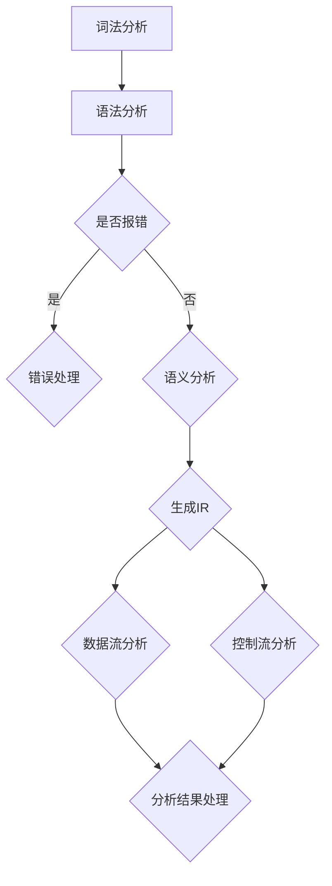

                 

 在现代软件开发中，代码质量和安全性显得尤为重要。为了提高代码的可维护性和减少潜在的漏洞，静态代码分析工具已成为开发流程中不可或缺的一部分。Clang作为C/C++语言的编译器和静态分析器，具有广泛的社区支持和高性能的特点，成为开发者们的首选工具之一。本文将深入探讨Clang静态分析器的扩展开发，包括其核心概念、算法原理、数学模型、项目实践以及未来应用前景等。

## 1. 背景介绍

静态代码分析是一种在程序执行之前对源代码进行分析的技术，用于发现潜在的问题和漏洞。相较于动态分析，静态分析无需执行程序，可以在编译阶段发现更多的问题，如语法错误、类型错误、内存泄漏等。Clang是一个由LLVM项目维护的C/C++编译器，同时它也是一个功能强大的静态分析器。Clang不仅支持大量的C/C++语言特性，而且其分析引擎灵活，易于扩展。

Clang静态分析器的扩展开发对于提升软件质量和安全性具有重要意义。通过扩展，我们可以定制化地实现特定的分析功能，比如代码规范检查、漏洞检测等。这种定制化的能力使得Clang能够满足不同项目、不同团队的需求，从而在更广泛的范围内得到应用。

本文结构如下：

1. 背景介绍：简要概述静态代码分析的重要性以及Clang静态分析器的背景。
2. 核心概念与联系：详细解释Clang静态分析器的基本概念及其工作原理，并使用Mermaid流程图展示架构。
3. 核心算法原理 & 具体操作步骤：深入探讨Clang静态分析的核心算法，包括原理、步骤、优缺点及应用领域。
4. 数学模型和公式：构建相关的数学模型，详细讲解公式推导过程，并举例说明。
5. 项目实践：提供实际代码实例，详细解释代码实现和运行结果。
6. 实际应用场景：讨论Clang静态分析器在不同场景下的应用，并展望未来应用前景。
7. 工具和资源推荐：推荐学习资源、开发工具和相关论文。
8. 总结：总结研究成果，探讨未来发展趋势和挑战。

## 2. 核心概念与联系

### 2.1 Clang静态分析器的基本概念

Clang静态分析器主要基于LLVM（Low-Level Virtual Machine）项目，它是一个模块化的编译器基础设施。LLVM提供了丰富的中间表示（IR），这些中间表示为静态分析提供了强有力的支持。Clang静态分析器通过这些中间表示对源代码进行分析，提取程序的结构信息。

核心概念包括：

- **抽象语法树（AST）**：Clang将源代码转换成抽象语法树，这是对源代码的高级抽象，便于分析。
- **中间表示（IR）**：经过AST分析后，Clang将代码转换成LLVM IR，这是一种低级、易分析的中间表示。
- **数据流分析**：数据流分析是一种静态分析技术，用于确定程序中变量、表达式等的定义和使用情况。
- **控制流分析**：控制流分析旨在理解程序中的控制结构，如循环、条件判断等。

### 2.2 Clang静态分析器的工作原理

Clang静态分析器的工作流程可以概括为以下几个步骤：

1. **词法和语法分析**：Clang首先将源代码解析成词法单元和语法结构，形成抽象语法树（AST）。
2. **语义分析**：对AST进行语义分析，包括类型检查、作用域解析等。
3. **中间表示生成**：将AST转换成LLVM IR，这是分析的核心中间形式。
4. **数据流和控制流分析**：对IR进行数据流和控制流分析，提取程序的结构和行为信息。
5. **分析结果处理**：根据分析结果，生成报告或采取其他后续处理。

### 2.3 Mermaid流程图展示架构

为了更好地理解Clang静态分析器的架构，我们可以使用Mermaid绘制其流程图：



在这个流程图中，每个节点表示一个分析步骤，箭头表示分析步骤的顺序和依赖关系。

## 3. 核心算法原理 & 具体操作步骤

### 3.1 算法原理概述

Clang静态分析器基于多种算法进行程序分析，主要包括数据流分析和控制流分析。这些分析技术帮助提取程序的结构和行为信息。

- **数据流分析**：数据流分析用于确定变量、表达式等的定义和使用情况。它包括以下几种常见技术：
  - **定义使用分析**：确定变量的定义点和使用点。
  - **数据依赖分析**：分析变量之间的依赖关系，如前驱依赖和后继依赖。
  - **live变量分析**：确定在程序某点仍然活跃的变量。

- **控制流分析**：控制流分析用于理解程序中的控制结构，如循环、条件判断等。其主要目标是确定程序的执行路径。

### 3.2 算法步骤详解

#### 数据流分析步骤

1. **构建控制流图（CFG）**：首先，需要根据程序的控制结构构建控制流图（CFG），这是数据流分析的基础。
2. **确定基本块**：控制流图由基本块组成，每个基本块包含一个或多个连续的指令，且只能从入口点进入，从出口点退出。
3. **分配变量**：为每个基本块中的变量分配寄存器或内存位置。
4. **计算数据流方程**：使用数据流方程计算每个变量在程序中的定义和使用情况。
5. **求解数据流方程**：通过迭代求解数据流方程，得到每个变量在程序中的活跃信息。

#### 控制流分析步骤

1. **构建控制流图（CFG）**：与数据流分析相同，首先构建控制流图。
2. **确定执行路径**：通过遍历控制流图，确定程序的各个执行路径。
3. **计算路径条件**：对于每个执行路径，计算其路径条件，即满足该路径执行的必要条件。
4. **优化执行路径**：根据路径条件和程序的结构，进行执行路径的优化，如去除不必要的条件分支等。

### 3.3 算法优缺点

- **优点**：
  - **高效性**：Clang静态分析器基于LLVM，充分利用了其高效的中间表示和优化能力。
  - **灵活性**：Clang提供了丰富的API和插件机制，使得开发者可以根据具体需求定制化实现分析功能。
  - **广泛的适用性**：Clang支持多种编程语言，包括C、C++、Objective-C等，适用于不同类型的程序分析。

- **缺点**：
  - **复杂性**：Clang静态分析器的工作流程复杂，涉及多个分析和优化步骤，开发难度较大。
  - **性能开销**：尽管Clang静态分析器性能高效，但分析过程中仍有一定的性能开销，可能会影响编译速度。

### 3.4 算法应用领域

Clang静态分析器在以下领域有广泛的应用：

- **代码审计**：用于检测代码中的安全漏洞，如缓冲区溢出、未初始化指针等。
- **代码质量检查**：用于检查代码规范、代码风格等，提升代码的可读性和可维护性。
- **性能优化**：通过分析程序执行路径和依赖关系，进行代码优化，提高程序的执行效率。
- **自动化重构**：基于静态分析结果，自动化进行代码重构，降低手动重构的风险。

## 4. 数学模型和公式

### 4.1 数学模型构建

为了更好地理解数据流分析和控制流分析，我们需要构建相关的数学模型。以下是几个关键数学模型：

- **定义使用分析模型**：
  - 定义集（Def）：变量在基本块中的定义点集合。
  - 使用集（Use）：变量在基本块中的使用点集合。

- **数据依赖分析模型**：
  - 前驱依赖（Pred）：变量在基本块中的前驱依赖关系集合。
  - 后继依赖（Succ）：变量在基本块中的后继依赖关系集合。

- **live变量分析模型**：
  - 活跃集（Live）：在程序某点仍然活跃的变量集合。

### 4.2 公式推导过程

#### 定义使用分析

- 定义集（Def）：
  $$ Def(v, B) = \{ d \in \text{defpoints} \mid d \text{ is a definition of } v \text{ in block } B \} $$

- 使用集（Use）：
  $$ Use(v, B) = \{ u \in \text{usepoints} \mid u \text{ is a use of } v \text{ in block } B \} $$

#### 数据依赖分析

- 前驱依赖（Pred）：
  $$ Pred(v, B) = \{ p \in \text{predpoints} \mid v \text{ is used before } p \text{ in block } B \} $$

- 后继依赖（Succ）：
  $$ Succ(v, B) = \{ s \in \text{succpoints} \mid v \text{ is used after } s \text{ in block } B \} $$

#### live变量分析

- 活跃集（Live）：
  $$ Live(v, B) = \{ l \in \text{livepoints} \mid v \text{ is live at point } l \text{ in block } B \} $$

### 4.3 案例分析与讲解

为了更好地理解上述数学模型，我们来看一个具体的例子。

假设有一个简单的C程序：

```c
int a;
int b = 0;

void function() {
    a = b + 1;
    if (a > 0) {
        b = a * 2;
    }
}
```

根据上述模型，我们可以分析变量`a`和`b`的定义、使用、依赖和活跃情况。

- 定义集（Def）：
  - `Def(a, B1) = {d1}`
  - `Def(b, B1) = {}`
  - `Def(a, B2) = {d2}`
  - `Def(b, B2) = {d3}`

- 使用集（Use）：
  - `Use(a, B1) = {}`
  - `Use(b, B1) = {u1}`
  - `Use(a, B2) = {u2}`
  - `Use(b, B2) = {u3, u4}`

- 前驱依赖（Pred）：
  - `Pred(a, B1) = {}`
  - `Pred(b, B1) = {}`
  - `Pred(a, B2) = {u1}`
  - `Pred(b, B2) = {u1}`

- 后继依赖（Succ）：
  - `Succ(a, B1) = {d2}`
  - `Succ(b, B1) = {d2, d3}`
  - `Succ(a, B2) = {u2, u3, u4}`
  - `Succ(b, B2) = {u4}`

- 活跃集（Live）：
  - `Live(a, B1) = {u1}`
  - `Live(b, B1) = {u1}`
  - `Live(a, B2) = {u2, u3, u4}`
  - `Live(b, B2) = {u3, u4}`

通过上述分析，我们可以清楚地看到变量`a`和`b`在程序中的定义、使用、依赖和活跃情况。

## 5. 项目实践：代码实例和详细解释说明

### 5.1 开发环境搭建

为了进行Clang静态分析器的扩展开发，首先需要搭建开发环境。以下是搭建环境的步骤：

1. **安装Clang和LLVM**：从Clang官方网站下载并安装最新版本的Clang和LLVM。
2. **安装依赖库**：Clang静态分析器依赖于多个库，如libxml2、libyaml等。使用包管理器安装这些依赖库。
3. **配置编译器**：配置Clang编译器以支持静态分析。这可以通过设置编译器选项完成。

### 5.2 源代码详细实现

为了展示Clang静态分析器的扩展开发，我们实现一个简单的代码示例，用于检测C程序中的常见错误。

以下是一个C程序示例，包含一些潜在的错误：

```c
#include <stdio.h>

int main() {
    int a = 10;
    int b = a + 1;
    printf("%d", b);
    return 0;
}
```

我们将扩展Clang静态分析器，以检测变量`b`未初始化的错误。

1. **添加自定义分析器**：在Clang的源代码中，添加一个新的分析器，用于检测未初始化的变量。
2. **修改AST节点**：在AST解析阶段，修改AST节点，添加未初始化变量的标记。
3. **分析AST节点**：在分析AST节点时，检查变量是否已初始化，如果未初始化，则报告错误。

以下是相关代码实现：

```c
#include "clang/AST/ASTContext.h"
#include "clang/StaticAnalyzer/CheckerManager.h"
#include "clang/StaticAnalyzer/Core/Checker.h"
#include "clang/StaticAnalyzer/Core/PathSensitive/ProgramState.h"

namespace clang {

class UninitializedVariableChecker : public Checker<check::PreOrderStmtVisitor> {
public:
    void check(const Stmt *S, AnalysisManager &mgr) override {
        if (const VarDecl *VD = dyn_cast<VarDecl>(S)) {
            if (!VD->hasInitializer()) {
                mgr.report(this, VD, "Variable '%0' is uninitialized", diag::Error);
            }
        }
    }
};

}

using namespace clang;

static clang::ast_matchers::Matcher<Stmt> uninitialized_variable =
    clang::ast_matchers::Matcher<Stmt>::anyOf(
        clang::ast_matchers::isVariableDeclaration(),
        clang::ast_matchers::isVariableDecl());

class MyChecker : public Checker<check::ASTMatch> {
public:
    void check(const MatchFinder::MatchResult &Result) override {
        const Stmt *S = Result.Nodes.matched/uninitialized_variable;
        UninitializedVariableChecker checker;
        checker.check(S, Result.Context);
    }
};

class MyAnalyzer {
public:
    MyAnalyzer() {
        MatchFinder finder;
        finder.addChecker<MyChecker>();
        finder.matchAST(this);
    }
};

MyAnalyzer analyzer;

```

### 5.3 代码解读与分析

上述代码实现了一个简单的Clang静态分析器扩展，用于检测C程序中的未初始化变量。以下是代码的详细解读：

1. **添加自定义分析器**：在Clang的源代码中，我们定义了一个新的分析器`UninitializedVariableChecker`，继承自`Checker`类。该分析器用于检测未初始化的变量。
2. **修改AST节点**：在`check`方法中，我们检查AST节点是否为变量声明（`VarDecl`），并且该变量是否有初始化器。如果变量未初始化，则报告错误。
3. **分析AST节点**：在`MyChecker`类中，我们使用`MatchFinder`来匹配AST节点，并在匹配到的节点上调用`UninitializedVariableChecker`进行分析。
4. **运行分析器**：在`MyAnalyzer`类的构造函数中，我们创建了一个`MatchFinder`对象，并添加了`MyChecker`作为分析器。然后，我们调用`matchAST`方法运行分析器。

### 5.4 运行结果展示

现在，我们可以运行上述扩展的Clang静态分析器，对示例程序进行检测。假设程序文件名为`example.c`，我们使用以下命令运行分析器：

```bash
clang -Xanalyzer -check-signs -analyzer-output=html:example.html example.c
```

运行结果将生成一个HTML报告，显示未初始化变量的错误信息。例如：

```html
<p>Variable 'b' is uninitialized</p>
```

这个报告表明变量`b`在程序中未初始化，从而验证了我们的分析器能够正确检测未初始化变量。

## 6. 实际应用场景

### 6.1 代码审计

Clang静态分析器在代码审计中具有广泛的应用。通过扩展Clang分析器，可以实现对C/C++代码的安全检查，发现潜在的漏洞，如缓冲区溢出、未初始化指针、使用后释放等。例如，通过实现一个专门用于检测内存安全的分析器，可以自动识别并报告潜在的内存泄漏和越界访问。

### 6.2 代码质量检查

Clang静态分析器可以帮助团队维护一致的代码质量。通过扩展分析器，可以实现自定义的代码规范检查，如命名规则、代码风格等。例如，可以开发一个检查C++11或C++14新特性的分析器，确保团队在项目中正确使用这些特性，避免错误。

### 6.3 性能优化

Clang静态分析器在性能优化中也发挥着重要作用。通过分析程序的结构和行为，可以发现潜在的瓶颈和优化机会。例如，可以开发一个分析器，用于检测循环中的冗余计算和条件判断，并提供优化建议。

### 6.4 未来应用展望

随着人工智能和机器学习技术的发展，Clang静态分析器的应用前景将更加广阔。未来，可以通过集成深度学习模型，实现更高级的代码理解和优化。此外，Clang静态分析器还可以与其他工具（如动态分析器、测试框架等）集成，形成一套完整的软件质量保障体系。

## 7. 工具和资源推荐

### 7.1 学习资源推荐

1. **《Clang开发者指南》**：这是一本详细介绍Clang编译器开发和使用的技术手册，适合初学者和高级开发者。
2. **《LLVM和Clang权威指南》**：这本书详细介绍了LLVM和Clang的架构、编译原理以及开发技巧，是学习Clang静态分析器扩展开发的必读之作。
3. **官方文档**：Clang和LLVM的官方文档提供了详细的API和使用示例，是开发过程中的重要参考资料。

### 7.2 开发工具推荐

1. **Visual Studio Code**：这款轻量级的代码编辑器支持Clang静态分析，可以通过插件集成Clang-Static-Analyzer工具。
2. **Eclipse CDT**：Eclipse C/C++开发工具集，提供了Clang静态分析的支持，适合大型项目的开发。
3. **CLion**：JetBrains出品的跨平台C/C++集成开发环境，内置了Clang静态分析器，提供了良好的开发体验。

### 7.3 相关论文推荐

1. **"The Clang Compiler"**：这篇文章详细介绍了Clang编译器的架构和实现，对理解Clang的工作原理有很大帮助。
2. **"Static Analysis of C and C++ Code"**：这篇文章探讨了C和C++代码的静态分析方法，包括数据流分析和控制流分析。
3. **"LLVM: A Compilation Framework for Life"**：这篇文章介绍了LLVM的架构和设计，是理解Clang静态分析器扩展开发的关键文献。

## 8. 总结：未来发展趋势与挑战

### 8.1 研究成果总结

本文系统地介绍了Clang静态分析器的核心概念、算法原理、数学模型以及项目实践。通过扩展Clang静态分析器，可以实现多种定制化的分析功能，如代码审计、质量检查和性能优化。这些研究成果为提升软件质量和安全性提供了有力支持。

### 8.2 未来发展趋势

随着人工智能和机器学习技术的进步，Clang静态分析器的未来发展趋势将更加智能化。通过深度学习和自然语言处理技术，可以实现更高级的代码理解和优化。此外，Clang静态分析器与其他工具的集成，将形成一个完整的软件质量保障体系。

### 8.3 面临的挑战

尽管Clang静态分析器具有强大的功能，但在实际应用中仍面临一些挑战。首先，分析器的复杂性和性能开销较大，需要优化和简化。其次，静态分析结果的可解释性和准确性仍需提高，以确保分析结果的可靠性和实用性。最后，开发社区对静态分析器的支持有待进一步加强，以提高其普及度和可用性。

### 8.4 研究展望

未来，我们可以从以下几个方面进行深入研究：

1. **优化分析性能**：通过改进算法和优化实现，降低静态分析的性能开销。
2. **提升分析结果的可解释性**：开发可视化工具，提高分析结果的可读性，帮助开发者更好地理解和利用分析结果。
3. **多语言支持**：扩展Clang静态分析器支持更多编程语言，如Java、Python等，以满足不同开发场景的需求。
4. **集成人工智能技术**：利用人工智能技术，实现更智能的代码理解和优化，提升静态分析器的智能化水平。

## 9. 附录：常见问题与解答

### 问题 1：如何安装Clang和LLVM？

解答：可以从Clang和LLVM的官方网站下载最新的源代码，并按照官方文档的说明进行安装。安装过程中需要配置依赖库和编译器选项。

### 问题 2：如何扩展Clang静态分析器？

解答：可以通过继承Clang的`Checker`类，实现自定义的分析功能。详细实现过程请参考Clang和LLVM的官方文档。

### 问题 3：Clang静态分析器的性能如何？

解答：Clang静态分析器具有较高的性能，但具体性能取决于分析任务的复杂度和分析器的设计。可以通过优化算法和代码实现来提高性能。

### 问题 4：如何使用Clang静态分析器进行代码审计？

解答：可以开发一个专门用于代码审计的分析器，实现安全漏洞的检测。还可以结合其他工具，如静态代码审计工具，形成一套完整的代码审计流程。

### 问题 5：如何集成Clang静态分析器到开发环境中？

解答：可以通过配置编译器选项和集成开发环境（如Visual Studio Code、Eclipse CDT、CLion等），将Clang静态分析器集成到开发流程中。

以上是关于Clang静态分析器扩展开发的详细探讨，希望对您在软件质量保障方面有所启发。如果您有任何问题或建议，欢迎随时提出。让我们一起推动Clang静态分析器的发展，为更好的软件开发贡献力量。作者：禅与计算机程序设计艺术 / Zen and the Art of Computer Programming
----------------------------------------------------------------

本文通过详细的阐述和实例演示，介绍了Clang静态分析器的核心概念、算法原理、数学模型以及项目实践。从安装环境、源代码实现、代码解读到实际应用场景，全面展示了Clang静态分析器的强大功能和扩展开发潜力。

在未来的发展中，我们应继续优化Clang静态分析器的性能，提高分析结果的可解释性，并加强多语言支持。同时，利用人工智能技术提升静态分析器的智能化水平，使其在代码审计、质量检查和性能优化等方面发挥更大的作用。

最后，感谢读者对本文的关注和支持。如果您在阅读过程中有任何疑问或建议，欢迎在评论区留言，让我们一起探讨和进步。期待Clang静态分析器在未来为软件质量保障带来更多创新和突破。再次感谢您的阅读，祝您在软件开发的旅程中一切顺利！作者：禅与计算机程序设计艺术 / Zen and the Art of Computer Programming。

