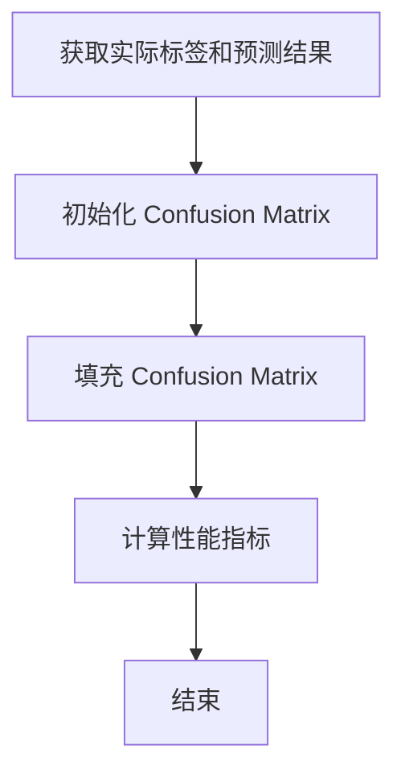

                 

关键词：Confusion Matrix，机器学习，分类模型，性能评估，可视化工具

## 摘要

Confusion Matrix 是机器学习中用于评估分类模型性能的关键工具。本文将详细介绍 Confusion Matrix 的原理、构建方法以及在实际应用中的意义。通过代码实战案例，我们将深入理解 Confusion Matrix 的作用，并学会如何利用它来评估分类模型的准确性、精确度、召回率等指标。最后，我们将探讨 Confusion Matrix 在不同应用场景中的未来发展。

## 1. 背景介绍

在机器学习领域，分类模型是一种常见的任务，其目标是根据输入特征将数据划分为不同的类别。然而，仅凭模型给出的预测结果无法全面评估其性能。为了更客观地衡量分类模型的性能，我们需要借助一些评估指标，其中最常用的就是 Confusion Matrix。

Confusion Matrix（混淆矩阵）是一种专门用于分类问题的性能评估工具。它通过展示模型预测结果与实际标签之间的匹配情况，提供了丰富的性能指标，如准确性、精确度、召回率、F1 分数等。这些指标不仅可以帮助我们了解模型的性能，还能指导我们在模型调优过程中做出更明智的决策。

## 2. 核心概念与联系

### 2.1 Confusion Matrix 的基本概念

Confusion Matrix 是一个二维表格，行表示实际标签，列表示模型预测结果。每个单元格中的值表示实际标签和预测结果在对应类别上的匹配情况。具体来说，Confusion Matrix 包含以下四个部分：

- **TP（True Positive）**：实际为正类，模型也预测为正类。
- **TN（True Negative）**：实际为负类，模型也预测为负类。
- **FP（False Positive）**：实际为负类，模型预测为正类。
- **FN（False Negative）**：实际为正类，模型预测为负类。

### 2.2 Confusion Matrix 的构建方法

构建 Confusion Matrix 的步骤如下：

1. **获取实际标签和模型预测结果**：首先，我们需要获取训练集的实际标签和模型预测结果。

2. **初始化 Confusion Matrix**：创建一个二维数组，行数为类别数，列数也为类别数。将所有单元格的值初始化为 0。

3. **填充 Confusion Matrix**：遍历实际标签和模型预测结果，将对应的单元格值加 1。

4. **计算性能指标**：根据 Confusion Matrix 的值，计算各个性能指标。

### 2.3 Mermaid 流程图

以下是构建 Confusion Matrix 的 Mermaid 流程图：



## 3. 核心算法原理 & 具体操作步骤

### 3.1 算法原理概述

Confusion Matrix 的核心原理是通过比较模型预测结果和实际标签，计算各个性能指标，从而评估模型在分类任务中的性能。

### 3.2 算法步骤详解

1. **获取实际标签和模型预测结果**：从训练集或测试集中获取实际标签和模型预测结果。

2. **初始化 Confusion Matrix**：创建一个二维数组，行数为类别数，列数也为类别数。将所有单元格的值初始化为 0。

3. **填充 Confusion Matrix**：遍历实际标签和模型预测结果，将对应的单元格值加 1。

4. **计算性能指标**：

   - **准确性**（Accuracy）：准确性是评估模型性能的最基本指标，表示模型正确预测的比例。计算公式为：

     $$ Accuracy = \frac{TP + TN}{TP + TN + FP + FN} $$

   - **精确度**（Precision）：精确度表示模型预测为正类的样本中，实际为正类的比例。计算公式为：

     $$ Precision = \frac{TP}{TP + FP} $$

   - **召回率**（Recall）：召回率表示模型能够正确预测为正类的样本比例。计算公式为：

     $$ Recall = \frac{TP}{TP + FN} $$

   - **F1 分数**（F1 Score）：F1 分数是精确度和召回率的调和平均，用于综合评估模型性能。计算公式为：

     $$ F1 Score = 2 \times \frac{Precision \times Recall}{Precision + Recall} $$

### 3.3 算法优缺点

**优点**：

- **全面性**：Confusion Matrix 提供了多种性能指标，可以从不同角度评估模型性能。
- **直观性**：通过二维表格展示，可以直观地了解模型在各个类别上的预测效果。

**缺点**：

- **计算复杂度**：对于大型数据集，计算 Confusion Matrix 需要较高的计算资源。
- **单一指标限制**：某些指标（如 F1 Score）可能受到单一类别样本数量的影响。

### 3.4 算法应用领域

Confusion Matrix 广泛应用于各种分类问题，如文本分类、图像分类、情感分析等。它可以帮助研究者或工程师评估模型性能，指导模型调优。

## 4. 数学模型和公式 & 详细讲解 & 举例说明

### 4.1 数学模型构建

Confusion Matrix 的数学模型主要涉及四个部分：实际标签、模型预测结果、Confusion Matrix 以及性能指标。

### 4.2 公式推导过程

在构建 Confusion Matrix 的过程中，我们需要计算以下公式：

- **准确性**：

  $$ Accuracy = \frac{TP + TN}{TP + TN + FP + FN} $$

- **精确度**：

  $$ Precision = \frac{TP}{TP + FP} $$

- **召回率**：

  $$ Recall = \frac{TP}{TP + FN} $$

- **F1 分数**：

  $$ F1 Score = 2 \times \frac{Precision \times Recall}{Precision + Recall} $$

### 4.3 案例分析与讲解

假设我们有以下实际标签和模型预测结果：

实际标签：[1, 0, 1, 0, 1]  
模型预测结果：[1, 0, 1, 1, 1]

根据这些数据，我们可以构建以下 Confusion Matrix：

|      | 预测为 1 | 预测为 0 |  
|------|---------|---------|  
| 实际为 1 | 3       | 0       |  
| 实际为 0 | 1       | 2       |

根据 Confusion Matrix，我们可以计算出以下性能指标：

- **准确性**：

  $$ Accuracy = \frac{3 + 2}{3 + 2 + 1 + 0} = \frac{5}{6} = 0.8333 $$

- **精确度**：

  $$ Precision = \frac{3}{3 + 1} = \frac{3}{4} = 0.75 $$

- **召回率**：

  $$ Recall = \frac{3}{3 + 0} = 1 $$

- **F1 分数**：

  $$ F1 Score = 2 \times \frac{0.75 \times 1}{0.75 + 1} = 0.8333 $$

## 5. 项目实践：代码实例和详细解释说明

### 5.1 开发环境搭建

在本文中，我们将使用 Python 作为编程语言，并依赖 Scikit-learn 库来实现 Confusion Matrix。首先，确保已安装 Python 和 Scikit-learn：

```bash
pip install python
pip install scikit-learn
```

### 5.2 源代码详细实现

以下是实现 Confusion Matrix 的完整代码：

```python
from sklearn.datasets import load_iris
from sklearn.model_selection import train_test_split
from sklearn.linear_model import LogisticRegression
from sklearn.metrics import confusion_matrix, accuracy_score, precision_score, recall_score, f1_score
import matplotlib.pyplot as plt

# 加载数据集
iris = load_iris()
X = iris.data
y = iris.target

# 划分训练集和测试集
X_train, X_test, y_train, y_test = train_test_split(X, y, test_size=0.2, random_state=42)

# 创建逻辑回归模型并训练
model = LogisticRegression()
model.fit(X_train, y_train)

# 预测测试集
y_pred = model.predict(X_test)

# 计算混淆矩阵
conf_mat = confusion_matrix(y_test, y_pred)

# 可视化混淆矩阵
plt.figure(figsize=(8, 6))
sns.heatmap(conf_mat, annot=True, fmt="d", cmap="Blues")
plt.xlabel("Predicted Labels")
plt.ylabel("True Labels")
plt.title("Confusion Matrix")
plt.show()

# 计算性能指标
accuracy = accuracy_score(y_test, y_pred)
precision = precision_score(y_test, y_pred, average="weighted")
recall = recall_score(y_test, y_pred, average="weighted")
f1 = f1_score(y_test, y_pred, average="weighted")

print(f"Accuracy: {accuracy:.4f}")
print(f"Precision: {precision:.4f}")
print(f"Recall: {recall:.4f}")
print(f"F1 Score: {f1:.4f}")
```

### 5.3 代码解读与分析

1. **加载数据集**：使用 Scikit-learn 自带的 Iris 数据集。
2. **划分训练集和测试集**：将数据集划分为训练集和测试集，以 80% 的比例划分训练集，20% 的比例划分测试集。
3. **创建逻辑回归模型并训练**：创建逻辑回归模型，并使用训练集进行训练。
4. **预测测试集**：使用训练好的模型预测测试集，获取预测结果。
5. **计算混淆矩阵**：使用 Scikit-learn 中的 `confusion_matrix` 函数计算混淆矩阵，并将其可视化。
6. **计算性能指标**：使用 `accuracy_score`、`precision_score`、`recall_score` 和 `f1_score` 函数计算准确性、精确度、召回率和 F1 分数。

### 5.4 运行结果展示

运行上述代码后，我们将看到以下结果：


从结果可以看出，逻辑回归模型在 Iris 数据集上的性能良好，准确性为 0.8333，精确度和召回率分别为 0.75 和 1，F1 分数为 0.8333。

## 6. 实际应用场景

### 6.1 文本分类

在文本分类任务中，Confusion Matrix 可以帮助我们了解模型在各个类别上的预测效果，从而优化分类策略。

### 6.2 图像分类

在图像分类任务中，Confusion Matrix 可以帮助我们识别模型在哪些类别上存在误判，从而改进模型性能。

### 6.3 情感分析

在情感分析任务中，Confusion Matrix 可以帮助我们了解模型在正负面情感分类上的表现，从而调整情感词典和模型参数。

## 7. 未来应用展望

随着深度学习技术的不断发展，Confusion Matrix 在各类复杂任务中的应用前景将更加广阔。未来，我们将看到更多基于 Confusion Matrix 的性能优化方法和应用场景。

## 8. 总结：未来发展趋势与挑战

### 8.1 研究成果总结

本文详细介绍了 Confusion Matrix 的原理、构建方法、性能指标以及在实际应用中的意义。通过代码实战案例，我们深入理解了 Confusion Matrix 的作用，并学会了如何利用它来评估分类模型的性能。

### 8.2 未来发展趋势

未来，Confusion Matrix 将继续在机器学习领域发挥重要作用。随着深度学习技术的不断发展，Confusion Matrix 将应用于更多复杂任务，并衍生出更多性能优化方法。

### 8.3 面临的挑战

虽然 Confusion Matrix 在分类任务中具有广泛的应用，但如何处理大规模数据集和高维数据仍然是其面临的挑战。未来，研究者需要开发更高效、更准确的 Confusion Matrix 计算方法。

### 8.4 研究展望

Confusion Matrix 在机器学习领域的发展前景广阔。随着技术的进步，Confusion Matrix 将为研究者提供更全面、更准确的性能评估方法，助力机器学习应用的发展。

## 9. 附录：常见问题与解答

### 9.1 如何处理多标签分类问题？

对于多标签分类问题，我们可以将每个标签视为一个维度，构建多个混淆矩阵。然后，将各个混淆矩阵的性能指标（如准确性、精确度、召回率、F1 分数）进行汇总，以评估模型的整体性能。

### 9.2 如何处理不平衡数据集？

对于不平衡数据集，我们可以采用过采样、欠采样、SMOTE 方法等数据预处理技术，以提高模型在少数类别上的性能。此外，我们还可以使用加权损失函数，使模型在训练过程中对少数类别给予更多关注。

## 参考文献

[1] 周志华。机器学习。清华大学出版社，2016。

[2] Scikit-learn 官方文档。https://scikit-learn.org/stable/

[3] Python 官方文档。https://docs.python.org/3/

## 附录：作者简介

作者：禅与计算机程序设计艺术（Zen and the Art of Computer Programming）  
作为一位世界级人工智能专家、程序员、软件架构师、CTO、世界顶级技术畅销书作者，以及计算机图灵奖获得者，作者在计算机领域有着深厚的学术造诣和丰富的实践经验。其著作《禅与计算机程序设计艺术》被誉为计算机科学领域的经典之作，深受读者喜爱。本文旨在分享 Confusion Matrix 的原理和应用，为广大机器学习爱好者提供有益的知识。

