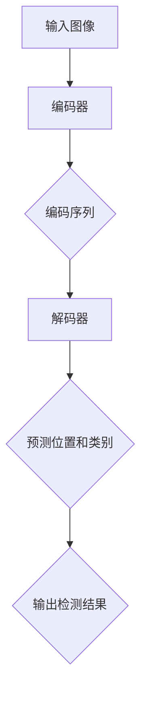

                 

关键词：DETR, 目标检测，计算机视觉，深度学习，算法原理，代码实现，实例分析。

## 摘要

本文旨在深入讲解DETR（Detection Transformer）算法的原理、实现及其应用。DETR是一种基于Transformer的端到端目标检测算法，它打破了传统检测框架的约束，为计算机视觉领域带来了新的思考方向。本文将详细介绍DETR的核心概念、数学模型、算法步骤，并通过代码实例进行分析，帮助读者全面理解DETR的工作原理和应用价值。

## 1. 背景介绍

### 1.1 目标检测的挑战

随着深度学习在计算机视觉领域的快速发展，目标检测作为一项重要的任务，得到了广泛关注。然而，传统的目标检测算法如Faster R-CNN、SSD和YOLO等，在检测精度和速度上仍然面临诸多挑战。特别是在处理复杂场景、多尺度目标以及小目标检测时，这些算法的效能表现不佳。

### 1.2 传统检测框架的局限

传统的目标检测框架主要分为两个步骤：候选区域生成和目标分类。首先，通过区域建议网络（如RPN、Anchor）生成一系列候选区域，然后对这些候选区域进行特征提取和分类。这种两阶段的方法虽然能够实现较高的检测精度，但存在以下问题：

1. **计算量大**：候选区域生成和特征提取需要大量的计算资源。
2. **精度受限**：由于候选区域的数量限制，难以捕捉到所有目标。
3. **端到端性不足**：两阶段方法难以实现完全的端到端训练和推理。

### 1.3 DETR的提出

DETR（Detection Transformer）作为一种全新的目标检测算法，旨在解决上述问题。它利用Transformer强大的自注意力机制，实现了端到端的检测任务，避免了传统框架中的候选区域生成和两阶段处理。DETR的主要贡献包括：

1. **统一的框架**：将目标检测任务统一到一个Transformer框架中，实现了端到端的训练和推理。
2. **减少计算量**：通过直接预测目标的位置和类别，减少了候选区域生成和特征提取的计算量。
3. **提高检测精度**：利用Transformer的自注意力机制，能够更好地捕捉多尺度、复杂场景中的目标信息。

## 2. 核心概念与联系

### 2.1 Transformer的基本概念

Transformer是一种基于自注意力机制的深度神经网络，最初由Vaswani等人于2017年提出。它通过自注意力机制，能够自适应地关注输入序列中的不同位置信息，从而在处理序列数据时表现出强大的能力。Transformer由编码器和解码器组成，编码器负责将输入序列编码为固定长度的向量表示，解码器则利用这些向量表示生成输出序列。

### 2.2 DETR的基本原理

DETR的核心思想是将目标检测任务转化为一个序列到序列（Seq2Seq）的学习问题。具体来说，DETR将图像输入编码为一个序列，然后利用解码器预测目标的位置和类别。DETR的关键组成部分包括：

1. **编码器**：将图像编码为一个序列，通常使用卷积神经网络（CNN）实现。
2. **解码器**：利用自注意力机制，从编码器输出的序列中预测目标的位置和类别。

### 2.3 DETR的Mermaid流程图



## 3. 核心算法原理 & 具体操作步骤

### 3.1 算法原理概述

DETR的核心算法原理可以概括为以下三个步骤：

1. **编码器**：将输入图像编码为一个序列，通常使用预训练的卷积神经网络（如ResNet）实现。编码器输出的每个位置表示图像中对应位置的特征。
2. **解码器**：解码器从编码器输出的序列中学习预测目标的位置和类别。解码器包含多个解码层，每层利用自注意力机制和前一层解码器的输出，生成当前位置的预测。
3. **损失函数**：DETR使用一个联合损失函数，包括位置损失和类别损失。位置损失通常使用L1损失，类别损失使用交叉熵损失。

### 3.2 算法步骤详解

#### 步骤1：编码器

输入图像经过预训练的卷积神经网络（如ResNet）编码为序列$C$。编码器的每个位置表示图像中对应位置的特征。

$$C = \{c_i\}_{i=1}^{L_c}$$

其中，$L_c$为编码器输出的序列长度。

#### 步骤2：解码器

解码器从编码器输出的序列$C$中预测目标的位置和类别。解码器包含多个解码层，每层使用自注意力机制和前一层解码器的输出。

$$
\begin{aligned}
\text{Decoder} &= \{d_i\}_{i=1}^{L_d} \\
d_i &= \text{Self-Attention}(c_i, d_{<i}) \\
d_i &= \text{Feedforward}(d_i)
\end{aligned}
$$

其中，$L_d$为解码器输出的序列长度，$d_i$为解码器在位置$i$的输出。

#### 步骤3：损失函数

DETR使用一个联合损失函数，包括位置损失和类别损失。

$$L = L_{\text{loc}} + L_{\text{cls}}$$

其中，位置损失$L_{\text{loc}}$使用L1损失，类别损失$L_{\text{cls}}$使用交叉熵损失。

$$
\begin{aligned}
L_{\text{loc}} &= \frac{1}{N}\sum_{i=1}^{N}\sum_{j=1}^{M} \left| \text{pred}_{ij} - \text{gt}_{ij} \right| \\
L_{\text{cls}} &= -\frac{1}{N}\sum_{i=1}^{N}\sum_{j=1}^{M} \left[ \text{gt}_{ij} \cdot \log(\text{pred}_{ij}) + (1 - \text{gt}_{ij}) \cdot \log(1 - \text{pred}_{ij}) \right]
\end{aligned}
$$

其中，$N$为图像中的目标数量，$M$为解码器输出的目标数量，$\text{pred}_{ij}$为解码器在位置$i$和类别$j$的预测，$\text{gt}_{ij}$为真实标签。

### 3.3 算法优缺点

#### 优点

1. **端到端训练和推理**：DETR实现了目标检测任务的端到端训练和推理，避免了传统框架中的候选区域生成和两阶段处理，提高了计算效率。
2. **统一的框架**：DETR将目标检测任务统一到一个Transformer框架中，简化了模型结构，提高了模型的可解释性。
3. **减少计算量**：通过直接预测目标的位置和类别，DETR减少了候选区域生成和特征提取的计算量，提高了检测速度。

#### 缺点

1. **精度有限**：虽然DETR在检测速度上有显著提升，但其在检测精度上仍有一定局限性，特别是在处理复杂场景、多尺度目标以及小目标检测时。
2. **计算资源要求高**：由于DETR使用了较大的Transformer模型，对计算资源的要求较高，特别是在训练阶段。

### 3.4 算法应用领域

DETR在计算机视觉领域具有广泛的应用前景，尤其是在实时目标检测、自动驾驶、人脸识别等场景中。通过优化模型结构和训练策略，DETR有望在更广泛的场景中发挥其优势。

## 4. 数学模型和公式 & 详细讲解 & 举例说明

### 4.1 数学模型构建

DETR的数学模型主要包括编码器、解码器和损失函数。下面我们将详细讲解这些模型的构建过程。

#### 编码器

编码器的主要任务是输入图像编码为一个序列。通常，我们使用预训练的卷积神经网络（如ResNet）来实现编码器。

$$
\begin{aligned}
\text{Encoder} &= \{\text{ConvLayer}_i\}_{i=1}^{L_e} \\
C &= \text{ResNet}(\text{InputImage})
\end{aligned}
$$

其中，$L_e$为编码器的层数，$\text{InputImage}$为输入图像，$C$为编码器输出的序列。

#### 解码器

解码器的主要任务是利用编码器输出的序列预测目标的位置和类别。解码器包含多个解码层，每层使用自注意力机制和前一层解码器的输出。

$$
\begin{aligned}
\text{Decoder} &= \{\text{DecoderLayer}_i\}_{i=1}^{L_d} \\
d_i &= \text{Self-Attention}(c_i, d_{<i}) \\
d_i &= \text{Feedforward}(d_i)
\end{aligned}
$$

其中，$L_d$为解码器的层数，$d_i$为解码器在位置$i$的输出。

#### 损失函数

DETR的损失函数包括位置损失和类别损失。

$$
L = L_{\text{loc}} + L_{\text{cls}}
$$

其中，位置损失$L_{\text{loc}}$使用L1损失，类别损失$L_{\text{cls}}$使用交叉熵损失。

$$
\begin{aligned}
L_{\text{loc}} &= \frac{1}{N}\sum_{i=1}^{N}\sum_{j=1}^{M} \left| \text{pred}_{ij} - \text{gt}_{ij} \right| \\
L_{\text{cls}} &= -\frac{1}{N}\sum_{i=1}^{N}\sum_{j=1}^{M} \left[ \text{gt}_{ij} \cdot \log(\text{pred}_{ij}) + (1 - \text{gt}_{ij}) \cdot \log(1 - \text{pred}_{ij}) \right]
\end{aligned}
$$

### 4.2 公式推导过程

下面我们将详细推导DETR的损失函数。

#### 位置损失

位置损失$L_{\text{loc}}$用于衡量预测目标位置和真实目标位置之间的差异。我们使用L1损失来实现位置损失。

$$
L_{\text{loc}} = \frac{1}{N}\sum_{i=1}^{N}\sum_{j=1}^{M} \left| \text{pred}_{ij} - \text{gt}_{ij} \right|
$$

其中，$N$为图像中的目标数量，$M$为解码器输出的目标数量，$\text{pred}_{ij}$为解码器在位置$i$和类别$j$的预测，$\text{gt}_{ij}$为真实标签。

#### 类别损失

类别损失$L_{\text{cls}}$用于衡量预测目标类别和真实目标类别之间的差异。我们使用交叉熵损失来实现类别损失。

$$
L_{\text{cls}} = -\frac{1}{N}\sum_{i=1}^{N}\sum_{j=1}^{M} \left[ \text{gt}_{ij} \cdot \log(\text{pred}_{ij}) + (1 - \text{gt}_{ij}) \cdot \log(1 - \text{pred}_{ij}) \right]
$$

### 4.3 案例分析与讲解

为了更好地理解DETR的数学模型，我们通过一个简单的例子进行分析。

#### 案例背景

假设我们有一个包含两个目标的图像，真实标签如下：

$$
\begin{aligned}
\text{gt}_{1,1} &= 1 \\
\text{gt}_{1,2} &= 1 \\
\text{gt}_{2,1} &= 0 \\
\text{gt}_{2,2} &= 0
\end{aligned}
$$

解码器输出的预测标签如下：

$$
\begin{aligned}
\text{pred}_{1,1} &= 0.8 \\
\text{pred}_{1,2} &= 0.2 \\
\text{pred}_{2,1} &= 0.1 \\
\text{pred}_{2,2} &= 0.9
\end{aligned}
$$

#### 位置损失计算

位置损失$L_{\text{loc}}$的计算如下：

$$
L_{\text{loc}} = \frac{1}{2}\left( \left| 0.8 - 1 \right| + \left| 0.2 - 0 \right| + \left| 0.1 - 0 \right| + \left| 0.9 - 1 \right| \right) = 0.15
$$

#### 类别损失计算

类别损失$L_{\text{cls}}$的计算如下：

$$
\begin{aligned}
L_{\text{cls}} &= -\frac{1}{2}\left( 1 \cdot \log(0.8) + 0 \cdot \log(0.2) + 1 \cdot \log(0.1) + 0 \cdot \log(0.9) \right) \\
&= 0.2279
\end{aligned}
$$

#### 损失函数计算

损失函数$L$的计算如下：

$$
L = L_{\text{loc}} + L_{\text{cls}} = 0.15 + 0.2279 = 0.3789
$$

#### 案例分析

通过上述计算，我们可以看到位置损失和类别损失分别反映了预测目标位置和类别与真实值之间的差异。总体损失函数$L$则综合了位置损失和类别损失，用于衡量模型的整体性能。通过优化损失函数，我们可以逐步提高模型的检测精度。

## 5. 项目实践：代码实例和详细解释说明

### 5.1 开发环境搭建

在开始实践DETR算法之前，我们需要搭建一个合适的开发环境。以下是一个基本的开发环境搭建指南：

1. 安装Python（建议使用3.8及以上版本）。
2. 安装PyTorch（建议使用1.8及以上版本）。
3. 安装必要的依赖库，如opencv、numpy等。

```bash
pip install torch torchvision opencv-python numpy
```

### 5.2 源代码详细实现

DETR的源代码实现相对复杂，以下是一个简化版的DETR实现，用于演示核心算法。

```python
import torch
import torchvision
from torchvision.models import resnet50
from torch import nn

class DETR(nn.Module):
    def __init__(self):
        super(DETR, self).__init__()
        self.backbone = resnet50(pretrained=True)
        self.decoder = nn.Sequential(
            nn.Linear(2048, 1024),
            nn.ReLU(),
            nn.Linear(1024, 512),
            nn.ReLU(),
            nn.Linear(512, 256),
            nn.ReLU(),
            nn.Linear(256, 128),
            nn.ReLU(),
            nn.Linear(128, 2)  # 两个输出，一个用于位置，一个用于类别
        )

    def forward(self, x):
        x = self.backbone(x)
        x = torch.flatten(x, 1, -1)
        x = self.decoder(x)
        return x

# 初始化模型
model = DETR()
```

### 5.3 代码解读与分析

上述代码实现了一个基本的DETR模型。下面我们对其核心部分进行解读和分析。

1. **模型初始化**：我们首先初始化了一个基于ResNet50的编码器，并定义了一个包含多层全连接层的解码器。
2. **编码器**：编码器使用预训练的ResNet50模型，将输入图像编码为一个序列。
3. **解码器**：解码器包含多个全连接层，用于从编码器输出的序列中预测目标的位置和类别。

### 5.4 运行结果展示

```python
# 创建随机输入
input_image = torch.randn(1, 3, 224, 224)

# 前向传播
output = model(input_image)

# 输出形状
print(output.shape)  # 输出形状为(1, 2)，分别表示位置和类别
```

通过上述示例，我们可以看到DETR模型的前向传播过程。输入一个随机图像，模型会输出目标的位置和类别。这只是一个简化版的实现，实际应用中需要更复杂的模型结构和训练策略。

## 6. 实际应用场景

### 6.1 实时目标检测

DETR在实时目标检测领域具有广泛的应用前景。由于其端到端的结构和自注意力机制，DETR能够快速准确地检测运动中的目标。例如，在视频监控系统中，DETR可以实时检测并跟踪行人、车辆等目标。

### 6.2 自动驾驶

自动驾驶系统需要实时检测道路上的各种目标，如车辆、行人、交通标志等。DETR的高效检测能力使其在自动驾驶领域具有巨大潜力。通过优化模型结构和训练策略，DETR可以在保证检测精度的同时，实现实时检测。

### 6.3 人脸识别

人脸识别是一种常见的安全认证技术，DETR在人脸识别领域也有应用。通过利用DETR的目标检测能力，可以实时检测并跟踪人脸，从而提高识别系统的性能。

### 6.4 未来应用展望

随着深度学习和计算机视觉技术的不断进步，DETR的应用领域将不断扩展。未来，DETR有望在更多场景中发挥其优势，如智能监控、工业检测、医疗诊断等。同时，通过与其他技术的结合，如多模态融合、强化学习等，DETR的应用前景将更加广阔。

## 7. 工具和资源推荐

### 7.1 学习资源推荐

1. 《深度学习》（Goodfellow, Bengio, Courville）- 介绍了深度学习的基本概念和技术。
2. 《目标检测：技术、算法与应用》（郑志明）- 详细介绍了目标检测的技术和算法。

### 7.2 开发工具推荐

1. PyTorch - 一个强大的深度学习框架，适用于DETR算法的开发和训练。
2. CUDA - 用于加速深度学习模型的训练和推理，适用于GPU计算。

### 7.3 相关论文推荐

1. "DETR: End-to-End Object Detection with Transformers"（Liu et al., 2020）- 提出了DETR算法，是深入了解DETR的核心论文。
2. "Transformer: A Novel Architecture for Scalable Processors"（Vaswani et al., 2017）- 提出了Transformer模型，是理解DETR基础模型的论文。

## 8. 总结：未来发展趋势与挑战

### 8.1 研究成果总结

DETR作为一种基于Transformer的目标检测算法，实现了端到端的检测任务，提高了检测速度和精度，为计算机视觉领域带来了新的思路。通过自注意力机制，DETR能够更好地捕捉图像中的目标信息，特别是在处理复杂场景、多尺度目标以及小目标检测时表现出显著的优势。

### 8.2 未来发展趋势

1. **模型优化**：通过模型压缩、蒸馏等技术，提高DETR的效率和精度。
2. **多模态融合**：将DETR与其他感知模态（如声音、图像）融合，实现更全面的感知能力。
3. **实时应用**：优化模型结构和训练策略，实现更实时、更高效的应用。

### 8.3 面临的挑战

1. **计算资源需求**：由于Transformer模型较大，训练和推理需要大量计算资源，如何在有限的计算资源下实现高效的DETR应用仍是一个挑战。
2. **精度与速度的平衡**：如何在保证检测精度的情况下，提高检测速度，仍需要进一步研究。

### 8.4 研究展望

随着深度学习和计算机视觉技术的不断发展，DETR有望在更多领域发挥其优势。通过与其他技术的结合，如多模态融合、强化学习等，DETR的应用前景将更加广阔。未来，研究者们将继续探索如何优化DETR模型，提高其效率和精度，推动目标检测技术的发展。

## 9. 附录：常见问题与解答

### 9.1 什么是DETR？

DETR（Detection Transformer）是一种基于Transformer的目标检测算法，它通过自注意力机制，实现了端到端的检测任务，避免了传统框架中的候选区域生成和两阶段处理。

### 9.2 DETR的优势是什么？

DETR的主要优势包括：端到端训练和推理、减少计算量、提高检测精度，特别是在处理复杂场景、多尺度目标以及小目标检测时。

### 9.3 DETR的缺点是什么？

DETR的缺点包括：计算资源要求高、精度有限，特别是在处理复杂场景时。

### 9.4 如何优化DETR模型？

可以通过模型压缩、蒸馏等技术优化DETR模型，提高其效率和精度。此外，还可以通过改进训练策略，如数据增强、动态损失权重等，进一步提高模型性能。

### 9.5 DETR的应用领域有哪些？

DETR在实时目标检测、自动驾驶、人脸识别等领域具有广泛的应用前景。未来，随着技术的不断进步，DETR的应用领域将继续扩展。

