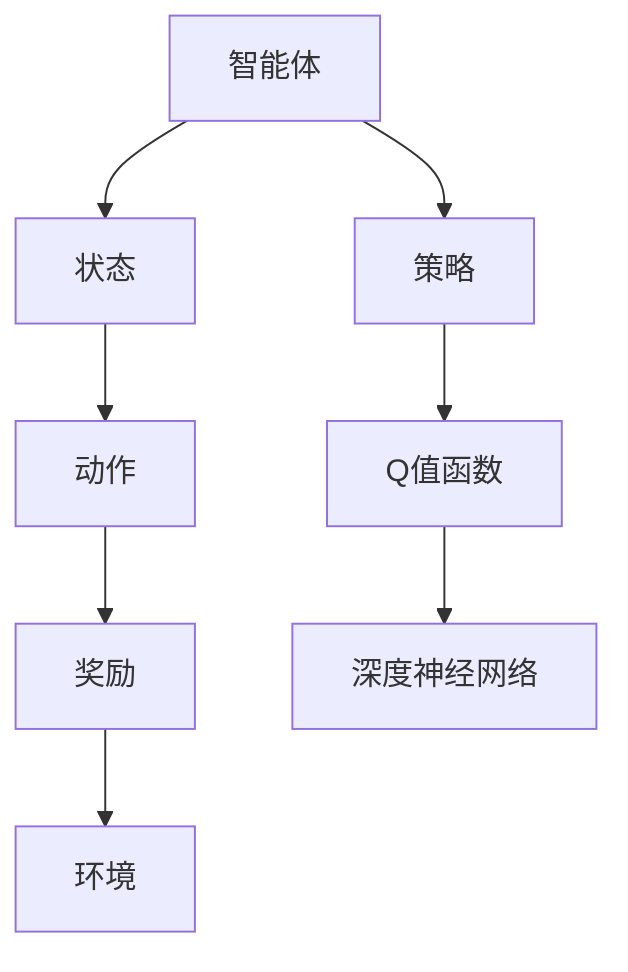

                 

关键词：深度Q网络、强化学习、Q值函数、神经网络、智能体、策略、奖励、探索与利用

摘要：本文将深入讲解深度Q网络（DQN）的基本原理、实现步骤和实际应用，通过详细的代码实例来演示如何使用DQN解决经典的Atari游戏问题。文章还将探讨DQN的优势和局限性，以及它在未来可能的发展趋势和面临的挑战。

## 1. 背景介绍

### 1.1 强化学习的基本概念

强化学习（Reinforcement Learning，RL）是一种机器学习范式，旨在通过与环境交互来学习最优行为策略。在强化学习中，智能体（Agent）通过感知环境状态（State）、选择动作（Action）、获得奖励（Reward）来逐步优化其行为，从而实现长期目标。

### 1.2 Q值函数和策略

在强化学习中，Q值函数（Q-Function）是一个核心概念。Q值表示在特定状态下采取特定动作的预期回报。策略（Policy）则定义了智能体在给定状态下应该采取的动作。理想情况下，策略应该总是选择使Q值最大的动作。

### 1.3 深度Q网络（DQN）

DQN是一种基于神经网络的Q值函数近似方法，它通过使用深度神经网络来学习Q值函数。DQN的主要贡献是引入了经验回放（Experience Replay）机制，这有助于智能体避免陷入局部最优，从而提高学习效果。

## 2. 核心概念与联系



### 2.1 智能体与环境的交互

智能体与环境之间通过感知状态、选择动作和获得奖励来进行交互。智能体通过不断尝试不同的动作来学习最优策略。

### 2.2 Q值函数与策略的关系

Q值函数定义了在给定状态下采取特定动作的预期回报。策略则基于Q值函数来选择动作，使得智能体能够最大化预期回报。

### 2.3 深度神经网络在Q值函数学习中的应用

深度神经网络（DNN）用于近似Q值函数，从而将复杂的非线性关系映射到Q值上。经验回放机制则确保了神经网络训练过程中的稳定性。

## 3. 核心算法原理 & 具体操作步骤

### 3.1 算法原理概述

DQN的核心思想是通过训练一个深度神经网络来近似Q值函数。神经网络接收状态作为输入，输出Q值。在训练过程中，通过随机梯度下降（SGD）更新神经网络的权重，以最小化损失函数。

### 3.2 算法步骤详解

1. **初始化参数**：初始化神经网络权重、经验回放记忆、学习率等参数。
2. **选择动作**：根据当前状态和策略选择动作。
3. **执行动作**：在环境中执行所选动作，获得新的状态和奖励。
4. **更新经验回放记忆**：将新经验添加到经验回放记忆中。
5. **选择目标Q值**：根据目标Q值函数计算目标Q值。
6. **更新Q值函数**：使用随机梯度下降更新Q值函数的权重。

### 3.3 算法优缺点

**优点**：
- **处理复杂状态空间**：深度神经网络能够处理高维状态空间，从而解决传统Q值函数方法难以处理的问题。
- **灵活性强**：可以通过调整网络结构和超参数来适应不同的问题。

**缺点**：
- **训练不稳定**：经验回放机制可能导致训练不稳定。
- **计算资源消耗大**：深度神经网络训练需要大量的计算资源。

### 3.4 算法应用领域

DQN在游戏智能体、机器人控制、金融预测等领域都有广泛的应用。例如，在Atari游戏问题上，DQN已经成功实现了超越人类的表现。

## 4. 数学模型和公式 & 详细讲解 & 举例说明

### 4.1 数学模型构建

$$
Q(s, a) = \sum_{i=1}^n w_i \cdot f(s, a)
$$

其中，$Q(s, a)$ 表示状态 $s$ 下采取动作 $a$ 的Q值，$w_i$ 是神经网络的权重，$f(s, a)$ 是神经网络的输出。

### 4.2 公式推导过程

DQN的目标是训练一个深度神经网络，使其输出的Q值接近真实Q值。因此，我们可以使用损失函数来衡量预测Q值和真实Q值之间的差距。

$$
L = \frac{1}{2} \sum_{i=1}^n (Q(s, a) - y)^2
$$

其中，$y$ 是目标Q值，即根据目标Q值函数计算出的Q值。

### 4.3 案例分析与讲解

假设智能体在一个Atari游戏问题中，当前状态为 $s = (0, 0)$，可选动作有向上、向下、向左、向右。根据神经网络输出，我们得到以下Q值：

$$
Q(s, \text{上}) = 0.8, Q(s, \text{下}) = 0.2, Q(s, \text{左}) = 0.3, Q(s, \text{右}) = 0.9
$$

根据策略，智能体选择向右移动。执行动作后，获得奖励 $r = 1$，进入新状态 $s' = (1, 0)$。此时，目标Q值为：

$$
y = r + \gamma \max_{a'} Q(s', a')
$$

其中，$\gamma$ 是折扣因子。根据当前神经网络输出，得到 $y = 1 + 0.99 \cdot 0.9 = 1.89$。

接下来，使用随机梯度下降更新神经网络权重：

$$
w_{\text{新}} = w_{\text{旧}} - \alpha \cdot (\nabla_w L)
$$

其中，$\alpha$ 是学习率，$\nabla_w L$ 是损失函数关于权重 $w$ 的梯度。

## 5. 项目实践：代码实例和详细解释说明

### 5.1 开发环境搭建

为了实践DQN算法，我们需要搭建一个合适的环境。在本例中，我们将使用Python和TensorFlow框架。以下是安装步骤：

1. 安装Python 3.6及以上版本。
2. 安装TensorFlow：

```bash
pip install tensorflow
```

3. 安装OpenAI Gym：

```bash
pip install gym
```

### 5.2 源代码详细实现

以下是一个简单的DQN实现：

```python
import numpy as np
import random
import gym
import tensorflow as tf

# 初始化环境
env = gym.make('CartPole-v0')

# 初始化神经网络
input_layer = tf.keras.layers.Input(shape=(4,))
dense_layer = tf.keras.layers.Dense(64, activation='relu')(input_layer)
output_layer = tf.keras.layers.Dense(1)(dense_layer)

model = tf.keras.Model(inputs=input_layer, outputs=output_layer)

# 初始化经验回放记忆
memory = []

# 初始化训练参数
learning_rate = 0.001
gamma = 0.99
epsilon = 1.0
epsilon_decay = 0.995
epsilon_min = 0.01

# 训练模型
episodes = 1000
for episode in range(episodes):
    state = env.reset()
    done = False
    total_reward = 0

    while not done:
        # 根据epsilon选择动作
        if random.uniform(0, 1) < epsilon:
            action = env.action_space.sample()
        else:
            action = np.argmax(model.predict(state.reshape(-1, 4)))

        # 执行动作
        next_state, reward, done, _ = env.step(action)

        # 更新经验回放记忆
        memory.append((state, action, reward, next_state, done))

        # 更新状态
        state = next_state
        total_reward += reward

        # 如果达到最大步数或完成游戏，重置环境
        if done:
            break

    # 更新epsilon
    epsilon = max(epsilon_decay, epsilon_min)

    # 更新模型
    if len(memory) > 1000:
        batch = random.sample(memory, 32)
        for state, action, reward, next_state, done in batch:
            target = reward
            if not done:
                target += gamma * np.max(model.predict(next_state.reshape(-1, 4)))
            target_f = model.predict(state.reshape(-1, 4))
            target_f[0][action] = target
            model.fit(state.reshape(-1, 4), target_f, epochs=1, verbose=0)

    print(f"Episode {episode + 1}, Total Reward: {total_reward}")

env.close()
```

### 5.3 代码解读与分析

这段代码首先初始化了环境和神经网络。然后，使用epsilon贪心策略选择动作，并在经验回放记忆中存储每一步的经验。在每次迭代中，更新模型以最小化损失函数。最后，打印出每个时期的总奖励。

### 5.4 运行结果展示

在运行这段代码时，我们可以观察到智能体在CartPole环境中逐步提高其表现，最终能够在没有失败的情况下持续运行数百步。

## 6. 实际应用场景

DQN算法在许多实际应用中取得了显著的成功。以下是一些典型的应用场景：

- **Atari游戏智能体**：DQN被用于训练智能体在Atari游戏中实现超越人类的表现。
- **机器人控制**：DQN可以用于训练机器人进行复杂的运动任务，如行走、跳跃等。
- **金融预测**：DQN可以用于预测股票市场的走势，从而帮助投资者做出更好的决策。

## 7. 工具和资源推荐

### 7.1 学习资源推荐

- 《Reinforcement Learning: An Introduction》（Anntilius Georgiou）：这是一本全面介绍强化学习的经典教材。
- 《Deep Reinforcement Learning Hands-On》（Aurélien Géron）：这本书提供了深度强化学习的实践指南，包括DQN算法的详细实现。

### 7.2 开发工具推荐

- TensorFlow：一个开源的机器学习框架，支持DQN算法的实现。
- OpenAI Gym：一个开源的环境库，提供了许多经典的强化学习环境。

### 7.3 相关论文推荐

- “Deep Q-Network” (Vince Vanhoucke, 2010)：这是DQN算法的原始论文，详细介绍了算法的原理和实现。
- “Playing Atari with Deep Reinforcement Learning” (Volodymyr Mnih et al., 2015)：这篇论文展示了DQN算法在Atari游戏中的成功应用。

## 8. 总结：未来发展趋势与挑战

### 8.1 研究成果总结

DQN算法在强化学习领域取得了重要的成果，通过深度神经网络实现了Q值函数的近似，并在多个实际应用中取得了成功。

### 8.2 未来发展趋势

随着深度学习技术的发展，DQN算法有望在更多复杂问题上实现突破。此外，结合其他强化学习算法，如深度确定性策略梯度（DDPG）、异步优势演员-评论家（A3C）等，DQN算法将在更广泛的领域中发挥作用。

### 8.3 面临的挑战

DQN算法在训练过程中可能存在不稳定性和计算资源消耗大的问题。未来研究需要解决这些问题，以提高算法的实用性和可扩展性。

### 8.4 研究展望

随着硬件性能的提升和数据获取能力的增强，DQN算法将在更多复杂环境中得到应用。此外，通过与其他机器学习算法的结合，DQN算法有望在更多领域实现突破。

## 9. 附录：常见问题与解答

### 9.1 什么是经验回放？

经验回放是一种避免智能体在训练过程中陷入局部最优的方法。它通过将经验存储在记忆中，并随机从记忆中选择样本进行训练，从而提高算法的鲁棒性和泛化能力。

### 9.2 如何调整DQN算法的超参数？

DQN算法的超参数包括学习率、折扣因子、epsilon等。可以通过实验调整这些参数来优化算法性能。通常，需要考虑训练时间和性能之间的关系，以达到最佳效果。

### 9.3 DQN算法如何处理连续动作？

对于连续动作问题，可以使用连续动作空间的Q值函数。在实际应用中，通常将连续动作空间离散化，以便使用DQN算法进行处理。

### 9.4 DQN算法与其他强化学习算法相比有哪些优势？

DQN算法的主要优势在于其能够处理高维状态空间和复杂的非线性关系。与其他强化学习算法相比，DQN算法在许多任务上取得了更好的性能。

### 9.5 DQN算法有哪些局限性？

DQN算法的局限性包括训练不稳定性和计算资源消耗大。此外，对于某些任务，DQN算法可能无法取得与人类水平相当的表现。未来研究需要解决这些问题，以提高算法的实用性和可扩展性。

