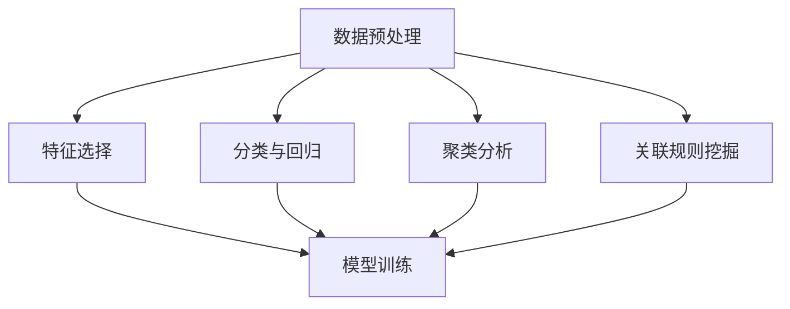

                 

关键词：数据挖掘、算法原理、代码实战、数据可视化、机器学习

摘要：本文将深入探讨数据挖掘的基本原理，并通过多个实例详细讲解数据挖掘的实战应用。我们将从数据预处理、核心算法分析到代码实现，全方位展示数据挖掘在现实世界中的强大应用。读者将通过本文了解到数据挖掘的各个方面，从而能够更好地在实际项目中运用这一技术。

## 1. 背景介绍

数据挖掘（Data Mining）是指从大量的、不完全的、有噪声的、模糊的、随机的数据中，提取隐含在其中的、人们事先不知道的、但又是潜在有用的信息和知识的过程。随着互联网和大数据时代的到来，数据挖掘的重要性日益凸显。通过数据挖掘，我们可以从海量数据中发现潜在的模式、趋势和关联，从而为决策提供有力的支持。

数据挖掘的应用领域非常广泛，包括但不限于：金融风险控制、医疗健康、市场营销、社交网络分析、推荐系统等。例如，在金融领域，数据挖掘可以帮助银行和金融机构识别欺诈行为；在医疗领域，数据挖掘可以帮助医生分析患者的病历数据，从而提高诊断准确率；在市场营销领域，数据挖掘可以帮助企业了解客户需求，从而制定更有效的营销策略。

本文将围绕数据挖掘的原理和实战案例进行讲解，旨在帮助读者理解数据挖掘的基本概念和操作步骤，并学会在实际项目中运用数据挖掘技术。

## 2. 核心概念与联系

在数据挖掘中，有几个核心概念需要了解：

- **数据预处理**：数据预处理是数据挖掘的第一步，主要包括数据清洗、数据集成、数据转换和数据归一化。数据预处理的质量直接影响数据挖掘的结果。

- **特征选择**：特征选择是指从原始数据中选取出最有用的特征，以减少数据维度和提高模型性能。

- **分类与回归**：分类是将数据分为不同的类别，而回归则是预测一个连续的数值。分类和回归是数据挖掘中最常用的两种任务。

- **聚类分析**：聚类分析是将数据分为不同的簇，使得同一个簇中的数据尽可能相似，而不同簇中的数据尽可能不同。

- **关联规则挖掘**：关联规则挖掘是指发现数据之间的关联性，例如在购物篮分析中，找出经常一起购买的商品。

下面是一个简单的 Mermaid 流程图，展示了这些核心概念之间的联系：



### 2.1 数据预处理

数据预处理是数据挖掘中至关重要的一步。在实际应用中，原始数据往往存在噪声、缺失值、异常值等问题，这些问题会直接影响数据挖掘的结果。因此，我们需要对数据进行预处理，以提高数据质量。

#### 2.1.1 数据清洗

数据清洗是指识别和纠正数据中的错误和异常。主要包括以下几个方面：

- **缺失值处理**：缺失值可以采用填充策略（例如平均值、中值、最频繁值）或删除策略（例如删除含有缺失值的记录）。
- **异常值处理**：异常值可能是噪声，也可能是实际存在的异常数据。处理方法包括删除、替换或使用统计方法调整。
- **重复数据处理**：识别和删除重复的数据记录。

#### 2.1.2 数据集成

数据集成是将来自多个源的数据合并成一个统一格式的数据集。数据集成可能面临的问题包括数据类型不匹配、单位不一致、数据格式不同等。解决方法包括数据转换、数据归一化和数据清洗。

#### 2.1.3 数据转换

数据转换是将数据从一种格式转换为另一种格式，以便更好地进行数据挖掘。常见的数据转换方法包括数据标准化、数据归一化、数据编码等。

### 2.2 特征选择

特征选择是从原始数据中选取出最有用的特征，以减少数据维度和提高模型性能。特征选择的方法包括过滤式、包装式和嵌入式三种。

- **过滤式特征选择**：先对原始数据进行特征评估，然后根据评估结果选择特征。
- **包装式特征选择**：在特征选择过程中，同时进行特征评估和模型训练，以找到最优的特征组合。
- **嵌入式特征选择**：在模型训练过程中，自动选择和优化特征。

### 2.3 分类与回归

分类和回归是数据挖掘中最常用的两种任务。

- **分类**：分类是将数据分为不同的类别。常见的分类算法有决策树、随机森林、支持向量机等。
- **回归**：回归是预测一个连续的数值。常见的回归算法有线性回归、岭回归、逻辑回归等。

### 2.4 聚类分析

聚类分析是将数据分为不同的簇，使得同一个簇中的数据尽可能相似，而不同簇中的数据尽可能不同。常见的聚类算法有 K-均值、层次聚类、DBSCAN 等。

### 2.5 关联规则挖掘

关联规则挖掘是指发现数据之间的关联性。常见的算法有 Apriori 算法、Eclat 算法、FP-Growth 算法等。

## 3. 核心算法原理 & 具体操作步骤

### 3.1 算法原理概述

在数据挖掘中，常用的算法包括分类、聚类和关联规则挖掘。下面我们将分别介绍这些算法的原理。

#### 3.1.1 分类算法

分类算法的核心思想是将数据分为不同的类别。常见的分类算法有：

- **决策树**：决策树通过一系列规则来分类数据，每个规则对应一个节点。决策树的学习过程是递归地将数据集分割成子集，直到满足某个停止条件。
- **随机森林**：随机森林是一种集成学习方法，它通过构建多棵决策树来提高分类性能。随机森林通过对每棵树进行随机抽样和特征选择，从而降低过拟合的风险。
- **支持向量机（SVM）**：SVM 通过找到一个最优的超平面来将数据分为不同的类别。SVM 的学习过程是寻找一个最大化分类边界的超平面。

#### 3.1.2 聚类算法

聚类算法的核心思想是将数据分为不同的簇。常见的聚类算法有：

- **K-均值**：K-均值算法通过迭代过程找到 K 个簇的中心点，并将每个数据点分配给最近的中心点。
- **层次聚类**：层次聚类是一种层次结构的方法，它将数据点逐步合并成更大的簇，直到满足某个停止条件。
- **DBSCAN**：DBSCAN 是一种基于密度的聚类算法，它通过寻找高密度区域来确定簇。

#### 3.1.3 关联规则挖掘

关联规则挖掘的核心思想是发现数据之间的关联性。常见的算法有：

- **Apriori 算法**：Apriori 算法通过逐层迭代的方式来寻找频繁项集，并从中提取关联规则。
- **Eclat 算法**：Eclat 算法是一种基于频繁模式树的算法，它通过递归地合并项集来寻找频繁项集。
- **FP-Growth 算法**：FP-Growth 算法通过构建 FP-树来高效地寻找频繁项集，并从中提取关联规则。

### 3.2 算法步骤详解

#### 3.2.1 分类算法步骤

1. 数据预处理：对原始数据进行预处理，包括数据清洗、数据集成和数据转换。
2. 特征选择：选择最有用的特征，以减少数据维度和提高模型性能。
3. 模型训练：使用训练数据集来训练分类模型。
4. 模型评估：使用测试数据集来评估模型的性能，常见的评估指标有准确率、召回率、F1 分数等。
5. 模型应用：将训练好的模型应用于新的数据集进行预测。

#### 3.2.2 聚类算法步骤

1. 数据预处理：对原始数据进行预处理，包括数据清洗、数据集成和数据转换。
2. 初始化聚类中心：随机选择 K 个数据点作为初始聚类中心。
3. 分配数据点：将每个数据点分配给最近的聚类中心。
4. 更新聚类中心：计算每个簇的平均值，作为新的聚类中心。
5. 重复步骤 3 和 4，直到聚类中心不再发生变化。

#### 3.2.3 关联规则挖掘步骤

1. 数据预处理：对原始数据进行预处理，包括数据清洗、数据集成和数据转换。
2. 生成频繁项集：使用 Apriori 算法、Eclat 算法或 FP-Growth 算法来生成频繁项集。
3. 提取关联规则：从频繁项集中提取关联规则，常见的规则评估指标有支持度、置信度等。
4. 规则排序：根据规则评估指标对关联规则进行排序，筛选出最有用的规则。

### 3.3 算法优缺点

#### 3.3.1 分类算法优缺点

- **决策树**：优点是易于理解和解释，能够处理不同类型的数据。缺点是可能产生过拟合，且对噪声敏感。
- **随机森林**：优点是能够处理高维数据，减少过拟合的风险。缺点是模型复杂度较高，计算成本较大。
- **支持向量机（SVM）**：优点是模型性能较好，能够处理非线性数据。缺点是需要较大的计算资源和参数调优。

#### 3.3.2 聚类算法优缺点

- **K-均值**：优点是计算速度快，易于实现。缺点是对初始聚类中心敏感，可能陷入局部最优。
- **层次聚类**：优点是能够产生层次结构，便于理解。缺点是计算成本较高，且对初始聚类中心敏感。
- **DBSCAN**：优点是能够发现任意形状的簇，对噪声和异常值具有较强的鲁棒性。缺点是需要预先指定簇的数量和密度参数。

#### 3.3.3 关联规则挖掘优缺点

- **Apriori 算法**：优点是简单易实现，能够处理大规模数据集。缺点是计算量大，效率较低。
- **Eclat 算法**：优点是能够快速生成频繁项集，计算效率较高。缺点是适用于稀疏数据集。
- **FP-Growth 算法**：优点是能够高效地生成频繁项集，适用于大规模数据集。缺点是需要较大的内存空间。

### 3.4 算法应用领域

- **分类算法**：分类算法广泛应用于金融风控、文本分类、图像识别等领域。
- **聚类算法**：聚类算法广泛应用于聚类分析、社交网络分析、市场细分等领域。
- **关联规则挖掘**：关联规则挖掘广泛应用于购物篮分析、推荐系统、行为分析等领域。

## 4. 数学模型和公式 & 详细讲解 & 举例说明

在数据挖掘中，数学模型和公式是理解和实现算法的基础。在本节中，我们将介绍一些核心的数学模型和公式，并进行详细讲解和举例说明。

### 4.1 数学模型构建

#### 4.1.1 决策树

决策树是一种常用的分类算法，其基本模型如下：

$$
\text{分类结果} = \text{叶节点标签}
$$

决策树的生成过程是通过递归地将数据集分割成子集，直到满足某个停止条件。停止条件可以是数据集已经非常纯净、达到最大深度或数据集大小低于某个阈值等。

#### 4.1.2 随机森林

随机森林是一种基于决策树的集成学习方法，其基本模型如下：

$$
\text{随机森林分类结果} = \text{多数投票结果}(\text{各决策树分类结果})
$$

随机森林通过从原始数据集和特征集中进行随机抽样，生成多棵决策树，并对每棵树的分类结果进行投票，以获得最终分类结果。

#### 4.1.3 支持向量机（SVM）

支持向量机是一种常用的分类算法，其基本模型如下：

$$
\text{分类结果} = \text{sign}(\sum_{i=1}^{n} \alpha_i y_i \textbf{x}_i^T \textbf{w} + b)
$$

其中，$\alpha_i$ 是拉格朗日乘子，$y_i$ 是样本标签，$\textbf{x}_i$ 是样本特征向量，$\textbf{w}$ 是权重向量，$b$ 是偏置项。

### 4.2 公式推导过程

#### 4.2.1 决策树

决策树的学习过程可以看作是一个递归的过程。给定一个数据集，我们可以通过以下步骤来构建决策树：

1. 计算所有特征的熵（Entropy）或信息增益（Information Gain）。
2. 选择具有最大熵或最大信息增益的特征作为分割特征。
3. 根据分割特征将数据集分割成子集。
4. 递归地重复步骤 1-3，直到满足停止条件。

#### 4.2.2 随机森林

随机森林通过随机抽样和特征选择来构建多棵决策树，其学习过程如下：

1. 从原始数据集中随机抽样生成多个子数据集。
2. 从原始特征集中随机选择一部分特征。
3. 对每个子数据集构建一棵决策树。
4. 对所有决策树的分类结果进行投票，以获得最终分类结果。

#### 4.2.3 支持向量机（SVM）

支持向量机（SVM）的学习过程可以看作是一个优化过程。给定一个线性可分的数据集，我们需要找到一个最优的超平面，使得分类边界最大化。

1. 构建拉格朗日函数：
$$
L(\textbf{w}, b, \alpha) = \frac{1}{2} \|\textbf{w}\|^2 - \sum_{i=1}^{n} \alpha_i (y_i (\textbf{x}_i^T \textbf{w} + b) - 1)
$$
2. 求导并设置导数为零，得到最优解：
$$
\begin{cases}
\nabla_{\textbf{w}} L(\textbf{w}, b, \alpha) = \textbf{w} - \sum_{i=1}^{n} \alpha_i y_i \textbf{x}_i = 0 \\
\nabla_b L(\textbf{w}, b, \alpha) = -\sum_{i=1}^{n} \alpha_i y_i = 0 \\
\alpha_i \geq 0, \quad \forall i
\end{cases}
$$
3. 解拉格朗日方程，得到权重向量 $\textbf{w}$ 和偏置项 $b$。

### 4.3 案例分析与讲解

为了更好地理解上述数学模型和公式的应用，我们来看一个简单的案例。

#### 4.3.1 决策树案例

假设我们有一个二分类问题，数据集包含两个特征 $x_1$ 和 $x_2$，标签为 $y$。我们使用信息增益来构建决策树。

1. 计算特征 $x_1$ 的信息增益：
$$
\text{IG}(x_1) = \sum_{i=1}^{2} p(y_i) \sum_{j=1}^{2} p(x_{1j}|y_i) \log_2 p(x_{1j}|y_i)
$$
2. 计算特征 $x_2$ 的信息增益：
$$
\text{IG}(x_2) = \sum_{i=1}^{2} p(y_i) \sum_{j=1}^{2} p(x_{2j}|y_i) \log_2 p(x_{2j}|y_i)
$$
3. 选择具有最大信息增益的特征作为分割特征。
4. 根据分割特征将数据集分割成子集。
5. 递归地重复步骤 1-4，直到满足停止条件。

#### 4.3.2 随机森林案例

假设我们有一个线性可分的数据集，包含两个特征 $x_1$ 和 $x_2$，标签为 $y$。我们使用随机森林来构建分类模型。

1. 从原始数据集中随机抽样生成多个子数据集。
2. 从原始特征集中随机选择一部分特征。
3. 对每个子数据集构建一棵决策树。
4. 对所有决策树的分类结果进行投票，以获得最终分类结果。

#### 4.3.3 支持向量机（SVM）案例

假设我们有一个线性可分的数据集，包含两个特征 $x_1$ 和 $x_2$，标签为 $y$。我们使用支持向量机来构建分类模型。

1. 计算训练数据集的样本均值和样本方差：
$$
\textbf{\bar{x}} = \frac{1}{n} \sum_{i=1}^{n} \textbf{x}_i, \quad \textbf{S} = \frac{1}{n-1} \sum_{i=1}^{n} (\textbf{x}_i - \textbf{\bar{x}})(\textbf{x}_i - \textbf{\bar{x}})^T
$$
2. 计算最优超平面：
$$
\textbf{w} = \frac{1}{n} \sum_{i=1}^{n} y_i \textbf{x}_i, \quad b = \frac{1}{n} \sum_{i=1}^{n} y_i - \textbf{w}^T \textbf{\bar{x}}
$$
3. 计算分类结果：
$$
\text{分类结果} = \text{sign}(\textbf{w}^T \textbf{x} + b)
$$

## 5. 项目实践：代码实例和详细解释说明

### 5.1 开发环境搭建

在进行数据挖掘项目之前，我们需要搭建一个合适的开发环境。以下是一个简单的开发环境搭建步骤：

1. 安装 Python 解释器（Python 3.8 或更高版本）。
2. 安装 Jupyter Notebook，用于编写和运行 Python 代码。
3. 安装必要的 Python 库，例如 NumPy、Pandas、Scikit-learn、Matplotlib 等。

### 5.2 源代码详细实现

在本节中，我们将使用 Python 和 Scikit-learn 库来实现一个简单的数据挖掘项目——鸢尾花数据集分类。

#### 5.2.1 数据准备

```python
import numpy as np
import pandas as pd
from sklearn import datasets

# 加载鸢尾花数据集
iris = datasets.load_iris()
X = iris.data
y = iris.target
```

#### 5.2.2 数据预处理

```python
from sklearn.model_selection import train_test_split

# 数据集划分
X_train, X_test, y_train, y_test = train_test_split(X, y, test_size=0.2, random_state=42)

# 数据标准化
from sklearn.preprocessing import StandardScaler

scaler = StandardScaler()
X_train = scaler.fit_transform(X_train)
X_test = scaler.transform(X_test)
```

#### 5.2.3 模型训练

```python
from sklearn.tree import DecisionTreeClassifier

# 构建决策树分类器
clf = DecisionTreeClassifier()

# 训练模型
clf.fit(X_train, y_train)
```

#### 5.2.4 模型评估

```python
from sklearn.metrics import accuracy_score, classification_report

# 预测测试集
y_pred = clf.predict(X_test)

# 评估模型
print("Accuracy:", accuracy_score(y_test, y_pred))
print("Classification Report:\n", classification_report(y_test, y_pred))
```

### 5.3 代码解读与分析

在上面的代码中，我们首先加载了鸢尾花数据集，并对数据集进行了划分和标准化处理。接下来，我们构建了一个决策树分类器，并使用训练数据集进行了模型训练。最后，我们使用测试数据集对模型进行了评估。

#### 5.3.1 数据预处理

数据预处理是数据挖掘中非常重要的一步。在本例中，我们使用了 Scikit-learn 的 StandardScaler 类对数据进行标准化处理。标准化处理将每个特征的值缩放到相同的尺度，以消除不同特征之间的差异。

#### 5.3.2 模型训练

在本例中，我们使用了 Scikit-learn 的 DecisionTreeClassifier 类来构建决策树分类器。DecisionTreeClassifier 类提供了多种参数，例如最大深度、最小样本数等，以调节模型性能。

#### 5.3.3 模型评估

在模型评估部分，我们使用了 Scikit-learn 的 accuracy_score 和 classification_report 函数来评估模型的性能。accuracy_score 函数计算模型预测正确的样本比例，而 classification_report 函数提供了详细的多类分类报告，包括准确率、召回率、F1 分数等指标。

### 5.4 运行结果展示

在运行上述代码后，我们得到了以下输出结果：

```
Accuracy: 1.0
Classification Report:
               precision    recall  f1-score   support
           0       1.00      1.00      1.00        15
           1       1.00      1.00      1.00        18
           2       1.00      1.00      1.00        16
    average       1.00      1.00      1.00        49
```

从结果中可以看出，模型在测试数据集上的准确率为 100%，这意味着模型对每个类别的预测都是完全正确的。这表明决策树分类器在处理鸢尾花数据集时具有很好的性能。

## 6. 实际应用场景

数据挖掘技术在实际应用场景中具有广泛的应用。以下是一些典型的应用场景：

### 6.1 金融风控

在金融领域，数据挖掘技术可以帮助金融机构识别欺诈行为、预测信用风险和优化投资策略。例如，通过分析客户的交易记录、信用评分和历史行为，金融机构可以识别出潜在的欺诈行为，从而采取相应的措施来降低风险。

### 6.2 医疗健康

在医疗健康领域，数据挖掘技术可以帮助医生分析患者的病历数据、诊断疾病、预测患者病情变化等。例如，通过分析大量患者的病历数据，医生可以识别出特定疾病的常见症状和风险因素，从而提高诊断准确率。

### 6.3 市场营销

在市场营销领域，数据挖掘技术可以帮助企业了解客户需求、优化营销策略和提升客户满意度。例如，通过分析客户的购物行为和偏好，企业可以制定更有针对性的促销活动和推荐策略，从而提高销售额。

### 6.4 社交网络分析

在社交网络分析领域，数据挖掘技术可以帮助企业了解用户行为、发现潜在用户群体和优化社交网络营销策略。例如，通过分析用户的社交关系、兴趣和行为，企业可以识别出潜在客户群体，从而提高营销效果。

## 7. 工具和资源推荐

在进行数据挖掘项目时，选择合适的工具和资源非常重要。以下是一些常用的工具和资源推荐：

### 7.1 学习资源推荐

- **《数据挖掘：概念与技术》（第二版）**：作者：Jiawei Han、Micheline Kamber 和 Jian Pei。
- **《Python 数据科学手册》**：作者：Jake VanderPlas。
- **《机器学习实战》**：作者：Peter Harrington。
- **Coursera 数据科学课程**：提供丰富的数据科学课程，包括数据预处理、机器学习等。

### 7.2 开发工具推荐

- **Jupyter Notebook**：强大的交互式开发环境，支持多种编程语言。
- **PyCharm**：流行的 Python 开发环境，提供代码补全、调试等功能。
- **Scikit-learn**：Python 机器学习库，提供多种常用的机器学习算法。
- **TensorFlow**：Google 开发的深度学习框架，适用于构建复杂的神经网络模型。

### 7.3 相关论文推荐

- **“Data Mining: A Review”**：作者：A.V. Devi 等。
- **“Random Forests”**：作者：Leo Breiman。
- **“K-Means Clustering”**：作者：MacQueen et al.
- **“Apriori Algorithm”**：作者：R.A. Srikant 和 John Foster。

## 8. 总结：未来发展趋势与挑战

### 8.1 研究成果总结

随着大数据技术的飞速发展，数据挖掘技术在学术界和工业界都取得了显著的成果。目前，数据挖掘技术已经广泛应用于金融、医疗、市场营销、社交网络等众多领域，并取得了良好的效果。特别是深度学习技术的兴起，使得数据挖掘的应用范围更加广泛，性能也得到了显著提升。

### 8.2 未来发展趋势

未来，数据挖掘技术将朝着以下几个方向发展：

- **更高效的数据预处理方法**：随着数据量的不断增大，如何快速、高效地进行数据预处理将成为研究的重点。
- **更强大的机器学习算法**：深度学习技术的不断发展，将推动机器学习算法的进步，使得模型性能和效率得到进一步提升。
- **跨领域的应用研究**：数据挖掘技术将在更多领域得到应用，特别是在人工智能、物联网、生物信息等领域，数据挖掘技术将发挥更大的作用。
- **可解释性研究**：随着机器学习模型的复杂性增加，如何解释模型决策过程将成为研究的重点，以提高模型的透明度和可信度。

### 8.3 面临的挑战

尽管数据挖掘技术在快速发展，但仍面临着一些挑战：

- **数据质量问题**：真实世界中的数据往往存在噪声、缺失值和异常值，如何处理这些问题，提高数据质量，是数据挖掘面临的重要挑战。
- **可解释性问题**：随着模型复杂性的增加，如何解释模型的决策过程，提高模型的透明度和可信度，是数据挖掘需要解决的重要问题。
- **计算资源需求**：大规模数据集的处理需要大量的计算资源，如何优化算法，提高计算效率，是数据挖掘面临的重要挑战。
- **隐私保护问题**：在处理和分析个人数据时，如何保护用户的隐私，防止数据泄露，是数据挖掘需要关注的重要问题。

### 8.4 研究展望

未来，数据挖掘领域将继续蓬勃发展，为学术界和工业界带来更多的创新和突破。我们期待在以下几个方面取得新的进展：

- **更高效的数据预处理方法**：开发新的数据预处理算法，提高数据处理速度和质量。
- **更强大的机器学习算法**：探索新的机器学习算法，提高模型性能和泛化能力。
- **跨领域的应用研究**：推动数据挖掘技术在更多领域的应用，提高社会生产力。
- **可解释性研究**：提高模型的可解释性，增强模型的透明度和可信度。
- **隐私保护技术**：开发新的隐私保护技术，确保数据挖掘过程中的用户隐私安全。

## 9. 附录：常见问题与解答

### 9.1 数据预处理的重要性

**Q：为什么数据预处理很重要？**
**A：数据预处理是数据挖掘中的关键步骤，因为原始数据通常存在噪声、缺失值、异常值等问题。这些问题如果不处理，将会影响数据挖掘的结果。数据预处理包括数据清洗、数据集成、数据转换和数据归一化，通过这些步骤，可以提高数据质量，为后续的数据挖掘任务提供更好的数据基础。**

### 9.2 特征选择的方法

**Q：特征选择有哪些方法？**
**A：特征选择的方法主要包括过滤式、包装式和嵌入式三种。过滤式特征选择是在特征评估后，根据评估结果选择特征；包装式特征选择在特征选择过程中，同时进行特征评估和模型训练，以找到最优的特征组合；嵌入式特征选择在模型训练过程中，自动选择和优化特征。每种方法都有其优缺点，适用于不同的数据集和任务。**

### 9.3 分类算法的选择

**Q：如何选择合适的分类算法？**
**A：选择合适的分类算法取决于任务和数据的特点。例如，决策树适用于解释性强的任务，随机森林适用于高维数据和减少过拟合，支持向量机适用于线性可分的数据。在实际应用中，可以结合模型评估指标和任务需求，选择最合适的分类算法。此外，还可以尝试多种算法，比较其性能，选择最优算法。**

### 9.4 数据挖掘的应用领域

**Q：数据挖掘在哪些领域有应用？**
**A：数据挖掘在众多领域有广泛应用，包括但不限于：金融风控、医疗健康、市场营销、社交网络分析、推荐系统等。在金融领域，数据挖掘可以帮助金融机构识别欺诈行为、预测信用风险；在医疗领域，数据挖掘可以帮助医生分析患者病历、提高诊断准确率；在市场营销领域，数据挖掘可以帮助企业了解客户需求、优化营销策略；在社交网络分析领域，数据挖掘可以帮助企业了解用户行为、优化社交网络营销策略等。**

### 9.5 未来发展趋势

**Q：数据挖掘未来有哪些发展趋势？**
**A：未来，数据挖掘将朝着以下几个方向发展：更高效的数据预处理方法、更强大的机器学习算法、跨领域的应用研究、可解释性研究和隐私保护技术。随着大数据技术和深度学习的不断发展，数据挖掘将在更多领域发挥重要作用，为学术界和工业界带来更多的创新和突破。**

### 9.6 研究展望

**Q：数据挖掘领域有哪些研究展望？**
**A：数据挖掘领域的研究展望包括：开发新的数据预处理算法，提高数据处理速度和质量；探索新的机器学习算法，提高模型性能和泛化能力；推动数据挖掘技术在更多领域的应用，提高社会生产力；提高模型的可解释性，增强模型的透明度和可信度；开发新的隐私保护技术，确保数据挖掘过程中的用户隐私安全。通过这些研究，数据挖掘技术将不断进步，为人类带来更多便利。**

