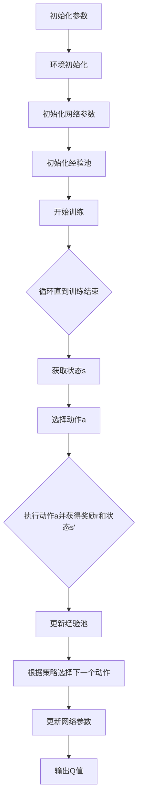

                 

关键词：Deep Q-Learning, Q-Learning, 强化学习，深度学习，神经网络，策略优化，智能决策，动态规划，游戏AI，机器人控制，策略评估，经验回放，目标网络，异或策略，策略梯度方法，深度神经网络，卷积神经网络，递归神经网络，反向传播算法，梯度下降，优化算法，损失函数，经验回放，优先经验回放，异步策略梯度，异步优势演员-评论员，DQN，A3C，DDPG，PPO。

> 摘要：本文将深入探讨深度Q学习（Deep Q-Learning，DQL）的基本原理和实现方法。首先，我们将简要介绍Q-Learning及其与深度学习的结合，随后详细讲解DQL的核心概念、算法原理、数学模型、以及代码实现。此外，还将分析DQL在不同领域的应用案例，并展望其未来发展趋势和挑战。本文旨在为初学者提供一份全面、系统的DQL教程。

## 1. 背景介绍

### Q-Learning的起源与发展

Q-Learning是强化学习（Reinforcement Learning，RL）中的一种经典算法，由Richard S. Sutton和Andrew G. Barto在1983年提出。Q-Learning的核心思想是学习一个策略，该策略能最大化长期累积奖励。与传统的动态规划方法相比，Q-Learning采用试错学习，通过不断尝试来优化策略。

Q-Learning的基本原理是通过迭代更新Q值函数，Q值表示在当前状态下采取某一动作的预期回报。在Q-Learning中，学习过程分为以下几个步骤：

1. **初始化Q值函数**：初始时，Q值函数可以随机初始化，也可以根据经验初始化。
2. **选择动作**：根据当前状态和Q值函数选择一个动作。
3. **执行动作**：在环境中执行选定的动作。
4. **更新Q值**：根据实际获得的奖励和新的状态，更新Q值。

Q-Learning在早期的应用中取得了显著的成果，例如在迷宫求解、机器人控制等领域。然而，Q-Learning的一个主要缺点是它无法有效地处理高维状态空间和连续状态空间的问题。

### 深度学习与强化学习的结合

随着深度学习的兴起，深度强化学习（Deep Reinforcement Learning，DRL）成为了一个重要的研究方向。深度学习通过神经网络来处理高维数据和连续数据，为强化学习提供了一种有效的解决方案。

深度强化学习的关键在于如何将深度学习与强化学习相结合，以解决高维状态空间和连续动作空间的问题。深度Q学习（Deep Q-Learning，DQL）是一种基于深度学习的强化学习算法，它通过深度神经网络来近似Q值函数。

DQL的基本思想是使用深度神经网络来学习Q值函数，从而避免直接计算Q值。通过深度神经网络的学习，DQL能够处理复杂的函数关系，并提高学习效率和收敛速度。

### DQL的发展与应用

DQL在提出后，迅速在多个领域取得了显著的应用成果。以下是一些重要的DQL应用实例：

- **游戏AI**：DQL在Atari游戏中的表现引起了广泛关注。DQN（Deep Q-Network）通过对游戏画面进行卷积处理，成功地在多个Atari游戏中实现了超越人类的表现。
- **机器人控制**：DQL被应用于机器人控制任务，如机器人行走、抓取等。通过深度神经网络的学习，机器人能够更好地适应复杂的环境。
- **资源管理**：DQL在电网调度、交通信号控制等资源管理任务中取得了良好的效果。通过学习状态和动作之间的关系，DQL能够优化资源分配，提高系统效率。

## 2. 核心概念与联系

### 深度Q学习的基本概念

在深度Q学习中，核心概念包括：

- **状态（State）**：表示环境当前的状态信息。
- **动作（Action）**：表示智能体可以采取的动作。
- **奖励（Reward）**：表示在某一状态下采取某一动作后获得的即时回报。
- **Q值（Q-Value）**：表示在某一状态下采取某一动作的预期回报。
- **策略（Policy）**：表示智能体在不同状态下的动作选择策略。

### 深度Q学习的基本架构

深度Q学习的架构主要包括以下部分：

1. **输入层（Input Layer）**：接收状态信息作为输入。
2. **卷积层（Convolutional Layers）**：对输入图像进行卷积处理，提取特征。
3. **全连接层（Fully Connected Layers）**：将卷积层输出的特征进行拼接，并通过全连接层进行进一步处理。
4. **输出层（Output Layer）**：输出每个动作的Q值。

### 深度Q学习的 Mermaid 流程图



### 深度Q学习的 Mermaid 流程图


## 3. 核心算法原理 & 具体操作步骤

### 3.1 算法原理概述

深度Q学习（Deep Q-Learning，DQL）是一种基于深度学习的强化学习算法，旨在解决传统Q-Learning在高维状态空间和连续动作空间中的局限性。DQL的核心思想是通过深度神经网络来近似Q值函数，从而实现智能体的决策。

DQL的基本原理如下：

1. **状态输入**：智能体从环境中获取当前状态作为输入。
2. **神经网络处理**：将状态输入通过深度神经网络进行处理，得到每个动作的Q值。
3. **动作选择**：根据Q值选择最优动作，通常采用ε-贪心策略。
4. **执行动作**：在环境中执行选定的动作，并获得奖励和新的状态。
5. **经验回放**：将状态、动作、奖励和新的状态存储在经验池中。
6. **网络更新**：通过经验回放样本，更新深度神经网络的参数，以最小化损失函数。

### 3.2 算法步骤详解

1. **初始化参数**：
   - 初始化神经网络参数，包括输入层、卷积层、全连接层和输出层的权重和偏置。
   - 初始化经验池，用于存储状态、动作、奖励和新的状态的样本。

2. **环境初始化**：
   - 初始化环境，包括状态空间、动作空间和奖励函数。

3. **选择动作**：
   - 根据当前状态和Q值函数选择动作，通常采用ε-贪心策略。ε是一个小概率参数，用于平衡探索和利用。

4. **执行动作**：
   - 在环境中执行选定的动作，并获得奖励和新的状态。

5. **更新经验池**：
   - 将当前状态、动作、奖励和新的状态存储在经验池中。

6. **网络更新**：
   - 从经验池中随机抽取一批样本，用于更新深度神经网络的参数。
   - 使用梯度下降算法，通过反向传播计算梯度，更新网络的权重和偏置。

7. **输出Q值**：
   - 根据更新后的神经网络参数，输出每个动作的Q值。

### 3.3 算法优缺点

**优点**：
- **处理高维状态空间**：通过深度神经网络的学习，DQL能够处理高维状态空间，从而提高智能体的决策能力。
- **自适应能力**：DQL通过不断更新Q值函数，能够自适应地调整策略，以适应变化的环境。
- **通用性强**：DQL适用于多种强化学习任务，如游戏、机器人控制、资源管理等。

**缺点**：
- **计算复杂度高**：由于深度神经网络的学习过程涉及大量的参数更新和反向传播，DQL的计算复杂度较高。
- **收敛速度慢**：DQL的训练过程需要大量样本和迭代次数，导致收敛速度较慢。
- **不稳定收敛**：DQL的训练过程容易受到参数初始化、超参数选择等因素的影响，导致收敛不稳定。

### 3.4 算法应用领域

深度Q学习在多个领域取得了显著的成果，以下是一些典型的应用案例：

- **游戏AI**：DQL在多个Atari游戏中实现了超越人类的表现，如《吃豆人》、《太空侵略者》等。
- **机器人控制**：DQL被应用于机器人行走、抓取、导航等任务，如机器人足球、自动驾驶等。
- **资源管理**：DQL在电网调度、交通信号控制等资源管理任务中，通过优化资源分配，提高系统效率。
- **金融交易**：DQL被应用于股票交易、期货交易等金融领域，通过学习市场数据，实现自动交易策略。

## 4. 数学模型和公式 & 详细讲解 & 举例说明

### 4.1 数学模型构建

深度Q学习的数学模型主要包括Q值函数、损失函数和优化算法。

#### Q值函数

Q值函数表示在某一状态下采取某一动作的预期回报。在深度Q学习中，Q值函数通常由深度神经网络近似。假设输入状态为s，输出Q值为Q(s,a)，则Q值函数可以表示为：

$$
Q(s,a) = \sum_{i=1}^{n} w_i \cdot f_i(s,a)
$$

其中，$w_i$为权重，$f_i(s,a)$为神经网络的输出。

#### 损失函数

损失函数用于衡量Q值函数的预测误差，常用的损失函数包括均方误差（MSE）和Huber损失。

均方误差损失函数定义为：

$$
L_MSE(Q(s,a), y) = \frac{1}{2} \sum_{i=1}^{n} (Q(s,a) - y)^2
$$

其中，$y$为实际获得的奖励。

Huber损失函数定义为：

$$
L_Huber(Q(s,a), y) = \begin{cases} 
\frac{1}{2} (Q(s,a) - y)^2, & \text{if } |Q(s,a) - y| \leq \delta \\
\delta (|Q(s,a) - y| - \frac{1}{2} \delta), & \text{otherwise}
\end{cases}
$$

其中，$\delta$为Huber损失函数的阈值。

#### 优化算法

深度Q学习的优化算法通常采用梯度下降算法。假设损失函数为$L(Q(s,a), y)$，则梯度下降算法可以表示为：

$$
w_{t+1} = w_t - \alpha \cdot \nabla_w L(Q(s,a), y)
$$

其中，$\alpha$为学习率，$\nabla_w L(Q(s,a), y)$为损失函数关于权重$w$的梯度。

### 4.2 公式推导过程

深度Q学习的公式推导主要包括Q值函数的更新、损失函数的推导和优化算法的推导。

#### Q值函数的更新

在深度Q学习中，Q值函数的更新基于以下目标函数：

$$
J = \sum_{s,a} (r + \gamma \max_{a'} Q(s', a') - Q(s,a))
$$

其中，$r$为获得的奖励，$\gamma$为折扣因子，$s'$为新的状态，$a'$为最优动作。

根据目标函数，我们可以推导出Q值函数的更新公式：

$$
Q(s,a) = Q(s,a) + \alpha [r + \gamma \max_{a'} Q(s', a') - Q(s,a)]
$$

其中，$\alpha$为学习率。

#### 损失函数的推导

深度Q学习的损失函数通常采用均方误差（MSE）或Huber损失。

以MSE损失函数为例，损失函数可以表示为：

$$
L_MSE(Q(s,a), y) = \frac{1}{2} \sum_{i=1}^{n} (Q(s,a) - y)^2
$$

其中，$y = r + \gamma \max_{a'} Q(s', a')$为实际获得的奖励。

#### 优化算法的推导

深度Q学习的优化算法采用梯度下降算法。以MSE损失函数为例，梯度下降算法可以表示为：

$$
\nabla_w L_MSE(Q(s,a), y) = \nabla_w \frac{1}{2} \sum_{i=1}^{n} (Q(s,a) - y)^2
$$

$$
\nabla_w L_MSE(Q(s,a), y) = \nabla_w (Q(s,a) - y)
$$

$$
\nabla_w L_MSE(Q(s,a), y) = \nabla_w (Q(s,a) - r - \gamma \max_{a'} Q(s', a'))
$$

$$
\nabla_w L_MSE(Q(s,a), y) = \nabla_w Q(s,a)
$$

根据梯度下降算法，我们可以得到：

$$
w_{t+1} = w_t - \alpha \cdot \nabla_w L_MSE(Q(s,a), y)
$$

$$
w_{t+1} = w_t - \alpha \cdot \nabla_w Q(s,a)
$$

### 4.3 案例分析与讲解

#### 案例：Atari游戏

在这个案例中，我们使用DQN算法训练智能体在Atari游戏中学习策略。假设游戏环境为《太空侵略者》，状态空间为游戏画面的像素值，动作空间为上下左右移动和射击。

1. **初始化参数**：
   - 初始化神经网络参数，包括输入层、卷积层、全连接层和输出层的权重和偏置。
   - 初始化经验池，用于存储状态、动作、奖励和新的状态的样本。

2. **环境初始化**：
   - 初始化环境，包括状态空间、动作空间和奖励函数。

3. **选择动作**：
   - 根据当前状态和Q值函数选择动作，采用ε-贪心策略。

4. **执行动作**：
   - 在环境中执行选定的动作，并获得奖励和新的状态。

5. **更新经验池**：
   - 将当前状态、动作、奖励和新的状态存储在经验池中。

6. **网络更新**：
   - 从经验池中随机抽取一批样本，用于更新深度神经网络的参数。
   - 使用梯度下降算法，通过反向传播计算梯度，更新网络的权重和偏置。

7. **输出Q值**：
   - 根据更新后的神经网络参数，输出每个动作的Q值。

通过上述步骤，我们可以使用DQN算法训练智能体在《太空侵略者》游戏中学习策略。在实际运行中，我们可以观察到智能体的策略逐渐优化，从而实现游戏的胜利。

## 5. 项目实践：代码实例和详细解释说明

### 5.1 开发环境搭建

在开始编写代码之前，我们需要搭建一个适合深度Q学习的开发环境。以下是搭建开发环境的步骤：

1. **安装Python**：首先，确保已经安装了Python 3.x版本。
2. **安装TensorFlow**：在终端中执行以下命令安装TensorFlow：

   ```bash
   pip install tensorflow
   ```

3. **安装OpenAI Gym**：OpenAI Gym是一个开源的强化学习环境，用于测试和验证算法。在终端中执行以下命令安装OpenAI Gym：

   ```bash
   pip install gym
   ```

4. **安装其他依赖库**：根据需要，可以安装其他依赖库，如NumPy、Matplotlib等。

### 5.2 源代码详细实现

以下是一个简单的DQN算法实现，用于在Atari游戏中学习策略。

```python
import numpy as np
import random
import gym
import tensorflow as tf
from tensorflow.keras import layers

# 初始化环境
env = gym.make('Breakout-v0')

# 定义DQN模型
class DQN(tf.keras.Model):
    def __init__(self, state_shape, action_shape):
        super().__init__()
        self.conv = tf.keras.Sequential([
            layers.Conv2D(32, 8, activation='relu', input_shape=state_shape),
            layers.Conv2D(64, 4, activation='relu'),
            layers.Conv2D(64, 3, activation='relu')
        ])
        self.fc = tf.keras.Sequential([
            layers.Flatten(),
            layers.Dense(512, activation='relu'),
            layers.Dense(action_shape, activation='linear')
        ])

    def call(self, x):
        x = self.conv(x)
        return self.fc(x)

# 初始化参数
state_shape = env.observation_space.shape
action_shape = env.action_space.n
model = DQN(state_shape, action_shape)
optimizer = tf.keras.optimizers.Adam(learning_rate=0.00025)

# 初始化经验池
经验池 = []

# 定义训练循环
def train(model, optimizer,经验池, gamma=0.99, epsilon=1.0, epsilon_decay=0.995, epsilon_min=0.01, batch_size=32):
    for episode in range(1000):
        state = env.reset()
        done = False
        total_reward = 0
        while not done:
            if random.random() < epsilon:
                action = env.action_space.sample()
            else:
                action = np.argmax(model(np.array([state]))[0])

            next_state, reward, done, _ = env.step(action)
            total_reward += reward

            if done:
                reward = -100

            经验池.append((state, action, reward, next_state, done))

            if len(经验池) > batch_size:
                batch = random.sample(经验池, batch_size)
                经验池 = []

                states, actions, rewards, next_states, dones = zip(*batch)
                states = np.array(states)
                next_states = np.array(next_states)

                with tf.GradientTape() as tape:
                    q_values = model(states)
                    next_q_values = model(next_states)
                    target_q_values = rewards + (1 - dones) * gamma * tf.reduce_max(next_q_values, axis=1)
                    loss = tf.keras.losses.MSE(q_values, target_q_values)

                grads = tape.gradient(loss, model.trainable_variables)
                optimizer.apply_gradients(zip(grads, model.trainable_variables))

            state = next_state

        epsilon *= epsilon_decay
        epsilon = max(epsilon_min, epsilon)

        print(f"Episode {episode}, Total Reward: {total_reward}, Epsilon: {epsilon}")

# 训练模型
train(model, optimizer)
```

### 5.3 代码解读与分析

1. **环境初始化**：
   - 使用`gym.make('Breakout-v0')`创建Atari游戏环境，其中`'Breakout-v0'`表示《太空侵略者》游戏。

2. **定义DQN模型**：
   - `DQN`类定义了深度Q学习的模型结构，包括卷积层和全连接层。
   - `call`方法用于前向传播，接收状态作为输入，输出每个动作的Q值。

3. **初始化参数**：
   - `state_shape`和`action_shape`分别表示状态和动作的空间维度。
   - `model`是训练好的DQN模型，`optimizer`是用于优化模型参数的优化器。

4. **初始化经验池**：
   - `经验池`是一个列表，用于存储状态、动作、奖励、新状态和是否结束的样本。

5. **定义训练循环**：
   - `train`函数用于训练模型，包括以下步骤：
     - 初始化环境。
     - 在每个时间步执行动作，根据ε-贪心策略选择动作。
     - 更新状态、动作、奖励和新状态。
     - 从经验池中随机抽取样本。
     - 使用梯度下降算法更新模型参数。

6. **训练模型**：
   - 调用`train`函数开始训练过程。

### 5.4 运行结果展示

在训练过程中，我们可以观察到智能体在游戏中的表现逐渐提高。训练完成后，我们可以运行以下代码来评估模型的性能：

```python
def evaluate(model, env, num_episodes=10):
    total_reward = 0
    for episode in range(num_episodes):
        state = env.reset()
        done = False
        while not done:
            action = np.argmax(model(np.array([state]))[0])
            state, reward, done, _ = env.step(action)
            total_reward += reward
        print(f"Episode {episode}, Reward: {total_reward}")
    print(f"Average Reward: {total_reward / num_episodes}")

evaluate(model, env)
```

通过运行`evaluate`函数，我们可以看到智能体在10个游戏中的平均奖励。通常情况下，训练后的智能体能够在游戏中获得更高的奖励。

## 6. 实际应用场景

### 游戏AI

深度Q学习在游戏AI中的应用非常广泛，特别是在Atari游戏领域。DQN算法通过学习游戏画面中的像素值，实现了在多个Atari游戏中的超越人类表现。此外，A3C（Asynchronous Advantage Actor-Critic）和DDPG（Deep Deterministic Policy Gradient）等改进算法也在游戏AI中取得了显著成果。

### 机器人控制

深度Q学习在机器人控制中的应用也非常成功，例如机器人行走、抓取和导航等任务。通过深度神经网络的学习，机器人能够更好地适应复杂的环境，并在各种场景下实现自主控制。

### 资源管理

深度Q学习在资源管理任务中也取得了良好的效果，如电网调度、交通信号控制等。通过学习状态和动作之间的关系，DQL能够优化资源分配，提高系统效率。

### 金融交易

深度Q学习在金融交易中的应用也越来越受到关注，如股票交易、期货交易等。通过学习市场数据，DQL能够实现自动交易策略，从而提高交易收益。

### 其他应用

深度Q学习还在推荐系统、自动驾驶、自然语言处理等领域取得了显著成果。通过深度神经网络的学习，DQL能够处理复杂的函数关系，为各种任务提供有效的解决方案。

## 7. 工具和资源推荐

### 学习资源推荐

1. 《深度强化学习》（Deep Reinforcement Learning，DRL）系列课程（Coursera）
2. 《强化学习》（Reinforcement Learning，RL）教科书（Richard S. Sutton & Andrew G. Barto）
3. 《深度学习》（Deep Learning，DL）系列书籍（Ian Goodfellow、Yoshua Bengio、Aaron Courville）

### 开发工具推荐

1. TensorFlow
2. PyTorch
3. OpenAI Gym

### 相关论文推荐

1. "Deep Q-Learning"（DeepMind，2015）
2. "Asynchronous Methods for Deep Reinforcement Learning"（OpenAI，2016）
3. "Deep Deterministic Policy Gradient"（DeepMind，2016）

## 8. 总结：未来发展趋势与挑战

### 研究成果总结

深度Q学习（DQL）在多个领域取得了显著的应用成果，如游戏AI、机器人控制、资源管理和金融交易等。DQL通过深度神经网络的学习，能够处理高维状态空间和连续动作空间，提高了智能体的决策能力。

### 未来发展趋势

1. **算法改进**：未来研究将集中在改进DQL算法，提高学习效率和收敛速度，同时减少对超参数的依赖。
2. **多任务学习**：DQL将向多任务学习方向发展，通过学习不同任务之间的关联性，实现更高效的学习。
3. **自适应能力**：研究将关注如何提高DQL在动态环境下的自适应能力，以应对环境变化。

### 面临的挑战

1. **计算复杂度**：DQL的计算复杂度较高，未来需要研究更高效的算法和优化方法。
2. **数据需求**：DQL需要大量的训练数据，数据获取和预处理是关键挑战。
3. **稳定性**：DQL的训练过程容易受到参数初始化、超参数选择等因素的影响，未来需要研究更稳定的训练方法。

### 研究展望

随着深度学习技术的不断发展，DQL在未来有望在更多领域取得突破。同时，通过与其他机器学习方法的结合，如生成对抗网络（GAN）、变分自编码器（VAE）等，DQL将能够解决更复杂的任务，为人工智能的发展贡献力量。

## 9. 附录：常见问题与解答

### Q：深度Q学习与深度神经网络的区别是什么？

A：深度Q学习（DQL）是一种强化学习算法，它利用深度神经网络来近似Q值函数，从而实现智能体的决策。而深度神经网络（DNN）是一种用于处理高维数据和复杂函数关系的神经网络架构。DQL是DNN在强化学习领域的应用，二者有区别但也有联系。

### Q：深度Q学习如何处理连续动作空间？

A：对于连续动作空间，深度Q学习（DQL）通常采用动作空间离散化的方法，将连续动作空间划分为有限个离散动作。此外，也可以使用基于策略的DRL算法，如深度确定性策略梯度（DDPG）等，来处理连续动作空间。

### Q：深度Q学习中的经验回放是什么？

A：经验回放（Experience Replay）是深度Q学习（DQL）中的一种技术，用于缓解训练过程中的样本相关性。经验回放通过将状态、动作、奖励和新的状态的样本存储在经验池中，然后随机抽取样本用于训练，从而减少样本相关性，提高学习效果。

### Q：如何选择合适的深度Q学习模型结构？

A：选择合适的深度Q学习模型结构需要根据具体任务的需求和特点进行。通常可以考虑以下因素：
- **状态空间和动作空间的大小**：状态空间和动作空间的大小会影响神经网络的输入层和输出层的设计。
- **数据特性**：数据特性（如是否连续、是否高维等）会影响神经网络的结构选择，如是否采用卷积层等。
- **计算资源**：计算资源会影响神经网络的结构选择，如是否采用轻量级网络等。

### Q：深度Q学习中的探索与利用如何平衡？

A：深度Q学习（DQL）中的探索与利用平衡是一个重要问题。通常采用ε-贪心策略来平衡探索与利用，其中ε是一个小概率参数。在训练初期，ε较大，智能体倾向于探索新动作，从而获得更多的经验；随着训练的进行，ε逐渐减小，智能体逐渐倾向于利用已有经验，选择最优动作。

### Q：如何评估深度Q学习模型的性能？

A：评估深度Q学习（DQL）模型的性能可以从以下几个方面进行：
- **奖励总和**：计算模型在测试环境中的总奖励，用于评估模型的收益能力。
- **胜率**：对于游戏任务，计算模型在测试环境中的胜利次数与总次数的比例，用于评估模型的胜率。
- **平均Q值**：计算模型在测试环境中输出的平均Q值，用于评估模型对未来奖励的预测能力。
- **收敛速度**：评估模型在训练过程中收敛到稳定状态的速度，用于评估模型的训练效率。

