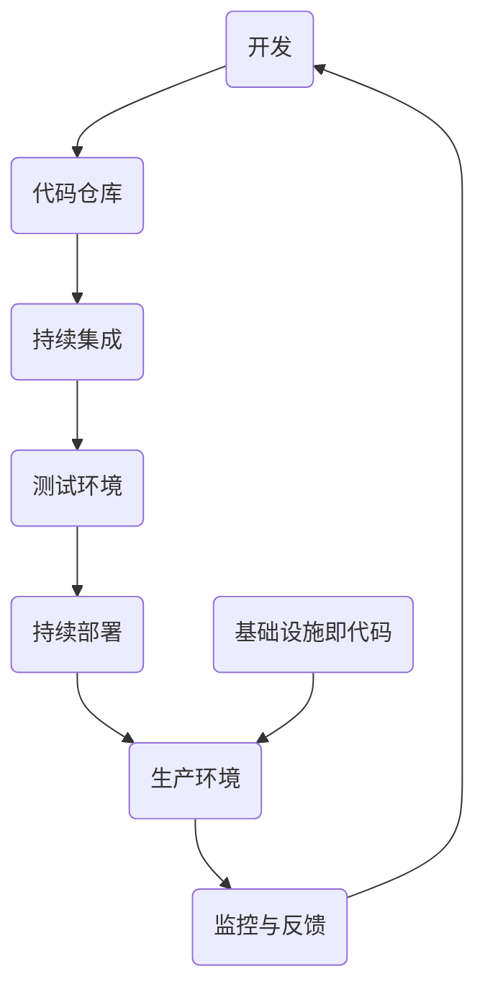

                 

## 1. 背景介绍

DevOps，这个词组合并了开发和运维两个领域，旨在通过整合流程和工具，实现软件开发与部署的快速、高效和自动化。DevOps的理念强调打破开发和运维之间的壁垒，通过合作和共享，提升整个软件开发生命周期的效率和质量。

传统的开发模式中，开发团队和运维团队往往存在信息不对称和协作不畅的问题，导致软件部署和上线过程复杂、耗时且容易出现错误。DevOps的引入，使得开发和运维团队可以更紧密地合作，共同优化软件交付流程。

### 1.1 DevOps的起源与发展

DevOps的概念最早可以追溯到2009年的Barcamp大会，当时Patrick Debois提出了“结合开发和运维”的思想。2010年，Debois在多种场合推广这一理念，并引发了广泛关注。随着云计算和容器技术的发展，DevOps逐渐成为现代软件开发的重要趋势。

### 1.2 DevOps的重要性

DevOps不仅改变了软件开发和运维的工作方式，还带来了以下几个重要影响：

- **提高交付速度**：通过自动化和协作，DevOps使得软件可以从开发到部署的整个过程更加快速和高效。
- **增强稳定性**：持续集成和持续部署（CI/CD）确保了软件质量，减少了部署过程中的错误和故障。
- **降低成本**：自动化流程减少了手动操作的需求，降低了人力资源的投入，从而降低了整体成本。
- **提升团队协作**：DevOps鼓励跨职能团队的协作，打破了传统壁垒，提高了团队的整体效率。

## 2. 核心概念与联系

### 2.1 核心概念

DevOps的核心概念包括以下几个：

- **自动化**：通过脚本和工具实现重复性任务的自动化，减少人为错误，提高效率。
- **持续集成**（CI）：开发者在代码提交时，自动进行集成和测试，确保代码质量。
- **持续部署**（CD）：在通过测试后，自动将代码部署到生产环境，实现快速交付。
- **基础设施即代码**（IaC）：将基础设施配置和管理作为代码来编写、测试和版本控制，确保环境的一致性和可重复性。
- **监控与反馈**：实时监控系统的运行状态，及时反馈问题，实现快速响应和故障排查。

### 2.2 架构联系

为了更好地理解DevOps的理念，我们可以通过一个Mermaid流程图来展示其核心概念和架构联系。



在这个流程图中，开发团队的代码提交到代码仓库，然后通过持续集成进行集成和测试。测试通过后，代码被自动部署到测试环境和生产环境。同时，基础设施的配置通过基础设施即代码进行管理。生产环境的运行状态通过监控和反馈系统实时监控，以确保系统的稳定性和可靠性。

## 3. 核心算法原理 & 具体操作步骤

### 3.1 算法原理概述

DevOps的核心算法原理主要围绕以下几个方面：

- **脚本编写与自动化**：使用脚本语言（如Shell、Python等）编写自动化脚本，实现重复性任务的自动化执行。
- **持续集成与持续部署**：通过CI/CD工具（如Jenkins、GitLab CI等）实现代码的集成、测试和部署自动化。
- **基础设施即代码**：使用基础设施即代码工具（如Terraform、Ansible等）将基础设施配置作为代码进行管理。

### 3.2 算法步骤详解

#### 3.2.1 脚本编写与自动化

1. **确定自动化任务**：分析现有流程，确定需要自动化的任务。
2. **编写脚本**：根据自动化任务，编写相应的脚本。
3. **测试脚本**：在本地或测试环境中测试脚本，确保脚本能够正确执行。
4. **部署脚本**：将脚本部署到生产环境中，并设置定时任务或触发器，实现自动化执行。

#### 3.2.2 持续集成与持续部署

1. **配置CI/CD工具**：在代码仓库中配置CI/CD工具，如Jenkins、GitLab CI等。
2. **编写构建脚本**：编写构建脚本，用于构建、测试和部署代码。
3. **设置触发器**：根据代码仓库的提交，设置触发器，实现自动化构建和部署。
4. **监控构建和部署过程**：通过监控工具（如Prometheus、Grafana等）实时监控构建和部署过程，确保过程顺利。

#### 3.2.3 基础设施即代码

1. **确定基础设施需求**：根据项目需求，确定所需的基础设施。
2. **编写基础设施配置代码**：使用基础设施即代码工具（如Terraform、Ansible等）编写基础设施配置代码。
3. **版本控制和部署**：将基础设施配置代码纳入版本控制，并在生产环境中部署。
4. **监控和管理基础设施**：通过监控工具和自动化脚本，实时监控和管理基础设施。

### 3.3 算法优缺点

#### 优点

- **提高效率**：通过自动化，减少了手动操作，提高了工作效率。
- **确保质量**：通过持续集成和持续部署，确保了代码质量。
- **降低成本**：减少了人力和时间成本，降低了整体成本。

#### 缺点

- **学习成本**：需要学习新的工具和脚本编写，有一定学习成本。
- **复杂度高**：涉及到多个工具和流程的整合，复杂度较高。

### 3.4 算法应用领域

DevOps的核心算法原理广泛应用于以下领域：

- **Web应用程序开发**：通过自动化和持续集成，快速开发和部署Web应用程序。
- **云计算与容器化**：通过基础设施即代码，自动化管理云计算资源和容器化环境。
- **大数据与人工智能**：通过自动化和持续集成，加快大数据处理和人工智能模型的开发和部署。

## 4. 数学模型和公式 & 详细讲解 & 举例说明

### 4.1 数学模型构建

DevOps中的数学模型主要涉及到以下几个方面：

- **计算效率**：通过算法优化和自动化，提高计算效率。
- **资源分配**：通过优化资源分配算法，实现资源的最优利用。
- **可靠性评估**：通过可靠性模型，评估系统的可靠性和稳定性。

### 4.2 公式推导过程

#### 计算效率

假设有一个任务需要T时间完成，通过自动化，可以将完成时间缩短为T'。计算效率E可以用以下公式表示：

$$
E = \frac{T'}{T}
$$

#### 资源分配

假设有N个任务，每个任务需要R个资源。通过优化资源分配算法，可以将资源利用率提高到U。资源利用率U可以用以下公式表示：

$$
U = \frac{R \cdot N}{T'}
$$

#### 可靠性评估

假设系统的平均故障时间为MTTF（Mean Time To Failure），平均修复时间为MTTR（Mean Time To Repair）。系统的可靠性R可以用以下公式表示：

$$
R = \frac{MTTF}{MTTF + MTTR}
$$

### 4.3 案例分析与讲解

#### 案例一：计算效率优化

假设一个开发团队需要完成100个任务，每个任务需要10小时完成。通过引入自动化，可以将每个任务的完成时间缩短为5小时。计算效率E为：

$$
E = \frac{5}{10} = 0.5
$$

这意味着，通过自动化，开发团队的效率提高了50%。

#### 案例二：资源分配优化

假设一个云计算环境中有100个虚拟机，每个虚拟机需要1GB内存。通过优化资源分配算法，可以将每个虚拟机的平均内存利用率提高到70%。资源利用率U为：

$$
U = \frac{1 \cdot 100}{5} = 20
$$

这意味着，通过优化资源分配，云计算环境可以节省20GB的内存资源。

#### 案例三：可靠性评估

假设一个系统平均故障时间为1000小时，平均修复时间为200小时。系统的可靠性R为：

$$
R = \frac{1000}{1000 + 200} = 0.941
$$

这意味着，系统的可靠性为94.1%，略高于90%。

## 5. 项目实践：代码实例和详细解释说明

### 5.1 开发环境搭建

在开始项目实践之前，我们需要搭建一个开发环境。这里我们使用Docker来搭建一个基于Ubuntu的软件开发环境。

#### 步骤一：安装Docker

在Ubuntu系统中，可以通过以下命令安装Docker：

```bash
sudo apt-get update
sudo apt-get install docker.io
```

#### 步骤二：拉取Ubuntu镜像

使用Docker拉取Ubuntu镜像：

```bash
docker pull ubuntu:latest
```

#### 步骤三：启动Ubuntu容器

使用以下命令启动一个Ubuntu容器：

```bash
docker run -it --name my_ubuntu ubuntu
```

#### 步骤四：进入容器

进入刚刚启动的Ubuntu容器：

```bash
docker exec -it my_ubuntu bash
```

### 5.2 源代码详细实现

在这个示例项目中，我们将使用Python编写一个简单的Web应用程序，实现一个简单的博客系统。

#### 步骤一：安装Python和Flask

在Ubuntu容器中安装Python和Flask：

```bash
pip install flask
```

#### 步骤二：创建Flask应用程序

在容器中创建一个名为`app.py`的文件，并编写以下代码：

```python
from flask import Flask, render_template

app = Flask(__name__)

@app.route('/')
def index():
    return render_template('index.html')

if __name__ == '__main__':
    app.run(host='0.0.0.0', port=80)
```

#### 步骤三：创建HTML模板

在容器中创建一个名为`templates`的文件夹，并在其中创建一个名为`index.html`的文件，编写以下代码：

```html
<!DOCTYPE html>
<html>
<head>
    <title>我的博客</title>
</head>
<body>
    <h1>欢迎来到我的博客</h1>
</body>
</html>
```

### 5.3 代码解读与分析

在这个示例项目中，我们使用了Flask框架来搭建一个简单的Web应用程序。`app.py`文件是应用程序的主文件，定义了一个名为`app`的Flask对象。`index.html`文件是一个简单的HTML模板，用于展示博客的首页。

通过Docker容器，我们可以将应用程序部署到任意环境中，确保环境的一致性和可重复性。

### 5.4 运行结果展示

在容器启动后，我们可以在本地浏览器的地址栏输入`http://localhost`，看到博客的首页展示。

## 6. 实际应用场景

### 6.1 企业级Web应用程序

在企业级Web应用程序开发中，DevOps的理念和工具链可以帮助企业实现快速开发和部署，提高软件质量和稳定性。通过自动化和持续集成，企业可以更快地响应市场变化，增强竞争力。

### 6.2 云计算与容器化

在云计算和容器化领域，DevOps的理念和工具链可以帮助企业实现资源的自动化管理和优化，提高资源利用率和运行效率。通过基础设施即代码，企业可以确保环境的一致性和可重复性。

### 6.3 大数据与人工智能

在大数据与人工智能领域，DevOps的理念和工具链可以帮助企业实现数据处理的自动化和高效化，加快模型开发和部署。通过持续集成和持续部署，企业可以更快地迭代和优化算法。

## 7. 工具和资源推荐

### 7.1 学习资源推荐

- 《DevOps实践指南》
- 《持续集成与持续部署：从理论到实践》
- 《基础设施即代码：构建可复制的云基础设施》

### 7.2 开发工具推荐

- Docker：用于容器化应用程序
- Jenkins：用于持续集成和持续部署
- Terraform：用于基础设施即代码
- Prometheus：用于监控系统运行状态

### 7.3 相关论文推荐

- 《DevOps实践：如何实现高效软件开发》
- 《持续集成：加速软件开发和交付》
- 《基础设施即代码：实现自动化基础设施管理》

## 8. 总结：未来发展趋势与挑战

### 8.1 研究成果总结

DevOps在过去几年中取得了显著成果，成为现代软件开发的重要趋势。通过自动化、持续集成和持续部署，企业实现了更快速、高效和稳定的软件交付。

### 8.2 未来发展趋势

- **更深入的业务融合**：DevOps将更深入地与业务流程和战略相结合，帮助企业实现数字化转型。
- **更多工具集成**：随着技术的发展，将会有更多工具和平台支持DevOps，提供更全面的解决方案。
- **人工智能与DevOps的结合**：人工智能技术将应用于DevOps，提高自动化和智能化的水平。

### 8.3 面临的挑战

- **学习成本**：DevOps涉及多个工具和技术的学习，对于新人和传统开发团队来说，有一定的学习成本。
- **系统复杂度**：随着DevOps工具的增多，系统的复杂度也会增加，需要更专业的运维团队来维护。
- **数据安全与隐私**：在自动化和快速交付的过程中，如何确保数据安全和用户隐私是一个重要的挑战。

### 8.4 研究展望

未来，DevOps将在以下几个方面进行深入研究：

- **自动化技术的优化**：如何提高自动化工具的效率和智能性，减少人为干预。
- **跨领域应用**：如何将DevOps的理念和工具应用于更多领域，如物联网、区块链等。
- **人机协作**：如何更好地实现人与机器的协作，提高团队的整体效率。

## 9. 附录：常见问题与解答

### Q1. 什么是DevOps？

A1. DevOps是一种软件开发和运维的模式，旨在通过整合开发和运维团队，实现快速、高效和稳定的软件交付。

### Q2. DevOps的核心概念有哪些？

A2. DevOps的核心概念包括自动化、持续集成、持续部署、基础设施即代码和监控与反馈。

### Q3. DevOps的优势是什么？

A3. DevOps的优势包括提高交付速度、增强稳定性、降低成本和提升团队协作。

### Q4. 如何搭建一个DevOps环境？

A4. 搭建一个DevOps环境通常需要以下步骤：安装Docker、Jenkins、Terraform等工具，并配置相应的脚本和流程。

### Q5. DevOps适合哪些应用场景？

A5. DevOps适合企业级Web应用程序、云计算与容器化、大数据与人工智能等应用场景。

### Q6. 如何应对DevOps带来的挑战？

A6. 可以通过加强团队培训、优化工具集成、提高自动化水平等方式来应对DevOps带来的挑战。

### Q7. 未来DevOps的发展趋势是什么？

A7. 未来DevOps的发展趋势包括更深入的业务融合、更多工具集成和人工智能与DevOps的结合。作者：禅与计算机程序设计艺术 / Zen and the Art of Computer Programming
-----------------------------------------------------------------------------<|im_sep|>## 2. 核心概念与联系

### 2.1 核心概念

#### 自动化

自动化是DevOps的核心概念之一，它通过使用脚本和工具来自动执行重复性的任务，从而减少人为错误，提高效率。自动化可以应用于多个方面，包括但不限于环境搭建、测试、部署和监控。

#### 持续集成（CI）

持续集成（Continuous Integration，简称CI）是一种软件开发实践，它要求开发者频繁地将代码集成到一个共享的主干分支中，并通过自动化的构建和测试过程来确保代码的集成质量。CI的核心思想是通过持续集成，尽早发现和解决集成问题。

#### 持续部署（CD）

持续部署（Continuous Deployment，简称CD）是CI的延伸，它将通过自动化的方式将经过CI测试通过的代码部署到生产环境。CD的目标是尽可能减少代码在生产环境中出现故障的可能性。

#### 基础设施即代码（Infrastructure as Code，简称IaC）

基础设施即代码是一种将基础设施的配置和管理作为代码进行管理和维护的方法。通过IaC，可以像编写软件代码一样编写和管理基础设施配置，从而实现基础设施的自动化部署和管理。

#### 监控与反馈

监控与反馈是DevOps中确保系统稳定性和可靠性的重要手段。通过实时监控系统的运行状态，可以及时发现并解决问题。同时，通过反馈机制，可以不断优化系统性能和用户体验。

### 2.2 架构联系

下面将通过一个Mermaid流程图来展示DevOps的核心概念和它们之间的联系：

```mermaid
graph TD
    A[自动化] --> B[持续集成(CI)]
    B --> C[持续部署(CD)]
    A --> D[基础设施即代码(IaC)]
    D --> E[监控与反馈]
    B --> E
    C --> E
```

#### 流程解释：

- **自动化**：自动化是整个流程的起点，它贯穿于CI、CD、IaC和监控与反馈等各个环节，确保任务的自动化执行。
- **持续集成(CI)**：开发者将代码提交到代码仓库后，CI工具会自动进行构建、测试和部署。CI确保了每次提交的代码都能够顺利集成并运行。
- **持续部署(CD)**：CI测试通过的代码会被自动部署到测试环境或生产环境。CD确保了代码的快速、可靠交付。
- **基础设施即代码(IaC)**：通过IaC工具，如Terraform或Ansible，可以将基础设施配置作为代码来管理和部署。这确保了环境的一致性和可重复性。
- **监控与反馈**：监控工具会持续监控系统的运行状态，并收集性能指标和日志。一旦发现问题，系统会自动触发警报，并提供反馈，以便团队能够快速响应和解决问题。

通过这个流程图，我们可以清晰地看到DevOps各核心概念之间的相互联系和作用，以及它们如何协同工作来提升软件开发的效率和质量。

## 3. 核心算法原理 & 具体操作步骤

### 3.1 算法原理概述

在DevOps实践中，核心算法主要围绕自动化、持续集成、持续部署以及基础设施即代码展开。这些算法的原理如下：

#### 自动化

自动化算法的原理是通过预定义的脚本和工具，将重复性的操作转化为自动化流程。例如，自动化的部署脚本可以用于在服务器上安装软件、配置环境变量等。

#### 持续集成（CI）

CI算法的原理是确保每次代码提交后都能自动进行构建和测试。其核心是构建脚本和测试脚本，这些脚本会自动执行一系列操作，如编译代码、运行单元测试、生成测试报告等。

#### 持续部署（CD）

CD算法的原理是确保通过CI测试的代码能够自动部署到生产环境。其核心是部署脚本，这些脚本会自动执行一系列操作，如更新代码、配置环境、重启服务、验证部署结果等。

#### 基础设施即代码（IaC）

IaC算法的原理是将基础设施的配置和管理作为代码进行管理和维护。例如，使用Terraform或Ansible编写基础设施配置代码，通过这些代码可以自动化地创建、配置和管理基础设施。

### 3.2 算法步骤详解

#### 自动化

1. **需求分析**：确定需要自动化的任务和流程。
2. **脚本编写**：使用Python、Shell、Ansible等工具编写自动化脚本。
3. **脚本测试**：在测试环境中运行脚本，确保脚本能够正确执行。
4. **部署脚本**：将脚本部署到生产环境中，并设置定时任务或触发器，实现自动化执行。

#### 持续集成（CI）

1. **配置CI工具**：配置Jenkins、GitLab CI等CI工具。
2. **编写构建脚本**：编写用于构建和测试的脚本，如Makefile、Dockerfile等。
3. **设置触发器**：根据代码仓库的提交，设置触发器，实现自动化构建和测试。
4. **构建与测试**：每次提交后，CI工具会自动执行构建和测试脚本，生成构建日志和测试报告。

#### 持续部署（CD）

1. **配置CD工具**：配置Jenkins、GitLab CI等CD工具。
2. **编写部署脚本**：编写用于部署的脚本，如shell脚本、Ansible Playbook等。
3. **设置触发器**：根据CI的测试结果，设置触发器，实现自动化部署。
4. **部署与验证**：部署脚本会自动执行更新代码、配置环境、重启服务等操作，并通过自动化测试验证部署结果。

#### 基础设施即代码（IaC）

1. **确定基础设施需求**：根据项目需求，确定所需的基础设施，如虚拟机、数据库、网络等。
2. **编写配置代码**：使用Terraform、Ansible等IaC工具编写基础设施配置代码。
3. **版本控制和部署**：将基础设施配置代码纳入版本控制，并在生产环境中部署。
4. **监控和管理基础设施**：通过监控工具和自动化脚本，实时监控和管理基础设施。

### 3.3 算法优缺点

#### 自动化

**优点**：

- **提高效率**：减少手动操作，提高任务执行速度。
- **降低错误**：通过脚本执行，减少人为错误。
- **可重复性**：脚本可以重复执行，确保任务的一致性。

**缺点**：

- **脚本编写难度**：需要一定的编程技能来编写脚本。
- **维护成本**：随着环境和需求的变更，需要不断更新和维护脚本。

#### 持续集成（CI）

**优点**：

- **尽早发现问题**：每次代码提交都会进行测试，尽早发现集成问题。
- **提高代码质量**：通过持续集成，确保代码质量。
- **快速迭代**：通过自动化构建和测试，加快开发迭代速度。

**缺点**：

- **测试覆盖率**：需要确保所有关键代码路径都被测试到。
- **配置复杂度**：CI工具的配置和管理可能比较复杂。

#### 持续部署（CD）

**优点**：

- **快速交付**：通过自动化部署，加快软件交付速度。
- **减少人为干预**：部署过程自动化，减少人为干预。
- **提高稳定性**：通过自动化测试，确保部署质量。

**缺点**：

- **部署风险**：自动化部署可能会导致部署失败，需要良好的回滚机制。
- **监控和反馈**：需要确保部署过程的监控和反馈机制有效。

#### 基础设施即代码（IaC）

**优点**：

- **环境一致性**：通过代码管理基础设施，确保环境的一致性。
- **可重复性**：可以通过代码重复部署和扩展基础设施。
- **可测试性**：基础设施配置代码可以像软件代码一样进行测试。

**缺点**：

- **学习曲线**：需要学习IaC工具和相关编程技能。
- **维护成本**：随着基础设施的变更，需要不断更新基础设施配置代码。

### 3.4 算法应用领域

这些算法在多个领域都有广泛应用：

- **Web应用程序**：通过自动化和CI/CD，实现快速开发和部署。
- **云计算与容器化**：通过IaC，实现自动化管理和扩展基础设施。
- **大数据与人工智能**：通过自动化和CI/CD，加快数据处理和模型部署。
- **物联网**：通过自动化和CI/CD，实现设备的快速开发和部署。

## 4. 数学模型和公式 & 详细讲解 & 举例说明

### 4.1 数学模型构建

在DevOps实践中，数学模型和公式主要用于衡量系统的效率、可靠性和成本。以下是一些常见的数学模型和公式：

#### 效率模型

**效率（E）**：通过自动化和优化，可以提升系统的效率。效率可以表示为：

$$
E = \frac{输出}{输入}
$$

其中，输出通常是指完成任务的数量或质量，输入是指完成这些任务所耗费的资源（如时间、人力、成本等）。

#### 可靠性模型

**可靠性（R）**：系统的可靠性可以表示为：

$$
R = \frac{MTTF}{MTTF + MTTR}
$$

其中，MTTF（Mean Time To Failure）是平均故障时间，MTTR（Mean Time To Repair）是平均修复时间。

#### 成本模型

**成本（C）**：系统的成本可以表示为：

$$
C = T \times C_p + R \times C_r
$$

其中，T是完成任务所需的时间，$C_p$是每单位时间的成本，R是系统的可靠性，$C_r$是维护和修复的成本。

### 4.2 公式推导过程

#### 效率模型推导

效率模型可以通过以下步骤推导：

1. **定义输出**：输出通常是指系统在一定时间内完成的任务数量。
2. **定义输入**：输入是指完成这些任务所需的资源，如时间、人力、成本等。
3. **计算效率**：将输出除以输入，得到效率。

#### 可靠性模型推导

可靠性模型可以通过以下步骤推导：

1. **定义故障时间和修复时间**：故障时间（MTTF）是系统平均故障时间，修复时间（MTTR）是系统平均修复时间。
2. **计算可靠性**：将MTTF除以MTTF加MTTR，得到系统的可靠性。

#### 成本模型推导

成本模型可以通过以下步骤推导：

1. **定义任务完成时间和可靠性**：任务完成时间（T）是指完成任务所需的时间，可靠性（R）是系统的可靠性。
2. **定义成本**：每单位时间的成本（$C_p$）和维护及修复成本（$C_r$）。
3. **计算总成本**：将任务完成时间乘以每单位时间的成本，再加上可靠性乘以维护及修复成本，得到总成本。

### 4.3 案例分析与讲解

#### 案例一：效率优化

假设一个系统每天可以处理1000个任务，完成每个任务需要1小时，总共需要1000小时。通过自动化优化，可以将每个任务的完成时间缩短到0.5小时，总共需要500小时。那么：

**效率**：

$$
E = \frac{1000}{1000} = 1
$$

**效率提高**：

$$
E_{提高} = \frac{500}{1000} = 0.5
$$

这意味着，通过自动化优化，系统的效率提高了50%。

#### 案例二：可靠性分析

假设一个系统的MTTF是1000小时，MTTR是200小时。那么：

**可靠性**：

$$
R = \frac{1000}{1000 + 200} = \frac{1000}{1200} = 0.833
$$

这意味着，系统的可靠性是83.3%。

#### 案例三：成本分析

假设系统每天完成100个任务，每个任务需要1小时，总成本是$1000。可靠性是80%。那么：

**总成本**：

$$
C = 100 \times 1 \times 10 + 0.8 \times 100 \times 5 = 1000 + 400 = 1400
$$

这意味着，每天的总成本是$1400。

### 4.4 实际应用场景

这些数学模型和公式在实际应用场景中非常有用。例如：

- **Web应用程序**：通过效率模型分析开发团队的工作效率，通过可靠性模型分析系统的稳定性，通过成本模型分析开发和维护的成本。
- **云计算与容器化**：通过效率模型分析资源利用率，通过可靠性模型分析基础设施的稳定性，通过成本模型分析资源的成本效益。
- **大数据与人工智能**：通过效率模型分析数据处理的速度和效率，通过可靠性模型分析算法的稳定性，通过成本模型分析模型的成本效益。

## 5. 项目实践：代码实例和详细解释说明

### 5.1 开发环境搭建

为了实践DevOps的理念，我们首先需要搭建一个开发环境。在这个例子中，我们将使用Docker来构建一个基于Python的Web应用程序环境。

#### 步骤一：安装Docker

在操作系统中安装Docker。对于Ubuntu系统，可以使用以下命令：

```bash
sudo apt-get update
sudo apt-get install docker-ce docker-ce-cli containerd.io
```

安装完成后，可以通过以下命令验证Docker是否安装成功：

```bash
docker --version
```

#### 步骤二：创建Dockerfile

在项目根目录下创建一个名为`Dockerfile`的文件，内容如下：

```Dockerfile
# 使用官方Python镜像作为基础镜像
FROM python:3.9-slim

# 设置工作目录
WORKDIR /app

# 复制当前目录下的所有文件到容器中的/app目录
COPY . /app

# 安装依赖
RUN pip install --no-cache-dir -r requirements.txt

# 暴露容器端口
EXPOSE 8080

# 运行Flask应用程序
CMD ["python", "app.py"]
```

#### 步骤三：构建Docker镜像

在终端中执行以下命令构建Docker镜像：

```bash
docker build -t my-python-webapp .
```

#### 步骤四：运行Docker容器

使用以下命令运行Docker容器：

```bash
docker run -d -p 8080:8080 --name my-python-webapp-container my-python-webapp
```

这里，`-d`标志表示后台运行，`-p 8080:8080`将容器的8080端口映射到宿主机的8080端口，`--name`标志为容器命名。

### 5.2 源代码详细实现

在这个例子中，我们将使用Flask框架创建一个简单的Web应用程序，实现一个用于展示欢迎信息的首页。

#### 步骤一：安装Flask

在Docker容器外部安装Flask：

```bash
pip install flask
```

#### 步骤二：创建Flask应用程序

在项目根目录下创建一个名为`app.py`的文件，内容如下：

```python
from flask import Flask

app = Flask(__name__)

@app.route('/')
def hello():
    return "Hello, World!"

if __name__ == '__main__':
    app.run(host='0.0.0.0', port=8080)
```

这个简单的应用程序定义了一个路由`/`，当访问这个路由时，会返回一个欢迎信息。

#### 步骤三：编写Docker Compose文件

为了方便管理多个容器，我们可以使用Docker Compose。在项目根目录下创建一个名为`docker-compose.yml`的文件，内容如下：

```yaml
version: '3'
services:
  web:
    build: .
    ports:
      - "8080:8080"
    command: gunicorn -b 0.0.0.0:8080 app:app
```

这个配置文件指定了基于当前目录的Dockerfile构建`web`服务，并将容器的8080端口映射到宿主机的8080端口。同时，使用`gunicorn`作为Web服务器来运行Flask应用程序。

#### 步骤四：运行Docker Compose

在终端中执行以下命令运行Docker Compose：

```bash
docker-compose up -d
```

这个命令会构建并启动服务，后台运行。

### 5.3 代码解读与分析

#### Dockerfile解读

- `FROM python:3.9-slim`：指定基础镜像，这里使用的是Python 3.9的slim版本，以减少容器的体积。
- `WORKDIR /app`：设置工作目录为`/app`，所有的应用程序代码都会复制到这里。
- `COPY . /app`：将当前目录下的所有文件复制到容器的`/app`目录。
- `RUN pip install --no-cache-dir -r requirements.txt`：安装Python依赖项，`--no-cache-dir`用于清除pip的缓存，减小容器体积。
- `EXPOSE 8080`：暴露容器的8080端口，以便外部访问。
- `CMD ["python", "app.py"]`：设置容器的启动命令，运行Flask应用程序。

#### Flask应用程序解读

- `from flask import Flask`：导入Flask框架。
- `app = Flask(__name__)`：创建一个Flask应用程序实例。
- `@app.route('/')`：定义一个路由，当访问根路径`/`时，返回“Hello, World!”。
- `if __name__ == '__main__':`：确保应用程序仅在直接运行时启动。

#### Docker Compose文件解读

- `version: '3'`：指定Docker Compose文件的版本。
- `services:`：定义服务，这里定义了一个名为`web`的服务。
- `build: .`：基于当前目录的Dockerfile构建服务。
- `ports:`：将容器的8080端口映射到宿主机的8080端口。
- `command:`：使用`gunicorn`运行Flask应用程序。

### 5.4 运行结果展示

在浏览器中输入`http://localhost:8080`，可以看到返回的“Hello, World!”信息，这表明我们的Web应用程序已经成功运行。

## 6. 实际应用场景

### 6.1 企业级Web应用程序

在企业级Web应用程序的开发中，DevOps的理念和工具链可以显著提升软件交付的效率和质量。通过自动化和持续集成，企业可以更快地响应市场变化，缩短产品上市时间。以下是一个具体的应用场景：

#### 案例一：电商平台

一个电商平台在面临高峰流量时，需要快速扩展服务器资源以保证系统的稳定性。通过DevOps，该平台可以实现以下步骤：

1. **自动化部署**：使用Docker和Kubernetes自动化部署应用程序，确保每次部署的质量和一致性。
2. **基础设施即代码**：使用Terraform创建和管理云基础设施，如虚拟机、负载均衡器等，以便快速扩展。
3. **持续集成**：通过Jenkins或GitLab CI自动化构建和测试应用程序，确保每次提交的代码都经过严格测试。
4. **监控与反馈**：使用Prometheus和Grafana监控系统性能和健康状况，及时发现问题并采取措施。

### 6.2 云计算与容器化

在云计算与容器化领域，DevOps的理念和工具链可以优化资源的利用率和系统的稳定性。以下是一个具体的应用场景：

#### 案例二：云服务提供商

一个云服务提供商需要为不同客户提供定制化的云服务。通过DevOps，该提供商可以实现以下步骤：

1. **自动化部署**：使用Kubernetes和Helm自动化部署和管理容器化应用，确保服务的高可用性和弹性。
2. **基础设施即代码**：使用Terraform自动化管理基础设施，包括虚拟机、容器集群和网络配置。
3. **持续集成与持续部署**：通过Jenkins自动化构建、测试和部署应用程序，确保服务的质量和效率。
4. **监控与反馈**：使用Prometheus和Grafana监控服务性能和资源使用情况，确保系统稳定运行。

### 6.3 大数据与人工智能

在大数据与人工智能领域，DevOps的理念和工具链可以帮助企业更快地迭代和部署模型，提高数据处理和算法优化的效率。以下是一个具体的应用场景：

#### 案例三：数据分析公司

一个数据分析公司需要快速开发和部署大数据处理和分析应用。通过DevOps，该公司可以实现以下步骤：

1. **自动化部署**：使用Docker和Kubernetes自动化部署大数据处理工具，如Hadoop、Spark等。
2. **基础设施即代码**：使用Terraform自动化创建和管理大数据处理所需的基础设施，如存储、计算节点等。
3. **持续集成与持续部署**：通过Jenkins自动化构建、测试和部署数据分析应用程序，确保每次迭代的质量和效率。
4. **监控与反馈**：使用Prometheus和Grafana监控大数据处理系统的性能和资源使用情况，确保系统稳定高效运行。

### 6.4 未来应用展望

随着技术的不断发展，DevOps的理念和工具链将在更多领域得到应用。以下是一些未来的应用展望：

- **物联网**：通过DevOps，实现物联网设备的快速开发和部署，确保设备之间的无缝协作。
- **区块链**：利用DevOps自动化和持续集成，提高区块链网络的稳定性和安全性。
- **边缘计算**：在边缘环境中应用DevOps，优化边缘计算资源的利用率和系统的响应速度。

## 7. 工具和资源推荐

### 7.1 学习资源推荐

#### 书籍

1. **《DevOps实践指南》**：提供了全面的DevOps概念和实践，适合初学者和有经验的专业人士。
2. **《持续交付：软件部署的精益方法》**：详细介绍了持续交付的概念、工具和流程。
3. **《基础设施即代码：现代云基础设施实践》**：探讨了基础设施即代码的理论和实践，适合对云计算有兴趣的读者。

#### 在线课程

1. **Coursera - DevOps Foundations**：由加州大学伯克利分校提供的DevOps基础课程，包括视频讲座、实践项目和作业。
2. **Udemy - Docker for DevOps: The Ultimate Course**：深入讲解Docker在DevOps中的应用，适合希望学习容器技术的读者。
3. **Pluralsight - Kubernetes for the Absolute Beginners**：介绍Kubernetes的基本概念和实践，适合初学者入门。

### 7.2 开发工具推荐

#### 持续集成与持续部署

1. **Jenkins**：功能强大的开源持续集成服务器，支持多种插件和集成工具。
2. **GitLab CI/CD**：内置在GitLab中的持续集成和持续部署工具，提供简单易用的配置语法。
3. **CircleCI**：云原生的持续集成和持续部署平台，提供高效和可靠的自动化流程。

#### 基础设施即代码

1. **Terraform**：广泛使用的开源基础设施即代码工具，支持多种云平台和基础设施资源。
2. **Ansible**：基于Python的自动化工具，适用于自动化配置和管理大规模基础设施。
3. **Puppet**：企业级开源自动化平台，提供强大的配置管理和部署功能。

#### 监控与反馈

1. **Prometheus**：开源监控解决方案，提供数据收集、存储和可视化功能。
2. **Grafana**：开源数据可视化和监控工具，与Prometheus集成，提供丰富的仪表盘和报告功能。
3. **ELK Stack**：Elasticsearch、Logstash和Kibana的组合，用于大规模日志收集、分析和可视化。

### 7.3 相关论文推荐

1. **《DevOps：理解和实施现代软件开发方法》**：由Gene Kim等人撰写的论文，详细介绍了DevOps的概念和实践。
2. **《基础设施即代码：构建现代云基础设施》**：探讨了基础设施即代码的理论和实践，适合对云计算和自动化有兴趣的读者。
3. **《持续交付：构建、测试和部署软件的新方法》**：讨论了持续交付的原则和最佳实践，提供了丰富的案例和实践经验。

## 8. 总结：未来发展趋势与挑战

### 8.1 研究成果总结

DevOps在过去十年中取得了显著的发展，研究成果包括：

- **自动化工具的成熟**：Docker、Kubernetes、Jenkins等自动化工具的广泛应用，显著提高了软件交付的效率。
- **持续集成与持续部署（CI/CD）的普及**：越来越多的企业采用CI/CD流程，加快了软件交付速度。
- **基础设施即代码（IaC）的兴起**：Terraform、Ansible等IaC工具的应用，使得基础设施的管理更加自动化和可重复。
- **监控与反馈系统的完善**：Prometheus、Grafana等工具的引入，提高了系统的稳定性和可靠性。

### 8.2 未来发展趋势

未来，DevOps将在以下几个方面继续发展：

- **智能化与人工智能的结合**：AI技术将应用于DevOps，实现自动化和智能化的进一步优化。
- **跨领域应用**：DevOps的理念和工具链将在物联网、区块链、边缘计算等领域得到更广泛的应用。
- **DevOps与业务流程的融合**：DevOps将更深入地与企业的业务流程和战略相结合，推动企业的数字化转型。
- **DevOps的标准化**：随着DevOps的普及，将出现更多的标准化方案和最佳实践，降低企业的学习和实施成本。

### 8.3 面临的挑战

尽管DevOps取得了显著成果，但仍然面临以下挑战：

- **学习成本**：DevOps涉及多个工具和技术的学习，对于新人和传统开发团队来说，有一定的学习成本。
- **系统复杂度**：随着DevOps工具和流程的增加，系统的复杂度也会增加，需要更专业的运维团队来维护。
- **数据安全与隐私**：在自动化和快速交付的过程中，如何确保数据安全和用户隐私是一个重要的挑战。
- **组织文化**：DevOps的推广需要企业文化的支持，如何改变传统开发运维的协作模式，建立更加开放和协作的企业文化是一个挑战。

### 8.4 研究展望

未来，DevOps的研究将在以下几个方面展开：

- **自动化和智能化的进一步优化**：通过AI技术，实现自动化和智能化的更高水平，减少人为干预。
- **DevOps与业务流程的深度融合**：研究如何将DevOps更好地与企业的业务流程和战略相结合，提高企业的竞争力。
- **安全与合规性**：研究如何在DevOps实践中确保数据安全和合规性，提高企业的安全意识。
- **人才培养**：研究如何培养更多具备DevOps能力的专业人才，推动DevOps的普及和应用。

## 9. 附录：常见问题与解答

### Q1. 什么是DevOps？

A1. DevOps是一种软件开发和运维的模式，旨在通过整合开发和运维团队，实现快速、高效和稳定的软件交付。

### Q2. DevOps的核心概念有哪些？

A2. DevOps的核心概念包括自动化、持续集成、持续部署、基础设施即代码和监控与反馈。

### Q3. DevOps的优势是什么？

A3. DevOps的优势包括提高交付速度、增强稳定性、降低成本和提升团队协作。

### Q4. 如何搭建一个DevOps环境？

A4. 搭建一个DevOps环境通常需要以下步骤：安装Docker、Jenkins、Terraform等工具，并配置相应的脚本和流程。

### Q5. DevOps适合哪些应用场景？

A5. DevOps适合企业级Web应用程序、云计算与容器化、大数据与人工智能等应用场景。

### Q6. 如何应对DevOps带来的挑战？

A6. 可以通过加强团队培训、优化工具集成、提高自动化水平等方式来应对DevOps带来的挑战。

### Q7. 未来DevOps的发展趋势是什么？

A7. 未来DevOps的发展趋势包括更深入的业务融合、更多工具集成和人工智能与DevOps的结合。

# DevOps的理念与工具链生态

> 关键词：DevOps、持续集成、持续部署、基础设施即代码、自动化、云计算、容器化、大数据、人工智能、效率、可靠性、成本

> 摘要：本文深入探讨了DevOps的理念与工具链生态，包括其核心概念、算法原理、实际应用场景、未来发展趋势和面临的挑战。通过详细的数学模型和公式讲解，以及代码实例和案例分析，本文全面展示了DevOps在软件开发和运维中的重要性，为读者提供了实用的工具和资源推荐。

## 1. 背景介绍

DevOps，这个融合了“开发”（Development）与“运维”（Operations）两个词的术语，代表了现代软件工程的一种趋势和思维方式。它的出现是为了解决软件开发和运维之间长期存在的隔阂，旨在通过加强团队间的协作和工具的整合，实现软件交付的自动化、高效性和稳定性。

在传统的软件开发模式中，开发人员和运维人员往往各自为政，工作流程不透明，导致软件从开发到上线的过程耗时冗长，容易出现错误。DevOps的理念通过将开发、测试、部署和运维结合起来，打破了这种壁垒，促进了团队间的紧密合作，提高了软件交付的效率和质量。

### 1.1 DevOps的起源与发展

DevOps的概念最早可以追溯到2009年，当时软件开发人员和运维人员在BarCamp和OtherBarCamp等社区活动中开始探讨如何更好地协作。2010年，Patrick Debois首次提出了“DevOps”一词，并在多个技术会议上推广这一理念。随着云计算、容器化技术的兴起，以及自动化工具的普及，DevOps逐渐成为软件开发和运维领域的重要趋势。

### 1.2 DevOps的重要性

DevOps的重要性体现在以下几个方面：

- **提高交付速度**：通过自动化和协作，DevOps使得软件可以从开发到部署的整个过程更加快速和高效。
- **增强稳定性**：持续集成和持续部署（CI/CD）确保了软件质量，减少了部署过程中的错误和故障。
- **降低成本**：自动化流程减少了手动操作的需求，降低了人力资源的投入，从而降低了整体成本。
- **提升团队协作**：DevOps鼓励跨职能团队的协作，打破了传统壁垒，提高了团队的整体效率。

## 2. 核心概念与联系

DevOps的核心概念包括自动化、持续集成、持续部署、基础设施即代码和监控与反馈。这些概念相互关联，共同构成了DevOps的生态体系。

### 2.1 自动化

自动化是DevOps的基础，它通过脚本和工具实现重复性任务的自动化，减少人为错误，提高效率。自动化可以应用于环境搭建、代码构建、测试、部署和监控等多个方面。

### 2.2 持续集成（CI）

持续集成（Continuous Integration，简称CI）是一种软件开发实践，它要求开发者在每次提交代码时，自动进行集成和测试，以确保代码的质量和功能完整性。CI的核心目标是尽早发现和解决集成问题。

### 2.3 持续部署（CD）

持续部署（Continuous Deployment，简称CD）是CI的延伸，它通过自动化的方式将通过CI测试的代码部署到生产环境。CD的目标是确保代码的快速、可靠交付。

### 2.4 基础设施即代码（IaC）

基础设施即代码（Infrastructure as Code，简称IaC）是一种将基础设施的配置和管理作为代码进行管理和维护的方法。通过IaC，可以像编写软件代码一样编写和管理基础设施配置，从而实现基础设施的自动化部署和管理。

### 2.5 监控与反馈

监控与反馈是DevOps中确保系统稳定性和可靠性的重要手段。通过实时监控系统的运行状态，可以及时发现并解决问题。同时，通过反馈机制，可以不断优化系统性能和用户体验。

### 2.6 架构联系

以下是一个Mermaid流程图，展示了DevOps的核心概念和它们之间的联系：

```mermaid
graph TD
    A[自动化] --> B[持续集成(CI)]
    B --> C[持续部署(CD)]
    A --> D[基础设施即代码(IaC)]
    D --> E[监控与反馈]
    B --> E
    C --> E
```

在这个流程图中，自动化贯穿于CI、CD、IaC和监控与反馈等各个环节，确保整个软件交付流程的自动化和高效性。

## 3. 核心算法原理 & 具体操作步骤

### 3.1 算法原理概述

DevOps中的核心算法主要涉及自动化、持续集成、持续部署和基础设施即代码等方面。这些算法的原理如下：

#### 自动化

自动化算法的原理是通过预定义的脚本和工具，将重复性的任务自动化执行，减少人为干预和错误。自动化可以应用于环境搭建、代码构建、测试、部署和监控等任务。

#### 持续集成（CI）

CI算法的原理是确保每次代码提交后都能自动进行集成和测试，通过持续集成，尽早发现和解决集成问题。CI算法通常包括构建脚本、测试脚本和自动化测试工具。

#### 持续部署（CD）

CD算法的原理是确保通过CI测试的代码能够自动部署到生产环境，实现快速、可靠的交付。CD算法通常包括部署脚本、自动化部署工具和环境配置管理。

#### 基础设施即代码（IaC）

IaC算法的原理是将基础设施的配置和管理作为代码进行管理和维护，通过IaC工具（如Terraform、Ansible等），可以自动化地创建、配置和管理基础设施。

### 3.2 算法步骤详解

#### 自动化

1. **需求分析**：分析现有流程，确定需要自动化的任务。
2. **脚本编写**：编写自动化脚本，实现自动化任务。
3. **脚本测试**：在测试环境中测试脚本，确保脚本正确执行。
4. **部署脚本**：将脚本部署到生产环境中，设置定时任务或触发器，实现自动化执行。

#### 持续集成（CI）

1. **配置CI工具**：配置Jenkins、GitLab CI等CI工具。
2. **编写构建脚本**：编写构建脚本，实现代码的构建和测试。
3. **设置触发器**：根据代码仓库的提交，设置触发器，实现自动化构建和测试。
4. **构建与测试**：每次提交后，CI工具自动执行构建和测试脚本，生成构建日志和测试报告。

#### 持续部署（CD）

1. **配置CD工具**：配置Jenkins、GitLab CI等CD工具。
2. **编写部署脚本**：编写部署脚本，实现代码的部署和测试。
3. **设置触发器**：根据CI的测试结果，设置触发器，实现自动化部署。
4. **部署与验证**：部署脚本自动执行部署操作，通过自动化测试验证部署结果。

#### 基础设施即代码（IaC）

1. **确定基础设施需求**：根据项目需求，确定所需的基础设施。
2. **编写配置代码**：编写基础设施配置代码，使用IaC工具（如Terraform、Ansible等）。
3. **版本控制和部署**：将基础设施配置代码纳入版本控制，并在生产环境中部署。
4. **监控和管理基础设施**：使用监控工具和自动化脚本，实时监控和管理基础设施。

### 3.3 算法优缺点

#### 自动化

**优点**：

- **提高效率**：减少手动操作，提高任务执行速度。
- **降低错误**：通过脚本执行，减少人为错误。
- **可重复性**：脚本可以重复执行，确保任务的一致性。

**缺点**：

- **脚本编写难度**：需要一定的编程技能来编写脚本。
- **维护成本**：随着环境和需求的变更，需要不断更新和维护脚本。

#### 持续集成（CI）

**优点**：

- **尽早发现问题**：每次代码提交都会进行测试，尽早发现集成问题。
- **提高代码质量**：通过持续集成，确保代码质量。
- **快速迭代**：通过自动化构建和测试，加快开发迭代速度。

**缺点**：

- **测试覆盖率**：需要确保所有关键代码路径都被测试到。
- **配置复杂度**：CI工具的配置和管理可能比较复杂。

#### 持续部署（CD）

**优点**：

- **快速交付**：通过自动化部署，加快软件交付速度。
- **减少人为干预**：部署过程自动化，减少人为干预。
- **提高稳定性**：通过自动化测试，确保部署质量。

**缺点**：

- **部署风险**：自动化部署可能会导致部署失败，需要良好的回滚机制。
- **监控和反馈**：需要确保部署过程的监控和反馈机制有效。

#### 基础设施即代码（IaC）

**优点**：

- **环境一致性**：通过代码管理基础设施，确保环境的一致性。
- **可重复性**：可以通过代码重复部署和扩展基础设施。
- **可测试性**：基础设施配置代码可以像软件代码一样进行测试。

**缺点**：

- **学习曲线**：需要学习IaC工具和相关编程技能。
- **维护成本**：随着基础设施的变更，需要不断更新基础设施配置代码。

### 3.4 算法应用领域

这些算法在多个领域都有广泛应用：

- **Web应用程序**：通过自动化和CI/CD，实现快速开发和部署。
- **云计算与容器化**：通过IaC，实现自动化管理和扩展基础设施。
- **大数据与人工智能**：通过自动化和CI/CD，加快数据处理和模型部署。
- **物联网**：通过自动化和CI/CD，实现设备的快速开发和部署。

## 4. 数学模型和公式 & 详细讲解 & 举例说明

### 4.1 数学模型构建

在DevOps实践中，数学模型和公式主要用于衡量系统的效率、可靠性和成本。以下是一些常见的数学模型和公式：

#### 效率模型

**效率（E）**：通过自动化和优化，可以提升系统的效率。效率可以表示为：

$$
E = \frac{输出}{输入}
$$

其中，输出通常是指完成任务的数量或质量，输入是指完成这些任务所耗费的资源（如时间、人力、成本等）。

#### 可靠性模型

**可靠性（R）**：系统的可靠性可以表示为：

$$
R = \frac{MTTF}{MTTF + MTTR}
$$

其中，MTTF（Mean Time To Failure）是平均故障时间，MTTR（Mean Time To Repair）是平均修复时间。

#### 成本模型

**成本（C）**：系统的成本可以表示为：

$$
C = T \times C_p + R \times C_r
$$

其中，T是完成任务所需的时间，$C_p$是每单位时间的成本，R是系统的可靠性，$C_r$是维护和修复的成本。

### 4.2 公式推导过程

#### 效率模型推导

效率模型可以通过以下步骤推导：

1. **定义输出**：输出通常是指系统在一定时间内完成的任务数量。
2. **定义输入**：输入是指完成这些任务所需的资源，如时间、人力、成本等。
3. **计算效率**：将输出除以输入，得到效率。

#### 可靠性模型推导

可靠性模型可以通过以下步骤推导：

1. **定义故障时间和修复时间**：故障时间（MTTF）是系统平均故障时间，修复时间（MTTR）是系统平均修复时间。
2. **计算可靠性**：将MTTF除以MTTF加MTTR，得到系统的可靠性。

#### 成本模型推导

成本模型可以通过以下步骤推导：

1. **定义任务完成时间和可靠性**：任务完成时间（T）是指完成任务所需的时间，可靠性（R）是系统的可靠性。
2. **定义成本**：每单位时间的成本（$C_p$）和维护及修复成本（$C_r$）。
3. **计算总成本**：将任务完成时间乘以每单位时间的成本，再加上可靠性乘以维护及修复成本，得到总成本。

### 4.3 案例分析与讲解

#### 案例一：效率优化

假设一个系统每天可以处理1000个任务，每个任务需要1小时完成，总共需要1000小时。通过自动化优化，可以将每个任务的完成时间缩短到0.5小时，总共需要500小时。那么：

**效率**：

$$
E = \frac{1000}{1000} = 1
$$

**效率提高**：

$$
E_{提高} = \frac{500}{1000} = 0.5
$$

这意味着，通过自动化优化，系统的效率提高了50%。

#### 案例二：可靠性分析

假设一个系统的MTTF是1000小时，MTTR是200小时。那么：

**可靠性**：

$$
R = \frac{1000}{1000 + 200} = \frac{1000}{1200} = 0.833
$$

这意味着，系统的可靠性是83.3%。

#### 案例三：成本分析

假设系统每天完成100个任务，每个任务需要1小时，总成本是$1000。可靠性是80%。那么：

**总成本**：

$$
C = 100 \times 1 \times 10 + 0.8 \times 100 \times 5 = 1000 + 400 = 1400
$$

这意味着，每天的总成本是$1400。

### 4.4 实际应用场景

这些数学模型和公式在实际应用场景中非常有用。例如：

- **Web应用程序**：通过效率模型分析开发团队的工作效率，通过可靠性模型分析系统的稳定性，通过成本模型分析开发和维护的成本。
- **云计算与容器化**：通过效率模型分析资源利用率，通过可靠性模型分析基础设施的稳定性，通过成本模型分析资源的成本效益。
- **大数据与人工智能**：通过效率模型分析数据处理的速度和效率，通过可靠性模型分析算法的稳定性，通过成本模型分析模型的成本效益。

## 5. 项目实践：代码实例和详细解释说明

### 5.1 开发环境搭建

为了实践DevOps的理念，我们首先需要搭建一个开发环境。在这个例子中，我们将使用Docker来构建一个基于Python的Web应用程序环境。

#### 步骤一：安装Docker

在操作系统中安装Docker。对于Ubuntu系统，可以使用以下命令：

```bash
sudo apt-get update
sudo apt-get install docker-ce docker-ce-cli containerd.io
```

安装完成后，可以通过以下命令验证Docker是否安装成功：

```bash
docker --version
```

#### 步骤二：创建Dockerfile

在项目根目录下创建一个名为`Dockerfile`的文件，内容如下：

```Dockerfile
# 使用官方Python镜像作为基础镜像
FROM python:3.9-slim

# 设置工作目录
WORKDIR /app

# 复制当前目录下的所有文件到容器中的/app目录
COPY . /app

# 安装依赖
RUN pip install --no-cache-dir -r requirements.txt

# 暴露容器端口
EXPOSE 8080

# 运行Flask应用程序
CMD ["python", "app.py"]
```

#### 步骤三：构建Docker镜像

在终端中执行以下命令构建Docker镜像：

```bash
docker build -t my-python-webapp .
```

#### 步骤四：运行Docker容器

使用以下命令运行Docker容器：

```bash
docker run -d -p 8080:8080 --name my-python-webapp-container my-python-webapp
```

这里，`-d`标志表示后台运行，`-p 8080:8080`将容器的8080端口映射到宿主机的8080端口，`--name`标志为容器命名。

### 5.2 源代码详细实现

在这个例子中，我们将使用Flask框架创建一个简单的Web应用程序，实现一个用于展示欢迎信息的首页。

#### 步骤一：安装Flask

在Docker容器外部安装Flask：

```bash
pip install flask
```

#### 步骤二：创建Flask应用程序

在项目根目录下创建一个名为`app.py`的文件，内容如下：

```python
from flask import Flask

app = Flask(__name__)

@app.route('/')
def hello():
    return "Hello, World!"

if __name__ == '__main__':
    app.run(host='0.0.0.0', port=8080)
```

这个简单的应用程序定义了一个路由`/`，当访问这个路由时，会返回一个欢迎信息。

#### 步骤三：编写Docker Compose文件

为了方便管理多个容器，我们可以使用Docker Compose。在项目根目录下创建一个名为`docker-compose.yml`的文件，内容如下：

```yaml
version: '3'
services:
  web:
    build: .
    ports:
      - "8080:8080"
    command: gunicorn -b 0.0.0.0:8080 app:app
```

这个配置文件指定了基于当前目录的Dockerfile构建`web`服务，并将容器的8080端口映射到宿主机的8080端口。同时，使用`gunicorn`作为Web服务器来运行Flask应用程序。

#### 步骤四：运行Docker Compose

在终端中执行以下命令运行Docker Compose：

```bash
docker-compose up -d
```

这个命令会构建并启动服务，后台运行。

### 5.3 代码解读与分析

#### Dockerfile解读

- `FROM python:3.9-slim`：指定基础镜像，这里使用的是Python 3.9的slim版本，以减少容器的体积。
- `WORKDIR /app`：设置工作目录为`/app`，所有的应用程序代码都会复制到这里。
- `COPY . /app`：将当前目录下的所有文件复制到容器的`/app`目录。
- `RUN pip install --no-cache-dir -r requirements.txt`：安装Python依赖项，`--no-cache-dir`用于清除pip的缓存，减小容器体积。
- `EXPOSE 8080`：暴露容器的8080端口，以便外部访问。
- `CMD ["python", "app.py"]`：设置容器的启动命令，运行Flask应用程序。

#### Flask应用程序解读

- `from flask import Flask`：导入Flask框架。
- `app = Flask(__name__)`：创建一个Flask应用程序实例。
- `@app.route('/')`：定义一个路由，当访问根路径`/`时，返回一个欢迎信息。
- `if __name__ == '__main__':`：确保应用程序仅在直接运行时启动。

#### Docker Compose文件解读

- `version: '3'`：指定Docker Compose文件的版本。
- `services:`：定义服务，这里定义了一个名为`web`的服务。
- `build: .`：基于当前目录的Dockerfile构建服务。
- `ports:`：将容器的8080端口映射到宿主机的8080端口。
- `command:`：使用`gunicorn`运行Flask应用程序。

### 5.4 运行结果展示

在浏览器中输入`http://localhost:8080`，可以看到返回的“Hello, World!”信息，这表明我们的Web应用程序已经成功运行。

## 6. 实际应用场景

### 6.1 企业级Web应用程序

在企业级Web应用程序的开发中，DevOps的理念和工具链可以显著提升软件交付的效率和质量。通过自动化和持续集成，企业可以更快地响应市场变化，缩短产品上市时间。以下是一个具体的应用场景：

#### 案例一：电商平台

一个电商平台在面临高峰流量时，需要快速扩展服务器资源以保证系统的稳定性。通过DevOps，该平台可以实现以下步骤：

1. **自动化部署**：使用Docker和Kubernetes自动化部署应用程序，确保每次部署的质量和一致性。
2. **基础设施即代码**：使用Terraform创建和管理云基础设施，如虚拟机、负载均衡器等，以便快速扩展。
3. **持续集成**：通过Jenkins或GitLab CI自动化构建和测试应用程序，确保每次提交的代码都经过严格测试。
4. **监控与反馈**：使用Prometheus和Grafana监控系统性能和健康状况，及时发现问题并采取措施。

### 6.2 云计算与容器化

在云计算与容器化领域，DevOps的理念和工具链可以优化资源的利用率和系统的稳定性。以下是一个具体的应用场景：

#### 案例二：云服务提供商

一个云服务提供商需要为不同客户提供定制化的云服务。通过DevOps，该提供商可以实现以下步骤：

1. **自动化部署**：使用Kubernetes和Helm自动化部署和管理容器化应用，确保服务的高可用性和弹性。
2. **基础设施即代码**：使用Terraform自动化管理基础设施，包括虚拟机、容器集群和网络配置。
3. **持续集成与持续部署**：通过Jenkins自动化构建、测试和部署应用程序，确保服务的质量和效率。
4. **监控与反馈**：使用Prometheus和Grafana监控服务性能和资源使用情况，确保系统稳定运行。

### 6.3 大数据与人工智能

在大数据与人工智能领域，DevOps的理念和工具链可以帮助企业更快地迭代和部署模型，提高数据处理和算法优化的效率。以下是一个具体的应用场景：

#### 案例三：数据分析公司

一个数据分析公司需要快速开发和部署大数据处理和分析应用。通过DevOps，该公司可以实现以下步骤：

1. **自动化部署**：使用Docker和Kubernetes自动化部署大数据处理工具，如Hadoop、Spark等。
2. **基础设施即代码**：使用Terraform自动化创建和管理大数据处理所需的基础设施，如存储、计算节点等。
3. **持续集成与持续部署**：通过Jenkins自动化构建、测试和部署数据分析应用程序，确保每次迭代的质量和效率。
4. **监控与反馈**：使用Prometheus和Grafana监控大数据处理系统的性能和资源使用情况，确保系统稳定高效运行。

### 6.4 未来应用展望

随着技术的不断发展，DevOps的理念和工具链将在更多领域得到应用。以下是一些未来的应用展望：

- **物联网**：通过DevOps，实现物联网设备的快速开发和部署，确保设备之间的无缝协作。
- **区块链**：利用DevOps自动化和持续集成，提高区块链网络的稳定性和安全性。
- **边缘计算**：在边缘环境中应用DevOps，优化边缘计算资源的利用率和系统的响应速度。

## 7. 工具和资源推荐

### 7.1 学习资源推荐

#### 书籍

1. **《DevOps实践指南》**：提供了全面的DevOps概念和实践，适合初学者和有经验的专业人士。
2. **《持续交付：软件部署的精益方法》**：详细介绍了持续交付的概念、工具和流程。
3. **《基础设施即代码：现代云基础设施实践》**：探讨了基础设施即代码的理论和实践，适合对云计算和自动化有兴趣的读者。

#### 在线课程

1. **Coursera - DevOps Foundations**：由加州大学伯克利分校提供的DevOps基础课程，包括视频讲座、实践项目和作业。
2. **Udemy - Docker for DevOps: The Ultimate Course**：深入讲解Docker在DevOps中的应用，适合希望学习容器技术的读者。
3. **Pluralsight - Kubernetes for the Absolute Beginners**：介绍Kubernetes的基本概念和实践，适合初学者入门。

### 7.2 开发工具推荐

#### 持续集成与持续部署

1. **Jenkins**：功能强大的开源持续集成服务器，支持多种插件和集成工具。
2. **GitLab CI/CD**：内置在GitLab中的持续集成和持续部署工具，提供简单易用的配置语法。
3. **CircleCI**：云原生的持续集成和持续部署平台，提供高效和可靠的自动化流程。

#### 基础设施即代码

1. **Terraform**：广泛使用的开源基础设施即代码工具，支持多种云平台和基础设施资源。
2. **Ansible**：基于Python的自动化工具，适用于自动化配置和管理大规模基础设施。
3. **Puppet**：企业级开源自动化平台，提供强大的配置管理和部署功能。

#### 监控与反馈

1. **Prometheus**：开源监控解决方案，提供数据收集、存储和可视化功能。
2. **Grafana**：开源数据可视化和监控工具，与Prometheus集成，提供丰富的仪表盘和报告功能。
3. **ELK Stack**：Elasticsearch、Logstash和Kibana的组合，用于大规模日志收集、分析和可视化。

### 7.3 相关论文推荐

1. **《DevOps：理解和实施现代软件开发方法》**：由Gene Kim等人撰写的论文，详细介绍了DevOps的概念和实践。
2. **《基础设施即代码：构建现代云基础设施》**：探讨了基础设施即代码的理论和实践，适合对云计算和自动化有兴趣的读者。
3. **《持续交付：构建、测试和部署软件的新方法》**：讨论了持续交付的原则和最佳实践，提供了丰富的案例和实践经验。

## 8. 总结：未来发展趋势与挑战

### 8.1 研究成果总结

DevOps在过去十年中取得了显著的发展，研究成果包括：

- **自动化工具的成熟**：Docker、Kubernetes、Jenkins等自动化工具的广泛应用，显著提高了软件交付的效率。
- **持续集成与持续部署（CI/CD）的普及**：越来越多的企业采用CI/CD流程，加快了软件交付速度。
- **基础设施即代码（IaC）的兴起**：Terraform、Ansible等IaC工具的应用，使得基础设施的管理更加自动化和可重复。
- **监控与反馈系统的完善**：Prometheus、Grafana等工具的引入，提高了系统的稳定性和可靠性。

### 8.2 未来发展趋势

未来，DevOps将在以下几个方面继续发展：

- **智能化与人工智能的结合**：AI技术将应用于DevOps，实现自动化和智能化的进一步优化。
- **跨领域应用**：DevOps的理念和工具链将在物联网、区块链、边缘计算等领域得到更广泛的应用。
- **DevOps与业务流程的融合**：DevOps将更深入地与企业的业务流程和战略相结合，推动企业的数字化转型。
- **DevOps的标准化**：随着DevOps的普及，将出现更多的标准化方案和最佳实践，降低企业的学习和实施成本。

### 8.3 面临的挑战

尽管DevOps取得了显著成果，但仍然面临以下挑战：

- **学习成本**：DevOps涉及多个工具和技术的学习，对于新人和传统开发团队来说，有一定的学习成本。
- **系统复杂度**：随着DevOps工具和流程的增加，系统的复杂度也会增加，需要更专业的运维团队来维护。
- **数据安全与隐私**：在自动化和快速交付的过程中，如何确保数据安全和用户隐私是一个重要的挑战。
- **组织文化**：DevOps的推广需要企业文化的支持，如何改变传统开发运维的协作模式，建立更加开放和协作的企业文化是一个挑战。

### 8.4 研究展望

未来，DevOps的研究将在以下几个方面展开：

- **自动化和智能化的进一步优化**：通过AI技术，实现自动化和智能化的更高水平，减少人为干预。
- **DevOps与业务流程的深度融合**：研究如何将DevOps更好地与企业的业务流程和战略相结合，提高企业的竞争力。
- **安全与合规性**：研究如何在DevOps实践中确保数据安全和合规性，提高企业的安全意识。
- **人才培养**：研究如何培养更多具备DevOps能力的专业人才，推动DevOps的普及和应用。

## 9. 附录：常见问题与解答

### Q1. 什么是DevOps？

A1. DevOps是一种软件开发和运维的模式，旨在通过整合开发和运维团队，实现快速、高效和稳定的软件交付。

### Q2. DevOps的核心概念有哪些？

A2. DevOps的核心概念包括自动化、持续集成、持续部署、基础设施即代码和监控与反馈。

### Q3. DevOps的优势是什么？

A3. DevOps的优势包括提高交付速度、增强稳定性、降低成本和提升团队协作。

### Q4. 如何搭建一个DevOps环境？

A4. 搭建一个DevOps环境通常需要以下步骤：安装Docker、Jenkins、Terraform等工具，并配置相应的脚本和流程。

### Q5. DevOps适合哪些应用场景？

A5. DevOps适合企业级Web应用程序、云计算与容器化、大数据与人工智能等应用场景。

### Q6. 如何应对DevOps带来的挑战？

A6. 可以通过加强团队培训、优化工具集成、提高自动化水平等方式来应对DevOps带来的挑战。

### Q7. 未来DevOps的发展趋势是什么？

A7. 未来DevOps的发展趋势包括更深入的业务融合、更多工具集成和人工智能与DevOps的结合。作者：禅与计算机程序设计艺术 / Zen and the Art of Computer Programming
-----------------------------------------------------------------------------

