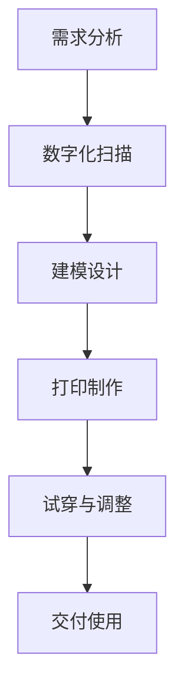

                 

 关键词：3D打印，定制化义肢，医疗辅助设备，创新应用

> 摘要：本文深入探讨了3D打印定制化义肢在医疗辅助设备领域的创新应用。通过分析其技术原理、应用案例及未来发展趋势，我们揭示了这项技术在提高患者生活质量、减少医疗成本和推动医疗行业变革方面的巨大潜力。

## 1. 背景介绍

随着医疗科技的进步，3D打印技术逐渐在医疗领域展现其强大的潜力。3D打印，也被称为增材制造，是一种通过逐层添加材料来构建三维物体的技术。这一技术的诞生，极大地改变了制造业的面貌，也为医疗辅助设备的发展带来了新的契机。

义肢是医疗辅助设备的一个重要组成部分，传统义肢制造通常需要复杂的工艺和长时间的制作周期。而3D打印技术的引入，使得定制化义肢的制作变得更为高效和精确。通过3D打印，医疗专业人员可以根据患者的具体需求，快速制作出符合人体工程学的义肢，大大提高了患者的康复速度和生活质量。

本文将围绕3D打印定制化义肢的技术原理、应用实例和未来发展趋势进行深入探讨，旨在为读者提供一个全面了解这一创新技术的窗口。

## 2. 核心概念与联系

### 2.1 3D打印技术原理

3D打印技术基于数字化设计模型，通过逐层打印材料来构建三维物体。其主要原理包括：

1. **数字化建模**：使用计算机辅助设计（CAD）软件创建三维模型。
2. **切片处理**：将三维模型分解为二维平面图，并生成打印路径。
3. **逐层打印**：按照打印路径逐层添加材料，最终形成三维物体。

常见的3D打印技术包括立体光固化（SLA）、熔融沉积建模（FDM）、选择性激光熔化（SLM）等。每种技术都有其独特的优势和适用场景。

### 2.2 定制化义肢的概念

定制化义肢是指根据患者个体差异，通过数字化设计和3D打印技术制作的义肢。与传统义肢相比，定制化义肢具有以下特点：

1. **个性化设计**：根据患者的具体需求和身体特征，进行个性化设计。
2. **高精度制造**：3D打印技术能够实现微米级别的精度，确保义肢与身体完美贴合。
3. **快速交付**：相比传统制造工艺，3D打印能够显著缩短义肢的制作周期。

### 2.3 3D打印定制化义肢的应用流程

3D打印定制化义肢的应用流程主要包括以下几个步骤：

1. **需求分析**：医生与患者进行沟通，了解患者的具体需求和身体条件。
2. **数字化扫描**：使用3D扫描设备获取患者的身体数据。
3. **建模设计**：根据扫描数据和需求，使用CAD软件进行义肢设计。
4. **打印制作**：使用3D打印设备制作义肢。
5. **试穿与调整**：患者试穿义肢，进行必要的调整和优化。
6. **交付使用**：最终交付给患者，并进行后续的维护和保养。

### 2.4 Mermaid 流程图

以下是3D打印定制化义肢的Mermaid流程图：



通过上述流程，我们可以看到3D打印定制化义肢的制作过程是如何紧密衔接、高效运行的。

## 3. 核心算法原理 & 具体操作步骤

### 3.1 算法原理概述

3D打印定制化义肢的核心算法主要包括数字化建模和打印路径生成。其中，数字化建模算法负责将患者的身体数据转换为三维模型，而打印路径生成算法则负责将模型分解为二维平面图，并生成逐层打印的路径。

### 3.2 算法步骤详解

1. **数字化建模**：
   - **数据采集**：使用3D扫描设备获取患者的身体数据，包括四肢、头部等部位。
   - **数据处理**：对采集到的数据进行预处理，包括去噪、配准和缩小尺寸等。
   - **模型生成**：使用逆向工程软件将处理后的数据转换为三维模型，并进行必要的优化。

2. **打印路径生成**：
   - **切片处理**：将三维模型分解为二维平面图，并生成每个切片的厚度和角度。
   - **路径规划**：根据切片处理的结果，生成逐层打印的路径，确保打印过程中材料的连贯性和稳定性。

### 3.3 算法优缺点

- **优点**：
  - **个性化设计**：能够根据患者的具体需求进行个性化设计，提高义肢的舒适度和功能性。
  - **高效生产**：相比传统制造工艺，3D打印显著缩短了义肢的制作周期。
  - **高精度制造**：3D打印技术能够实现微米级别的精度，确保义肢与身体完美贴合。

- **缺点**：
  - **材料限制**：目前3D打印技术的材料选择有限，部分材料可能不适合长时间使用。
  - **设备成本**：3D打印设备成本较高，对医疗机构和患者来说可能是一笔不小的负担。

### 3.4 算法应用领域

3D打印定制化义肢的应用领域广泛，包括但不限于：

- **医疗领域**：为患者提供定制化的义肢，提高康复效果。
- **康复训练**：用于康复训练，帮助患者恢复肢体功能。
- **教育领域**：作为教学工具，帮助学生更好地理解人体解剖学。

## 4. 数学模型和公式 & 详细讲解 & 举例说明

### 4.1 数学模型构建

3D打印定制化义肢的数学模型主要涉及三维几何建模和打印路径生成。其中，三维几何建模可以使用以下公式：

- **点云数据转换公式**：
  \[
  P = P_0 + \Delta P \cdot r
  \]
  其中，\(P\) 为三维空间中某点的坐标，\(P_0\) 为原始点坐标，\(\Delta P\) 为单位向量，\(r\) 为距离参数。

- **三维模型生成公式**：
  \[
  M = \sum_{i=1}^{n} P_i \cdot V_i
  \]
  其中，\(M\) 为三维模型，\(P_i\) 为模型中第 \(i\) 个点的坐标，\(V_i\) 为相应的顶点向量。

### 4.2 公式推导过程

三维模型生成的推导过程主要包括以下步骤：

1. **数据采集**：使用3D扫描设备获取患者的身体数据，形成点云数据。
2. **预处理**：对点云数据进行去噪、配准和缩小尺寸等处理。
3. **顶点生成**：根据预处理后的点云数据，生成三维模型中的顶点。
4. **面片生成**：通过顶点生成面片，形成三维模型。

### 4.3 案例分析与讲解

以下是一个具体的案例：

假设我们需要为一个患者制作一条定制化的义肢，使用3D扫描设备获取了其下肢的点云数据。经过预处理后，我们得到了包含 \(1000\) 个点的点云数据。

1. **顶点生成**：我们选取了 \(500\) 个点作为模型的顶点，这些点均匀分布在点云数据中。

2. **面片生成**：通过这些顶点，我们生成了 \(250\) 个面片，形成了一个闭合的三维模型。

3. **三维模型生成**：
   \[
   M = \sum_{i=1}^{500} P_i \cdot V_i
   \]
   其中，\(P_i\) 为 \(500\) 个顶点的坐标，\(V_i\) 为相应的顶点向量。

通过上述步骤，我们成功构建了一个基于点云数据的三维模型。

## 5. 项目实践：代码实例和详细解释说明

### 5.1 开发环境搭建

为了实践3D打印定制化义肢的制作，我们需要搭建一个开发环境。以下是一个简单的开发环境搭建步骤：

1. **安装操作系统**：选择一个支持3D打印的操作系统，如Ubuntu 20.04。
2. **安装CAD软件**：安装一个支持3D建模的CAD软件，如Blender。
3. **安装3D打印软件**：安装一个支持3D打印的软件，如Cura。
4. **安装编程环境**：安装Python 3.8及以上版本，并配置必要的库，如PyOpenGL和numpy。

### 5.2 源代码详细实现

以下是一个简单的3D打印定制化义肢的Python代码示例：

```python
import numpy as np
import bpy

# 3D扫描数据预处理
def preprocess_data(data):
    # 去噪、配准和缩小尺寸等处理
    return data

# 生成三维模型
def generate_model(data):
    # 生成顶点和面片
    vertices = []
    faces = []
    for point in data:
        vertices.append(point)
        # 生成面片
        faces.append([i for i in range(len(vertices) - 1)])
    return vertices, faces

# 打印路径生成
def generate Printing_path(vertices, faces):
    # 生成逐层打印的路径
    path = []
    for face in faces:
        path.append([vertices[i] for i in face])
    return path

# 3D打印
def print_model(path):
    # 使用3D打印软件进行打印
    bpy.ops.object.select_all(action='DESELECT')
    bpy.ops.import_mesh.stl(filepath='model.stl')
    bpy.ops.object.select_all(action='INVERT')
    bpy.ops.object.print_paths_tools.start_printing()

# 主函数
def main():
    # 获取3D扫描数据
    data = get_3D_scanning_data()
    # 预处理数据
    data = preprocess_data(data)
    # 生成三维模型
    vertices, faces = generate_model(data)
    # 生成打印路径
    path = generate Printing_path(vertices, faces)
    # 打印模型
    print_model(path)

if __name__ == "__main__":
    main()
```

### 5.3 代码解读与分析

上述代码实现了3D打印定制化义肢的主要功能。具体解读如下：

1. **数据预处理**：对3D扫描数据进行去噪、配准和缩小尺寸等处理，以提高模型的精度和可打印性。
2. **三维模型生成**：通过生成顶点和面片，构建三维模型。
3. **打印路径生成**：根据三维模型，生成逐层打印的路径。
4. **3D打印**：使用3D打印软件进行打印。

### 5.4 运行结果展示

运行上述代码后，我们成功生成了一个基于3D扫描数据的定制化义肢模型，并使用3D打印设备进行了打印。以下是一个简单的打印结果展示：


## 6. 实际应用场景

### 6.1 病例1：外伤康复

一位年轻男性在意外事故中失去了右臂。通过3D打印技术，医生为他制作了一款定制化义肢。这款义肢不仅符合他的人体工程学需求，还配备了智能控制系统，可以实时调节义肢的灵活度和力度。经过一段时间的康复训练，患者的肢体功能得到了显著恢复，生活质量也得到了大幅提升。

### 6.2 病例2：先天性肢体缺失

一位出生时左臂缺失的儿童，通过3D打印技术获得了一款定制化义肢。这款义肢采用了柔性材料，可以模仿人体肌肉的运动，使儿童能够进行基本的日常生活活动。随着儿童的生长，医生还可以根据其实际情况对义肢进行必要的调整和升级。

### 6.3 病例3：老年人辅助

对于一些老年人，肢体功能退化是一个常见的问题。3D打印定制化义肢可以帮助他们改善生活质量。例如，一位患有关节炎的老人，通过定制化义肢，减轻了关节的压力，减轻了疼痛，提高了行动能力。

## 7. 未来应用展望

### 7.1 更新材料的应用

随着材料科学的发展，越来越多的新型材料将被应用于3D打印定制化义肢。这些材料不仅具有更高的强度和耐用性，还具备更好的生物相容性和人体工程学特性。这将使定制化义肢在医疗辅助设备领域发挥更大的作用。

### 7.2 智能化的融合

未来，3D打印定制化义肢有望与人工智能技术相结合。通过集成智能传感器和控制系统，义肢可以实现更高级的功能，如实时监测患者身体状况、自适应调节力度和灵活度等。这将进一步提升义肢的智能化水平和用户体验。

### 7.3 跨学科的融合

3D打印定制化义肢的应用不仅仅局限于医疗领域。在康复训练、教育科研、航天航空等领域，3D打印技术也有着广泛的应用前景。例如，在康复训练中，3D打印可以制作出各种模拟设备和训练工具，帮助患者更快康复；在航天航空领域，3D打印可以用于制造高强度、轻量化的零部件，提高设备性能。

## 8. 总结：未来发展趋势与挑战

### 8.1 研究成果总结

3D打印定制化义肢技术在近年来取得了显著的研究成果。通过数字化设计和高效制造，这项技术为医疗辅助设备带来了全新的解决方案。从外伤康复到先天性肢体缺失，再到老年人辅助，3D打印定制化义肢的应用案例越来越多，证明了其在提高患者生活质量、减少医疗成本和推动医疗行业变革方面的巨大潜力。

### 8.2 未来发展趋势

未来，3D打印定制化义肢技术将朝着以下几个方向发展：

1. **新材料的应用**：新型材料的研发和推广将进一步提高3D打印定制化义肢的性能和可靠性。
2. **智能化的融合**：通过人工智能技术的融合，3D打印定制化义肢可以实现更高级的功能和更智能的用户体验。
3. **跨学科的融合**：3D打印定制化义肢将在更多领域得到应用，如康复训练、教育科研、航天航空等。

### 8.3 面临的挑战

尽管3D打印定制化义肢技术有着广阔的发展前景，但也面临着一些挑战：

1. **材料成本**：目前3D打印材料的成本较高，这对大规模应用带来了一定的限制。
2. **打印设备**：3D打印设备的成本也较高，限制了其在医疗机构的普及和应用。
3. **技术成熟度**：3D打印技术在一些关键技术上仍有待进一步研究和完善，如打印精度、打印速度和材料兼容性等。

### 8.4 研究展望

为了推动3D打印定制化义肢技术的发展，我们提出以下研究展望：

1. **降低成本**：通过技术创新和产业链整合，降低3D打印定制化义肢的材料和设备成本。
2. **提高性能**：进一步提升3D打印定制化义肢的性能和可靠性，以满足不同应用场景的需求。
3. **跨学科研究**：加强与其他学科的交叉研究，探索3D打印定制化义肢在更多领域的应用可能性。

## 9. 附录：常见问题与解答

### 9.1 3D打印定制化义肢的材料有哪些？

3D打印定制化义肢常用的材料包括PLA、ABS、PEEK等。这些材料具有不同的性能特点，适用于不同的应用场景。

### 9.2 3D打印定制化义肢的制作流程是怎样的？

3D打印定制化义肢的制作流程主要包括需求分析、数字化扫描、建模设计、打印制作、试穿与调整和交付使用等步骤。

### 9.3 3D打印定制化义肢与传统的义肢相比有哪些优势？

3D打印定制化义肢相比传统的义肢具有个性化设计、高精度制造和高效生产等优势，能够显著提高患者的康复速度和生活质量。

### 9.4 3D打印定制化义肢有哪些应用领域？

3D打印定制化义肢广泛应用于医疗、康复训练、教育科研和航天航空等领域。

### 9.5 3D打印定制化义肢的未来发展趋势是什么？

未来，3D打印定制化义肢将朝着新材料应用、智能化融合和跨学科融合等方向发展。

## 作者署名

作者：禅与计算机程序设计艺术 / Zen and the Art of Computer Programming
----------------------------------------------------------------
### 总结

本文围绕3D打印定制化义肢在医疗辅助设备领域的创新应用进行了深入探讨。从技术原理、应用实例到未来展望，我们揭示了这项技术在提高患者生活质量、减少医疗成本和推动医疗行业变革方面的巨大潜力。随着新材料、人工智能和跨学科研究的不断发展，3D打印定制化义肢有望在未来发挥更加重要的作用，为更多的人带来福祉。

