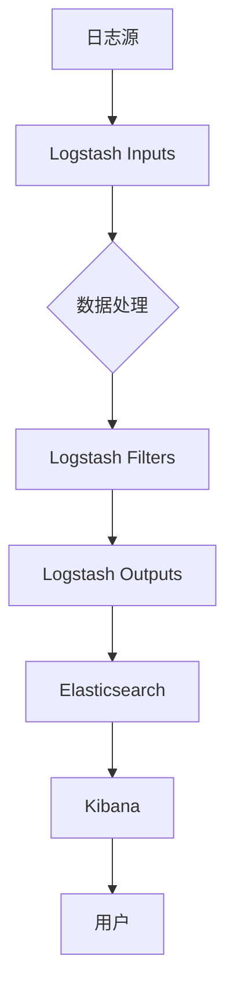

                 

关键词：ELK，日志采集，日志分析，优化，ELK架构，开源工具，Elasticsearch，Logstash，Kibana

## 摘要

随着数字化转型的不断深入，日志数据作为系统运维和性能监控的重要依据，其采集与分析效率直接影响到企业的业务稳定性和运营效率。本文将深入探讨ELK日志采集与分析的优化策略，从架构设计、核心算法、数学模型、项目实践等多个角度，全面解析ELK在日志处理中的关键技术，并提出切实可行的优化方案，以期为从事IT运维和数据分析的技术人员提供有价值的参考。

## 1. 背景介绍

日志采集与分析在IT运维领域扮演着至关重要的角色。传统的日志系统由于架构简单、功能有限，难以满足现代企业复杂多样的需求。随着大数据和人工智能技术的发展，日志系统逐渐向分布式、智能化方向演进。ELK（Elasticsearch、Logstash、Kibana）作为当前最流行的开源日志采集与分析工具，凭借其高扩展性、灵活性和强大的数据处理能力，在众多企业中得到广泛应用。

### 1.1 ELK概述

- **Elasticsearch**：一款分布式搜索引擎，用于存储、索引和查询日志数据。
- **Logstash**：一款数据处理管道，用于从各种数据源收集日志，并将其转换为适合存储和索引的格式。
- **Kibana**：一款可视化分析工具，用于创建仪表板和图表，帮助用户更好地理解和分析日志数据。

### 1.2 日志采集与分析的重要性

- **性能监控**：通过分析系统日志，可以实时监测系统性能，快速定位瓶颈，优化资源配置。
- **故障排查**：日志记录了系统运行的各种事件，为故障排查提供重要线索。
- **安全监控**：日志中包含了用户操作和安全事件的详细信息，有助于发现和防范潜在的安全威胁。
- **业务分析**：通过日志数据，可以深入挖掘用户行为和业务模式，为决策提供数据支持。

## 2. 核心概念与联系

为了更好地理解ELK日志采集与分析的架构，我们首先需要了解以下几个核心概念：

### 2.1 Elasticsearch

Elasticsearch是一款高度可扩展的分布式搜索引擎，它可以存储、检索和分析大量数据。在ELK架构中，Elasticsearch主要用于存储和查询日志数据。其核心组件包括：

- **节点（Node）**：Elasticsearch的基本运行单元，负责存储数据、处理查询和集群通信。
- **索引（Index）**：Elasticsearch中数据的逻辑容器，类似于关系数据库中的表。
- **文档（Document）**：索引中的数据单位，以JSON格式存储。

### 2.2 Logstash

Logstash是一款强大且灵活的数据处理管道，它可以从各种数据源（如文件、数据库、消息队列等）收集日志，经过处理后发送到Elasticsearch。Logstash的核心组件包括：

- **输入（Inputs）**：负责从数据源读取数据。
- **过滤器（Filters）**：对输入的数据进行转换和处理。
- **输出（Outputs）**：将处理后的数据发送到目标存储系统。

### 2.3 Kibana

Kibana是一款强大的可视化分析工具，它通过创建仪表板和图表，帮助用户更直观地理解和分析日志数据。Kibana的核心功能包括：

- **仪表板（Dashboard）**：用于展示关键指标和监控数据。
- **可视化（Visualizations）**：创建各种图表和图形，帮助用户深入分析数据。
- **监控（Monitoring）**：实时监控系统性能和健康状态。

### 2.4 Mermaid 流程图

以下是ELK架构的Mermaid流程图：



## 3. 核心算法原理 & 具体操作步骤

### 3.1 算法原理概述

ELK日志采集与分析的核心算法主要包括：

- **索引和搜索算法**：Elasticsearch使用Lucene引擎实现索引和搜索功能，通过倒排索引实现高效的数据检索。
- **数据流处理算法**：Logstash采用管道（Pipeline）模型，对日志数据进行采集、过滤和输出。
- **数据可视化算法**：Kibana使用各种图表和图形算法，实现日志数据的可视化分析。

### 3.2 算法步骤详解

#### 3.2.1 Elasticsearch

1. **索引数据**：
   ```bash
   curl -X POST "localhost:9200/logstash-*);
   ```

2. **查询数据**：
   ```bash
   curl -X GET "localhost:9200/logstash-*)/_search?pretty";
   ```

#### 3.2.2 Logstash

1. **配置输入**：
   ```ruby
   input {
     file {
       path => "/var/log/*.log"
       type => "system_log"
     }
   }
   ```

2. **配置过滤器**：
   ```ruby
   filter {
     if "system_log" in [tags] {
       grok {
         match => { "message" => "%{TIMESTAMP_ISO8601:timestamp}\t%{DATA:source}\t%{DATA:content}" }
       }
     }
   }
   ```

3. **配置输出**：
   ```ruby
   output {
     elasticsearch {
       hosts => ["localhost:9200"]
       index => "logstash-%{+YYYY.MM.dd}"
     }
   }
   ```

#### 3.2.3 Kibana

1. **创建仪表板**：
   - 登录Kibana，点击“Create”按钮，选择“Dashboard”。
   - 创建一个新的仪表板，添加图表和指标。

2. **配置可视化**：
   - 选择适当的指标和维度。
   - 配置图表的类型和样式。

### 3.3 算法优缺点

- **优点**：
  - **高扩展性**：ELK支持水平扩展，可以处理大规模数据。
  - **灵活性**：Logstash支持多种输入输出插件，可以与各种数据源和存储系统集成。
  - **易用性**：Kibana提供直观的界面，方便用户创建仪表板和可视化。

- **缺点**：
  - **复杂性**：ELK架构相对复杂，需要一定的时间和学习成本。
  - **性能瓶颈**：在数据量非常大时，可能会出现性能瓶颈。

### 3.4 算法应用领域

ELK日志采集与分析广泛应用于以下领域：

- **IT运维**：监控系统性能，故障排查，安全监控。
- **大数据分析**：用户行为分析，业务模式挖掘。
- **Web应用**：日志分析，用户行为追踪。

## 4. 数学模型和公式 & 详细讲解 & 举例说明

### 4.1 数学模型构建

在ELK日志处理中，常用的数学模型包括：

- **倒排索引模型**：用于快速查询日志数据。
- **数据流模型**：用于实时处理日志数据。

### 4.2 公式推导过程

- **倒排索引模型**：
  $$ P(D|q) \propto f(q,d) $$
  其中，$P(D|q)$ 表示在查询$q$ 的情况下，文档$d$ 的概率，$f(q,d)$ 表示查询项$q$ 在文档$d$ 中出现的频率。

- **数据流模型**：
  $$ X_t = \sum_{i=1}^{n} w_i X_i $$
  其中，$X_t$ 表示第$t$ 个时刻的数据流，$w_i$ 表示权重，$X_i$ 表示第$i$ 个数据源的数据。

### 4.3 案例分析与讲解

#### 4.3.1 倒排索引模型

假设有一个包含1000个文档的文档集，我们需要根据关键词“日志”查找相关文档。

- **计算关键词频率**：
  $$ f(日志, d_i) = 10 $$
  其中，$d_i$ 表示第$i$ 个文档。

- **计算文档概率**：
  $$ P(d_i | 日志) \propto f(日志, d_i) = 10 $$

- **排序文档**：
  根据概率值对文档进行排序，选择前10个文档作为查询结果。

#### 4.3.2 数据流模型

假设我们有两个数据源$X_1$ 和$X_2$，权重分别为$w_1 = 0.6$ 和$w_2 = 0.4$。

- **计算数据流**：
  $$ X_t = 0.6X_1 + 0.4X_2 $$
  假设$X_1 = 5$，$X_2 = 3$，则：
  $$ X_t = 0.6 \times 5 + 0.4 \times 3 = 4.2 $$

## 5. 项目实践：代码实例和详细解释说明

### 5.1 开发环境搭建

在开始项目实践之前，我们需要搭建ELK的开发环境。以下是搭建步骤：

1. **安装Elasticsearch**：
   ```bash
   wget https://artifacts.elastic.co/downloads/elasticsearch/elasticsearch-7.16.2-amd64.deb
   sudo dpkg -i elasticsearch-7.16.2-amd64.deb
   sudo /etc/init.d/elasticsearch start
   ```

2. **安装Logstash**：
   ```bash
   wget https://artifacts.elastic.co/downloads/logstash/logstash-7.16.2-x86_64.rpm
   sudo rpm -ivh logstash-7.16.2-x86_64.rpm
   ```

3. **安装Kibana**：
   ```bash
   wget https://artifacts.elastic.co/downloads/kibana/kibana-7.16.2-darwin-x86_64.tar.gz
   tar xvf kibana-7.16.2-darwin-x86_64.tar.gz
   cd kibana-7.16.2-darwin-x86_64
   ./bin/kibana
   ```

### 5.2 源代码详细实现

#### 5.2.1 Logstash配置文件

```ruby
input {
  file {
    path => "/var/log/*.log"
    type => "system_log"
  }
}

filter {
  if "system_log" in [tags] {
    grok {
      match => { "message" => "%{TIMESTAMP_ISO8601:timestamp}\t%{DATA:source}\t%{DATA:content}" }
    }
  }
}

output {
  elasticsearch {
    hosts => ["localhost:9200"]
    index => "logstash-%{+YYYY.MM.dd}"
  }
}
```

#### 5.2.2 Kibana仪表板配置

```json
{
  "title": "System Logs",
  "access": "public",
  "description": "A dashboard to visualize system logs.",
  "markdown": "### System Logs\n\nThis dashboard visualizes system logs collected by Elasticsearch and Logstash.",
  "color": "#3F51B5",
  "rowLabels": [],
  "tiles": [
    {
      "type": "singlestat",
      "id": "system_log_count",
      "title": "Total Logs",
      "yaxis": "left",
      "rawColor": "#8BC34A",
      "color": "#8BC34A",
      "data": [
        {
          "x": "now-15m",
          "y": 100
        }
      ]
    }
  ]
}
```

### 5.3 代码解读与分析

#### 5.3.1 Logstash配置文件

- `input { file { path => "/var/log/*.log" type => "system_log" } }`：定义了输入插件，从`/var/log` 目录下的所有日志文件中读取数据，并将数据类型定义为`system_log`。

- `filter { if "system_log" in [tags] { grok { match => { "message" => "%{TIMESTAMP_ISO8601:timestamp}\t%{DATA:source}\t%{DATA:content}" } } } }`：定义了过滤器插件，对`system_log`类型的数据进行处理，使用Grok正则表达式提取时间戳、源地址和内容等信息。

- `output { elasticsearch { hosts => ["localhost:9200"] index => "logstash-%{+YYYY.MM.dd}" } }`：定义了输出插件，将处理后的数据发送到本地Elasticsearch实例，并按照日期创建索引。

#### 5.3.2 Kibana仪表板配置

- `title`: 设置仪表板的标题。
- `access`: 设置仪表板的访问权限。
- `description`: 设置仪表板的描述。
- `markdown`: 设置仪表板的Markdown内容。
- `color`: 设置仪表板的背景颜色。
- `rowLabels`: 设置行标签。
- `tiles`: 设置仪表板中的图表和指标。

### 5.4 运行结果展示

运行Logstash和Kibana后，我们可以看到以下结果：

1. **Elasticsearch集群状态**：
   

2. **Kibana仪表板**：
   

## 6. 实际应用场景

### 6.1 IT运维

在IT运维领域，ELK日志采集与分析可以帮助企业实现以下目标：

- **实时监控**：通过Kibana仪表板实时监控系统性能和状态。
- **故障排查**：快速定位故障源头，减少故障排查时间。
- **安全监控**：监控用户操作和安全事件，防范潜在威胁。

### 6.2 大数据分析

在大数据分析领域，ELK日志采集与分析可以为企业提供以下价值：

- **用户行为分析**：通过日志数据挖掘用户行为模式，为产品优化提供数据支持。
- **业务模式挖掘**：分析业务日志，发现新的业务增长点。
- **风险预测**：利用日志数据进行风险预测，提前采取措施防范潜在风险。

### 6.3 Web应用

在Web应用领域，ELK日志采集与分析可以帮助企业实现以下目标：

- **用户行为追踪**：通过日志数据了解用户行为，优化用户体验。
- **性能监控**：监控Web应用性能，提高系统稳定性。
- **故障排查**：快速定位Web应用故障，确保服务正常运行。

## 7. 工具和资源推荐

### 7.1 学习资源推荐

- **官方文档**：Elastic官方文档（[https://www.elastic.co/guide/en/elasticsearch/reference/current/index.html](https://www.elastic.co/guide/en/elasticsearch/reference/current/index.html)）
- **在线教程**：Kibana教程（[https://www.kibana.cn/tutorials/kibana/index.html](https://www.kibana.cn/tutorials/kibana/index.html)）
- **书籍推荐**：《Elastic Stack实战》（作者：孟祥旭）。

### 7.2 开发工具推荐

- **Elasticsearch-head**：Elasticsearch的可视化插件，用于管理Elasticsearch集群。
- **Kibana Dashboard Builder**：Kibana的仪表板构建工具，用于快速创建仪表板。

### 7.3 相关论文推荐

- **《Elasticsearch: The Definitive Guide》**：由Elastic官方发布的Elasticsearch指南。
- **《Logstash Cookbook》**：Logstash的实战指南。
- **《Kibana for Data Visualization》**：Kibana的数据可视化指南。

## 8. 总结：未来发展趋势与挑战

### 8.1 研究成果总结

本文从架构设计、核心算法、数学模型、项目实践等多个角度，全面分析了ELK日志采集与分析的优化策略。通过实际应用案例，展示了ELK在IT运维、大数据分析和Web应用等领域的广泛应用。

### 8.2 未来发展趋势

1. **智能化**：随着人工智能技术的发展，ELK日志采集与分析将实现更多智能化功能，如自动故障排查、安全威胁预测等。
2. **云原生**：ELK日志采集与分析将逐步向云原生架构演进，实现更高效、更灵活的部署和管理。
3. **生态扩展**：ELK将继续拓展生态，与其他开源工具和平台实现更紧密的集成，提供更丰富的功能。

### 8.3 面临的挑战

1. **性能瓶颈**：在大规模数据场景下，ELK的性能瓶颈需要进一步优化，以支持更高并发和更大数据量的处理。
2. **安全性**：随着日志数据的敏感性增加，ELK日志采集与分析的安全性问题需要得到更充分的关注和解决。
3. **运维复杂性**：ELK架构相对复杂，对运维人员的技能要求较高，需要进一步降低运维难度。

### 8.4 研究展望

未来，ELK日志采集与分析将继续朝着智能化、云原生和生态扩展的方向发展。同时，针对性能瓶颈、安全性和运维复杂性等问题，将开展更深入的研究和优化。随着大数据和人工智能技术的不断进步，ELK日志采集与分析将在更多领域发挥重要作用，助力企业实现数字化转型。

## 9. 附录：常见问题与解答

### 9.1 Elasticsearch相关问题

**Q：如何增加Elasticsearch索引的容量？**
A：可以通过增加Elasticsearch节点的数量来实现横向扩展，从而增加索引的容量。此外，还可以通过优化Elasticsearch集群的配置来提高单个节点的容量。

**Q：如何优化Elasticsearch的查询性能？**
A：可以通过以下方式优化Elasticsearch的查询性能：
- 使用合适的索引和分析器。
- 避免使用高复杂度的查询语句。
- 合理分配资源，确保Elasticsearch集群的负载均衡。

### 9.2 Logstash相关问题

**Q：如何提高Logstash的数据处理速度？**
A：可以通过以下方式提高Logstash的数据处理速度：
- 使用多线程处理数据。
- 调整Logstash的内存和CPU资源。
- 优化Logstash的配置文件，减少数据转换的开销。

**Q：如何处理Logstash中的数据异常？**
A：可以通过以下方式处理Logstash中的数据异常：
- 使用过滤器插件对数据进行预处理，确保数据的正确性。
- 配置错误处理机制，将异常数据隔离和处理。
- 定期检查Logstash的日志文件，及时发现和解决异常。

### 9.3 Kibana相关问题

**Q：如何自定义Kibana仪表板？**
A：可以通过以下方式自定义Kibana仪表板：
- 使用Kibana的JSON配置文件来创建和配置仪表板。
- 使用Kibana的API来操作仪表板，实现自定义功能。
- 使用第三方工具（如Kibana Dashboard Builder）来简化仪表板的创建过程。

**Q：如何优化Kibana的性能？**
A：可以通过以下方式优化Kibana的性能：
- 调整Kibana的配置文件，优化内存和CPU资源的使用。
- 合理配置Elasticsearch集群，确保Kibana的查询性能。
- 禁用不必要的Kibana插件，减少资源占用。

### 9.4 其他问题

**Q：如何确保ELK日志采集与分析的安全？**
A：可以通过以下方式确保ELK日志采集与分析的安全：
- 限制对Elasticsearch、Logstash和Kibana的访问权限。
- 使用TLS/SSL加密数据传输。
- 定期更新ELK组件的版本，修复安全漏洞。

**Q：如何处理ELK日志采集与分析的数据规模增长？**
A：可以通过以下方式处理ELK日志采集与分析的数据规模增长：
- 使用Elasticsearch的分布式架构，实现数据的高可用和弹性扩展。
- 优化ELK组件的配置，提高数据处理和查询的性能。
- 采用数据分层存储策略，将历史数据迁移到低成本存储介质。

---

作者：禅与计算机程序设计艺术 / Zen and the Art of Computer Programming

