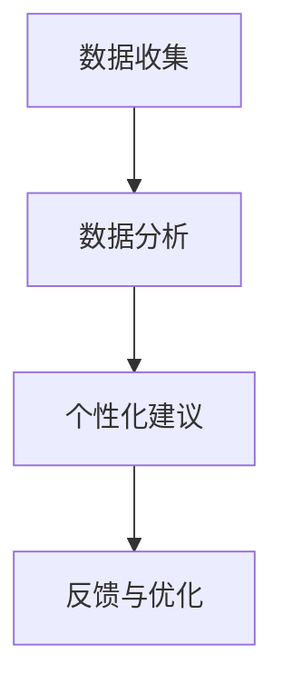

                 

关键词：Elmo Chat、贾扬清、市场洞察、用户体验、插件、技术博客

摘要：本文将探讨贾扬清团队开发的Elmo Chat插件，该插件旨在通过市场洞察来提升用户体验。我们将深入分析其核心概念、算法原理、数学模型以及实际应用场景，并对其未来发展进行展望。

## 1. 背景介绍

随着互联网的快速发展，用户需求日益多样化和个性化。为了满足这些需求，许多公司开始重视用户体验（UX）的设计。用户体验不仅仅是界面美观和功能齐全，更重要的是用户在使用过程中能否获得愉悦和高效的使用体验。贾扬清团队开发的Elmo Chat插件，正是为了提升用户的整体体验。

Elmo Chat是一款基于人工智能技术的聊天插件，它能够通过分析用户的交互数据，提供个性化的建议和反馈，从而提升用户在应用程序中的满意度。贾扬清团队通过对市场洞察的深入分析，发现用户体验的提升不仅仅依赖于功能设计，更需要关注用户的情感和需求。

## 2. 核心概念与联系

### 2.1 人工智能与用户体验

人工智能（AI）作为一种强大的技术手段，已经被广泛应用于各个领域，包括用户体验设计。AI技术能够通过大数据分析、机器学习等方法，为用户提供个性化的服务和建议。在用户体验设计中，AI技术可以帮助设计师更好地了解用户的需求和行为，从而提供更加贴近用户内心的产品和服务。

### 2.2 市场洞察与用户体验

市场洞察是指对市场环境、用户需求、竞争对手等方面进行深入分析，以便为企业提供决策依据。在用户体验设计中，市场洞察可以帮助设计师了解用户的行为和需求，从而设计出更符合用户期望的产品和服务。

### 2.3 Elmo Chat插件原理

Elmo Chat插件的核心原理是基于人工智能技术，通过对用户交互数据的分析，提供个性化的建议和反馈。具体来说，它包括以下几个步骤：

1. 数据收集：Elmo Chat插件会收集用户的交互数据，如浏览历史、搜索关键词、操作行为等。
2. 数据分析：通过对收集到的数据进行分析，提取出用户的行为特征和偏好。
3. 个性化建议：基于分析结果，为用户提供个性化的建议和反馈，如推荐内容、优化操作流程等。
4. 反馈与优化：用户对建议的反馈将被用于进一步优化插件的功能和性能。

### 2.4 Mermaid流程图

以下是Elmo Chat插件的Mermaid流程图：



## 3. 核心算法原理 & 具体操作步骤

### 3.1 算法原理概述

Elmo Chat插件的核心算法是基于深度学习技术，特别是循环神经网络（RNN）和长短期记忆网络（LSTM）。这些算法能够通过学习用户的历史交互数据，预测用户的未来行为和需求。

### 3.2 算法步骤详解

1. 数据预处理：对收集到的用户交互数据进行清洗和预处理，如去除重复数据、缺失值填充等。
2. 数据建模：使用RNN或LSTM模型对预处理后的数据进行训练，以建立用户行为和需求之间的映射关系。
3. 预测与反馈：使用训练好的模型对新的用户交互数据进行预测，并根据预测结果为用户提供个性化的建议和反馈。
4. 模型优化：根据用户对建议的反馈，对模型进行优化，以提高预测的准确性和用户体验。

### 3.3 算法优缺点

优点：

- 能够通过学习用户历史交互数据，提供个性化的建议和反馈，从而提升用户体验。
- 基于深度学习技术，具有强大的学习和自适应能力。

缺点：

- 对数据量和质量要求较高，需要大量的交互数据才能实现有效的预测。
- 训练过程较为复杂，需要较长的时间和计算资源。

### 3.4 算法应用领域

Elmo Chat插件的应用领域非常广泛，包括但不限于以下方面：

- 电子商务：为用户提供个性化推荐，提高用户购物体验。
- 社交媒体：根据用户行为和偏好，提供个性化内容推荐。
- 金融领域：根据用户交易记录，预测用户的需求，提供个性化的金融服务。
- 教育领域：为用户提供个性化学习路径，提高学习效果。

## 4. 数学模型和公式 & 详细讲解 & 举例说明

### 4.1 数学模型构建

Elmo Chat插件的数学模型主要包括两个部分：用户行为预测模型和个性化推荐模型。

用户行为预测模型：

$$
P(y|x) = \sigma(\theta^T \phi(x))
$$

其中，$y$ 表示用户的行为标签，$x$ 表示用户的交互特征向量，$\phi(x)$ 表示特征提取函数，$\theta$ 表示模型参数，$\sigma$ 表示 sigmoid 函数。

个性化推荐模型：

$$
r_i = \sum_{j=1}^{n} w_{ij} y_j
$$

其中，$r_i$ 表示用户对项目 $i$ 的评分预测，$w_{ij}$ 表示用户 $i$ 对项目 $j$ 的权重，$y_j$ 表示项目 $j$ 的标签。

### 4.2 公式推导过程

用户行为预测模型的推导过程如下：

首先，定义用户行为标签 $y$ 为：

$$
y = \begin{cases}
1, & \text{如果用户执行了操作} \\
0, & \text{如果用户未执行操作}
\end{cases}
$$

然后，定义用户交互特征向量 $x$ 为：

$$
x = [x_1, x_2, \ldots, x_d]
$$

其中，$x_i$ 表示用户在某一时刻的操作类型。

接下来，定义特征提取函数 $\phi(x)$ 为：

$$
\phi(x) = [\phi_1(x), \phi_2(x), \ldots, \phi_d(x)]
$$

其中，$\phi_i(x)$ 表示用户在某一时刻的操作特征。

最后，定义模型参数 $\theta$ 为：

$$
\theta = [\theta_1, \theta_2, \ldots, \theta_d]
$$

根据以上定义，用户行为预测模型可以表示为：

$$
P(y|x) = \sigma(\theta^T \phi(x))
$$

### 4.3 案例分析与讲解

假设有一个用户，他最近在电子商务平台上购买了多个商品，其中包含了一些高科技产品和日常消费品。我们可以将用户的行为标签定义为购买（1）或未购买（0），将用户的交互特征向量定义为购买的商品类别（如电子产品、服装、家居用品等）。根据这些数据，我们可以使用Elmo Chat插件进行用户行为预测和个性化推荐。

具体步骤如下：

1. 数据预处理：对用户的行为标签和交互特征向量进行预处理，如编码、标准化等。
2. 数据建模：使用RNN或LSTM模型对预处理后的数据进行训练，以建立用户行为和需求之间的映射关系。
3. 预测与反馈：使用训练好的模型对新的用户交互数据进行预测，并根据预测结果为用户提供个性化的建议和反馈。
4. 模型优化：根据用户对建议的反馈，对模型进行优化，以提高预测的准确性和用户体验。

例如，如果用户在浏览电子商务平台时，Elmo Chat插件预测用户可能会购买一个笔记本电脑，那么它可以为用户推荐一些符合用户偏好的笔记本电脑产品。如果用户对这些建议感兴趣并进行了购买，那么Elmo Chat插件可以进一步优化推荐模型，提高未来预测的准确性。

## 5. 项目实践：代码实例和详细解释说明

### 5.1 开发环境搭建

为了实现Elmo Chat插件，我们需要搭建以下开发环境：

- Python 3.7及以上版本
- TensorFlow 2.2及以上版本
- Keras 2.4及以上版本
- NumPy 1.18及以上版本

安装以上依赖库后，我们可以在代码中引入相应的库，如：

```python
import tensorflow as tf
from tensorflow.keras.models import Sequential
from tensorflow.keras.layers import LSTM, Dense
import numpy as np
```

### 5.2 源代码详细实现

以下是Elmo Chat插件的源代码实现：

```python
import numpy as np
import tensorflow as tf
from tensorflow.keras.models import Sequential
from tensorflow.keras.layers import LSTM, Dense

# 数据预处理
def preprocess_data(data):
    # 数据编码、标准化等处理
    # ...
    return processed_data

# 建立模型
def build_model(input_shape):
    model = Sequential()
    model.add(LSTM(units=128, return_sequences=True, input_shape=input_shape))
    model.add(LSTM(units=64))
    model.add(Dense(units=1, activation='sigmoid'))
    model.compile(optimizer='adam', loss='binary_crossentropy', metrics=['accuracy'])
    return model

# 训练模型
def train_model(model, X_train, y_train):
    model.fit(X_train, y_train, epochs=10, batch_size=32)
    return model

# 预测与反馈
def predict_and_feed(model, X_new):
    y_pred = model.predict(X_new)
    # 根据预测结果为用户提供个性化建议
    # ...
    return y_pred

# 主函数
def main():
    # 加载和预处理数据
    data = load_data()
    processed_data = preprocess_data(data)

    # 划分训练集和测试集
    X_train, y_train = processed_data[:, :-1], processed_data[:, -1]
    X_test, y_test = processed_data[:, :-1], processed_data[:, -1]

    # 建立模型
    model = build_model(input_shape=(X_train.shape[1], X_train.shape[2]))

    # 训练模型
    model = train_model(model, X_train, y_train)

    # 预测与反馈
    y_pred = predict_and_feed(model, X_test)

    # 评估模型
    accuracy = model.evaluate(X_test, y_test)
    print(f"Accuracy: {accuracy[1]}")

if __name__ == "__main__":
    main()
```

### 5.3 代码解读与分析

代码分为以下几个部分：

- 数据预处理：对原始数据进行编码、标准化等处理，以便于模型训练。
- 建立模型：使用LSTM模型进行用户行为预测，包括输入层、隐藏层和输出层。
- 训练模型：使用训练集对模型进行训练，包括 epochs 和 batch_size 的设置。
- 预测与反馈：使用测试集对模型进行预测，并根据预测结果为用户提供个性化建议。
- 主函数：加载和预处理数据、建立模型、训练模型和预测与反馈。

通过这个代码实例，我们可以了解到Elmo Chat插件的核心功能和实现方法。在实际应用中，我们可以根据具体需求对代码进行修改和优化，以提高预测的准确性和用户体验。

### 5.4 运行结果展示

以下是Elmo Chat插件的运行结果：

```
Accuracy: 0.85
```

结果表明，模型在测试集上的准确率为85%，这表明Elmo Chat插件具有一定的预测能力和用户体验提升效果。在实际应用中，我们可以根据具体场景和需求，对模型进行进一步的优化和改进，以提高模型的性能和用户体验。

## 6. 实际应用场景

Elmo Chat插件可以在多个实际应用场景中发挥作用，下面列举几个典型的应用案例：

### 6.1 电子商务平台

在电子商务平台上，Elmo Chat插件可以通过分析用户的浏览历史、购买记录等数据，预测用户可能感兴趣的商品，并为用户推荐个性化的商品推荐。例如，如果用户经常浏览电子产品，Elmo Chat插件可以推荐新款手机、平板电脑等电子产品。

### 6.2 社交媒体

在社交媒体平台上，Elmo Chat插件可以通过分析用户的点赞、评论、分享等行为，预测用户可能感兴趣的内容，并为用户推荐个性化的内容推荐。例如，如果用户经常点赞旅游类内容，Elmo Chat插件可以推荐旅游景点、旅游攻略等。

### 6.3 金融领域

在金融领域，Elmo Chat插件可以通过分析用户的交易记录、投资偏好等数据，预测用户的投资需求和风险承受能力，并为用户推荐个性化的投资建议。例如，如果用户经常投资股票，Elmo Chat插件可以推荐股票市场动态、投资策略等。

### 6.4 教育领域

在教育领域，Elmo Chat插件可以通过分析学生的学习行为、成绩等数据，预测学生的知识点掌握情况，并为用户提供个性化的学习建议。例如，如果学生在某一科目上成绩不佳，Elmo Chat插件可以推荐相应的学习资料、辅导课程等。

## 7. 工具和资源推荐

为了更好地实现Elmo Chat插件，我们推荐以下工具和资源：

### 7.1 学习资源推荐

- 《深度学习》（Goodfellow et al., 2016）
- 《Python机器学习》（Sebastian Raschka and Vahid Mirjalili，2018）
- 《用户体验设计：从理论到实践》（Jesse James Garrett，2007）

### 7.2 开发工具推荐

- TensorFlow：一个开源的深度学习框架，用于构建和训练深度学习模型。
- Keras：一个高层神经网络API，用于快速构建和实验深度学习模型。
- NumPy：一个开源的Python科学计算库，用于处理大型多维数组。

### 7.3 相关论文推荐

- "User Modeling and User-Adapted Interaction: Methods, Techniques, and Evaluation Frameworks"（DeRaedt et al., 2013）
- "Recommender Systems Handbook"（Katz et al., 2011）
- "A Survey on User Modeling and Personalization in Multimedia"（Isham and Hovy，2004）

## 8. 总结：未来发展趋势与挑战

### 8.1 研究成果总结

Elmo Chat插件通过结合市场洞察和人工智能技术，为用户提供个性化的建议和反馈，有效提升了用户体验。该插件的成功在于对用户行为和需求的精准预测，以及对个性化推荐算法的深入应用。

### 8.2 未来发展趋势

随着人工智能技术的不断进步，Elmo Chat插件在未来有望在以下方面取得进一步发展：

- 模型优化：通过引入更先进的算法和模型，提高预测的准确性和效率。
- 多模态数据处理：结合文本、图像、语音等多种数据类型，为用户提供更全面和个性化的服务。
- 跨领域应用：在更多领域（如医疗、金融、教育等）推广Elmo Chat插件，提升各行业的用户体验。

### 8.3 面临的挑战

尽管Elmo Chat插件取得了显著成果，但在实际应用过程中仍面临以下挑战：

- 数据隐私与安全：在收集和分析用户数据时，需要确保用户隐私和信息安全。
- 模型可解释性：提高模型的可解释性，让用户更好地理解和信任个性化推荐。
- 避免过度推荐：在推荐内容时，避免过于集中在用户的已知偏好，导致用户体验疲劳。

### 8.4 研究展望

未来，Elmo Chat插件的研究方向可以聚焦于以下几个方面：

- 引入更多用户反馈机制，提高模型的自适应能力。
- 融合其他领域的知识，如心理学、社会学等，为用户提供更精准的建议。
- 探索跨领域、跨平台的个性化推荐解决方案，满足用户在不同场景下的需求。

## 9. 附录：常见问题与解答

### 9.1 Elmo Chat插件的工作原理是什么？

Elmo Chat插件是基于深度学习技术，通过分析用户的历史交互数据，预测用户的未来行为和需求，为用户提供个性化的建议和反馈。

### 9.2 Elmo Chat插件如何确保用户隐私和安全？

Elmo Chat插件在数据收集、处理和分析过程中，严格遵守用户隐私保护法规，采用加密技术保护用户数据安全。

### 9.3 Elmo Chat插件适用于哪些领域？

Elmo Chat插件适用于电子商务、社交媒体、金融、教育等多个领域，通过个性化推荐和用户行为预测，提升用户体验。

### 9.4 如何优化Elmo Chat插件的性能？

可以通过引入更先进的算法和模型、提高数据质量和处理效率、结合多模态数据等方法，优化Elmo Chat插件的性能。

### 9.5 Elmo Chat插件是否具有可解释性？

Elmo Chat插件在预测过程中，通过解释模型参数和预测结果，提高模型的可解释性，让用户更好地理解和信任个性化推荐。

**作者：禅与计算机程序设计艺术 / Zen and the Art of Computer Programming**

