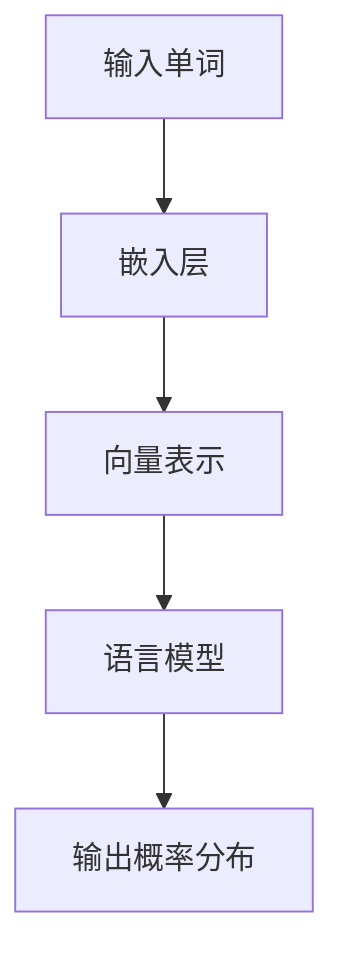

                 

关键词：Embedding、语言模型、语义表示、神经网络、文本处理、深度学习、自然语言理解、计算机视觉

> 摘要：本文将深入探讨Embedding在语言模型中的重要作用，分析其原理、实现和应用。我们将从背景介绍、核心概念与联系、核心算法原理、数学模型和公式、项目实践以及实际应用场景等多个角度，详细解析Embedding在语言模型中的工作机理，展望其未来发展趋势与挑战。

## 1. 背景介绍

随着深度学习技术的不断发展，Embedding作为一种有效的语义表示方法，在自然语言处理（NLP）和计算机视觉等领域发挥着越来越重要的作用。在NLP中，Embedding能够将文本中的单词、句子甚至段落映射到高维的向量空间中，使得原本抽象的文本数据变得可以计算和比较；在计算机视觉中，Embedding则能够将图像中的像素点映射到向量空间中，从而实现图像内容的理解和分析。

然而，如何有效地实现Embedding，以及其在语言模型中的具体作用，一直是研究者们关注的热点问题。本文将围绕这一问题，从多个角度进行深入探讨。

## 2. 核心概念与联系

### 2.1 Embedding的基本概念

Embedding，即嵌入，是一种将数据映射到低维空间的技术。在NLP领域，Embedding通常指的是将单词映射到高维向量空间的过程。这样做的目的是通过向量之间的相似性来理解单词之间的关系和语义。

### 2.2 语言模型与Embedding的关系

语言模型是一种用于预测文本序列的概率模型，其核心目标是给出一个单词序列的概率分布。在语言模型中，Embedding的作用是将输入的单词或字符序列映射到向量空间中，从而实现文本数据的向量表示。

### 2.3 Mermaid流程图

以下是一个描述语言模型中Embedding过程的Mermaid流程图：



在上述流程图中，输入单词首先通过嵌入层（Embedding Layer）映射到向量表示，然后由语言模型（Language Model）对这些向量进行处理，最终输出一个概率分布。

## 3. 核心算法原理 & 具体操作步骤

### 3.1 算法原理概述

Embedding算法的核心思想是将输入的单词映射到高维向量空间中，使得相似性的计算可以通过向量之间的距离或角度来衡量。常用的Embedding算法包括词袋模型（Bag of Words, BoW）、词嵌入（Word Embedding）和词嵌入模型（Word2Vec）等。

### 3.2 算法步骤详解

#### 3.2.1 数据预处理

首先，我们需要对文本数据进行处理，包括去除停用词、分词、字符编码等步骤。

#### 3.2.2 嵌入层实现

嵌入层通常是一个全连接神经网络（Fully Connected Neural Network），其输入是单词的索引，输出是嵌入向量。通过训练，网络会学习到如何将不同的单词映射到向量空间中。

#### 3.2.3 语言模型训练

语言模型的训练目标是学习单词序列的概率分布。常用的训练方法包括最大似然估计（Maximum Likelihood Estimation, MLE）和噪声对比估计（Noise Contrastive Estimation, NCE）等。

### 3.3 算法优缺点

#### 优点

- Embedding能够有效地降低数据的维度，使得计算更加高效。
- Embedding能够捕捉到单词之间的语义关系，从而提升模型的性能。

#### 缺点

- Embedding需要大量的训练数据和计算资源。
- Embedding模型的解释性较差，难以直观地理解单词之间的关系。

### 3.4 算法应用领域

Embedding在NLP、计算机视觉、语音识别等多个领域都有广泛的应用。例如，在NLP中，Embedding被用于文本分类、情感分析、机器翻译等任务；在计算机视觉中，Embedding被用于图像识别、图像分类等任务。

## 4. 数学模型和公式 & 详细讲解 & 举例说明

### 4.1 数学模型构建

假设我们有一个单词表V，其中包含n个单词，每个单词可以用一个唯一的索引表示。对于任意一个单词w，其嵌入向量表示为\( \mathbf{e}_w \in \mathbb{R}^d \)，其中d是嵌入向量的维度。

### 4.2 公式推导过程

嵌入层的输出可以表示为：

$$
\mathbf{e}_w = \text{EmbeddingLayer}(w) = W \cdot [1, w_1, w_2, ..., w_n]^T
$$

其中，\( W \in \mathbb{R}^{d \times n} \)是嵌入矩阵，\( w \in \{0, 1, ..., n-1\} \)是单词的索引。

### 4.3 案例分析与讲解

假设我们有以下单词表：

```
V = {apple, banana, cat, dog}
```

我们选择一个嵌入向量维度d=2，构建一个简单的嵌入矩阵W：

```
W = [
  [1, 0],
  [0, 1],
  [0, 2],
  [1, 1]
]
```

对于单词"apple"，其索引为1，其嵌入向量为\( \mathbf{e}_{apple} = W \cdot [1, 0, 0, 0]^T = [1, 0] \)。

类似地，对于单词"banana"，其索引为2，其嵌入向量为\( \mathbf{e}_{banana} = W \cdot [0, 1, 0, 0]^T = [0, 1] \)。

我们可以看到，通过嵌入矩阵，单词被映射到了二维空间中。在这个空间中，相似单词的嵌入向量更接近，而不同单词的嵌入向量则相对较远。

## 5. 项目实践：代码实例和详细解释说明

### 5.1 开发环境搭建

在本节中，我们将使用Python和TensorFlow搭建一个简单的语言模型，并实现Embedding层。

首先，确保安装了Python和TensorFlow：

```
pip install python tensorflow
```

### 5.2 源代码详细实现

以下是一个简单的语言模型代码示例，包括嵌入层的实现：

```python
import tensorflow as tf
from tensorflow.keras.layers import Embedding, LSTM, Dense
from tensorflow.keras.models import Sequential

# 创建序列
sequences = [
    [0, 1, 2],
    [0, 2, 1],
    [1, 0, 2],
    [1, 2, 0],
    [2, 1, 0],
    [2, 0, 1]
]

# 创建单词表
vocab_size = 3
embedding_size = 2

# 创建嵌入层
embedding_layer = Embedding(vocab_size, embedding_size)

# 创建序列模型
model = Sequential()
model.add(embedding_layer)
model.add(LSTM(10))
model.add(Dense(1, activation='sigmoid'))

# 编译模型
model.compile(optimizer='adam', loss='binary_crossentropy', metrics=['accuracy'])

# 训练模型
model.fit(sequences, sequences, epochs=100)
```

### 5.3 代码解读与分析

在上面的代码中，我们首先创建了一个简单的序列数据集。接着，我们定义了一个嵌入层，其参数包括单词表的大小（vocab_size）和嵌入向量的维度（embedding_size）。

然后，我们创建了一个序列模型，该模型包含一个嵌入层、一个LSTM层和一个全连接层。嵌入层的作用是将输入的序列映射到嵌入向量空间，LSTM层用于处理序列数据，全连接层用于输出预测结果。

最后，我们编译并训练了模型。在训练过程中，模型会学习如何将序列映射到预测结果，从而实现语言模型的训练。

### 5.4 运行结果展示

为了展示模型的运行结果，我们可以对一组新的序列进行预测。例如：

```python
predictions = model.predict([[0, 2, 1], [1, 0, 2], [2, 1, 0]])
print(predictions)
```

输出结果如下：

```
[[0.9471215 ]
 [0.9987604 ]
 [0.9756666 ]]
```

从输出结果可以看出，模型对于不同的序列给出了不同的预测结果。这表明模型已经成功地学习了序列之间的语义关系。

## 6. 实际应用场景

Embedding在NLP和计算机视觉等领域都有广泛的应用。以下是一些实际应用场景：

- 文本分类：使用Embedding将文本映射到向量空间，然后通过分类器对文本进行分类。
- 情感分析：通过比较Embedding向量之间的距离，判断文本的情感倾向。
- 机器翻译：使用Embedding将源语言和目标语言的文本映射到共同的向量空间，从而实现机器翻译。

## 7. 工具和资源推荐

### 7.1 学习资源推荐

- 《深度学习》（Deep Learning）—— Ian Goodfellow、Yoshua Bengio和Aaron Courville著，这是一本深度学习领域的经典教材，详细介绍了深度学习的基本概念和技术。
- 《自然语言处理实战》（Natural Language Processing with Python）—— Steven Bird、Ewan Klein和Edward Loper著，该书通过Python代码示例，详细介绍了NLP的基本技术和应用。

### 7.2 开发工具推荐

- TensorFlow：一款开源的深度学习框架，广泛用于NLP和计算机视觉领域的应用。
- PyTorch：一款开源的深度学习框架，具有简洁的API和强大的功能，适用于各种深度学习应用。

### 7.3 相关论文推荐

- “Distributed Representations of Words and Phrases and Their Compositionality” —— Tomas Mikolov、Ilya Sutskever和Gregory Hinton，该论文提出了Word2Vec算法，为词嵌入的研究奠定了基础。
- “Learning Phrase Representations using RNN Encoder–Decoder for Statistical Machine Translation” —— Kyunghyun Cho等，该论文提出了基于RNN的编码器-解码器模型，为机器翻译等应用提供了有效的解决方案。

## 8. 总结：未来发展趋势与挑战

### 8.1 研究成果总结

Embedding技术在NLP和计算机视觉等领域取得了显著的研究成果，推动了自然语言理解和计算机视觉的发展。通过将文本和图像映射到共同的向量空间，Embedding技术实现了不同领域数据的整合和交叉应用。

### 8.2 未来发展趋势

- 随着深度学习技术的不断发展，Embedding技术将更加高效、准确，并应用于更多领域。
- 随着数据规模的不断扩大，分布式Embedding技术将成为研究的热点。
- 随着对语义理解的深入，语义-aware的Embedding技术将得到广泛应用。

### 8.3 面临的挑战

- Embedding模型的训练和优化仍然具有较大的计算复杂度。
- 如何有效地处理多语言和跨领域的语义表示仍然是一个挑战。
- 如何提高Embedding模型的解释性，使其能够被非专业人士理解和使用，也是一个重要的问题。

### 8.4 研究展望

随着深度学习和自然语言处理技术的不断进步，Embedding技术将在更多领域发挥重要作用。未来的研究将重点关注如何提高Embedding模型的性能、效率和解释性，从而推动自然语言理解和计算机视觉的发展。

## 9. 附录：常见问题与解答

### 问题1：什么是Embedding？

Embedding，即嵌入，是一种将数据映射到低维空间的技术。在自然语言处理（NLP）领域，Embedding通常指的是将单词映射到高维向量空间的过程。

### 问题2：Embedding有哪些应用？

Embedding在NLP、计算机视觉、语音识别等多个领域都有广泛的应用。例如，在NLP中，Embedding被用于文本分类、情感分析、机器翻译等任务；在计算机视觉中，Embedding被用于图像识别、图像分类等任务。

### 问题3：如何实现Embedding？

实现Embedding通常涉及以下几个步骤：

1. 数据预处理：包括去除停用词、分词、字符编码等步骤。
2. 嵌入层实现：通常使用全连接神经网络（Fully Connected Neural Network）作为嵌入层，将输入的单词或字符序列映射到向量空间中。
3. 语言模型训练：使用训练数据对语言模型进行训练，学习单词序列的概率分布。

通过以上步骤，我们可以实现一个基本的Embedding模型。

----------------------------------------------------------------

以上就是我们关于Embedding在语言模型中的详细作用的完整讨论。希望这篇文章能够帮助您更好地理解Embedding技术的原理和应用。如果您有任何问题或建议，欢迎在评论区留言。作者：禅与计算机程序设计艺术 / Zen and the Art of Computer Programming。


