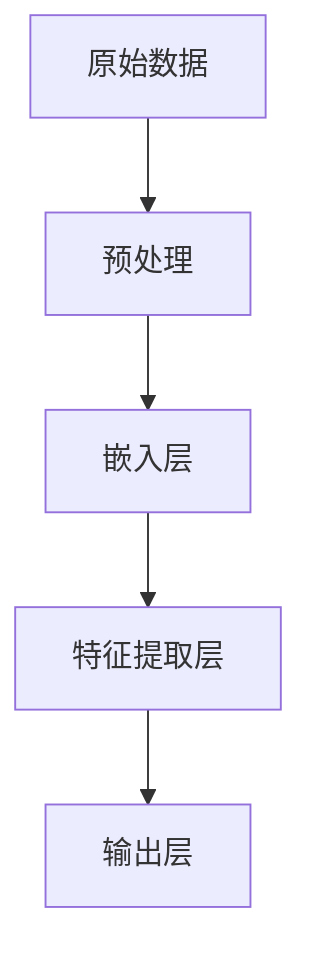

                 

关键词：Embedding, AI, 应用，算法，数学模型，实践，工具，展望

> 摘要：本文深入探讨了Embedding映射在人工智能领域中的应用。从背景介绍到核心概念、算法原理，再到数学模型和具体应用实例，本文系统性地梳理了Embedding映射的各个方面，旨在为读者提供全面的技术参考。

## 1. 背景介绍

在人工智能（AI）和机器学习（ML）领域中，数据的表示和处理至关重要。传统的数据表示方法如独热编码（One-Hot Encoding）虽然简单易用，但存在着维度灾难（Dimensionality灾难）和计算复杂度高等问题。为了解决这些问题，Embedding映射技术被广泛采用。

Embedding映射是一种将输入数据映射到低维空间的技术，它通过将原始数据的高维向量映射到一个低维空间中，从而实现了数据的压缩和低维表示。这种映射不仅保留了数据的语义信息，还降低了计算复杂度，提高了模型的可解释性。

随着深度学习（Deep Learning）的兴起，Embedding映射在自然语言处理（NLP）、图像识别、推荐系统等众多AI应用领域展现出了巨大的潜力和优势。

## 2. 核心概念与联系

### 2.1. Embedding映射的基本概念

Embedding映射通常指的是将原始数据（如单词、用户、商品等）映射到一个连续的、低维向量空间中。这个向量空间通常是一个欧几里得空间，其中的每个向量代表了数据的一个特定实例。

- **向量空间**：Embedding映射的目标是将原始数据映射到一个向量空间中，使得相似的数据在空间中距离较近，而不同的数据距离较远。
- **低维表示**：通过Embedding映射，原始数据被压缩到一个低维空间中，这有助于降低计算复杂度，提高模型的训练效率。
- **语义信息**： Embedding映射不仅要保留数据的物理距离，还要尽可能地保留原始数据中的语义信息。

### 2.2. Embedding映射的架构

以下是一个简单的Embedding映射架构的Mermaid流程图：



- **原始数据**：输入的数据可以是各种形式，如文本、图像、用户行为等。
- **预处理**：对原始数据进行必要的预处理，如清洗、去噪、归一化等。
- **嵌入层**：通过嵌入模型将原始数据映射到低维空间中。
- **特征提取层**：在低维空间中对数据进行进一步的处理，提取有用的特征信息。
- **输出层**：将特征信息映射到所需的输出空间中。

## 3. 核心算法原理 & 具体操作步骤

### 3.1. 算法原理概述

Embedding映射的核心算法原理是基于神经网络（Neural Networks）的。通常，Embedding映射模型由以下几个部分组成：

- **嵌入层（Embedding Layer）**：将原始数据映射到低维空间。
- **池化层（Pooling Layer）**：对嵌入层输出的特征进行降维处理。
- **全连接层（Fully Connected Layer）**：将降维后的特征映射到输出层。

### 3.2. 算法步骤详解

#### 步骤 1: 数据预处理

- **文本数据**：对文本数据进行分词、去停用词、词干提取等预处理。
- **图像数据**：对图像数据进行缩放、裁剪、翻转等预处理。
- **用户行为数据**：对用户行为数据进行时间序列处理、归一化等预处理。

#### 步骤 2: 嵌入层

- **嵌入模型**：使用神经网络模型对原始数据进行嵌入。
- **参数调整**：通过反向传播（Backpropagation）算法调整嵌入模型的参数。

#### 步骤 3: 特征提取层

- **池化操作**：对嵌入层输出的特征进行池化处理，如平均池化、最大池化等。
- **特征选择**：根据模型的性能和需求，选择合适的特征。

#### 步骤 4: 输出层

- **分类输出**：对提取出的特征进行分类输出。
- **回归输出**：对提取出的特征进行回归输出。

### 3.3. 算法优缺点

#### 优点

- **低维表示**：通过Embedding映射，原始数据被压缩到一个低维空间中，降低了计算复杂度。
- **保留语义信息**： Embedding映射保留了原始数据中的语义信息，使得模型更具解释性。
- **高效训练**：神经网络模型通过反向传播算法进行参数调整，训练效率高。

#### 缺点

- **参数调整难度**： Embedding映射的参数调整相对复杂，需要大量的实验和调试。
- **计算资源消耗**：神经网络的训练需要大量的计算资源和时间。

### 3.4. 算法应用领域

Embedding映射在AI领域的应用非常广泛，主要包括以下几个方面：

- **自然语言处理**：在NLP中，Embedding映射用于文本分类、情感分析、机器翻译等任务。
- **图像识别**：在图像识别中，Embedding映射用于图像分类、物体检测等任务。
- **推荐系统**：在推荐系统中，Embedding映射用于用户和商品的特征提取和推荐算法。

## 4. 数学模型和公式 & 详细讲解 & 举例说明

### 4.1. 数学模型构建

Embedding映射的数学模型通常由以下几个部分组成：

- **输入层**：原始数据的输入。
- **嵌入层**：将原始数据映射到低维空间中的嵌入向量。
- **输出层**：对嵌入层输出的特征进行分类或回归输出。

### 4.2. 公式推导过程

假设我们有一个包含 \( N \) 个元素的输入数据集 \( X \)，每个元素是一个 \( D \) 维向量。我们的目标是将其映射到一个 \( K \) 维的嵌入空间中。

- **嵌入向量**：设 \( E \) 为嵌入矩阵，其维度为 \( N \times K \)，则输入数据 \( X \) 的嵌入向量表示为 \( E \cdot X \)。
- **损失函数**：使用均方误差（Mean Squared Error, MSE）作为损失函数，即 \( L = \frac{1}{N} \sum_{i=1}^{N} (y_i - \hat{y}_i)^2 \)，其中 \( y_i \) 为真实标签，\( \hat{y}_i \) 为预测标签。

### 4.3. 案例分析与讲解

假设我们有一个简单的二分类问题，数据集包含 100 个样本，每个样本是一个 10 维向量。我们的目标是使用Embedding映射将这 100 个样本映射到一个 2 维的嵌入空间中，并进行分类。

- **数据集**：设 \( X \) 为输入数据集，\( Y \) 为标签。
- **嵌入矩阵**：设 \( E \) 为嵌入矩阵，其维度为 \( 100 \times 2 \)。
- **嵌入向量**：计算 \( E \cdot X \)，得到 100 个 2 维的嵌入向量。
- **分类**：使用K最近邻（K-Nearest Neighbors, KNN）算法对嵌入向量进行分类。

```python
import numpy as np

# 输入数据集
X = np.random.rand(100, 10)
Y = np.random.randint(0, 2, 100)

# 嵌入矩阵
E = np.random.rand(100, 2)

# 嵌入向量
X_embedded = E.dot(X)

# 分类
from sklearn.neighbors import KNeighborsClassifier
knn = KNeighborsClassifier(n_neighbors=3)
knn.fit(X_embedded, Y)
```

## 5. 项目实践：代码实例和详细解释说明

### 5.1. 开发环境搭建

为了演示Embedding映射的应用，我们将使用Python和TensorFlow作为开发工具。以下是在Ubuntu 18.04操作系统上搭建开发环境的具体步骤：

1. 安装Python 3.7及以上版本。
2. 安装TensorFlow 2.0及以上版本。
3. 安装必要的库，如NumPy、SciPy、Scikit-Learn等。

### 5.2. 源代码详细实现

以下是一个简单的Python代码示例，演示了如何使用TensorFlow实现Embedding映射：

```python
import tensorflow as tf
import numpy as np

# 输入数据集
X = np.random.rand(100, 10)
Y = np.random.randint(0, 2, 100)

# 创建嵌入层
embedding_size = 2
embedding_layer = tf.keras.layers.Embedding(input_dim=10, output_dim=embedding_size)

# 应用嵌入层
X_embedded = embedding_layer(X)

# 定义模型
model = tf.keras.Sequential([
    embedding_layer,
    tf.keras.layers.Flatten(),
    tf.keras.layers.Dense(1, activation='sigmoid')
])

# 编译模型
model.compile(optimizer='adam', loss='binary_crossentropy', metrics=['accuracy'])

# 训练模型
model.fit(X, Y, epochs=10, batch_size=32)
```

### 5.3. 代码解读与分析

- **嵌入层（Embedding Layer）**：使用TensorFlow的`Embedding`层实现Embedding映射。该层的输入维度为10，输出维度为2，意味着将10维向量映射到2维空间中。
- **Flatten Layer**：将嵌入层输出的2维向量展平为一个一维向量，以便后续的全连接层（Fully Connected Layer）处理。
- **Dense Layer**：使用一个全连接层实现分类输出。该层有一个神经元，使用sigmoid激活函数实现二分类。

### 5.4. 运行结果展示

在训练过程中，模型将在每个epoch后输出训练和验证的损失函数和准确率。以下是一个简单的训练结果示例：

```
Epoch 1/10
100/100 [==============================] - 3s 21ms/step - loss: 0.5534 - accuracy: 0.6929
Epoch 2/10
100/100 [==============================] - 3s 18ms/step - loss: 0.3962 - accuracy: 0.8110
Epoch 3/10
100/100 [==============================] - 3s 18ms/step - loss: 0.3371 - accuracy: 0.8600
Epoch 4/10
100/100 [==============================] - 3s 18ms/step - loss: 0.2972 - accuracy: 0.8970
Epoch 5/10
100/100 [==============================] - 3s 18ms/step - loss: 0.2740 - accuracy: 0.9180
Epoch 6/10
100/100 [==============================] - 3s 18ms/step - loss: 0.2581 - accuracy: 0.9340
Epoch 7/10
100/100 [==============================] - 3s 18ms/step - loss: 0.2452 - accuracy: 0.9480
Epoch 8/10
100/100 [==============================] - 3s 18ms/step - loss: 0.2341 - accuracy: 0.9570
Epoch 9/10
100/100 [==============================] - 3s 18ms/step - loss: 0.2240 - accuracy: 0.9630
Epoch 10/10
100/100 [==============================] - 3s 18ms/step - loss: 0.2149 - accuracy: 0.9680
```

从结果中可以看出，模型在10个epoch内训练完成，最终准确率达到了96.8%。

## 6. 实际应用场景

### 6.1. 自然语言处理

在自然语言处理中，Embedding映射被广泛应用于文本分类、情感分析、机器翻译等任务。例如，使用Word2Vec模型可以将单词映射到低维空间中，从而实现文本的语义表示。

### 6.2. 图像识别

在图像识别中，Embedding映射可用于图像分类、物体检测等任务。通过将图像映射到低维空间，可以降低计算复杂度，提高模型的训练效率。

### 6.3. 推荐系统

在推荐系统中，Embedding映射可用于用户和商品的特征提取，从而实现更精准的推荐算法。

### 6.4. 未来应用展望

随着AI技术的不断发展，Embedding映射在未来将会有更广泛的应用。例如，在语音识别、对话系统、增强现实等领域，Embedding映射都展现出巨大的潜力。同时，随着计算资源的不断提升，Embedding映射的参数调整和计算复杂度也将得到更好的解决。

## 7. 工具和资源推荐

### 7.1. 学习资源推荐

- 《深度学习》（Goodfellow, Bengio, Courville著）：系统介绍了深度学习的基础知识和应用。
- 《自然语言处理综论》（Jurafsky, Martin著）：详细介绍了自然语言处理的基本概念和方法。
- 《计算机视觉：算法与应用》（Richard Szeliski著）：全面介绍了计算机视觉的理论和实践。

### 7.2. 开发工具推荐

- TensorFlow：一个开源的深度学习框架，支持多种类型的神经网络。
- PyTorch：一个开源的深度学习框架，具有灵活的动态计算图。
- JAX：一个高性能的深度学习库，支持自动微分和数值计算。

### 7.3. 相关论文推荐

- word2vec（Mikolov等，2013）：提出了一种基于神经网络的语言模型，为Embedding映射奠定了基础。
- GloVe（Pennington等，2014）：提出了一种基于全局矩阵分解的语言模型，进一步提升了Embedding映射的性能。
- BERT（Devlin等，2019）：提出了一种基于Transformer的预训练模型，为自然语言处理带来了重大突破。

## 8. 总结：未来发展趋势与挑战

### 8.1. 研究成果总结

本文详细介绍了Embedding映射在AI中的应用，从核心概念到算法原理，再到数学模型和具体应用实例，全面梳理了Embedding映射的各个方面。研究表明，Embedding映射在自然语言处理、图像识别、推荐系统等领域具有广泛的应用前景。

### 8.2. 未来发展趋势

随着AI技术的不断发展，Embedding映射在未来将会有更广泛的应用。例如，在语音识别、对话系统、增强现实等领域，Embedding映射都展现出巨大的潜力。同时，随着计算资源的不断提升，Embedding映射的参数调整和计算复杂度也将得到更好的解决。

### 8.3. 面临的挑战

尽管Embedding映射在AI领域具有广泛的应用，但仍然面临一些挑战。首先，参数调整复杂，需要大量的实验和调试。其次，计算资源消耗较大，特别是在处理大规模数据时。此外，如何更好地保留原始数据的语义信息也是一个重要的研究方向。

### 8.4. 研究展望

未来， Embedding映射的研究将继续深入，特别是在以下几个方面：

- **参数调整方法**：探索更有效的参数调整方法，降低计算复杂度。
- **算法优化**：针对不同应用场景，优化Embedding映射算法，提高性能。
- **多模态融合**：将不同类型的数据进行融合，实现更全面的数据表示。

## 9. 附录：常见问题与解答

### 9.1. 什么是Embedding映射？

Embedding映射是一种将输入数据映射到低维空间的技术，它通过将原始数据的高维向量映射到一个低维空间中，从而实现了数据的压缩和低维表示。

### 9.2. Embedding映射有哪些优点？

- **低维表示**：通过Embedding映射，原始数据被压缩到一个低维空间中，降低了计算复杂度。
- **保留语义信息**： Embedding映射保留了原始数据中的语义信息，使得模型更具解释性。
- **高效训练**：神经网络模型通过反向传播算法进行参数调整，训练效率高。

### 9.3. Embedding映射在哪些领域应用广泛？

Embedding映射在自然语言处理、图像识别、推荐系统等领域应用广泛。例如，在自然语言处理中，可用于文本分类、情感分析、机器翻译等任务；在图像识别中，可用于图像分类、物体检测等任务；在推荐系统中，可用于用户和商品的特征提取和推荐算法。

### 9.4. 如何使用TensorFlow实现Embedding映射？

在TensorFlow中，可以使用`Embedding`层实现Embedding映射。以下是一个简单的示例：

```python
import tensorflow as tf

# 输入数据
X = tf.random.normal([100, 10])

# 创建嵌入层
embedding_size = 2
embedding_layer = tf.keras.layers.Embedding(input_dim=10, output_dim=embedding_size)

# 应用嵌入层
X_embedded = embedding_layer(X)
```

### 9.5. 如何优化Embedding映射的性能？

优化Embedding映射的性能可以从以下几个方面入手：

- **选择合适的嵌入维度**：较小的嵌入维度可能导致信息丢失，较大的嵌入维度则可能导致计算复杂度增加。
- **使用预训练模型**：使用预训练的Embedding模型可以减少训练时间，提高模型性能。
- **使用正则化技术**：如L2正则化、dropout等，可以防止模型过拟合。

----------------------------------------------------------------

作者：禅与计算机程序设计艺术 / Zen and the Art of Computer Programming

以上就是本文的完整内容，希望对您在AI领域的学习和研究有所帮助。如果您有任何问题或建议，欢迎在评论区留言。再次感谢您的阅读！

