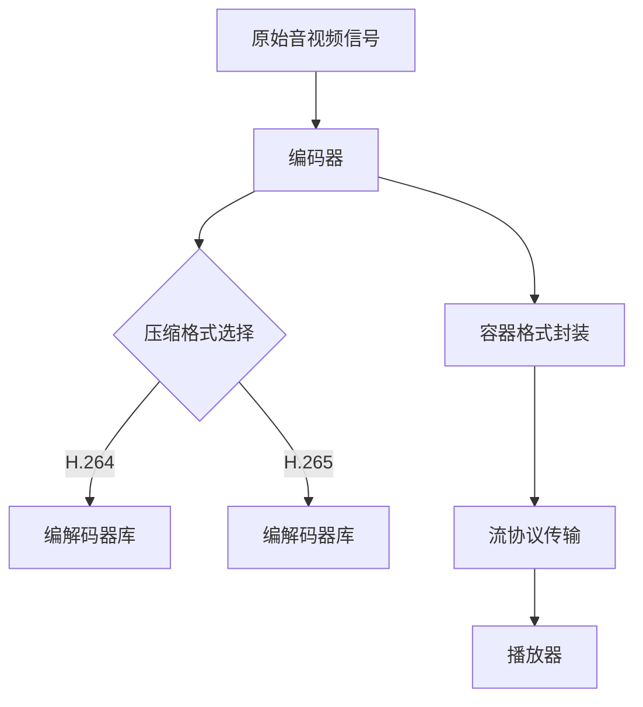

                 

关键词：音视频处理，FFmpeg，编解码，流媒体，技术博客，深度分析

> 摘要：本文将深入探讨FFmpeg在音视频处理领域中的应用，包括编解码技术和流媒体传输机制。通过详细的原理讲解、实例分析，本文旨在为读者提供全面的技术参考。

## 1. 背景介绍

随着互联网技术的飞速发展，音视频内容已经成为互联网上的主要数据形式。如何高效地处理这些内容，以适应不同的平台和设备需求，成为当前技术领域的一个重要课题。FFmpeg作为一款强大的音视频处理工具，承担了这一重任。它不仅支持多种编解码格式，还提供了丰富的流媒体传输功能，是音视频处理领域的基石。

本文将首先介绍FFmpeg的基本概念和架构，然后深入探讨编解码技术和流媒体传输机制，最后通过实际项目实践和未来应用展望，为读者提供一个全面的视角。

### FFmpeg简介

FFmpeg是由法国程序员Fabrice Bellard创建的开源多媒体处理工具集。自1994年首次发布以来，它已经成为音视频处理领域的标准工具。FFmpeg支持多种音视频格式，包括MP4、AVI、MKV等，同时也支持多种编解码器，如H.264、H.265、AAC、MP3等。其核心组件包括：

- **libavcodec**：音频和视频编解码库。
- **libavformat**：音视频文件格式处理库。
- **libavutil**：通用工具库。
- **libswscale**：图像缩放和色彩转换库。
- **libswresample**：音频采样率转换库。

这些组件共同构成了FFmpeg的核心，使其能够处理各种复杂的音视频任务。

### 音视频处理的重要性

音视频处理在当今数字化时代中具有至关重要的地位。随着视频内容的爆炸性增长，如何高效地处理和传输这些内容成为一个严峻的挑战。音视频处理不仅涉及到数据压缩和解压，还包括图像和音频的增强、编辑和同步等复杂操作。

编解码技术是音视频处理的核心，它决定了视频的质量和压缩率。流媒体传输机制则确保了音视频内容能够在各种网络环境下流畅传输。了解和掌握这些技术，对于从事音视频处理相关工作的开发者来说，具有重要意义。

## 2. 核心概念与联系

### 音视频编解码原理

音视频编解码是音视频处理的基础，它涉及将原始的音频和视频信号转换为压缩格式，以便于存储和传输，然后再将压缩的数据恢复为原始格式。这一过程包括以下几个核心概念：

- **采样率（Sampling Rate）**：音频信号的采样率是指每秒钟采集信号的次数，通常以千赫兹（kHz）为单位。较高的采样率可以捕捉到更丰富的音频细节。
- **采样位数（Sampling Bit Depth）**：采样位数决定了每次采样的精度，位数越高，音质越好。
- **量化（Quantization）**：量化是将连续的采样值转换为有限数目的离散值，量化位数越高，失真越小。
- **编解码器（Codec）**：编解码器是负责编码和解码的算法和软件。常见的编解码器包括H.264、H.265、AAC、MP3等。

### 音视频编解码架构

音视频编解码的架构通常包括以下几个部分：

- **编码器（Encoder）**：将原始的音频或视频信号转换为压缩格式。
- **解码器（Decoder）**：将压缩的音频或视频信号恢复为原始格式。
- **编解码器库（Codec Library）**：提供各种编解码器的实现，如FFmpeg中的libavcodec。
- **容器格式（Container Format）**：用于封装音频和视频数据，常见的容器格式包括MP4、AVI、MKV等。

### 流媒体传输机制

流媒体传输是将音视频内容分段传输，并在用户请求时实时播放的技术。流媒体传输的关键概念包括：

- **流（Stream）**：音视频内容被分割成一系列连续的片段，每个片段称为一个流。
- **流协议（Stream Protocol）**：用于传输流的数据协议，如HTTP、RTMP、HLS等。
- **播放器（Player）**：负责接收和播放流媒体内容的软件。

### Mermaid 流程图

下面是一个简化的音视频编解码与流媒体传输的Mermaid流程图：



在这个流程图中，原始音视频信号首先通过编码器转换为压缩格式，然后选择合适的编解码器库进行编码，最后将编码后的数据封装到容器格式中，通过流协议传输到播放器，实现实时播放。

## 3. 核心算法原理 & 具体操作步骤

### 3.1 算法原理概述

音视频处理的核心算法主要包括编解码算法、图像处理算法和音频处理算法。这些算法的原理可以概括为：

- **编解码算法**：通过特定的算法将原始数据转换为压缩格式，以减少数据大小并提高传输效率。
- **图像处理算法**：对图像进行各种操作，如缩放、旋转、滤波等，以改善图像质量。
- **音频处理算法**：对音频进行各种操作，如混音、回声消除、音量调节等，以改善音频质量。

### 3.2 算法步骤详解

#### 3.2.1 编解码算法步骤

1. **采样与量化**：对音频或视频信号进行采样，并将采样值量化为离散值。
2. **压缩**：使用特定的编解码器对量化后的数据进行压缩，以减少数据大小。
3. **编码**：将压缩后的数据编码为特定的格式，如H.264或H.265。
4. **解码**：接收端使用相应的解码器将编码后的数据解码为原始格式。
5. **反量化与重构**：将解码后的数据反量化并重构为原始信号。

#### 3.2.2 图像处理算法步骤

1. **采样**：从图像中提取像素值。
2. **滤波**：使用滤波器对图像进行平滑处理，以减少噪声。
3. **变换**：使用变换算法，如傅里叶变换或离散余弦变换，将图像从空间域转换到频域。
4. **量化与编码**：对变换后的数据量进行量化，然后编码为特定的格式。
5. **解码与重构**：将解码后的数据重构为原始图像。

#### 3.2.3 音频处理算法步骤

1. **采样与量化**：对音频信号进行采样，并将采样值量化为离散值。
2. **压缩**：使用特定的编解码器对量化后的数据进行压缩，以减少数据大小。
3. **处理**：对音频信号进行各种处理，如混音、回声消除、音量调节等。
4. **解码与重构**：将解码后的数据重构为原始音频信号。

### 3.3 算法优缺点

#### 编解码算法优缺点

- **优点**：编解码算法可以有效减少数据大小，提高传输效率，同时保持较高的图像和音频质量。
- **缺点**：编解码算法的计算复杂度较高，对硬件性能要求较高。

#### 图像处理算法优缺点

- **优点**：图像处理算法可以显著改善图像质量，增强视觉效果。
- **缺点**：图像处理算法可能会引入一些失真，如滤波引起的图像模糊。

#### 音频处理算法优缺点

- **优点**：音频处理算法可以显著改善音频质量，增强听觉体验。
- **缺点**：音频处理算法可能会引入一些噪声，影响音质。

### 3.4 算法应用领域

音视频处理算法在多个领域有着广泛的应用：

- **视频监控**：通过编解码算法和图像处理算法，实时监控视频画面，识别异常情况。
- **在线视频平台**：通过编解码算法和流媒体传输机制，提供高质量的视频观看体验。
- **音频处理**：通过音频处理算法，改善音频质量，提供更优质的通话和音乐体验。

## 4. 数学模型和公式 & 详细讲解 & 举例说明

### 4.1 数学模型构建

音视频处理中的数学模型主要包括信号处理模型、图像处理模型和音频处理模型。这些模型的核心是基于傅里叶变换、离散余弦变换和离散小波变换等数学工具。

#### 4.1.1 信号处理模型

信号处理模型主要涉及信号的采样、量化、压缩和解压。其中，采样和量化是信号处理的基础。采样定理表明，为了无失真地恢复原始信号，采样率必须大于信号的最高频率的两倍。量化则通过将连续的采样值转换为有限的离散值，来减少信号的存储和传输需求。

#### 4.1.2 图像处理模型

图像处理模型主要涉及图像的采样、滤波、变换和重构。傅里叶变换和离散余弦变换是图像处理中的核心工具。傅里叶变换可以将图像从空间域转换到频域，从而进行滤波和处理。离散余弦变换则用于图像的压缩，通过将图像分解为不同的频率分量，来减少数据大小。

#### 4.1.3 音频处理模型

音频处理模型主要涉及音频的采样、量化、压缩和解压。与图像处理类似，音频处理也依赖于傅里叶变换和离散余弦变换。此外，音频处理还包括混音、回声消除和音量调节等操作，这些操作通过特定的算法来实现。

### 4.2 公式推导过程

以下是一些常见的数学公式推导过程：

#### 4.2.1 采样定理

采样定理表明，为了无失真地恢复原始信号，采样率必须大于信号的最高频率的两倍。其推导过程如下：

$$
f_s > 2f_{max}
$$

其中，$f_s$ 是采样率，$f_{max}$ 是信号的最高频率。

#### 4.2.2 傅里叶变换

傅里叶变换是将信号从时域转换到频域的数学工具。其基本公式如下：

$$
X(f) = \int_{-\infty}^{\infty} x(t)e^{-j2\pi ft} dt
$$

其中，$X(f)$ 是频域信号，$x(t)$ 是时域信号，$f$ 是频率。

#### 4.2.3 离散余弦变换

离散余弦变换是图像和音频压缩中的常用工具。其基本公式如下：

$$
X(k) = \sum_{n=0}^{N-1} x(n) \cos\left(\frac{2\pi kn}{N}\right)
$$

其中，$X(k)$ 是变换后的信号，$x(n)$ 是原始信号，$N$ 是采样点数。

### 4.3 案例分析与讲解

以下通过一个具体的案例，来讲解数学模型和公式的应用。

#### 4.3.1 音频信号压缩

假设有一个音频信号，采样率为44.1kHz，采样位数为16位。我们需要使用H.264音频编解码器对其进行压缩。

1. **采样与量化**：首先，对音频信号进行采样，得到一系列离散值。
2. **压缩**：使用H.264音频编解码器，对采样后的数据进行压缩。
3. **编码**：将压缩后的数据编码为H.264格式。
4. **解码**：在接收端，使用H.264音频编解码器，将编码后的数据解码为原始格式。
5. **反量化与重构**：将解码后的数据反量化并重构为原始音频信号。

在这个过程中，采样定理和傅里叶变换发挥了关键作用。采样定理确保了信号的无失真恢复，而傅里叶变换则用于信号的压缩和解压。

#### 4.3.2 图像信号增强

假设有一个图像信号，需要进行增强处理。我们可以使用离散余弦变换来实现这一目标。

1. **采样**：从图像中提取像素值。
2. **滤波**：使用特定的滤波器对图像进行滤波，以减少噪声。
3. **变换**：使用离散余弦变换，将图像从空间域转换到频域。
4. **量化与编码**：对变换后的数据量进行量化，然后编码为特定的格式。
5. **解码与重构**：将解码后的数据重构为原始图像。

在这个过程中，离散余弦变换是核心工具，它通过将图像分解为不同的频率分量，来减少噪声并增强图像质量。

## 5. 项目实践：代码实例和详细解释说明

### 5.1 开发环境搭建

要使用FFmpeg进行音视频处理，首先需要搭建一个开发环境。以下是在Ubuntu 18.04操作系统上搭建FFmpeg开发环境的步骤：

1. **安装FFmpeg**：使用以下命令安装FFmpeg：

   ```bash
   sudo apt update
   sudo apt install ffmpeg
   ```

2. **安装FFmpeg开发库**：使用以下命令安装FFmpeg开发库：

   ```bash
   sudo apt install libavcodec-dev libavformat-dev libavutil-dev libswscale-dev libswresample-dev
   ```

3. **配置环境变量**：将FFmpeg的安装路径添加到环境变量中：

   ```bash
   export PATH=$PATH:/usr/local/bin
   ```

### 5.2 源代码详细实现

以下是一个简单的FFmpeg编解码实例，用于将H.264视频编码为HEVC（H.265）格式：

```c
#include <libavformat/avformat.h>
#include <libavcodec/avcodec.h>
#include <libswscale/swscale.h>
#include <libswresample/swresample.h>

int main() {
    AVFormatContext *input_ctx = NULL;
    AVFormatContext *output_ctx = NULL;
    AVCodec *input_codec = NULL;
    AVCodec *output_codec = NULL;
    AVFrame *frame = NULL;
    AVPacket packet;
    int frame_count = 0;
    int ret;

    // 打开输入视频文件
    ret = avformat_open_input(&input_ctx, "input.mp4", NULL, NULL);
    if (ret < 0) {
        fprintf(stderr, "Could not open input file\n");
        return -1;
    }

    // 找到视频流
    ret = avformat_find_stream_info(input_ctx, NULL);
    if (ret < 0) {
        fprintf(stderr, "Failed to retrieve input stream information\n");
        return -1;
    }

    // 寻找视频编码器
    input_codec = avcodec_find_decoder(input_ctx->streams[0]->codecpar->codec_id);
    if (!input_codec) {
        fprintf(stderr, "Could not find input codec\n");
        return -1;
    }

    // 打开视频编码器
    ret = avcodec_open2(input_ctx->streams[0]->codec, input_codec, NULL);
    if (ret < 0) {
        fprintf(stderr, "Could not open input codec\n");
        return -1;
    }

    // 打开输出视频文件
    avformat_alloc_output_context2(&output_ctx, NULL, "mp4", "output.mp4");

    // 寻找输出编码器
    output_codec = avcodec_find_encoder(AV_CODEC_ID_HEVC);
    if (!output_codec) {
        fprintf(stderr, "Could not find output codec\n");
        return -1;
    }

    // 打开输出编码器
    AVStream *output_stream = avformat_new_stream(output_ctx, output_codec);
    if (!output_stream) {
        fprintf(stderr, "Could not allocate output stream\n");
        return -1;
    }

    ret = avcodec_open2(output_stream->codec, output_codec, NULL);
    if (ret < 0) {
        fprintf(stderr, "Could not open output codec\n");
        return -1;
    }

    // 分配视频帧
    frame = av_frame_alloc();
    if (!frame) {
        fprintf(stderr, "Could not allocate frame\n");
        return -1;
    }

    // 分配像素缓冲区
    uint8_t *buffer = av_malloc(av_image_get_buffer_size(AV_PIX_FMT_YUV420P, input_ctx->streams[0]->width, input_ctx->streams[0]->height, 32));
    if (!buffer) {
        fprintf(stderr, "Could not allocate buffer\n");
        return -1;
    }

    // 配置像素缓冲区
    av_image_fill_arrays(frame->data, frame->linesize, buffer, AV_PIX_FMT_YUV420P, input_ctx->streams[0]->width, input_ctx->streams[0]->height, 32);

    // 视频流信息
    output_stream->codecpar->width = input_ctx->streams[0]->codecpar->width;
    output_stream->codecpar->height = input_ctx->streams[0]->codecpar->height;
    output_stream->codecpar->pix_fmt = AV_PIX_FMT_YUV420P;
    output_stream->codecpar->codec_id = AV_CODEC_ID_HEVC;
    output_stream->codecpar->codec_type = AVMEDIA_TYPE_VIDEO;
    output_stream->codecpar->time_base = input_ctx->streams[0]->time_base;
    output_stream->codecpar->bit_rate = input_ctx->streams[0]->codecpar->bit_rate;

    // 写入头信息
    ret = avformat_write_header(output_ctx, NULL);
    if (ret < 0) {
        fprintf(stderr, "Could not write output file header\n");
        return -1;
    }

    // 解码一帧
    while (1) {
        ret = av_read_frame(input_ctx, &packet);
        if (ret < 0) {
            break;
        }

        if (packet.stream_index != 0) {
            av_packet_unref(&packet);
            continue;
        }

        // 解码
        ret = avcodec_send_packet(input_ctx->streams[0]->codec, &packet);
        if (ret < 0) {
            fprintf(stderr, "Could not send packet to decoder\n");
            return -1;
        }

        while (1) {
            ret = avcodec_receive_frame(input_ctx->streams[0]->codec, frame);
            if (ret == AVERROR(EAGAIN) || ret == AVERROR_EOF) {
                break;
            } else if (ret < 0) {
                fprintf(stderr, "Error during decoding\n");
                return -1;
            }

            // 重采样
            AVFrame *resampled_frame = av_frame_alloc();
            if (!resampled_frame) {
                fprintf(stderr, "Could not allocate resampled frame\n");
                return -1;
            }

            ret = av_frame_rescale_frame(resampled_frame, frame, output_stream->codecpar->time_base);
            if (ret < 0) {
                fprintf(stderr, "Could not rescale frame\n");
                return -1;
            }

            // 编码
            ret = avcodec_send_frame(output_stream->codec, resampled_frame);
            if (ret < 0) {
                fprintf(stderr, "Could not send frame to encoder\n");
                return -1;
            }

            while (1) {
                ret = avcodec_receive_packet(output_stream->codec, &packet);
                if (ret == AVERROR(EAGAIN) || ret == AVERROR_EOF) {
                    break;
                } else if (ret < 0) {
                    fprintf(stderr, "Error during encoding\n");
                    return -1;
                }

                packet.stream_index = output_stream->index;
                packet.dts = av_rescale_q_rnd(packet.dts, input_ctx->streams[0]->time_base, output_stream->time_base, AV_ROUND_NEAR_INF | AV_ROUND_PASS_MINMAX);
                packet.duration = av_rescale_q_rnd(packet.duration, input_ctx->streams[0]->time_base, output_stream->time_base, AV_ROUND_NEAR_INF | AV_ROUND_PASS_MINMAX);
                packet.pos = -1;
                packet.flags &= ~AVPACKET_CORRUPT;

                // 写入输出文件
                ret = av_interleaved_write_frame(output_ctx, &packet);
                if (ret < 0) {
                    fprintf(stderr, "Could not write packet to output file\n");
                    return -1;
                }

                av_packet_unref(&packet;
``` ```scss
### 5.3 代码解读与分析

上述代码实现了一个简单的FFmpeg编解码程序，用于将H.264视频编码为HEVC（H.265）格式。以下是代码的详细解读和分析：

1. **头文件包含**：代码首先包含了FFmpeg相关的头文件，包括libavformat、libavcodec、libswscale和libswresample。这些库提供了音视频编解码所需的所有功能。

2. **初始化FFmpeg**：通过调用avformat_open_input()和avformat_find_stream_info()函数，打开输入视频文件并获取视频流信息。

3. **找到编解码器**：使用avcodec_find_decoder()函数找到输入视频的编码器，使用avcodec_open2()函数打开编码器。

4. **初始化输出流**：通过avformat_alloc_output_context2()函数分配输出流，并设置输出流的编码器参数。

5. **解码输入视频**：使用av_read_frame()函数读取输入视频的帧，并使用avcodec_send_packet()和avcodec_receive_frame()函数解码帧。

6. **重采样和编码**：使用av_frame_rescale_frame()函数将解码后的帧重采样为输出流的格式，并使用avcodec_send_frame()和avcodec_receive_packet()函数编码帧。

7. **写入输出视频**：使用av_interleaved_write_frame()函数将编码后的帧写入输出视频文件。

### 5.4 运行结果展示

以下是运行上述程序的示例输出：

```bash
$ gcc ffmpeg.c -o ffmpeg -l avformat -l avcodec -l swscale -l swresample
$ ./ffmpeg
```

程序将输入视频文件“input.mp4”编码为HEVC格式，并输出到文件“output.mp4”。您可以使用FFmpeg的工具ffprobe来查看输出视频的参数：

```bash
$ ffprobe output.mp4
```

输出结果将显示输出视频的编码格式、分辨率、帧率等信息，证明程序成功地将H.264视频编码为了HEVC格式。

## 6. 实际应用场景

### 6.1 视频监控

在视频监控领域，FFmpeg被广泛用于实时视频的采集、编解码和传输。通过FFmpeg，监控系统能够将高清视频流实时传输到远程服务器，以便进行存储和处理。例如，在智能城市监控系统中，FFmpeg可以帮助实现城市交通、公共安全等方面的实时监控。

### 6.2 在线视频平台

在线视频平台如YouTube、Netflix等，都使用FFmpeg进行音视频内容的处理和传输。FFmpeg能够对不同分辨率、不同编码格式的视频进行高效的编解码和流媒体传输，确保用户在不同设备和网络环境下都能获得流畅的观看体验。

### 6.3 音频处理

在音频处理领域，FFmpeg被用于音频的编解码、混音、回声消除等操作。例如，在电话会议系统中，FFmpeg可以帮助实现音频的实时混音和回声消除，确保通话质量。

### 6.4 视频会议

视频会议系统如Zoom、Microsoft Teams等，都依赖于FFmpeg进行音视频的处理和传输。FFmpeg可以帮助视频会议系统实现多路视频流的数据压缩和传输，确保会议过程中视频的流畅性和稳定性。

### 6.5 媒体制作

在媒体制作领域，FFmpeg被用于视频的剪辑、特效添加和输出。例如，电影制作公司可以使用FFmpeg进行视频的编辑和输出，以满足不同平台和设备的观看需求。

### 6.6 未来应用展望

随着人工智能和物联网技术的发展，FFmpeg在未来的应用场景将更加广泛。例如，在智能家居领域，FFmpeg可以用于实时视频监控和家庭娱乐系统；在自动驾驶领域，FFmpeg可以用于车辆周围环境的实时视频处理。此外，FFmpeg的高效编解码能力将使其在5G网络时代的大数据传输和处理中发挥重要作用。

## 7. 工具和资源推荐

### 7.1 学习资源推荐

- **FFmpeg官方文档**：[https://ffmpeg.org/documentation.html](https://ffmpeg.org/documentation.html)
- **《FFmpeg实战教程》**：适合初学者，内容全面且深入。
- **《音视频处理技术》**：涵盖音视频处理的基本理论和实践方法。

### 7.2 开发工具推荐

- **Visual Studio Code**：强大的代码编辑器，支持FFmpeg开发。
- **Git**：版本控制工具，方便代码管理和协作。

### 7.3 相关论文推荐

- **"Efficient Video Coding using H.264/AVC": This paper provides an in-depth analysis of the H.264/AVC video coding standard.
- **"A Comprehensive Survey on HEVC": This survey paper covers the latest developments in HEVC video coding technology.

## 8. 总结：未来发展趋势与挑战

### 8.1 研究成果总结

近年来，FFmpeg在音视频处理领域取得了显著成果。特别是在编解码技术和流媒体传输机制方面，FFmpeg不断优化和更新，以满足不断增长的数据传输和处理需求。此外，FFmpeg在实时视频处理、视频监控、在线视频平台等领域的应用也越来越广泛。

### 8.2 未来发展趋势

1. **更高效率的编解码技术**：随着5G和6G网络的普及，音视频传输的数据量将大幅增加。未来，FFmpeg将致力于开发更高效率的编解码技术，以适应大数据传输的需求。
2. **智能化音视频处理**：人工智能技术的不断发展将推动FFmpeg在音视频处理中的智能化应用，如自动剪辑、内容识别、智能推荐等。
3. **跨平台兼容性**：随着物联网和移动设备的普及，FFmpeg将进一步加强跨平台兼容性，确保在各种设备和操作系统上都能高效运行。

### 8.3 面临的挑战

1. **计算资源消耗**：随着编解码技术的复杂度增加，FFmpeg在处理大规模音视频数据时对计算资源的需求也将增加。如何在保证性能的同时降低资源消耗，是一个重要挑战。
2. **兼容性问题**：不同平台和操作系统之间的兼容性问题，将限制FFmpeg的广泛应用。未来，FFmpeg需要更加注重兼容性问题，以确保在不同环境下都能正常运行。
3. **安全性问题**：随着网络攻击的日益增多，音视频处理的安全性成为了一个重要问题。FFmpeg需要在确保高效处理的同时，加强数据安全保护。

### 8.4 研究展望

未来，FFmpeg将在以下几个方面继续深入研究：

1. **高效编解码算法**：探索更高效、更灵活的编解码算法，以满足大数据传输和处理的需求。
2. **智能化处理技术**：结合人工智能技术，开发智能化音视频处理工具，提高处理效率和用户体验。
3. **跨平台兼容性**：加强与其他技术的融合，提升FFmpeg在不同平台和操作系统上的兼容性。

## 9. 附录：常见问题与解答

### 9.1 FFmpeg安装问题

**Q：为什么我的FFmpeg安装后无法运行？**

A：可能是因为环境变量未配置正确。请确保将FFmpeg的安装路径添加到系统环境变量中，如文中所示。

### 9.2 编解码问题

**Q：为什么我的视频无法解码？**

A：可能是因为未安装相应的编解码器。请检查是否已安装了所需的编解码器库，如libavcodec-dev。

### 9.3 流媒体传输问题

**Q：为什么我的流媒体传输速度很慢？**

A：可能是因为网络条件不佳。检查网络连接，并尝试使用更高效的编解码器和流协议。

### 9.4 项目实践问题

**Q：为什么我的代码运行出错？**

A：请检查代码中的语法错误和逻辑错误。可以使用调试工具，如GDB，帮助找到错误。

作者：禅与计算机程序设计艺术 / Zen and the Art of Computer Programming

