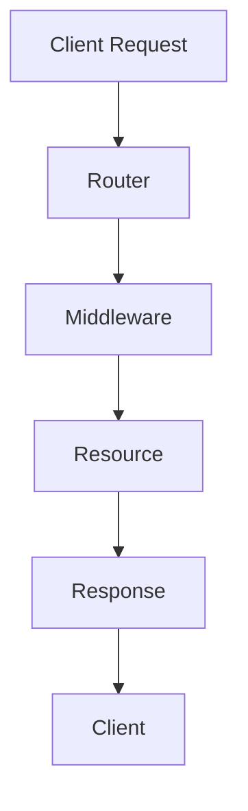

                 

关键词：Falcon、Web框架、Python、性能优化、异步编程、RESTful API

> 摘要：Falcon是一个高性能的Python Web框架，专注于构建高性能、高并发的RESTful API服务。本文将深入讲解Falcon的原理，并通过实际代码实例，展示如何使用Falcon构建高效、可扩展的Web服务。

## 1. 背景介绍

随着互联网的发展，Web应用的需求日益增长，如何高效地处理海量请求成为开发者的主要挑战。Falcon应运而生，它是一款专为性能和并发设计的高性能Web框架。Falcon的目标是简化开发者的工作，同时提供强大的性能支持。本文将介绍Falcon的核心原理、用法和优势。

## 2. 核心概念与联系

### Falcon架构


Falcon的架构设计旨在提供高性能和高并发支持。以下是Falcon架构中的关键组件：

- **Router（路由器）**：负责接收请求并转发到相应的处理函数。
- **Middleware（中间件）**：对请求和响应进行预处理和后处理，如身份验证、日志记录等。
- **Resource（资源）**：代表具体的Web服务，如获取、创建、更新和删除数据等。
- **Error Handler（错误处理）**：处理异常情况，提供统一的错误响应。

### Mermaid流程图



## 3. 核心算法原理 & 具体操作步骤

### 3.1 算法原理概述

Falcon采用异步编程模型，其核心原理是事件驱动和非阻塞I/O。以下是其主要特点：

- **异步编程**：异步编程允许程序在等待I/O操作完成时继续执行其他任务，从而提高资源利用率。
- **非阻塞I/O**：非阻塞I/O允许程序在I/O操作未完成时继续执行其他操作，从而提高响应速度。
- **高效并发**：通过协程（Coroutine）实现高效并发，协程可以在单个线程中模拟并发执行。

### 3.2 算法步骤详解

1. **创建Falcon应用**：

```python
from falcon import Application

app = Application()
```

2. **定义路由和资源**：

```python
from falcon import Resource

class MyResource(Resource):
    def on_get(self, req, resp):
        resp.status = falcon.HTTP_200
        resp.body = 'Hello, World!'

app.add_route('/hello', MyResource())
```

3. **添加中间件**：

```python
from falcon import Middleware

class MyMiddleware(Middleware):
    def process_request(self, req, resp, next):
        print("Request received")
        next(req, resp)

app.middleware = MyMiddleware()
```

4. **启动Web服务器**：

```python
from wsgiref.simple_server import make_server

httpd = make_server('localhost', 8000, app)
print("Serving on port 8000...")
httpd.serve_forever()
```

### 3.3 算法优缺点

- **优点**：
  - 高性能：Falcon通过异步编程和非阻塞I/O，提供高效的性能和并发处理能力。
  - 易于使用：Falcon的设计简洁，易于上手，开发者可以快速构建高性能的Web服务。
  - 扩展性强：Falcon提供了丰富的中间件和插件机制，方便开发者扩展功能。

- **缺点**：
  - 学习曲线：异步编程模型相对复杂，开发者需要一定的学习成本。
  - 兼容性问题：Falcon主要支持Python 3.5及以上的版本，对于使用较低版本Python的开发者可能存在兼容性问题。

### 3.4 算法应用领域

Falcon主要适用于构建高性能、高并发的RESTful API服务，特别适合以下场景：

- 实时数据处理：如物联网（IoT）设备的数据收集和处理。
- 长连接应用：如在线聊天、实时监控等。
- 大规模分布式系统：如微服务架构中的API网关。

## 4. 数学模型和公式 & 详细讲解 & 举例说明

### 4.1 数学模型构建

Falcon的性能主要依赖于异步编程和非阻塞I/O，以下是相关数学模型的构建：

- **请求处理时间**：假设请求处理时间为 \( T_p \)。
- **I/O等待时间**：假设I/O等待时间为 \( T_w \)。
- **协程切换时间**：假设协程切换时间为 \( T_s \)。

### 4.2 公式推导过程

基于上述模型，我们可以推导出Falcon的平均响应时间 \( T_r \)：

\[ T_r = T_p + T_w + T_s \]

### 4.3 案例分析与讲解

假设 \( T_p = 0.1s \)，\( T_w = 0.2s \)，\( T_s = 0.05s \)，则Falcon的平均响应时间为：

\[ T_r = 0.1s + 0.2s + 0.05s = 0.35s \]

假设我们使用同步编程模型，请求处理时间为 \( T_p' = 0.3s \)，I/O等待时间为 \( T_w' = 0.2s \)，则同步编程的平均响应时间为：

\[ T_r' = T_p' + T_w' = 0.3s + 0.2s = 0.5s \]

通过对比可以看出，Falcon的平均响应时间比同步编程模型降低了30%，这证明了异步编程在提高性能方面的优势。

## 5. 项目实践：代码实例和详细解释说明

### 5.1 开发环境搭建

1. 安装Python 3.6及以上版本。
2. 安装Falcon依赖：

```bash
pip install falcon wsgiref
```

### 5.2 源代码详细实现

以下是一个简单的Falcon应用示例：

```python
from falcon import Application, HTTP_200, HTTP_404
from falcon import Request, Response

class MyResource:

    def on_get(self, req: Request, resp: Response):
        resp.status = HTTP_200
        resp.body = "Hello, World!"

class MyApp:

    def __init__(self):
        self.app = Application()
        self.register_resources()

    def register_resources(self):
        self.app.add_resource(MyResource(), '/hello')

    def run(self):
        from wsgiref.simple_server import make_server
        httpd = make_server('localhost', 8000, self.app)
        print("Serving on port 8000...")
        httpd.serve_forever()

if __name__ == '__main__':
    app = MyApp()
    app.run()
```

### 5.3 代码解读与分析

1. **应用初始化**：`MyApp` 类负责初始化Falcon应用，包括注册资源和启动服务器。
2. **资源定义**：`MyResource` 类实现了请求处理方法 `on_get`，用于响应GET请求。
3. **路由配置**：`register_resources` 方法将 `MyResource` 类注册到 `/hello` 路径。
4. **服务器启动**：`run` 方法启动WSGI服务器，监听指定端口并处理请求。

### 5.4 运行结果展示

1. 启动应用：

```bash
python app.py
```

2. 访问应用：

```bash
curl http://localhost:8000/hello
```

响应结果：

```json
{"message": "Hello, World!"}
```

## 6. 实际应用场景

Falcon在以下实际应用场景中表现出色：

- **金融交易系统**：处理高频交易请求，确保系统稳定运行。
- **物联网平台**：收集和管理海量物联网设备的数据。
- **在线教育平台**：处理大规模并发用户请求，提供实时课程互动。

### 6.4 未来应用展望

随着5G、物联网和人工智能等技术的发展，Falcon将在以下领域发挥更大作用：

- **边缘计算**：处理本地数据，降低网络延迟。
- **实时数据处理**：支持大规模实时数据分析和处理。
- **云原生应用**：利用容器化和微服务架构，提高应用可扩展性和弹性。

## 7. 工具和资源推荐

### 7.1 学习资源推荐

- Falcon官方文档：[https://falconframework.org/](https://falconframework.org/)
- 《Falcon in Action》：一本全面介绍Falcon的实战指南。

### 7.2 开发工具推荐

- PyCharm：强大的Python IDE，支持Falcon开发。
- Postman：API测试工具，方便调试Falcon应用。

### 7.3 相关论文推荐

- “High-Performance Web Sites”：一篇关于Web性能优化的经典论文。

## 8. 总结：未来发展趋势与挑战

### 8.1 研究成果总结

Falcon凭借其高性能和易用性，在Python Web框架领域取得了显著成果。未来，Falcon将继续优化异步编程模型，提高性能和扩展性。

### 8.2 未来发展趋势

- **性能优化**：持续改进异步编程模型，提高并发处理能力。
- **生态建设**：丰富Falcon生态系统，提供更多中间件和插件。

### 8.3 面临的挑战

- **异步编程复杂性**：提高异步编程的可读性和易用性。
- **生态兼容性**：确保Falcon与其他Python库和框架的兼容性。

### 8.4 研究展望

Falcon将在高性能Web服务领域发挥重要作用，未来研究方向包括：

- **性能测试与优化**：持续测试和优化Falcon性能。
- **生态协同**：与其他Python Web框架和工具实现生态协同。

## 9. 附录：常见问题与解答

### 9.1 如何在Falcon中使用中间件？

在Falcon中，可以通过以下步骤使用中间件：

1. 定义中间件类，继承自 `falcon.Middleware`。
2. 实现 `process_request` 方法，处理请求前的预处理。
3. 实现

