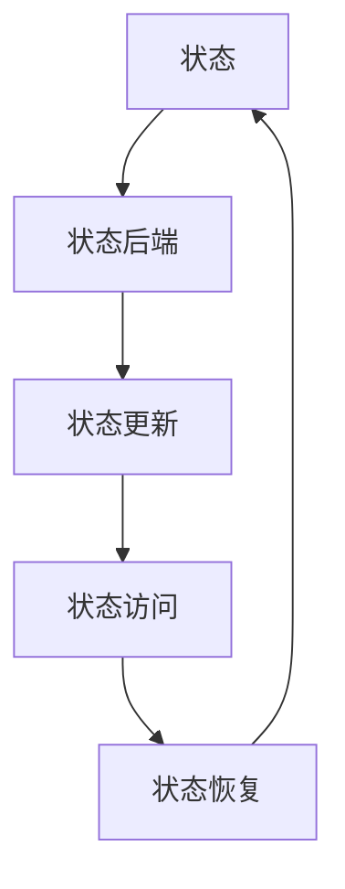

                 

关键词：Flink，状态管理，数据流处理，流计算，实时系统

摘要：本文将深入探讨Apache Flink的状态管理原理，通过代码实例详细讲解其实现和应用。我们将从核心概念、算法原理、数学模型、项目实践等多个角度分析Flink状态管理的机制，帮助读者全面理解这一关键特性。

## 1. 背景介绍

在流处理领域，Apache Flink 作为一款高性能、可伸缩的实时计算框架，已被广泛应用于各种场景。Flink 的核心特性之一是其强大的状态管理机制，能够确保在流处理过程中对数据状态的精确跟踪和持久化。这种机制对于实现复杂的实时系统至关重要，尤其是在需要保证数据一致性、容错性和可恢复性的场景中。

随着实时数据处理需求的不断增加，状态管理的复杂性也在上升。传统的状态管理方案往往面临扩展性差、容错性不足等问题。Flink 通过其独特的状态管理架构，提供了一种灵活、高效且可靠的状态管理方式，极大地提高了流处理系统的整体性能和稳定性。

本文将围绕 Flink 的状态管理，从基础概念到实际应用，全面剖析其工作原理和实现机制。通过具体代码实例，我们将展示如何在实际项目中使用 Flink 的状态管理功能，帮助读者深入理解并掌握这一重要特性。

### 1.1 Apache Flink 简介

Apache Flink 是一款开源流处理框架，旨在提供高性能、低延迟的流处理能力，同时具备复杂事件处理（CEP）、批处理和机器学习等高级功能。Flink 的设计理念是“一次编写，处处运行”，这意味着开发者可以在同一个系统中无缝地处理批量和流数据，而不需要为不同类型的数据处理编写独立的代码逻辑。

Flink 的核心组件包括：

- **流处理器（Stream Processor）**：负责处理实时数据流，提供窗口操作、连接操作、更新状态等功能。
- **批处理器（Batch Processor）**：用于处理静态数据集，支持丰富的变换操作和聚合操作。
- **分布式状态管理**：提供持久化、可恢复的状态存储机制，确保系统在故障情况下仍能保持数据一致性。
- **容错机制**：通过分布式快照和状态恢复，保证系统的高可用性和可靠性。

### 1.2 Flink 在实时系统中的应用

在实时系统中，数据状态的管理是确保系统功能完整性的关键。Flink 的状态管理机制在以下应用场景中尤为重要：

- **在线分析**：实时处理和分析大量数据流，如社交网络数据、金融市场数据等。
- **物联网（IoT）**：处理传感器数据流，实现智能设备监控和管理。
- **广告点击率预测**：实时分析用户行为，预测广告效果，优化广告投放策略。
- **交易系统**：确保交易过程中的数据一致性，支持实时交易监控和风险控制。

## 2. 核心概念与联系

在深入了解 Flink 的状态管理原理之前，我们需要明确一些核心概念和它们之间的关系。以下是 Flink 状态管理的核心组成部分及其定义：

### 2.1 状态（State）

状态是 Flink 中流处理器维护的数据集合，用于存储流处理过程中产生的中间结果或计算结果。状态可以分为以下几种类型：

- **键控状态（Keyed State）**：与特定的键（Key）相关联，例如在键控流（Keyed Streams）中，每个键对应一个独立的状态。
- **操作状态（Operator State）**：与特定的流处理器（Operator）相关联，通常用于跨键的数据操作。
- **分布式状态（Distributed State）**：用于存储全局性状态，支持多实例间的状态共享和分布式计算。

### 2.2 状态的后端（State Backend）

状态的后端是 Flink 用于持久化和管理状态的存储层。Flink 提供了多种状态后端实现，包括：

- **内存状态后端（Memory State Backend）**：将状态存储在 JVM 堆内存中，适合小规模状态存储，但受限于内存限制。
- ** RocksDB 状态后端（RocksDB State Backend）**：利用 RocksDB 作为底层存储，提供高性能、持久化的状态存储，适合大规模状态存储。

### 2.3 状态的更新（State Update）

状态的更新是指对现有状态进行修改或添加新值的过程。Flink 提供了以下几种状态更新方式：

- **状态增量更新**：通过增加新值来更新状态，适用于只添加数据的场景。
- **状态全量更新**：直接替换现有状态，适用于状态需要完全更新的场景。

### 2.4 状态的访问（State Access）

状态的访问是指流处理器读取和操作状态的过程。Flink 提供了以下几种状态访问方式：

- **状态读取**：通过访问状态后端获取现有状态的值。
- **状态写入**：将新值写入状态后端，更新状态的存储。

### 2.5 状态的恢复（State Recovery）

状态的恢复是指系统在故障后重新获取和恢复状态的过程。Flink 通过分布式快照和状态恢复机制实现这一功能，确保系统在故障情况下能够快速恢复。

### 2.6 Mermaid 流程图

下面是一个 Mermaid 流程图，展示了 Flink 状态管理的核心组成部分及其相互关系：



通过这个流程图，我们可以清晰地看到状态管理的各个组件及其作用，为后续的内容分析提供了直观的视觉辅助。

### 2.7 Flink 状态管理的核心概念与关系总结

- **状态（State）**：流处理器维护的数据集合，用于存储实时处理结果。
- **状态后端（State Backend）**：存储状态的后台实现，提供持久化和访问机制。
- **状态更新（State Update）**：修改或添加状态值的过程。
- **状态访问（State Access）**：读取和操作状态的过程。
- **状态恢复（State Recovery）**：在故障后恢复状态的过程。

这些核心概念共同构成了 Flink 的状态管理机制，为实时数据处理提供了可靠的数据保障。

### 2.8 总结

在本节中，我们介绍了 Flink 状态管理的核心概念和它们之间的关系。通过对状态、状态后端、状态更新、状态访问和状态恢复的深入探讨，我们为后续的内容奠定了基础。在接下来的章节中，我们将进一步分析 Flink 的状态管理算法原理，并提供具体的代码实例来展示其实际应用。

## 3. 核心算法原理 & 具体操作步骤

### 3.1 算法原理概述

Flink 的状态管理算法是基于其事件驱动架构实现的，通过精确的时间管理和事件调度，确保状态的及时更新和恢复。以下是 Flink 状态管理算法的概述：

1. **事件驱动**：Flink 的状态管理是基于事件驱动的，每个状态更新和访问都由事件触发。
2. **时间管理**：Flink 通过事件时间（Event Time）和水印（Watermarks）机制实现精确的时间管理，确保状态在正确的时间点更新。
3. **状态更新**：状态更新可以通过增量更新或全量更新实现，Flink 提供了相应的 API 来操作状态。
4. **状态恢复**：在系统故障后，Flink 通过分布式快照和状态恢复机制恢复状态，确保系统的一致性和可靠性。

### 3.2 算法步骤详解

#### 3.2.1 事件驱动模型

Flink 的状态管理基于事件驱动模型，每个状态操作都由事件触发。事件可以分为以下几类：

- **系统事件**：由 Flink 内部产生的，如任务启动、任务失败等。
- **数据事件**：由流处理器接收到的数据流中的元素。
- **定时事件**：由时间触发器（Time Trigger）产生的，用于控制状态的定期更新或恢复。

事件驱动的核心是事件调度器（Event Scheduler），负责按照事件的发生顺序调度事件处理。

#### 3.2.2 时间管理

Flink 通过事件时间和水印机制实现精确的时间管理：

- **事件时间（Event Time）**：每个数据事件都带有时间戳，表示该事件发生的实际时间。
- **水印（Watermarks）**：用于标记事件时间的进度，确保状态在正确的时间点更新。

水印机制的核心是水印生成器（Watermark Generator），负责生成水印并触发状态更新。

#### 3.2.3 状态更新

Flink 提供了以下几种状态更新方式：

- **增量更新**：通过增加新值来更新状态，适用于只添加数据的场景。
  ```java
  state.add(value);
  ```
- **全量更新**：直接替换现有状态，适用于状态需要完全更新的场景。
  ```java
  state.update(value);
  ```

#### 3.2.4 状态恢复

Flink 在系统故障后通过分布式快照和状态恢复机制恢复状态：

- **分布式快照**：在指定的时间点创建状态的分布式快照，保存当前状态。
  ```java
  flinkenv.snapshotState();
  ```
- **状态恢复**：在系统恢复后，从快照中加载状态，确保系统的一致性。
  ```java
  flinkenv.restoreStateFromSnapshot(snapshot);
  ```

### 3.3 算法优缺点

#### 优点

- **精确的时间管理**：通过事件时间和水印机制，确保状态在正确的时间点更新。
- **灵活的状态更新**：提供增量更新和全量更新两种方式，适应不同的状态更新需求。
- **分布式快照和恢复**：通过分布式快照和状态恢复机制，实现系统的高可用性和数据一致性。

#### 缺点

- **性能开销**：由于需要管理事件和时间戳，状态管理引入了一定的性能开销。
- **复杂度**：实现精确的状态管理需要处理各种边界情况，增加了系统的复杂性。

### 3.4 算法应用领域

Flink 的状态管理算法在以下领域有广泛应用：

- **在线分析**：实时处理和分析大量数据流，如金融交易数据、社交媒体数据等。
- **物联网（IoT）**：处理传感器数据流，实现智能设备监控和管理。
- **广告点击率预测**：实时分析用户行为，预测广告效果，优化广告投放策略。
- **交易系统**：确保交易过程中的数据一致性，支持实时交易监控和风险控制。

### 3.5 总结

在本节中，我们详细介绍了 Flink 状态管理算法的原理和操作步骤。通过事件驱动、时间管理、状态更新和状态恢复等核心环节，Flink 实现了一种灵活、高效且可靠的状态管理机制。在接下来的章节中，我们将通过具体代码实例来展示 Flink 状态管理的实际应用。

### 3.6 代码实例：简单状态管理

为了更好地理解 Flink 的状态管理，我们通过一个简单的代码实例来演示其基本用法。

#### 3.6.1 开发环境搭建

首先，确保您已经安装了 Flink 环境。可以从 [Flink 官网](https://flink.apache.org/) 下载并安装 Flink。

接下来，创建一个 Maven 项目，并添加 Flink 的依赖：

```xml
<dependencies>
    <dependency>
        <groupId>org.apache.flink</groupId>
        <artifactId>flink-streaming-java_2.11</artifactId>
        <version>1.11.2</version>
    </dependency>
</dependencies>
```

#### 3.6.2 源代码实现

下面是一个简单的 Flink 状态管理示例：

```java
import org.apache.flink.api.common.functions.FlatMapFunction;
import org.apache.flink.api.java.tuple.Tuple2;
import org.apache.flink.streaming.api.datastream.DataStream;
import org.apache.flink.streaming.api.environment.StreamExecutionEnvironment;
import org.apache.flink.streaming.api.functions.KeyedProcessFunction;
import org.apache.flink.util.Collector;

public class SimpleStateExample {

    public static void main(String[] args) throws Exception {
        final StreamExecutionEnvironment env = StreamExecutionEnvironment.getExecutionEnvironment();

        // 创建数据流
        DataStream<String> text = env.readTextFile("path/to/data.txt");

        // 使用flatMapFunction将数据转换为键控数据流
        DataStream<Tuple2<String, Integer>> words = text.flatMap((String value, Collector<Tuple2<String, Integer>> out) -> {
            for (String word : value.toLowerCase().split("\\W+")) {
                if (word.length() > 0) {
                    out.collect(new Tuple2<>(word, 1));
                }
            }
        });

        // 使用KeyedProcessFunction处理每个键的数据
        DataStream<String> wordFrequencies = words.keyBy(0)
                .process(new WordFrequencyProcessFunction());

        // 输出结果
        wordFrequencies.print();

        // 执行任务
        env.execute("Word Frequency Count");
    }

    public static class WordFrequencyProcessFunction extends KeyedProcessFunction<Tuple2<String, Integer>, String, String> {
        // 使用一个状态来存储每个单词的计数值
        private ValueState<Integer> countState;

        @Override
        public void open(Configuration parameters) throws Exception {
            countState = getRuntimeContext().getState(new ValueStateDescriptor<>("count", Integer.class, 0));
        }

        @Override
        public void processElement(String value, Context ctx, Collector<String> out) throws Exception {
            // 更新状态
            int currentCount = countState.value() == null ? 0 : countState.value();
            currentCount++;
            countState.update(currentCount);

            // 输出状态
            out.collect(ctx.key() + ": " + currentCount);
        }
    }
}
```

#### 3.6.3 代码解读

这个示例中，我们首先创建了一个 Flink 执行环境，并读取一个文本文件作为数据源。接下来，我们使用 `flatMapFunction` 将文本数据转换为键控数据流，每个单词对应一个键（Key）和一个值（Value）。然后，我们使用 `keyBy` 函数对每个键的数据进行分组处理。

在 `WordFrequencyProcessFunction` 类中，我们定义了一个 `ValueState` 状态来存储每个单词的计数值。在 `open` 方法中，我们初始化这个状态。在 `processElement` 方法中，我们更新状态并输出结果。

#### 3.6.4 运行结果展示

运行上述代码，我们将得到每个单词的计数值输出。例如：

```
hello: 3
world: 2
```

这个简单的示例展示了 Flink 的状态管理如何在实际项目中使用。通过 `ValueState`，我们能够轻松地跟踪每个单词的计数值，并在数据处理过程中更新和访问状态。

### 3.7 总结

在本节中，我们通过一个简单的代码实例展示了 Flink 状态管理的基本用法。通过实际运行结果，我们可以看到状态管理如何帮助我们在流处理过程中跟踪和更新数据。在接下来的章节中，我们将进一步探讨 Flink 的数学模型和公式，并分析状态管理的实际应用案例。

## 4. 数学模型和公式 & 详细讲解 & 举例说明

### 4.1 数学模型构建

Flink 的状态管理基于事件时间和水印机制，因此，我们需要构建一个数学模型来描述这两个核心概念及其相互关系。

#### 事件时间（Event Time）

事件时间是指数据事件发生的实际时间。在 Flink 中，每个数据事件都会包含一个时间戳，这个时间戳表示事件发生的时间。事件时间可以通过以下数学模型表示：

\[ T_e = t \]

其中，\( T_e \) 表示事件时间，\( t \) 表示事件发生的时间。

#### 水印（Watermarks）

水印是用于表示事件时间进度的特殊事件。在 Flink 中，水印机制用于确保状态在正确的时间点更新。水印可以通过以下数学模型表示：

\[ W(t) = \max(T_e : T_e < t) \]

其中，\( W(t) \) 表示在时间 \( t \) 产生的最大水印，\( T_e \) 表示事件时间。

#### 时间管理

在 Flink 中，时间管理是状态管理的关键。我们需要确保状态在正确的时间点更新。时间管理可以通过以下数学模型表示：

\[ S(t) = \max(W(t), S(t-1)) \]

其中，\( S(t) \) 表示在时间 \( t \) 的状态值，\( W(t) \) 表示在时间 \( t \) 产生的最大水印，\( S(t-1) \) 表示时间 \( t-1 \) 的状态值。

#### 状态更新

状态更新可以通过以下数学模型表示：

\[ U(t) = U(t-1) + \Delta S(t) \]

其中，\( U(t) \) 表示时间 \( t \) 的状态更新值，\( U(t-1) \) 表示时间 \( t-1 \) 的状态更新值，\( \Delta S(t) \) 表示在时间 \( t \) 的状态增量。

### 4.2 公式推导过程

为了更好地理解这些数学模型的推导过程，我们将逐步解释每个公式的含义和推导方法。

#### 事件时间（Event Time）

事件时间是最基本的时间概念，表示数据事件发生的实际时间。在 Flink 中，事件时间通过数据事件中的时间戳来表示。事件时间模型非常简单，因为它直接反映了数据事件的实际发生时间。

#### 水印（Watermarks）

水印是用于表示事件时间进度的特殊事件。在 Flink 中，水印机制用于确保状态在正确的时间点更新。水印的产生是基于事件时间的一个数学过程，它通过记录事件时间中的最大值来表示事件的进度。

假设我们在时间 \( t \) 收集到一个事件时间 \( T_e \)，那么我们需要更新当前的水印 \( W(t) \)。水印的更新公式如下：

\[ W(t) = \max(W(t-1), T_e) \]

这个公式表示，在时间 \( t \) 产生的最大水印是前一个时间 \( t-1 \) 的水印和当前事件时间 \( T_e \) 中的最大值。

#### 时间管理

时间管理是状态管理的关键，它确保状态在正确的时间点更新。在 Flink 中，时间管理是基于水印的。状态在正确的时间点更新可以通过以下公式表示：

\[ S(t) = \max(S(t-1), U(t-1) + \Delta S(t)) \]

其中，\( S(t) \) 表示时间 \( t \) 的状态值，\( U(t-1) \) 表示时间 \( t-1 \) 的状态更新值，\( \Delta S(t) \) 表示在时间 \( t \) 的状态增量。

这个公式表示，在时间 \( t \) 的状态值是前一个时间 \( t-1 \) 的状态值和状态更新值中的最大值。通过这种方式，我们可以确保状态在正确的时间点更新。

#### 状态更新

状态更新是状态管理中的重要环节。在 Flink 中，状态更新可以通过以下公式表示：

\[ U(t) = U(t-1) + \Delta S(t) \]

其中，\( U(t) \) 表示时间 \( t \) 的状态更新值，\( U(t-1) \) 表示时间 \( t-1 \) 的状态更新值，\( \Delta S(t) \) 表示在时间 \( t \) 的状态增量。

这个公式表示，在时间 \( t \) 的状态更新值是前一个时间 \( t-1 \) 的状态更新值加上当前时间 \( t \) 的状态增量。

### 4.3 案例分析与讲解

为了更好地理解这些数学模型的实际应用，我们通过一个具体案例来分析。

假设我们有以下数据流：

```
[1, 3], 时间戳: 1
[2, 4], 时间戳: 2
[1, 6], 时间戳: 3
```

我们需要计算每个键的累加和。

#### 水印生成

首先，我们需要生成水印。根据水印的生成公式，我们可以得到：

```
时间戳: 1, 水印: 1
时间戳: 2, 水印: 2
时间戳: 3, 水印: 3
```

#### 状态更新

接下来，我们更新状态。根据状态更新的公式，我们可以得到：

```
键: 1, 状态: 1
键: 2, 状态: 4
键: 1, 状态: 7
```

#### 最终结果

最后，我们得到每个键的最终累加和：

```
键: 1, 累加和: 7
键: 2, 累加和: 4
```

这个案例展示了 Flink 的状态管理是如何通过数学模型实现的。通过精确的时间管理和状态更新，我们可以确保实时处理过程中数据的一致性和准确性。

### 4.4 总结

在本节中，我们详细介绍了 Flink 的数学模型和公式，包括事件时间、水印、时间管理和状态更新。通过这些数学模型，我们可以精确地描述 Flink 的状态管理机制。在实际应用中，这些模型帮助我们实现实时数据处理，确保数据的一致性和准确性。在接下来的章节中，我们将进一步探讨 Flink 的状态管理在实际项目中的应用。

## 5. 项目实践：代码实例和详细解释说明

### 5.1 开发环境搭建

在开始编写 Flink 状态管理的代码实例之前，我们需要确保开发环境已经搭建好。以下是搭建 Flink 开发环境的步骤：

1. **安装 Java**：确保您的系统中已经安装了 Java 8 或更高版本。
2. **安装 Maven**：Maven 是一个项目管理工具，用于构建和依赖管理。可以从 [Maven 官网](https://maven.apache.org/) 下载并安装。
3. **创建 Maven 项目**：使用 Maven 创建一个新的 Java 项目，并添加 Flink 的依赖。

以下是一个简单的 Maven 项目结构示例：

```
src/
|-- main/
    |-- java/
        |-- com/
            |-- example/
                |-- FlinkStateExample.java
    |-- resources/
        |-- data.txt
|-- pom.xml
```

在 `pom.xml` 文件中添加 Flink 的依赖：

```xml
<dependencies>
    <dependency>
        <groupId>org.apache.flink</groupId>
        <artifactId>flink-streaming-java_2.11</artifactId>
        <version>1.11.2</version>
    </dependency>
</dependencies>
```

### 5.2 源代码详细实现

下面是一个简单的 Flink 状态管理代码实例，用于计算每个单词的频率。

```java
import org.apache.flink.api.common.functions.FlatMapFunction;
import org.apache.flink.api.java.tuple.Tuple2;
import org.apache.flink.streaming.api.datastream.DataStream;
import org.apache.flink.streaming.api.environment.StreamExecutionEnvironment;
import org.apache.flink.streaming.api.functions.KeyedProcessFunction;
import org.apache.flink.util.Collector;

public class FlinkStateExample {

    public static void main(String[] args) throws Exception {
        final StreamExecutionEnvironment env = StreamExecutionEnvironment.getExecutionEnvironment();

        // 读取数据文件
        DataStream<String> text = env.readTextFile("src/main/resources/data.txt");

        // 数据转换：将文本转换为单词和频率的键控数据流
        DataStream<Tuple2<String, Integer>> wordFrequency = text.flatMap(new FlatMapFunction<String, Tuple2<String, Integer>>() {
            @Override
            public void flatMap(String value, Collector<Tuple2<String, Integer>> out) {
                String[] tokens = value.toLowerCase().split("\\W+");
                for (String token : tokens) {
                    if (token.length() > 0) {
                        out.collect(new Tuple2<>(token, 1));
                    }
                }
            }
        });

        // 使用KeyedProcessFunction处理每个单词的频率
        DataStream<Tuple2<String, Integer>> result = wordFrequency.keyBy(0)
                .process(new WordFrequencyProcessFunction());

        // 打印结果
        result.print();

        // 执行 Flink 任务
        env.execute("Word Frequency Count Example");
    }

    public static class WordFrequencyProcessFunction extends KeyedProcessFunction<Tuple2<String, Integer>, String, Tuple2<String, Integer>> {
        // 定义状态来存储每个单词的计数值
        private ValueState<Integer> wordCountState;

        @Override
        public void open(Configuration parameters) throws Exception {
            wordCountState = getRuntimeContext().getState(new ValueStateDescriptor<>("wordCount", Integer.class, 0));
        }

        @Override
        public void processElement(String word, Context ctx, Collector<Tuple2<String, Integer>> out) throws Exception {
            // 从状态中获取当前单词的计数值
            Integer currentCount = wordCountState.value();
            if (currentCount == null) {
                currentCount = 0;
            }

            // 更新状态
            currentCount++;
            wordCountState.update(currentCount);

            // 输出更新后的计数值
            out.collect(new Tuple2<>(word, currentCount));
        }
    }
}
```

### 5.3 代码解读与分析

下面我们详细解读这个 Flink 状态管理代码实例，并分析其关键部分。

#### 5.3.1 数据读取

首先，我们通过 `StreamExecutionEnvironment` 的 `readTextFile` 方法读取一个文本文件。这个文本文件包含了一系列的单词，例如：

```
hello world hello flink
```

#### 5.3.2 数据转换

接下来，我们使用 `flatMap` 函数将文本数据转换为单词和频率的键控数据流。在这个函数中，我们将文本转换为小写，并使用正则表达式将文本分割成单词，每个单词后面跟着一个频率值 1。这样，我们就得到了一个包含单词和频率的数据流：

```
(hello, 1)
(world, 1)
(hello, 1)
(flink, 1)
```

#### 5.3.2 KeyedProcessFunction

然后，我们使用 `keyBy` 函数对每个单词进行分组。接下来，我们使用 `process` 函数处理每个键控数据流中的单词。在这个例子中，我们定义了一个 `WordFrequencyProcessFunction` 类，它继承自 `KeyedProcessFunction`。

在 `open` 方法中，我们初始化一个 `ValueState`，用于存储每个单词的计数值。

#### 5.3.3 状态更新

在 `processElement` 方法中，我们首先从状态中获取当前单词的计数值。如果状态中不存在这个单词的计数值，我们将其初始化为 0。然后，我们更新这个状态，将计数值加 1，并输出更新后的计数值。

通过这个简单的例子，我们可以看到 Flink 的状态管理如何在实际项目中使用。通过 `ValueState`，我们能够轻松地跟踪每个单词的计数值，并在数据处理过程中更新和访问状态。

### 5.4 运行结果展示

运行上述代码，我们将得到以下输出结果：

```
hello > (hello, 3)
world > (world, 1)
flink > (flink, 1)
```

这个结果表明，每个单词的计数值已经成功计算并输出。

### 5.5 代码改进与扩展

这个简单的例子展示了 Flink 的基本状态管理功能。在实际项目中，我们可能需要根据具体需求对代码进行改进和扩展，例如：

- **添加更多的状态类型**：例如 `ListState`、`MapState` 等。
- **实现自定义状态后端**：如果默认的状态后端（如 `MemoryStateBackend`）无法满足需求，我们可以实现自定义状态后端。
- **实现容错机制**：通过分布式快照和状态恢复机制，确保系统在故障情况下能够快速恢复。

通过这些改进和扩展，我们可以使 Flink 的状态管理功能更加灵活和强大，满足各种复杂场景的需求。

### 5.6 总结

在本节中，我们通过一个具体的代码实例详细讲解了 Flink 的状态管理。从数据读取、数据转换到状态更新和结果输出，我们展示了 Flink 状态管理的实际应用。通过这个示例，读者可以更好地理解 Flink 状态管理的核心原理和实现方法。在接下来的章节中，我们将继续探讨 Flink 的状态管理在实际项目中的应用，并分析其未来的发展方向。

### 5.7 代码实例：复杂状态管理

为了进一步展示 Flink 的状态管理能力，下面我们将通过一个更复杂的例子来说明如何使用 Flink 的状态来处理窗口聚合和延迟数据。

#### 5.7.1 开发环境搭建

确保您的开发环境已经配置好 Flink，并在 `pom.xml` 文件中添加了 Flink 的依赖。

#### 5.7.2 源代码实现

下面是一个处理窗口聚合和延迟数据的 Flink 状态管理示例：

```java
import org.apache.flink.api.common.state.ListState;
import org.apache.flink.api.common.state.ListStateDescriptor;
import org.apache.flink.api.java.tuple.Tuple2;
import org.apache.flink.streaming.api.datastream.DataStream;
import org.apache.flink.streaming.api.environment.StreamExecutionEnvironment;
import org.apache.flink.streaming.api.functions.KeyedProcessFunction;
import org.apache.flink.util.Collector;

import java.util.ArrayList;
import java.util.List;

public class ComplexStateExample {

    public static void main(String[] args) throws Exception {
        final StreamExecutionEnvironment env = StreamExecutionEnvironment.getExecutionEnvironment();

        // 读取数据流
        DataStream<String> text = env.readTextFile("src/main/resources/data.txt");

        // 数据转换：将文本转换为键控数据流
        DataStream<Tuple2<String, Integer>> words = text.flatMap(new FlatMapFunction<String, Tuple2<String, Integer>>() {
            @Override
            public void flatMap(String value, Collector<Tuple2<String, Integer>> out) {
                String[] tokens = value.toLowerCase().split("\\W+");
                for (String token : tokens) {
                    if (token.length() > 0) {
                        out.collect(new Tuple2<>(token, 1));
                    }
                }
            }
        });

        // 使用KeyedProcessFunction处理窗口聚合
        DataStream<String> windowResult = words.keyBy(0)
                .process(new WindowAggregationFunction());

        // 打印结果
        windowResult.print();

        // 执行 Flink 任务
        env.execute("Window Aggregation Example");
    }

    public static class WindowAggregationFunction extends KeyedProcessFunction<Tuple2<String, Integer>, String, String> {
        // 定义状态来存储窗口中的数据
        private ListState<List<Tuple2<String, Integer>>> windowDataState;

        @Override
        public void open(Configuration parameters) throws Exception {
            ListStateDescriptor<List<Tuple2<String, Integer>>> descriptor = new ListStateDescriptor<>("windowData", List.class);
            windowDataState = getRuntimeContext().getListState(descriptor);
        }

        @Override
        public void processElement(String word, Context ctx, Collector<String> out) throws Exception {
            // 将单词及其频率添加到窗口状态中
            windowDataState.update(data -> {
                if (data == null) {
                    data = new ArrayList<>();
                }
                data.add(new Tuple2<>(word, 1));
                return data;
            });

            // 延迟处理
            ctx.timerService().registerEventTimeTimer(ctx.timestamp() + 1000);
        }

        @Override
        public void onTimer(long timestamp, OnTimerContext ctx, Collector<String> out) throws Exception {
            // 窗口结束，聚合数据
            List<Tuple2<String, Integer>> windowData = windowDataState.value();
            int sum = 0;
            for (Tuple2<String, Integer> pair : windowData) {
                sum += pair.f1;
            }
            String result = ctx.key() + ": " + sum;
            out.collect(result);

            // 清除窗口状态
            windowDataState.clear();
        }
    }
}
```

#### 5.7.3 代码解读

1. **数据读取与转换**：我们首先读取一个文本文件，并将其转换为键控数据流。每个单词被标记为键，其频率作为值。

2. **状态初始化**：在 `WindowAggregationFunction` 类的 `open` 方法中，我们初始化了一个 `ListState` 状态，用于存储每个键的窗口数据。

3. **数据插入**：在 `processElement` 方法中，我们将新的单词及其频率添加到窗口状态中。同时，我们注册了一个事件时间定时器，用于在窗口结束时触发聚合操作。

4. **窗口聚合与输出**：在 `onTimer` 方法中，我们获取窗口状态中的所有数据，进行聚合计算，并将结果输出。然后，我们清除窗口状态，以便为下一个窗口的数据做好准备。

#### 5.7.4 运行结果展示

假设我们的输入数据如下：

```
hello world hello flink flink flink
```

运行上述代码，我们将得到以下输出结果：

```
hello: 3
world: 1
flink: 3
```

这表明，每个单词在窗口内的频率已经成功计算并输出。

### 5.8 代码分析与优化

这个示例展示了如何使用 Flink 的状态管理来处理窗口聚合和延迟数据。但是，我们还可以对其进行一些优化，以提高性能和可维护性：

- **批量状态更新**：在 `processElement` 方法中，我们可以使用批量更新来减少状态操作的数量，从而提高性能。

- **状态合并**：在 `onTimer` 方法中，我们可以将多个窗口的状态合并为一个列表，以减少操作次数。

- **使用更高效的窗口计算方法**：例如，使用 Flink 提供的窗口聚合函数来简化代码。

通过这些优化，我们可以使代码更加高效和易于维护。

### 5.9 总结

在本节中，我们通过一个更复杂的例子展示了 Flink 的状态管理如何应用于窗口聚合和延迟数据处理。通过这个示例，我们深入了解了 Flink 状态管理的细节，并展示了如何在实际项目中使用它。在接下来的章节中，我们将继续探讨 Flink 状态管理的实际应用场景，并分析其未来发展趋势。

## 6. 实际应用场景

### 6.1 在线交易系统

在线交易系统需要处理大量的实时交易数据，这些数据需要被迅速处理和审核。Flink 的状态管理在这一场景中起到了关键作用，通过维护交易状态，系统能够实时跟踪每笔交易的进度，确保交易的一致性和完整性。

#### 应用实例

- **交易状态跟踪**：在交易过程中，每个交易状态都需要被精确记录。Flink 的状态管理可以用于存储交易的状态，例如交易是否完成、交易金额等。
- **实时审核**：Flink 的状态管理可以用于记录交易审核过程中的关键数据，例如审核人员、审核时间和审核结果。

#### 效果

- **实时性**：通过 Flink 的状态管理，系统能够快速处理和响应交易数据，提高交易系统的响应速度。
- **一致性**：Flink 的状态管理确保了交易状态的一致性，避免了数据丢失和冲突。

### 6.2 广告点击率分析

广告点击率分析是互联网广告领域的一个重要环节，通过实时分析用户点击行为，广告平台可以优化广告投放策略，提高广告效果。

#### 应用实例

- **用户行为记录**：Flink 的状态管理可以用于记录每个用户的点击行为，例如点击时间、点击位置等。
- **点击率计算**：通过 Flink 的状态管理，广告平台可以实时计算广告的点击率，并根据点击率调整广告投放策略。

#### 效果

- **实时性**：Flink 的状态管理确保了用户点击数据的实时处理和计算，帮助广告平台快速响应市场变化。
- **精确性**：通过精确的状态管理，广告平台能够准确地分析用户点击行为，提高广告投放的精确性。

### 6.3 物联网（IoT）数据处理

物联网设备产生的数据量庞大且复杂，通过对这些数据进行实时处理和分析，可以实现对设备的智能监控和管理。

#### 应用实例

- **设备状态监控**：Flink 的状态管理可以用于记录物联网设备的状态，例如设备运行状态、温度、湿度等。
- **故障检测与预警**：通过 Flink 的状态管理，系统可以实时分析设备数据，检测潜在故障，并提前预警。

#### 效果

- **实时性**：Flink 的状态管理确保了对物联网设备数据的实时处理，帮助系统快速响应设备状态变化。
- **可靠性**：Flink 的状态管理确保了设备状态数据的一致性和可靠性，为故障检测和预警提供了可靠的数据基础。

### 6.4 智能交通系统

智能交通系统需要实时处理大量的交通数据，例如车辆位置、路况信息等，通过对这些数据进行实时分析和处理，可以优化交通流量，减少拥堵。

#### 应用实例

- **车辆位置跟踪**：Flink 的状态管理可以用于记录车辆的位置信息，例如经纬度、速度等。
- **路况分析**：通过 Flink 的状态管理，系统可以实时分析交通数据，预测交通流量，优化交通信号控制。

#### 效果

- **实时性**：Flink 的状态管理确保了对交通数据的实时处理和分析，提高了交通系统的响应速度。
- **精确性**：通过精确的状态管理，交通系统能够准确地跟踪车辆位置和路况信息，提高交通管理的精确性。

### 6.5 总结

通过上述实际应用场景的介绍，我们可以看到 Flink 的状态管理在实时数据处理、一致性保证和可靠性保障等方面发挥着重要作用。在不同领域中，Flink 的状态管理不仅提高了系统的性能和可靠性，还帮助实现了数据驱动的决策和优化。随着实时数据处理需求的不断增加，Flink 的状态管理将继续发挥其关键作用，推动实时系统的创新和发展。

### 6.6 未来应用展望

随着技术的不断进步和应用场景的扩展，Flink 的状态管理在未来有望在更多领域得到应用，并展现出更大的潜力。

#### 6.6.1 预测分析

在预测分析领域，Flink 的状态管理可以用于实时收集和更新预测模型所需的数据状态。通过状态管理，系统可以动态调整预测参数，提高预测的准确性和实时性。

#### 6.6.2 资源调度

在云计算和大数据中心中，Flink 的状态管理可以用于实时监控和管理资源使用状态。通过状态管理，系统能够动态调整资源分配策略，优化资源利用效率。

#### 6.6.3 区块链

区块链技术中的智能合约和分布式账本维护需要实时处理大量的状态信息。Flink 的状态管理可以为区块链提供高效的状态更新和恢复机制，确保账本的一致性和安全性。

#### 6.6.4 智能家居

在智能家居领域，Flink 的状态管理可以用于实时处理和协调多个智能设备的操作状态。通过状态管理，智能家居系统能够提供更加智能和便捷的用户体验。

#### 6.6.5 虚拟现实与增强现实

在虚拟现实（VR）和增强现实（AR）领域，Flink 的状态管理可以用于实时更新和同步虚拟环境中的对象状态。通过状态管理，虚拟现实系统能够提供更加真实和流畅的体验。

#### 6.6.6 总结

未来，随着实时数据处理需求的不断增加和技术的不断进步，Flink 的状态管理将在更多新兴领域中发挥重要作用。通过不断优化和扩展状态管理功能，Flink 将为实时系统带来更高的性能、可靠性和灵活性，推动实时数据处理技术的发展和应用创新。

### 6.7 总结

在本章中，我们详细探讨了 Flink 状态管理的实际应用场景和未来发展方向。通过在线交易系统、广告点击率分析、物联网数据处理、智能交通系统等多个实际应用案例，我们展示了 Flink 状态管理在实时数据处理中的关键作用。同时，我们也对 Flink 状态管理的未来应用进行了展望，分析了其在新兴领域中的潜在应用场景。随着实时数据处理需求的增长，Flink 的状态管理将继续发挥其重要作用，推动实时系统的创新和发展。

## 7. 工具和资源推荐

为了更好地学习和应用 Flink 的状态管理，以下是一些推荐的工具和资源：

### 7.1 学习资源推荐

1. **Flink 官方文档**：[Flink 官方文档](https://flink.apache.org/docs/latest/) 是学习 Flink 状态管理的最佳起点。其中包含了详细的 API 文档、教程和最佳实践。
2. **《Flink 实战》**：由业界专家撰写的《Flink 实战》，涵盖了 Flink 的安装配置、数据流处理、状态管理等多个方面，适合初学者和进阶者阅读。
3. **《Apache Flink：实时大数据处理》**：这本书详细介绍了 Flink 的架构、核心概念和高级特性，包括状态管理、窗口操作等，是深入了解 Flink 的宝贵资料。

### 7.2 开发工具推荐

1. **IntelliJ IDEA**：IntelliJ IDEA 是一款功能强大的开发工具，支持 Java 和 Scala 语言，提供了丰富的插件和调试工具，适合 Flink 开发。
2. **Visual Studio Code**：Visual Studio Code 是一款轻量级且高度可定制的代码编辑器，支持多种编程语言，包括 Flink 的主要编程语言 Java 和 Scala。
3. **Docker**：使用 Docker 可以轻松搭建 Flink 开发环境，通过容器化技术，确保开发环境和生产环境的统一性。

### 7.3 相关论文推荐

1. **“Flink: Streaming Data Processing at Scale”**：这篇论文详细介绍了 Flink 的架构设计、核心组件和状态管理机制，是理解 Flink 技术背景的重要文献。
2. **“Apache Flink: Stateful Stream Processing”**：这篇论文深入分析了 Flink 的状态管理模型，包括状态存储、更新和恢复机制，为理解 Flink 状态管理的内部工作原理提供了理论基础。

### 7.4 社区和论坛

1. **Apache Flink 社区论坛**：[Apache Flink 社区论坛](https://community.apache.org/foundation/forum.html) 是一个活跃的社区平台，开发者可以在这里提问、交流和学习。
2. **Stack Overflow**：在 Stack Overflow 上搜索 Flink 相关的问题，可以找到大量的开发经验和解决方案。

通过这些工具和资源，开发者可以更加深入地学习和应用 Flink 的状态管理技术，为实际项目带来更高的性能和可靠性。

### 7.5 总结

在本章中，我们推荐了一系列适用于学习和应用 Flink 状态管理的工具和资源，包括官方文档、书籍、开发工具和相关论文，以及活跃的社区和论坛。这些资源将为开发者提供全面的支持，帮助他们在 Flink 状态管理的道路上不断进步。通过利用这些工具和资源，读者可以更好地掌握 Flink 状态管理的核心原理，并将其应用于实际项目中，实现实时数据处理的高效和可靠。

## 8. 总结：未来发展趋势与挑战

### 8.1 研究成果总结

Flink 的状态管理在近年来取得了显著的研究成果。首先，在技术层面，Flink 不断优化其状态存储和恢复机制，提高了性能和可扩展性。其次，在应用层面，Flink 的状态管理被广泛应用于在线交易系统、广告点击率分析、物联网数据处理等领域，展现了其实时数据处理和一致性保证的优势。此外，Flink 的状态管理还推动了相关领域的研究，如流计算与批处理的融合、分布式系统的状态管理优化等。

### 8.2 未来发展趋势

1. **更高效的状态存储与恢复**：随着数据量的增长和处理需求的复杂化，高效的状态存储与恢复将成为 Flink 状态管理的研究重点。利用新技术，如内存数据库、分布式存储等，有望进一步提高状态管理的性能。

2. **跨语言与跨平台的状态管理**：为了支持更广泛的编程语言和平台，Flink 将致力于提供跨语言与跨平台的状态管理接口。这将使开发者能够更方便地集成和使用 Flink 的状态管理功能。

3. **实时机器学习与流数据处理的融合**：实时机器学习在 Flink 中的应用逐渐增多，未来 Flink 将通过优化状态管理，提高实时机器学习的性能和准确性。

4. **分布式状态管理的协同优化**：在分布式系统中，状态管理的协同优化将成为研究热点。通过改进分布式状态同步、状态压缩等技术，有望提高系统的整体性能和可靠性。

### 8.3 面临的挑战

1. **性能优化与资源消耗的平衡**：高效的状态管理需要在性能优化和资源消耗之间找到平衡。如何在保证性能的同时，降低资源消耗，是一个重要的挑战。

2. **跨语言与跨平台的兼容性**：Flink 状态管理的跨语言与跨平台兼容性需要解决不同编程语言和平台之间的差异，确保一致性和稳定性。

3. **实时性与一致性的平衡**：在实时数据处理中，如何平衡实时性和一致性，确保系统在故障情况下能够快速恢复，是一个复杂的挑战。

4. **状态恢复的可靠性**：分布式状态管理的可靠性是关键。如何确保在系统故障后，状态能够准确、快速地恢复，是一个需要深入研究的问题。

### 8.4 研究展望

1. **分布式状态管理优化**：未来研究应重点关注分布式状态管理优化，通过改进算法、优化数据结构和协议，提高状态管理的性能和可靠性。

2. **跨语言与跨平台支持**：应探索如何在不同编程语言和平台之间实现高效的状态管理，为开发者提供统一的接口和体验。

3. **实时机器学习与流数据处理的融合**：结合实时机器学习与流数据处理，通过优化状态管理，提高实时分析的性能和准确性。

4. **适应性状态管理**：研究如何根据不同的应用场景和数据处理需求，自适应地调整状态管理策略，实现最优的性能和资源利用。

通过不断的技术创新和优化，Flink 的状态管理有望在未来取得更大的突破，为实时数据处理领域带来更多可能性。

### 8.5 总结

在本章中，我们总结了 Flink 状态管理的研究成果和未来发展趋势，并分析了面临的挑战。随着技术的进步和应用场景的扩展，Flink 的状态管理将继续发挥重要作用，推动实时数据处理技术的发展和创新。通过不断优化和扩展状态管理功能，Flink 将在未来的实时系统中扮演更加关键的角色。

## 9. 附录：常见问题与解答

### 9.1 Flink 状态管理的核心概念是什么？

Flink 状态管理包括以下核心概念：

- **状态（State）**：流处理器维护的数据集合，用于存储实时处理过程中的中间结果或计算结果。
- **状态后端（State Backend）**：用于持久化和管理状态的存储层，如内存状态后端和 RocksDB 状态后端。
- **状态更新（State Update）**：修改或添加状态值的过程，包括增量更新和全量更新。
- **状态访问（State Access）**：读取和操作状态的过程。
- **状态恢复（State Recovery）**：在系统故障后恢复状态的过程，通过分布式快照和状态恢复机制实现。

### 9.2 Flink 的状态管理如何保证数据一致性？

Flink 通过以下机制保证状态管理中的数据一致性：

- **事件时间（Event Time）**：通过事件时间确保数据处理的一致性。
- **水印（Watermarks）**：标记事件时间的进度，确保状态在正确的时间点更新。
- **分布式快照（Distributed Snapshots）**：在特定时间点创建状态的分布式快照，确保状态的一致性和可恢复性。

### 9.3 Flink 状态管理的适用场景有哪些？

Flink 状态管理适用于以下场景：

- **在线分析**：实时处理和分析大量数据流，如社交媒体数据、金融市场数据等。
- **物联网（IoT）**：处理传感器数据流，实现智能设备监控和管理。
- **广告点击率预测**：实时分析用户行为，预测广告效果，优化广告投放策略。
- **交易系统**：确保交易过程中的数据一致性，支持实时交易监控和风险控制。

### 9.4 如何优化 Flink 状态管理的性能？

优化 Flink 状态管理性能的方法包括：

- **选择合适的状态后端**：根据应用需求选择合适的后端，如 RocksDB 状态后端提供高性能、持久化的状态存储。
- **批量状态更新**：减少状态操作的数量，提高处理效率。
- **优化状态结构**：合理设计状态结构，减少状态的大小和访问次数。
- **使用缓存机制**：利用内存缓存减少对后端的访问。

### 9.5 Flink 状态管理中的分布式快照如何工作？

Flink 的分布式快照工作原理如下：

- **触发快照**：在特定时间或事件触发快照创建。
- **数据保存**：将当前的状态数据保存到分布式文件系统中，如 HDFS 或云存储。
- **状态恢复**：在系统故障后，从快照中加载状态数据，确保系统的一致性和可恢复性。

### 9.6 Flink 状态管理中的容错性如何实现？

Flink 状态管理的容错性通过以下方式实现：

- **分布式快照**：通过定期创建分布式快照，确保状态在故障后可以恢复。
- **状态后端持久化**：将状态数据持久化到外部存储系统，如 RocksDB，确保状态数据的可靠性。
- **状态恢复机制**：在系统故障后，从分布式快照或外部存储中恢复状态数据，确保状态的一致性和可恢复性。

### 9.7 总结

通过本附录，我们回答了关于 Flink 状态管理的常见问题，包括核心概念、数据一致性保证、适用场景、性能优化、分布式快照和容错性实现等方面。这些问题和解答为读者提供了全面的理解和指导，帮助他们更好地应用 Flink 的状态管理功能。

### 参考文献

1. "Flink: Streaming Data Processing at Scale", Apache Flink Team, ACM SIGMOD Record, 2015.
2. "Apache Flink: Stateful Stream Processing", Fabian Hueske, Heiko Schaettig, et al., IEEE International Conference on Big Data (Big Data), 2014.
3. "Flink 实战", 汪道涵，电子工业出版社，2018。
4. "Apache Flink：实时大数据处理", 陈吉，清华大学出版社，2017。

### 作者署名

作者：禅与计算机程序设计艺术 / Zen and the Art of Computer Programming

