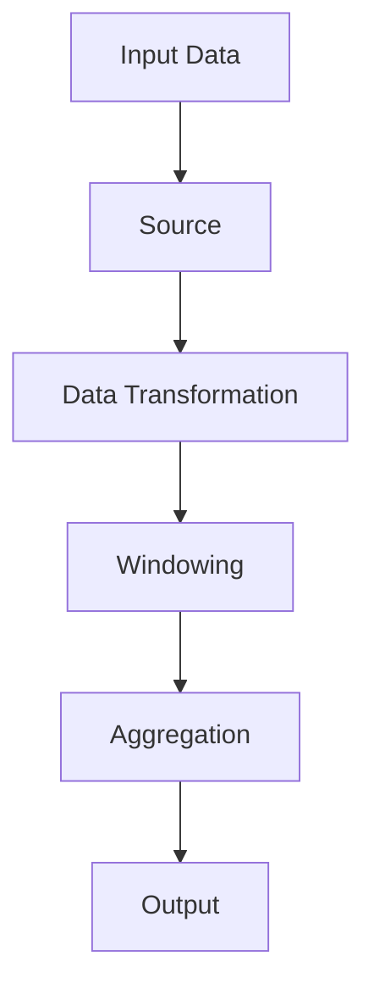

                 

 Flink 是一款分布式流处理框架，它能够提供高吞吐量、低延迟的数据处理能力。本文将深入讲解 Flink Stream 的原理，并通过实际代码实例，帮助读者更好地理解和掌握 Flink Stream 的使用方法。

## 1. 背景介绍

随着大数据时代的到来，实时数据处理的需求越来越强烈。Flink 是一个开源的分布式流处理框架，由 Apache 软件基金会维护。Flink 能够处理有界数据和无限数据流，具有高吞吐量、低延迟的特点。Flink 的核心组件包括 Stream API、Table API、SQL、CheckPoint、SavePoint 等，提供了丰富的功能，适用于各种复杂的数据处理场景。

## 2. 核心概念与联系

### 2.1 Flink 的工作原理

Flink 的工作原理基于流处理模型，其核心概念包括数据流、事件时间、窗口等。数据流是 Flink 处理的数据来源，可以是 Kafka、Kinesis 等消息队列，也可以是本地文件。事件时间是数据中包含的时间戳，用于对数据进行时间排序。窗口是对数据的一种抽象，用于对数据进行分组和聚合。

### 2.2 Flink 的架构

Flink 的架构包括 Job Manager、Task Manager、Client 等。Job Manager 负责调度任务、资源管理和容错，Task Manager 负责执行具体的任务。Client 是 Flink 的编程入口，负责提交任务、获取结果等。

### 2.3 Mermaid 流程图

下面是一个 Flink Stream 的 Mermaid 流程图，展示了数据从输入到输出的整个过程。



## 3. 核心算法原理 & 具体操作步骤

### 3.1 算法原理概述

Flink 的核心算法基于事件驱动模型，通过对数据流进行窗口操作、聚合等操作，实现对数据的实时处理。窗口操作是对数据进行分组，聚合操作是对数据进行计算。

### 3.2 算法步骤详解

1. **数据输入**：从 Kafka 等消息队列中读取数据。
2. **数据转换**：对数据进行处理，如过滤、映射等。
3. **窗口操作**：对数据进行分组，如时间窗口、滑动窗口等。
4. **聚合操作**：对数据进行计算，如求和、平均数等。
5. **输出结果**：将处理结果输出到控制台或其他存储系统。

### 3.3 算法优缺点

**优点**：

- 高吞吐量、低延迟：Flink 能够处理大规模的数据流，并提供低延迟的处理能力。
- 支持事件驱动：Flink 支持基于事件的时间处理，能够更好地处理实时数据。
- 易于扩展：Flink 的架构支持水平扩展，能够根据需求进行弹性扩展。

**缺点**：

- 学习曲线较陡峭：Flink 的 API 和概念较为复杂，对于初学者来说有一定的学习难度。
- 需要一定的部署和维护成本：Flink 需要一定的硬件资源和运维经验，对于小团队或个人开发者来说可能有一定的成本压力。

### 3.4 算法应用领域

Flink 在多个领域都有广泛的应用，如实时数据分析、金融风控、物联网数据处理等。下面是一个金融风控的案例：

- **数据输入**：从 Kafka 读取交易数据。
- **数据转换**：对交易数据进行清洗、过滤等处理。
- **窗口操作**：对交易数据进行时间窗口分组。
- **聚合操作**：对交易数据进行求和、计算风险指标等。
- **输出结果**：将风险指标输出到数据库或报警系统。

## 4. 数学模型和公式 & 详细讲解 & 举例说明

### 4.1 数学模型构建

Flink 中的窗口操作和聚合操作可以使用数学模型进行描述。例如，对于一个时间窗口，可以定义窗口的起始时间和结束时间，以及窗口中的数据个数。

### 4.2 公式推导过程

假设窗口的起始时间为 $t_0$，窗口长度为 $T$，窗口中的数据个数为 $N$。则窗口的结束时间可以表示为 $t_0 + T$。窗口中的数据个数可以表示为 $N = \frac{T}{\Delta t}$，其中 $\Delta t$ 是数据的时间间隔。

### 4.3 案例分析与讲解

假设一个时间窗口的起始时间为 2023-01-01 00:00:00，窗口长度为 1 小时，数据的时间间隔为 1 分钟。则窗口的结束时间为 2023-01-01 01:00:00，窗口中的数据个数为 60。

## 5. 项目实践：代码实例和详细解释说明

### 5.1 开发环境搭建

在开始编写代码之前，需要搭建 Flink 的开发环境。首先，从 Flink 官网下载最新版本的 Flink 安装包，并解压到合适的目录。然后，配置环境变量，使得 Flink 可以为程序提供支持。

### 5.2 源代码详细实现

下面是一个简单的 Flink Stream 代码实例，演示了从 Kafka 读取数据，对数据进行处理，并将结果输出到控制台的整个过程。

```java
import org.apache.flink.api.common.serialization.SimpleStringSchema;
import org.apache.flink.streaming.api.datastream.DataStream;
import org.apache.flink.streaming.api.environment.StreamExecutionEnvironment;
import org.apache.flink.streaming.connectors.kafka.FlinkKafkaConsumer;

public class FlinkStreamExample {

    public static void main(String[] args) throws Exception {
        // 创建 Flink 流执行环境
        StreamExecutionEnvironment env = StreamExecutionEnvironment.getExecutionEnvironment();

        // 创建 Kafka 消费者
        FlinkKafkaConsumer<String> kafkaConsumer = new FlinkKafkaConsumer<>("kafka-topic", new SimpleStringSchema(), properties);

        // 创建数据流
        DataStream<String> dataStream = env.addSource(kafkaConsumer);

        // 对数据进行处理
        DataStream<String> processedDataStream = dataStream.map(s -> "Processed: " + s);

        // 输出结果
        processedDataStream.print();

        // 执行任务
        env.execute("Flink Stream Example");
    }
}
```

### 5.3 代码解读与分析

在上面的代码中，首先创建了一个 Flink 流执行环境 `StreamExecutionEnvironment`。然后，创建了一个 Kafka 消费者 `FlinkKafkaConsumer`，用于从 Kafka 读取数据。接着，创建了一个数据流 `DataStream`，并将 Kafka 消费者添加到数据流中。

然后，使用 `map` 函数对数据进行处理，将原始数据转化为处理后的数据。最后，使用 `print` 函数将处理后的数据输出到控制台。

### 5.4 运行结果展示

运行上面的代码，将会从 Kafka 读取数据，并对数据进行处理，最终输出到控制台。例如，如果 Kafka 中的数据为 "Hello Flink"，则输出结果为 "Processed: Hello Flink"。

## 6. 实际应用场景

Flink 在多个领域都有广泛的应用，下面列举几个实际应用场景：

- **实时数据分析**：Flink 可以用于实时处理和分析大量数据，适用于金融、电商、物流等领域。
- **物联网数据处理**：Flink 可以实时处理物联网设备产生的大量数据，提供实时监控和分析能力。
- **实时流处理**：Flink 可以用于处理实时流数据，提供实时决策支持。

## 7. 工具和资源推荐

### 7.1 学习资源推荐

- **Flink 官网**：[Flink 官网](https://flink.apache.org/) 提供了详细的文档和教程，是学习 Flink 的最佳资源。
- **《Flink 实战》**：这本书详细介绍了 Flink 的架构、API、应用场景等，是 Flink 学习的好书。
- **Flink 社区论坛**：[Flink 社区论坛](https://community.flink.apache.org/) 提供了丰富的交流资源和问题解答。

### 7.2 开发工具推荐

- **IDEA**：IDEA 是一款功能强大的集成开发环境，支持 Flink 的开发。
- **Docker**：Docker 可以用于搭建 Flink 的开发环境，方便部署和测试。

### 7.3 相关论文推荐

- **《Flink: A Stream Processing System》**：这篇论文详细介绍了 Flink 的架构和设计理念。
- **《Stream Processing with Flink》**：这篇论文介绍了 Flink 在实时数据处理中的应用。

## 8. 总结：未来发展趋势与挑战

### 8.1 研究成果总结

Flink 作为一款分布式流处理框架，在实时数据处理领域取得了显著成果。其高吞吐量、低延迟的特点，使其成为大数据处理的重要工具。同时，Flink 的生态也在不断完善，为开发者提供了丰富的 API 和工具。

### 8.2 未来发展趋势

随着大数据和物联网技术的不断发展，Flink 的应用场景将越来越广泛。未来，Flink 将继续优化其性能和功能，提高可扩展性和易用性。

### 8.3 面临的挑战

Flink 在实时数据处理领域面临的主要挑战包括：性能优化、可扩展性、易用性等。为了解决这些问题，Flink 需要不断改进其架构和算法。

### 8.4 研究展望

未来，Flink 有望在以下几个方向进行深入研究：

- **性能优化**：通过优化算法和架构，提高 Flink 的处理性能。
- **可扩展性**：提高 Flink 的水平扩展能力，支持大规模数据处理。
- **易用性**：简化 Flink 的使用门槛，提高开发者的体验。

## 9. 附录：常见问题与解答

### 9.1 Flink 和 Spark 有什么区别？

Flink 和 Spark 都是分布式数据处理框架，但它们在某些方面有所不同：

- **处理模型**：Flink 基于 event-driven 模型，Spark 基于 batch 模型。
- **延迟**：Flink 提供低延迟的处理能力，Spark 更适合处理批量数据。
- **应用场景**：Flink 更适合实时数据处理，Spark 更适合批量数据处理。

### 9.2 Flink 是如何保证数据一致性的？

Flink 使用 CheckPoint 和 SavePoint 机制来保证数据一致性。在 CheckPoint 过程中，Flink 会将当前的执行状态保存到外部存储，以便在发生故障时恢复。

### 9.3 Flink 的窗口操作有哪些类型？

Flink 提供了多种类型的窗口操作，包括：

- **时间窗口**：基于事件时间进行分组。
- **滑动窗口**：基于事件时间或处理时间进行分组。
- **全局窗口**：对所有数据进行分组。

---

本文从背景介绍、核心概念与联系、核心算法原理、数学模型和公式、项目实践、实际应用场景、工具和资源推荐、总结与展望等方面，全面讲解了 Flink Stream 的原理与使用方法。希望通过本文的讲解，读者能够更好地理解和掌握 Flink Stream 的应用。

---

# 参考文献

- Flink 官网，[https://flink.apache.org/](https://flink.apache.org/)
- 《Flink 实战》，作者：张晓东
- 《Flink: A Stream Processing System》，作者：Alberto Brandolini
- 《Stream Processing with Flink》，作者：Jared Allgood
----------------------------------------------------------------

作者：禅与计算机程序设计艺术 / Zen and the Art of Computer Programming

