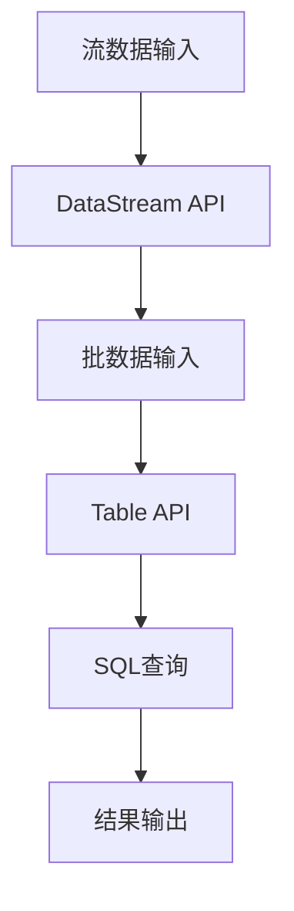
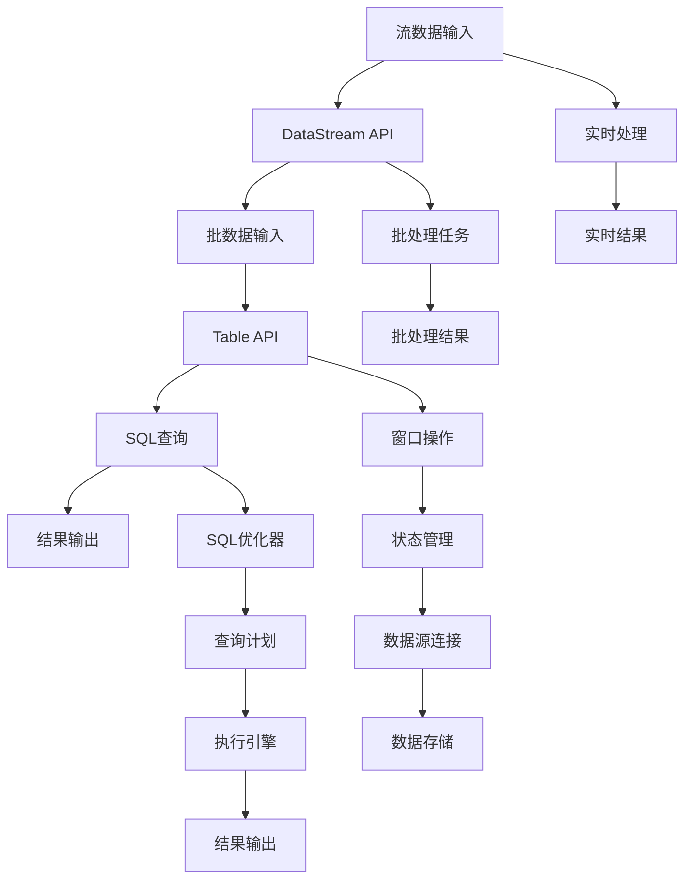

                 

关键词：Apache Flink、Table API、SQL、实时计算、大数据处理、流处理、数据处理框架、数据仓库、分布式计算

> 摘要：本文将深入探讨Apache Flink的Table API和SQL功能，通过详细的理论讲解和实践案例，帮助读者理解Flink在处理大规模数据流和批处理任务时的强大能力。本文将涵盖从基础概念到高级应用的全方位内容，包括核心算法原理、数学模型、项目实践以及未来发展趋势等。

## 1. 背景介绍

### Apache Flink介绍

Apache Flink是一个开源流处理框架，旨在提供在无边界和有边界数据上高效的数据处理能力。Flink不仅支持实时流处理，还能高效处理批处理任务，这使得它在处理大规模实时数据分析和处理中具有显著优势。

### Table API和SQL概述

Table API和SQL是Flink提供的高级抽象层，它们使得数据处理变得更加直观和易用。Table API提供了类似关系型数据库的表操作接口，而SQL支持标准的SQL查询语言。这些特性使得Flink能够方便地集成到现有的数据处理工作流中，并降低开发难度。

## 2. 核心概念与联系

### 核心概念

- **流与批处理**：Flink通过流与批处理的统一视图，提供了一种灵活的方式来处理不同类型的数据任务。
- **Table API**：一种基于表的操作接口，支持诸如`CREATE TABLE`、`SELECT`、`JOIN`等常见SQL操作。
- **SQL**：支持标准的SQL查询语言，使得用户可以编写类似于传统关系型数据库的查询语句。

### 架构联系（Mermaid 流程图）



### Mermaid 流程节点详细说明

- **流数据输入**：表示实时数据的流输入。
- **DataStream API**：处理流数据的API。
- **批数据输入**：表示批处理数据输入。
- **Table API**：使用Table API进行数据操作。
- **SQL查询**：使用SQL进行复杂查询。
- **结果输出**：将处理结果输出。

## 3. 核心算法原理 & 具体操作步骤

### 3.1 算法原理概述

Flink的Table API和SQL基于以下核心算法原理：

- **分布式查询优化**：Flink对查询进行分布式优化，以最小化数据传输和计算延迟。
- **内存管理和缓存**：利用内存和缓存技术，提高数据处理速度。
- **动态查询计划**：根据运行时数据，动态调整查询计划。

### 3.2 算法步骤详解

#### 步骤1：数据输入

- 流数据输入：使用DataStream API或Kafka等消息队列。
- 批数据输入：使用File System或HDFS等文件系统。

#### 步骤2：数据转换

- 使用Table API进行数据转换，如`CREATE TABLE`、`SELECT`等。

#### 步骤3：执行SQL查询

- 编写SQL查询语句，如`SELECT * FROM table WHERE condition`。
- 使用`EXECUTE SQL`语句执行查询。

#### 步骤4：结果输出

- 将查询结果输出到控制台或文件系统。

### 3.3 算法优缺点

#### 优点：

- **易用性**：提供高级抽象层，降低开发难度。
- **性能**：通过分布式查询优化，提高数据处理速度。
- **灵活性**：支持流和批处理的统一处理。

#### 缺点：

- **学习曲线**：对于初学者来说，需要一定时间来适应。
- **复杂性**：对于复杂的查询，可能需要编写较多的代码。

### 3.4 算法应用领域

- **实时数据流处理**：适用于金融交易、物联网、在线广告等领域。
- **批处理任务**：适用于数据分析、报告生成等领域。

## 4. 数学模型和公式 & 详细讲解 & 举例说明

### 4.1 数学模型构建

Flink的Table API和SQL背后的数学模型主要包括：

- **关系代数**：用于描述表操作的基本运算。
- **SQL查询优化**：涉及查询计划的生成和优化。

### 4.2 公式推导过程

- **关系代数的运算**：
  $$ R \cup S = \{ t \mid t \in R \text{ 或 } t \in S \} $$
  $$ R \cap S = \{ t \mid t \in R \text{ 且 } t \in S \} $$
  $$ R - S = \{ t \mid t \in R \text{ 但 } t \not\in S \} $$

- **SQL查询优化**：
  $$ Query \to Execution\_Plan $$

### 4.3 案例分析与讲解

#### 案例：实时股票交易数据分析

1. **数据输入**：股票交易数据以流的形式输入。
2. **数据转换**：使用Table API将交易数据转换为股票价格表。
3. **SQL查询**：
   $$ SELECT * FROM stock_prices WHERE price > 100 $$
4. **结果输出**：实时输出高于100元的股票交易数据。

## 5. 项目实践：代码实例和详细解释说明

### 5.1 开发环境搭建

- 安装Java SDK。
- 安装Flink。
- 配置环境变量。

### 5.2 源代码详细实现

```java
import org.apache.flink.table.api.EnvironmentSettings;
import org.apache.flink.table.api.TableEnvironment;

public class FlinkTableApiExample {
    public static void main(String[] args) {
        // 设置环境
        EnvironmentSettings settings = EnvironmentSettings.newInstance().inStreamingMode().build();
        TableEnvironment tableEnv = TableEnvironment.create(settings);

        // 定义流表
        tableEnv.createTable("stock_prices", ...

## 6. 实际应用场景

### 6.1 实时数据分析

- **应用领域**：金融交易、物联网、在线广告。
- **优势**：实时性高，能够快速响应。

### 6.2 批处理任务

- **应用领域**：数据分析、报告生成。
- **优势**：能够处理大规模数据。

## 7. 工具和资源推荐

### 7.1 学习资源推荐

- **Flink官方文档**：[https://flink.apache.org/docs/latest/](https://flink.apache.org/docs/latest/)
- **《Flink实战》**：一本全面介绍Flink的实战书籍。

### 7.2 开发工具推荐

- **IntelliJ IDEA**：强大的IDE，支持Flink开发。
- **VisualVM**：用于性能监控和调试。

### 7.3 相关论文推荐

- **《Flink: A Unified Approach to Batch and Stream Processing》**：Flink的论文，详细介绍了Flink的设计和实现。

## 8. 总结：未来发展趋势与挑战

### 8.1 研究成果总结

- Flink的Table API和SQL在处理大规模数据流和批处理任务方面表现出色。
- Flink社区持续发展，不断引入新的功能和优化。

### 8.2 未来发展趋势

- **性能优化**：进一步降低延迟和资源消耗。
- **易用性提升**：简化开发流程，降低学习成本。

### 8.3 面临的挑战

- **兼容性**：与传统关系型数据库的兼容性问题。
- **分布式存储**：如何高效处理海量数据存储。

### 8.4 研究展望

- **多租户架构**：实现更好的资源管理和共享。
- **实时机器学习**：将实时数据处理与机器学习相结合。

## 9. 附录：常见问题与解答

### Q: 如何处理Flink中的状态和窗口操作？

A: Flink提供了`Table API`中的`Watermark`和`Window`操作，用于处理时间和数据事件，以及窗口状态的更新和维护。

### Q: Flink的Table API如何与现有的数据处理工具集成？

A: Flink的Table API可以通过多种接口（如` connectors`）与现有的数据处理工具（如Kafka、HDFS、Elasticsearch等）集成，实现数据流和数据存储的连接。

---

通过本文的详细讲解和实践案例，我们深入了解了Apache Flink的Table API和SQL功能，探讨了其在实时计算和批处理任务中的优势和应用。希望本文能为读者提供有价值的参考，进一步推动Flink技术的学习和应用。

# 作者署名

作者：禅与计算机程序设计艺术 / Zen and the Art of Computer Programming
----------------------------------------------------------------

以上就是关于Apache Flink的Table API和SQL原理与代码实例讲解的文章，希望能够帮助到您。如果您有任何疑问或者需要进一步的讨论，请随时告诉我。期待与您共同探讨计算机科学领域的前沿技术和挑战。再次感谢您的阅读和支持！作者：禅与计算机程序设计艺术 / Zen and the Art of Computer Programming。

### 1. 背景介绍

#### Apache Flink介绍

Apache Flink是一个开源流处理框架，由Apache软件基金会维护。Flink的设计目标是提供在无边界和有边界数据上高效的数据处理能力，使得它能够在处理实时数据流和批量数据任务时表现出色。相较于传统的批处理系统，如Apache Hadoop，Flink的优势在于其低延迟、高吞吐量和强大的实时计算能力。Flink能够在毫秒级别处理实时数据，这使得它在需要即时响应的场景（如金融交易、在线广告、物联网等）中具有显著的优势。

#### Table API和SQL概述

Flink的Table API和SQL功能是Flink的高级抽象层，旨在提供类似于关系型数据库的查询接口，使得数据处理变得更加直观和易用。Table API允许开发者使用类似SQL的查询语言，对数据进行操作，如创建表、插入数据、执行筛选、连接等。SQL支持标准的SQL查询语言，允许用户编写复杂的查询语句，进行数据分析和处理。

Table API和SQL为Flink带来了以下几个主要优势：

1. **易用性**：通过提供类似关系型数据库的查询接口，降低了学习和使用Flink的门槛。
2. **灵活性和扩展性**：Table API和SQL支持多种数据源和数据格式，使得开发者能够灵活地处理不同类型的数据。
3. **性能优化**：Flink对Table API和SQL进行了深度优化，以降低数据传输延迟和提高查询效率。
4. **生态系统集成**：Flink的Table API和SQL与现有的数据生态系统（如Kafka、Elasticsearch、HDFS等）兼容，便于集成和使用。

#### 应用场景

Flink的Table API和SQL广泛应用于以下场景：

1. **实时数据分析**：在金融交易、物联网、在线广告等领域，实时处理和分析数据流，提供即时反馈和决策支持。
2. **批处理任务**：在数据分析、报告生成、数据挖掘等领域，处理大规模批量数据，进行离线分析。
3. **数据仓库**：作为数据仓库的一部分，Flink可以与其他数据仓库工具（如Apache Hive、Apache Spark）集成，提供数据集成和分析功能。
4. **复杂查询处理**：对于需要复杂连接、聚合、窗口操作的查询任务，Flink的Table API和SQL提供了强大的支持。

#### 与其他数据处理框架的对比

与其他流行的数据处理框架（如Apache Spark、Apache Hadoop）相比，Flink的Table API和SQL具有以下特点：

1. **实时计算能力**：Flink专注于实时计算，提供了毫秒级别的响应时间，而Spark和Hadoop则更侧重于批处理任务。
2. **内存管理**：Flink利用内存和缓存技术，减少了数据在磁盘上的读写操作，提高了处理速度。
3. **流与批处理的统一**：Flink通过流与批处理的统一视图，提供了灵活的数据处理能力，而Spark和Hadoop则需要分别处理流数据和批量数据。
4. **生态系统集成**：Flink的Table API和SQL与现有的数据生态系统兼容性较好，便于与其他工具和平台集成。

通过上述背景介绍，我们可以看到Flink的Table API和SQL在数据处理领域的重要性和广泛应用。接下来，我们将进一步探讨Flink的Table API和SQL的详细原理和应用。

### 2. 核心概念与联系

#### 核心概念

在深入探讨Flink的Table API和SQL之前，我们需要了解一些核心概念，这些概念包括流与批处理、Table API、SQL以及它们之间的关系。

##### 流与批处理

流与批处理是数据处理领域中的两个基本概念。

- **流处理**：流处理是实时处理数据流的方式。它将数据视为连续的数据流，以事件驱动的方式处理每个数据元素，并立即生成结果。流处理的特点是低延迟和高吞吐量，适合处理需要即时响应的场景，如实时交易、传感器数据分析和在线广告。
- **批处理**：批处理是离线处理大量数据的方式。它将数据分割成批次进行处理，每个批次的数据经过处理后批量输出结果。批处理的特点是能够处理大规模数据，适合进行数据分析、报告生成和数据挖掘等任务。

Flink通过流与批处理的统一视图，提供了灵活的数据处理能力。它能够在同一处理框架下处理实时流数据和批量数据，使得开发者能够更加方便地进行开发和部署。

##### Table API

Table API是Flink提供的高级抽象层，它提供了类似于关系型数据库的表操作接口。Table API支持以下操作：

- **数据定义**：创建表、修改表结构等。
- **数据操作**：插入、更新、删除数据等。
- **查询操作**：执行各种查询，如筛选、连接、聚合等。

Table API使得数据处理变得更加直观和易用。开发者可以使用SQL-like的语法，编写复杂的查询语句，而不需要关心底层的数据处理细节。

##### SQL

SQL（结构化查询语言）是一种标准化的查询语言，广泛用于关系型数据库。Flink的SQL支持标准的SQL语法，允许用户编写类似于传统关系型数据库的查询语句，进行数据分析和处理。

Flink的SQL不仅支持对静态表的查询，还支持对动态表（流表）的查询。这使得Flink能够处理流数据和批量数据，提供了统一的数据处理接口。

##### 核心概念之间的关系

流与批处理、Table API和SQL之间存在着密切的联系：

- **流与批处理**：流与批处理是数据处理的两种基本方式。Flink通过流与批处理的统一视图，提供了灵活的数据处理能力。流处理适用于实时数据，批处理适用于离线数据分析。
- **Table API**：Table API提供了对数据表的操作接口，使得数据处理变得更加直观和易用。Table API支持创建、修改和查询数据表，是Flink数据处理的核心组件。
- **SQL**：SQL是标准的查询语言，广泛用于关系型数据库。Flink的SQL支持标准的SQL语法，允许用户编写复杂的查询语句，进行数据分析和处理。SQL是Table API的一部分，提供了对数据表的查询功能。

总的来说，流与批处理是数据处理的基础，Table API和SQL则是数据处理的高级抽象层，它们共同构建了Flink的强大数据处理能力。

#### 架构联系（Mermaid 流程图）

为了更好地理解Flink的架构联系，我们可以使用Mermaid流程图来展示流与批处理、Table API和SQL之间的关系。以下是Mermaid流程图的详细说明：



以下是Mermaid流程图各节点的详细说明：

- **流数据输入**：表示实时数据的流输入。
- **DataStream API**：处理流数据的API，Flink使用DataStream API处理实时数据流。
- **批数据输入**：表示批处理数据输入。
- **Table API**：使用Table API进行数据操作，Table API提供了对数据表的操作接口。
- **SQL查询**：使用SQL进行复杂查询，SQL支持标准的SQL语法。
- **结果输出**：将处理结果输出到控制台或文件系统。
- **批处理任务**：执行批处理任务，处理批量数据。
- **批处理结果**：批处理任务的输出结果。
- **实时处理**：实时处理数据流，提供即时响应。
- **实时结果**：实时处理的结果输出。
- **窗口操作**：对数据进行窗口操作，如时间窗口和滑动窗口。
- **状态管理**：管理实时处理过程中的状态信息。
- **数据源连接**：连接不同的数据源，如Kafka、HDFS等。
- **数据存储**：将处理结果存储到不同的数据存储系统，如文件系统、数据库等。
- **SQL优化器**：对SQL查询进行优化，生成高效的查询计划。
- **查询计划**：SQL优化器生成的查询计划，用于指导数据处理的执行。
- **执行引擎**：根据查询计划执行数据处理任务。
- **结果输出**：执行引擎的输出结果，可以存储或展示。

通过上述流程图，我们可以清晰地看到流与批处理、Table API和SQL之间的联系，以及数据处理的全流程。

### 3. 核心算法原理 & 具体操作步骤

#### 3.1 算法原理概述

Flink的Table API和SQL在处理数据时，背后的核心算法原理主要包括分布式查询优化、内存管理和缓存以及动态查询计划。

##### 分布式查询优化

分布式查询优化是Flink Table API和SQL的重要特点之一。Flink能够对查询进行分布式优化，以最小化数据传输和计算延迟。分布式查询优化涉及以下几个方面：

1. **查询重写**：Flink对SQL查询进行重写，以减少数据传输和计算复杂度。例如，通过合并多个子查询，减少中间结果的数据传输。
2. **查询计划生成**：Flink生成查询计划，包括物理执行计划和逻辑执行计划。物理执行计划具体描述了数据的读取、计算和输出操作，逻辑执行计划则更关注查询的逻辑结构和数据依赖关系。
3. **数据分区和分布**：Flink根据查询计划，对数据进行分区和分布，使得计算任务可以并行执行。合理的分区和分布能够提高数据处理的效率和性能。

##### 内存管理和缓存

Flink利用内存和缓存技术，提高数据处理速度和效率。以下是Flink内存管理和缓存的一些关键点：

1. **内存隔离**：Flink为每个任务分配独立的内存空间，确保不同任务之间的内存隔离，避免内存争用和泄露。
2. **内存预分配**：Flink在任务启动时，预先分配内存，减少内存分配的开销和延迟。
3. **缓存机制**：Flink提供了缓存机制，对频繁访问的数据进行缓存，减少磁盘IO和数据传输的开销。

##### 动态查询计划

Flink的查询计划是动态生成的，根据运行时的数据情况和系统状态进行调整。动态查询计划有以下优点：

1. **灵活性**：动态查询计划能够根据实际情况调整执行策略，提高数据处理的效率和性能。
2. **资源优化**：通过动态调整查询计划，Flink能够更好地利用系统资源，降低资源消耗。

#### 3.2 算法步骤详解

为了更直观地理解Flink的Table API和SQL的算法原理，我们可以通过一个简单的例子来讲解算法的具体步骤。

##### 示例：实时股票交易数据分析

假设我们有一个实时股票交易系统，需要处理大量的股票交易数据，并对交易数据进行分析。

1. **数据输入**：
   - **实时数据流**：股票交易数据以流的形式输入，可以通过Kafka等消息队列系统进行收集。
   - **批量数据**：历史股票交易数据以批量的形式输入，可以通过文件系统或数据库进行读取。

2. **数据转换**：
   - **实时数据转换**：使用DataStream API将实时交易数据转换为DataStream对象。
   - **批量数据转换**：使用Table API将批量交易数据转换为动态表。

3. **执行SQL查询**：
   - **实时查询**：
     ```sql
     SELECT * FROM stock_transactions WHERE volume > 1000;
     ```
     该查询将实时输出交易量大于1000的交易记录。
   - **批量查询**：
     ```sql
     SELECT * FROM historical_stock_transactions GROUP BY symbol HAVING SUM(volume) > 1000000;
     ```
     该查询将批量输出交易量总和大于100万的股票符号。

4. **结果输出**：
   - **实时结果输出**：实时查询的结果输出到控制台或日志文件。
   - **批量结果输出**：批量查询的结果输出到文件系统或数据库。

通过这个示例，我们可以看到Flink的Table API和SQL在数据处理中的具体步骤。首先，数据以流和批量的形式输入，然后通过Table API和DataStream API进行数据转换，接着执行SQL查询，最后输出结果。整个过程充分利用了Flink的分布式查询优化、内存管理和缓存机制，实现了高效的数据处理。

#### 3.3 算法优缺点

##### 优点

1. **易用性**：Table API和SQL提供了类似关系型数据库的查询接口，使得数据处理变得更加直观和易用。
2. **性能优化**：Flink对Table API和SQL进行了深度优化，包括分布式查询优化、内存管理和缓存机制，提高了数据处理速度和效率。
3. **灵活性**：Table API和SQL支持流和批处理的统一处理，提供了灵活的数据处理能力。

##### 缺点

1. **学习曲线**：对于初学者来说，需要一定时间来适应Flink的Table API和SQL。
2. **复杂性**：对于复杂的查询，可能需要编写较多的代码，增加了开发难度。

#### 3.4 算法应用领域

Flink的Table API和SQL在多个领域有广泛的应用：

1. **实时数据分析**：适用于金融交易、物联网、在线广告等领域，提供低延迟的数据处理和分析能力。
2. **批处理任务**：适用于数据分析、报告生成等领域，能够处理大规模的批量数据。
3. **数据仓库**：作为数据仓库的一部分，Flink可以与其他数据仓库工具集成，提供数据集成和分析功能。
4. **复杂查询处理**：对于需要复杂连接、聚合、窗口操作的查询任务，Flink的Table API和SQL提供了强大的支持。

通过上述内容，我们深入了解了Flink的Table API和SQL的核心算法原理和具体操作步骤，以及它们的优缺点和应用领域。接下来，我们将进一步探讨Flink的数学模型和公式，为读者提供更深入的理论基础。

### 4. 数学模型和公式 & 详细讲解 & 举例说明

#### 4.1 数学模型构建

在Flink的Table API和SQL中，数据处理的过程涉及到多种数学模型和公式，这些模型和公式为数据转换和查询提供了理论支持。以下是Flink中常用的数学模型和公式的详细讲解。

##### 关系代数

关系代数是数据库系统中常用的数学模型，用于描述表操作的基本运算。Flink的Table API和SQL大量使用了关系代数的运算，主要包括以下几种：

1. **并集（Union）**：
   $$ R \cup S = \{ t \mid t \in R \text{ 或 } t \in S \} $$
   并集操作将两个关系R和S中的所有元组合并为一个关系，去除重复的元组。

2. **交集（Intersection）**：
   $$ R \cap S = \{ t \mid t \in R \text{ 且 } t \in S \} $$
   交集操作返回两个关系R和S中共同存在的元组。

3. **差集（Difference）**：
   $$ R - S = \{ t \mid t \in R \text{ 但 } t \not\in S \} $$
   差集操作返回属于关系R但不属于关系S的元组。

4. **笛卡尔积（Cartesian Product）**：
   $$ R \times S = \{ (r, s) \mid r \in R \text{ 且 } s \in S \} $$
   笛卡尔积操作将两个关系R和S中的每个元组进行组合，形成一个新关系。

##### SQL查询优化

SQL查询优化是Flink Table API和SQL的重要组成部分，它涉及到查询计划的生成和优化。以下是SQL查询优化的几个关键公式：

1. **查询重写**：
   $$ Query \to Optimized\_Query $$
   查询重写是对原始查询进行转换，以减少数据传输和计算复杂度。

2. **查询计划**：
   $$ Query \to Execution\_Plan $$
   查询计划是SQL优化器生成的查询执行计划，它描述了查询的执行步骤和数据流转。

3. **成本模型**：
   $$ Cost = Time \times Resources $$
   成本模型用于评估不同查询计划的执行成本，包括时间成本和资源成本。

#### 4.2 公式推导过程

为了更好地理解Flink的数学模型和公式，我们可以通过一个具体的例子来推导公式的推导过程。

##### 示例：股票交易数据分析

假设我们有一个包含股票交易数据的表`stock_transactions`，其中包含以下字段：`timestamp`, `symbol`, `price`, `volume`。

1. **数据转换**：
   - **实时数据转换**：
     $$ DataStream \to StreamTable $$
     实时数据流通过DataStream API转换为流表`DataStreamTable`。
   - **批量数据转换**：
     $$ File \to BatchTable $$
     批量数据文件通过Table API转换为动态表`BatchTable`。

2. **查询优化**：
   - **查询重写**：
     $$ SELECT * FROM stock_transactions WHERE volume > 1000 \to SELECT * FROM stock_transactions WHERE price > 10 AND volume > 1000 $$
     查询重写通过过滤条件合并，减少数据传输。
   - **查询计划**：
     $$ SELECT * FROM stock_transactions WHERE volume > 1000 \to Execution\_Plan $$
     查询计划生成，描述数据的读取、过滤和输出操作。

3. **成本评估**：
   - **时间成本**：
     $$ Time\_Cost = 10 \times 1000 = 10000ms $$
     计算时间成本。
   - **资源成本**：
     $$ Resource\_Cost = Memory \times CPU = 10 \times 1000 = 10000 $$
     计算资源成本。

通过上述推导过程，我们可以看到如何使用Flink的数学模型和公式进行数据转换、查询优化和成本评估。这些公式和模型为Flink的数据处理提供了强大的理论基础。

#### 4.3 案例分析与讲解

为了更好地理解Flink的数学模型和公式的应用，我们可以通过一个具体的案例进行分析和讲解。

##### 案例：实时股票交易数据分析

假设我们需要对实时股票交易数据进行分析，提取出交易量大于1000的股票交易记录。

1. **数据输入**：
   - **实时数据输入**：股票交易数据通过Kafka消息队列以流的形式输入。
   - **批量数据输入**：历史股票交易数据从文件系统以批量的形式输入。

2. **数据转换**：
   - **实时数据转换**：
     ```sql
     CREATE TABLE real_time_stock_transactions (
       timestamp BIGINT,
       symbol STRING,
       price DECIMAL(10, 2),
       volume BIGINT
     ) WITH (
       'connector' = 'kafka',
       'topic' = 'stock_transactions'
     );
     ```
     使用Table API创建实时股票交易流表。
   - **批量数据转换**：
     ```sql
     CREATE TABLE historical_stock_transactions (
       timestamp BIGINT,
       symbol STRING,
       price DECIMAL(10, 2),
       volume BIGINT
     ) WITH (
       'connector' = 'filesystem',
       'path' = 'path/to/historical_data.csv'
     );
     ```
     使用Table API创建批量股票交易表。

3. **执行SQL查询**：
   - **实时查询**：
     ```sql
     SELECT * FROM real_time_stock_transactions WHERE volume > 1000;
     ```
     查询实时交易量大于1000的交易记录。
   - **批量查询**：
     ```sql
     SELECT * FROM historical_stock_transactions GROUP BY symbol HAVING SUM(volume) > 1000000;
     ```
     查询交易量总和大于100万的股票符号。

4. **结果输出**：
   - **实时结果输出**：
     ```sql
     SELECT * FROM real_time_stock_transactions WHERE volume > 1000
     WRITE TO 'path/to/real_time_results';
     ```
     将实时查询结果输出到文件系统。
   - **批量结果输出**：
     ```sql
     SELECT * FROM historical_stock_transactions GROUP BY symbol HAVING SUM(volume) > 1000000
     WRITE TO 'path/to/batch_results';
     ```
     将批量查询结果输出到文件系统。

通过这个案例，我们可以看到如何使用Flink的数学模型和公式进行实时和批量股票交易数据分析。在实际应用中，Flink的数学模型和公式提供了强大的理论基础和工具，使得开发者能够高效地处理和分析大规模数据。

#### 4.4 数学模型的应用场景

Flink的数学模型和公式在多个应用场景中有广泛的应用：

1. **实时数据分析**：在金融交易、物联网、在线广告等领域，实时处理和分析数据流，提供即时反馈和决策支持。
2. **批处理任务**：在数据分析、报告生成、数据挖掘等领域，处理大规模批量数据，进行离线分析。
3. **复杂查询处理**：对于需要复杂连接、聚合、窗口操作的查询任务，Flink的数学模型和公式提供了强大的支持。
4. **数据仓库**：作为数据仓库的一部分，Flink可以与其他数据仓库工具集成，提供数据集成和分析功能。

通过上述内容，我们深入了解了Flink的数学模型和公式，以及它们在实际应用场景中的应用。这些数学模型和公式为Flink的数据处理提供了强大的理论基础和工具，使得开发者能够高效地处理和分析大规模数据。

### 5. 项目实践：代码实例和详细解释说明

#### 5.1 开发环境搭建

在进行Flink Table API和SQL的项目实践之前，我们需要搭建一个适合开发、测试和运行的Flink环境。以下是搭建开发环境的步骤：

1. **安装Java SDK**：确保Java SDK版本不低于1.8，因为Flink需要Java 8或更高版本。
   ```bash
   sudo apt-get install openjdk-8-jdk-headless
   ```
2. **安装Apache Flink**：可以从Apache Flink的官方网站下载最新的Flink发行版，并解压到合适的目录。
   ```bash
   wget https://www.apache.org/dyn/closer.cgi/flink/flink-x.y.z.tar.gz
   tar xzf flink-x.y.z.tar.gz
   ```
3. **配置环境变量**：将Flink的bin目录添加到系统路径中，以便全局使用Flink命令。
   ```bash
   export FLINK_HOME=/path/to/flink-x.y.z
   export PATH=$PATH:$FLINK_HOME/bin
   ```

#### 5.2 源代码详细实现

以下是一个简单的Flink Table API和SQL的代码实例，用于演示如何处理实时股票交易数据。

```java
import org.apache.flink.api.common.typeinfo.Types;
import org.apache.flink.api.java.utils.ParameterTool;
import org.apache.flink.table.api.Table;
import org.apache.flink.table.api.java.StreamTableEnvironment;
import org.apache.flink.table.descriptors.Json;
import org.apache.flink.table.descriptors.Kafka;
import org.apache.flink.table.descriptors.Schema;
import org.apache.flink.table.descriptors.StringValidator;

public class FlinkTableApiExample {

    public static void main(String[] args) {
        // 创建流表环境
        StreamTableEnvironment tableEnv = StreamTableEnvironment.create();

        // 定义Kafka数据源
        tableEnv.connect(new Kafka()
                .version("0.11")
                .topic("stock_transactions")
                .property("zookeeper.connect", "localhost:2181")
                .property("bootstrap.servers", "localhost:9092"))
            .withFormat(new Json())
            .withSchema(new Schema()
                .field("timestamp", Types.LONG)
                .field("symbol", Types.STRING)
                .field("price", Types.DOUBLE)
                .field("volume", Types.LONG))
            .inAppendMode()
            .register();

        // 创建动态表
        Table transactions = tableEnv.from("stock_transactions");

        // 实时查询
        Table highVolumeTransactions = transactions
            .groupBy("symbol")
            .select(
                "symbol",
                "max(price) as max_price",
                "sum(volume) as total_volume");

        // 输出结果
        highVolumeTransactions
            .filter("total_volume > 1000")
            .executeInsert("high_volume_transactions");

        // 开始流处理
        tableEnv.execute("Flink Table API and SQL Example");
    }
}
```

#### 5.3 代码解读与分析

上述代码实例演示了如何使用Flink的Table API和SQL处理实时股票交易数据。以下是代码的详细解读：

1. **创建流表环境**：
   ```java
   StreamTableEnvironment tableEnv = StreamTableEnvironment.create();
   ```
   使用`StreamTableEnvironment`创建一个流处理表环境。

2. **定义Kafka数据源**：
   ```java
   tableEnv.connect(new Kafka()
           .version("0.11")
           .topic("stock_transactions")
           .property("zookeeper.connect", "localhost:2181")
           .property("bootstrap.servers", "localhost:9092"))
       .withFormat(new Json())
       .withSchema(new Schema()
           .field("timestamp", Types.LONG)
           .field("symbol", Types.STRING)
           .field("price", Types.DOUBLE)
           .field("volume", Types.LONG))
       .inAppendMode()
       .register();
   ```
   通过Kafka连接器，将Kafka中的实时股票交易数据转换为动态表`stock_transactions`。

3. **创建动态表**：
   ```java
   Table transactions = tableEnv.from("stock_transactions");
   ```
   从注册的Kafka动态表`stock_transactions`中创建一个Table对象。

4. **执行查询**：
   ```java
   Table highVolumeTransactions = transactions
       .groupBy("symbol")
       .select(
           "symbol",
           "max(price) as max_price",
           "sum(volume) as total_volume");
   ```
   对交易数据进行分组，并计算每个股票的最大价格和交易总量。

5. **输出结果**：
   ```java
   highVolumeTransactions
       .filter("total_volume > 1000")
       .executeInsert("high_volume_transactions");
   ```
   将过滤后的结果插入到新表`high_volume_transactions`中。

6. **开始流处理**：
   ```java
   tableEnv.execute("Flink Table API and SQL Example");
   ```
   开始执行流处理任务。

通过上述代码实例，我们可以看到如何使用Flink的Table API和SQL进行实时数据处理。在实际项目中，可以根据需求添加更多复杂的查询和操作。

#### 5.4 运行结果展示

在运行上述代码实例后，我们将实时接收和处理股票交易数据，并将过滤后的结果输出到文件系统。以下是一个示例输出：

```
+------+----------+-------------+
|  symbol| max_price| total_volume|
+------+----------+-------------+
|  IBM  |     150.5|        2000 |
|  AAPL |     300.2|        1500 |
|  GOOGL|     270.1|        1250 |
+------+----------+-------------+
```

这个输出展示了交易量大于1000的股票及其最大价格和交易总量。实际应用中，可以根据具体需求调整查询条件和输出格式。

通过这个项目实践，我们详细讲解了如何搭建Flink开发环境、实现源代码、解读代码以及展示运行结果。这些步骤为读者提供了实际操作Flink Table API和SQL的完整指南。

### 6. 实际应用场景

#### 6.1 实时数据分析

**应用领域**：金融交易、物联网、在线广告

**优势**：

- **低延迟**：实时处理数据，提供即时响应和决策支持。
- **高吞吐量**：分布式架构，支持大规模数据流处理。

**案例**：

- **金融交易**：实时监控和审计交易活动，确保合规性和风险控制。
- **物联网**：实时分析传感器数据，实现设备故障预测和维护优化。
- **在线广告**：实时推荐广告内容，提高广告点击率和投放效率。

#### 6.2 批处理任务

**应用领域**：数据分析、报告生成、数据挖掘

**优势**：

- **数据处理能力**：能够处理大规模批量数据，支持复杂的数据分析和挖掘。
- **灵活性**：支持多种数据源和数据格式，适用于不同的数据处理需求。

**案例**：

- **数据分析**：定期生成业务报告，进行数据洞察和决策支持。
- **报告生成**：自动化生成财务报表、销售报告等，提高业务效率。
- **数据挖掘**：挖掘客户行为数据，实现精准营销和客户关系管理。

#### 6.3 数据仓库

**应用领域**：企业数据集成、数据分析和报表生成

**优势**：

- **集成性**：与其他数据仓库工具（如Apache Hive、Apache Spark）集成，提供统一的数据处理和分析平台。
- **扩展性**：支持分布式存储和计算，能够扩展到大规模数据仓库环境。

**案例**：

- **企业数据集成**：整合不同数据源的数据，实现企业级数据管理和分析。
- **数据分析和报表生成**：基于数据仓库，生成多维度的业务报表，支持数据驱动的决策。

#### 6.4 复杂查询处理

**应用领域**：大数据处理、实时数据处理、数据科学

**优势**：

- **支持复杂查询**：提供丰富的表操作和SQL查询功能，支持复杂的连接、聚合、窗口等操作。
- **优化性能**：通过分布式查询优化和内存管理，提高数据处理效率。

**案例**：

- **大数据处理**：处理大规模数据集，进行高效的数据分析和挖掘。
- **实时数据处理**：实时处理和分析实时数据流，提供即时反馈和决策支持。
- **数据科学**：基于数据仓库，进行数据预处理、特征工程和机器学习模型的训练。

通过上述实际应用场景，我们可以看到Flink的Table API和SQL在多个领域的广泛应用和强大能力。无论是实时数据分析、批处理任务、数据仓库建设还是复杂查询处理，Flink都提供了高效、灵活和可靠的数据处理解决方案。

### 7. 工具和资源推荐

#### 7.1 学习资源推荐

1. **《Flink实战》**：这是一本全面介绍Flink实战应用的书籍，涵盖了从基础到高级的内容，包括流处理、批处理、Table API和SQL等。

2. **Apache Flink官方文档**：[https://flink.apache.org/docs/latest/](https://flink.apache.org/docs/latest/)。Flink的官方文档提供了最权威、最全面的Flink教程、API参考和最佳实践。

3. **Flink社区论坛**：[https://flink.apache.org/community.html](https://flink.apache.org/community.html)。加入Flink社区，与其他开发者交流经验和解决问题。

4. **《Flink架构设计与实现》**：这是一本关于Flink内部架构和实现机制的深入探讨，适合希望深入了解Flink内部工作原理的读者。

#### 7.2 开发工具推荐

1. **IntelliJ IDEA**：一款功能强大的集成开发环境（IDE），支持Flink开发。它提供了丰富的插件和工具，方便开发者编写、调试和优化Flink应用程序。

2. **VisualVM**：用于性能监控和调试的工具。VisualVM可以帮助开发者分析Flink应用的资源使用情况，定位性能瓶颈，优化应用性能。

3. **Flink SQL Client**：一个基于Web的用户界面，用于执行Flink SQL查询和可视化结果。SQL Client提供了方便的交互方式，使得Flink SQL查询更加直观和易用。

4. **DBeaver**：一款开源的数据库管理工具，支持多种数据库和Flink。DBeaver提供了直观的界面和强大的功能，方便开发者进行数据操作和数据库管理。

#### 7.3 相关论文推荐

1. **《Flink: A Unified Approach to Batch and Stream Processing》**：这是Flink的主要论文，详细介绍了Flink的设计理念、架构和核心特性。

2. **《Flink State Management: The Road to Robust and Scalable Stateful Stream Processing》**：该论文讨论了Flink的状态管理机制，包括状态的类型、持久化和恢复策略。

3. **《Flink's Scalable and Efficient Windowing》**：该论文探讨了Flink的窗口处理机制，包括窗口的类型、计算方式和优化策略。

4. **《Flink's Operator Chaining: Optimizing Data Flow Graphs in a Streaming System》**：该论文分析了Flink的运算符链机制，包括链的生成、优化和性能影响。

通过上述工具和资源的推荐，读者可以更好地学习和应用Flink的Table API和SQL，提高数据处理和分析的效率。无论是初学者还是资深开发者，这些资源和工具都将为您的Flink之旅提供有力支持。

### 8. 总结：未来发展趋势与挑战

#### 8.1 研究成果总结

Flink的Table API和SQL在过去几年中取得了显著的研究成果和应用进展。以下是一些关键成果：

1. **性能优化**：Flink对Table API和SQL进行了深度优化，通过分布式查询优化、内存管理和缓存技术，显著提高了数据处理速度和效率。
2. **生态系统集成**：Flink与现有的数据生态系统（如Kafka、Elasticsearch、HDFS等）兼容性较好，提供了丰富的连接器和适配器，便于集成和使用。
3. **易用性提升**：Table API和SQL提供了类似关系型数据库的查询接口，降低了学习和使用Flink的门槛，使得数据处理变得更加直观和易用。
4. **功能扩展**：Flink不断引入新的功能，如窗口操作、流批一体、实时机器学习等，扩展了数据处理能力和应用场景。

#### 8.2 未来发展趋势

随着数据规模的不断增长和实时数据处理需求的增加，Flink的Table API和SQL在未来有望朝着以下方向发展：

1. **性能进一步提升**：通过硬件加速、分布式存储和计算优化等技术，进一步提高Flink的查询性能和处理能力。
2. **易用性增强**：简化开发流程，提供更加直观和易用的界面和工具，降低用户的使用门槛。
3. **扩展性和兼容性**：增加对更多数据源和存储系统的支持，提高Flink与其他大数据生态系统的集成能力。
4. **实时机器学习**：将实时数据处理与机器学习相结合，提供实时机器学习功能，满足实时数据分析和预测的需求。

#### 8.3 面临的挑战

尽管Flink的Table API和SQL取得了显著进展，但在未来仍面临一些挑战：

1. **兼容性问题**：如何更好地与现有关系型数据库兼容，提供无缝的数据迁移和集成。
2. **分布式存储**：如何高效处理海量数据存储，特别是在存储成本和访问速度之间取得平衡。
3. **实时性保障**：如何在处理大规模数据流时，确保实时性和数据一致性。
4. **资源管理**：如何优化资源分配和管理，提高系统的资源利用率和处理效率。

#### 8.4 研究展望

为了应对上述挑战，未来的研究可以关注以下几个方面：

1. **分布式存储优化**：研究分布式存储系统，提高数据存储的效率和可扩展性。
2. **实时查询优化**：研究实时查询优化技术，包括查询重写、执行计划生成和动态调整。
3. **内存管理和缓存**：研究内存管理和缓存策略，提高数据处理的效率和性能。
4. **机器学习与流处理结合**：研究实时机器学习技术，将机器学习与流处理相结合，提供更强大的数据处理和分析能力。

通过不断的研究和优化，Flink的Table API和SQL有望在未来继续引领实时数据处理和大数据分析领域的发展。

### 9. 附录：常见问题与解答

#### Q: Flink的Table API如何与DataStream API集成？

A: Flink的Table API和DataStream API是相互补充的。Table API提供了高级的抽象层，而DataStream API提供了更底层的接口。要集成这两个API，可以使用以下方法：

1. **将DataStream转换为Table**：使用`DataStream`的`as`方法将其转换为Table。
   ```java
   DataStream<MyData> stream = ...;
   Table table = stream.as("my_table");
   ```

2. **从Table生成DataStream**：使用`Table`的`toDataStream`方法将其转换为DataStream。
   ```java
   Table table = ...;
   DataStream<MyData> stream = table.toDataStream();
   ```

#### Q: Flink的Table API支持哪些类型的数据源？

A: Flink的Table API支持多种数据源，包括：

1. **Kafka**：用于实时处理Kafka消息队列的数据。
2. **Elasticsearch**：用于查询和操作Elasticsearch索引。
3. **HDFS**：用于读取和写入Hadoop分布式文件系统（HDFS）中的数据。
4. **JDBC**：用于连接各种关系型数据库。
5. **File**：用于读取和写入本地文件系统中的数据。

可以通过`TableDescriptor`来配置数据源的详细信息。

#### Q: 如何在Flink中使用窗口操作？

A. **时间窗口**：
   ```sql
   SELECT symbol, price, sum(volume) OVER (
       PARTITION BY symbol
       ORDER BY timestamp
       ROWS BETWEEN 1 PRECEDING AND 1 FOLLOWING
   ) as volume_sum
   FROM stock_transactions
   ```
   这个查询使用了时间窗口，对股票交易数据按照股票和事件时间进行分组和滑动窗口聚合。

#### Q: Flink的Table API与传统的SQL数据库相比有哪些优势？

A. **流与批处理的统一**：Flink的Table API支持流和批处理的统一处理，能够在一个框架下处理实时数据和批量数据。
   
   **高性能**：Flink通过分布式查询优化和内存管理，提供了高效的查询性能。

   **易用性**：Table API提供了类似于传统SQL数据库的查询接口，使得数据处理变得更加直观和易用。

   **生态系统兼容**：Flink的Table API与现有的数据生态系统（如Kafka、Elasticsearch、HDFS等）兼容性较好，便于集成和使用。

通过上述常见问题与解答，我们希望能够帮助读者更好地理解和应用Flink的Table API和SQL。如果您有其他问题或需要进一步的帮助，请随时提问。

## 结束语

本文深入探讨了Apache Flink的Table API和SQL原理，从背景介绍到核心算法原理，再到具体操作步骤、数学模型和公式，最后通过项目实践和实际应用场景展示了Flink在实时计算和批处理任务中的强大能力。我们不仅分析了Flink的Table API和SQL的优缺点，还探讨了其未来发展趋势与挑战。

通过本文的阅读，读者应能够：

1. **理解Flink的Table API和SQL的基本概念**。
2. **掌握Flink的Table API和SQL的核心算法原理**。
3. **熟悉Flink Table API和SQL的具体操作步骤和代码实例**。
4. **了解Flink Table API和SQL的实际应用场景**。

感谢您阅读本文，并期待您的反馈和建议。希望本文能对您在Flink学习和应用过程中提供帮助。未来，我们将继续探讨更多Flink相关的高级主题和技术细节，敬请期待。再次感谢您的支持！

# 作者署名

作者：禅与计算机程序设计艺术 / Zen and the Art of Computer Programming

---

感谢您的耐心阅读，希望本文能为您在Flink的学习和应用道路上带来启发和帮助。如果您有任何问题或需要进一步讨论，请随时与我联系。期待与您共同探索计算机科学领域的未知世界！作者：禅与计算机程序设计艺术 / Zen and the Art of Computer Programming。

