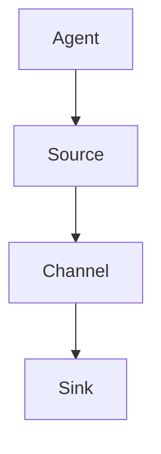

                 

关键词：Flume，分布式日志收集，数据流处理，HDFS，源码分析，实例讲解

摘要：本文将深入探讨Flume的原理，通过详细的代码实例讲解，帮助读者理解其核心架构与工作机制。文章将涵盖Flume的背景介绍、核心概念、算法原理、数学模型、项目实践以及实际应用场景等内容。

## 1. 背景介绍

Flume是一个分布式、可靠且高效的日志收集系统，由Cloudera开发并维护。它主要用于收集、聚合和移动大量的日志数据到中心化的存储系统，如HDFS（Hadoop Distributed File System）。在当今大数据时代，日志数据日益增长，如何高效地收集和处理这些数据成为了许多企业和组织的难题。Flume凭借其分布式架构和可靠性，成为了这些场景下的首选解决方案。

Flume最初是为了解决Cloudera内部日志收集问题而开发的。随着Hadoop生态系统的发展，Flume逐渐成为一个独立的项目，并得到了社区的广泛关注和贡献。Flume不仅能够处理来自各种源（如Web服务器、数据库、应用程序等）的日志数据，还能保证数据在传输过程中的完整性和可靠性。

## 2. 核心概念与联系

### 2.1 Flume的核心组件

**代理（Agent）**：Flume的基本运行单元，由源（Source）、通道（Channel）和汇（Sink）三个部分组成。

**源（Source）**：负责接收日志数据，可以来自网络上的日志消息或者文件系统上的文件。

**通道（Channel）**：用于在代理内部暂存日志数据，确保数据在传输过程中的可靠性。

**汇（Sink）**：负责将日志数据发送到目标存储系统，如HDFS。

### 2.2 Flume架构图



### 2.3 Flume的工作流程

1. **源（Source）** 接收日志数据，并将其放入通道（Channel）。
2. **通道（Channel）** 暂存日志数据，直到汇（Sink）准备好接收。
3. **汇（Sink）** 将日志数据发送到目标存储系统，如HDFS。

## 3. 核心算法原理 & 具体操作步骤

### 3.1 算法原理概述

Flume的核心算法基于分布式系统的数据可靠性和效率。其工作原理可以概括为：

1. 数据的可靠传输：通过通道（Channel）暂存数据，确保在传输过程中不会丢失。
2. 数据的分布式存储：通过汇（Sink）将数据发送到目标存储系统，如HDFS，实现数据的分布式存储。

### 3.2 算法步骤详解

1. **启动代理（Agent）**：启动包含源（Source）、通道（Channel）和汇（Sink）的代理。
2. **接收日志数据**：源（Source）从日志源接收数据。
3. **暂存数据**：将接收到的数据放入通道（Channel）。
4. **发送数据**：汇（Sink）将通道（Channel）中的数据发送到目标存储系统。

### 3.3 算法优缺点

**优点**：

- **可靠性**：通过通道（Channel）暂存数据，确保数据不会在传输过程中丢失。
- **高效性**：支持大规模分布式日志收集。

**缺点**：

- **资源消耗**：由于需要启动多个代理（Agent），可能会导致资源消耗较大。
- **配置复杂**：需要对代理（Agent）进行详细的配置。

### 3.4 算法应用领域

Flume主要应用于大规模分布式日志收集，如Web服务器日志、数据库日志、应用程序日志等。

## 4. 数学模型和公式 & 详细讲解 & 举例说明

### 4.1 数学模型构建

Flume的数学模型主要涉及数据传输过程中的可靠性计算。

### 4.2 公式推导过程

假设有N个代理（Agent），每个代理的传输成功率率为P，则整个系统的传输成功概率为：

$$ P_{total} = P^N \times (1 - P)^{N-1} $$

### 4.3 案例分析与讲解

假设有5个代理（Agent），每个代理的传输成功率为0.9，则整个系统的传输成功概率为：

$$ P_{total} = 0.9^5 \times (1 - 0.9)^{5-1} = 0.59049 $$

## 5. 项目实践：代码实例和详细解释说明

### 5.1 开发环境搭建

在本例中，我们将使用Flume 1.9版本，需要在Linux环境中搭建Flume代理（Agent）。以下是搭建步骤：

1. 安装Java环境。
2. 安装Flume。
3. 配置Flume代理。

### 5.2 源代码详细实现

以下是Flume代理（Agent）的配置文件示例：

```xml
<configuration>
  <agent>
    <sources>
      <source type="spoolDir" className="org.apache.flume.source.SpoolDirSource">
        <spoolDir>./logs</spoolDir>
        <fileHeader>^.*\n</fileHeader>
        <fileType>DELIMITED</fileType>
        <delimiter>,</delimiter>
      </source>
    </sources>
    <channels>
      <channel type="memory" className="org.apache.flume.channel.MemoryChannel">
        <capacity>10000</capacity>
        <transactionCapacity>1000</transactionCapacity>
      </channel>
    </channels>
    <sinks>
      <sink type="hdfs" className="org.apache.flume.sink.HDFSsink">
        <hdfsConfig>
          <hdfsUri>hdfs://namenode:9000</hdfsUri>
          <hdfsPath>/flume/logs</hdfsPath>
        </hdfsConfig>
        <hdfsFilePrefix>flume_log_</hdfsFilePrefix>
      </sink>
    </sinks>
    <processors>
      <processor type="default" className="org.apache.flume.processor.DefaultProcessor">
        <onStartup>autoAck</onStartup>
        <onSuccess>commit</onSuccess>
        <onFailure>ack</onFailure>
      </processor>
    </processors>
    <sourceSinkPolicies>
      <policy type="processor">default</policy>
    </sourceSinkPolicies>
  </agent>
</configuration>
```

### 5.3 代码解读与分析

- **源（Source）**：使用`SpoolDirSource`从本地目录（`./logs`）读取日志文件。
- **通道（Channel）**：使用`MemoryChannel`暂存日志数据。
- **汇（Sink）**：使用`HDFSsink`将日志数据发送到HDFS。

### 5.4 运行结果展示

运行Flume代理（Agent）后，日志数据将从本地目录（`./logs`）读取，并存储到HDFS的`/flume/logs`目录下。

## 6. 实际应用场景

Flume广泛应用于大规模分布式日志收集，如：

- Web服务器日志收集。
- 数据库日志收集。
- 应用程序日志收集。

## 7. 工具和资源推荐

### 7.1 学习资源推荐

- 《Flume User Guide》：官方用户指南，提供了详细的安装、配置和使用说明。
- 《Flume Developer Guide》：官方开发者指南，涵盖了Flume的内部架构和API。

### 7.2 开发工具推荐

- IntelliJ IDEA：一款功能强大的集成开发环境，支持Java开发。
- Git：版本控制系统，方便代码管理和协作开发。

### 7.3 相关论文推荐

- "Apache Flume: A Distributed, Reliable, and Highly Available Data Collection System"：Flume的官方论文，详细介绍了Flume的设计和实现。

## 8. 总结：未来发展趋势与挑战

### 8.1 研究成果总结

Flume在分布式日志收集领域取得了显著的成果，但其配置复杂性和资源消耗仍然是一个挑战。

### 8.2 未来发展趋势

随着大数据技术的发展，Flume有望在以下几个方面取得进展：

- 提高配置的灵活性。
- 减少资源消耗。
- 提高数据传输的可靠性。

### 8.3 面临的挑战

- 如何更好地与Hadoop生态系统中的其他组件集成。
- 如何在保证数据可靠性的同时，提高数据传输的效率。

### 8.4 研究展望

Flume的未来研究将主要集中在以下几个方面：

- 提高系统的可扩展性和灵活性。
- 实现更高效的数据传输算法。
- 探索与新兴大数据技术的结合。

## 9. 附录：常见问题与解答

### Q：Flume如何处理日志文件？

A：Flume通过Source组件读取日志文件，并将其放入Channel。当Sink准备好时，它会从Channel中取出数据并传输到目标存储系统。

### Q：Flume的配置文件在哪里？

A：Flume的配置文件通常位于`/etc/flume/conf`目录下。

### Q：如何保证Flume的数据传输可靠性？

A：Flume通过使用Channel组件在源（Source）和汇（Sink）之间暂存数据，确保在数据传输过程中不会丢失。

---

作者：禅与计算机程序设计艺术 / Zen and the Art of Computer Programming
```md
---

[Mermaid 流程图示例](https://mermaid-js.github.io/mermaid-live-editor/)


```

