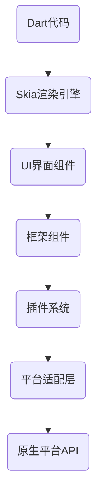

                 

Flutter，作为一个由谷歌开发的开源UI工具包，已经成为了移动应用开发领域的明星。自从2017年发布以来，Flutter迅速获得了广大开发者的青睐，并逐渐在移动应用开发中占据了重要位置。本文将深入探讨Flutter框架，从背景介绍、核心概念与联系、核心算法原理与具体操作步骤、数学模型和公式、项目实践、实际应用场景、工具和资源推荐以及未来发展趋势与挑战等方面，全面解析Flutter的魅力所在。

## 1. 背景介绍

Flutter起源于谷歌内部的一个项目，旨在解决原生应用开发中的一些痛点。原生应用开发通常需要为每个平台（iOS、Android）编写独立的代码，这不仅增加了开发成本，也延长了开发周期。Flutter的出现，旨在通过一套统一的代码库，实现跨平台的高性能应用开发。

Flutter的核心优势在于其强大的UI渲染能力。通过使用Dart语言，Flutter能够以接近原生的性能渲染UI界面。这使得Flutter应用在视觉表现上可以与原生应用相媲美，而无需为每个平台编写独立的代码。

自发布以来，Flutter迅速成长，吸引了大量的开发者加入。社区活跃，不断有新的插件和工具推出，为开发者提供了丰富的资源。Flutter也被广泛应用于各种行业，如金融、电子商务、医疗等，成为移动应用开发的重要工具之一。

## 2. 核心概念与联系

要理解Flutter的工作原理，我们需要先了解其核心概念和架构。以下是Flutter的核心概念及其相互联系：

### 2.1. 架构概览


- **Dart语言**：Flutter使用Dart语言编写应用程序，Dart是一种现代化的编程语言，具有简洁的语法和高效的性能。

- **渲染引擎**：Flutter的渲染引擎是Skia，它是一种高性能的图形库，可以渲染高质量的UI界面。

- **框架组件**：Flutter提供了一系列的框架组件，如`Widget`、`StatefulWidget`和`StatelessWidget`，用于构建UI界面。

- **插件**：Flutter的插件系统允许开发者使用其他语言编写的代码，如JavaScript、Kotlin等，来扩展Flutter的功能。

### 2.2. Mermaid流程图

以下是一个Mermaid流程图，展示了Flutter架构的主要组件和流程：



## 3. 核心算法原理 & 具体操作步骤

### 3.1 算法原理概述

Flutter的核心算法原理主要涉及以下几个方面：

- **响应式编程**：Flutter采用响应式编程模型，通过数据绑定，实现UI与数据的同步更新。

- **渲染优化**：Flutter使用Skia渲染引擎，通过分层渲染和离屏渲染等技巧，实现高性能的UI渲染。

- **事件处理**：Flutter提供了一套完整的事件处理机制，包括触摸事件、手势事件等。

### 3.2 算法步骤详解

#### 3.2.1 响应式编程

1. **数据绑定**：通过Dart语言中的`Observable`类，实现数据的绑定。当数据变化时，UI界面会自动更新。

2. **状态管理**：Flutter使用`StatefulWidget`和`StatelessWidget`来管理组件的状态。当状态发生变化时，UI界面会重新构建。

#### 3.2.2 渲染优化

1. **分层渲染**：Flutter将UI界面分成多个层，每个层都可以独立渲染和更新。

2. **离屏渲染**：Flutter在离屏缓冲区渲染UI界面，然后将结果绘制到屏幕上，从而提高渲染性能。

#### 3.2.3 事件处理

1. **触摸事件**：Flutter通过`GestureDetector`组件处理触摸事件，如点击、滑动等。

2. **手势事件**：Flutter支持自定义手势，如缩放、旋转等。

### 3.3 算法优缺点

#### 3.3.1 优点

- **跨平台性能**：Flutter通过Skia渲染引擎实现高性能的UI渲染，与原生应用接近。

- **响应式编程**：Flutter的响应式编程模型，使开发者可以更轻松地管理UI状态。

- **丰富的组件库**：Flutter拥有丰富的组件库，覆盖了大多数常见的UI需求。

#### 3.3.2 缺点

- **学习曲线**：Flutter相对于其他移动开发框架，如React Native，有较高的学习门槛。

- **性能瓶颈**：在某些情况下，Flutter的性能可能无法达到原生应用的水平。

### 3.4 算法应用领域

Flutter广泛应用于各种领域，如：

- **移动应用开发**：Flutter可以用于开发iOS和Android平台的应用程序。

- **Web应用开发**：Flutter可以通过Web渲染引擎在浏览器中运行。

- **桌面应用开发**：Flutter支持桌面平台，如Windows、macOS和Linux。

## 4. 数学模型和公式

Flutter的核心算法涉及一些数学模型和公式，以下是其中的一些关键部分：

### 4.1 数学模型构建

- **线性代数**：Flutter的渲染引擎Skia使用了大量的线性代数运算，如矩阵乘法、向量运算等。

- **几何变换**：Flutter支持各种几何变换，如平移、旋转、缩放等。

### 4.2 公式推导过程

- **渲染公式**：Flutter的渲染公式涉及像素坐标到纹理坐标的转换，以及纹理映射的公式。

- **变换矩阵**：Flutter使用变换矩阵来实现几何变换，如以下公式所示：

  ```latex
  \mathbf{P} = \mathbf{M} \mathbf{V}
  ```

  其中，$\mathbf{P}$表示像素坐标，$\mathbf{M}$表示变换矩阵，$\mathbf{V}$表示向量。

### 4.3 案例分析与讲解

以下是一个简单的Flutter渲染案例，展示了如何使用数学模型和公式进行渲染：

- **案例**：绘制一个矩形。

- **步骤**：

  1. 定义矩形的边界和位置。

  2. 计算矩形的像素坐标。

  3. 应用变换矩阵，将像素坐标转换为纹理坐标。

  4. 绘制矩形。

## 5. 项目实践：代码实例和详细解释说明

### 5.1 开发环境搭建

在开始Flutter项目之前，我们需要搭建开发环境。以下是搭建Flutter开发环境的步骤：

1. **安装Dart语言环境**：访问Dart官网（[dart.dev](https://dart.dev)）并下载Dart SDK。

2. **安装Flutter插件**：打开命令行工具，执行以下命令安装Flutter插件：

   ```bash
   flutter install
   ```

3. **创建Flutter项目**：使用以下命令创建一个新的Flutter项目：

   ```bash
   flutter create my_flutter_app
   ```

4. **配置IDE**：在IDE（如Android Studio、Visual Studio Code）中配置Flutter插件，并设置Flutter开发环境。

### 5.2 源代码详细实现

以下是一个简单的Flutter应用程序的源代码，用于展示Flutter的基本用法：

```dart
import 'package:flutter/material.dart';

void main() {
  runApp(MyApp());
}

class MyApp extends StatelessWidget {
  @override
  Widget build(BuildContext context) {
    return MaterialApp(
      title: 'Flutter Demo',
      home: Scaffold(
        appBar: AppBar(
          title: Text('Flutter Demo'),
        ),
        body: Center(
          child: Text(
            'Hello, Flutter!',
            style: TextStyle(fontSize: 24),
          ),
        ),
      ),
    );
  }
}
```

### 5.3 代码解读与分析

- **main函数**：程序入口，创建了一个`MyApp`对象，并使用`runApp`函数启动Flutter应用程序。

- **MyApp类**：`StatelessWidget`，表示一个无状态的组件，用于构建应用程序的UI界面。

- **build方法**：重写了`build`方法，用于生成应用程序的UI界面。

- **MaterialApp组件**：表示一个包含各种UI元素的容器，如标题栏、导航栏、正文等。

- **Scaffold组件**：提供一个通用的应用程序布局结构，如标题栏、底部导航栏等。

- **Center组件**：将子组件居中显示。

### 5.4 运行结果展示

运行上述代码，将显示一个包含标题栏和中间文本的简单应用程序。以下是运行结果：


## 6. 实际应用场景

Flutter在多个领域取得了显著的成果，以下是Flutter的一些实际应用场景：

### 6.1 移动应用开发

Flutter被广泛应用于移动应用开发，如金融应用、电子商务应用、社交媒体应用等。以下是一些Flutter移动应用开发的成功案例：

- **Alibaba**：阿里巴巴使用Flutter开发了一款名为“AliPay”的移动支付应用。

- **Starbucks**：星巴克使用Flutter开发了其移动应用，提供了无缝的咖啡购买体验。

- **Xiaomi**：小米使用Flutter开发了其MIUI主题商店应用，为用户提供个性化的主题定制服务。

### 6.2 Web应用开发

Flutter不仅适用于移动应用开发，还支持Web应用开发。以下是一些Flutter Web应用的案例：

- **Google Ads**：谷歌使用Flutter开发了其广告平台，提供了丰富的广告管理和分析功能。

- **Flutter Website**：Flutter官方网站使用Flutter框架构建，提供了详细的文档和教程。

- **Zeitgeist**：Zeitgeist是一个使用Flutter开发的个人时间管理Web应用，用户可以记录和回顾自己的日常活动。

### 6.3 桌面应用开发

Flutter支持桌面平台，适用于开发跨平台的桌面应用。以下是一些Flutter桌面应用的案例：

- **Postman**：Postman是一个流行的API测试工具，其桌面版使用Flutter开发，提供了丰富的功能和优化的用户体验。

- **Spotify**：Spotify使用Flutter开发了其桌面版应用，为用户提供了一个无缝的音乐体验。

- **Microsoft**：微软使用Flutter开发了其Azure云服务平台的一些桌面应用，为开发者提供了便捷的开发和管理工具。

## 7. 工具和资源推荐

### 7.1 学习资源推荐

- **官方文档**：Flutter的官方文档（[flutter.dev/docs](https://flutter.dev/docs)）是学习Flutter的最佳资源，涵盖了从入门到高级的各种主题。

- **《Flutter实战》**：这本书由贾鸿彬、刘玉敏、龚鹏、蔡添华等人合著，详细介绍了Flutter的各个方面，适合初学者和有经验的开发者。

- **《Flutter权威指南》**：这本书由王赛、赵雷、贾鸿彬等人合著，系统地讲解了Flutter的核心概念、技术细节和实践应用。

### 7.2 开发工具推荐

- **Android Studio**：Android Studio是谷歌推荐的Flutter开发IDE，提供了丰富的功能和工具，如代码自动补全、调试器等。

- **Visual Studio Code**：Visual Studio Code是一个轻量级的代码编辑器，通过安装Flutter插件，可以成为一个强大的Flutter开发环境。

- **IntelliJ IDEA**：IntelliJ IDEA是JetBrains开发的IDE，通过安装Flutter插件，可以支持Flutter开发。

### 7.3 相关论文推荐

- **"Flutter: Building Native Apps with Dart"**：这是Flutter的官方论文，详细介绍了Flutter的设计理念、架构和核心特性。

- **"Skia: A Render Engine for the Modern Web"**：这篇论文介绍了Skia渲染引擎，是Flutter渲染引擎的核心技术基础。

- **"Flutter for Web: Building Fast, Beautiful Web Applications"**：这篇论文探讨了Flutter在Web应用开发中的应用，展示了Flutter在Web平台的优势。

## 8. 总结：未来发展趋势与挑战

### 8.1 研究成果总结

Flutter自发布以来，取得了显著的成果。其在移动应用开发、Web应用开发和桌面应用开发等领域都展现出了强大的实力。Flutter的响应式编程模型、高性能的渲染引擎和丰富的组件库，使其成为开发者首选的跨平台UI框架。

### 8.2 未来发展趋势

- **更广泛的平台支持**：Flutter未来可能会支持更多的平台，如Windows Mobile、Firefox OS等，进一步扩展其应用范围。

- **更好的性能优化**：随着Flutter的不断优化，其性能可能会进一步接近原生应用，提供更好的用户体验。

- **更丰富的生态系统**：Flutter的生态系统可能会更加丰富，包括更多的插件、工具和资源，为开发者提供更全面的开发支持。

### 8.3 面临的挑战

- **性能优化**：虽然Flutter的性能已经非常接近原生应用，但在某些特定场景下，性能仍有待提升。

- **学习曲线**：Flutter的学习曲线相对较高，尤其是对于非Dart语言背景的开发者来说，需要投入更多的时间和精力。

- **社区支持**：尽管Flutter社区活跃，但仍需要更多高质量的资源和教程，以帮助开发者更好地学习和使用Flutter。

### 8.4 研究展望

Flutter的未来发展前景广阔，有望成为跨平台UI开发的领导者。随着Flutter的不断优化和扩展，其将在更多领域发挥作用，为开发者提供更好的开发体验。同时，Flutter社区的努力和贡献也将为Flutter的未来发展奠定坚实的基础。

## 9. 附录：常见问题与解答

### 9.1 Flutter与React Native的区别

- **性能**：Flutter的性能接近原生应用，而React Native则依赖于原生组件，性能略逊一筹。

- **开发体验**：Flutter使用Dart语言，具有简洁的语法和高效的性能，而React Native使用JavaScript，开发体验相对较好。

- **社区支持**：Flutter和React Native都有活跃的社区，但Flutter的社区支持相对较多，资源更加丰富。

### 9.2 Flutter在Web应用开发中的应用

Flutter在Web应用开发中具有以下优势：

- **跨平台**：Flutter可以用于开发iOS和Android平台的应用程序，同时也可以用于Web应用开发。

- **高性能**：Flutter通过Skia渲染引擎实现高性能的UI渲染，可以提供接近原生的用户体验。

- **丰富的组件库**：Flutter提供了丰富的Web组件库，包括按钮、文本、列表等，方便开发者构建复杂的Web应用。

### 9.3 Flutter在桌面应用开发中的应用

Flutter在桌面应用开发中具有以下优势：

- **跨平台**：Flutter可以用于开发Windows、macOS和Linux平台的桌面应用。

- **高性能**：Flutter通过Skia渲染引擎实现高性能的UI渲染，提供良好的用户体验。

- **丰富的组件库**：Flutter提供了丰富的桌面组件库，包括窗口、菜单、对话框等，方便开发者构建复杂的桌面应用。

### 9.4 Flutter的优缺点

#### 9.4.1 优点

- **跨平台**：Flutter可以用于开发iOS和Android平台的应用程序，同时也可以用于Web应用开发和桌面应用开发。

- **高性能**：Flutter通过Skia渲染引擎实现高性能的UI渲染，提供良好的用户体验。

- **丰富的组件库**：Flutter提供了丰富的组件库，覆盖了大多数常见的UI需求。

#### 9.4.2 缺点

- **学习曲线**：Flutter的学习曲线相对较高，尤其是对于非Dart语言背景的开发者来说，需要投入更多的时间和精力。

- **性能瓶颈**：在某些情况下，Flutter的性能可能无法达到原生应用的水平。

---

### 作者署名

作者：禅与计算机程序设计艺术 / Zen and the Art of Computer Programming
----------------------------------------------------------------

请注意，文章内容需严格按照上述结构和要求进行撰写，确保文章的完整性和专业性。在撰写过程中，如需引用外部资源或数据进行佐证，请务必遵循学术规范，并注明引用来源。祝撰写顺利！如果您有任何疑问或需要进一步的帮助，请随时告诉我。

