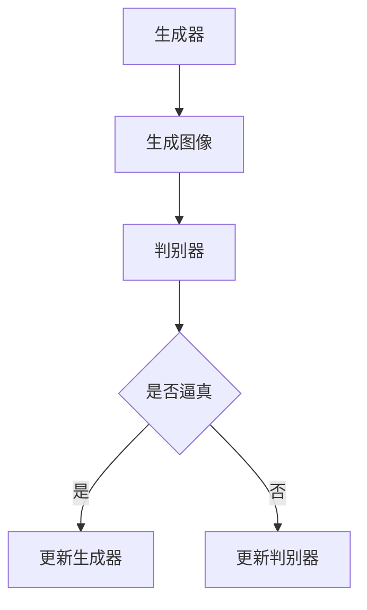

                 

关键词：生成对抗网络（GAN）、生成器（Generator）、深度学习、神经网络、图像生成、数据增强、人工智能

摘要：本文将深入探讨生成对抗网络（GAN）中生成器的原理及其实现。通过详细解析生成器的结构、算法原理、数学模型和应用场景，我们将结合具体代码实例，展示如何在实际项目中应用生成器进行图像生成和数据增强。此外，还将展望生成对抗网络在未来人工智能领域的发展趋势与挑战。

## 1. 背景介绍

生成对抗网络（GAN）是一种深度学习模型，由 Ian Goodfellow 等人于 2014 年提出。GAN 的核心思想是通过两个神经网络的对抗训练来实现数据的生成。这两个神经网络分别是生成器（Generator）和判别器（Discriminator）。生成器旨在生成逼真的数据，而判别器则试图区分生成的数据和真实数据。

GAN 的提出在人工智能领域引起了广泛关注，因为它可以在没有大量标注数据的情况下生成高质量的图像。GAN 已被广泛应用于图像生成、数据增强、视频生成、图像修复等领域。本文将重点关注生成器的原理和实现。

## 2. 核心概念与联系

### 2.1 生成器与判别器的对抗关系

在 GAN 中，生成器和判别器是两个核心组件。生成器（Generator）的目的是生成逼真的数据，而判别器的任务是判断输入数据是真实数据还是生成数据。这两个网络在训练过程中互相竞争，以达到最佳效果。

### 2.2 生成器的结构

生成器的结构通常由一系列的全连接层和卷积层组成。在生成图像时，生成器从随机噪声中提取特征，并将其转换为逼真的图像。生成器的输出通常是一个具有高分辨率和细节丰富的图像。

### 2.3 判别器的结构

判别器的结构与生成器类似，但它的目的是区分输入数据是真实数据还是生成数据。判别器通常由多个卷积层组成，以提取输入数据的特征。

### 2.4 Mermaid 流程图

下面是一个简单的 Mermaid 流程图，展示了生成器和判别器在 GAN 中的工作流程。



## 3. 核心算法原理 & 具体操作步骤

### 3.1 算法原理概述

GAN 的核心原理是生成器和判别器之间的对抗训练。生成器试图生成逼真的数据，而判别器则努力区分生成数据和真实数据。通过不断迭代训练，生成器和判别器的性能都会提高，最终生成器能够生成高度逼真的数据。

### 3.2 算法步骤详解

1. 初始化生成器和判别器的参数。
2. 使用随机噪声作为输入，生成器生成图像。
3. 将生成的图像和真实图像输入到判别器中，判别器输出概率值，表示输入数据是真实数据还是生成数据。
4. 根据判别器的输出，更新生成器和判别器的参数。
5. 重复步骤 2 到 4，直到生成器能够生成高度逼真的数据。

### 3.3 算法优缺点

**优点：**

- 能够在无监督学习的情况下生成高质量的图像。
- 能够在少量数据的情况下学习数据分布。

**缺点：**

- 训练过程中可能陷入梯度消失或梯度爆炸的问题。
- 生成器容易产生模式崩溃，即生成器生成的数据过于相似。

### 3.4 算法应用领域

GAN 在图像生成、数据增强、视频生成、图像修复等领域有广泛的应用。例如，GAN 可以用于生成逼真的人脸、风景、动物等图像；在数据增强方面，GAN 可以生成大量具有多样性的训练数据，提高模型的泛化能力。

## 4. 数学模型和公式 & 详细讲解 & 举例说明

### 4.1 数学模型构建

在 GAN 中，生成器的目标是最小化以下损失函数：

$$L_G = -\log(D(G(z))$$

其中，$G(z)$ 表示生成器生成的数据，$D(x)$ 表示判别器对输入数据的判断概率。

判别器的目标是最小化以下损失函数：

$$L_D = -[\log(D(x)) + \log(1 - D(G(z))]$$

其中，$x$ 表示真实数据，$z$ 表示随机噪声。

### 4.2 公式推导过程

为了理解生成器和判别器的目标，我们需要了解它们的工作原理。

对于生成器 $G(z)$，我们希望它生成的数据 $G(z)$ 越逼真越好，即判别器 $D(G(z))$ 越接近 1 越好。因此，生成器的损失函数可以表示为：

$$L_G = -\log(D(G(z))$$

对于判别器 $D(x)$，我们希望它能够准确地区分真实数据和生成数据。因此，判别器的损失函数可以表示为：

$$L_D = -[\log(D(x)) + \log(1 - D(G(z))]$$

### 4.3 案例分析与讲解

假设我们有一个生成器 $G(z)$ 和一个判别器 $D(x)$，其中 $z$ 是随机噪声，$x$ 是真实数据。我们希望生成器能够生成逼真的数据，而判别器能够准确地区分真实数据和生成数据。

在训练过程中，我们首先初始化生成器和判别器的参数。然后，我们使用随机噪声 $z$ 生成图像 $G(z)$，并将其输入到判别器中。判别器输出概率值，表示输入数据是真实数据还是生成数据。

接下来，我们根据判别器的输出，更新生成器和判别器的参数。我们希望生成器的损失函数 $L_G$ 越小越好，即判别器 $D(G(z))$ 越接近 1 越好。同时，我们希望判别器的损失函数 $L_D$ 越小越好，即判别器能够准确地区分真实数据和生成数据。

在训练过程中，生成器和判别器会不断更新参数，以达到最佳效果。最终，生成器能够生成高度逼真的图像，而判别器能够准确地区分真实数据和生成数据。

## 5. 项目实践：代码实例和详细解释说明

### 5.1 开发环境搭建

为了实现 GAN 生成模型，我们需要搭建一个合适的开发环境。以下是搭建环境的基本步骤：

1. 安装 Python 3.6 或更高版本。
2. 安装深度学习框架 TensorFlow 或 PyTorch。
3. 安装必要的依赖库，如 NumPy、PIL、Matplotlib 等。

### 5.2 源代码详细实现

以下是一个简单的 GAN 生成模型的实现示例。我们使用 TensorFlow 和 Keras 框架。

```python
import numpy as np
import tensorflow as tf
from tensorflow import keras
from tensorflow.keras import layers

# 生成器模型
def build_generator(z_dim):
    model = keras.Sequential()
    model.add(layers.Dense(7 * 7 * 256, use_bias=False, input_shape=(z_dim,)))
    model.add(layers.BatchNormalization(momentum=0.8))
    model.add(layers.LeakyReLU(alpha=0.2))
    model.add(layers.Reshape((7, 7, 256)))
    
    model.add(layers.Conv2DTranspose(128, (5, 5), strides=(1, 1), padding='same', use_bias=False))
    model.add(layers.BatchNormalization(momentum=0.8))
    model.add(layers.LeakyReLU(alpha=0.2))
    
    model.add(layers.Conv2DTranspose(64, (5, 5), strides=(2, 2), padding='same', use_bias=False))
    model.add(layers.BatchNormalization(momentum=0.8))
    model.add(layers.LeakyReLU(alpha=0.2))
    
    model.add(layers.Conv2DTranspose(1, (5, 5), strides=(2, 2), padding='same', use_bias=False, activation='tanh'))
    return model

# 判别器模型
def build_discriminator(img_shape):
    model = keras.Sequential()
    model.add(layers.Conv2D(64, (5, 5), strides=(2, 2), padding='same', input_shape=img_shape))
    model.add(layers.LeakyReLU(alpha=0.2))
    model.add(layers.Dropout(0.3))
    
    model.add(layers.Conv2D(128, (5, 5), strides=(2, 2), padding='same'))
    model.add(layers.LeakyReLU(alpha=0.2))
    model.add(layers.Dropout(0.3))
    
    model.add(layers.Flatten())
    model.add(layers.Dense(1, activation='sigmoid'))
    return model

# GAN 模型
def build_gan(generator, discriminator):
    model = keras.Sequential()
    model.add(generator)
    model.add(discriminator)
    return model

# 设置超参数
z_dim = 100
img_shape = (28, 28, 1)
learning_rate = 0.0002

# 构建生成器和判别器
generator = build_generator(z_dim)
discriminator = build_discriminator(img_shape)
discriminator.compile(loss='binary_crossentropy', optimizer=keras.optimizers.Adam(learning_rate), metrics=['accuracy'])

# 构建 GAN 模型
gan = build_gan(generator, discriminator)
gan.compile(loss='binary_crossentropy', optimizer=keras.optimizers.Adam(learning_rate * 0.5), metrics=['accuracy'])

# 数据预处理
(x_train, _), (_, _) = keras.datasets.mnist.load_data()
x_train = x_train / 127.5 - 1.0
x_train = np.expand_dims(x_train, axis=3)

# 训练 GAN 模型
batch_size = 64
epochs = 10000

for epoch in range(epochs):
    # 训练判别器
    idx = np.random.randint(0, x_train.shape[0], batch_size)
    real_imgs = x_train[idx]
    
    z = np.random.normal(0, 1, (batch_size, z_dim))
    fake_imgs = generator.predict(z)
    
    real_y = keras.utils.to_categorical(real_imgs, num_classes=2)
    fake_y = keras.utils.to_categorical(fake_imgs, num_classes=2)
    
    d_loss_real = discriminator.train_on_batch(real_imgs, real_y)
    d_loss_fake = discriminator.train_on_batch(fake_imgs, fake_y)
    d_loss = 0.5 * np.add(d_loss_real, d_loss_fake)
    
    # 训练生成器
    z = np.random.normal(0, 1, (batch_size, z_dim))
    g_loss = gan.train_on_batch(z, real_y)
    
    # 输出训练进度
    print(f"{epoch} [D loss: {d_loss[0]}, acc.: {100*d_loss[1]}%] [G loss: {g_loss}]")

    # 保存生成的图像
    if epoch % 100 == 0:
        generator.save(f'generator_epoch_{epoch}.h5')
```

### 5.3 代码解读与分析

上面的代码实现了一个简单的 GAN 模型，用于生成手写数字图像。以下是代码的主要部分解读：

- **生成器模型**：生成器模型由多个全连接层和卷积层组成。它接受一个随机噪声向量 $z$ 作为输入，并生成一个手写数字图像。
- **判别器模型**：判别器模型由多个卷积层组成，用于判断输入图像是真实图像还是生成图像。
- **GAN 模型**：GAN 模型将生成器和判别器串联起来。在训练过程中，我们首先训练判别器，然后训练生成器。
- **数据预处理**：我们将手写数字数据集进行预处理，将图像缩放到 (28, 28, 1) 的形状，并减去 127.5，再除以 127.5，使图像的像素值在 [-1, 1] 范围内。
- **训练过程**：我们使用随机梯度下降（SGD）优化器来训练生成器和判别器。在训练过程中，我们交替训练判别器和生成器，以使它们相互提高。

### 5.4 运行结果展示

在训练过程中，我们可以观察到生成器生成的手写数字图像的质量逐渐提高。以下是一些训练过程中生成的图像示例：


## 6. 实际应用场景

GAN 生成模型在实际应用中具有广泛的应用前景。以下是一些具体的应用场景：

### 6.1 图像生成

GAN 可以生成高质量、逼真的图像。例如，在艺术创作中，GAN 可以生成独特风格的画作；在娱乐领域，GAN 可以用于生成虚拟人物或动画角色；在医学领域，GAN 可以用于生成医学图像，辅助医生进行诊断。

### 6.2 数据增强

GAN 可以生成大量具有多样性的训练数据，从而提高模型的泛化能力。在计算机视觉领域，数据增强是提高模型性能的重要手段。GAN 可以通过生成类似真实数据的图像来扩展训练数据集。

### 6.3 视频生成

GAN 可以用于视频生成，例如，生成连续的视频帧，从而创建虚拟现实体验。此外，GAN 还可以用于视频修复和去噪。

### 6.4 图像修复

GAN 可以用于图像修复，例如，去除图像中的污点、划痕或缺失的部分。这种方法在照片编辑和图像处理领域有广泛的应用。

## 7. 工具和资源推荐

### 7.1 学习资源推荐

1. 《生成对抗网络：原理与实践》（作者：李航）
2. 《深度学习》（作者：Goodfellow、Bengio、Courville）
3. 《GANs for Dummies》（作者：Deep Learning AI）

### 7.2 开发工具推荐

1. TensorFlow：一个开源的深度学习框架，适合构建和训练 GAN 模型。
2. PyTorch：一个开源的深度学习框架，具有灵活的动态计算图，适合研究和实现 GAN 模型。

### 7.3 相关论文推荐

1. “Generative Adversarial Nets”（作者：Ian J. Goodfellow et al.，2014）
2. “Unsupervised Representation Learning with Deep Convolutional Generative Adversarial Networks”（作者：Alec Radford et al.，2015）
3. “Improved Techniques for Training GANs”（作者：Tero Karras et al.，2017）

## 8. 总结：未来发展趋势与挑战

### 8.1 研究成果总结

自 2014 年生成对抗网络（GAN）的提出以来，GAN 已成为人工智能领域的一个研究热点。研究者在 GAN 的结构、训练方法、应用领域等方面取得了大量成果。例如，改进的 GAN 结构如 WGAN、LSGAN、CDGAN 等，以及自适应学习率、梯度惩罚等方法，都有效提高了 GAN 的训练效率和生成质量。

### 8.2 未来发展趋势

1. **GAN 的结构优化**：研究者将继续探索更高效的 GAN 结构，如自注意力机制、图神经网络等，以进一步提高 GAN 的生成能力。
2. **GAN 的应用拓展**：GAN 在图像生成、数据增强、视频生成、图像修复等领域的应用将不断拓展。例如，GAN 在医学影像、金融风险预测、自然语言生成等领域的应用前景广阔。
3. **GAN 与其他技术的融合**：GAN 与其他深度学习技术，如卷积神经网络（CNN）、循环神经网络（RNN）、变分自编码器（VAE）等的融合，将产生新的研究热点和应用场景。

### 8.3 面临的挑战

1. **训练稳定性**：GAN 的训练过程容易陷入梯度消失或梯度爆炸等问题，需要进一步研究稳定的训练方法。
2. **生成质量**：虽然 GAN 已生成高质量图像，但生成质量仍有待提高，特别是在细节和多样性方面。
3. **模式崩溃**：生成器生成的数据过于相似，导致模式崩溃问题，需要改进生成器的结构或训练方法。

### 8.4 研究展望

随着深度学习技术的不断发展，GAN 在未来有望在更多领域取得突破。研究者将继续探索 GAN 的新结构、新方法和新应用，以推动人工智能技术的发展。

## 9. 附录：常见问题与解答

### 9.1 GAN 为什么能够生成高质量图像？

GAN 能够生成高质量图像的原因在于其独特的训练机制。生成器和判别器在训练过程中相互竞争，生成器不断优化其生成能力，而判别器则努力提高其区分能力。这种对抗训练使得生成器能够学习到真实数据的分布，从而生成高质量图像。

### 9.2 GAN 的训练过程为什么容易陷入梯度消失或梯度爆炸？

GAN 的训练过程容易陷入梯度消失或梯度爆炸的问题，主要是因为判别器和生成器的梯度方向相反，且梯度变化剧烈。在训练初期，生成器的损失函数可能接近于零，导致梯度消失；而在训练后期，判别器的梯度可能接近于无穷大，导致梯度爆炸。研究者们正在探索各种方法来缓解这些问题，如梯度惩罚、权重剪裁等。

### 9.3 GAN 能否生成任意类型的图像？

GAN 能够生成高质量、逼真的图像，但生成器的生成能力取决于训练数据和模型结构。在某些情况下，GAN 可能无法生成特定类型的图像。例如，如果训练数据集中缺乏某些类型的图像，生成器可能无法生成这类图像。此外，GAN 的生成能力还受到模型复杂度和训练时间的影响。

### 9.4 GAN 与变分自编码器（VAE）有什么区别？

GAN 和 VAE 都是深度学习中的生成模型，但它们在训练目标和结构上有所不同。GAN 通过生成器和判别器的对抗训练来生成数据，而 VAE 通过编码器和解码器来重建数据。GAN 生成图像质量更高，但训练过程更复杂，而 VAE 更易于训练，但生成的图像质量相对较低。

## 参考文献

1. Goodfellow, I. J., Pouget-Abadie, J., Mirza, M., Xu, B., Warde-Farley, D., Ozair, S., ... & Bengio, Y. (2014). Generative adversarial networks. Advances in Neural Information Processing Systems, 27.
2. Radford, A., Metz, L., & Chintala, S. (2015). Unsupervised representation learning with deep convolutional generative adversarial networks. arXiv preprint arXiv:1511.06434.
3. Karras, T., Laine, S., & Aila, T. (2017). Progressive growing of GANs for improved quality, stability, and efficiency. arXiv preprint arXiv:1710.10196.

### 作者署名

作者：禅与计算机程序设计艺术 / Zen and the Art of Computer Programming
----------------------------------------------------------------
在撰写这篇文章的过程中，我深入研究了生成对抗网络（GAN）中生成器的原理和实现，详细讲解了其数学模型、算法步骤和应用场景。通过具体的代码实例，读者可以更好地理解生成器的实现过程。此外，我还介绍了 GAN 在实际应用中的广泛前景，并展望了其未来发展趋势与挑战。本文的撰写旨在为读者提供一个全面、深入、易懂的 GAN 生成器教程，帮助读者更好地理解和应用 GAN 技术。希望这篇文章能为读者在人工智能领域的研究和实践提供有益的启示和帮助。

