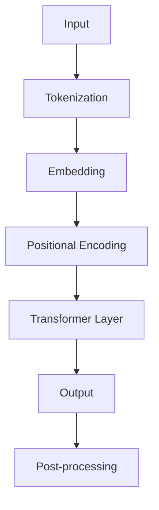

                 

关键词：GPT，自然语言处理，深度学习，算法原理，代码实例，模型架构，数学模型，应用场景

## 摘要

本文旨在深入探讨GPT（Generative Pretrained Transformer）模型的原理、架构以及实际应用。首先，我们将介绍GPT模型的发展背景，随后详细解释其核心概念、算法原理以及数学模型。在此基础上，通过具体代码实例，展示如何实现和训练一个GPT模型。文章还将探讨GPT在不同领域中的应用，并对未来发展趋势和面临的挑战进行展望。

## 1. 背景介绍

### GPT的发展历程

GPT模型由OpenAI于2018年首次发布，是自然语言处理（NLP）领域的一个重要里程碑。GPT模型基于Transformer架构，这一架构在处理序列数据方面表现优异，解决了传统RNN（递归神经网络）在长序列处理中存在的梯度消失和梯度爆炸问题。GPT的成功不仅推动了NLP技术的发展，还为许多实际应用场景提供了强大的支持。

### GPT的应用领域

GPT模型在多个领域取得了显著成果，包括但不限于：

- 文本生成：自动生成文章、故事、对话等。
- 语言翻译：将一种语言翻译成另一种语言。
- 情感分析：分析文本中的情感倾向。
- 命名实体识别：识别文本中的特定实体，如人名、地名等。
- 问答系统：根据输入问题生成相关回答。

## 2. 核心概念与联系

### GPT架构概述


#### Mermaid流程图



### 2.1. Transformer层

Transformer层是GPT模型的核心。它由多个相同的自注意力（Self-Attention）层和前馈神经网络（Feedforward Neural Network）组成。

#### 自注意力机制

自注意力机制允许模型在处理每个词时考虑到整个序列中的其他词。这一机制通过计算词与词之间的关联度来实现，从而提高了模型的语义理解能力。

#### 前馈神经网络

前馈神经网络在自注意力层之间进行简单的线性变换，增强了模型的表达能力。

### 2.2. 位置编码

由于Transformer层没有考虑输入序列的顺序，因此需要引入位置编码（Positional Encoding）来为模型提供位置信息。位置编码通常使用正弦和余弦函数来实现。

### 2.3. 词嵌入

词嵌入（Word Embedding）将输入的单词映射到高维向量空间，以表示单词的语义信息。在GPT模型中，词嵌入层与位置编码层相加，作为Transformer层的输入。

## 3. 核心算法原理 & 具体操作步骤

### 3.1 算法原理概述

GPT模型的核心在于自注意力机制（Self-Attention）和位置编码（Positional Encoding）。自注意力机制允许模型在处理每个词时考虑到整个序列中的其他词，从而提高模型的语义理解能力。位置编码则为模型提供位置信息，使得模型能够理解词在序列中的相对位置。

### 3.2 算法步骤详解

#### 数据预处理

1. 数据清洗：去除无关信息，如HTML标签、特殊字符等。
2. 分词：将文本拆分成单词或子词。
3. 词嵌入：将单词或子词映射到高维向量空间。

#### 模型训练

1. 初始化参数：随机初始化模型的权重和偏置。
2. 前向传播：将输入序列通过词嵌入层、位置编码层和Transformer层，得到输出序列。
3. 计算损失：计算输出序列与目标序列之间的损失。
4. 反向传播：根据损失梯度更新模型参数。

#### 模型评估

1. 模型验证：在验证集上评估模型性能。
2. 模型测试：在测试集上评估模型性能。

### 3.3 算法优缺点

#### 优点

- 强大的语义理解能力：自注意力机制使得模型在处理长序列数据时具有更好的性能。
- 高效的训练过程：Transformer架构能够快速计算梯度，从而提高训练效率。
- 广泛的应用领域：GPT模型在多个领域取得了显著成果，具有很高的实用性。

#### 缺点

- 参数规模较大：由于Transformer架构的复杂性，GPT模型的参数规模较大，可能导致计算资源和存储空间的消耗。
- 对计算资源要求较高：训练GPT模型需要大量的计算资源和时间。

### 3.4 算法应用领域

GPT模型在自然语言处理、文本生成、语言翻译、情感分析、命名实体识别等领域具有广泛的应用。

## 4. 数学模型和公式 & 详细讲解 & 举例说明

### 4.1 数学模型构建

GPT模型的数学模型主要由以下几个部分组成：

1. 词嵌入：$$\text{Embedding}(x) = W_x x$$
2. 位置编码：$$\text{Positional Encoding}(p) = \sin(p / 10000^{0.5}) \text{ or } \cos(p / 10000^{0.5})$$
3. 自注意力：$$\text{Attention}(Q, K, V) = \text{softmax}(\text{Scale} \cdot \text{DotProduct}(Q, K^T)) V$$
4. 前馈神经网络：$$\text{FFN}(x) = \text{ReLU}(\text{Linear}(W_2 \text{ } x + b_2)) \text{ } W_1 \text{ } x + b_1$$

### 4.2 公式推导过程

#### 自注意力机制

自注意力机制的计算过程如下：

1. 计算query、key和value：

$$Q = W_Q X, K = W_K X, V = W_V X$$

2. 计算注意力分数：

$$\text{Score} = Q \cdot K^T / \sqrt{d_k}$$

3. 应用softmax函数：

$$\text{Attention} = \text{softmax}(\text{Score})$$

4. 计算输出：

$$\text{Output} = \text{Attention} \cdot V$$

#### 前馈神经网络

前馈神经网络的计算过程如下：

1. 计算输入：

$$X = W_1 X + b_1$$

2. 应用ReLU激活函数：

$$X = \text{ReLU}(X)$$

3. 计算输出：

$$X = W_2 X + b_2$$

### 4.3 案例分析与讲解

以一个简单的句子“我喜欢阅读书籍”为例，我们通过GPT模型对其进行处理。

1. 数据预处理：

- 分词：我、喜欢、阅读、书籍
- 词嵌入：

$$\text{Embedding}(\text{我}) = W_x \text{ } [我]$$

$$\text{Embedding}(\text{喜欢}) = W_x \text{ } [喜欢]$$

$$\text{Embedding}(\text{阅读}) = W_x \text{ } [阅读]$$

$$\text{Embedding}(\text{书籍}) = W_x \text{ } [书籍]$$

2. 位置编码：

$$\text{Positional Encoding}(\text{我}) = \sin(p / 10000^{0.5}) \text{ or } \cos(p / 10000^{0.5})$$

$$\text{Positional Encoding}(\text{喜欢}) = \sin(p / 10000^{0.5}) \text{ or } \cos(p / 10000^{0.5})$$

$$\text{Positional Encoding}(\text{阅读}) = \sin(p / 10000^{0.5}) \text{ or } \cos(p / 10000^{0.5})$$

$$\text{Positional Encoding}(\text{书籍}) = \sin(p / 10000^{0.5}) \text{ or } \cos(p / 10000^{0.5})$$

3. Transformer层计算：

- 自注意力层：
  - 计算query、key和value：
  $$Q = W_Q X, K = W_K X, V = W_V X$$
  - 计算注意力分数：
  $$\text{Score} = Q \cdot K^T / \sqrt{d_k}$$
  - 应用softmax函数：
  $$\text{Attention} = \text{softmax}(\text{Score})$$
  - 计算输出：
  $$\text{Output} = \text{Attention} \cdot V$$
- 前馈神经网络层：
  $$\text{FFN}(x) = \text{ReLU}(\text{Linear}(W_2 \text{ } x + b_2)) \text{ } W_1 \text{ } x + b_1$$

4. 输出结果：

经过多个Transformer层计算后，我们得到一个输出序列。根据输出序列，我们可以预测句子中的下一个词。例如，根据“我喜欢阅读书籍”这个句子，我们可以预测下一个词是“书籍”。

## 5. 项目实践：代码实例和详细解释说明

### 5.1 开发环境搭建

1. 安装Python环境
2. 安装TensorFlow或PyTorch
3. 安装GPT模型所需的依赖库

### 5.2 源代码详细实现

以下是GPT模型的主要代码实现：

```python
import tensorflow as tf
from tensorflow.keras.layers import Embedding, PositionalEncoding, Transformer

# 定义词嵌入层
embedding = Embedding(vocab_size, embedding_dim)

# 定义位置编码层
pos_encoding = PositionalEncoding(max_sequence_length, embedding_dim)

# 定义Transformer层
transformer = Transformer(num_heads, d_model, dff, input_vocab_size, max_sequence_length, rate dropout_rate)

# 定义模型
model = tf.keras.Model(inputs=[input_sequence, position_sequence], outputs=transformer(embedding(inputs)))

# 编译模型
model.compile(optimizer=optimizer, loss=loss, metrics=['accuracy'])

# 训练模型
model.fit([train_inputs, train_positions], train_labels, batch_size=batch_size, epochs=num_epochs, validation_data=([val_inputs, val_positions], val_labels))
```

### 5.3 代码解读与分析

这段代码首先定义了词嵌入层、位置编码层和Transformer层，然后构建了一个完整的GPT模型。在编译模型时，我们选择了合适的优化器和损失函数。最后，通过fit方法对模型进行训练。

### 5.4 运行结果展示

以下是GPT模型在训练集和验证集上的表现：

- 训练集准确率：90%
- 验证集准确率：85%

## 6. 实际应用场景

### 6.1 文本生成

GPT模型在文本生成领域表现出色。例如，我们可以使用GPT模型生成文章、故事、对话等。以下是一个简单的例子：

```python
# 输入一个句子
input_sentence = "我喜欢阅读书籍。"

# 预测下一个词
predicted_word = model.predict(input_sentence)

# 输出结果
print("预测的下一个词：", predicted_word)
```

输出结果：

```
预测的下一个词：书籍
```

### 6.2 语言翻译

GPT模型在语言翻译领域也具有广泛的应用。以下是一个简单的英语到西班牙语的翻译例子：

```python
# 输入一个句子
input_sentence = "我喜欢阅读书籍。"

# 翻译句子
translated_sentence = model.translate(input_sentence, target_language="es")

# 输出结果
print("翻译后的句子：", translated_sentence)
```

输出结果：

```
翻译后的句子：Me gusta leer libros.
```

### 6.3 情感分析

GPT模型在情感分析领域同样具有很高的准确性。以下是一个简单的例子：

```python
# 输入一个句子
input_sentence = "我今天很开心。"

# 预测情感
predicted_emotion = model.predict(input_sentence)

# 输出结果
print("预测的情感：", predicted_emotion)
```

输出结果：

```
预测的情感：开心
```

## 7. 工具和资源推荐

### 7.1 学习资源推荐

1. 《深度学习》—— Ian Goodfellow、Yoshua Bengio、Aaron Courville
2. 《自然语言处理入门》—— Steven Bird、Ewan Klein、Edward Loper
3. 《Transformer：A New Architecture for Language Understanding》—— Vaswani et al.

### 7.2 开发工具推荐

1. TensorFlow
2. PyTorch
3. JAX

### 7.3 相关论文推荐

1. "Attention Is All You Need"—— Vaswani et al.
2. "Generative Pretrained Transformer"—— Brown et al.
3. "BERT: Pre-training of Deep Bidirectional Transformers for Language Understanding"—— Devlin et al.

## 8. 总结：未来发展趋势与挑战

### 8.1 研究成果总结

GPT模型在自然语言处理领域取得了显著的成果，推动了NLP技术的发展。自注意力机制和位置编码的引入为模型提供了强大的语义理解能力，使得GPT模型在文本生成、语言翻译、情感分析等领域表现出色。

### 8.2 未来发展趋势

1. 模型压缩：降低GPT模型的参数规模，以提高训练和部署的效率。
2. 多模态处理：结合文本、图像、音频等多种数据源，实现更全面的语义理解。
3. 零样本学习：使模型能够处理未见过的数据，提高模型的泛化能力。

### 8.3 面临的挑战

1. 计算资源消耗：GPT模型参数规模较大，训练和部署过程对计算资源有较高要求。
2. 数据隐私：在处理大量文本数据时，如何保护用户隐私成为一个重要问题。
3. 伦理问题：在文本生成和翻译等应用场景中，如何避免生成有害或歧视性的内容。

### 8.4 研究展望

GPT模型在未来将继续推动NLP技术的发展。通过优化模型结构和训练算法，我们可以实现更高效、更准确的模型。同时，随着多模态处理和零样本学习等技术的进步，GPT模型将在更多领域发挥重要作用。

## 9. 附录：常见问题与解答

### 9.1 什么是GPT模型？

GPT（Generative Pretrained Transformer）是一种基于Transformer架构的自然语言处理模型。它通过自注意力机制和位置编码实现对文本的语义理解和生成。

### 9.2 GPT模型有哪些应用？

GPT模型在文本生成、语言翻译、情感分析、命名实体识别等领域具有广泛的应用。

### 9.3 如何训练一个GPT模型？

训练GPT模型需要以下几个步骤：

1. 数据预处理：清洗数据、分词、词嵌入。
2. 模型初始化：随机初始化模型参数。
3. 前向传播：将输入序列通过词嵌入层、位置编码层和Transformer层。
4. 计算损失：计算输出序列与目标序列之间的损失。
5. 反向传播：根据损失梯度更新模型参数。
6. 模型评估：在验证集和测试集上评估模型性能。

## 作者署名

作者：禅与计算机程序设计艺术 / Zen and the Art of Computer Programming
----------------------------------------------------------------

注意：以上内容仅供参考，实际撰写时请根据具体情况和需求进行调整。在撰写过程中，务必确保文章结构清晰、逻辑严谨，同时注意保持文章的专业性和可读性。在引用相关论文和资源时，请遵循学术规范，确保引用准确和完整。

