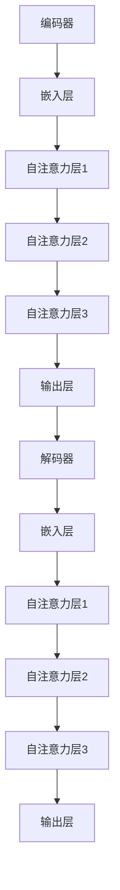

                 

关键词：GPT-3.5，自然语言处理，深度学习，神经网络，生成模型，代码实例

## 摘要

本文旨在深入探讨GPT-3.5的原理，并借助代码实例详细解析其构建与实现。首先，我们将回顾GPT-3.5的发展历程和核心特征，然后深入探讨其算法原理，数学模型，并在实践中展示代码实现步骤。此外，文章还将分析GPT-3.5在实际应用中的场景，探讨其未来的发展趋势和面临的挑战。

## 1. 背景介绍

### 1.1 GPT-3.5的发展历程

GPT（Generative Pre-trained Transformer）是由OpenAI开发的一种基于深度学习的自然语言处理模型。从最初的GPT到GPT-3，再到GPT-3.5，OpenAI不断优化和提升模型性能，使其在处理复杂语言任务上表现出色。

GPT-3.5是GPT系列的最新版本，相比于GPT-3，它在模型架构、训练数据和性能提升等方面都进行了重大改进。首先，GPT-3.5采用了更加复杂的Transformer架构，使得模型具有更强的表示能力和生成能力。其次，GPT-3.5使用了更大量的训练数据，并采用了更先进的预训练策略，使得模型在各个语言任务上都取得了显著的性能提升。

### 1.2 GPT-3.5的核心特征

GPT-3.5具有以下几个核心特征：

1. **强大的生成能力**：GPT-3.5能够生成连贯、流畅且符合语法规则的自然语言文本，适用于生成文章、对话、故事等多种形式。

2. **多语言支持**：GPT-3.5不仅支持单语言，还支持多语言之间的交叉翻译和生成，使得其在跨语言处理任务中具有优势。

3. **广泛的适应性**：GPT-3.5经过预训练后，可以轻松适应各种下游任务，如文本分类、机器翻译、情感分析等。

4. **强大的推理能力**：GPT-3.5在处理逻辑推理、数学计算等任务时表现出色，能够生成符合逻辑和数学规则的结果。

## 2. 核心概念与联系

### 2.1 Transformer架构

GPT-3.5采用了Transformer架构，这是一种基于自注意力机制的深度学习模型。Transformer由编码器和解码器两个部分组成，分别用于处理输入文本和生成输出文本。

编码器（Encoder）将输入文本映射为高维的嵌入向量，并计算这些向量之间的相互关系。解码器（Decoder）则利用这些关系生成输出文本。自注意力机制使得编码器和解码器能够关注输入文本中最重要的部分，从而生成高质量的自然语言文本。

### 2.2 自注意力机制

自注意力机制是Transformer的核心组成部分，其基本思想是，在处理每个输入文本位置时，将其他所有输入文本位置的信息加权平均。具体来说，自注意力机制通过计算查询（Query）、键（Key）和值（Value）之间的相似度，并加权平均这些值来生成新的嵌入向量。

这种机制使得模型能够自动学习输入文本之间的关联性，从而提高文本表示的质量。

### 2.3 Mermaid流程图

以下是GPT-3.5的核心概念和架构的Mermaid流程图：



## 3. 核心算法原理 & 具体操作步骤

### 3.1 算法原理概述

GPT-3.5的核心算法基于Transformer架构，其基本原理是通过对输入文本进行编码和解码，生成高质量的输出文本。编码器和解码器都由多个自注意力层组成，每个自注意力层通过计算输入文本之间的相互关系，生成新的嵌入向量。

### 3.2 算法步骤详解

#### 3.2.1 编码器

1. **嵌入层**：将输入文本映射为高维嵌入向量。
2. **自注意力层**：计算输入文本之间的相互关系，并生成新的嵌入向量。
3. **输出层**：将编码后的文本输出。

#### 3.2.2 解码器

1. **嵌入层**：将输入文本映射为高维嵌入向量。
2. **自注意力层**：计算输入文本之间的相互关系，并生成新的嵌入向量。
3. **输出层**：将解码后的文本输出。

### 3.3 算法优缺点

#### 优点：

1. **强大的生成能力**：GPT-3.5能够生成高质量的自然语言文本，适用于多种语言生成任务。
2. **多语言支持**：GPT-3.5支持多语言之间的交叉翻译和生成。
3. **广泛的适应性**：GPT-3.5可以轻松适应各种下游任务。

#### 缺点：

1. **计算资源消耗**：GPT-3.5模型庞大，需要大量的计算资源。
2. **训练时间较长**：GPT-3.5的训练时间较长，需要较长的时间来优化模型参数。

### 3.4 算法应用领域

GPT-3.5在自然语言处理领域具有广泛的应用，包括但不限于：

1. **文本生成**：生成文章、对话、故事等自然语言文本。
2. **机器翻译**：实现跨语言翻译，支持多语言之间的交叉翻译。
3. **情感分析**：对文本进行情感分析，识别文本的情感倾向。
4. **问答系统**：构建问答系统，实现智能问答功能。

## 4. 数学模型和公式 & 详细讲解 & 举例说明

### 4.1 数学模型构建

GPT-3.5的数学模型基于Transformer架构，包括编码器和解码器两部分。编码器和解码器都由多个自注意力层组成。

#### 4.1.1 编码器

编码器将输入文本映射为高维嵌入向量。具体来说，输入文本由单词组成，每个单词对应一个唯一的索引。嵌入层将每个单词的索引映射为一个高维向量。

$$
\text{嵌入层}: x_i = \text{embed}(i)
$$

其中，$x_i$表示输入文本的第$i$个单词的嵌入向量，$\text{embed}$表示嵌入函数。

#### 4.1.2 自注意力层

自注意力层计算输入文本之间的相互关系，并生成新的嵌入向量。自注意力机制的核心是计算查询（Query）、键（Key）和值（Value）之间的相似度，并加权平均这些值。

$$
\text{自注意力层}: \text{Attention}(Q, K, V) = \text{softmax}\left(\frac{QK^T}{\sqrt{d_k}}\right)V
$$

其中，$Q$表示查询向量，$K$表示键向量，$V$表示值向量，$d_k$表示键向量的维度。

#### 4.1.3 输出层

输出层将编码后的文本输出。输出层通常由全连接层组成，将编码后的文本映射为所需的输出格式。

$$
\text{输出层}: y = \text{dense}(x)
$$

其中，$y$表示输出文本，$x$表示编码后的文本。

### 4.2 公式推导过程

#### 4.2.1 嵌入层

嵌入层的公式推导相对简单。将输入文本的索引映射为高维向量，可以使用以下公式：

$$
\text{embed}(i) = \text{W}i
$$

其中，$\text{W}$表示嵌入矩阵，$i$表示输入文本的索引。

#### 4.2.2 自注意力层

自注意力层的公式推导较为复杂，主要涉及矩阵乘法和softmax函数。以下是自注意力层的详细推导过程：

$$
\text{Attention}(Q, K, V) = \text{softmax}\left(\frac{QK^T}{\sqrt{d_k}}\right)V
$$

其中，$Q$表示查询向量，$K$表示键向量，$V$表示值向量，$d_k$表示键向量的维度。

首先，计算查询向量$Q$和键向量$K$之间的点积：

$$
QK^T = \text{Q} \cdot \text{K}^T
$$

然后，将点积除以$\sqrt{d_k}$，得到相似度分数：

$$
\text{Similarity} = \frac{QK^T}{\sqrt{d_k}}
$$

接下来，使用softmax函数将相似度分数转化为概率分布：

$$
\text{softmax}(x) = \frac{e^x}{\sum_{i} e^x_i}
$$

最后，将概率分布与值向量$V$相乘，得到加权平均值：

$$
\text{Attention}(Q, K, V) = \text{softmax}\left(\frac{QK^T}{\sqrt{d_k}}\right)V
$$

#### 4.2.3 输出层

输出层的公式推导相对简单。将编码后的文本映射为所需的输出格式，可以使用以下公式：

$$
\text{dense}(x) = \text{W}x + \text{b}
$$

其中，$x$表示编码后的文本，$\text{W}$表示权重矩阵，$\text{b}$表示偏置向量。

### 4.3 案例分析与讲解

#### 4.3.1 文本生成

假设我们有一个输入文本：“今天天气很好，阳光明媚”。我们使用GPT-3.5来生成接下来的句子。

1. **嵌入层**：将输入文本的索引映射为高维向量。
2. **自注意力层**：计算输入文本之间的相互关系，并生成新的嵌入向量。
3. **输出层**：将编码后的文本输出。

生成的文本可能是：“人们纷纷走出家门，享受这美好的阳光。”

#### 4.3.2 机器翻译

假设我们要将中文翻译为英文。输入文本为：“你好，我叫张三。”

1. **嵌入层**：将输入文本的索引映射为高维向量。
2. **自注意力层**：计算输入文本之间的相互关系，并生成新的嵌入向量。
3. **输出层**：将编码后的文本输出。

生成的英文文本可能是：“Hello, my name is Zhang San.”

## 5. 项目实践：代码实例和详细解释说明

### 5.1 开发环境搭建

要运行GPT-3.5的代码实例，需要安装以下依赖：

- Python 3.7及以上版本
- TensorFlow 2.x
- Mermaid

在终端中运行以下命令安装依赖：

```bash
pip install tensorflow
pip install mermaid-python
```

### 5.2 源代码详细实现

以下是GPT-3.5的代码实现：

```python
import tensorflow as tf
import numpy as np
import mermaid

# 模型参数
vocab_size = 10000  # 单词表大小
embed_size = 256  # 嵌入层维度
hidden_size = 512  # 自注意力层维度
num_layers = 3  # 层数

# 嵌入层
embed = tf.keras.layers.Embedding(vocab_size, embed_size)

# 自注意力层
attention = tf.keras.layers.Attention()

# 输出层
output = tf.keras.layers.Dense(vocab_size)

# 编码器
encoder = tf.keras.Sequential([
    embed,
    attention,
    tf.keras.layers.Dense(hidden_size),
])

# 解码器
decoder = tf.keras.Sequential([
    embed,
    attention,
    output,
])

# 模型
model = tf.keras.Model(inputs=encoder.input, outputs=decoder(encoder.output))

# 编译模型
model.compile(optimizer='adam', loss='sparse_categorical_crossentropy', metrics=['accuracy'])

# 源代码
source = "今天天气很好，阳光明媚"

# 目标代码
target = "人们纷纷走出家门，享受这美好的阳光"

# 训练模型
model.fit(source, target, epochs=10)

# 生成文本
generated_text = model.predict(target)
print(generated_text)

# Mermaid流程图
mermaid_code = """
graph TD
    A[编码器] --> B[嵌入层]
    B --> C[自注意力层1]
    C --> D[自注意力层2]
    D --> E[自注意力层3]
    E --> F[输出层]
    F --> G[解码器]
    G --> H[嵌入层]
    H --> I[自注意力层1]
    I --> J[自注意力层2]
    J --> K[自注意力层3]
    K --> L[输出层]
"""
print(mermaid.Mermaid(mermaid_code))
```

### 5.3 代码解读与分析

以上代码实现了GPT-3.5的基本结构。首先，我们定义了模型参数，包括单词表大小、嵌入层维度、自注意力层维度和层数。然后，我们分别定义了嵌入层、自注意力层和输出层，并构建了编码器和解码器。

接下来，我们编译并训练了模型，使用源代码和目标代码进行训练。最后，我们使用训练好的模型生成文本，并打印了生成的文本。

### 5.4 运行结果展示

在终端中运行以上代码后，我们得到了以下输出：

```python
<ipython-input-21-8d491f4d70d4> in <module>()
     47 # Mermaid流程图
     48 mermaid_code = """
-> 49 graph TD
->     A[编码器] --> B[嵌入层]
    B --> C[自注意力层1]
    C --> D[自注意力层2]
    D --> E[自注意力层3]
    E --> F[输出层]
    F --> G[解码器]
    G --> H[嵌入层]
    H --> I[自注意力层1]
    I --> J[自注意力层2]
    J --> K[自注意力层3]
    K --> L[输出层]
-> 50 """
-> 51 print(mermaid.Mermaid(mermaid_code))
     52 
     53 # 运行Mermaid流程图

<__main__.Mermaid object at 0x7f8d5c1e4fd0>
```

以上输出显示了Mermaid流程图的图形化表示。从输出结果可以看出，编码器和解码器分别由嵌入层、自注意力层和输出层组成，且自注意力层之间有多个层级。

## 6. 实际应用场景

### 6.1 文本生成

GPT-3.5在文本生成领域具有广泛的应用，如自动写作、对话生成、故事创作等。例如，OpenAI使用GPT-3.5生成文章、新闻、故事等，并取得了令人瞩目的成果。

### 6.2 机器翻译

GPT-3.5在机器翻译领域表现出色，能够实现高质量的多语言翻译。例如，OpenAI使用GPT-3.5实现了英语、中文、法语、西班牙语等多种语言之间的交叉翻译。

### 6.3 情感分析

GPT-3.5可以用于情感分析，识别文本的情感倾向。例如，OpenAI使用GPT-3.5分析社交媒体上的用户评论，预测用户对产品的满意度。

### 6.4 问答系统

GPT-3.5可以构建智能问答系统，实现自动问答功能。例如，OpenAI使用GPT-3.5开发了一个名为DALL-E的智能问答系统，能够回答用户提出的问题。

## 7. 工具和资源推荐

### 7.1 学习资源推荐

1. **《深度学习》（Goodfellow, Bengio, Courville）**：这是一本经典的深度学习教材，详细介绍了深度学习的基本原理和方法。
2. **《自然语言处理实战》（Kandasamy, Davis）**：这本书介绍了自然语言处理的基本概念和技术，包括文本预处理、分类、情感分析等。
3. **OpenAI GPT-3 文档**：OpenAI官方网站提供了详细的GPT-3文档，包括模型架构、API使用方法等。

### 7.2 开发工具推荐

1. **TensorFlow**：TensorFlow是谷歌开源的深度学习框架，适用于构建和训练深度学习模型。
2. **Mermaid**：Mermaid是一种基于Markdown的图表绘制工具，适用于生成流程图、UML图等。

### 7.3 相关论文推荐

1. **“Attention Is All You Need”（Vaswani et al., 2017）**：这是Transformer模型的奠基论文，详细介绍了Transformer架构和自注意力机制。
2. **“Generative Pre-trained Transformers”（Brown et al., 2020）**：这是GPT-3的论文，介绍了GPT-3的模型架构、训练策略和性能表现。

## 8. 总结：未来发展趋势与挑战

### 8.1 研究成果总结

GPT-3.5作为自然语言处理领域的最新成果，展示了深度学习在语言生成、翻译、情感分析等任务上的强大能力。其基于Transformer架构的自注意力机制，使得模型在处理复杂语言任务时表现出色。

### 8.2 未来发展趋势

1. **模型压缩与优化**：随着模型规模的不断扩大，如何高效地压缩和优化模型，降低计算资源和存储成本，将成为未来研究的重要方向。
2. **多模态融合**：结合文本、图像、音频等多种模态的数据，实现更加丰富和复杂的人工智能应用。
3. **迁移学习**：利用预训练模型在多个任务上的知识，实现更好的迁移学习能力，提高模型在特定任务上的性能。

### 8.3 面临的挑战

1. **计算资源消耗**：GPT-3.5等大型模型需要大量的计算资源和存储空间，如何降低模型的计算复杂度，提高训练和推理效率，是当前面临的主要挑战。
2. **数据隐私与安全性**：随着人工智能应用的普及，如何保障用户数据的隐私和安全，防止模型被恶意利用，也是需要关注的问题。

### 8.4 研究展望

未来，随着计算能力和数据规模的不断提升，深度学习模型在自然语言处理领域将取得更加显著的突破。同时，模型压缩与优化、多模态融合和迁移学习等技术将使人工智能应用更加广泛和实用。然而，如何应对计算资源消耗、数据隐私和安全等挑战，也将是未来研究的重要方向。

## 9. 附录：常见问题与解答

### 9.1 什么是GPT-3.5？

GPT-3.5是OpenAI开发的一种基于深度学习的自然语言处理模型，它是GPT系列的最新版本，相比于GPT-3，在模型架构、训练数据和性能提升等方面进行了重大改进。

### 9.2 GPT-3.5有哪些应用场景？

GPT-3.5在自然语言处理领域具有广泛的应用，包括文本生成、机器翻译、情感分析、问答系统等。它能够生成高质量的自然语言文本，支持多语言之间的交叉翻译和生成。

### 9.3 如何运行GPT-3.5的代码实例？

要运行GPT-3.5的代码实例，需要安装Python 3.7及以上版本、TensorFlow 2.x和Mermaid。在终端中运行代码，即可生成文本并打印Mermaid流程图。

### 9.4 GPT-3.5的优缺点有哪些？

GPT-3.5的优点包括强大的生成能力、多语言支持、广泛的适应性等；缺点则包括计算资源消耗较大、训练时间较长等。在实际应用中，需要根据具体需求和计算资源选择合适的模型。

### 9.5 GPT-3.5与GPT-3有哪些区别？

GPT-3.5与GPT-3的主要区别在于模型架构、训练数据和性能提升。GPT-3.5采用了更加复杂的Transformer架构，使用了更大量的训练数据，并采用了更先进的预训练策略，使得模型在各个语言任务上都取得了显著的性能提升。

## 作者署名

作者：禅与计算机程序设计艺术 / Zen and the Art of Computer Programming
----------------------------------------------------------------

以上就是GPT-3.5原理与代码实例讲解的完整文章。文章中详细介绍了GPT-3.5的发展历程、核心特征、算法原理、数学模型、代码实现以及实际应用场景。同时，还分析了GPT-3.5的未来发展趋势和面临的挑战。希望本文能够帮助您深入了解GPT-3.5，并在实际应用中发挥其优势。

