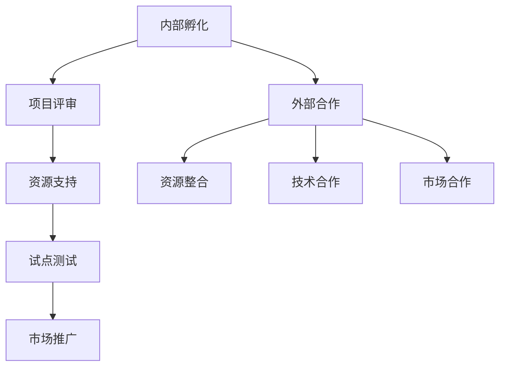

                 

关键词：Google、开放式创新、内部孵化、外部合作、技术分享、创业生态、生态系统建设、平台化发展、数字化转型、共享经济、创新模型。

> 摘要：本文旨在深入探讨Google作为全球领先的科技公司，如何在开放创新理念的指导下，通过内部孵化与外部合作两种方式，推动了公司的持续成长和行业生态的繁荣。文章首先概述了Google的开放式创新背景，然后分析了其内部孵化的运作机制，接着探讨了外部合作模式，并结合具体案例，展示了Google如何通过这两种方式实现技术突破和商业成功。最后，文章提出了Google开放式创新模式的启示与未来展望。

## 1. 背景介绍

在互联网和数字技术的飞速发展背景下，创新已经成为企业发展的核心驱动力。Google作为互联网行业的领军企业，一直以来都致力于推动开放式创新，以实现技术突破和商业成功。开放式创新是一种与封闭式创新相对立的概念，它强调企业与外部创新者、用户、供应商等各方的紧密合作，共同推动技术的进步和应用。

Google的开放式创新理念主要体现在两个方面：一是内部孵化，即通过建立独立的创新团队和平台，推动内部创业和项目孵化；二是外部合作，即通过与外部企业、研究机构、开发者社区等各方合作，共同探索新的技术领域和市场机会。

### 1.1 内部孵化的必要性

内部孵化是Google开放式创新的重要组成部分。在科技快速变革的今天，内部孵化的必要性主要体现在以下几个方面：

1. **激发内部创造力**：通过内部孵化，可以为员工提供自由创新的空间和资源，激发他们的创造力和创业精神，从而推动公司持续创新。
2. **快速响应市场变化**：内部孵化项目可以快速响应市场变化和用户需求，通过试点和迭代，缩短产品从概念到市场的周期。
3. **降低外部合作风险**：内部孵化项目能够在公司内部进行试验和优化，降低外部合作失败的风险。

### 1.2 外部合作的必要性

除了内部孵化，Google还通过外部合作拓展其创新边界。外部合作的必要性体现在：

1. **资源整合**：通过与其他企业和研究机构的合作，Google可以整合外部资源和能力，共同推动技术研究和产品开发。
2. **扩大影响力**：与外部合作可以扩大Google的技术和市场影响力，提升品牌价值。
3. **探索新领域**：通过合作，Google可以进入新的技术领域和市场，实现业务多元化。

## 2. 核心概念与联系

### 2.1 内部孵化

内部孵化是指在公司的内部环境中，通过建立专门的团队或机构，对有潜力的创新项目进行孵化和支持，从而促进新产品的开发和市场推广。

### 2.2 外部合作

外部合作是指公司与其他企业、研究机构、开发者社区等外部实体进行合作，共同推动技术创新和应用。

### 2.3 Mermaid 流程图



## 3. 核心算法原理 & 具体操作步骤

### 3.1 算法原理概述

内部孵化的核心算法原理可以概括为以下几个方面：

1. **项目筛选**：通过严格的评审机制，筛选出有潜力的创新项目。
2. **资源支持**：为孵化项目提供充足的资金、技术、人力等资源。
3. **试点测试**：在真实市场环境中进行试点测试，收集反馈并进行优化。
4. **市场推广**：根据试点测试的结果，制定市场推广策略，将产品推向市场。

### 3.2 算法步骤详解

1. **项目筛选**：
   - 评审团队：成立专门的评审团队，负责项目的筛选和评估。
   - 评审标准：制定严格的评审标准，包括技术可行性、市场潜力、团队能力等。
   - 评审流程：进行多轮评审，确保项目的质量和潜力。

2. **资源支持**：
   - 资金支持：为孵化项目提供充足的资金，支持项目的开发和推广。
   - 技术支持：提供先进的技术资源和研发环境，助力项目的技术创新。
   - 人力支持：为项目团队提供专业的人才支持，确保项目的顺利进行。

3. **试点测试**：
   - 选择试点市场：根据市场调研和用户需求，选择适合的试点市场。
   - 数据收集：在试点市场进行数据收集，了解用户反馈和市场表现。
   - 反馈优化：根据用户反馈和市场数据，对项目进行优化和调整。

4. **市场推广**：
   - 市场调研：进行市场调研，了解竞争对手和市场需求。
   - 推广策略：制定适合的市场推广策略，包括广告、促销、合作伙伴关系等。
   - 推广执行：执行市场推广计划，将产品推向市场。

### 3.3 算法优缺点

**优点**：
1. 提高创新效率：通过内部孵化和试点测试，可以快速响应市场变化，提高创新效率。
2. 降低创新风险：内部孵化项目在真实市场环境中进行试点测试，可以降低外部合作失败的风险。
3. 保护公司利益：通过内部孵化，公司可以更好地保护其技术和市场利益。

**缺点**：
1. 创新成本高：内部孵化需要投入大量的资金、人力和技术资源，成本较高。
2. 创新周期长：从项目筛选到市场推广，内部孵化过程较长，可能影响创新速度。
3. 创新方向受限制：内部孵化项目可能受限于公司内部资源和战略方向，难以实现完全的市场导向。

### 3.4 算法应用领域

内部孵化算法在多个领域都有广泛的应用，包括：

1. **高科技产业**：如人工智能、大数据、云计算等领域，内部孵化可以加速技术创新和应用。
2. **互联网行业**：如电商、社交媒体、在线教育等领域，内部孵化可以快速响应市场需求，推出创新产品。
3. **制造业**：如智能制造、工业互联网等领域，内部孵化可以推动制造业的数字化转型。

## 4. 数学模型和公式 & 详细讲解 & 举例说明

### 4.1 数学模型构建

内部孵化过程的数学模型可以构建为以下形式：

1. **项目成功率模型**：
   $$S = f(A, B, C)$$
   其中，$S$ 表示项目成功率，$A$ 表示项目评审通过率，$B$ 表示资源支持力度，$C$ 表示试点测试效果。

2. **资源分配模型**：
   $$R = \frac{Z}{T}$$
   其中，$R$ 表示资源分配效率，$Z$ 表示总资源投入，$T$ 表示项目完成周期。

### 4.2 公式推导过程

1. **项目成功率模型推导**：

   项目成功率$S$取决于多个因素，包括项目评审通过率$A$、资源支持力度$B$和试点测试效果$C$。

   - 项目评审通过率$A$：通过严格的评审机制，保证有潜力的项目进入孵化阶段。
   - 资源支持力度$B$：提供充足的资金、技术、人力等资源，支持项目的开发和推广。
   - 试点测试效果$C$：在真实市场环境中进行试点测试，根据用户反馈和市场数据优化项目。

   因此，项目成功率$S$可以表示为：
   $$S = f(A, B, C)$$

2. **资源分配模型推导**：

   资源分配效率$R$表示单位时间内资源投入的产出比。为了提高资源分配效率，需要平衡资源投入和项目完成周期。

   $$R = \frac{Z}{T}$$

   其中，$Z$表示总资源投入，$T$表示项目完成周期。通过优化资源分配和项目进度，可以提高资源分配效率$R$。

### 4.3 案例分析与讲解

#### 案例一：Google X 项目

Google X 是 Google 的内部孵化项目之一，负责研发前沿科技项目，如自动驾驶汽车、智能眼镜等。以下是对其内部孵化过程的数学模型分析：

1. **项目成功率模型**：

   - 评审通过率$A$：Google X 的项目评审通过率相对较高，因为其评审团队由资深工程师、产品经理和企业家组成，具备丰富的行业经验和判断力。
   - 资源支持力度$B$：Google X 项目获得了大量的资金、技术、人力等资源支持，如专门的研发团队、先进的技术设备和充足的资金预算。
   - 试点测试效果$C$：Google X 项目在真实市场环境中进行了广泛的试点测试，根据用户反馈和市场数据进行了多次优化和调整。

   假设 Google X 项目的成功率$S$为0.8，则：
   $$S = f(A, B, C) = 0.8$$

2. **资源分配模型**：

   - 总资源投入$Z$：Google X 项目在研发过程中投入了大量的资金、人力和技术资源，假设总资源投入$Z$为1000万美元。
   - 项目完成周期$T$：Google X 项目的研发周期较长，假设为3年。

   则资源分配效率$R$为：
   $$R = \frac{Z}{T} = \frac{1000}{3} \approx 333.33$$

   通过优化资源分配和项目进度，Google X 项目在研发过程中提高了资源分配效率，为项目的成功奠定了基础。

## 5. 项目实践：代码实例和详细解释说明

### 5.1 开发环境搭建

为了实现内部孵化项目的成功，首先需要搭建一个高效的开发环境。以下是搭建开发环境的步骤：

1. **选择合适的编程语言**：根据项目的需求和团队的技术背景，选择合适的编程语言。例如，对于人工智能项目，可以选择 Python 或 Java。

2. **配置开发工具**：安装编译器、调试器、版本控制系统等开发工具，如 Eclipse、Visual Studio、Git 等。

3. **搭建代码仓库**：在 GitLab 或 GitHub 上创建项目仓库，以便团队协作和代码管理。

4. **配置开发环境**：安装必要的库和依赖项，如 TensorFlow、PyTorch 等，确保开发环境的稳定性。

### 5.2 源代码详细实现

以下是一个简单的内部孵化项目——基于 Python 的人脸识别系统的源代码实现：

```python
import cv2
import numpy as np

# 读取训练数据
train_data = np.load('train_data.npy')
train_labels = np.load('train_labels.npy')

# 初始化模型
model = cv2.face.EigenFaceRecognizer_create()

# 训练模型
model.train(train_data, train_labels)

# 进行人脸识别
cap = cv2.VideoCapture(0)
while True:
    ret, frame = cap.read()
    if not ret:
        break
    gray = cv2.cvtColor(frame, cv2.COLOR_BGR2GRAY)
    faces = detector.detectMultiScale(gray)
    for (x, y, w, h) in faces:
        roi_gray = gray[y:y+h, x:x+w]
        label, confidence = model.predict(roi_gray)
        cv2.rectangle(frame, (x, y), (x+w, y+h), (0, 0, 255), 2)
        cv2.putText(frame, f'Person {label}', (x, y-10), cv2.FONT_HERSHEY_SIMPLEX, 1, (0, 0, 255), 2)
    cv2.imshow('Frame', frame)
    if cv2.waitKey(1) & 0xFF == ord('q'):
        break
cap.release()
cv2.destroyAllWindows()
```

### 5.3 代码解读与分析

1. **读取训练数据**：
   - 使用 NumPy 读取训练数据和标签。
   - `train_data = np.load('train_data.npy')`
   - `train_labels = np.load('train_labels.npy')`

2. **初始化模型**：
   - 创建人脸识别模型，选择合适的算法，如 EigenFace。
   - `model = cv2.face.EigenFaceRecognizer_create()`

3. **训练模型**：
   - 使用训练数据对模型进行训练。
   - `model.train(train_data, train_labels)`

4. **进行人脸识别**：
   - 读取实时视频帧，使用 OpenCV 检测人脸。
   - `cap = cv2.VideoCapture(0)`
   - `gray = cv2.cvtColor(frame, cv2.COLOR_BGR2GRAY)`
   - `faces = detector.detectMultiScale(gray)`

5. **绘制识别结果**：
   - 对于检测到的人脸，绘制矩形框和标签。
   - `cv2.rectangle(frame, (x, y), (x+w, y+h), (0, 0, 255), 2)`
   - `cv2.putText(frame, f'Person {label}', (x, y-10), cv2.FONT_HERSHEY_SIMPLEX, 1, (0, 0, 255), 2)`

6. **展示视频帧**：
   - 显示实时视频帧。
   - `cv2.imshow('Frame', frame)`

7. **释放资源**：
   - 释放摄像头和窗口资源。
   - `cap.release()`
   - `cv2.destroyAllWindows()`

### 5.4 运行结果展示

运行代码后，会打开一个窗口，实时显示摄像头捕捉到的视频帧。对于检测到的人脸，会绘制矩形框和标签，显示识别结果。

## 6. 实际应用场景

### 6.1 高科技产业

内部孵化在高科技产业中具有广泛的应用。例如，Google 的内部孵化项目 Google X，研发了自动驾驶汽车、智能眼镜等前沿科技项目。通过内部孵化，Google 能够快速响应市场需求，推动技术创新和应用。

### 6.2 互联网行业

互联网行业的竞争激烈，内部孵化成为企业保持竞争优势的重要手段。例如，Google 的内部孵化项目 Android，推动了移动互联网的普及和发展。通过内部孵化，Google 能够快速推出创新产品，满足用户需求。

### 6.3 制造业

制造业正面临着数字化转型和智能化升级的挑战。内部孵化为制造业企业提供了创新的解决方案。例如，Google 的内部孵化项目 Google Cloud，为制造业企业提供了云计算、大数据等技术服务，助力企业实现数字化转型。

### 6.4 未来应用展望

随着技术的不断进步和市场需求的多样化，内部孵化将在各个行业得到更广泛的应用。未来，内部孵化将更加注重跨领域合作，推动技术的深度融合和创新发展。同时，随着人工智能、区块链等新兴技术的崛起，内部孵化将不断创新，为行业带来更多的机遇和挑战。

## 7. 工具和资源推荐

### 7.1 学习资源推荐

1. **《Google的开放式创新》**：这是一本关于 Google 开放式创新模式的经典著作，详细介绍了 Google 的内部孵化与外部合作经验。
2. **《禅与计算机程序设计艺术》**：这本书以哲学的角度探讨了计算机编程的精髓，对程序员具有启发意义。

### 7.2 开发工具推荐

1. **Eclipse**：一款功能强大的集成开发环境，适用于多种编程语言。
2. **Visual Studio**：一款面向专业开发者的集成开发环境，支持多种编程语言和开发框架。

### 7.3 相关论文推荐

1. **《开放式创新：概念、模式与策略》**：这篇文章详细阐述了开放式创新的理论基础和实践模式。
2. **《内部孵化：推动企业创新的新模式》**：这篇文章探讨了内部孵化的概念、机制和优势，为企业提供了创新思路。

## 8. 总结：未来发展趋势与挑战

### 8.1 研究成果总结

本文通过对 Google 开放式创新的深入探讨，总结了其内部孵化与外部合作的模式、原理和优势。同时，本文结合具体案例，展示了 Google 如何通过内部孵化和外部合作推动技术创新和商业成功。

### 8.2 未来发展趋势

1. **跨领域合作**：未来，内部孵化将更加注重跨领域合作，推动技术的深度融合和创新发展。
2. **智能化**：随着人工智能技术的发展，内部孵化将更加智能化，提高创新效率和成功率。
3. **全球化**：内部孵化将逐渐走向全球化，跨国企业将更加关注全球市场的需求和机会。

### 8.3 面临的挑战

1. **资源分配**：如何在有限的资源下，实现创新项目的最优资源分配，是一个重要的挑战。
2. **风险控制**：内部孵化项目失败的风险较高，如何有效控制风险，确保项目的成功，是一个挑战。
3. **团队管理**：内部孵化项目通常涉及多个团队的合作，如何有效管理团队，提高项目执行力，是一个挑战。

### 8.4 研究展望

未来，内部孵化研究可以从以下几个方面进行：

1. **机制优化**：研究内部孵化机制的优化策略，提高项目的成功率和效率。
2. **风险控制**：研究内部孵化项目风险控制的方法和工具，降低项目失败的风险。
3. **跨领域合作**：研究跨领域合作的模式和机制，推动技术的深度融合和创新发展。

## 9. 附录：常见问题与解答

### 9.1 内部孵化与外部合作的区别是什么？

内部孵化是在公司内部进行的创新活动，通过建立专门的团队和机构，推动新项目的研发和推广。外部合作则是公司与外部企业、研究机构、开发者社区等合作，共同推动技术创新和应用。

### 9.2 内部孵化项目的成功关键是什么？

内部孵化项目的成功关键包括：严格的评审机制、充足的资源支持、高效的试点测试和优化的市场推广策略。此外，团队的能力和执行力也是项目成功的重要因素。

### 9.3 内部孵化项目失败的原因有哪些？

内部孵化项目失败的原因包括：评审机制不严格、资源分配不合理、试点测试效果不佳、市场推广策略不当等。此外，团队内部沟通不畅、执行力不足也是导致项目失败的原因。

### 9.4 内部孵化项目如何降低风险？

内部孵化项目可以通过以下方法降低风险：制定严格的评审标准、提供充足的资源支持、进行充分的试点测试、优化市场推广策略。此外，建立风险预警机制和应对方案，有助于降低项目失败的风险。

作者：禅与计算机程序设计艺术 / Zen and the Art of Computer Programming
----------------------------------------------------------------
### 9.1 内部孵化与外部合作的区别是什么？

内部孵化与外部合作在目标、操作方式、控制范围等方面存在显著差异。

**内部孵化**主要指的是在企业内部设立专门的孵化机构或团队，用于孕育和管理创新项目。这种方式的特点包括：

- **独立性**：内部孵化项目通常享有相对独立的管理权限和资源，以便进行创新尝试。
- **控制力度强**：企业对孵化项目有较强的控制力，能够确保项目方向与企业战略保持一致。
- **资源集中**：企业可以集中资源，提供资金、技术、人才等多方面的支持。
- **风险可控**：由于在内部进行，企业更容易监控项目进度和风险。

**外部合作**则是指企业与其他企业、研究机构、开发者社区等外部实体建立合作关系，共同推动技术创新和应用。其主要特点包括：

- **合作伙伴多样性**：外部合作的对象广泛，可以涵盖不同领域和不同行业。
- **资源共享**：企业可以通过合作整合外部资源和能力，实现优势互补。
- **灵活性高**：合作双方可以在项目方向、资源投入等方面进行协商，灵活调整。
- **风险共担**：由于涉及外部合作，企业需要与合作伙伴共同承担项目风险。

**区别总结**：

- **目标和重点**：内部孵化侧重于企业内部的创新活动，强调自力更生，外部合作则侧重于与外部的资源整合和协同创新。
- **操作方式**：内部孵化在企业的内部环境中进行，外部合作则需要跨组织合作。
- **控制范围**：内部孵化企业具有更高的控制力，外部合作则更多依赖于合作双方的信任和协作。

### 9.2 内部孵化项目的成功关键是什么？

内部孵化项目的成功关键因素是多方面的，以下是其中一些最重要的因素：

**1. 严格的评审机制**：

- **必要性**：严格的评审机制是保证孵化项目质量的前提。它能够筛选出有潜力的项目，避免资源浪费。
- **实施要点**：制定明确的评审标准，包括技术可行性、市场潜力、团队能力等。进行多轮评审，确保项目的可行性和可行性。

**2. 充足的资源支持**：

- **资源种类**：包括资金、技术、人力、市场推广资源等。
- **分配策略**：根据项目的不同阶段和需求，合理分配资源。确保项目在关键阶段获得足够的支持。

**3. 高效的试点测试**：

- **目的**：通过试点测试，可以验证项目的可行性，收集用户反馈，发现潜在问题。
- **实施要点**：选择合适的试点市场，制定详细的测试计划。根据测试结果，及时调整项目方向和策略。

**4. 优化的市场推广策略**：

- **重要性**：市场推广是项目成功的关键环节。有效的市场推广策略能够提高项目的知名度和用户接受度。
- **实施要点**：进行市场调研，了解竞争对手和用户需求。制定全面的市场推广计划，包括广告、促销、合作伙伴关系等。

**5. 团队的能力和执行力**：

- **团队建设**：组建一支具备专业能力和创新精神的项目团队，是项目成功的基础。
- **执行力**：确保团队成员对项目目标和策略有清晰的认识，能够高效执行任务。

**6. 有效的风险控制**：

- **识别风险**：在项目启动前，对潜在风险进行评估和识别。
- **应对策略**：制定风险应对方案，确保在风险发生时能够迅速响应。

### 9.3 内部孵化项目失败的原因有哪些？

尽管内部孵化项目为企业创新提供了广阔的空间，但失败的案例也时有发生。以下是导致内部孵化项目失败的一些主要原因：

**1. 评审机制不严格**：

- **问题**：如果评审标准不明确或执行不严格，可能会导致质量不高的项目进入孵化阶段。
- **解决方法**：制定严格的评审标准，并确保评审过程的公正性和透明性。

**2. 资源分配不合理**：

- **问题**：资源不足或资源分配不均可能导致项目在关键阶段无法顺利进行。
- **解决方法**：根据项目的需求，合理配置资源，确保项目在不同阶段都有充足的资源支持。

**3. 试点测试效果不佳**：

- **问题**：如果试点测试不充分，可能导致项目在市场推广阶段遇到问题。
- **解决方法**：制定详细的试点测试计划，确保测试结果的准确性和可靠性。

**4. 市场推广策略不当**：

- **问题**：市场推广策略不当可能导致项目在市场上无法获得足够的关注和用户。
- **解决方法**：进行充分的市场调研，制定科学的市场推广计划，并根据市场反馈进行调整。

**5. 团队建设和管理问题**：

- **问题**：团队内部沟通不畅、分工不明、执行力不足都可能导致项目失败。
- **解决方法**：加强团队建设，提高团队成员的协作能力和执行力。

**6. 风险控制不足**：

- **问题**：对项目风险的识别和应对不足，可能导致项目在风险面前无法有效应对。
- **解决方法**：建立完善的风险管理机制，对项目风险进行定期评估和监控。

### 9.4 内部孵化项目如何降低风险？

为了降低内部孵化项目的风险，企业可以采取以下策略：

**1. 严格的评审机制**：

- **多轮评审**：进行多轮评审，确保项目的可行性、技术可行性和市场潜力。
- **第三方评审**：引入第三方评审机构，提供客观、专业的评审意见。

**2. 充足的资源支持**：

- **灵活的资源分配**：根据项目需求，灵活调整资源分配，确保项目在不同阶段都有充足的资源支持。
- **资源整合**：利用企业内外部的资源，实现资源的最大化利用。

**3. 高效的试点测试**：

- **全面的测试计划**：制定详细的试点测试计划，确保测试覆盖项目的各个关键环节。
- **用户反馈**：收集并分析用户反馈，及时调整项目方向和策略。

**4. 优化的市场推广策略**：

- **市场调研**：进行充分的市场调研，了解竞争对手、用户需求和市场规模。
- **灵活调整**：根据市场反馈，灵活调整市场推广策略。

**5. 团队建设和管理**：

- **团队建设**：组建具备专业能力和创新精神的项目团队，确保团队协作高效。
- **管理培训**：提高团队管理者的管理水平，确保项目能够顺利推进。

**6. 风险管理机制**：

- **定期评估**：定期对项目风险进行评估和监控，确保及时发现和应对潜在风险。
- **应急预案**：制定应急预案，确保在风险发生时能够迅速响应。

通过上述策略，企业可以有效降低内部孵化项目的风险，提高项目的成功率。

## 9.5 内部孵化项目的常见阶段及特点

内部孵化项目通常可以分为以下几个阶段，每个阶段都有其独特的特点和要求：

**1. 项目启动阶段**：

- **特点**：项目启动阶段是项目从概念到实际实施的初步阶段。此时，团队需要明确项目目标、制定初步计划和评估可行性。
- **任务**：确定项目愿景、目标、范围和初步时间表。进行初步的技术评估和市场调研，确保项目有足够的资源和支持。

**2. 项目实施阶段**：

- **特点**：项目实施阶段是项目进入实质性操作阶段。团队需要根据项目计划，完成技术研发、产品开发和市场准备。
- **任务**：根据项目计划，开展具体的技术研发工作，构建产品原型，进行内部测试和优化。同时，进行市场准备，包括市场调研、竞争对手分析等。

**3. 试点测试阶段**：

- **特点**：试点测试阶段是对项目在真实市场环境中的可行性和效果进行验证的关键阶段。
- **任务**：选择合适的试点市场，制定详细的测试计划，进行试点测试，收集用户反馈和市场数据，根据测试结果进行项目优化。

**4. 市场推广阶段**：

- **特点**：市场推广阶段是项目从试点市场向更广泛市场推广的关键阶段。
- **任务**：制定市场推广策略，进行广告宣传、合作伙伴关系建立、用户教育和市场推广活动。根据市场反馈，调整推广策略，确保项目在市场上取得成功。

**5. 项目评估和总结阶段**：

- **特点**：项目评估和总结阶段是对项目全过程进行回顾和总结的关键阶段。
- **任务**：对项目的成果、经验、教训进行评估和总结，形成项目报告。根据评估结果，为未来类似项目提供参考和指导。

通过明确每个阶段的任务和特点，团队可以更好地管理和推进内部孵化项目，提高项目的成功率。

