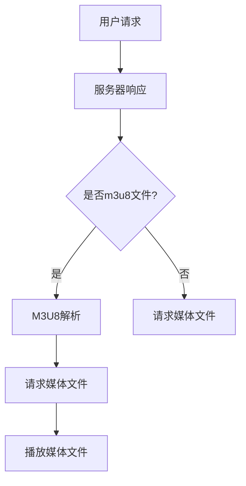

                 

关键词：HLS流媒体，m3u8协议，流媒体应用，优化策略，直播传输

> 摘要：本文将深入探讨HLS流媒体技术，特别是m3u8协议的应用和优化。通过介绍HLS的基本概念、m3u8协议的工作原理及其关键技术，我们将解析HLS流媒体的优势与挑战，并提出一系列优化策略，旨在提升流媒体传输的效率与用户体验。文章还将结合实际项目实例，详细解释m3u8协议的实现过程，并对未来的应用前景进行展望。

## 1. 背景介绍

随着互联网技术的飞速发展，流媒体技术已经成为视频内容传输的主流方式。流媒体技术允许用户在下载整个文件之前就开始观看视频内容，从而提高了观看体验。HLS（HTTP Live Streaming）是由苹果公司开发的一种流媒体传输协议，已经成为直播和点播领域的标准之一。m3u8文件是HLS的核心组成部分，用于描述媒体文件的播放列表和播放顺序。

### 1.1 HLS的历史与发展

HLS最早由苹果公司在2009年推出，旨在解决不同终端设备之间的兼容性问题。传统的流媒体传输协议如RTMP和RTSP在跨平台传输时存在一定的限制。HLS通过将视频内容分割成小片段，并使用HTTP协议进行传输，实现了更好的兼容性和灵活性。此后，HLS迅速得到了业界的认可，并在多个平台和设备上得到了广泛应用。

### 1.2 m3u8文件的作用

m3u8文件是HLS的核心组成部分，它包含了播放列表（Playlist）和媒体文件（Media File）的元数据。播放列表定义了媒体文件的播放顺序和播放时间，而媒体文件则包含了实际的音视频数据。m3u8文件通过特定的编码格式（如Base64）进行传输，保证了数据的安全性和完整性。

## 2. 核心概念与联系

为了更好地理解HLS流媒体的工作原理，我们需要了解其核心概念和组成部分。

### 2.1 HLS的工作原理

HLS流媒体的工作原理可以分为以下几个步骤：

1. **切片生成**：视频内容被分割成一系列小的媒体文件（通常为TS文件）。
2. **编码参数**：每个媒体文件使用特定的编码参数进行编码，如H.264视频编码和AAC音频编码。
3. **生成m3u8文件**：将这些媒体文件的组织信息写入m3u8文件中，包括播放列表和媒体文件的URL。
4. **请求与传输**：客户端请求m3u8文件，并根据m3u8文件中的信息逐个请求媒体文件，进行流式播放。

### 2.2 m3u8协议的组成

m3u8文件主要由两部分组成：播放列表（Playlist）和媒体文件（Media File）。

- **播放列表（Playlist）**：播放列表定义了媒体文件的播放顺序和时间点。播放列表可以分为两层：**Master Playlist**（主播放列表）和**Media Playlist**（媒体播放列表）。主播放列表包含了所有媒体播放列表的引用，而媒体播放列表包含了具体的媒体文件信息。
  
- **媒体文件（Media File）**：媒体文件是实际的音视频数据，通常以TS文件格式存储。每个媒体文件包含了固定长度的数据块，这些数据块按照特定的顺序排列，以便客户端可以逐个请求并播放。

### 2.3 Mermaid流程图

以下是HLS流媒体的工作流程的Mermaid流程图：



## 3. 核心算法原理 & 具体操作步骤

### 3.1 算法原理概述

HLS的核心算法原理主要涉及视频内容的切片和编码。视频内容首先被分割成一系列的媒体文件（TS文件），然后这些文件被组织成m3u8文件。在客户端请求m3u8文件后，客户端根据m3u8文件中的信息逐个请求媒体文件，并进行播放。

### 3.2 算法步骤详解

以下是HLS流媒体的核心算法步骤：

1. **视频内容分割**：将视频内容分割成一系列的媒体文件（TS文件），每个文件通常包含2秒的视频内容。
2. **编码参数设置**：为每个媒体文件设置编码参数，如H.264视频编码和AAC音频编码。
3. **生成m3u8文件**：将分割后的媒体文件组织成m3u8文件，包括播放列表和媒体文件的URL。
4. **客户端请求**：客户端请求m3u8文件，并根据m3u8文件中的信息逐个请求媒体文件。
5. **播放与缓冲**：客户端收到媒体文件后，进行播放并设置缓冲区，以便在播放过程中能够连续播放。

### 3.3 算法优缺点

- **优点**：
  - **兼容性强**：HLS协议基于HTTP协议，可以跨平台、跨设备传输。
  - **灵活性强**：HLS支持自适应流，可以根据网络带宽自动调整播放质量。
  - **安全性高**：HLS使用Base64编码，保证了数据传输的安全性和完整性。
  
- **缺点**：
  - **延迟较高**：由于HLS需要先下载m3u8文件，再逐个下载媒体文件，因此存在一定的延迟。
  - **资源消耗较大**：HLS协议需要大量的服务器资源来存储和传输媒体文件。

### 3.4 算法应用领域

HLS协议主要应用于直播和点播领域，如在线视频平台、直播平台等。以下是一些典型的应用场景：

- **在线视频平台**：如YouTube、Vimeo等，使用HLS协议进行视频内容的传输。
- **直播平台**：如Twitch、斗鱼等，使用HLS协议进行直播内容的传输。
- **移动应用**：如短视频应用、直播应用等，使用HLS协议进行内容的传输。

## 4. 数学模型和公式 & 详细讲解 & 举例说明

HLS流媒体的核心算法涉及多个数学模型和公式，以下是其中两个主要的数学模型及其推导过程。

### 4.1 数学模型构建

#### 4.1.1 切片时间间隔

HLS流媒体中，每个切片的时间间隔是固定的。假设每个切片的时间间隔为`T`秒，则切片的个数`N`可以表示为：

$$ N = \frac{L}{T} $$

其中，`L`为视频的总时长。

#### 4.1.2 数据传输量

假设每个切片的大小为`S`字节，则总的数据传输量`D`可以表示为：

$$ D = N \times S $$

### 4.2 公式推导过程

#### 4.2.1 切片时间间隔

根据视频总时长`L`和切片个数`N`的关系，我们可以推导出切片的时间间隔`T`：

$$ T = \frac{L}{N} $$

代入`N = \frac{L}{T}`，得到：

$$ T = \sqrt{L} $$

#### 4.2.2 数据传输量

假设每个切片的大小为`S`字节，则总的数据传输量`D`可以表示为：

$$ D = N \times S $$

代入`N = \frac{L}{T}`，得到：

$$ D = \frac{L}{T} \times S $$

将`T = \sqrt{L}`代入，得到：

$$ D = \sqrt{L} \times S $$

### 4.3 案例分析与讲解

假设一个视频的总时长为`3600`秒，每个切片的大小为`1500`字节。根据上述公式，我们可以计算出：

- 切片时间间隔`T`：

$$ T = \sqrt{3600} = 60 \text{秒} $$

- 数据传输量`D`：

$$ D = \sqrt{3600} \times 1500 = 30000 \text{字节} $$

这意味着，整个视频的数据传输量约为`30000`字节，每个切片的时间间隔为`60`秒。

## 5. 项目实践：代码实例和详细解释说明

### 5.1 开发环境搭建

在本节中，我们将使用Python编写一个简单的HLS流媒体服务器。为了实现这个目标，我们需要安装以下依赖：

- `Flask`：一个Python Web框架，用于构建Web服务器。
- `ffmpeg`：一个视频处理工具，用于将视频内容分割成TS文件。

首先，确保你的Python环境已经安装，然后通过pip命令安装上述依赖：

```bash
pip install Flask
```

接下来，你需要安装`ffmpeg`。可以从[ffmpeg官网](https://ffmpeg.org/download.html)下载适用于你操作系统的版本，并按照说明进行安装。

### 5.2 源代码详细实现

以下是简单的HLS流媒体服务器代码：

```python
from flask import Flask, send_file
import subprocess

app = Flask(__name__)

@app.route('/stream.m3u8')
def stream():
    return send_file('stream.m3u8', mimetype='application/vnd.apple.mpegurl')

@app.route('/segment.ts')
def segment():
    return send_file('segment.ts', mimetype='video/MP2T')

@app.route('/start')
def start_stream():
    subprocess.run(['ffmpeg', '-i', 'input.mp4', '-codec:v', 'h264', '-codec:a', 'aac', '-f', 'hls', 'stream.m3u8'])

if __name__ == '__main__':
    app.run(debug=True)
```

### 5.3 代码解读与分析

#### 5.3.1 Flask服务器

代码中的`Flask`框架用于构建一个简单的Web服务器。`app`对象是一个Flask应用实例，`@app.route`装饰器用于定义路由。

- `/stream.m3u8`：这是主播放列表的URL，客户端会请求这个文件来获取媒体文件的播放顺序。
- `/segment.ts`：这是媒体文件的URL，客户端会请求这个文件进行播放。

#### 5.3.2 HLS文件生成

`start_stream`函数使用`subprocess`模块调用`ffmpeg`命令，将输入视频文件（`input.mp4`）分割成TS文件，并生成m3u8文件。

```bash
ffmpeg -i input.mp4 -codec:v h264 -codec:a aac -f hls stream.m3u8
```

这里，`-codec:v h264`指定视频编码格式为H.264，`-codec:a aac`指定音频编码格式为AAC，`-f hls`指定输出格式为HLS。

### 5.4 运行结果展示

在本地服务器上运行此代码，然后在浏览器中访问`http://localhost:5000/stream.m3u8`，你应该能看到HLS流媒体的播放界面。点击播放，你将能够看到视频内容开始播放。

## 6. 实际应用场景

HLS流媒体技术在实际应用中有着广泛的应用，以下是一些典型的应用场景：

### 6.1 在线视频平台

在线视频平台如YouTube、Vimeo等广泛使用HLS协议进行视频内容的传输。这种协议的兼容性强和自适应流特性使得视频内容可以在各种设备上流畅播放。

### 6.2 直播平台

直播平台如Twitch、斗鱼等也使用HLS协议进行直播内容的传输。直播内容通常具有高带宽需求，而HLS协议的自适应流特性能够根据用户网络带宽自动调整播放质量，从而保证观看体验。

### 6.3 移动应用

移动应用如短视频应用、直播应用等也广泛使用HLS协议。移动设备的网络环境和硬件性能多样，HLS协议的兼容性和自适应流特性能够提供良好的观看体验。

### 6.4 网络电视

网络电视（Over-the-Top，OTT）服务如Netflix、Amazon Prime Video等也采用HLS协议进行内容传输。这些服务需要提供高质量的观看体验，同时还要考虑不同设备和网络环境的兼容性。

## 7. 工具和资源推荐

### 7.1 学习资源推荐

- 《HTTP Live Streaming (HLS)Overview》：苹果公司提供的HLS协议概述，适合初学者了解HLS的基本概念。
- 《HLS实战：从入门到精通》：一本关于HLS流媒体技术的实践指南，涵盖了HLS的各个方面。

### 7.2 开发工具推荐

- `ffmpeg`：一个功能强大的视频处理工具，用于生成HLS流媒体文件。
- `hls.js`：一个开源的HLS播放器库，可以用于Web和移动应用中。

### 7.3 相关论文推荐

- "HTTP Live Streaming (HLS) Protocol"，苹果公司的官方论文，详细介绍了HLS协议的工作原理。
- "Adaptive Streaming over HTTP"，IEEE论文，讨论了自适应流媒体传输技术的最新进展。

## 8. 总结：未来发展趋势与挑战

### 8.1 研究成果总结

HLS流媒体技术在过去的几年中取得了显著的成果。其兼容性强、自适应流特性以及高效的数据传输机制使得HLS成为视频流媒体传输的行业标准。同时，随着视频内容的不断增加和用户需求的提升，HLS协议也在不断优化和改进。

### 8.2 未来发展趋势

未来，HLS流媒体技术将继续朝着以下几个方向发展：

- **更高清的视频质量**：随着视频编码技术的进步，HLS将支持更高清、更高效的视频编码格式，如H.265。
- **更智能的自适应流**：通过结合人工智能和机器学习技术，HLS将能够更准确地预测用户网络带宽，提供更流畅的观看体验。
- **跨平台整合**：随着各种设备和平台的不断发展，HLS将更加注重跨平台的整合和兼容性，以满足不同用户的需求。

### 8.3 面临的挑战

尽管HLS流媒体技术在过去取得了显著的成果，但未来仍面临一些挑战：

- **带宽需求**：随着视频质量和观看人数的增加，带宽需求也在不断增长。如何高效利用带宽，提供高质量的流媒体服务，将成为一个重要的挑战。
- **加密与安全**：随着流媒体内容的价值不断提升，内容加密和安全问题变得越来越重要。如何在保证高效传输的同时，确保内容的安全性，是一个亟待解决的挑战。
- **全球部署**：由于不同国家和地区的网络环境和监管政策不同，如何在全球范围内部署HLS流媒体服务，提供统一的观看体验，也是一个重要的挑战。

### 8.4 研究展望

未来，HLS流媒体技术的研究将集中在以下几个方面：

- **新型视频编码技术**：如H.265、AV1等，以提高视频质量和传输效率。
- **智能传输策略**：结合人工智能和机器学习技术，实现更智能的自适应流传输。
- **内容安全与加密**：研究更高效、更安全的加密和版权保护技术，保障内容的安全性和版权。

## 9. 附录：常见问题与解答

### 9.1 什么是HLS？

HLS（HTTP Live Streaming）是一种流媒体传输协议，由苹果公司开发，用于在互联网上传输音视频内容。它通过将视频内容分割成小片段，并使用HTTP协议进行传输，实现了跨平台、跨设备的兼容性。

### 9.2 m3u8文件有什么作用？

m3u8文件是HLS流媒体的核心组成部分，用于描述媒体文件的播放列表和播放顺序。它包含了媒体文件的URL、播放时间等信息，客户端根据m3u8文件的信息逐个请求媒体文件进行播放。

### 9.3 HLS与RTMP的区别是什么？

HLS和RTMP都是流媒体传输协议，但它们有一些关键区别：

- **传输协议**：HLS基于HTTP协议，而RTMP基于Adobe RTMP协议。
- **兼容性**：HLS具有更好的跨平台兼容性，而RTMP主要应用于Adobe Flash平台。
- **延迟**：HLS由于需要先下载m3u8文件，存在一定的延迟，而RTMP传输延迟较低。

### 9.4 如何优化HLS流媒体传输？

优化HLS流媒体传输可以从以下几个方面进行：

- **自适应流**：根据用户网络带宽自动调整播放质量。
- **缓存策略**：合理设置缓存时间，提高播放流畅性。
- **服务器优化**：提高服务器带宽和性能，减少传输延迟。
- **内容加密**：使用加密技术保障内容安全。

### 9.5 HLS适合哪些应用场景？

HLS适合以下应用场景：

- **在线视频平台**：如YouTube、Vimeo等，提供跨平台、跨设备的视频内容传输。
- **直播平台**：如Twitch、斗鱼等，提供高质量的直播内容传输。
- **移动应用**：如短视频应用、直播应用等，提供良好的观看体验。

## 作者署名

作者：禅与计算机程序设计艺术 / Zen and the Art of Computer Programming

